+++
slug = "2023081201"
date = "2023-08-12"
lastmod = "2023-08-19"
title = "我的2023暑假青岛3天2晚旅游体验和感受"
description = "2023年暑假青岛旅游结束了，小朋友和老人都觉得很不错，很期待明年暑假的旅游。其中原因我总结下来可能主要包括游玩时间的轻松度、天气气候、居住体验、游玩地点新颖度等方面。旅游中我拍了一些照片，带着我本人旅游体验的感受，相约和大家见面……"
image = "00-01.jpg"
#image = "https://picsum.photos/id/56/2000/400.jpg"
tags = [ "青岛", "旅游", "暑假" ]
categories = [ "点滴生活" ]
+++

附：我的青岛旅游计划参见之前的文章：[我的2023暑假青岛3天2晚旅游计划](https://ntopic.cn/p/2023072301/)

本文主要分享一下我的旅游体验和个人感受，纯属个人主观感觉，若有失偏颇，请留言或者发邮件给我，非常感谢~

## 总体体验感觉：很不错
先上总结，后面在详细介绍，如果还没有去过青岛的网友，看看总结和后面的详细介绍，我期望能有一些帮助：

- 3天2晚时间比较充裕：去之前和去之后都有朋友问我，总共3天2晚的时间，在刨去来回路上的时间，最多不超过2天半的旅游时间，时间是不是不够、是不是很赶？本次旅游我带着2个老人和2个小孩，肯定不能太赶；并且根据实际情况（我的住宿地点、我的往返时间和我的旅游路线，下面均会逐一提到），小孩和老人都感觉不累，时间应该是比较充裕，青岛之旅应该是足够了。
- 青岛服务人员都非常热情有耐心（包括酒店工作人员、地铁工作人员和旅游景点工作人员），他们的服务态度感觉非常舒服：不管是买票、咨询和问路，感觉他们都非常热情有耐心，标准的普通话，称谓里基本没有你，基本都是您或者先生（我是男的），听着舒服，也感觉到不耐烦的情绪。我一直在想，他们的这种良好的服务态度，是不是因为目前处于暑假旅游旺季，接待的都是外地游客，青岛政府部门是不是进行了专门的培训？
- 地铁和公交很方便，去旅游景点基本用不着打车：我去之前还担心打车会被黑，还特意在网上找了打车攻略（网上推荐是高德打车，万一被黑有投诉之地），结果到了青岛基本是坐地铁和步行。为啥是基本呢，因为去金沙滩不想等公交车，打了一个黑车，讲好了价钱，根本没有被黑，并且师傅还很热情；其他旅游景点就全部是地铁和步行了。
- 吃的地方较少，海鲜店并没有想象中的多，价格也并是很便宜：可能是我不擅长觅食，去了青岛后，发现旅游景点吃饭的地特别少（可以说基本没有），我们吃饭基本是点外卖。整个旅程总共吃了一顿海鲜，并不便宜（同样是海边城市，感觉比福建霞浦的海鲜要贵太多了，有小又贵）。
- 其他的，关于旅游景点和一些注意事项，在这里统一列一下：
  - 个人物品注意事项：带瓶装的液体不要超过100ML，我带了一瓶380ML防蚊药，结果在回来时禁止上高铁；同时带好防晒霜，主要是小朋友穿着泳衣游泳，防止晒黑，建议也不要超过100ML。
  - 旅游景点注意事项：<big>海军博物馆</big>一定要提前一周预约，网上说海军博物馆特别震撼，我也很期待，但是到了门口发现需要预约而没有去处，比较遗憾，微信小程序搜索中国人民解放军海军博物馆小程序中心预约即可；<big>五四广场</big>建议晚上去，确实很美，五四广场和四周的高楼大厦融为一体，感觉比较震撼；<big>海底世界</big>感觉一般，也没有特别之处，和一般的海底公园没有差异；<big>八大关风景区</big>还以为能看到城墙和关隘，其实就是海边的几条街的名字，纯街（没啥商场、商店等），可能是个人见识有限，实在看不出这些街有啥特别之处，特别是带了小朋友或者老人的，走完这几条街，估计会很累，所以个人建议忽略；<big>第二海水浴场</big>真的很小，也可以忽略，厕所特别的脏，进去一股臭味，小朋友憋着尿要去上厕所，打开门后又跑了出来，说太脏了不敢上，我也上了一次，具体情形就不说了，用恶心两个字来形容感觉一点都不为过。

## 我的旅游路线详细介绍
下面详细介绍我本次旅游的整个行程，如果网友们已经做好了自己的攻略，也可以参考参考，期望能有所帮助。

### 往返交通工具：时间比较充裕
去交通：上海火车站（08:41） -> 青岛站（14:25）

返交通：青岛北站（15:47） -> 上海火车站（21:04）

| <big>早上去青岛时间不赶</big> | <big>下午回上海时间不赶</big> |
| ------------------------- | -------------------------- |
| 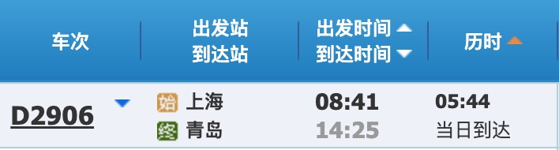            |              |

### 住宿：可加床，热情，干净整洁
地点：维也纳国际酒店·山东青岛火车站东站广场栈桥店

住宿：豪华双床房，因为带了2个小朋友，还加了一张床。加床是气垫床，100元1晚，送1张早餐券，入住当天早上9点之后打电话到前台告知需要加床即可

早餐：39元一位，小朋友1.2米以下免费，1.2米~1.4米半价；早餐还算丰富，我比较喜欢爆炒花蛤，早上都需要吃一小盘😊

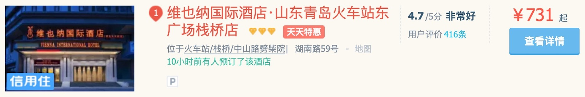

### 日常饮食：店少，海鲜贵，靠外卖
可能是由于我一直在景点和我住宿地方的原因，感觉餐饮店很少，海鲜店更少，不像福建霞浦，海鲜店和大排档还是挺多的。

第1天到青岛，兴致满满去找海鲜店，想吃顿海鲜，毕竟来了沿海城市青岛了，心想海鲜肯定便宜又实惠，结果我就有点失望了。

海鲜店：鱻赑海鲜店

老板推荐海鲜大咖，鉴于我们人数（3大2小），老板推荐258元的海鲜中咖套餐。

从表面上看，样式还是很多的，有海星、生蚝、鲍鱼、虾、扇贝、花蛤、海螺、螃蟹等，但是都很小（注意：盘子底下全是豆芽）！

后面由于呆在景点较多，吃饭基本是靠店外卖了，本次旅程饿了么app还真帮我大忙！

| <big>满墙的菜单</big> | <big>端上来的海鲜</big> |
| ------------------- | --------------------- |
| 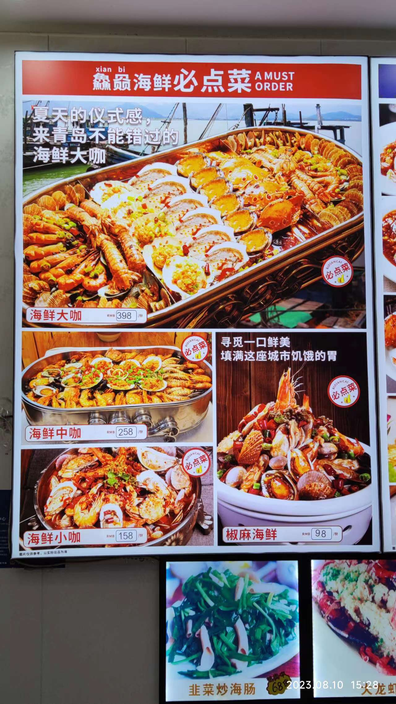      | 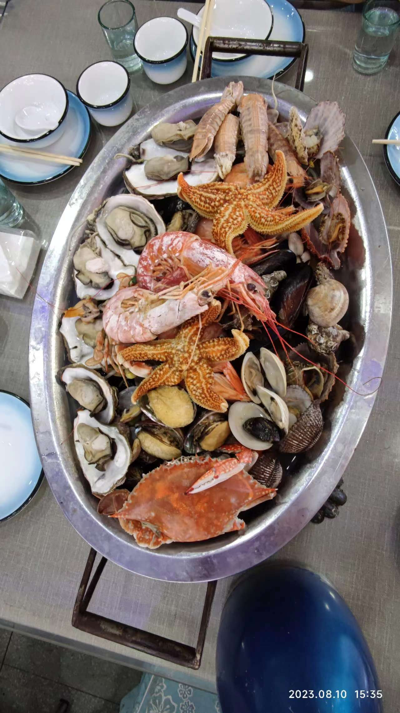        |

## 第1天：栈桥、第一海水浴场、五四广场
小遗憾：由于不知道海军博物馆需要提前预约，结果没有进不去。想要去的网友们，记得提前一周预约！

### 栈桥：免费，达不到优美浪费水准
看网上攻略，栈桥优美又浪漫：碧蓝的海水、白花花的海浪、如棉花糖般的白云、偶尔略过头顶的海鸥、轻微的海风和飘逸的拍婚纱照情侣等

- 栈桥上：人挤人，完全感觉不到优美和浪漫！

| <big>栈桥人多</big> | <big>栈桥人真多</big> |
| ----------------- | -------------------- |
|     | 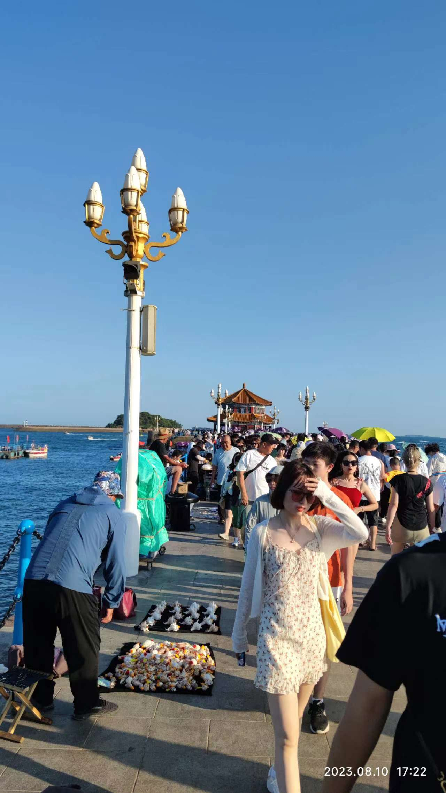       |

- 栈桥海水浴场：最好穿上厚底鞋，小心脚底划伤；同时祈祷自己不要摔倒，否则遍体鳞伤！

| <big>栈桥海滩</big> | <big>栈桥海滩</big> |
| ----------------- | ------------------ |
| 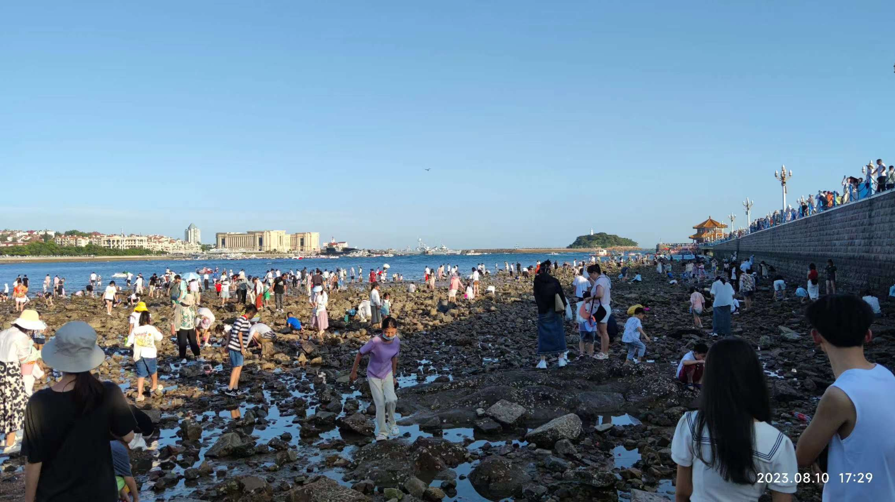    |      |

### 第一海水浴场：免费，人多拥挤
看过了栈桥的海滩，在来看第一海水浴场的沙滩，幸福感一下子就提升上来了。沙子比较细腻，但是沙滩较短，人多且公共设施小，上个厕所都需要排队，还没有免费洗脚洗沙的地方。

| <big>告示牌</big> | <big>海滩</big> |
| ---------------- | -------------- |
| 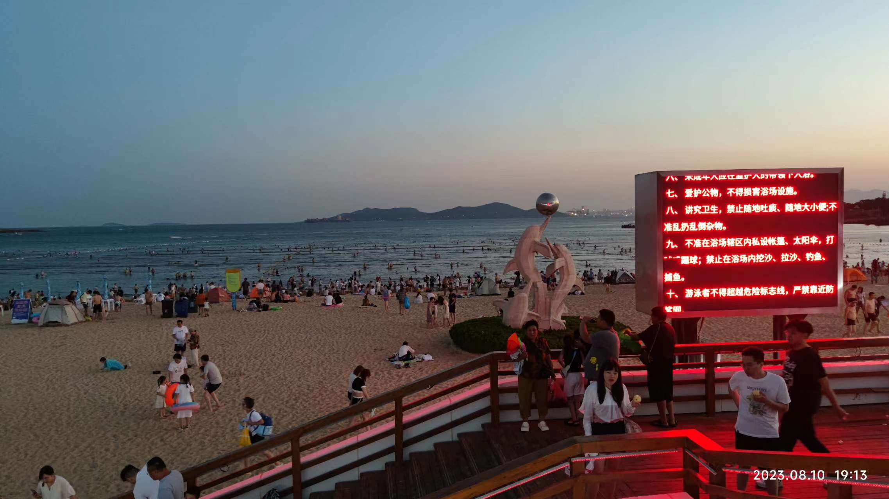   | 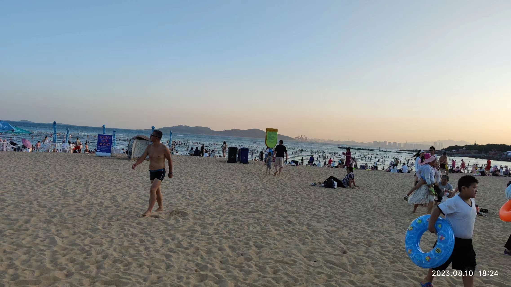 |

### 五四广场：免费，优美震撼
我本来以为五四广场就是一个普通的广场、一个圆形花坛、中间一座火炬形雕塑的普通广场而已，但是去之后我发现我错了：广场依海而建，一面是海，另一面是高楼大厦；火炬循环变色，红紫粉等；高楼大厦的墙体全是液晶面板，上面循环播放动画，且不同大厦的面板的动画画面连接在一起。

可以想象，青岛政府在五四广场花了不少心思，也花费了不菲的资金，为了纪念五四运动和青年们，我认为是值得的！

特别抱歉：由于我拍的照片大多为家人合影，加上手机拍照效果也不好，因此纯景照片没有拍几张，因此只能截取几张照片了。

| <big>红色火炬</big> | <big>紫色火炬</big> |
| ----------------- | ------------------ |
| 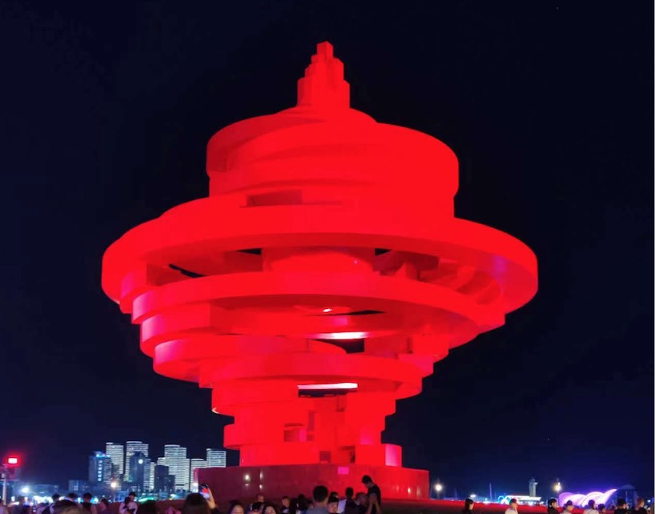    | 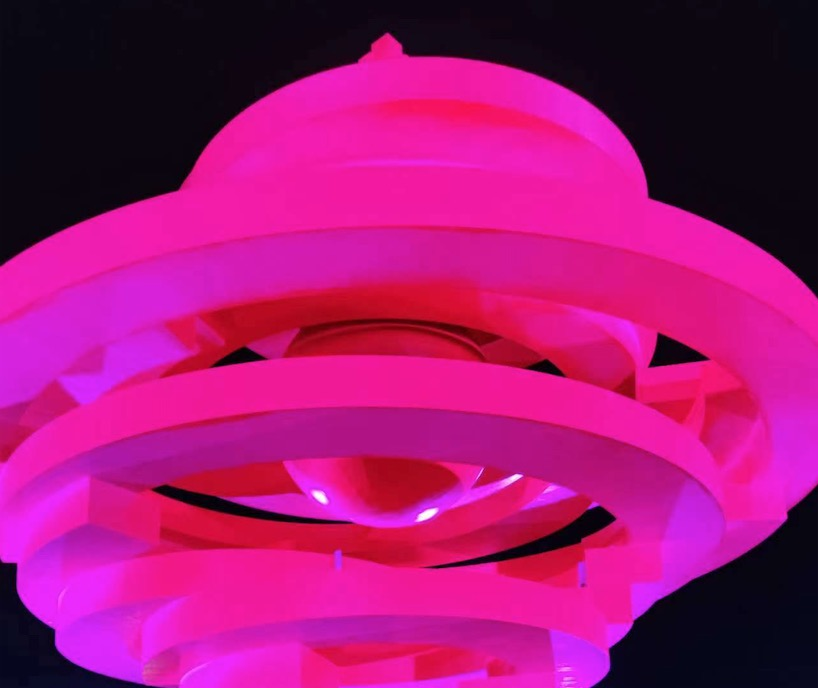     |

## 第2天：海底世界、八大关风景区/第二海水浴场、石老人海水浴场

### 海底世界：特色不足，价格稍贵，劝退
感觉很一般，没有眼前一亮的特色，虽然有个美人鱼表演，但是完全没有必要去青岛参观，成人170元/位，小孩半价；同时人真多，人挤人，建议劝退。

| <big>1个美人鱼</big> | <big>多个美人鱼</big> |
| ------------------ | ------------------- |
| 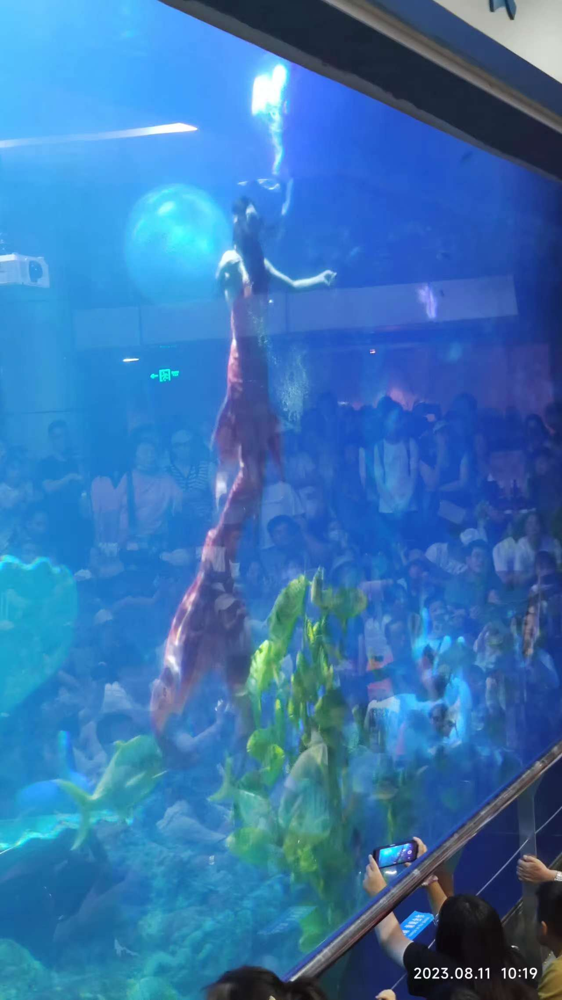     |       |

### 八大关风景区和第二海水浴场：劝退
八大关风景区：听名字感觉此处应该有古城墙和关隘，你要是信了那就要失望了。所谓八大关就是几条街的名字（什么山海关路、宁武关路等），并且这些街还不是购物街，就是纯街道，如果你带着老人或者小孩，我建议还是劝退吧！

第二海水浴场：第一海水浴场相比栈桥海水浴场，幸福感可以说是爆棚的。但是你到了第二海水浴场，你就会发现，它称第二是非常有道理的，因为它根本就不如第一海水浴场。沙滩长度和宽度均较小，特别是厕所我就不提了，简直有损第二这个名号了！

劝退的地方，就不拍照留念了，建议想去的网友们慎重考虑！

### 石老人海水浴场：免费，儿童设施，大沙滩
小朋友们今天还没有去游泳呢，因此我计划中的备选项石老人海水浴场就被提上来了，去了之后发现远远超出预期：沙滩大，比第一海水浴场大太多了；配套比较齐全，有儿童游乐区域，有洗脚洗沙区域，厕所里一直有2位清洁工驻守打扫。

## 第3天：金沙滩海水浴场，不容错过
最后1天，下午3:45火车返程了，想轻松一点，决定就上午去一个地方，下午去火车站。商量下来还是去玩水吧，因此金沙滩海水浴场，也是网友们评价最高的沙滩，这个我计划中的备选项就被提升上来了。

和石老人海水浴场一样，又一次超出我的预期：沙滩更大更长，沙子感觉更细腻，整体规划更合理（洗脚洗沙区域、厕所更大、遮阳伞也是固定好的）。

如果网友们去沙滩，金沙滩真的不容错过！

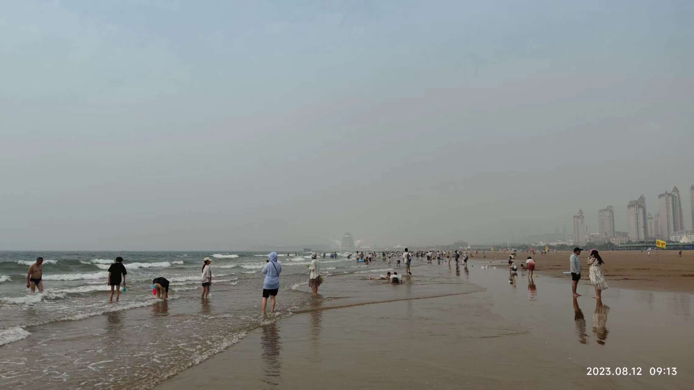

| <big>沙滩左</big> | <big>沙滩右</big> |
| ---------------- | ---------------- |
| 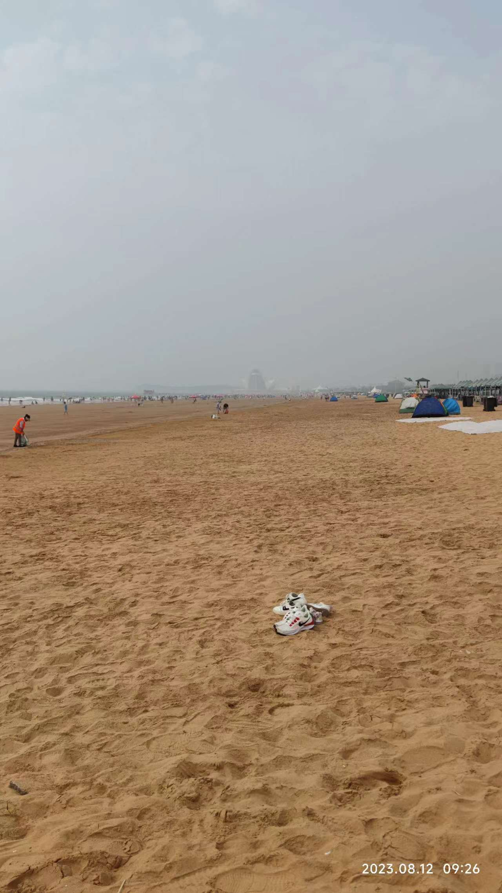   |    |

## 最后
我的青岛之旅完美收官了，非常期待明年的暑假旅游。明年，厦门我们再见！

附-青岛旅游计划：[我的2023暑假青岛3天2晚旅游计划](https://ntopic.cn/p/2023072301/)
