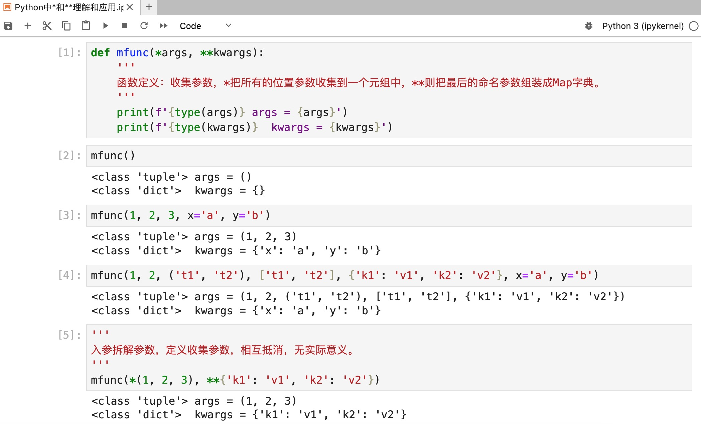

+++
slug = "2024050201"
date = "2024-05-02"
lastmod = "2024-05-02"
title = "Python深入理解*和**含义和应用"
description = ""
image = "00.png"
tags = [ "Python" ]
categories = [ "Python禅师" ]
+++

本文源代码：[https://gitee.com/obullxl/PythonCS/tree/master/CS-CY2405](https://gitee.com/obullxl/PythonCS/tree/master/CS-CY2405)

## Python中*和**很常见
禅师在阅读Python代码过程中，经常看到一个函数或方法的入参是`*args`和`**kwargs`（如：`def func(*args, **kwargs)`等）形式，或者在调用函数或方法时，在入参的元组和列表前面增加1个`*`号（如：`func(*(1, 2, 3))`等），或者在字典类型入参前面增加2个`*`号（如：`func(**{'x':1, 'y':2, 'z':3})`等）。

刚开始看到参数前面`*`号，禅师一度以为是C/C++中的指针，但在万物皆对象的Python种，指针是不会存在的。本文我们一起来看看1个`*`号和2个`**`号的含义和用法，也让我们来感受一下Python灵活性有多强大。

## 位置参数和命名参数
在了解函数入参`*args`和`**kwargs`之前，我们首先要了解一下函数或方法的位置参数和命名参数，以函数定义`def func(a, b, c, x=None, y=None, z=None)`为例：

+ <b>位置参数</b>通俗的讲就是参数的位置的固定的，与函数或方法的参数名无关，比如函数或方法的第1个参数、第2个参数等。样例函数的a/b/c入参就是位置参数，他们分别在函数的第1到第3个参数。Python语法规定，位置参数只能在函数或方法前面的参数（即中间不能有位置参数）。

+ <b>命名参数</b>通俗的讲就是参数是有名字，在调用函数或方法时，需要指定参数的名称，命名参数可以有默认值。样例函数的x/y/z入参就是命名参数，x/y/z就是参数的名称，且他们均有None默认值。Python语法规定，位置参数只能在函数或方法后面的参数（即中间不能有位置参数）。

## 1个*和2个**的作用
其实从函数入参能看出来，1个`*`是位置参数，2个`**`是命名参数，那么它们到底有什么作用呢：

+ <b>函数或方法的定义，如`def func(*args, **kwargs)`：</b>1个`*`的作用是<b>收集</b>调用本函数的所有的*位置参数*，收集后的类型是<b>元组</b>；2个`**`的作用也是参数收集，只是收集的是*命名参数*，收集后的结果是字典（在Java中称为Map）。

+ <b>函数或方法的调用，如`func(*(1, 2, 3), **{x=4, y=5, z=6}`)：</b>`*`的作用是<b>拆解</b>，与收集相反；其中，1个`*`为把元组或列表按照顺序拆开，作为位置入参，2个`**`则把字典按照命名参数拆开。

## 例：定义函数或方法（参数收集）
```python
def mfunc(*args, **kwargs):
    '''
    函数定义：收集参数，*把所有的位置参数收集到一个元组中，**则把最后的命名参数组装成Map字典。
    '''
    print(f'{type(args)} args = {args}')
    print(f'{type(kwargs)}  kwargs = {kwargs}')


mfunc()
mfunc(1, 2, 3, x='a', y='b')
mfunc(1, 2, ('t1', 't2'), ['t1', 't2'], {'k1': 'v1', 'k2': 'v2'}, x='a', y='b')

'''
入参拆解参数，定义收集参数，相互抵消，无实际意义。
'''
mfunc(*(1, 2, 3), **{'k1': 'v1', 'k2': 'v2'})
```



## 例：调用函数或方法（拆解或映射）
```python
def mprint(x, y):
    '''
    函数调用：拆解参数，*把元组或列表按照顺序拆开，作为入参，**则把Map字典按照命名参数拆开。
    '''
    print(f'{type(x)} x = {x}')
    print(f'{type(y)} y = {y}')


mprint(*(1, 2))
mprint(*((1, 2), 3))
mprint(**{'x': 'x1', 'y': 'y1'})
```


<b>特别注意：</b>拆解位置参数数量需要与函数或方式定义一致，或者拆解命名参数的参数名需要与定义一致！


## 禅定：Python为什么需要*和**？
从前面的分析可以看出`*`和`**`的作用和用法，Python中它们是必须的吗？禅师答案：

+ 函数和方法定义中是<b>必须</b>的：举个反射的简单场景，函数入参的个数、类型是动态的，因此需要收集（如：Java中为`Object[]`数组）

函数和方法调用是<b>可选</b>的，目的是为了简化编程（Python之禅：<b>Beautifulis better than ugly.</b>），不需要手工逐个参数设置，如调用函数入参`func(*my_lsit, **my_dict)`就明显比`func(my_list[0], my_list[1], my_list[2], my_dict['x'], my_dict['y'], my_dict['z'])`优雅太多了。

---
我的本博客原地址：[https://ntopic.cn/p/2024050101](https://ntopic.cn/p/2024050101/)

---


