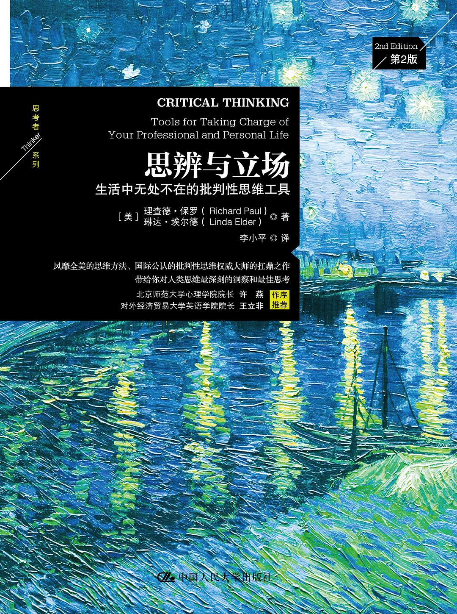

+++
slug = "2023043001"
date = "2023-04-30"
#lastmod = "2023-04-30"
title = "《思辨与立场》读书感想（AIGC）"
description = "《思辨与立场》这本书让我认识到了思辨的重要性，也让我更好地理解了思辨在现实生活中的应用。我相信，只有不断地思考和判断，才能让自己成为一个更加有价值的人。"
#image = "https://picsum.photos/id/201/2000/400.jpg"
image = "images/01.jpg"
tags = [ "成长", "感想", "书籍", "思维", "思辨与立场", "AIGC" ]
categories = [ "读书笔记" ]
+++

我的百度**文心一言**公测申请通过了，测试一下，以下内容由文心一言生成，总体来说中规中矩，没啥内容也没啥毛病，让我感受一下AIGC的力量：

读完《思辨与立场》这本书，我深深地感受到了思辨的重要性。在这个信息爆炸的时代，人们需要有自己的思考和判断能力，而思辨就是锻炼这种能力的重要方法。

在这本书中，作者分享了很多自己的思考和判断过程，让我深受启发。他认为，在表达自己的观点时，要先理清自己的思路，确定自己的立场，然后再进行严密的逻辑推理和论证。只有这样，才能让自己的观点更加有说服力，也更容易被别人接受。

同时，作者也提到了一些常见的思辨误区，例如过度推理、以偏概全、情感干扰等。这些误区容易让人们产生偏见和误解，因此在表达自己的观点时，需要特别注意避免这些问题。

除了思辨本身，作者还讲述了一些具体的案例，让我更好地理解了思辨在现实生活中的应用。例如，在处理政治问题时，需要运用逻辑和推理来分析各种观点和利益关系，从而找到最合适的解决方案。在处理道德和伦理问题时，需要运用思辨来分析各种道德原则和行为准则，从而找到最合适的行动方案。

总之，《思辨与立场》这本书让我认识到了思辨的重要性，也让我更好地理解了思辨在现实生活中的应用。我相信，只有不断地思考和判断，才能让自己成为一个更加有价值的人。

**书籍封面：** 

