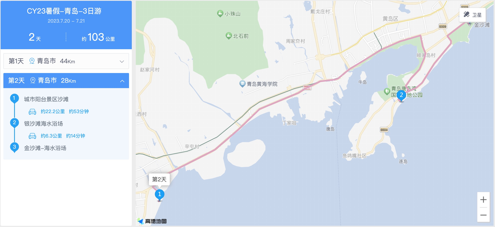
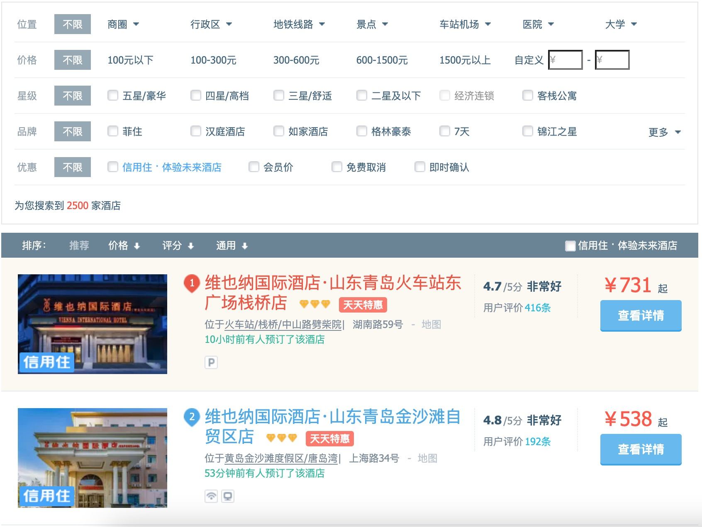

+++
slug = "2023072301"
date = "2023-07-23"
lastmod = "2023-08-19"
title = "我的2023暑假青岛3天2晚旅游计划"
description = "今年暑假出游目标是看海和玩水，以前都是跟团游，今年我想自己做计划自己做主安排……"
image = "01.jpg"
#image = "https://picsum.photos/id/56/2000/400.jpg"
tags = [ "青岛", "旅游", "暑假" ]
categories = [ "点滴生活" ]
+++

更新：本次旅游行程和个人感受：[我的2023暑假青岛3天2晚旅游体验和感受](https://ntopic.cn/p/2023081201/)

## 看海玩水优选青岛
小朋友们最开心的暑假来了，今年我的2位小朋友最希望去玩的是<big>看海</big>和<big>玩水</big>。这样今年暑假我的出游目标就比较明确了，该计划实施路径了。

出游目的地的比较和选择（维度：温度适宜、有海有沙滩）：
1. 上海本地游：有海有沙滩的当属`碧海金沙`了，可是上海暑假温度一直居高不下，加上小朋友之前已去过2回了。地方较小，平时周末就可以去，不适合作为暑假出游计划，放弃不作考虑目标
2. 上海周边：和上海一样，温度太高了，也放弃了
3. 其他省市：比较几个来回，最后倾向**青岛**和**厦门**，查看历史天气30度以内（[青岛40天天气预报](http://www.weather.com.cn/weather40dn/101120201.shtml)），同时青岛的海水浴场实在太多，且都聚在一起，实属优选（厦门计划作为明年暑假目标）

## 青岛3天2晚路线安排
在这里推荐一个非常好用的路线规划工具，高德地图路书：[https://ditu.amap.com/plan](https://ditu.amap.com/plan)
- 优势：可以根据自己的日程安排，选择想去玩的地方，地图会进行标注且计算每个地方之前的距离
- 不足：唯一的不足就是只支持在电脑上编辑，手机上只能查看，无法编辑

### 游玩地点选择
在网上找了很多关于青岛看海玩水攻略，有几个我大概率选择的地方，也是网友们推荐的地方：
1. 黄岛区：金沙滩。黄岛区其实有2个沙滩，网友们评价都比较好，首先是金沙滩，然后是银沙滩，可惜的是它们俩相隔较远，且交通不是很方便，所以我重点选择了金沙滩
2. 市南区：市南区玩的地方就多了，且可贵的是它们都集中在一起，相隔都非常的近。选择有很多，我选了几个我想去的地方，分别是栈桥、海军博物馆、青岛海底世界、第一海水浴场、五四广场、石老头海水浴场等

**第1天：**先玩**市南区**，游玩地点基本都在一起，其中`石老人海水浴场`距离有点远，作为备选项，到时看情况是否游玩

**第2天：**黄岛区，核心目标是**金沙滩**，其中`城市阳台景区沙滩`和`银沙滩海水浴场`作为备选项，到时根据时间情况决定是否游玩

### 交通工具选择
游玩地点选择好了，交通工具就比较好选了。

离**市南区**游玩地点最近的站点就是**青岛站**火车站了，因此计划是坐火车去青岛了。上海-青岛站的火车每天有好几趟，其中**D2906**（08:41~14:25，全程5小时44分钟）车次出发和到达时间点都比较完美：
- 出发：早上可不必特意早起，不慌不忙坐地铁去火车站
- 到达：下午到达，在办理完了入住，还有时间去周边转转

### 住宿地方选择
游玩地点和交通工具都选择好了，酒店也好选择了：火车站附近，离游玩地方不要太远。

飞猪上搜索酒店，我选择的是**青岛站**附近，结果第一家就是**维也纳国际酒店·山东青岛火车站东广场栈桥店**，距离火车站和游玩地点真是近，真是理想之选：

## 最后
期待青岛之旅能完美顺利，到时我在来更新一下整个游玩体验~

更新：本次旅游行程和个人感受：[我的2023暑假青岛3天2晚旅游体验和感受](https://ntopic.cn/p/2023081201/)

