+++
slug = "2023073101"
date = "2023-07-31"
lastmod = "2023-08-20"
title = "宁波象山影视城微电影拍摄随班体验"
description = "我家大的小孩被央视中小学生频道选角选中并聘用，参与拍摄的第一部戏是一部古代穿越微电影，剧组于23年7.29和7.30这两天在象山影视城开机拍摄，我作为监护人，也随剧组一起，踏上了整部微电影的拍摄之旅……"
image = "00-01.jpg"
#image = "https://picsum.photos/id/56/2000/400.jpg"
tags = [ "宁波", "象山", "影视城", "微电影", "中央新影中学生频道", "劳动最光荣", "剧组" ]
categories = [ "点滴生活" ]
+++

## 中央新影中学生频道选角：出乎意料

中央新影中学生频道：[http://www.zxstv.com.cn](http://www.zxstv.com.cn)

网上搜索了一翻，是个正规频道：中央新影中学生频道是经国家广电总局批准，面向全国青少年儿童开办的电视频道。内容涵盖教育、科技、动漫、青少年儿童才艺展演类综艺、教育名家访谈、母婴健康等。

### 海选选角和试镜邀请
5月份的某一天，我爱人带着2个小朋友，在世纪公园参加她们公司组织的亲子活动。在世纪公园游玩之际，受到了号称是央视《劳动最光荣》栏目组几位老师和摄影师的采访拍摄，他们加了我爱人的微信和联系方式、随机问了我小孩几个问题并让背一首古诗。

大概一周过后，我爱人收到短信，邀请我小朋友去参见试镜：

```
邀请函：
家长您好！诚邀您参加《劳动最光荣》栏目本周小演员选拔录制活动。
《劳动最光荣》栏目成片播出频道：中央新影中学生频道
试镜时间：6月3日周六下午1:00
注意事项：
1、着装得体（干净整洁即可）
2、提前准备简单自我介绍。
3、可以准备小才艺展示（朗读一篇古诗、唱歌、跳舞、演绎精彩小片段、演讲等等，内容没有局限性，看小朋友个人意愿 ）现场有工作人员安排流程。
4、至少需要一位家长陪同、最好父母一起陪同 可以在演播厅观看孩子的表现
5、节目录制地点：《中央新影中学生频道上海节目制作中心》杨浦区赤峰路43号知行楼7楼演播厅。
6、如有问题不能到场或时间需要调配请联系：<此处是个电话号码，本文省略>贾老师
7、入场编号：A08
   收到此信息请回复“收到”谢谢您的配合！
```

同时，栏目组老师用微信给我爱人发了微信消息，包括文字内容、才艺表演需要背诵的古诗词、试镜的地理位置等信息：

```
家长晚上好！！！
温馨提示《劳动最光荣》和您的宝贝在6月3日（周六）有约，请不要缺席！
1、如果不能到场或者时间需要调配请及时告知，栏目组剧本等等道具需要提前准备，每场小朋友名额也是限定的，感谢家长的理解。
2、爸爸妈妈如果都有时间可以都到场坐在观众席观看小朋友表演，如果只有爸爸或者妈妈一方有时间的也没事。
3、现场有化妆师，小朋友穿着整洁来就可以，现场会帮小朋友画淡妆，上镜效果更佳。
❤️另外祝家长和小朋友有一个愉快的周末—《劳动最光荣》栏目组
```

地理位置：<b>上海市杨浦区赤峰路43号知行楼7楼</b>

说实话，当看到这条消息时，我知道一旦被选上我又要出点钱了，因为如果是免费的，短信和微信的信息里面肯定会特意强调。我和爱人商量了一下，预算控制在1.5万以内，给小朋友一个机会！

### 免费的试镜、缴费的聘用
去试镜的地方是一个表演喜剧类的学院，名字有点记不住。

当天去试镜的小朋友好了好几批，我们那批大概有30多个，小朋友年纪不一，有读中班的小朋友，也有初二的大朋友。

首先是播音试镜，1个主持人，几位老师打分。因为1个小朋友1首古诗词，大概也就几十秒钟的样子：


评委老师根据小朋友的表现、仪态等平方，最终我们那批30多个小朋友的试镜结果，只留下了6位小朋友。

接下来就是面试环节，说白了就是说服家长交钱了。面试过程我就不细讲了，基本思路，大致符合我的预判：激起小孩表演兴致，PUA我要支持她。最终只需要1.4万多元，在我的预算之内，我也就交钱，并在聘书合同上签字画押了：

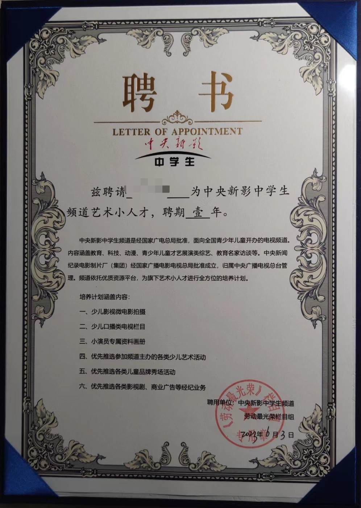

### 演员培训、拍摄注意事项
培训集中在一下午，《劳动最光荣》总导演来给小朋友和家长们上课，具体就不展开了，写几点印象深刻内容。

行有行规，演员也有规章制度：演戏不容易，安全放第一；人等戏，戏不等人，戏等光线。

演员也有基本素养：足容重、手容恭、头容直、目容端、口容止、声容静。

### 发剧本、背台词准备拍摄
```
《劳动最光荣》剧组通知：
    1、👆上面剧本里你家小朋友饰演“邱瑛”请小朋友熟背这个角色的台词以及上句其他角色的台词，以便衔接。
    2、剧本已发家长，最后一句“注意”请家长仔细阅读。
    3、拍摄时间7月29号、7月30号，请家长事前预留时间，如有变化，剧组会及时告知。
收到请回复，谢谢！
```

## 象山影视城的2天2晚之旅
大致行程：

7.28日周五下午4:30坐大巴（也可自驾）从上海博物馆出发去拍摄酒店；

7.29日周日早上开机典礼，然后就开始拍摄；7.30日周日拍摄完成，下午坐大巴回上海。

### 影视城大酒店：无电梯、无中央空调
象山影视城坐落在象山星光影视小镇上，小镇上周围都是酒店，我们主的是其中一座。光看名字感觉还不错，入住发现很一般。


这是大堂。特别注意：整座酒店没有中央空调，没有电梯！

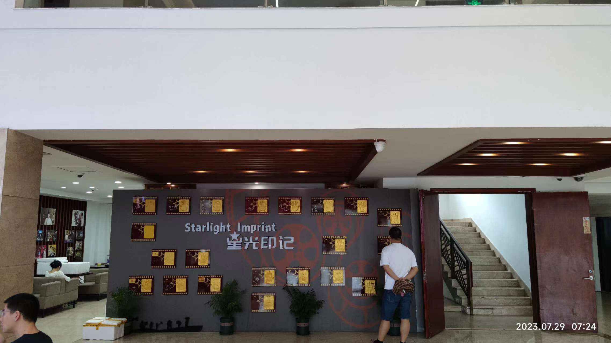

这是服务台的背景墙，上面挂着的是当年入住本酒店的明星，我还能认出几位：陈思诚、黄晓明、孙俪、杨紫、杨幂、迪丽热巴、易烊千玺、雷佳音。


明星有不少，荣誉墙也挺满。


这是大堂右手边，看到那个立式空调柜机了吗？真没有中央空调。

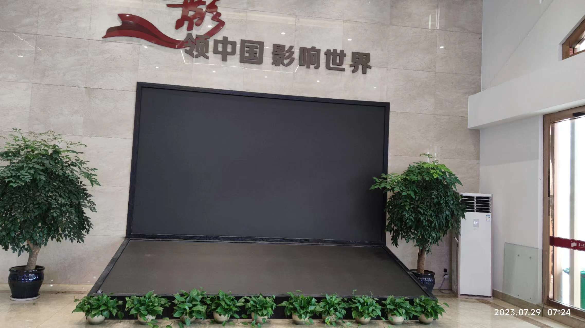

这是酒店门前，挺宽敞的，自驾停车方便。对面远处的大楼，基本都是酒店了。


### 酒店房间：极致的简陋
酒店的布局为回字形，中间是个天井，酒店走廊挺宽敞，宽度可以跑汽车，但是很闷热（因为没有空调）：


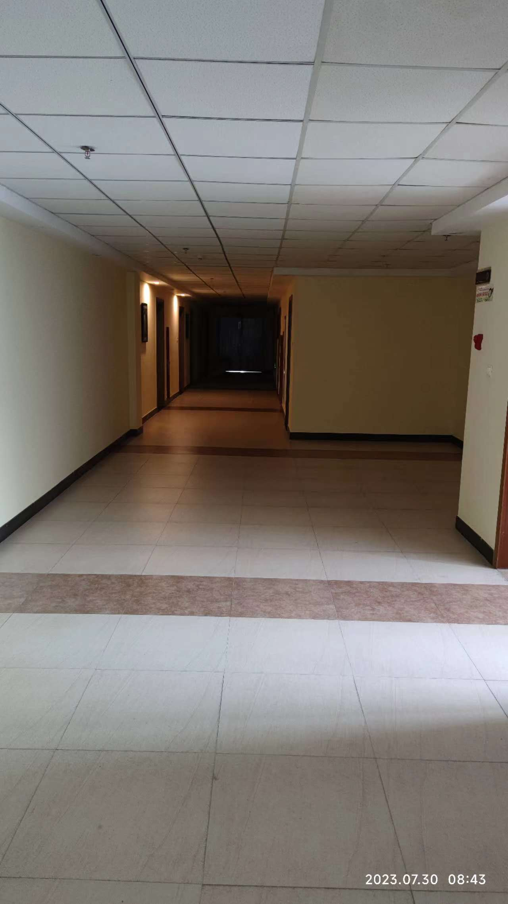


房间就比较简陋了：1张写字桌，1把椅子，2张床，1间卫生间，没有多余空间了。连台灯都没有，小孩做作业都不方便，更别说矿泉水、茶叶啥的了。

空调当然也是挂壁式的，还是对着床头吹的。注意照片是我补排的，因此会看到背包、鞋子等：


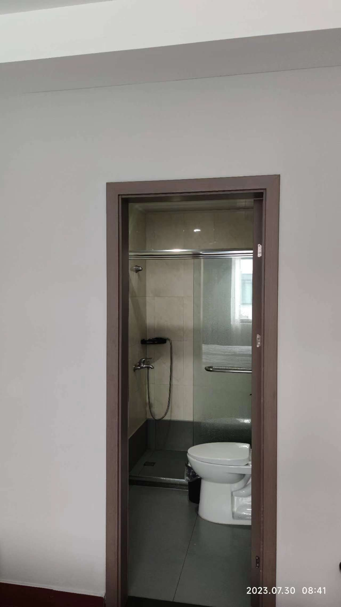

连毛巾都是一次性的：

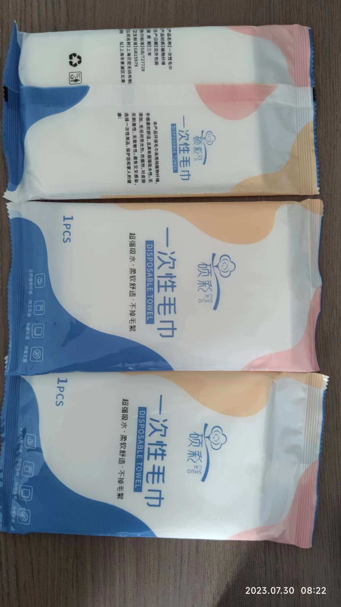

### 影视城一期：神雕广场
酒店就在影视城旁边，影视城分为两期：根据导演讲的，一期主要旅游和参观，拍摄不多了；二期注意是拍戏，我们的微电影会在二期完成拍摄。

一期神雕广场还是比较气派的，光入口的走道就有好几百米：

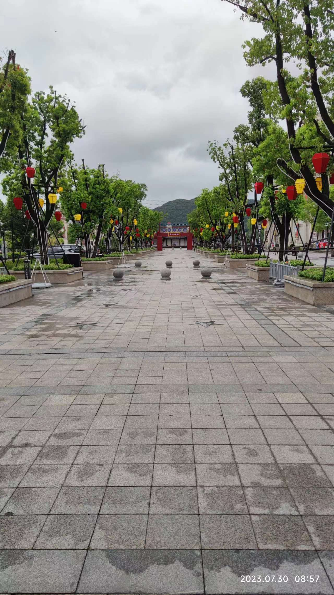


神雕因拍摄《神雕侠侣》这部电视剧而出名：

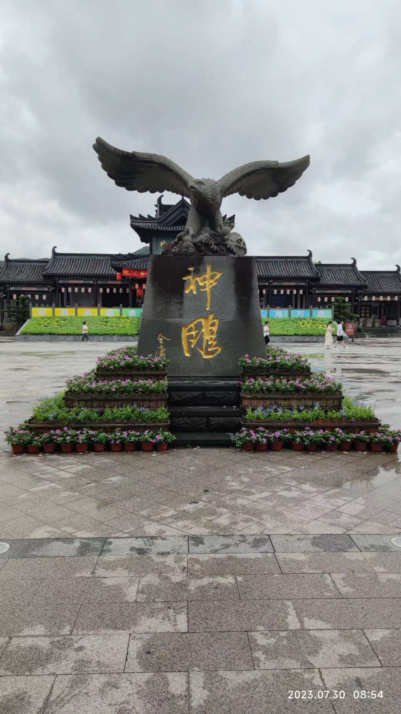
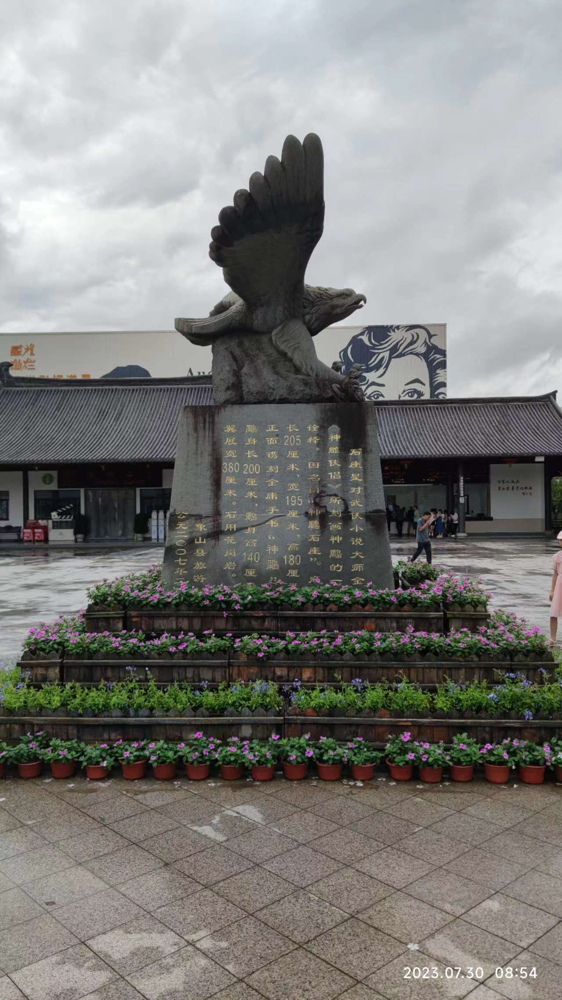
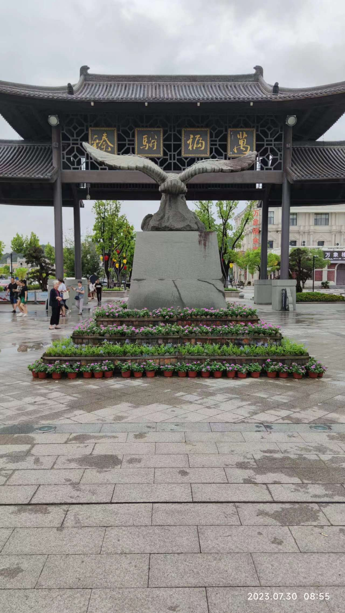

### 影视城二期：各式建筑群
说实话，建筑都比较破旧，有的门都是用订书机订上去的。我们看到的电影，都是经过后续制作的：


### 偶遇一个拍戏剧组：演员、拍戏
演员们排队领盒饭：有个管演员的小孩感觉特别嚣张，对演员大吼大叫的：


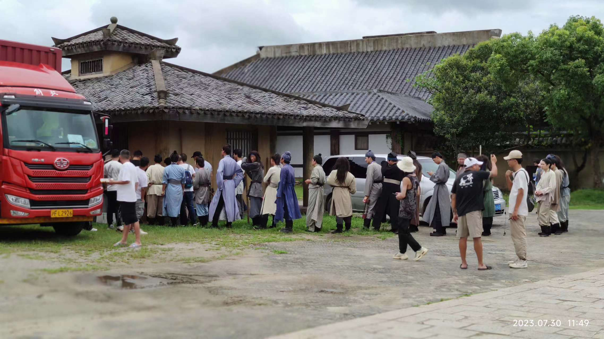
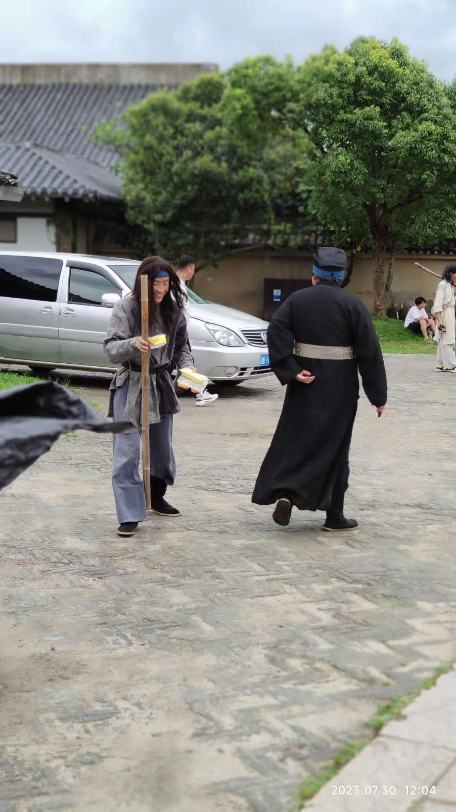

虽然是乞丐演员，也可以顺便买瓶汽水喝喝：

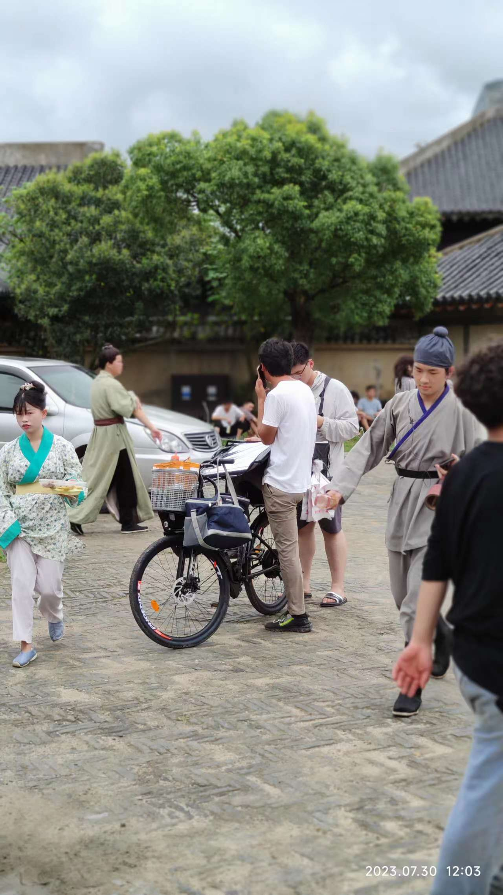

那个站在上面的，应该就是导演了，拿着话筒在指挥拍戏：

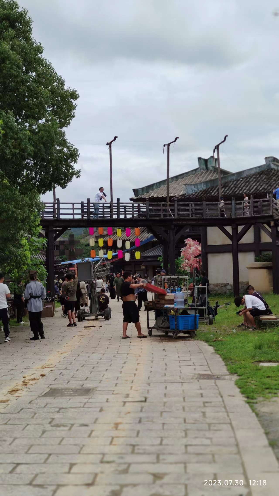

### 剧组盒饭：相对较好
我们剧组较小，都在酒店吃饭，至少不用蹲在影视城里面。导演说我们伙食相对比好了，剧组一般是1荤1素，荤菜也不怎么好，比如红烧肉，可能都没有瘦肉。

早餐：2个小笼包，1个鸡蛋，银耳汤或豆浆自助

午餐/晚餐：基本是1大荤1小荤1素，什么大鸡腿、炸猪排、芹菜炒肉等


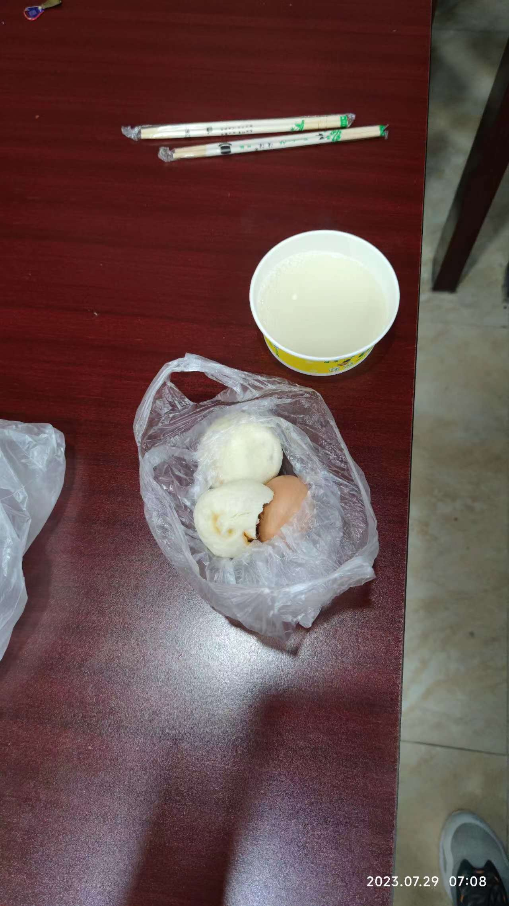

## 最后-关于影视城周边
其他的一些情况，统一与大家分享一下：
- 影视城很偏，白天陆续还能看到去一期游玩的游客，到了晚上基本没有什么人了，空荡荡的大街
- 本次剧组有几个自驾的家长，有几个他们开车去吃海鲜，单次车程基本需要30分钟，因此想去影视城吃海鲜肯定不是一个好主意
- 一期影视城参观110元，二期40元。一期参观可以随意走动，但是二期只能坐小火车。导演说一期和二期基本差不多，如果我们去一期游玩不划算，同时如果作为游客，二期只能做小火车兜一圈，中途不停也不能下车


<br/>
最后的最后，期望小朋友拍摄的微电影《劳动最光荣》能尽快上映，到时在和大家分享~
