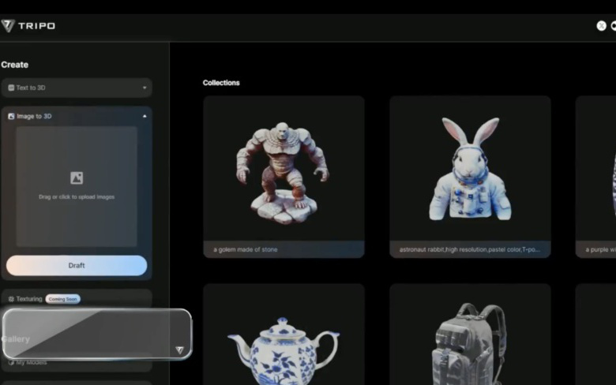
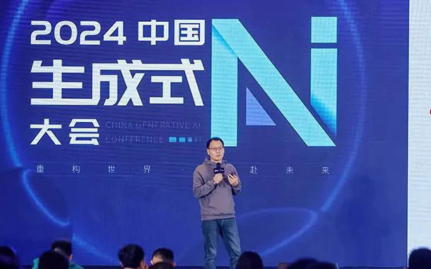
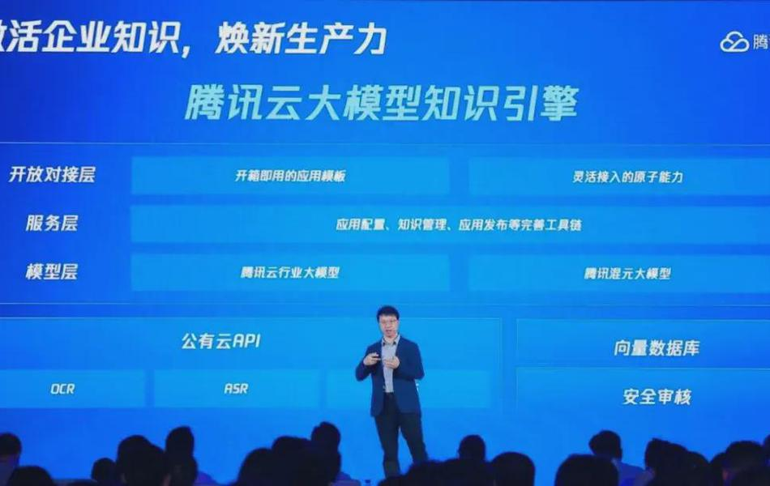
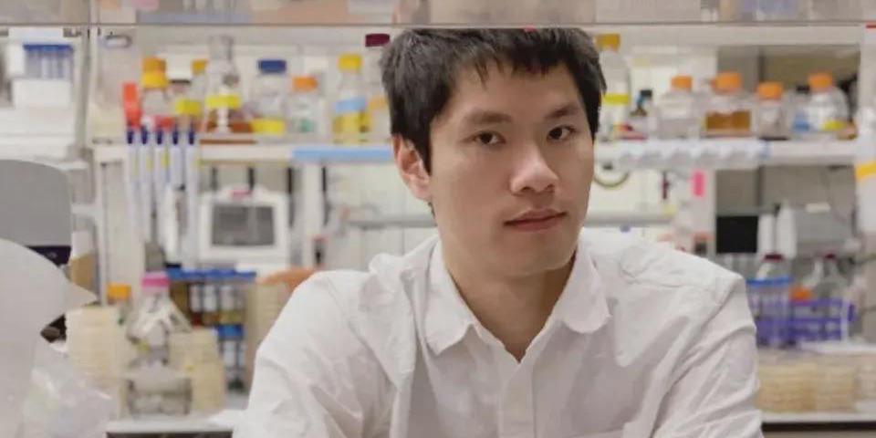
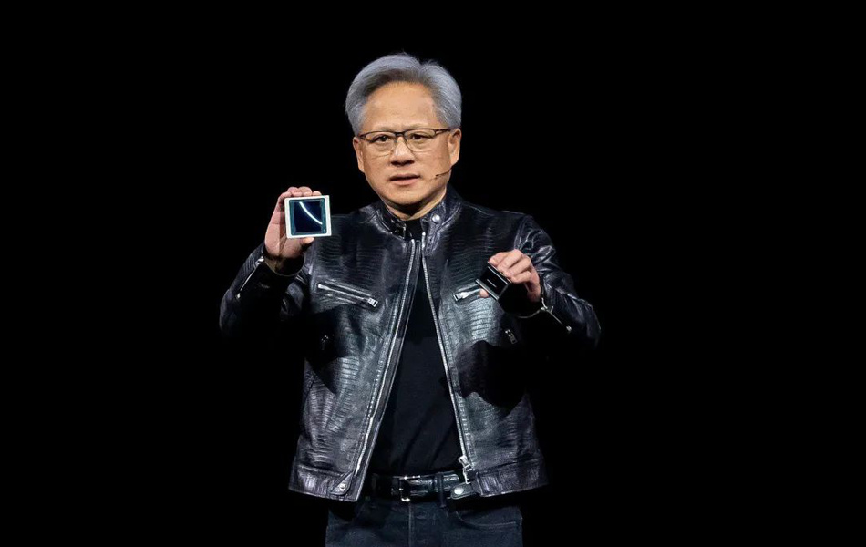
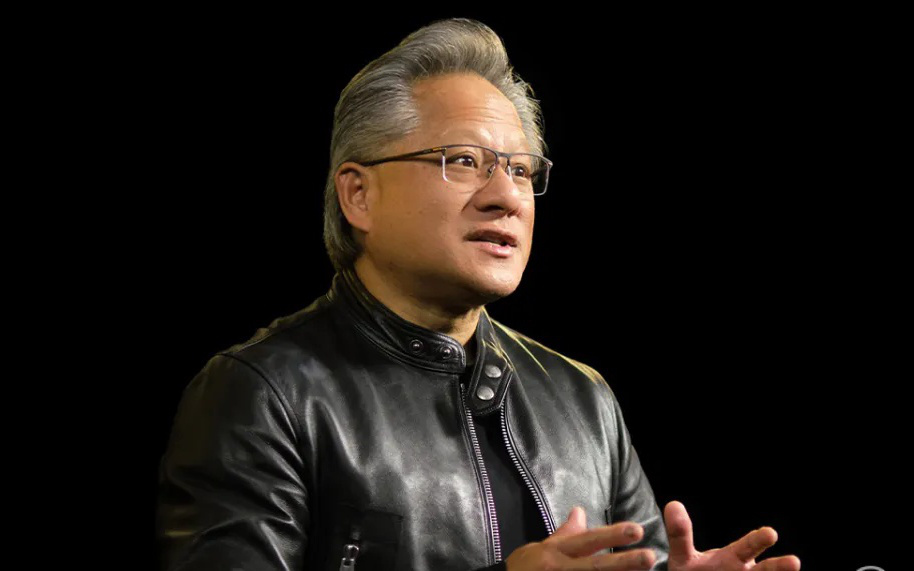
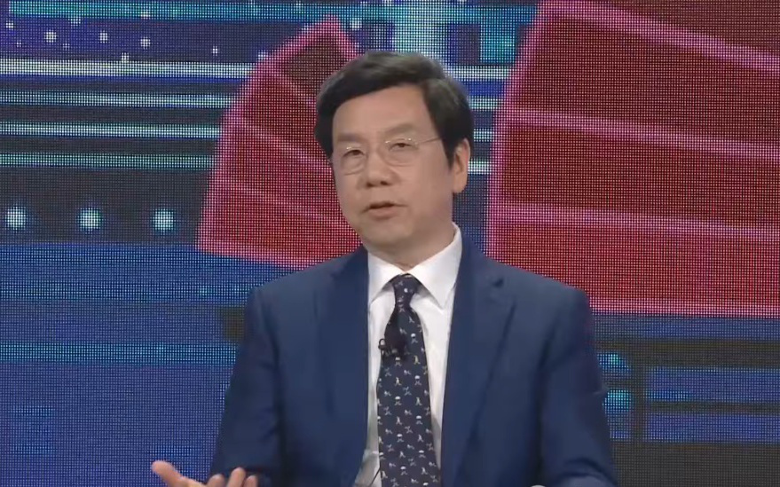
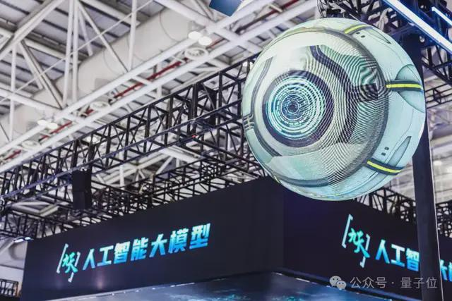

+++
slug = "ai20240526"
date = "2024-05-26"
lastmod = "2024-05-26"
title = "[AI资讯·0526] AI技术快速发展，英伟达股价上涨但面临竞争隐忧。大模型应用增长，网络攻击风险增加。中国AI领域追赶美国一年，独角兽寻求出售。AI翻译公司专注网络小说。中国移动推出大模型服务。"
description = ""
image = "ai20240526-1.jpg"
tags = [ "AI", "AI资讯", "人工智能" ]
categories = [ "AI资讯" ]
+++

## VAST宋亚宸：3D生成迈入秒级时代，今年将做到Midjourney V5/V6水平丨GenAIC

2024年中国生成式AI大会上，VAST创始人兼CEO宋亚宸以《大模型Tripo驱动3D生成迈入秒级时代》为题进行了演讲。他认为，3D技术的体验质量和信息密度在不断提升，并且具有互动性。目前3D生成已经达到MidjourneyV3水平，将于今年年底达到V5/V6水平，实现真正可用并通过图灵测试。VAST是3D生成模型领域的领先者，创建了全球最大的几个3D生成开源社区，并与Stability共同开发了全球最大的0.5秒图生3D模型TripoSR。宋亚宸也是首位在计算机图形学顶会SIGGRAPH上发表主舞台主题演讲的中国创业者。VAST的3D大模型Tripo上线后，仅百余天就生成了超过200万个3D模型，以降低3D生成的创作门槛和成本。公司结合3D内容平台和大众级创作者平台，并已拥有超过200家B端客户，开发出原生AI爆款小游戏，一周用户突破10万。宋亚宸认为，AIGC将使游戏创作成本和门槛无限降低，这是VAST的目标。公司致力于使用AI技术生成3D模型，这些模型可以用于游戏、动画、影视、元宇宙和3D打印等行业，并且具有Mesh、贴图、材质等属性，可以进行传统管线二次编辑。宋亚宸强调，随着3D技术的发展，世界正在进入一个3D新时代。目前，全球顶级企业如谷歌、英伟达、OpenAI和Meta都已涉足3D生成领域。VAST在学术上发表了大量论文，并开源了多项技术，如TripoSR、Threestudio、Wonder3D等。公司正在拓展人类能力的边界，降低用户创作成本，使得每个人都能低成本创作3D内容。宋亚宸预计，未来每个人都将拥有生成无限个属于自己的3D内容的能力。这将改变3D创作者的角色，从游戏大厂的建模师和动画师变为普通人。VAST的产品Tripo已经上线，百天内生成了超过200万个模型，这在短时间内超越了全球许多模型交易平台。公司还与腾讯、网易等游戏大厂合作，提供3D生成能力，以降低他们的成本和提高效率。同时，VAST推出了原生AI玩法，如TripoGO小游戏，一周用户突破10万，这是AI原生玩法的力量体现。（报道详情：[https://www.163.com/dy/article/J2VO20AB051180F7.html](https://www.163.com/dy/article/J2VO20AB051180F7.html)）

## 焱融科技张文涛：将大模型训练效率提升40%！详解多云架构下高效存储策略

2024年中国生成式AI大会上，焱融科技CTO张文涛发表演讲，讨论了多云环境下大模型训练和推理的高效存储问题。随着算力需求的增加，单一数据中心无法满足大模型训练和推理的需求，因此需要采用多数据中心协同工作的方式。然而，这种模式带来了数据拷贝成本的增加，以及如何在保证性能的前提下让数据按需流动的问题。张文涛强调了存储对于大模型训练和推理至关重要，特别是在多模态大模型中，高性能存储可以提升训练效率20-40%。焱融科技提供了一套基于四个核心组件的存储解决方案：集群管理服务、元数据服务、集群服务和客户端。这些组件支持标准x86架构、Arm架构服务器、多种网络协议，并且可以水平扩展以适应不同的需求。对于推理环节，张文涛提出了客户端缓存池解决方案，以缓解启动风暴问题。该方案通过在计算节点上建立大型SSD缓存池来加快模型加载速度，从而有效地解决了网络带宽的瓶颈。最后，随着训练和推理无法完全在单一数据中心完成，多云方式成为必然趋势，但这也带来了新的挑战。张文涛提出了一个“SourceofTruth”数据湖架构，通过数据编排功能让数据按需流动，并且支持多种对象存储平台的对接，以实现数据的灵活流转。（报道详情：[https://www.163.com/dy/article/J2VO20QI051180F7.html](https://www.163.com/dy/article/J2VO20QI051180F7.html)）

## 5分钟搭建大模型应用！腾讯将「实用主义」贯彻到底

腾讯云推出了知识引擎平台，旨在帮助企业快速开发大模型应用，降低门槛。平台提供了专属工具链，包括大模型知识引擎、图像创作引擎和视频创作引擎，通过PaaS接入方式简化数据工程、模型精调和应用开发流程。企业可以快速上手，搭建属于自己的知识问答、文档助手等应用。知识引擎平台集成了腾讯自研的大型语言模型（LLM）和检索增强生成（RAG）、向量检索、大语言模型、多模态大模型等多种先进技术，能够在知识解析-切分-检索-内容理解生成全链路中显著提升问答质量和效率。腾讯云正在探索大模型落地最后一公里的解决方案，并通过实践指南贯彻“实用主义”价值观，为企业提供更高效、更便捷的大模型应用服务。（报道详情：[https://www.163.com/dy/article/J2VO25JD0512MLBG.html](https://www.163.com/dy/article/J2VO25JD0512MLBG.html)）

## 行业首发！一句话用AI创作视频画本、漫画，网民脑洞要停不住了！

百度文库推出「智能画本」功能，仅需输入主题即可生成一本图文并茂的视频画本，模仿专业出版社制作感十足；「智能漫画」功能则可以创作故事、写分镜脚本、绘制分镜和生成图文并茂的条漫。这些AI工具降低了创作门槛，让无经验者也能轻松自制画本和漫画，促进行业内外行跨界合作，推动内容创作者从创意到变现的全链路路径。百度文库还提供PPT、研报、思维导图等多种AI生成功能，使得用户可以通过语音输入快速生成报告或PPT，并且品质有保证。这些功能深受用户喜爱，已成为国内AI产品榜首。（报道详情：[https://www.163.com/dy/article/J2VO20BF051180F7.html](https://www.163.com/dy/article/J2VO20BF051180F7.html)）

## 超级细菌、AI黑盒与不老奥秘

五一假期期间，一位感染肺炎支原体的患儿家长在社交媒体上表达了对抗生素耐药性的担忧，这个问题正影响着全球的健康安全。肺炎支原体是一种常见的呼吸道病毒，通常可以通过抗生素治疗，但越来越多的人发现大环内酯类抗生素不再有效。这是由细菌和病毒对抗生素耐药性的增加导致的。FelixWong，一个华裔科学家，在麻省理工学院与哈佛大学的合作下发明了一种利用深度学习模型来发现全新的抗生素结构的方法。他的团队使用了超过120,000种化合物中的39312种进行测试，并通过可解释性的人工智能模型，识别出两种有效的潜在抗生素。FelixWong的工作不仅解决了抗生素耐药性的问题，而且还为抗衰老研究开辟了新途径。他希望能够在50年内开发一种真正能延缓衰老的药物。他的公司，IntegratedBiosciences，以结合合成生物学和深度学习来控制细胞应激反应，开发更先进的医疗方法。FelixWong的工作是科学界的一次重大突破，他的发现不仅为抗生素耐药性提供了新的解决方案，也为对抗衰老提供了希望。他的故事提醒我们，即使在面对重大的挑战时，通过创新和坚持，可以实现前所未有的成就。（报道详情：[https://www.163.com/dy/article/J2VO6CVB0512MLBG.html](https://www.163.com/dy/article/J2VO6CVB0512MLBG.html)）

## AI 需求强劲，英伟达距离苹果只差一步之遥

英伟达（NVIDIA）在2025财年第一季度的财报显示，总营收为260亿美元，同比增长262%，远超市场预期。数据中心收入达到225.63亿美元，同比增长427%。CEO黄仁勋表示，AI浪潮依然强劲，全球公司正将传统数据中心转型为“AI工厂”，生产人工智能产品。他认为AI将带来显著的生产力和收入增长，并在成本效益和能源效益上也有显著提升。英伟达的四大业务板块中，数据中心是最受关注的部分，也是公司增长的核心驱动力。2024财年第四季度，数据中心业务收入达到184亿美元，是前一年同期的5倍多，并刷新了前一个季度的历史新高。英伟达首席财务官ColetteKress表示，数据中心业务增长主要得益于Hopper架构GPU（例如H100）的出货量增加。计算收入增长了5倍，网络收入增长了3倍。公司首次披露了数据中心业务的具体收入细项，其中计算收入达到193.92亿美元，同比增长478%；网络收入为31.71亿美元，同比增长242%。英伟达希望其业务多元化，不仅依赖于大型云服务提供商，如亚马逊、Meta、微软和谷歌，它还与政府、消费互联网公司、汽车制造商和医疗保健客户合作，新领域可能会在云服务商之外创造数十亿美元的垂直市场。汽车和消费互联网领域表现尤为突出。特斯拉购买了35,000块英伟达H100GPU用于其自动驾驶系统FSDV12。Kress表示，今年汽车行业将成为英伟达数据中心业务中最大的垂直市场，带来数十亿美元的收入机会。Meta发布了最新的大型语言模型Llama3，该模型在24,000块英伟达H100GPU上训练完成，为Meta旗下的Facebook、Instagram、WhatsApp和Messenger的新人工智能系统MetaAI提供支持。Llama3不仅提升了这些平台的AI功能，还在各行业掀起了一股AI开发热潮。尽管英伟达在中国市场的业务受到了限制，但公司仍然致力于为客户服务，并表示将尽最大努力。创纪录的财务表现下，英伟达也有隐忧，如芯片制造端的激烈竞争和头部互联网和大模型公司如何落地和变现的问题。（报道详情：[https://www.163.com/dy/article/J2VP6EMM05119FMA.html](https://www.163.com/dy/article/J2VP6EMM05119FMA.html)）

## 英伟达股价起飞暗含隐忧：竞品频出、客户背刺、AI市场格局波动

英伟达2025财年一季度营收增长262%，股价破1000美元关口，但面临竞争对手AMD、英特尔芯片替代产品和客户自研挑战。AI市场变化，推理需求增加，英伟达芯片非必需品；英伟达加速新产品开发，迭代周期缩短至一年，以维持领导地位。（报道详情：[https://www.163.com/dy/article/J2VSRO9A051180F7.html](https://www.163.com/dy/article/J2VSRO9A051180F7.html)）

## 李开复最新财富论坛AI访谈：中国AI只比美国晚一年

开复（Kaifu）在财富创新论坛上就人工智能进行了访谈，提到中国AI发展落后美国不到一年，并对中美AI比较做出了评点。他认为美国的创新能力强，但中国在执行方面更有优势。开复指出，人工智能可能会超越人类，但并不一定需要完全模仿人类大脑。他还提到了他创立的公司ZeroOne.ai，其估值达10亿美元，并且对未来AI技术的普及持乐观态度。开复预测了人工智能将带来的巨大变革，他认为数据将成为新的石油，AI将改变世界。然而，他也担心大公司可能会占据主导地位，加剧贫富差距，并对教育和就业产生负面影响。他强调需要普及AI，使其变得“可获得”，减少社会不平等。关于未来工作的流失，开复提到他之前的预测中，40%到50%的工作将被人工智能取代，这一预测仍然准确。政府和教育体系需要准备好应对这一变化，帮助人们适应新环境。开复还强调了人类情感和同理心的重要性，与机器相比，人类在这些方面有独特之处。他鼓励人们积极使用AI工具，并相信人工智能可以是创造力和生产力的巨大推动者。（报道详情：[https://www.163.com/dy/article/J2VU00U405534HHB.html](https://www.163.com/dy/article/J2VU00U405534HHB.html)）

## 第一波黑客已经用大模型搞网络攻击

新技术和产业的发展中，安全始终是伴随而来的，它们通常先有攻击后有防护。大模型也不例外。在大模型的应用场景中，安全问题和需求随之而来，但由于攻击者往往能更快发现并利用这些风险，因此需要我们提供快速响应和改变。目前，大模型的实际应用仍然有限，行业人士对其成熟度、投入产出比以及应用方向有所顾虑，而黑客们只需一个理由就可以利用大模型进行攻击。全球安全公司纷纷行动起来，微软推出了SecurityCopilot，谷歌发布了网络安全专用的大模型，而Paloalto和CROWDSTRIKE则在其安全运营平台集成了大模型的安全能力。在中国，大约80%的网络安全公司正在将大模型技术融入产品中，有30%的公司已经开始进行大模型安全研究，出现了一些安全创业浪潮。随着ChatGPT等AGI技术的推出，全球黑客开始使用这些工具来提高攻击效率和范围。由于大模型对编程语言理解能力强，攻击者可以快速发现软件漏洞，并且利用AI算法进行人脸伪造，导致网络诈骗案件增加。安全公司正在探索如何利用AI技术来改进威胁检测、产品体验和运营分析。然而，大模型的概念也被认为可能是新瓶装旧酒，因为许多安全公司早已使用AI进行垃圾邮件检测、漏洞修复等工作。亚信安全并没有立即将大模型集成到产品中，而是在构建底层通用框架和MaaS服务平台，并最终推出了自研的网络安全大模型——信立方。随着大模型技术的发展，AI安全需要从系统性全局视角来共建生态。亚信安全认为，大模型产业链将变得更加长，而周边业态会更加丰富，真正做大模型的厂商不会太多，但利用大模型的企业和行业会越来越多，这对安全方面提出了新的要求。通过与其他公司的合作，亚信安全推动了东西部算力和数据资源的安全调度和流通，为人工智能和数据产业的发展提供了支持。（报道详情：[https://www.163.com/dy/article/J2UOBJSO05118O92.html](https://www.163.com/dy/article/J2UOBJSO05118O92.html)）

## 中国AI独角兽资本大冒险

月之暗面的火爆，超出想象，预计估值将超过百川智能、智谱AI等，成为中国头部独角兽。作为通用人工智能领域的领军企业，其创始人杨植麟引领高密度人才团队，旗下产品Kimi在短时间内突破7380万用户，成为AIGCAPP行业用户增长最快的应用之一。虽然面临资金压力和商业化路径问题，但月之暗面通过新一轮融资获得更多筹码，有望释放更多可能性。然而，大模型竞争加剧，市场缺乏“杀手级应用”，技术和商业化的挑战依然存在。杨植麟计划在资源和人才上投资，研发跨模态大模型，并希望打造像苹果AppStore一样的平台。（报道详情：[https://www.163.com/dy/article/J2TO535U05198NMR.html](https://www.163.com/dy/article/J2TO535U05198NMR.html)）

## AI独角兽集体求卖身，新一轮洗牌期开始了

大型人工智能模型公司正经历着收购潮，包括Adept（估值10亿美元）、HumaneAI（估值7.5-10亿美元）和StabilityAI（创始于StableDiffusion）。这些公司的估值高达数十亿美元，但面临成本压力、商业模式不确定性以及激烈市场竞争。Adept和HumaneAI寻求收购，部分原因是产品未能如预期般销售良好，导致资金短缺。StabilityAI则因开源模型StableDiffusion的商业化问题而面临挑战。科技巨头如微软、谷歌和Meta等正在积极寻求收购或与这些初创公司合作，以获取技术和人才。此外，大数据行业头部公司Databricks和Snowflake也通过收购AI初创公司来扩展其业务。虽然国内大模型市场也显示出头部效应，但未来的发展趋势仍然值得观察。（报道详情：[https://www.163.com/dy/article/J31TPPHL0511DSSR.html](https://www.163.com/dy/article/J31TPPHL0511DSSR.html)）

## 鹅厂造了个AI翻译公司：专攻网络小说，真人和GPT-4看了都说好

智能体翻译公司TransAgents以AI为主体，提供高质量网络小说翻译服务，其成本低于传统人工翻译近80%。虽然在相似度评估中表现不佳，但读者和专业人士对其质量表示肯定。该公司使用30个不同智能体，每个岗位配备多个AI，以适应不同的语言、体裁和受众，创造出灵活多样的译文，更符合目标语言习惯和文学性强。TransAgents的表现促使人们思考是否人工智能生成内容将取代人类喜好。专业评估表明尽管GPT-4认为其翻译不如自己，但真人和GPT-4都认可TransAgents翻译质量，特别是在语言多样性方面超越了真人和GPT-4的表现。在某些类型中，如游戏、科幻爱情类，TransAgents的表现尤为突出。该公司通过GhostAgent评估选择高级编辑，并在翻译风格指南下进行团队协作，以确保一致性和质量。虽然存在遗漏现象，但未影响读者体验。多智能体协同工作已显示实际效益，引发对语言同质化和大规模Agent合作的担忧。（报道详情：[https://www.163.com/dy/article/J31V5H9H0511DSSR.html](https://www.163.com/dy/article/J31V5H9H0511DSSR.html)）

## 大模型“国家队”发力了 ，中国移动发布“万百千”

中国移动近日宣布推出全栈国产化生态大模型“九天智能基座”，包括万卡算力、千亿参数模型及百汇平台，能力达到GPT-4的90%水平。该模型已布局17个细分领域行业大模型，覆盖政务、医疗、办公等行业。中国移动计划在2023年内建成3个近2万卡智算中心，并发布AI+5G新通话、AI+办公等23个AI软硬产品及20个行业应用。“九天智能基座”实现了数据构建、预训练、微调、部署全链路核心技术自主创新，适配国产算力，实现全栈国产化，并获得中国软件测评中心安全测评的最高等级A级证书。未来，中国移动计划布局40款自研行业大模型，赋能生产、生活、社会治理等创新升级。此外，中国移动还推出了一站式大模型开发平台和应用平台（LLMStudio），面向个人及行业客户提供全栈人工智能服务。中国移动的体系化人工智能技术具有AI服务大闭环、AI能力原子化重构、网络原生和安全可信四大特征，实现了算力、网络、人工智能能力全局统一调度和开放服务。中国移动作为“国家队”成员，在数字化建设中扮演重要角色，以其技术实力、数据优势、身份优势等因素，为国家的数字科技创新体系提供支持，并在全球大模型浪潮中取得了显著成就。（报道详情：[https://www.163.com/dy/article/J31V8FG00511DSSR.html](https://www.163.com/dy/article/J31V8FG00511DSSR.html)）
