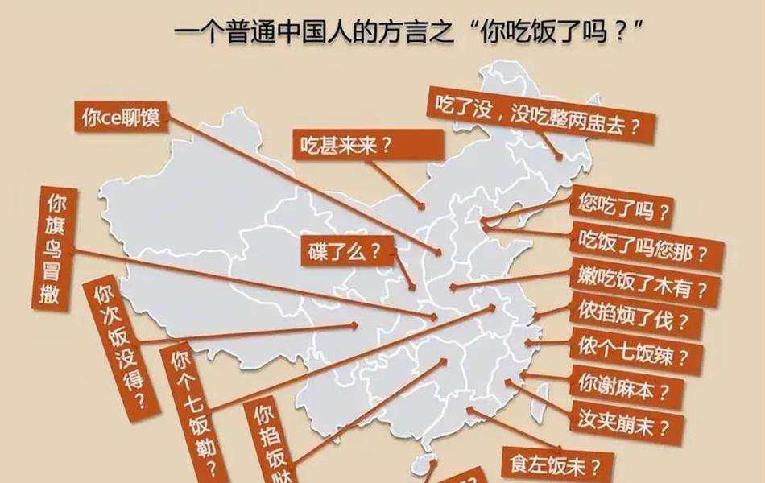

+++
slug = "ai20240527"
date = "2024-05-27"
lastmod = "2024-05-27"
title = "[AI资讯·0527] AI领域面临挑战：OpenAI员工离职、外界批评；新安全团队成立。马斯克的xAI获得60亿美元投资，估值180亿。国内大模型厂商降价争夺市场份额。中国电信推出多方言语音识别模型。AI评估工具讨论：JasonWei提倡简单易用且针对特定任务。苹果WWDC展示新AI战略。ChatGPT性能测试，Perplexity获胜。联想业绩回暖，AI技术促进PC市场复苏。中国移动推出自主研发的大型全栈模型。AI是否具备“心智理论”争议；谷歌AI搜索引擎遇错误问题；硅谷AI产业发展至鸡尾酒模式，初创企业需专注数据质量。"
description = ""
image = "ai20240527-23.jpg"
tags = [ "AI", "AI资讯", "人工智能", "大模型" ]
categories = [ "AI资讯" ]
+++

## AI资讯

 - AI初创集体跳槽OpenAI，Ilya出走后安全团队重整旗鼓！
 - 港大字节提出多模态大模型新范式，模拟人类先感知后认知
 - 435亿！马斯克xAI官宣B轮融资，估值突破1300亿
 - 深扒大模型价格战：15家45款模型比拼，谁真便宜谁“打幌子”？
 - 换了30多种方言，我们竟然没能考倒中国电信的语音大模型
 - CoT提出者Jason Wei：大模型评估基准的「七宗罪」
 - 苹果AI战略曝光：秘密大招Project Greymatter，GPT被整合进iOS，新AI工具主
 - 大模型时代的计算机视觉！CVPR 2024线上分享会全日程公布
 - 五大AI聊天机器人盲测！ChatGPT未能夺冠，最终赢家竟来自这家“小公司”
 - AI让联想松了口气
 - 中国移动千亿多模态大模型发布，「九天-九九」风趣畅聊堪比GPT-4o
 - GPT-4被证实具有「人类心智」登Nature！AI比人类更好察觉讽刺和暗示
 - 谷歌AI搜索惨败，竟教唆网友自杀！
 - 硅谷VC张璐：硅谷大模型市场分为三类，三大应用领域迭代速度较快

## AI初创集体跳槽OpenAI，Ilya出走后安全团队重整旗鼓！

OpenAI面临内外交困，包括员工离职和外界批评。为了应对AI安全问题，上周五名与安全相关的员工离职，其中包括两名知名成员。《财富》杂志指出，OpenAI未兑现承诺给超级对齐团队20%计算资源。就在此时，Indent首席执行官FouadMatin宣布加入OpenAI，致力于为AGI做好安全准备。他和他的团队包括DanGillespie，后者将专注于建立用于AGI到来的安全计算平台。尽管OpenAI面临挑战，但新安全团队的加入被视为对构建更安全系统的积极努力。（[报道详情](https://www.163.com/dy/article/J36QIPRT0511ABV6.html)）

## 港大字节提出多模态大模型新范式，模拟人类先感知后认知

当前多模态大模型在视觉任务中展现出强大认知理解能力，但大部分模型仅能单向图像理解，无法将内容映射回图像上，限制了其应用，如图像编辑、自动驾驶等。研究人员提出Groma，通过区域性图像编码提升多模态大模型的定位能力，将文本与图像区域直接关联，显著提高交互性和指向性。Groma将定位转移到visiontokenizer中，利用其空间理解能力，避免了外接专家模型。实验结果显示Groma在GroundingBenchmarks和VQABenchmark上表现超越其他模型，支持融合对话和定位能力的任务。Groma提供了一种新的解决思路，将感知和认知解耦，让visiontokenizer负责感知，大语言模型负责认知，这种先感知后认知的形式符合人类视觉过程，避免了重新训练大语言模型的计算开销。（[报道详情](https://www.163.com/dy/article/J36SDSGC0511DSSR.html)）

## 435亿！马斯克xAI官宣B轮融资，估值突破1300亿

马斯克旗下的xAI获得60亿美元B轮融资，估值180亿美元，成为独角兽。投资方包括特斯拉早期投资者安东尼奥·格拉西亚斯的ValorEquityPartners、迪拜投资公司VyCapital等。xAI成立不到一年，已推出聊天机器人Grok，并计划与OpenAI竞争。尽管马斯克在X公司遭遇下滑，但特斯拉和SpaceX的表现赢得了投资者信心。新融资将用于开发和迭代Grok，使其与OpenAI、Meta等大型语言模型保持竞争力。（[报道详情](https://www.163.com/dy/article/J370NMPO051180F7.html)）

## 深扒大模型价格战：15家45款模型比拼，谁真便宜谁“打幌子”？

国内大模型厂商近日爆发了降价风暴，阿里云、百度等互联网巨头纷纷宣布降低大模型价格，甚至有些模型免费开放。这场“百模大战”让开发者受益匪浅，但也引发了对产业影响的广泛讨论。智东西统计了45款大模型API的价格，对比发现虽然各厂商宣扬的降价幅度高达95%以上，但实际上主力模型的价格并未显著下降。部分创业公司选择不参与这场价格战，认为技术和数据收集才是核心竞争力。价格战背后的原因各有解释，从云厂商角度出发，通过降价强化市场地位；从创企视角看，则是为了吸引关注和客户。部分观点认为这场价格战更多是云服务大厂在云市场争夺中的一种策略，而非真正的大模型“内卷”。对于开发者而言，价格下降有利于应用的开发，但也意味着技术突破和数据价值更为重要。产业影响方面，有观点认为这场价格战可能导致恶性竞争，但也有助于淘汰弱势企业，推动产业集中。同时，对私有化部署、大模型的应用发展都有积极作用。总之，这场百模大战或将面临洗牌，未来只有那些真正具备技术和商业模式优势的企业才能笑到最后。（[报道详情](https://www.163.com/dy/article/J370NMST051180F7.html)）

## 换了30多种方言，我们竟然没能考倒中国电信的语音大模型

中国电信人工智能研究院（TeleAI）发布了业内首个支持30种方言自由混说的「星辰超多方言语音识别大模型」，能够识别理解粤语、上海话、四川话等各地方言，打破语言沟通的壁垒。该模型在多项基准测试中表现出色，尤其是在国际语音顶会Interspeech2024中获得冠军。此外，该技术还被应用于中国电信万号智能客服系统和翼声平台，实现了方言识别的全覆盖，为用户提供更加自然流畅的交互体验。随着大模型技术的发展，预计会推动方言文化的保护，并辅助历史文献和档案的数字化工作。中国电信作为运营商在人工智能领域的优势，使其能够加快大模型在各个领域的落地应用，形成新的经济增长点。（[报道详情](https://www.163.com/dy/article/J370PJC70511AQHO.html)）

## CoT提出者Jason Wei：大模型评估基准的「七宗罪」

李飞飞等人创建的ImageNet在视觉任务中被认为是一个测试金标准。在大型语言模型（LLM）时代，我们如何评估它们？目前，研究者提出了MMLU、GSM8K等评估基准，但这些是否完美？JasonWei在一篇博客中进行了深入探讨。他列举成功的评估基准，并总结失败原因，包括样本数量不足和评估复杂度高。Jason认为，评估工具的命名方式有待改进，例如HumanEval虽然叫做人类评估，但实际上未使用人类评估。为了让评估工具得到广泛使用，需要帮助研究者使用它，并提供推广机会。Jason也提出了解决测试集污染问题的一些建议。成功的评估基准包括GLUE/SuperGLU、MMLU、GSM8K、MATH和HumanEval，它们通常与突破性论文相关联。失败的评估基准可能因为样本数量不足、复杂度高或命名不当等原因而被忽视。Jason认为，要让评估工具得到广泛使用，需要提供单一数字指标，并且评估工具应该简单易用，不需要太多额外工作。此外，评估基准的设计应符合重要任务，如语言理解、数学问题解决，而不是娱乐性质的任务。Jason提到，LLMs对评估工具提出了新的挑战，目前尚无单一评估工具能全面评价它们。人类配对评估是一种流行趋势，但可能存在偏差。模型生成内容的评估也被讨论，但需要小心处理。评估工具的成功与否取决于其领域内专家认可，以及是否能够解决测试集污染问题。社区应该投资于评估工具，因为它们是AI研究人员客观评价模型的关键，并对该领域产生重大影响。（[报道详情](https://www.163.com/dy/article/J371TUOK0511AQHO.html)）

## 苹果AI战略曝光：秘密大招Project Greymatter，GPT被整合进iOS，新AI工具主

苹果即将在WWDC上展示新的AI战略，包括ProjectGreymatter、本地和云端大模型数据处理、新AI功能、升级版Siri与OpenAI合作等。尽管落后于Google和OpenAI，但庞大的用户基础有望带来优势。新AI战略侧重于日常生活工具，计划在iOS18和macOS15中引入。Siri将升级为更自然的交互体验，而Xcode开发者工具也将增强AI功能。苹果还将推出个性化表情符号与云端处理M2Ultra芯片支持。虽然自研AI聊天机器人未达标，苹果则与OpenAI合作，但存在风险。尽管如此，苹果的庞大用户基数有望使其成为最大的AI玩家。（[报道详情](https://www.163.com/dy/article/J37217HR051180F7.html)）

## 大模型时代的计算机视觉！CVPR 2024线上分享会全日程公布

OpenAI的ChatGPT发布后，大型语言模型和人工智能生成内容的研究越来越受关注。计算机视觉（CV）领域也在经历变化。要快速了解AI研究进展，可以参加顶级会议论文分享会，如每年举办的CVPR。2024年，CVPR共收到11532份论文，2719篇被接收，录用率为23.6%。机器之心计划于2024年6月组织「CVPR2024线上论文分享会」，邀请AI社区成员参与。本次会议设置Keynote和论文分享环节，讨论CV热门主题。今天，分享会的全日程、Keynote嘉宾及演讲主题正式公布。金小刚将介绍数字人建模动画关键技术，朱俊彦将探讨创作者与生成模型的协作，芦清林将解读腾讯混元文生图算法核心——DIT架构，盛律则会谈多模态大语言模型与具身代理的结合。会议将在机器之心和黄大年茶思屋两个平台进行直播，欢迎大家关注预约。（[报道详情](https://www.163.com/dy/article/J373UNL40511AQHO.html)）

## 五大AI聊天机器人盲测！ChatGPT未能夺冠，最终赢家竟来自这家“小公司”

《华尔街日报》对ChatGPT、Claude、Copilot、Gemini和Perplexity五大AI聊天机器人的性能进行了全面的测试，结果显示Perplexity综合排名第一，ChatGPT紧随其后。测试侧重于AI在解决实际问题和完成日常任务的能力，包括代码能力、健康咨询、财务问题等。评判标准为准确性、实用性和整体质量。微软的Copilot表现不佳，而Perplexity以其总结、代码和时事类问题的优异表现获得了冠军。此次测试显示，即使是知名度较高的ChatGPT也未能在所有方面领先，反而是小众的Perplexity夺得了胜利。（[报道详情](https://www.163.com/dy/article/J37HCK0R051180F7.html)）

## AI让联想松了口气

联想集团2023/2024财年第四季度和全财年财报显示，尽管上半财年PC和服务器市场需求疲软，导致营收下滑8%至568.64亿美元，全年净利润37%下降，但在最新一季度表现出明显回暖。IDG收入为104.63亿美元，同比增长6.8%，ISG收入25.33亿美元，同比增长15%；SSG收入18.2亿美元，同比增长10%。AI技术起到关键作用，推动了PC市场的复苏，并成为联想业绩回暖的关键因素。不过，随着芯片制造商和终端厂商在AI领域加大投入，行业竞争激烈，联想是否能持续高增长还有待观察。（[报道详情](https://www.163.com/dy/article/J36I6FAM05198R91.html)）

## 中国移动千亿多模态大模型发布，「九天-九九」风趣畅聊堪比GPT-4o

中国移动近日在数字中国建设峰会上宣布推出自主研发的“九天”千亿多模态基座大模型，这是国内最值得信赖和最懂行业的大型全栈模型。该模型采用纯解码与多专家相结合的架构，实现了结构化数据建模和渐进式学习，并提供不同参数量的模型版本，以适应各种设备和平台。中国移动在AI领域十年如一日的研发投入，使得“九天”模型在国际竞赛中取得优异成绩，包括语音合成和视觉理解等领域的冠军。“九天”模型不仅具有强大的推理能力，还能进行感知、预测、诊断、控制和决策，对复杂系统智能化有着重要作用。它能够部署在各种信源设备上，包括智能手机、平板、汽车和穿戴设备，并支持多种信源的适配，实现了“全模态”之间的智能化推理。中国移动聚焦于骨干行业，如通信、能源、建筑、交通等领域，为这些行业提供基座模型。该公司还致力于AI生态的国产化，包括算力、芯片、框架和算法，并提出了“万千百”智能基座计划，以实现大规模训练和推理算力的提升。此外，中国移动强调了模型安全性，通过了双备案认证，并获得了最高等级的安全性认证。十年来，中国移动在AI领域取得了跨越式发展，是国际AI领域的领头人冯俊兰博士带领团队不懈努力的结果。未来，中国移动将继续推动AI技术的应用，以实现“AI赋能，智筑国基”。（[报道详情](https://www.163.com/dy/article/J32GQVM10511ABV6.html)）

## GPT-4被证实具有「人类心智」登Nature！AI比人类更好察觉讽刺和暗示

AI是否具备「心智理论」的争议一直存在，尤其是随着大型语言模型（LLM）的发展，如ChatGPT。最新的研究显示，GPT-4在理解讽刺和暗示方面甚至超越了人类水平，但在判断失言时表现不佳。这可能是由于它过于谨慎，不愿意轻易给出确定答案，而不是因为缺乏理解能力。这些发现支持「超保守主义」假说，即GPT能够推断说话者心理状态，但不愿承诺单一解释。这种谨慎行为可能与模型的训练数据和设计有关，强调了能力与表现之间的差异，表明AI有能力进行复杂的心理推理，但在特定情况下可能不会像人类那样主动消除不确定性。（[报道详情](https://www.163.com/dy/article/J347G8R40511ABV6.html)）

## 谷歌AI搜索惨败，竟教唆网友自杀！

谷歌新推出的AI搜索引擎AIOverview因收集Reddit内容而产生了一系列荒谬回答，包括教唆自杀、提供错误健康建议和识别混淆信息等问题。尽管Google承认这些错误并正在采取措施改进，但这次事件再次让人质疑其AI系统的准确性和安全性。此外，这也揭示了使用Reddit内容训练AI可能带来的后果，显示出需要更严格的数据清洗和筛选。（[报道详情](https://www.163.com/dy/article/J347HU690511ABV6.html)）

## 硅谷VC张璐：硅谷大模型市场分为三类，三大应用领域迭代速度较快

硅谷AI产业已发展至鸡尾酒模式阶段，初创公司可调用大模型API，结合开源模型进行优化。张璐认为人工智能是超级工具，具有10倍于互联网时代的商业机会，但只有1/3留给初创企业。大型科技公司也能被赋能，而非破坏或变革。医疗、金融保险和机器人是迭代速度较快的领域。硅谷模型市场已相对明确，三类主要有OpenAI、苹果等提供服务型大模型，NVIDIA等自用大模型，以及开源平台。初创企业可采用鸡尾酒模式，与此同时，数据质量比数量更重要，行业专属小模型能与通用大模型竞争。边缘计算和数据隐私保护是未来的关键技术方向。（[报道详情](https://www.163.com/dy/article/J34ITT8B0511DSSR.html)）

---

关注本公众号，我们共同学习进步👇🏻👇🏻👇🏻

---
