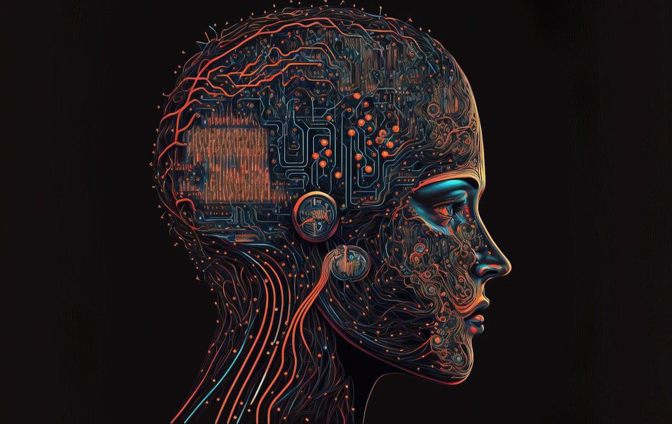

+++
slug = "ai20240604"
date = "2024-06-04"
lastmod = "2024-06-04"
title = "[AI资讯·0604] AI将取代某些工作，Anthropic致力于解决安全性和可解释性问题；AI搜索产品改变信息检索，百度应对挑战；AMD挑战NVIDIA市场领导地位；版权保护问题日益凸显，Shapley值框架提出解决方案；强化学习方法超越GPT-4v；Octopusv4模型优化多模态查询；李飞飞强调空间智能对AI发展的重要性。"
description = ""
image = "ai20240604-75.jpg"
tags = [ "AI", "AI资讯", "人工智能", "大模型" ]
categories = [ "AI资讯" ]
+++

## AI资讯

 - 首次解密Claude 3大脑！25岁Anthropic参谋长预言3年内自己将被AI淘汰
 - 不想炸薯条的Ilya和不送GPU的英伟达，Hinton最新专访：道路千万条，安全第
 - 硅谷团队抄袭清华系大模型？
 - 斯坦福AI Lab主任怒了！抄袭团队2人甩锅1人失踪、前科经历被扒
 - AI搜索，“杀死”搜索
 - AI预测极端天气提速5000倍！微软发布Aurora，借AI之眼预测全球风暴
 - AMD公布新款AI芯片，也要一年一更新，想挑战英伟达
 - 苏妈杀疯了：移动端最强NPU算力达50TOPS，最强AI芯片挑战英伟达
 - AI训练数据的版权保护:公地的悲剧还是合作的繁荣?
 - 多模态模型学会打扑克：表现超越GPT-4v，全新强化学习框架是关键
 - 3B模型新SOTA！开源AI让日常调用不同大模型更简单
 - 顶尖AI科学家李飞飞演讲：机器人进化离不开空间智能

## 首次解密Claude 3大脑！25岁Anthropic参谋长预言3年内自己将被AI淘汰

Anthropic参谋长预言自己将在接下来的三年内失去工作，因为她认为AI会取代她的职业。她指出，随着模型能力的提升，如Claude3，AI已经能够胜任多种类型的内容生成任务，并且在文本总结和分析方面表现突出。Balwitherself曾是一名自由作家，但现在认为这种技能已过时。她预测在线工作领域将首先受到影响，包括内容写作、税务准备和客户服务等任务。Balwit还提到AI已经开始在软件开发和合同法等专业领域显示出取代人类的潜力。尽管如此，Balwit也指出，并不是所有类型的工作都会被完全淘汰。她认为那些需要精细操作和特定情境专业知识的工种，如电工、园丁、管道工、珠宝制作师、理发师和修理铁艺品的工人，其从业人员将会比预期更长时间保持工作。对于医疗和公务员岗位，Balwit认为它们可能会在未来被取代的时间推后一些。对于那些不在这些领域的工作，也会有所减少，人机协作成为一种常见模式。Anthropic的CEODarioAmodei预计AI将在2-3年内实现AGI，但他也指出，这个过程是连续且平滑的，而公众对AI技术的认知和反应则是跳跃式和不可预测的。Amodei认为，虽然模型的能力有时会超越训练数据，但仍然存在挑战，比如如何解释模型内部的“思考”过程，以及如何确保模型安全性。Anthropic正在致力于通过可解释性的研究来解决这些问题，并且已经发布了一些有关Claude3Sonnet的研究成果。研究人员使用稀疏自编码器将数百万个特征从模型中提取出来，这些特征可以与人类可理解的概念相匹配，展示了模型内部状态如何由少量激活特征而非大量神经元活动表示。此外，研究人员还发现在某些情况下，可以通过人为方式激活特定的功能来改变模型的行为。这种操纵可以导致模型生成诈骗邮件等不良内容，但这也强调了对AI模型行为的深入理解和严格控制的重要性，以确保它们符合预期并不会造成伤害。总之，Balwit认为AI将取代某些工作，而Amodei则乐观地看待AGI的实现，但都意识到这个过程中存在许多挑战。Anthropic致力于通过研究和技术创新来解决这些问题，并确保人工智能的安全性和可解释性。（[报道详情](https://www.163.com/dy/article/J3M815QM0511ABV6.html)）

## 不想炸薯条的Ilya和不送GPU的英伟达，Hinton最新专访：道路千万条，安全第

人工智能领域的“教父”Hinton在离职谷歌一年后接受采访，分享了他与徒弟Ilya共同工作的点滴，以及他们如何一起推动AI技术发展。在采访中，Hinton谈到了自己早年的学习经历，包括在剑桥和爱丁堡的研究，以及他与Ilya合作开发反向传播算法的故事。两人之间的化学反应不仅产生了AI领域的重要突破，也孕育出了OpenAI的创意与成就。Hinton还提到了多模态模型将带来的新机遇，以及对AI伦理和安全的担忧，认为科学家应考虑到技术可能对社会的长远影响。（[报道详情](https://www.163.com/dy/article/J3M80DQ30511ABV6.html)）

## 硅谷团队抄袭清华系大模型？

斯坦福大学学生SiddharthSharma和AkshGarg开发的Llama3-V大型语言模型因其较低成本训练而受到关注，但后来被指控与“清华系”的大模型有雷同之处，引发了关于“套壳”的争议。虽然团队否认偷窃代码，但最终删除了相关项目并道歉。这种行为在AI行业中不罕见，涉及到模型架构和预训练的复用，以及调优过程中的变量名称更改。业内专家认为，这种做法虽然普遍存在，但对自主研发至关重要。（[报道详情](https://www.163.com/dy/article/J3PVVTLO0519APGA.html)）

## 斯坦福AI Lab主任怒了！抄袭团队2人甩锅1人失踪、前科经历被扒

斯坦福团队被指抄袭清华大模型，两位本科生承认并且与另一作者合作切割。SiddharthSharma和AkshGarg发表道歉声明，但未提及MustafaAljadery，后者失踪并被指为主要责任人。ChristopherManning批评团队避重就轻，并未认真抄袭。新发现的证据显示Llama3-V与MiniCPM-2.5极其相似，且可能直接在权重上添加了噪声。此事引发关于开源社区是否忽视中国大模型成果的讨论。（[报道详情](https://www.163.com/dy/article/J3RER9J40511DSSR.html)）

## AI搜索，“杀死”搜索

国内大型模型厂商纷纷推出C端AI搜索产品，打破了传统搜索引擎的垄断局面。腾讯、搜狗等公司推出了基于混元大模型的APP，提供AI搜索功能。这些产品主要分为两类，一些内置AI搜索，如Kimi、豆包、文心一言、通义千问和腾讯元宝；另一些专门开发了AI搜索服务，如360搜索、秘塔搜索、天工AI搜索和百川AI搜索等。这场竞争显得有些讽刺，因为在互联网时代，搜索引擎是高科技领域的佼佼者，而现在大模型时代谁都能参与。国内搜索引擎“一超多强”的格局即将被打破，百度如何应对成为焦点。谷歌已经在GoogleI/O上对其搜索业务进行了全面的AI改造，现在看百度的表现如何。Perplexity是一个典型的内嵌搜索代表，其通过算法从不同信息源中搜索并提供结果，界面简洁多功能，用户体验高效。虽然基于GPT-3.5的API调试，但已经获得了市场认可和资本支持。国内AI搜索产品主要是参照Perplexity进行设计和操作，如秘塔搜索模仿其UI设计和逻辑，而360AI搜索则在页面设计上显得老旧。天工AI搜索结合了多种能力但结果不够成熟。这些产品虽然效仿Perplexity，但还远未达到颠覆性的AI搜索。搜索广告是搜索引擎的关键收入来源，百度和谷歌均依赖这一业务。然而，随着ChatGPT的出现，微软和谷歌争夺新技术领域，而百度等公司迟迟未动，原因可能在于无法放弃传统广告模式。探索AI创业需要大量研发投入，如果没有广告收入支持，很难维持运营。总体上，AI搜索产品正在改变我们寻找信息的方式，但商业模式仍需调整以适应新趋势。Perplexity尝试2B市场服务，同时探索知识平台转型，而Kimi认为随着AI技术的深入集成，用户可能不再需要专门的搜索引擎，而是通过语音助手等方式检索信息。（[报道详情](https://www.163.com/dy/article/J3OGPL1A05198R91.html)）

## AI预测极端天气提速5000倍！微软发布Aurora，借AI之眼预测全球风暴

微软发布了名为Aurora的大气基础模型，这是一种新型的人工智能模型，能够从大量大气数据中学习并进行预测，具有极高的准确率和效率。与目前数值天气预报系统相比，Aurora的计算速度提高了约5000倍。该模型可以预测各种大气变量，如温度、风速、空气污染水平及温室气体浓度，并且能够在数据稀缺地区或极端天气情况下进行出色的预测。此外，Aurora的灵活性和多功能性使其在解决环境预报问题方面具有卓越的适应性。这种技术的发展有可能将改变我们对气候变化的理解和应对方式，并为全球各地提供更准确的天气信息，从而促进农业、交通、能源管理等领域的发展，帮助社区更好地适应气候变化带来的挑战。（[报道详情](https://www.163.com/dy/article/J3RD7ADL0511ABV6.html)）

## AMD公布新款AI芯片，也要一年一更新，想挑战英伟达

AMD发布新AI处理器，挑战英伟达市场领导地位；苏姿丰称人工智能是公司重中之重，计划每年更新产品线并推出重大创新。2025年将推出MI350系列，预计在AI推理性能提高35倍，而2026年将推出基于“Next”架构的MI400系列。AMD的股价虽然持平，但英伟达股价上涨5%，显示市场对AMD挑战的认可。（[报道详情](https://www.163.com/tech/article/J3QTQKHI00097U7T.html)）

## 苏妈杀疯了：移动端最强NPU算力达50TOPS，最强AI芯片挑战英伟达

AMD和英伟达在Computex展示了最新的技术，各自展现出强大的竞争力。AMDCEO苏姿丰展示了基于Zen5架构的新一代Ryzen9000系列CPU，以及锐龙AI300系列APU，其NPU算力达到50TOPS，超过微软对新一代AIPC的要求。同时，他们还推出了第五代EPYC霄龙芯片，为数据中心提供了强大的处理能力。而AMDInstinctGPU也展示了其在HPC和AI领域的潜力，并且公布了2024-2026年的产品路线图，旨在与英伟达竞争。（[报道详情](https://www.163.com/dy/article/J3RKP2QS0511AQHO.html)）

## AI训练数据的版权保护:公地的悲剧还是合作的繁荣?

摘要：随着生成式AI技术的快速发展，版权保护问题日益成为焦点。本文提出了一种基于Shapley值的版权分享框架，以解决AI模型训练数据所有者与开发者的利益冲突。该框架通过评估不同数据源对模型性能的贡献，并根据Shapley值计算版权分配，旨在实现公平合理的收益分配。实验表明，该框架能够准确识别每个版权所有者对AI生成内容的贡献，尤其是在多样化数据源融合的情况下。然而，该方法存在计算成本高的问题，未来需要开发更高效的算法或方法来解决这一挑战。此外，本文讨论了未来的研究方向，包括如何处理无法协商协议的版权所有者，以及如何在实际应用中提高Shapley值的可行性和效率。（[报道详情](https://www.163.com/dy/article/J3RMES2K0511AQHO.html)）

## 多模态模型学会打扑克：表现超越GPT-4v，全新强化学习框架是关键

强化学习方法RL4VLM，无需人类反馈，可以微调多模态大模型，使其在看图玩扑克、算“12点”等任务上表现超越GPT-4v。该方法由UC伯克利等高校研究人员提出，包括图灵奖得主LeCun和其他专家。通过强化学习直接从环境获取奖励，模型学会了多模态决策能力，并在各种评测任务中表现出色，包括数字识别、逻辑推理和视觉语义推理。实验表明，微调后的模型能够超越GPT-4vGemini和传统监督微调方法，在具身智能环境中的单物体拾取任务表现尤为突出。（[报道详情](https://www.163.com/dy/article/J3RMNI8A0511DSSR.html)）

## 3B模型新SOTA！开源AI让日常调用不同大模型更简单

NEXAAI的Octopusv4模型利用functionaltoken整合多个开源模型，针对特定任务进行优化。它通过智能地引导用户查询至最合适的专业模型，并重新格式化查询以实现最佳性能。Octopus-V4-3B是该系列中的一员，拥有30亿参数，开源，是语言模型图的主节点，擅长将用户查询转换为专业模型可处理的格式。在生产环境中，系统设计考虑了负载均衡、工作节点部署、主节点部署和通信。实验结果显示，Octopusv4模型在MMLU任务中的表现优异。未来的发展方向包括整合垂直特定模型，加强图形框架，并开发多模态模型。（[报道详情](https://www.163.com/dy/article/J3RNH6HO0511DSSR.html)）

## 顶尖AI科学家李飞飞演讲：机器人进化离不开空间智能

李飞飞在2024年TED大会上发表演讲，讨论了空间智能（SpatialIntelligence）对人工智能发展的重要性。她指出，随着神经网络算法、GPU计算能力和大数据的进步，计算机视觉领域取得了巨大进展，并且不仅仅是让计算机看到世界，更追求理解世界。空间智能是指在三维空间中学习知识并做出行动的能力，是人工智能发展中的下一个重要里程碑。李飞飞强调，为了实现空间智能，不仅需要算法和硬件，还需要确保技术始终以人为本。她提到了她的学生和合作者正在开发的机器人，可以在三维世界中行动，并且能够执行复杂任务，如做饭、给病人提供医疗服务等。这些进展预示着数字寒武纪大爆发即将到来，AI将拥有更强大的理解能力和空间感知能力，与人类合作创造出一个更美好的未来。然而，李飞飞也提醒我们，实现这一目标并不容易，我们需要在采取行动时深思熟虑，确保技术始终以人为本，以尊重人类个体的尊严，促进人类社会的共同繁荣。（[报道详情](https://www.163.com/dy/article/J3S12M8K051180F7.html)）

---

关注本公众号，我们共同学习进步👇🏻👇🏻👇🏻

---

我的本博客原地址：[https://mp.weixin.qq.com/s/kcvaZt92c9yNMMLUcghi7A](https://mp.weixin.qq.com/s/kcvaZt92c9yNMMLUcghi7A)

---
