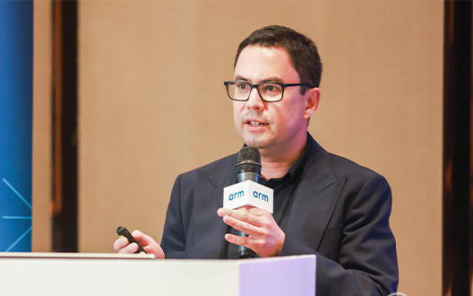

+++
slug = "ai20240605"
date = "2024-06-05"
lastmod = "2024-06-05"
title = "[AI资讯·0605] 智谱AI发布MaaS平台2.0和GLM-4系列开源模型，提升中文学科能力；四大聊天机器人同时宕机引发网络猜测；OpenAI安全疑云，前员工揭露内部问题；Arm推出终端计算子系统，支持生成式AI时代的布局；猿辅导看云大模型备案成功，教育应用潜力展现；商业智能领域迎来新变革，帆软FineChatBI利用AI大模型实现对话式业务分析。"
description = ""
image = "ai20240605-89.jpg"
tags = [ "AI", "AI资讯", "人工智能", "大模型" ]
categories = [ "AI资讯" ]
+++

## AI资讯

 - 1毛钱1百万token，写2遍红楼梦！国产大模型下一步还想卷什么？
 - AI「末日」突然来临，公司同事集体变蠢！只因四大聊天机器人同时宕机
 - OpenAI员工们开始反抗了！
 - AI手机PC大爆发，Arm从软硬件到生态发力，打造行业AI百宝箱
 - GLM-4开源版本：超越Llama3，多模态比肩GPT4V，MaaS平台也大升级
 - 猿辅导竟然是一家AI公司？大模型全家桶曝光｜甲子光年
 - FineChatBI，帆软在AI方向的新阳谋
 - 大模型“免费”送，厂商们图什么？
 - OpenAI前员工预测：2027年AGI降临！GPT智商飙升，4年从幼儿园蹿到高中生
 - 北京9岁小学生，已经用AI出书了！罗永浩围观：有事找不到我找AI
 - OpenAI CEO豪投400多家公司，持股200亿，AI芯片成重点

## 1毛钱1百万token，写2遍红楼梦！国产大模型下一步还想卷什么？

智谱AI发布了新一代MaaS平台2.0，并推出GLM-4系列开源模型，包括GLM-49B，这是目前最强大的国产大模型之一，其参数规模从6B升级至9B，同时具备多模态能力。新模型在中文学科方面实现了50%的提升，并且能够处理1M长度的上下文输入，相当于一次读完2本《红楼梦》。此外，智谱AI还提供了AllTools平台，支持开发者轻松训练私有模型，降低成本。随着大规模开源和商业化模式的推进，智谱AI正朝着AGI愿景前进，其MaaS平台2.0将进一步扩大生态圈。（[报道详情](https://www.163.com/dy/article/J3UP1OB60511ABV6.html)）

## AI「末日」突然来临，公司同事集体变蠢！只因四大聊天机器人同时宕机

昨日，四大聊天机器人ChatGPT、Claude、Gemini和Perplexity同时宕机，引发网友猜测。AI崩溃可能导致生产力下降，对部分依赖它们的人造成影响。宕机原因未明，有可能是DDOS攻击或巧合。OpenAI的ChatGPT先行宕机，其它两个在短时间内解决问题，而Gemini则出现不稳定情况。宕机事件显示了AI对社会的重要性和脆弱性，预示着未来生活中AI不可或缺的角色。此次宕机可能是由于基础设施问题或流量激增引起，也可能与ChatGPT宕机有关。四家公司尚未公布具体原因，但事件已成为对人类依赖AI生活方式的一次警醒。（[报道详情](https://www.163.com/dy/article/J3UP000L0511ABV6.html)）

## OpenAI员工们开始反抗了！

OpenAI安全疑云再起，前员工揭露内部问题。阿申布伦纳因向董事会分享安全备忘录被解雇，指出公司对AGI发展的热情与利润追求并重。13位前OpenAI和GoogleDeepMind员工联名信呼吁建立开放批评文化、匿名举报机制，警告AI公司避免监管和负责任地推动技术。OpenAI回应称，已有内部安全措施，但被指责为不当。（[报道详情](https://www.163.com/dy/article/J3UNK3QN051180F7.html)）

## AI手机PC大爆发，Arm从软硬件到生态发力，打造行业AI百宝箱

随着"Gen-AI"时代的到来，生成式AI与移动设备紧密结合，深刻影响生活和工作。Arm作为移动计算基础提供者，在架构、硬件、软件全面布局，为产业带来新的解决方案。Arm推出终端计算子系统（CSS），结合最新Armv9架构，CPU和GPU性能大幅提升。此次智东西对话Arm终端事业部产品管理副总裁JamesMcNiven，深入探讨了Arm在生成式AI时代的布局和思考。Arm通过完整解决方案让合作伙伴快速实现AI结合，为行业打造"AI百宝箱"。Arm的DNA与生成式AI契合，提供高性能、高能效的计算平台。新终端CSS基于3nm工艺，CPU和GPU物理实现，提升了30%的计算和图形性能，59%的AI推理速度。此外，ArmKleidi开发工具为开发者提供了快速开发生成式AI应用的解决方案。Arm生态系统迎来新的增长高潮，与微软合作，推动Windows与Arm架构的融合，加速WoA生态系统的发展。随着越来越多的应用成为Arm原生应用，ArmPC体验将更加完善。Arm通过技术创新保持核心竞争力，继续壮大生态，为生成式AI未来提供坚实基础。（[报道详情](https://www.163.com/dy/article/J3ULRRCM051180F7.html)）

## GLM-4开源版本：超越Llama3，多模态比肩GPT4V，MaaS平台也大升级

智谱AI宣布其大模型开放平台已获得30万注册用户，日调用量达400亿Tokens，API每日消费量增长50倍。GLM-4模型性能强劲，过去4个月内增长90倍。大型App中活跃智能体超过30万，包括生产力工具等。新技术侧，GLM-4-9B超越Llama3.8B，大模型保持开源。商业成果和技术突破令人瞩目。MaaS平台升级2.0，降低大模型应用门槛，国内大模型竞争加剧。智谱AICEO张鹏表示，通过技术创新实现成本持续下降，不怕价格战。API最高折扣达6折，GLM-4-9B版本仅需6分/100万token。智谱AI推出MaaS开放平台2.0，升级新模型、成本和安全等方面。在OpenDay活动中，智谱AI介绍了其开放平台最新进展，模型微调平台简化企业构建私有模型过程，全系列GLM-4大模型支持三步部署。（[报道详情](https://www.163.com/dy/article/J3ULD7JK0511AQHO.html)）

## 猿辅导竟然是一家AI公司？大模型全家桶曝光｜甲子光年

猿辅导旗下看云大模型成功通过大模型备案，引起教育界热议。尽管在“百模大战”中相对不占优势，但猿辅导凭借多年积累的数据资源和技术实力，以AI为核心的产品逐步展开了大模型的应用。其自研大模型并非作为单一产品，而是技术底座，通过与现有产品结合，为教育场景提供个性化服务。猿辅导的大模型落地速度快，涵盖家庭教育、作业批改、答疑系统等多个方面，其AI技术在教材识别、批改、生成反馈等环节发挥作用。通过大模型，学生可以享受到更为丰富的学习体验，教师则有助于提高教学效率。猿辅导的教育“全家桶”展现了大模型在教育中的潜力和应用前景，预示着将来AI技术会彻底改变传统教育模式，使得每个学生都能拥有专属的学习体验。（[报道详情](https://www.163.com/dy/article/J3PDRSQ90512MLBG.html)）

## FineChatBI，帆软在AI方向的新阳谋

在AI大模型技术的推动下，商业智能（BI）领域正迎来新的变革。帆软产品研发中心总经理陈敏表示，希望通过AI技术降低数据分析门槛，让更多人成为数据分析师。微软率先将Copilot整合进PowerBI，而全球知名BI服务提供商也开始注入AI大模型计划。国内BI厂商也紧跟趋势，推出类似功能。过去的问答式BI产品受限于技术，无法满足用户需求，帆软FineChatBI通过利用AI大模型的泛化能力，实现了对话式业务分析，让非专业人员能够进行数据分析。FineChatBI不仅能理解用户问题，还能拆解、查询数据，并提供异常检测和趋势预测功能。未来，FineChatBI有望进一步成为业务决策入口，直接将分析结果转化为业务指令。这将是BI领域的一个巨大变革，使得BI从辅助工具转变为实现业务闭环的核心。虽然AI技术进步迅速，但帆软认为，AI与BI不是简单相加，而是“AIforBI”，通过AI提升BI效率和降低使用门槛，让更多人能更好地利用BI工具。（[报道详情](https://www.163.com/dy/article/J3UBA9L30512MLBG.html)）

## 大模型“免费”送，厂商们图什么？

2024年618期间，大模型市场爆发了激烈的“价格战”，部分企业甚至开始免费提供服务。字节跳动宣布其豆包主力模型定价为0.0008元/千Tokens，远低于行业平均水平；阿里云则将通义千问GPT-4级主力模型Qwen-Long的API输入价格降至0.0005元/千Tokens。百度、腾讯云和科大讯飞也相继跟进，降低了自己的大模型定价。尽管如此，大部分企业的大模型业务仍面临高算力和人力成本的挑战，未能盈利。这种非理性的价格战反映出上游企业希望通过让利来打通大模型商业闭环的内在焦虑。然而，大模型商业模式不健全，成本高、落地难等问题仍然存在。由于训练和部署成本较高，一些企业对此保持观望态度。目前，大部分大模型仅推理用的token降价，而训练和部署成本依然不低。虽然价格战可能吸引了更多下游企业，但实际上，使用大模型服务的成本远未达到“免费”的程度。此次价格战或许能引起下游企业对大模型技术的关注，并有望探索出良性的商业模式。（[报道详情](https://www.163.com/dy/article/J3TP1HOJ05118O92.html)）

## OpenAI前员工预测：2027年AGI降临！GPT智商飙升，4年从幼儿园蹿到高中生

文章作者LeopoldAschenbrenner预测2027年可能实现强人工智能（AGI），引发了对其可行性的讨论。虽然他提供了多种数据和分析，但结论仍然存在争议，尤其是考虑到算力、算法效率与解开收益的叠加，以及未来四年的发展预测。同时，文章也提出了AGI实现可能面临的挑战，如幻觉问题等。（[报道详情](https://www.163.com/dy/article/J3UP1O070511ABV6.html)）

## 北京9岁小学生，已经用AI出书了！罗永浩围观：有事找不到我找AI

智谱AI举办OpenDay活动，展示了其AI智能体与小学生许萌萌合作出版的科普小说《AI少年——火星生存大挑战》。智谱清言AI智能体可以协助用户完成多项任务，如速读论文、生成PPT和流程图等。新发布的大型模型GLM-4-9B在综合能力上比ChatGLM3-6B提升40%，中文学科方面提升50%。同时，智谱AI开放平台升级至MaaS2.0，价格下降，性能提升。活动还展示了儿童使用智谱清言APP创作的画作，显示大模型应用的普及趋势。（[报道详情](https://www.163.com/dy/article/J3UL5EP30511DSSR.html)）

## OpenAI CEO豪投400多家公司，持股200亿，AI芯片成重点

1.OpenAICEOSamAltman拥有至少28亿美元的隐秘投资帝国，涉及400多家企业，其中包括知名AI公司。2.Altman的投资风格激进，曾在未完成介绍前即做出决定，他利用个人信贷对初创公司进行高风险投资。3.Altman在AI领域有显著投资，如CerebrasSystems、Humane和RainAI等。其中，Stripe是他最成功的投资之一，其估值为650亿美元。4.Altman与OpenAI的利益关系引发关注，他同时持股多家与OpenAI合作的公司，可能存在利益冲突。5.尽管如此，Altman表示会遵循政策，并对其投资保持透明。（[报道详情](https://www.163.com/dy/article/J3UNK4EO051180F7.html)）

---

关注本公众号，我们共同学习进步👇🏻👇🏻👇🏻

---

我的本博客原地址：[https://mp.weixin.qq.com/s/q8B0sgyv8uu5cuYQmJy4lQ](https://mp.weixin.qq.com/s/q8B0sgyv8uu5cuYQmJy4lQ)

---
