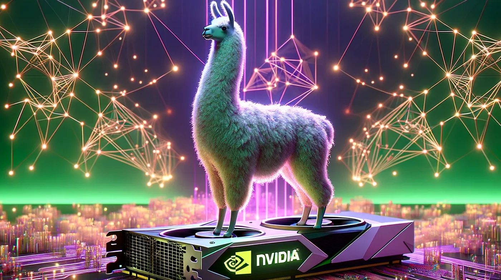

+++
slug = "20240430AI"
date = "2024-04-30"
lastmod = "2024-04-30"
title = "首个自主更新的多模态大模型，马斯克访华，文本一键转3D数字人骨骼动画，创新的虚拟试衣模型"
description = ""
image = "20240430-01.png"
tags = [ "AI咨询", "AI论文与开源", "AI投资" ]
categories = [ "每日AI", "AI大模型" ]
+++

## AI 资讯
+ AGI 加速降临！人大系多模态模型首次实现自主更新，写真视频生成力压 Sora
+ 支付宝推出的智能助理你用了吗？
+ 文本一键转 3D 数字人骨骼动画，阿尔伯塔大学提出 MoMask 框架
+ IDM-VTON：一种创新的虚拟试衣模型
+ 亚马逊研究奖获奖名单出炉：谢赛宁、Mamba 作者 Albert Gu 等入选
+ 马斯克周末突然访华！为世界最大 AI 项目 —— 特斯拉 FSD 以及 Robotaxi 业务做好准备
+ 奥特曼：学会用 30 秒说出大多数人需要 5 分钟才能表达的内容，是一个重大的突破，基本上就是大语言模型的工作原理
+ 本地在 H100 GPU 上运行 VSCode Llama3 Copilot
+ AdvPrompter: 快速自适应生成 LLM 对抗提示词方法
+ ScrapeGraphAI：爬虫库，使用 LLM 自动爬取
+ 欧盟委员会投资 1.12 亿欧元用于 AI 和量子研究及创新

### AGI加速降临！人大系多模态模型首次实现自主更新，写真视频生成力压 Sora
[原文地址](https://www.ifanr.com/1583512)

AGI（通用人工智能）是整个 AI 行业的圣杯。AGI 并非终点，而是人类发展史一个新的起点。在通往 AGI 的路上要考虑的事情还有很多，而中国的 AI 行业也是不可忽视的一股力量。

在4月27日召开的中关村论坛通用人工智能平行论坛上，人大系初创公司智子引擎隆重发布全新的多模态大模型 Awaker 1.0，向 AGI 迈出至关重要的一步。

相对于智子引擎前代的 ChatImg 序列模型，Awaker 1.0 采用全新的 MOE 架构并具备自主更新能力，是业界首个实现「真正」自主更新的多模态大模型。在视觉生成方面，Awaker 1.0 采用完全自研的视频生成底座 VDT，在写真视频生成上取得好于 Sora 的效果，打破大模型「最后一公里」落地难的困境。

### 亚马逊研究奖获奖名单出炉：谢赛宁、Mamba 作者 Albert Gu 等入选
[完整名单](https://www.amazon.science/research-awards/program-updates/99-amazon-research-awards-recipients-announced)

近日，亚马逊研究奖（Amazon Research Awards，ARA）获奖名单公布，今年共有 98 名获得者，来自 15 个国家 51 所大学。亚马逊研究奖 (ARA) 成立于 2015 年，该计划旨在为多个学科研究主题的学术研究人员提供不受限制的资金。获奖者可以公开访问 300 多个亚马逊公共数据集，并可以使用亚马逊的 AI/ML 服务和工具。除此以外，获奖者还将与亚马逊专家建立联系，以获得咨询和建议，还可以参加亚马逊举办的活动、培训课程等。

获奖者来自以下研究领域：人工智能信息安全、自动推理、AWS 人工智能、AWS 加密和隐私、AWS 数据库服务、可持续发展。值得注意的是，今年的获奖名单中出现了很多华人学者。

### 文本一键转 3D 数字人骨骼动画，阿尔伯塔大学提出 MoMask 框架
[论文链接](https://arxiv.org/abs/2312.00063)   [GitHub 地址](https://github.com/EricGuo5513/momask-codes)

想象一下，你仅需要输入一段简单的文本描述，就可以生成对应的 3D 数字人动画的骨骼动作。而以往，这通常需要昂贵的动作捕捉设备或是专业的动画师逐帧绘制。这些骨骼动作可以进一步的用于游戏开发，影视制作，或者虚拟现实应用。来自阿尔伯塔大学的研究团队提出的新一代 Text2Motion 框架，MoMask，正在让这一切变得可能。

### 马斯克周末突然访华！为世界最大 AI 项目 —— 特斯拉 FSD 以及 Robotaxi 业务做好准备
[原文地址](https://mp.weixin.qq.com/s/3XyfNbHHeuEzpPddzNV0HA)

4 月 28 日下午，应中国贸促会邀请，马斯克的私人飞机湾流 G550 飞机抵达北京，并会见了中国总理李强及其他高级官员，包括中国国际贸易促进委员会主任，随行的还包括特斯拉高管朱晓彤。马斯克上次访华是在 2023 年 5 月。在他 44 小时的访问期间，先后与中国外交部、工业和信息化部、商务部、中国国际贸易促进委员会的相关领导会面，还在深夜前往上海特斯拉超级工厂，随后与上海市的相关领导见面，这次是他时隔 11 个月后再次来到中国。

### 本地在 H100 GPU 上运行 VSCode Llama3 Copilot
[推特地址](https://twitter.com/dani_avila7/status/1784685190000070819)

在 VSCode 中引入 Llama3 作为 Copilot，现在使用 @NVIDIAAI 的 TensorRT 和 Triton 推理服务器在本地 GPU 上运行。
在本地和私下运行自己的 Copilot 已经非常棒了，但更令人瞩目的是能够在 H100 GPU 上运行它。现在，通过 CodeGPT 中的“自定义”连接，这种集成已经成为可能。在我们团队撰写的这篇文章中，我们将逐步指导您执行和部署模型，然后将其与 VSCode 连接起来。

链接：[https://medium.com/@vokturz/notes-about-running-a-chat-completion-api-endpoint-with-tensorrt-llm-and-meta-llama-3-8b-instruct-d2ec62a64b9c](https://medium.com/@vokturz/notes-about-running-a-chat-completion-api-endpoint-with-tensorrt-llm-and-meta-llama-3-8b-instruct-d2ec62a64b9c)

软件开发的未来将看到 AI 代理直接在您的计算机上编写和执行代码……所有这些都由 GPU 的计算能力加速。

### 奥特曼：学会用 30 秒说出大多数人需要 5 分钟才能表达的内容，是一个重大的突破，基本上就是大语言模型的工作原理
[推特原文](https://twitter.com/sama/status/1784643737525837935)

## 论文与开源
### AdvPrompter: 快速自适应生成 LLM 对抗提示词方法
[论文地址](https://arxiv.org/abs/2404.16873)

<b>摘要：</b>最近，大语言模型（LLMs）取得了显著成就，但它们容易受到某些越狱攻击的影响，导致生成不当或有害内容。手动红组测试需要找到导致越狱的敌对提示，例如在给定指令后附加后缀，效率低且耗时。在另一方面，自动敌对提示生成通常导致语义无意义的攻击，可以轻松被感知度过滤器检测到，可能需要来自TargetLLM的梯度信息，或由于耗时的离散优化过程而无法很好地扩展。

在本文中，我们提出了一种新方法，使用另一个LLM，称为AdvPrompter，仅需几秒钟生成人类可读的敌对提示，比现有基于优化的方法快约800倍。我们使用一种无需访问目标LLM梯度的新算法对AdvPrompter进行训练。此过程交替进行两个步骤：

（1）通过优化AdvPrompter预测生成高质量的目标敌对后缀，以及

（2）使用生成的敌对后缀对AdvPrompter进行低秩微调。经过训练的AdvPrompter生成的后缀掩盖了输入指令而不改变其含义，因此TargetLLM被诱导提供有害响应。对流行的开源TargetLLMs的实验结果显示AdvBench数据集上的最新成果，也可转移到闭源的黑盒LLM API。

此外，我们证明通过对AdvPrompter生成的合成数据集进行微调，可以使LLMs更加抵御越狱攻击而保持性能，即高MMLU得分。

### IDM-VTON：一种创新的虚拟试衣模型
[GitHub地址](https://github.com/yisol/IDM-VTON)  [Hugging Face](https://huggingface.co/spaces/yisol/IDM-VTON)

它通过融合服装图像的高低层语义特征以及提供详细的文本提示，生成比之前的方法更加自然和真实的虚拟试衣图像。此外，它还提出了一种基于用户输入的定制方法，进一步提高了生成图像的保真度和真实感，在保留服装细节方面也有出色的表现。

### ScrapeGraphAI：爬虫库，使用 LLM 自动爬取
[推特原文](https://twitter.com/LangChainAI/status/1784590140444176592)  [GitHub地址](https://github.com/VinciGit00/Scrapegraph-ai)

ScrapeGraphAI 是一个网络爬虫 Python 库，它使用大型语言模型(LLM)为网站、文档和 XML 文件创建爬取流水线。只需说明你想提取哪些信息，该库就会为你完成!

## 投资
### 欧盟委员会投资 1.12 亿欧元用于 AI 和量子研究及创新

欧盟委员会宣布将投资 1.12 亿欧元，支持人工智能（AI）和量子技术的研究和创新。这笔资金将通过“地平线欧洲”2023-2024年度的数字、工业和空间工作计划来调配。其中，6500 万欧元将用于AI领域，包括 5000 万欧元专门用于开发新的数据组合方式和扩大大型AI模型的能力，1500 万欧元将投资于开发健壮且透明的 AI 系统。另外，4000万欧元将用于推动尖端量子技术的研究，包括创建全欧洲量子重力仪网络的 2500 万欧元投资，以及 1500 万欧元用于跨国量子技术的下一代研发项目。此外，还有 750 万欧元将用于支持欧洲价值观和加强欧盟在全球ICT标准化中的影响力的项目。

---
我的本博客原地址：[https://ntopic.cn/p/20240430AI](https://ntopic.cn/p/20240430AI/)

---

