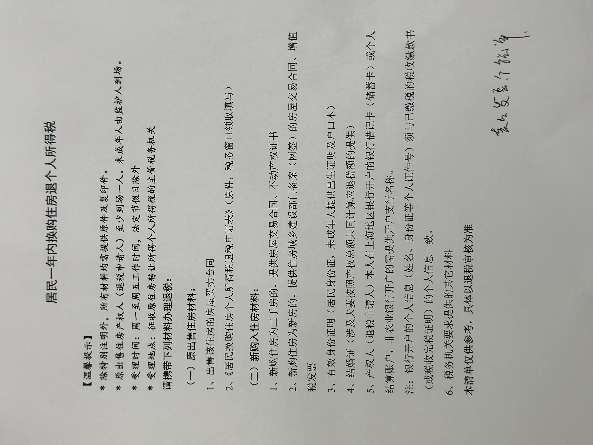
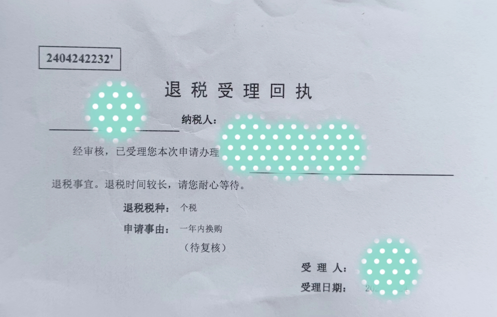

+++
slug = "2024050501"
date = "2024-05-05"
lastmod = "2024-05-05"
title = "上海个人购房退税经历和注意事项（收藏不踩坑）"
description = ""
image = "00.jpg"
tags = [ "退税", "交易" ]
categories = [ "买房卖房" ]
+++

> 2023 年至 2024 年之间，在一年内换购（先卖后买）个人二手住房，卖房的个人所得税，在新买房后可以申请退还。我于 2024 年 4 月 24 日完成卖房的个税**退税**办理申请，办理过程的注意事项，通过本文分享给大家，避免大家踩坑白跑。同时，我于 2024 年 4 月 27 日提取**住房公积金**办理（资金 10 分钟内到账），关注本公众号，下文继续分享公积金提取的注意事项……

## 前提：卖房个税发票和网签合同

我于 2023 年 5 月和 8 月分别卖掉了上海浦东 2 套个人住房，因前期就了解了个税退税政策，且自己接下来也准备买房（小孩读书），因此在和买家、中介前期沟通中，均明确表示我需要个税发票。为什么要特别强调卖房时个税发票的归属沟通呢，个税的纳税人本来不就是卖家吗：

- 卖房**过户**的时候，默认情况下（二手房买卖基本行情），买家和卖家均会签署交易税代缴协议，即卖房的交易税（如：个税、增值税等）在缴税时由**买家代缴**（也就是房子的价格是房东到手价）

- 卖房**缴税领证**的时候，因为有过户时的代缴协议，卖家一般不到场（我卖房和我买房的时候，我和卖家均未到场），那么个税发票**默认**由买家缴税后进行保管

**注意事项**：为了避免后续退税时，再找买家要发票时的不必要的麻烦（比如：发票找不到了、买家人在外地等）；在卖房缴税时，一定要把个税发票拿到手且保管好（我和买家、中介前期均沟通明确，缴税当天发票由中介经理保管，后面我再去中介经理处领取）

**友情提示**：在申请退个税还需要查看卖房的**网签合同**原件（注意不是居间合同），因此网签合同也需要保管好，不要当废纸扔掉了（建议至少保管 5 年后在决定是否扔掉）。

**友情提示**：退税只能退一套房子的个税，如果卖掉了多套房子，建议选择房价较高、个税金额较多的那套房子进行退税（不差钱的朋友请随意）。

## 买房：网签、缴税和领取新产证

买房过程很复杂，流程也一般较长，稍微说一下我的买家流程，仅做参考：

- 前期准备：明确购房需求、明确预算、确定购房片区、网上了解房价、最终确定购房小区（因为我是要买学区房、兼顾自住，所以我的目标非常明确，也省去了很多带看的时间）

- 中介带看：我的带看次数非常少，屈指可数，绝大部分都是微信和电话沟通。因为我买房目标非常明确（锚定了 1 个小区、中间套高层），因此和中介经理沟通时也比较顺畅

- 签署**居间合同**：房子看中了，价格谈好了，就是开始签署居间合同，需要注意的协议内容、补充协议等

- 房产中心**交易流程**（领新产证）：这个流程房产中介经理都非常熟悉，只需要按照他们的指示操作即可，包括**网签**（付首付、申请按揭贷款）、提前预约**过户**（签署代缴协议）、提前预约**缴税领证**（`友情提示`：缴税可以刷信用卡、且一笔税费金额可分开刷多张卡）

## 退税：领证当天可完成办理

拿到新购房产证后，即可办理申请退个税了，因为也在交易中心办理，因此同样的也需要提前 3 天预约（预约在缴税领证当天即可，免得还需要单独跑一趟）。

下面是《居民一年内换购住房退个人所得税》的官方指南文档，里面列出了退税的材料清单，如果你按照这份指南来准备退税材料的话，那很不幸你可能要`白跑一趟`了：

根据我的亲身退税经历，需要的**材料清单**如下，缺一不可，请务必准备好**原件**。如果方便的话建议也复印一下，这样就无需在办理时临时复印了，窗口办理也能更省时，当然也可以到拿原件到交易中心去复印（我就是在交易中心由中介经理帮忙临时复印的）。

**卖房**相关的材料清单（我前面也重点提到）：

- 卖房的**网签合同**（注意不是居间合同）

- 卖房的**个税发票**：再次建议提取和买家沟通好，买家缴税领证后，就把个税发票及时拿到手保管好

**买房**（新购房）相关的材料清单：

- 买房的**网签合同**、新领取的**产权证**、新购房**契税**完税证明（注意：下一篇文章，我会介绍**住房公积金**提取，也需要用到契税完税证明）

- 身份材料：夫妻双方**身份证**、**结婚证**（注意：若有离婚史，还需要去民政局打印**婚史**证明材料，在哪个民政局办理就去哪个民政局打印，它们之间信息不互通）、**户口本**、小孩的**出生证明**

- 银行卡：提供一张产权本人的中资一类**借记卡**（包括弄清开户行支行名称）

材料清单原件准备齐全，窗口工作人员检查无误后，收走复印件，填写《居民换购住房个人所得税退税申请表》即可，最终窗口返回一张《**退税受理回执**》，如下所示：

在此，我要特别感谢我的购房中介经理**王经理**（唯宝地产的王和旭经理），退税其实不属于购房交易流程部分，他完全可以不用帮忙办理。王经理不但没有撒手不管，我在办理时忘记带购房的**网签合同**，王经理帮忙到缴税窗口借了本合同；同时，因材料我均只带了原件，王经理跑了两趟帮忙复印。给王经理点赞 👍🏻

## 禅定：总结

恭喜你，在拿到退税窗口的《退税受理回执》后，退税的整个流程就成功办理完成了，按照窗口工作人员提示，在等待半年到一年，资金会打到银行卡上。

从上面退税流程可以看下，流程的关键是材料齐全，再次强调一下几个重要的材料：

- 卖房材料务必保管好，包括卖房**网签合同**和**个税发票**，特别是个税发票，务必提前沟通好，买家缴税拿到手

- 买房材料务必带齐全，包括交易相关的基本材料、个人身份材料（注意：如果有离婚史，需要去办理的民政局打印**婚史**材料）、中资一类借记卡

---

退税办理好了，接下来就是去办理住房公积金领取手续了，下篇文章在与大家分享。关注本公众号，顺畅办理不白跑。

---

我的本博客原地址：[https://ntopic.cn/p/2024050501](https://ntopic.cn/p/2024050501/)

---

