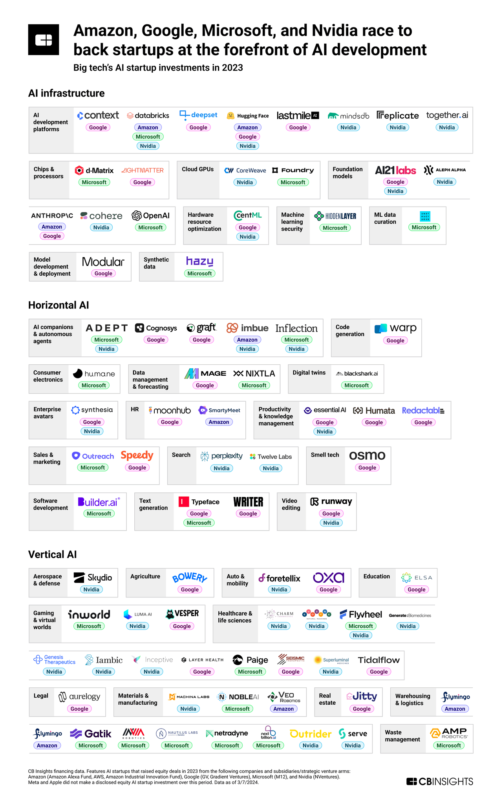

+++
slug = "ai20240506"
date = "2024-05-06"
lastmod = "2024-05-06"
title = "[每日AI·0506]GitHub 版 Devin，Transformer的强力挑战者 Mamba，Sora 制作细节与踩坑，OpenAI 记忆功能"
description = ""
image = "20240506-01.png"
tags = [ "AI资讯" ]
categories = [ "每日AI", "AI大模型" ]
+++

## AI 资讯

- 苹果或将推出 AI 功能，随 iPhone 发布
- 2024 年巴菲特股东大会，巴菲特将 AI 类比为核技术 巴菲特股东大会 5 万字实录
- 消息称 OpenAI 将于 5 月 9 日发布 ChatGPT 版搜索引擎
- 路透社消息，斯坦福大学 AI 领军人物李飞飞打造“空间智能”创业公司 报道地址
- 爆款生成式 AI 硬件，销量突破 10 万台，拆完一看只是安卓 app？
- Sam Altman 在斯坦福创业者思维领导研讨会上的对话 翻译全文 Youtube 视频
- 告别偏科，能玩转多模态、多任务、多领域的强化智能体终于来了
- 12 年前上手深度学习，Karpathy 掀起一波 AlexNet 时代回忆杀，LeCun、Goodfellow 等都下场
- Anthropic 终于推出企业版以及 iOS 应用！全面对标 OpenAI
- Perplexity CTO 最新复盘：软件利润开始变厚，不排除广告收入，但 Perplexity 可能不会像谷歌那样成功
- Andrew Ng：低成本令牌生成和代理工作流程
- 大型科技公司 2023 年的人工智能投资图表

## 苹果或将推出 AI 功能，随 iPhone 发布

报道地址：[https://9to5mac.com/2024/05/02/tim-cook-apple-ai-features/](https://9to5mac.com/2024/05/02/tim-cook-apple-ai-features/)

根据《华盛顿邮报》的报道，苹果公司首席执行官蒂姆·库克预计将在下周的“放手一搏”活动中对即将推出的 AI 功能进行“暗示”。尽管新款 iPad 是活动的主焦点，但苹果可能利用此机会初步概述新的 AI 功能。这些功能预计将在 6 月的全球开发者大会（WWDC）上详细介绍并随新一代 iPhone 16 系列和 iOS 18 一起发布。此外，苹果将其 5 月 7 日的主题演讲描述为“一种不同类型的活动”，这进一步增加了对新 AI 功能预览的期待。

## 2024 年巴菲特股东大会，巴菲特将 AI 类比为核技术

巴菲特股东大会 5 万字实录：[https://finance.sina.com.cn/stock/usstock/c/2024-05-05/doc-inaucmni4617264.shtml?finpagefr=p_108](https://finance.sina.com.cn/stock/usstock/c/2024-05-05/doc-inaucmni4617264.shtml?finpagefr=p_108)

**提问：** 我是 John（音），从旧金山过来，你觉得现在科技进步特别是生成式 AI 跟传统行业能带来多大的优势？

**巴菲特：** 不好意思，我问了四区问题，现在就后悔了，应该去问二区。我对 AI 人工智能一无所知，但是这不意味着好像这个技术不重要。去年我也提到过，我们已经让精灵从瓶子里跳出来，特别是我们在之前发明核武器的时候，它现在正在做一些坏事。这个精灵的这种力量有的时候让我感到恐惧，而且它已经再也塞不回瓶子里了，我觉得 AI 可能也有些相似，已经让它跳了出来。它当然非常重要，对很多人来说作用非常大，但是我们希望这样的精灵希望在未来能够做好事，但是我没有办法去对它进行评估，特别是我，我根本没有办法去做评估。像“二战”的时候，当时有了核技术，我们当时发明了原子弹，我们觉得好像是非常必要地来终止战争，对美国来说可以长期拯救生命，而且爱因斯坦也提过，说“你如果做了核试验，你可能会让文明终止”，但是最后美国还是决定把这个精灵从瓶子里放出来。我觉得这样的一些决定都会影响我们下一代，会影响未来的，这也是我们现在所看到的。

在 AI 这边，它的发展，老实说还是让我有些紧张的，特别是最近的一些进展。我有些时候眼前会有这样一张图片，我出现在那张照片里对着我尖叫。这个是什么意思呢？就是我当时出了问题，没有任何人救得了我。

所以，当你去思考一下，在未来你可以用这样的技术去欺诈、去重新生成这样一张图片，比如说图片里边也是我，然后我来找你说需要钱，生成式 AI 可以做这种事情，让我突然出现在一张图片里，你难辨真假，或者说我需要多少多少钱。欺诈在美国一直都是会出现的一种情况。如果我之前有兴趣投资这个欺诈市场的话，它可能成长会很快。AI 当然也有潜力去做好事，但是我刚才提到的这个例子和我之前目睹的一些现象，我觉得可能会有些吓人，我可能甚至看到这个照片之后，我难辨真假，甚至会把钱寄给一个来骗自己的我。所以，跟核技术一样，我觉得这个精灵已经从瓶子里放出去了，我对此一无所知。我觉得 AI 不管是做好事还是做坏事的很大的潜力，我只能让它自然而然在未来发生。

我也想跟贝琪说一声，阿吉特今天下午不会在现场，如果今天有一些问题跟保险有关，想问他的话，尽量在上午问。

## 消息称 OpenAI 将于 5 月 9 日发布 ChatGPT 版搜索引擎

报道地址：[https://www.techweb.com.cn/it/2024-05-06/2944405.shtml](https://www.techweb.com.cn/it/2024-05-06/2944405.shtml)

## 路透社消息，斯坦福大学 AI 领军人物李飞飞打造“空间智能”创业公司

报道地址：[https://www.reuters.com/technology/stanford-ai-leader-fei-fei-li-building-spatial-intelligence-startup-2024-05-03/](https://www.reuters.com/technology/stanford-ai-leader-fei-fei-li-building-spatial-intelligence-startup-2024-05-03/)

知情人士透露称，李飞飞最近为这家公司进行了种子轮融资，投资者包括硅谷风险投资公司 Andreessen Horowitz，以及她去年加入的加拿大公司 Radical Ventures。不过，Andreessen Horowitz 和 Radical Ventures 的发言人均对此保持沉默，李飞飞也未作回应。

## 告别偏科，能玩转多模态、多任务、多领域的强化智能体终于来了

论文地址：[https://arxiv.org/abs/2402.09844](https://arxiv.org/abs/2402.09844)

GitHub 地址：[https://github.com/huggingface/jat](https://github.com/huggingface/jat)

项目地址：[https://huggingface.co/jat-project/jat](https://huggingface.co/jat-project/jat)

来自 Hugging Face、法国国家信息与自动化研究所（INRIA）和波尔多大学的四位研究者提出了智能体中的「六边形战士」——Jack of All Trades (JAT)。JAT 是一个基于 Transformer 的多模态通用强化学习智能体框架。在此框架下，智能体能够通过同一套参数应对不同复杂度的多种任务，化身既会打游戏，又能控制机器人的全能高手。论文同时发布了大量 RL 智能体与 JAT 数据集。这是首个用于通用智能体训练的数据集 JAT 数据集，包含了由专家智能体收集的数十万条轨迹。

## 12 年前上手深度学习，Karpathy 掀起一波 AlexNet 时代回忆杀，LeCun、Goodfellow 等都下场

推特地址：[https://twitter.com/karpathy/status/1786537319576789425](https://twitter.com/karpathy/status/1786537319576789425)

没想到，自 2012 年 AlexNet 开启的深度学习革命已经过去了 12 年。而如今，我们也进入了大模型的时代。近日，知名 AI 研究科学家 Andrej Karpathy 的一条帖子，让参与这波深度学习变革的许多大佬们陷入了回忆杀。从图灵奖得主 Yann LeCun 到 GAN 之父 Ian Goodfellow，纷纷忆往昔。到目前为止，该帖子已经有 63 万 + 的浏览量。

## 跨越 300 多年的接力：受陶哲轩启发，数学家决定用 AI 形式化费马大定理的证明

在陶哲轩的启发下，越来越多的数学家开始尝试利用人工智能进行数学探索。这次，他们瞄准的目标是世界十大最顶尖数学难题之一的费马大定理。费马大定理又被称为「费马最后的定理（Fermat's Last Theorem，FLT）」，由 17 世纪法国数学家皮耶・德・费马提出。它背后有一个传奇的故事。据称，大约在 1637 年左右，费马在阅读丢番图《算术》拉丁文译本时，曾在第 11 卷第 8 命题旁写道：「将一个立方数分成两个立方数之和，或一个四次幂分成两个四次幂之和，或者一般地将一个高于二次的幂分成两个同次幂之和，这是不可能的。关于此，我确信已发现了一种美妙的证法 ，可惜这里空白的地方太小，写不下。」这段话前面所表述的就是费马大定理的内容：当整数 n>2 时，关于 x^n + y^n=z^n 的方程没有正整数解。费马表示，自己知道怎么证明，但因为书的空白部分太小，就没有写。对于该故事的真实性以及费马是否真的想出了证明方法，后世是存在争议的。

## Anthropic 终于推出企业版以及 iOS 应用！全面对标 OpenAI

原文地址：[https://mp.weixin.qq.com/s/JKXoHkg89aXzVlIlA0Q8nA](https://mp.weixin.qq.com/s/JKXoHkg89aXzVlIlA0Q8nA)

Anthropic 正在推出一项针对企业的新付费计划，其中包括医疗保健、金融和法律等受到高度监管的行业，该计划名为“Team”，为客户提供对 Anthropic 的 Claude 3 系列生成型 AI 模型以及额外的管理员和用户管理控制的更高优先级访问权限。

## Perplexity CTO 最新复盘：软件利润开始变厚，不排除广告收入，但 Perplexity 可能不会像谷歌那样成功

原文地址：[https://mp.weixin.qq.com/s/ursDVU9_4y3Rekx66vOUFw](https://mp.weixin.qq.com/s/ursDVU9_4y3Rekx66vOUFw)

Perplexity CTO Denis Yarats 在近期向投资人分享了 Perplexity 产品演变、AI 技术以及商业模式的思考。Denis 谈到，Perplexity 当前的订阅是主要模式，未来肯定会有其他的东西，但现在看来实际利润也是相当不错。Denis 和团队观察到，过去一年中运行这些模型变得更加便宜，硬件也变得更便宜，模型变得更小更好，即使高 API 价格也降低了，过去一年中降了四五次，然后 Perplexity 内部也建立了一些东西，不必像以前那样过多地依赖 OpenAI API ，随着时间推移 Perplexity 利润正在增加。他表示，Perplexity 仍然会有其他的机会来实现盈利，不排除广告，但像 Google 现在所做的广告形式可能不是我们要做的。可以通过有效方法让广告成为对用户有益的方式，如果广告有帮助的话，人们其实并不介意广告。

## 爆款生成式 AI 硬件，销量突破 10 万台，拆完一看只是安卓 app？

原文地址：[https://mp.weixin.qq.com/s/7DIN7q3xqTtXQjwJw8EbcA](https://mp.weixin.qq.com/s/7DIN7q3xqTtXQjwJw8EbcA)

美国记者 Mishaal Rahman 曝光了知名生成式 AI 硬件 Rabbit R1 的细节，立即引来了科技圈的关注。几个月前，Humane、Rabbit 两家初创公司陆续推出他们的人工智能设备 ——Ai Pin 和 Rabbit R1。最初，一些人认为这些设备将开创可穿戴人工智能的新时代。然而，几个月过去了，对于这两款设备的争议逐渐增多。Rabbit R1 首次亮相是在 CES 2024 上，它是一款手掌大小的 AI 智能设备，售价 199 美元。其背后的研发公司 Rabbit 致力于基于大型行为模型（Large Action Model, LAM）研发下一代操作系统。

## 参数量不到 10 亿的 OctopusV3，如何媲美 GPT-4V 和 GPT-4？

论文地址：[https://arxiv.org/pdf/2404.11459.pdf](https://arxiv.org/pdf/2404.11459.pdf)

多模态 AI 系统的特点在于能够处理和学习包括自然语言、视觉、音频等各种类型的数据，从而指导其行为决策。近期，将视觉数据纳入大型语言模型 (如 GPT-4V) 的研究取得了重要进展，但如何有效地将图像信息转化为 AI 系统的可执行动作仍面临挑战。在最近的一篇论文中，研究者提出了一种专为 AI 应用设计的多模态模型，引入了「functional token」的概念。为确保该模型能兼容边缘设备，研究者将其参数量优化至 10 亿以内。与 GPT-4 类似，该模型能同时处理英文和中文。实验表明，该模型能在包括树莓派等各类资源受限的终端设备上高效运行。

## 人工智能，步步逼近奥数天才

原文地址：[https://mp.weixin.qq.com/s/pCnvv1XO9sb0304LdAJobg](https://mp.weixin.qq.com/s/pCnvv1XO9sb0304LdAJobg)

国际数学奥林匹克竞赛（IMO）或许是难度最高的高中数学竞赛，几乎集结了所有的数学天才。最近，一个名为“AlphaGeometry”的人工智能（AI）程序强势加入了 IMO 赛道，它在几何证明题上的表现已逼近人类金牌选手。在这篇来自《环球科学》2024 年 5 月新刊中，我们将跟随玛农·比肖夫的讲述，了解人工智能是如何步步逼近人类奥数天才的。

# Andrew Ng：低成本令牌生成和代理工作流程

推特地址：[https://twitter.com/AndrewYNg/status/1786057567178834328](https://twitter.com/AndrewYNg/status/1786057567178834328)

低成本令牌生成和代理工作流程为大型语言模型（LLM）开辟了训练 LLM 使用合成数据的新可能性。直接在 LLM 自己生成的对提示的响应上进行预训练并没有帮助。但是，如果通过 LLM 实现的代理工作流程能产生比 LLM 直接生成的更高质量的输出，那么在该输出上进行训练就可能有用。

正如人类可以从自己的思考中学习一样，LLM 可能也能做到。例如，想象一个正在学习编写数学证明的数学学生。通过解决一些问题——即使没有外部输入——他们可以反思什么有效，什么无效，并通过练习学习如何更快地生成好的证明。

广泛来说，LLM 的训练包括：(i) 预训练（从未标记的文本数据中学习以预测下一个单词），然后是 (ii) 指令微调（学习遵循指令）以及 (iii) RLHF/DPO 调整，以使 LLM 的输出与人类价值观相匹配。步骤 (i) 需要的数据量比其他步骤多得多。例如，Llama 3 预训练了超过 15 万亿个令牌，LLM 开发者仍然渴望更多数据。我们还能从哪里获取更多的文本来训练呢？

许多开发者直接在大模型的输出上训练小模型，这样小模型就学会了模拟大模型在特定任务上的行为。然而，一个 LLM 通过直接生成的数据训练并不能学到太多，就像一个监督学习算法不能从尝试预测它自己生成的标签中学习一样。的确，一个模型反复在它自身早期版本的输出上训练可能会导致模型崩溃。

然而，一个包裹在代理工作流程中的 LLM 可能会产生比它直接生成的更高质量的输出。在这种情况下，LLM 的高质量输出可能作为 LLM 本身的预训练数据有用。

像这样的努力有先例：

- 在使用强化学习玩象棋游戏时，一个模型可能学习一个评估棋盘位置的函数。如果我们结合使用低精度的评估函数进行游戏树搜索，模型可以得出更准确的评估。然后我们可以训练该评估函数来模仿这些更准确的值。
- 在对齐步骤中，Anthropic 的宪法 AI 方法使用 RLAIF（来自 AI 反馈的 RL）来评估 LLM 输出的质量，用 AI 模型生成的反馈替代人类反馈。

使用代理工作流程引导 LLM 生成自己的训练数据的一个重大障碍是生成令牌的成本。假设我们想生成 1 万亿个令牌来扩展现有的训练数据集。目前，按公开宣布的价格，使用 GPT-4-turbo（每百万输出令牌 30 美元），Claude 3 Opus（75 美元），Gemini 1.5 Pro（21 美元）和 Groq 上的 Llama-3-70B（0.79 美元）生成 1 万亿个令牌的成本分别为 3000 万美元、7500 万美元、2100 万美元和 79 万美元。当然，像反思这样的设计模式的代理工作流程会要求生成的令牌数量超过我们作为训练数据使用的令牌。但是，训练尖端 LLM 的预算容易超过 1 亿美元，因此花费几百万美元用于提升性能的数据是完全可行的。

这就是为什么我相信代理工作流程将为高质量合成数据生成开辟新的有趣机会。

## 大型科技公司 2023 年的人工智能投资图表

推特地址：[https://twitter.com/chiefaioffice/status/1786545556845666372](https://twitter.com/chiefaioffice/status/1786545556845666372)

由美国大型科技公司及其风险投资部门支持的人工智能初创企业的交易数量同比增长了 57%。

---

我的本博客原地址：[https://ntopic.cn/p/ai20240506](https://ntopic.cn/p/ai20240506/)

---

