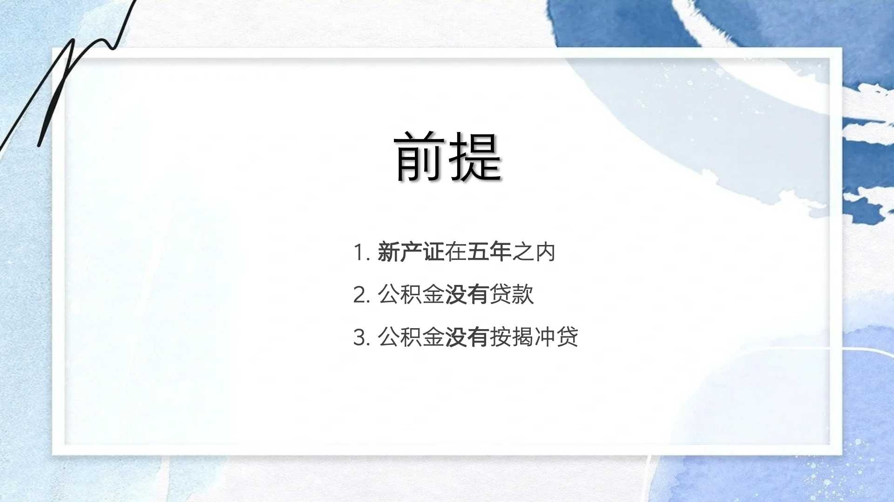
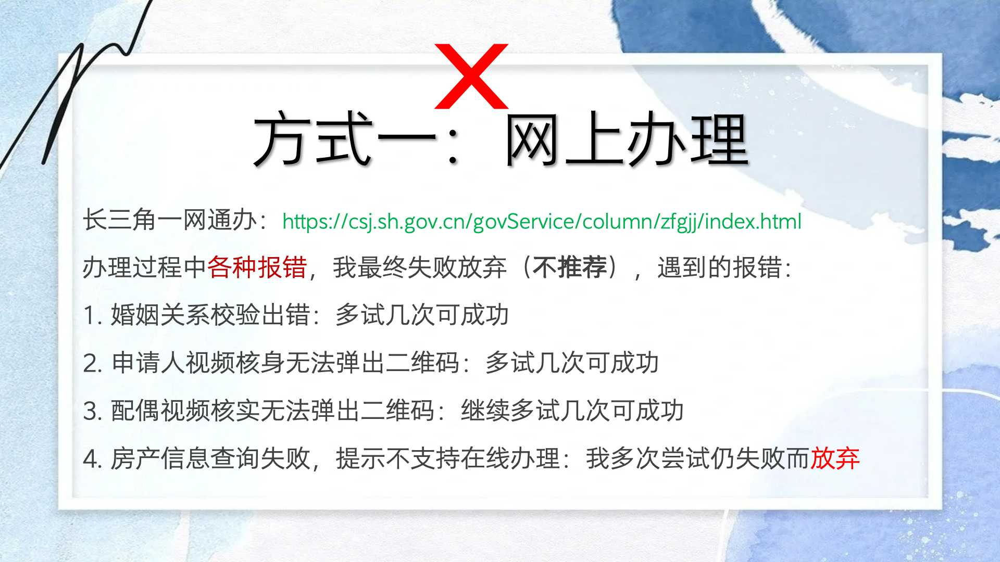
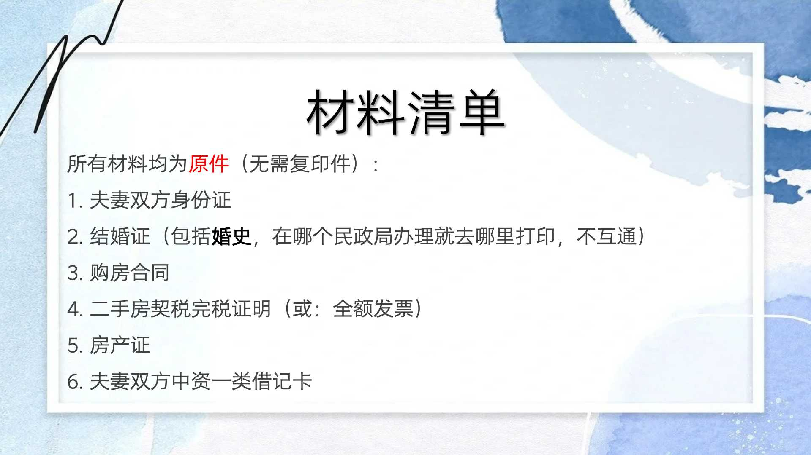
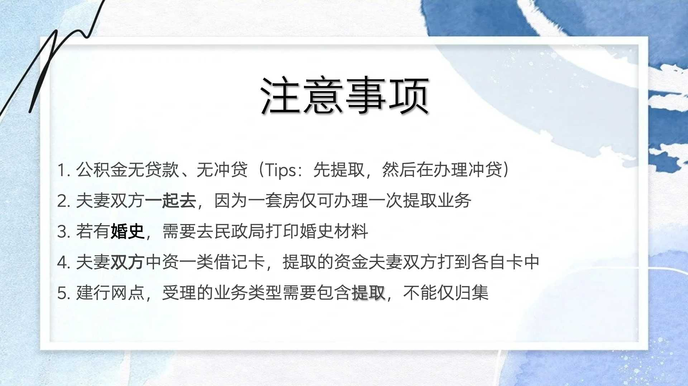
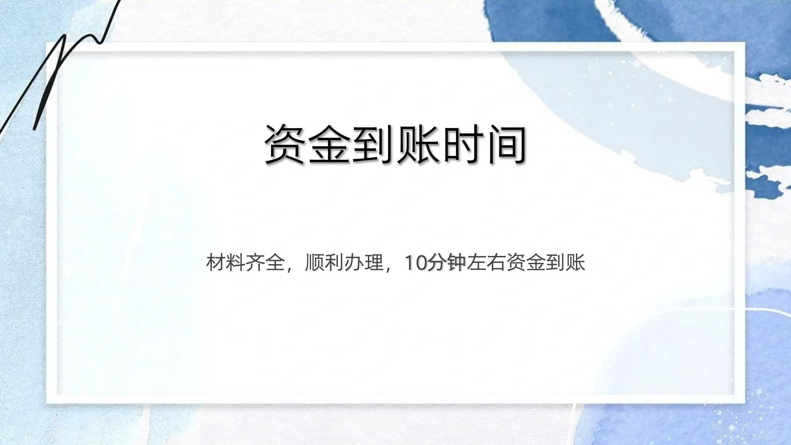
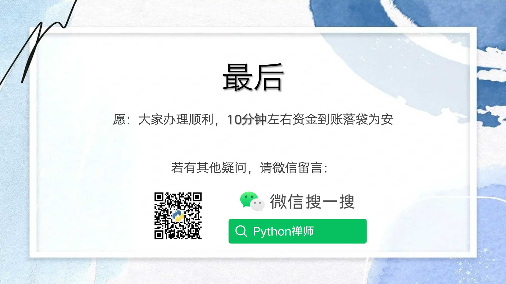

+++
slug = "2024050701"
date = "2024-05-07"
lastmod = "2024-05-07"
title = "上海个人购房退税经历和注意事项（收藏不踩坑）"
description = ""
image = "1.jpg"
tags = [ "公积金", "提取" ]
categories = [ "买房卖房" ]
+++

> 在前一篇文章中，我介绍了 2024 年 4 月 24 日上海个人购房**个税退税**经历，我于 4 月 27 日周六，顺利办理租房**公积金提取**业务，资金在业务办理完成后 10 分钟左右到账。通过本文分享办理过程的材料和注意事项，避免大家踩坑白跑。接下来，就是房子装修了，关注本公众号，后面继续分享装修的点滴内容……

上一篇文章：[上海个人购房退税经历和注意事项（收藏不踩坑）](https://ntopic.cn/p/2024050501/)

## 提取住房公积金的前提（无贷款）

- 公积金无贷款、无冲贷，否则无法提取

- 新产证五年以内（这个要求容易达到）

## 提取方式一：长三角一网通办线上办理（不推荐）

在线地址：[https://csj.sh.gov.cn/govService/column/zfgjj/index.html](https://csj.sh.gov.cn/govService/column/zfgjj/index.html)

能线上办理那当然是优先选择，但是很不幸，提交表单过程中，系统频频出错，唯一的解决办法就是重试，直到重试 N 次也无解后放弃：

我的第一个错误：婚姻关系校验错误，当时我就傻眼了，甚至一度以为我现在不是已婚，重试几次校验竟然通过了

我的第二个错误：申请人（即：我）视频核身，显示浏览器证书错误，然后是失败。有了第一个错误的经验，多重试了几次，最后通过支付宝扫描核身通过了

我的第三个错误：配偶视频核实，和我一样，先是报错，继续使用重试大法最终成功了

我的第四个错误：房产信息查询不支持业务，尝试了多次仍然不成功，我最终放弃了，后面流程我也就不知道了

网上办理过程的错误有点多，报错的图片我就不放在这里，同时也不建议大家去尝试了！

## 提取方式二：公积金网点或者建设银行（推荐）

公积金网点：网点较少，且周六不上班，我直接放弃了，选择一个能周六上班的感觉更香一些

建设银行网点：[https://m.shgjj.com/html/newxxgk/ywwd/208101.html](https://m.shgjj.com/html/newxxgk/ywwd/208101.html)

周六上班的建行网点：

1. 黄浦：福州路 725 号
2. 浦东：东方路 818 号（我就是这个网点办理）
3. 徐汇：肇嘉浜路 608 号

## 建行线下网点办理材料清单（原件）

材料只需要原件，无需复印件：

1. 夫妻双方身份证
2. 结婚证（包括婚史，在哪个民政局办理就去哪里打印，不互通）
3. 购房合同
4. 二手房契税完税证明（或：全额发票）
5. 房产证
6. 夫妻双方中资一类借记卡

## 建行线下网点办理注意事项

材料准备好了，网点选择好了，还需要注意以下事项：

1. 公积金无贷款、无冲贷（Tips：先提取，然后在办理冲贷）
2. 夫妻双方一起去，因为一套房仅可办理一次提取业务
3. 若有婚史，需要去民政局打印婚史材料
4. 夫妻双方中资一类借记卡，提取的资金夫妻双方打到各自卡中
5. 建行网点，受理的业务类型需要包含提取，不能仅归集

## 最后，开始准备装修了

线下办理完成，走出建行网点，预计 10 分钟左右资金可到账

资金到账了，接下来就是准备装修了，关注本公众号，后篇文章在与大家分享和交流。

---

我的本博客原地址：[https://ntopic.cn/p/2024050701](https://ntopic.cn/p/2024050701/)

---

