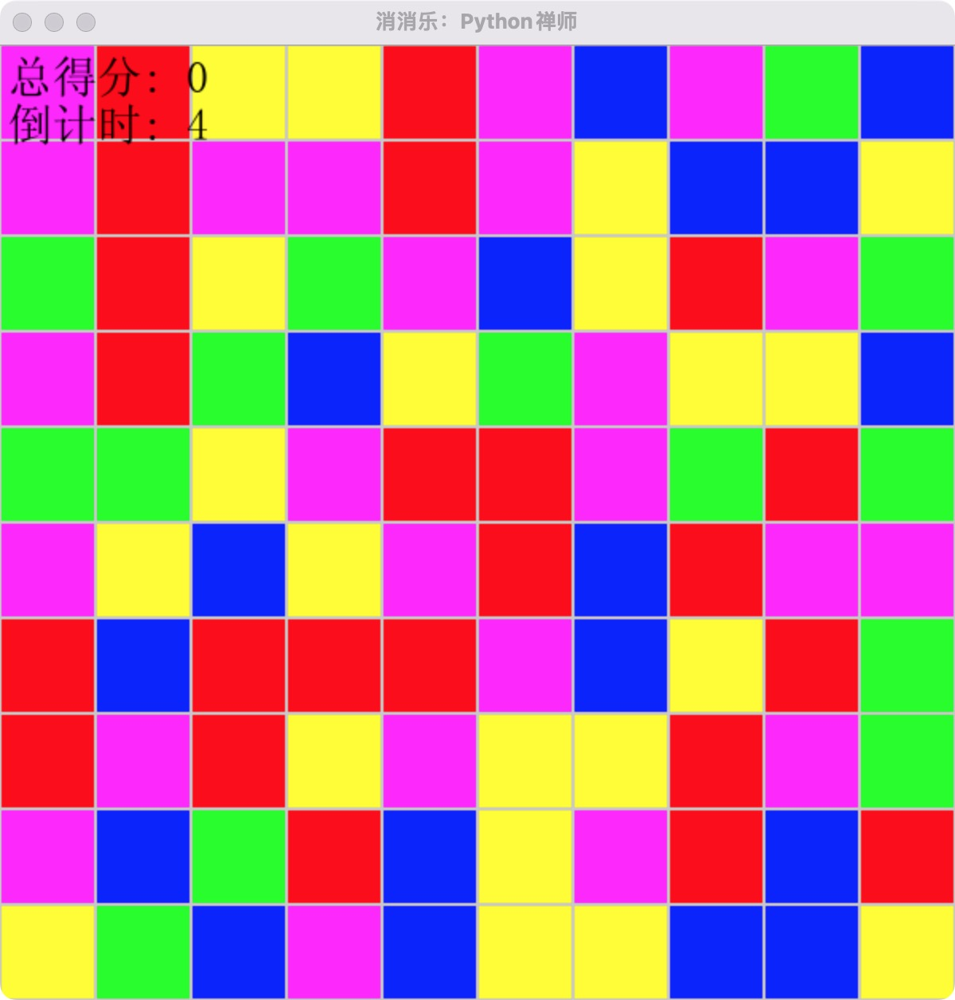
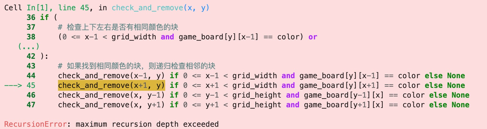
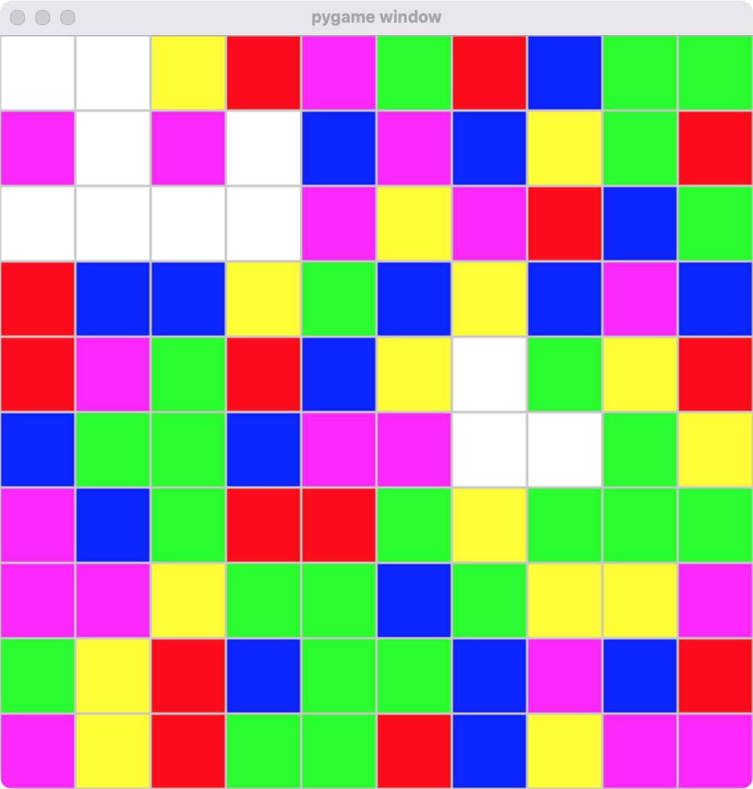
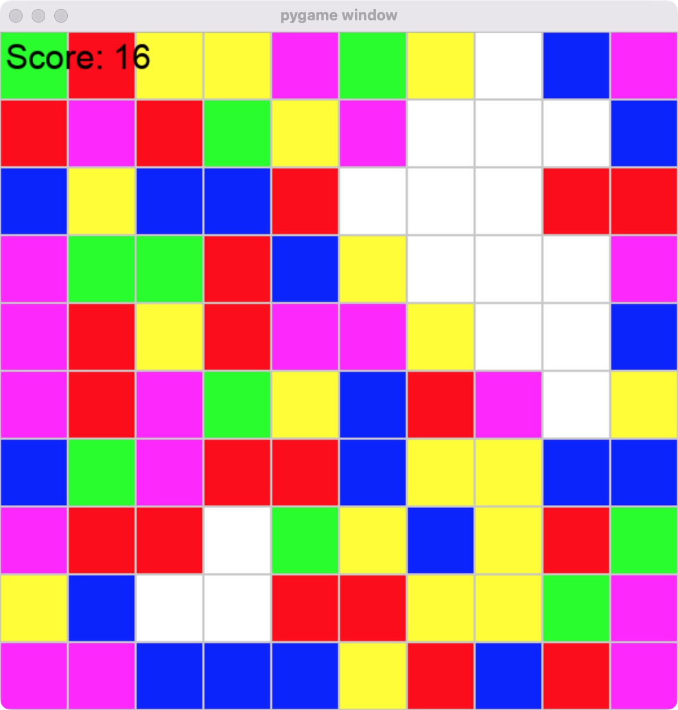
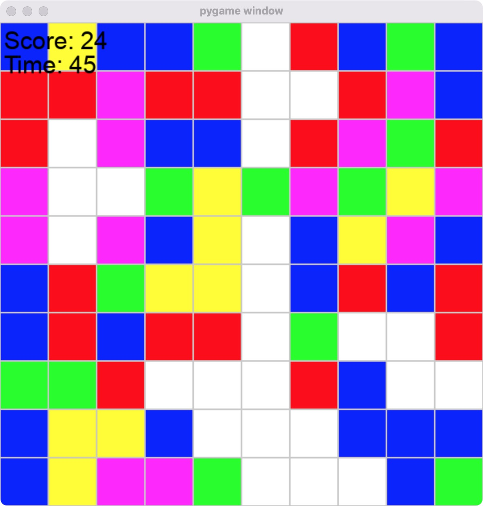
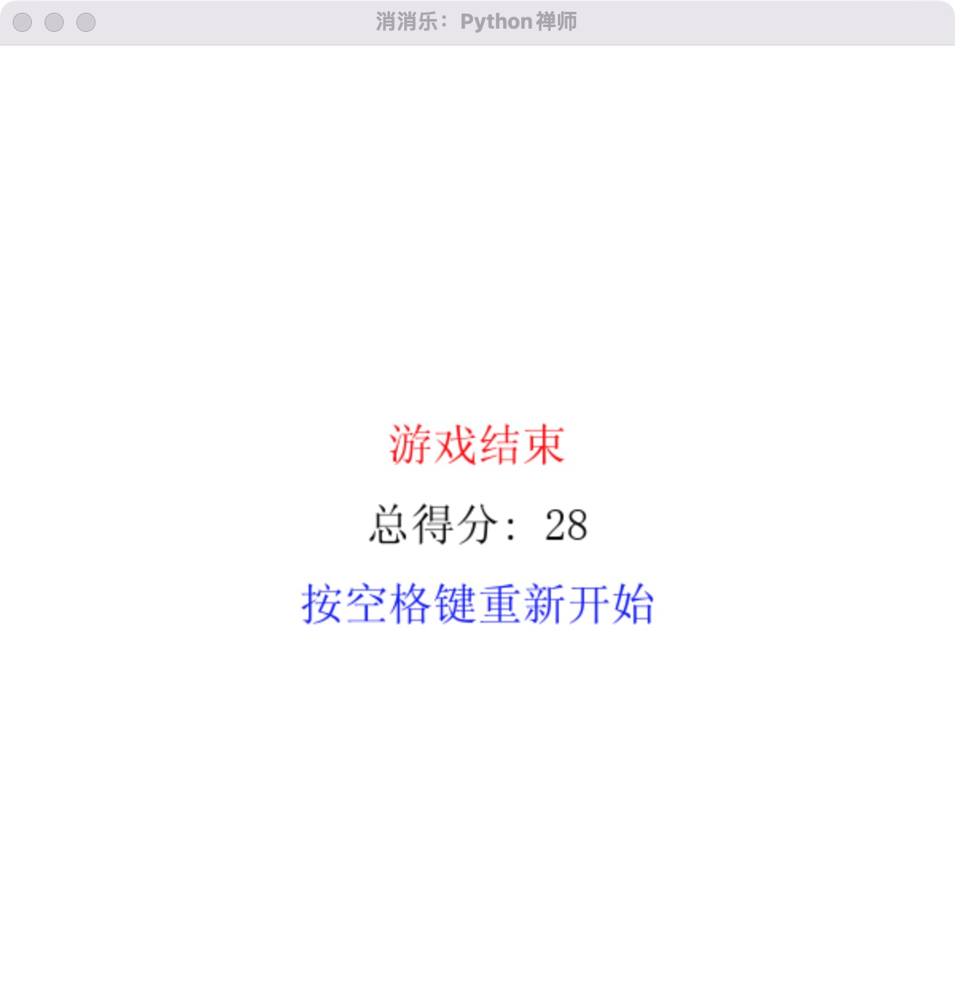

+++
slug = "2024050901"
date = "2024-05-09"
lastmod = "2024-05-09"
title = "AI已来，我与AI一起用Python编写了一个消消乐小游戏"
description = ""
image = "01.jpg"
tags = [ "AI工具", "Python", "游戏", "消消乐" ]
categories = [ "人工智能" ]
+++

> 在数字化与智能化的浪潮中，目前 AI（人工智能）几乎在各行各业中发挥了不可忽略的价值，今天让我们也来体验一下 AI 的威力：我通过命令，一步一步的教 AI 利用 Python 编程语言打造了一款富有创意和趣味性的消消乐小游戏……

本文 Python 消消乐游戏源代码：[https://gitee.com/obullxl/PythonCS/tree/master/CS-CY2405](https://gitee.com/obullxl/PythonCS/tree/master/CS-CY2405)

## 消消乐游戏设计

这款 Python 消消乐小游戏需要有以下功能或者规则：

- 需要有**游戏界面**，不能是控制台文本游戏

- 随机生成**不同颜色**的方块，当点击某个颜色的方块时，则**自动消除**相邻的相同颜色的所有方块

- 根据消除的方块总数量，作为游戏**总得分**

- 可设置**游戏时长**参数，时间结束，展示总得分页，并可重新启动游戏

- 为了体验 AI 的威力，我主要通过与 AI 对话，指导 AI 完成代码编写，我尽量不直接修改代码，只是做最后代码的缝合和整理

我期望的游戏界面大概就像这样：



## 国内免费 AI，游戏可看不可玩

目前可选的 AI 工具有很多，我首先选择国内免费的 AI 工具（暂不具体指名），根据以上我期望的游戏设计和规则，经过与 AI 多轮对话，AI 终于产出了如下代码。

说实话，如果要给这段程序代码打个分（满分 100 分），我觉得**90 分**应该不为过：

- 代码**注释**比较充分，关键地方都进行了注释说明（虽然几次注释不是特别地准确）

- 函数 **create_new_board()** 核心方法中，还使用了列表推导（这是 Python 的高级特性，后续我发文在介绍）

- 同时，核心函数 **check_and_remove()** 在使用递归的方式来检测相邻同颜色的方块（即：上下左右方块），也考虑到了数值防止越界问题

- 更令人惊艳的是，本程序可以直接运行，且还可以展示游戏界面，但可惜的是，核心函数 **check_and_remove()** 逻辑中，检测和消除相邻颜色方块的是个**死循环**，游戏无法玩，只能看看主界面。

为什么 **check_and_remove()** 游戏的核心的递归函数是个死循环呢？

**禅定：** 每个方块的上下左右相邻块是相对的概念，假如 A 方块的上方是 B 方块，那么递归检测 B 方块时，它的下方就是 A 方块，因此递归检测过程就无限循环了。

```python
import pygame
import random

# 初始化pygame
pygame.init()

# 设置屏幕尺寸
SCREEN_WIDTH = 800
SCREEN_HEIGHT = 600

# 设置颜色
WHITE = (255, 255, 255)
RED = (255, 0, 0)
GREEN = (0, 255, 0)
BLUE = (0, 0, 255)

# 创建屏幕对象
screen = pygame.display.set_mode((SCREEN_WIDTH, SCREEN_HEIGHT))

# 设置标题
pygame.display.set_caption("简易消消乐")

# 创建一个二维列表来表示游戏区域
grid_size = 80  # 每个格子的大小
grid_width = 10  # 格子宽度
grid_height = 10  # 格子高度

def create_new_board():
    return [[random.choice([RED, GREEN, BLUE]) for _ in range(grid_width)] for _ in range(grid_height)]

game_board = create_new_board()

# 检查是否有可以消除的块
def check_and_remove(x, y):
    color = game_board[y][x]
    if (
        # 检查上下左右是否有相同颜色的块
        (0 <= x-1 < grid_width and game_board[y][x-1] == color) or
        (0 <= x+1 < grid_width and game_board[y][x+1] == color) or
        (0 <= y-1 < grid_height and game_board[y-1][x] == color) or
        (0 <= y+1 < grid_height and game_board[y+1][x] == color)
    ):
        # 如果找到相同颜色的块，则递归检查相邻的块
        check_and_remove(x-1, y) if 0 <= x-1 < grid_width and game_board[y][x-1] == color else None
        check_and_remove(x+1, y) if 0 <= x+1 < grid_width and game_board[y][x+1] == color else None
        check_and_remove(x, y-1) if 0 <= y-1 < grid_height and game_board[y-1][x] == color else None
        check_and_remove(x, y+1) if 0 <= y+1 < grid_height and game_board[y+1][x] == color else None

        # 消除当前块
        game_board[y][x] = None

# 游戏主循环
running = True
while running:
    for event in pygame.event.get():
        if event.type == pygame.QUIT:
            running = False
        elif event.type == pygame.MOUSEBUTTONDOWN:
            # 获取鼠标点击的位置
            mouse_pos = pygame.mouse.get_pos()

            # 计算点击的格子坐标
            x_grid = mouse_pos[0] // grid_size
            y_grid = mouse_pos[1] // grid_size

            # 确保点击在格子范围内
            if 0 <= x_grid < grid_width and 0 <= y_grid < grid_height:
                # 检查并尝试消除
                check_and_remove(x_grid, y_grid)

                # 如果有消除，可能需要重新生成新的块或执行其他逻辑
                # 这里我们简单地重新生成整个游戏板
                game_board = create_new_board()

    # 填充背景色
    screen.fill(WHITE)

    # 绘制游戏区域
    for y, row in enumerate(game_board):
        for x, color in enumerate(row):
            if color is not None:
                pygame.draw.rect(screen, color, (x * grid_size, y * grid_size, grid_size, grid_size), 0)

    # 更新屏幕显示
    pygame.display.flip()

    # 控制帧率
    pygame.time.Clock().tick(60)

# 退出pygame
pygame.quit()
```



尽管我多次提示 AI **check_and_remove()** 函数是个死循环，请 AI 帮忙修正，但是 AI 就是无法改正，逐步由最开始的人工智能，变成“人工智障”了，没有办法，只能放弃另谋出路了。

## 采用 GPT4，最终产出期望的游戏

同样的，前面与 GPT4 进行了多轮对话，最终产出了如下不仅可看且**可玩**了的基本功能的消消乐：

```python
import pygame
import random
import sys

# 初始化Pygame
pygame.init()

# 屏幕尺寸
screen_width = 600
screen_height = 600
screen = pygame.display.set_mode((screen_width, screen_height))

# 颜色
background_color = (255, 255, 255)
colors = [(255, 0, 0), (0, 255, 0), (0, 0, 255), (255, 255, 0), (255, 0, 255)]
block_color = [[random.choice(colors) for _ in range(screen_width // 60)] for _ in range(screen_height // 60)]

# 设置相关参数
block_size = 60

# 方块网格
grid = [[random.choice(colors) for x in range(screen_width // block_size)] for y in range(screen_height // block_size)]

# 绘制网格
def draw_grid():
    for y in range(0, screen_height, block_size):
        for x in range(0, screen_width, block_size):
            rect = pygame.Rect(x, y, block_size, block_size)
            pygame.draw.rect(screen, grid[y // block_size][x // block_size], rect)
            pygame.draw.rect(screen, (200, 200, 200), rect, 1)

def get_neighbors(pos):
    x, y = pos
    neighbors = []
    for dx, dy in [(-1, 0), (1, 0), (0, -1), (0, 1)]:
        nx, ny = x + dx, y + dy
        if 0 <= nx < len(grid[0]) and 0 <= ny < len(grid):
            neighbors.append((nx, ny))
    return neighbors

def bfs(start):
    """用BFS寻找所有相连的相同颜色方块"""
    color = grid[start[1]][start[0]]
    to_visit = [start]
    connected = []
    while to_visit:
        x, y = to_visit.pop(0)
        if (x, y) not in connected:
            connected.append((x, y))
            for nx, ny in get_neighbors((x, y)):
                if grid[ny][nx] == color:
                    to_visit.append((nx, ny))
    return connected

# 主循环
running = True
while running:
    for event in pygame.event.get():
        if event.type == pygame.QUIT:
            pygame.quit()
            sys.exit()
        if event.type == pygame.MOUSEBUTTONDOWN:
            # 获取鼠标点击位置并转换为网格坐标
            mx, my = pygame.mouse.get_pos()
            grid_x, grid_y = mx // block_size, my // block_size

            # 执行BFS并可能地移除方块
            connected_blocks = bfs((grid_x, grid_y))
            if len(connected_blocks) > 2:  # 如果选中的方块有2个以上相连，则消除它们
                for x, y in connected_blocks:
                    grid[y][x] = background_color

    screen.fill(background_color)
    draw_grid()
    pygame.display.flip()
```



## 继续给 AI 命令，以增加分数功能

既然是个游戏，那就得有游戏得分，我们以消除的方块总数量作为游戏总得分，即每消除 1 个方块则得 1 分，AI 根据对话给出了代码修改样例：

```python
# ... 其它代码 ...

# 初始化分数
score = 0

# 初始化字体（用于显示分数）
pygame.font.init()
font = pygame.font.SysFont('Arial', 30)

def draw_score():
    # 渲染分数文本
    score_surface = font.render(f'Score: {score}', True, (0, 0, 0))
    # 在屏幕上绘制分数
    screen.blit(score_surface, (5, 5))

# ... 其它代码 ...

# 主循环
running = True
while running:
    # 检查事件
    for event in pygame.event.get():
        if event.type == pygame.QUIT:
            pygame.quit()
            sys.exit()
        if event.type == pygame.MOUSEBUTTONDOWN:
            # 计算鼠标点击位置的网格坐标
            mx, my = pygame.mouse.get_pos()
            grid_x, grid_y = mx // block_size, my // block_size

            # 执行BFS并可能移除方块
            connected_blocks = bfs((grid_x, grid_y))
            if len(connected_blocks) > 2:  # 如果有超过2个相连的方块
                for x, y in connected_blocks:
                    grid[y][x] = background_color
                score += len(connected_blocks)  # 每个消除的方块增加1分

    # 清屏
    screen.fill(background_color)

    # 绘制网格和分数
    draw_grid()
    draw_score()

    # 刷新屏幕
    pygame.display.flip()
```

把以上代码复制到基本的消消乐游戏代码中，游戏**总分数**功能生效了：



## 继续给 AI 命令，以增加倒计时功能

游戏有总分数还不够，一般的趣味游戏，每轮都应该是有时间限制，因此游戏还需要增加倒计时功能：

```python
# ... 其它代码 ...

# 初始化倒计时（以秒为单位），假设为60秒
time_limit = 60
start_ticks = pygame.time.get_ticks()  # 获取当前时间的初始tick数

def draw_time_remaining():
    # 计算剩余时间
    elapsed_time = (pygame.time.get_ticks() - start_ticks) / 1000  # 将毫秒转换为秒
    remaining = max(time_limit - elapsed_time, 0)  # 防止显示负数
    # 渲染剩余时间文本
    time_surface = font.render(f'Time: {int(remaining)}', True, (0, 0, 0))
    # 在屏幕上绘制剩余时间
    screen.blit(time_surface, (5, 35))  # 放置在分数下面

# 主循环
running = True
while running:
    # 检查事件
    for event in pygame.event.get():
        if event.type == pygame.QUIT:
            pygame.quit()
            sys.exit()
        if event.type == pygame.MOUSEBUTTONDOWN:
            # 计算鼠标点击位置的网格坐标
            mx, my = pygame.mouse.get_pos()
            grid_x, grid_y = mx // block_size, my // block_size

            # 执行BFS并可能移除方块
            connected_blocks = bfs((grid_x, grid_y))
            if len(connected_blocks) > 2:  # 如果有超过2个相连的方块
                for x, y in connected_blocks:
                    grid[y][x] = background_color
                score += len(connected_blocks)  # 每个消除的方块增加1分

            # 计算并更新剩余时间
            elapsed_time = (pygame.time.get_ticks() - start_ticks) / 1000
            if elapsed_time >= time_limit:
                running = False  # 时间结束，游戏结束

    # 清屏
    screen.fill(background_color)

    # 绘制网格和分数
    draw_grid()
    draw_score()
    draw_time_remaining()

    # 刷新屏幕
    pygame.display.flip()

# 游戏结束逻辑，可以是显示最终得分，再见消息等
# ...

pygame.quit()
```

把以上 AI 代码复制到带有分数功能的游戏代码中，运行可以看到有倒计时功能了：



## 继续给 AI 命令，增加倒计时结束页面

有了倒计时功能，那么当倒计时结束的时候，需要给出具体页面，展示总得分的情况：

```python
import pygame
import random
import sys

# 初始化Pygame
pygame.init()

# 屏幕尺寸
screen_width = 600
screen_height = 600
screen = pygame.display.set_mode((screen_width, screen_height))

# 颜色定义
background_color = (255, 255, 255)
colors = [(255, 0, 0), (0, 255, 0), (0, 0, 255), (255, 255, 0), (255, 0, 255)]
font = pygame.font.SysFont('Arial', 26)

# ... 其他必要的函数定义，如 draw_grid, draw_time_remaining 等 ...

def main_game():
    # 游戏设置
    score = 0
    time_limit = 60  # 设置时间限制（秒）
    start_ticks = pygame.time.get_ticks()  # 开始时间

    # 创建方格
    grid = [[random.choice(colors) for x in range(screen_width // block_size)] for y in range(screen_height // block_size)]

    running = True
    while running:
        elapsed_time = (pygame.time.get_ticks() - start_ticks) / 1000
        if elapsed_time >= time_limit:
            game_over_display(score)  # 传递得分给游戏结束画面
            running = False  # 结束游戏循环
            continue

        for event in pygame.event.get():
            if event.type == pygame.QUIT:
                pygame.quit()
                sys.exit()
            if event.type == pygame.MOUSEBUTTONDOWN and event.button == 1:
                # 鼠标点击逻辑，检查是否需要消除方块，并更新得分
                # ...

        # 游戏绘制逻辑
        screen.fill(background_color)
        draw_grid()
        # ... 绘制得分和剩余时间等 ...
        pygame.display.flip()

def game_over_display(score):
    screen.fill(background_color)
    # 游戏结束文本
    game_over_text = font.render('Game Over', True, (255, 0, 0))
    game_over_rect = game_over_text.get_rect(center=(screen_width // 2, screen_height // 2 - 50))
    screen.blit(game_over_text, game_over_rect)

    # 最终得分文本
    final_score_text = font.render(f'Final Score: {score}', True, (0, 0, 0))
    final_score_rect = final_score_text.get_rect(center=(screen_width // 2, screen_height // 2))
    screen.blit(final_score_text, final_score_rect)

    # 重新开始游戏提示
    restart_text = font.render('Press space to restart', True, (0, 0, 255))
    restart_rect = restart_text.get_rect(center=(screen_width // 2, screen_height // 2 + 50))
    screen.blit(restart_text, restart_rect)
    pygame.display.flip()

    # 等待用户按空格键重启游戏
    waiting = True
    while waiting:
        for event in pygame.event.get():
            if event.type == pygame.QUIT:
                pygame.quit()
                sys.exit()
            if event.type == pygame.KEYDOWN:
                if event.key == pygame.K_SPACE:  # 按空格键
                    waiting = False

if __name__ == "__main__":
    while True:
        main_game()  # 启动主游戏
```

继续把 AI 给出的修改代码复制到总分数代码中，可以看到倒计时结束功能也生效了：



至此，一款符合期望的 Python 消消乐游戏就完成了~

## 禅定：增加字体，游戏文字汉化

本消消乐游戏代码最后的优化：

1. 增加支持中文的字体：`font = pygame.font.Font('./fonts/simsun.ttf', 28)`
2. 部分文本内容汉化：如`总得分`、`倒计时`、`游戏结束`等
3. 部分游戏参数提取：如`倒计时`、`最小消除方块数量`等

**禅定：** 我们可以继续进一步优化这个程序：

1. 使用彩虹糖图片代替方块
2. 每次消掉方块，方块可随机布局，增加难度
3. 消掉方块，增加动态效果，增加音效
4. 记住每轮游戏分数，进行分数排名

关注本公众号，下次继续我们分享增加的功能！

---

我的本博客原地址：[https://ntopic.cn/p/2024050901](https://ntopic.cn/p/2024050901/)

---


