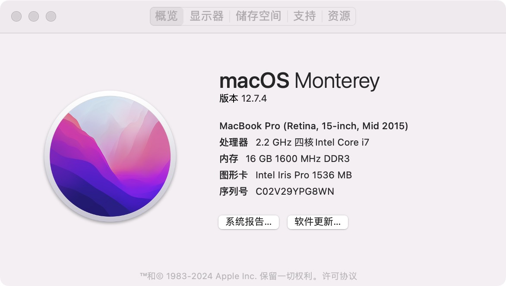
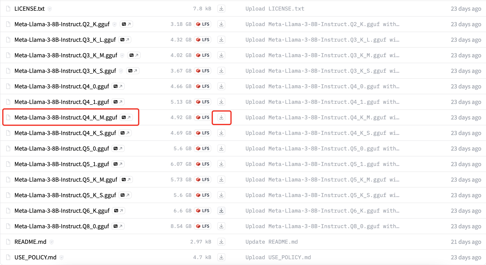
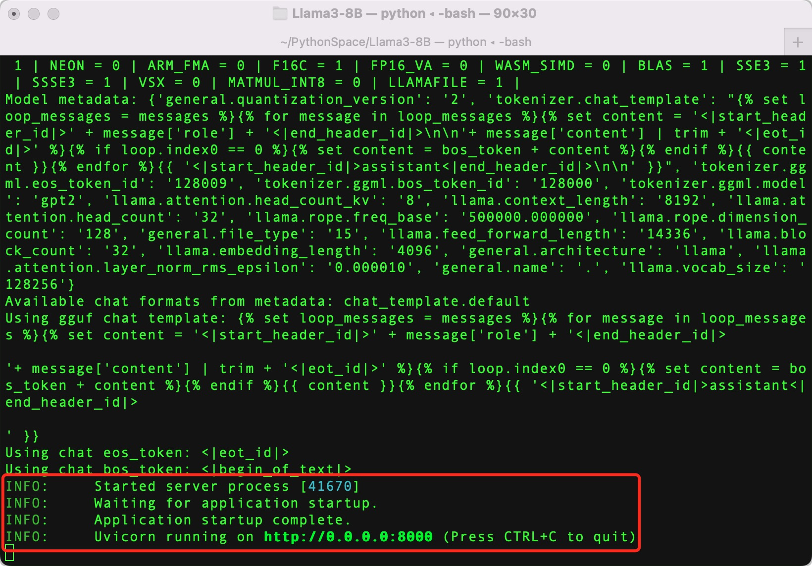
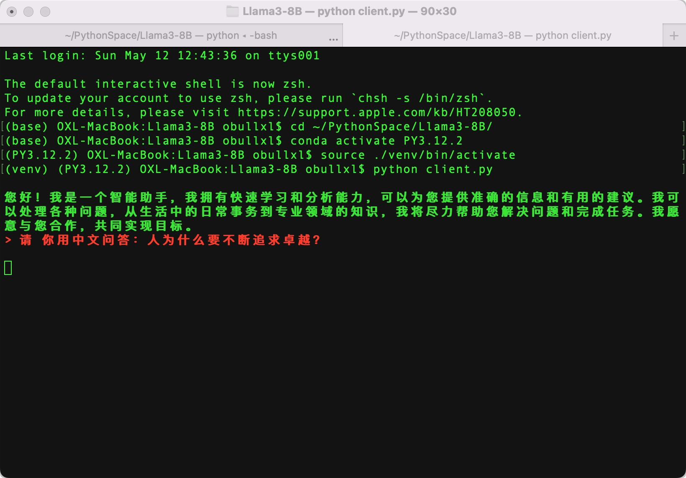
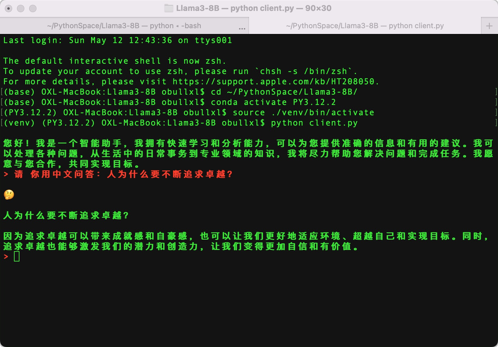

+++
slug = "2024051101"
date = "2024-05-11"
lastmod = "2024-05-11"
title = "玩转AI，笔记本电脑安装属于自己的Llama 3 8B大模型和对话客户端"
description = ""
image = "01.jpg"
tags = [ "AI工具", "Python", "Llama", "大模型" ]
categories = [ "人工智能" ]
+++

> 2024 年 4 月 18 日，Meta**开源**了 Llama 3 大模型，把 AI 的门槛降低到了最低，这是人工智能领域的一个重要飞跃。我们个人也可以部署大模型了，这简直就是给个人开发者发了个大红包！Llama 3 模型有不同的参数版本，本文主要分享我在个人笔记本电脑是部署 8B 参数过程和编写客户端，让我们大家都参与进来，推动 AI 应用更上一层楼……

本文**Llama 3 8B**客户端源代码地址：[https://gitee.com/obullxl/PythonCS/tree/master/Llama-3-8B](https://gitee.com/obullxl/PythonCS/tree/master/Llama-3-8B)

## 选择 Llama 3 模型版本（8B，80 亿参数）

**特别注意：** Meta 虽然开源了 Llama 3 大模型，但是每个版本都有 Meta 的许可协议，建议大家在接受使用这些模型所需的条款之前仔细阅读。

Llama 3 模型版本有几个，我们主要关注 80 亿参数（**Llama 3 8B**）和 700 亿参数（Llama 3 70B）这两个版本。它们对电脑系统配置有不同的要求，主要计算资源（即：CPU/GPU）和内存来存储和处理模型权重：

- Llama 3 8B 版本：对于 80 亿参数的模型，建议至少 4 核 CPU，至少 16GB 内存（推荐 32GB 或更高），以确保模型加载和运行过程中的流畅性；模型文件大小 5 GB 左右，磁盘空间有 10GB 足够了；GPU 是可选的，它可以显著提高推理速度

- Llama 3 70B 版本：对于 700 亿参数的模型，CPU 要求显著提高（建议 16 核以上），至少需要 64GB 内存（推荐 128GB 或更高），模型在推理时会占用大量的内存资源；模型文件超过 20GB，远超 8B 版本；强烈推荐使用高端 GPU，以实现有效加速

综上所述，8B 版本比较适合我们个人电脑，硬件配置基本能符合，同时模型又不失推理效果：



## 下载 Llama 3 8B 模型文件

我们第一步是想自己部署尝鲜，因此直接下载压缩后的模型权重，文件为**GGUF**格式，**GGUF**格式是为了快速推理和优化内存使用而设计的，相比以前的**GGML**格式，**GGUF**支持更复杂的令牌化过程和特殊令牌处理，能更好地应对多样化的语言模型需求。就是因为有**GGUF**格式，**Llama 3**大语言模型才可以在笔记本电脑上运行，同时**GGUF**就一个文件，也简化了模型交换和部署的过程，它对促进模型的普及和应用有着积极作用。

因为**Hugging Face**官网正常无法访问，需要科学上网，因此推荐**国内镜像**进行下载：

官网地址：[https://huggingface.co/QuantFactory/Meta-Llama-3-8B-Instruct-GGUF/tree/main](https://huggingface.co/QuantFactory/Meta-Llama-3-8B-Instruct-GGUF/tree/main)

国内镜像：[https://hf-mirror.com/QuantFactory/Meta-Llama-3-8B-Instruct-GGUF/tree/main](https://hf-mirror.com/QuantFactory/Meta-Llama-3-8B-Instruct-GGUF/tree/main)



GGUF 模型文件名称接受，如上述列表中，有`Meta-Llama-3-8B-Instruct.Q4_K_M.gguf`和`Meta-Llama-3-8B-Instruct.Q5_K_M.gguf`等：

- **Instruct**代表本模型是对基线模型进行了微调，用于更好地理解和生成遵循指令（instruction-following）的文本，以提供符合要求的响应

- **Q4/Q5 等**代表模型权重的量化位数（其中**Q**是**Quantization**的缩小，即量化），是一种模型压缩技术，用于减少模型大小，同时降低对计算资源的需求（特别是内存），但又尽量保持模型的性能；数字**4**或**5**则代表量化精度的位数（Q4 是 4 位，Q5 是 5 位等），精度越高模型体积和内存使用也会越大，但仍然远小于未量化的基线模型

- **K_M/K_S**代表含义笔者还未明确，**K**可能是**Knowledge**的缩写；**M**应该是**Medium**缩写（即中等模型），**S**应该是**Small**缩小（即小模型）；若有明确的朋友，还望不吝告知，共同进步！

若个人电脑配置不是特别好，我们可以选择**Q2_K**版本（大小 3.2GB），它相较于**Q4_K_M**版本（大小 4.9GB），**Q2**版本的推理精度较低，但速度较快，而**Q4**版本在速度和精度之间均取得了很好的平衡，因此首选推荐**Q4_K_M**版本。

点击**下载**图标即可下载，由于文件较大，浏览器的下载容易过程容易终端，重试可继续下载（笔者浏览器中断了好几次，总共耗时 4 个多小时）

## 启动大模型服务端

**GGUF**模型量化文件下载完成后，我们就可以来运行**Llama 3**大模型了。首先打开一个 Terminal 终端窗口，切换到**GGUF**文件目录，设置 Python**虚拟环境**：

```shell
# 切换到存放GGUF文件目录
cd ~/PythonSpace/Llama3-8B/

# 切换Python 3.12.2版本
conda activate PY3.12.2

# 创建并激活虚拟环境
python -m venv venv
source ./venv/bin/activate

# 安装依赖包
pip install llama-cpp-python
pip install openai
pip install uvicorn
pip install starlette
pip install fastapi
pip install sse_starlette
pip install starlette_context
pip install pydantic_settings

# 启动Llama大模型
python -m llama_cpp.server --host 0.0.0.0 --model \
   ./Meta-Llama-3-8B-Instruct.Q4_K_M.gguf \
   --n_ctx 2048
```

最后启动 Llama 模型命令中，`n_ctx 2048`代表单次回话最大 Token 数量。启动成功，我们应该看到类似如下的信息：



恭喜你，你已经迈入 Llama 大模型大厦的大门了，后面存在无限可能，就看我们的创意了！

## 编写 Llama 模型对话客户端

接下来，我们将使用**llama-cpp**库和**openai**库在个人电脑上快速搭建**Llama 模型**的**客户端**，开始尝鲜大模型（它**目前**只是个控制台客户端，还不能如 ChatGPT 那样有可视化的界面，但它的功能一样完备，所以请各位不用着急，我们先来体验一下 Llama 大模型，可视化的界面下文我在和大家分享）。

Python 客户端代码如下，为了后续方便演示，这个 **Client.py** 文件也放到**GGUF**模型文件一起：

1. 我们使用**OpenAI**接口来与 Llama 交互，上面启动模型的最后，我们看到服务端 IP 是本地，端口是**8000**
2. 接着，我们使用 2 条信息对历史记录进行初始化：第一个条是**系统信息**，第二个条是要求模型自我介绍的**用户提示**，为了避免长篇大论，我这里限制了回答的长度和字数
3. 接下来，通过`>`提示符等待用户（即我们）输入，输入`bye`、`quit`和`exit`任意一个即代表退出客户端

```python
from openai import OpenAI

# 注意服务端端口，因为是本地，所以不需要api_key
client = OpenAI(base_url="http://localhost:8000/v1",
         api_key="not-needed")

# 对话历史：设定系统角色是一个只能助理，同时提交“自我介绍”问题
history = [
    {"role": "system", "content": "你是一个智能助理，你的回答总是正确的、有用的和内容非常精简."},
    {"role": "user", "content": "请用中文进行自我介绍，要求不能超过5句话，总字数不超过100个字。"},
]
print("\033[92;1m")

# 首次自我介绍完毕，接下来是等代码我们的提示
while True:
    completion = client.chat.completions.create(
        model="local-model",
        messages=history,
        temperature=0.7,
        stream=True,
    )

    new_message = {"role": "assistant", "content": ""}

    for chunk in completion:
        if chunk.choices[0].delta.content:
            print(chunk.choices[0].delta.content, end="", flush=True)
            new_message["content"] += chunk.choices[0].delta.content

    history.append(new_message)
    print("\033[91;1m")

    userinput = input("> ")
    if userinput.lower() in ["bye", "quit", "exit"]: # 我们输入bye/quit/exit等均退出客户端
        print("\033[0mBYE BYE!")
        break

    history.append({"role": "user", "content": userinput})
    print("\033[92;1m")
```

我们新打开一个 Terminal 终端窗口，同样切换目标到 GGUF 文件目录，并且激活 Python 虚拟环境：

```shell
# 切换到存放GGUF文件目录
cd ~/PythonSpace/Llama3-8B/

# 切换Python 3.12.2版本
conda activate PY3.12.2

# 激活虚拟环境（之前已经创建）
source ./venv/bin/activate

# 启动客户端
python client.py
```

首次打开客户端，因为有第一个默认的**自我介绍**问题，稍微有点忙，但是可以看到，**Llama 模型**按照我们的要求完成了自我介绍，总体还不赖：



接着，我给**Llama 模型**来了一个类**哲学**的问题：`请你用中文问答：人为什么要不断追求卓越？`

**Llama 模型**的回答非常精简，且只有 5 句话，所谓言简意赅：



上图中，红色为我的输入，绿色为模型的答复，超级赞！

## 禅定：总结

现在我们的**Llama 模型**聊天机器人已准备就绪，我们想问什么就可以问什么，尽情享受吧。

当然，我们废了大半天劲，如果只是和模型简单的聊聊天，那就有点可惜了，或者说如果要人工输入，那我们本地部署的意义就不大。

假设能够通过程序的方式，自动调用本地部署的**Llama 模型**是不是可以提供我们工作效率；**Llama 模型**的能力非常广泛，可用于多种场景和任务：

1. **自然语言生成**：Llama 3 能够生成连贯、高质量的文本，包括文章、故事、诗歌等创意写作，以及邮件、报告等实用文体。
2. **对话系统**：模型可以用于构建聊天机器人或 AI 助手，进行自然、流畅的对话交流，提供信息查询、娱乐互动等功能。
3. **代码生成**：它在代码生成任务上表现优异，能够根据描述自动生成或补全代码片段，辅助程序员提高开发效率。
4. **翻译**：Llama 3 支持跨语言应用，可以实现文本的自动翻译，覆盖多种语言对。
5. **文本摘要**：能够自动生成文章、报告的摘要，提取关键信息，帮助用户快速浏览大量内容。
6. **情感分析和文本分类**：可以识别文本中的情绪倾向、主题分类，为企业提供市场洞察、客户服务优化等。
7. **问答系统**：高效准确地回答用户提出的问题，无论是常识性问题还是专业领域的复杂询问。
8. **个性化推荐**：基于用户的历史交互和偏好，生成个性化的推荐内容，如新闻、商品、音乐等。
9. **文本生成图像描述**：结合多模态技术，Llama 3 可以根据文本描述生成图像内容的描述，助力图像生成或图像检索。
10. **法律文档处理**：微调后的模型可以用于法律文档的理解、分析，比如合同审查、案例研究等。

关注本公众号，下次继续我们分享**Llama 模型**可视化对话的功能！

---

我的本博客原地址：[https://ntopic.cn/p/2024051101](https://ntopic.cn/p/2024051101/)

---


