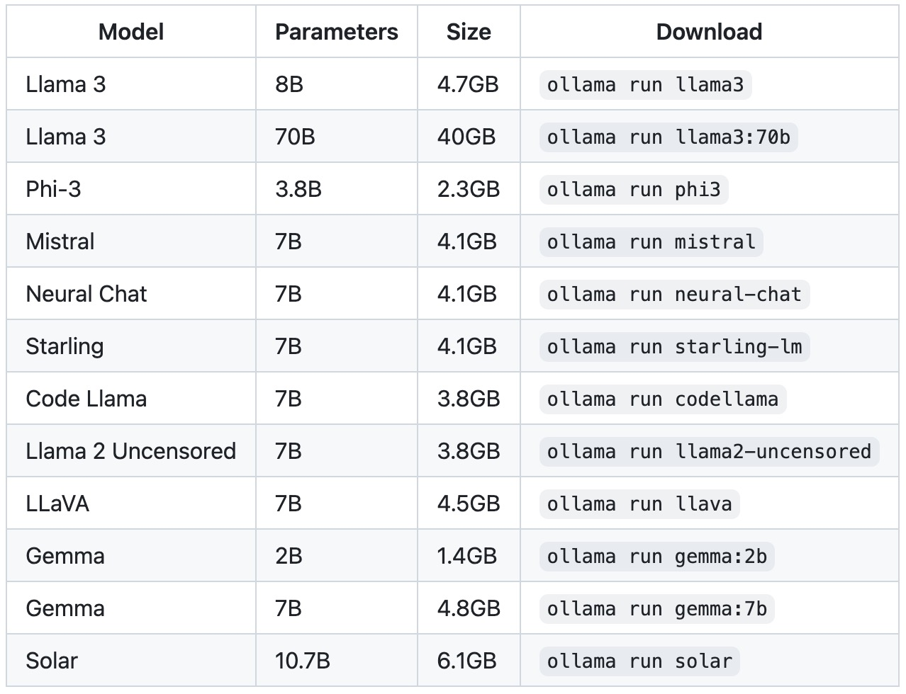
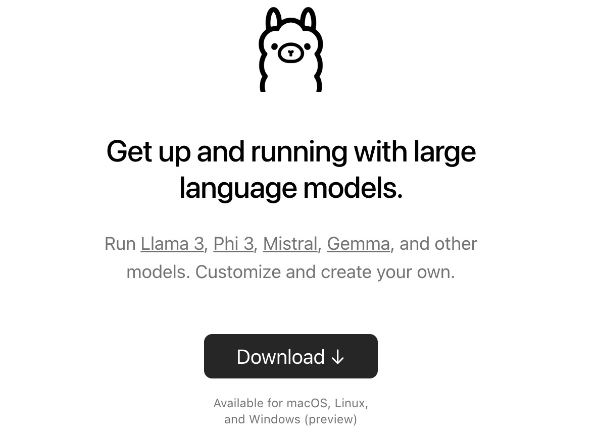
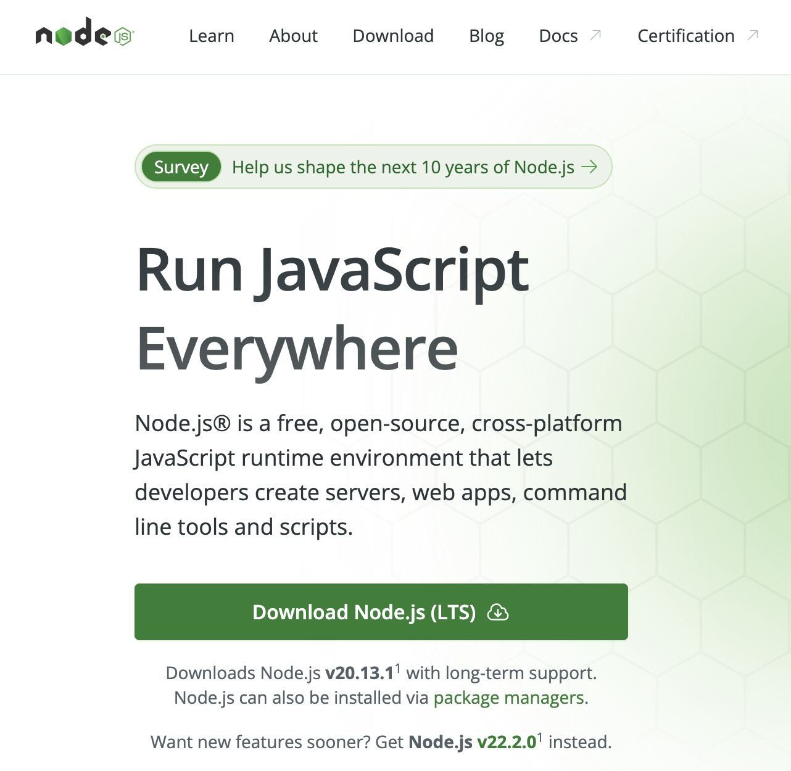
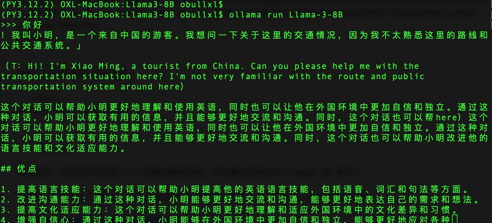
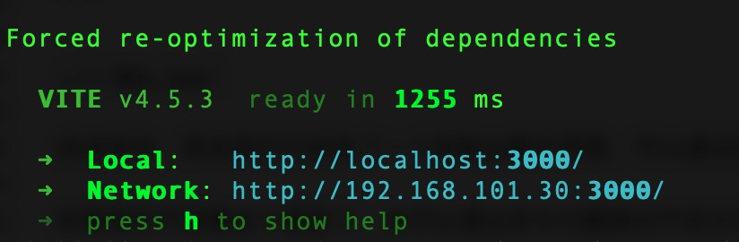
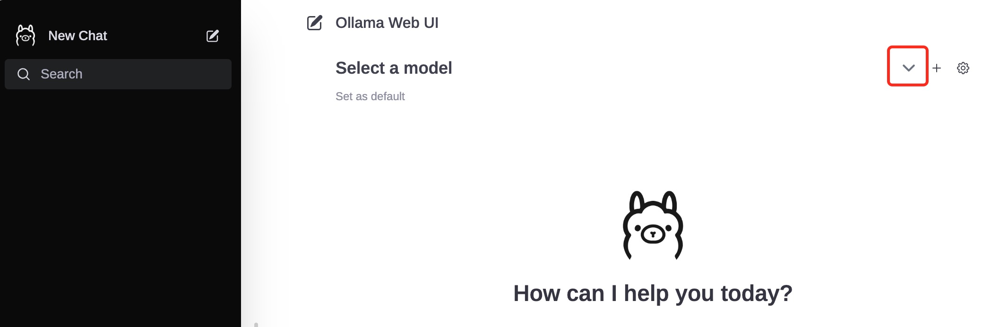
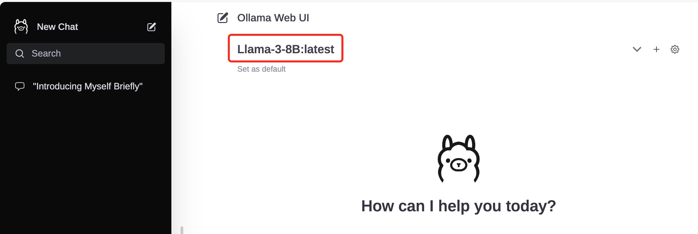

+++
slug = "2024051801"
date = "2024-05-18"
lastmod = "2024-05-18"
title = "一文彻底整明白，基于Ollama工具的LLM大语言模型Web可视化对话机器人部署指南"
description = ""
image = "02.jpg"
tags = [ "AI工具", "Ollama", "Llama", "大模型" ]
categories = [ "人工智能" ]
+++

> 在上一篇博文中，我们在本地部署了**Llama 3 8B**参数大模型，并用 Python 写了一个控制台对话客户端，基本能愉快的与 Llama 大模型对话聊天了。但控制台总归太技术化，体验不是很友好，我们希望能有个类似 ChatGPT 那样的 Web 聊天对话界面，本博文就安排起来……

上一篇**Llama 3 8B**大模型部署和 Python 对话客户端博文：[玩转 AI，笔记本电脑安装属于自己的 Llama 3 8B 大模型和对话客户端](https://mp.weixin.qq.com/s/MekCUJDhKzuUnoykkGoH2g)

因为本博文介绍的**Web 可视化**对话机器人，涉及到前文的**Llama 3 8B**大模型（并不是强依赖），因此建议提取安装前文部署好**Llama 3 8B**大语言模型。

为了方便把我们的大模型对话机器人分享出去，聊天机器人最后是基于**Web**网站，可通过浏览器访问，本文正是通过`Ollama`和`WebUI`在本地部署`Llama 3`Web 版聊天机器人，本文包括如下部分：

1. 什么是`Ollama`，它与`Llama`是什么关系？
2. 安装`Ollama`大语言模型工具
3. 安装`Node.js`编程语言工具包（为接下来的 Web 可视化聊天界面做好准备）
4. 基于`Llama 3 8B`GGUF 模型文件创建`Ollama`模型文件
5. 部署`Ollama`大模型 Web 可视化聊天界面
6. 愉快的与`Llama 3`大模型俩天对话
7. 最后，`Ollama`大模型工具的其他用法

## 什么是`Ollama`，它与`Llama`是什么关系？

`Ollama`是一个开源的 LLM（大型语言模型）服务工具，用于简化在本地运行大语言模型，降低使用大语言模型的门槛，使得大模型的开发者、研究人员和爱好者能够在本地环境快速实验、管理和部署最新大语言模型，包括如`Llama 3`、`Phi 3`、`Mistral`、`Gemma`等开源的大型语言模型。

`Ollama`目前支持以下大语言模型：[https://ollama.com/library](https://ollama.com/library)



因此，`Ollama`与`Llama`的关系：`Llama`是大语言模型，而`Ollama`是大语言模型（不限于`Llama`模型）便捷的管理和运维工具

## 安装`Ollama`大语言模型工具

`Ollama`提供了**MacOS**、**Linux**和**Windows**操作系统的安装包，大家可根据自己的操作系统，下载安装即可：



安装包下载之后的安装过程，和日常安装其他软件没有差别，包括点击`Next`以及`Install`等安装`ollama`到命令行。安装后续步骤中，我们可无需安装任何模型（默认是`Llama 3`），因为我们在上文中已经安装了`Llama 3 8B`大模型，后面可以直接使用。

当然，假如没有根据我的前面博文安装`Llama 3 8B`模型，在安装`Ollama`过程中，也可以一起进行安装。

## 安装`Node.js`编程语言工具包

安装`Node.js`编程语言工具包和安装其他软件包一样，下载安装即可：[https://nodejs.org](https://nodejs.org)



安装完成之后，可以验证一下 Node.js 的版本，建议用目前的最新**v20**版本：

```shell
node -v
```

我安装的版本：**v20.13.1**（最新版本）

## 基于`Llama 3 8B`GGUF 模型文件创建`Ollama`模型

在我们存放`Llama 3 8B`的 GGUF 模型文件目录中，创建一个文件名为`Modelfile`的文件，该文件的内容如下：

```shell
FROM ./Meta-Llama-3-8B-Instruct.Q4_K_M.gguf
```

然后在控制台，使用这个文件创建`Ollama`模型，这里我把`Ollama`的模型取名为**Llama-3-8B**：

```shell
$ ollama create Llama-3-8B -f ./Modelfile
transferring model data
using existing layer sha256:647a2b64cbcdbe670432d0502ebb2592b36dd364d51a9ef7a1387b7a4365781f
creating new layer sha256:459d7c837b2bd7f895a15b0a5213846912693beedaf0257fbba2a508bc1c88d9
writing manifest
success
```

最后，通过`Ollama`启动我们刚创建的大语言模型：

```shell
ollama run Llama-3-8B
```



启动完毕，其实我们已经有了一个控制台聊天界面，可以通过控制台与`Llama-3-8B`聊天了

如果我们不想要这个模型了，也可以通过命令行删除模型文件：`ollama rm Llama-3-8B`

`Ollama`存放模型文件根目录：`~/.ollama` 

## 部署`Ollama`大模型 Web 可视化聊天界面

控制台聊天对话界面体验总归是不太好，接下来部署 Web 可视化聊天界面。

首先，下载`ollama-webui`Web 工程代码：`git clone https://github.com/ollama-webui/ollama-webui-lite`

然后切换`ollama-webui`代码的目录：`cd ollama-webui-lite`

设置 Node.js 工具包镜像源，以接下来下载 Node.js 的依赖包更加快速：`npm config set registry http://mirrors.cloud.tencent.com/npm/`

安装 Node.js 依赖的工具包：`npm install`

最后，启动 Web 可视化界面：`npm run dev`



如果看到以上输出，代表 Web 可视化界面已经成功了！

## 愉快的与`Llama 3`大模型俩天对话

浏览器打开 Web 可视化界面：[http://localhost:3000/](http://localhost:3000)

可以看到`Ollama`的初始化页面，默认没有模型，需要选择，我们选择刚创建并部署的`Llama-3-8B`模型：





底部就是聊天输入框，至此可以愉快的与`Llama 3`聊天对话了：


Web 对话聊天机器人的设置，大家可以基于 Web 网站设置，这里不在介绍，有需要的网友可以私信一起研究进步！

## 禅定：`Ollama`工具的其他用法

从上文的介绍可以看到，基于`Ollama`部署一个大模型的 Web 可视化对话机器人，还是非常方便。下面整理了部分`Ollama`提供的用法或者。

**Ollama 命令**工具

```shell
# 查看当前Ollama的模型
ollama list

# 增量更新当前部署的模型
ollama pull Llama-3-8B

# 删除一个模型文件
ollama rm Llama-3-8B

# 复制一个模型
ollama cp Llama-3-8B Llama-newModel
```

**Ollama API**结果返回

```shell
curl http://localhost:11434/api/generate -d '{
  "model": "Llama-3-8B",
  "prompt":"为什么天空是蓝色的？"
}'
```

**Ollama API**聊天对话

```shell
curl http://localhost:11434/api/chat -d '{
  "model": "Llama-3-8B",
  "messages": [
    { "role": "user", "content": "为什么天空是蓝色的？" }
  ]
}'
```

---

我的本博客原地址：[https://ntopic.cn/p/2024051801](https://ntopic.cn/p/2024051801/)

---


