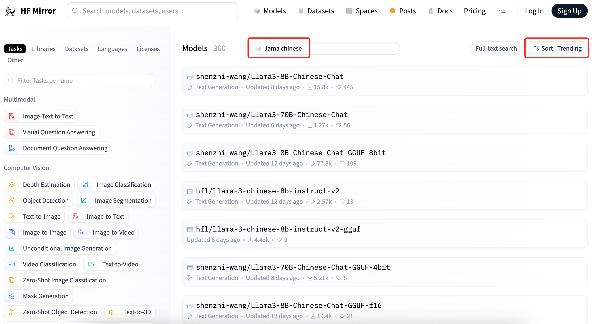
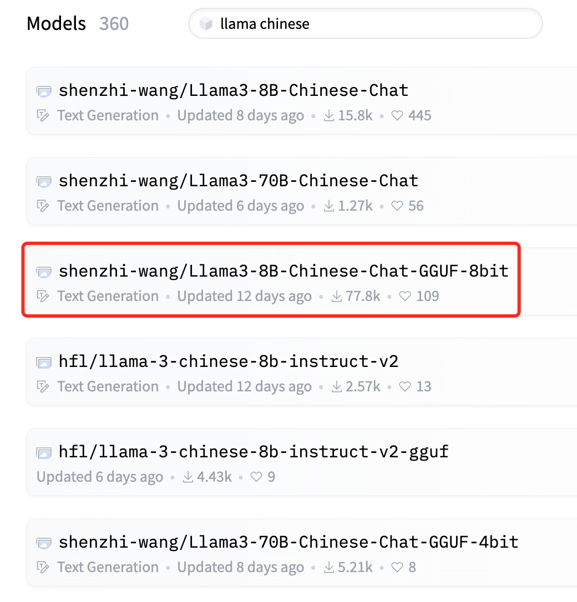
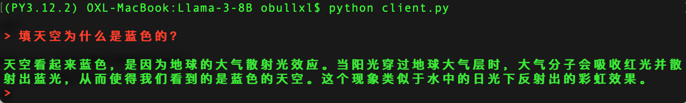
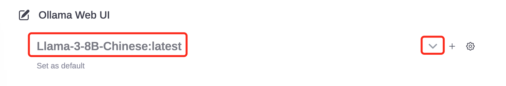

+++
slug = "2024052101"
date = "2024-05-21"
lastmod = "2024-05-21"
title = "基于Llama 3搭建中文版（Llama3-Chinese-Chat）大模型对话聊天机器人"
description = ""
image = "02.jpg"
tags = [ "AI工具", "Ollama", "Llama", "大模型", "微调" ]
categories = [ "人工智能" ]
+++

> 前面两篇博文，我们分别在个人笔记本电脑部署了**Llama 3 8B**参数大模型，并使用**Ollama**搭建了基于 Web 可视化对话聊天机器人，可以在自己电脑上愉快的与**Llama**大模型 Web 机器人对话聊天了。但在使用过程中，笔者发现**Llama**大模型经常出现**中文问题英文回答**的问题，需要使用**中文回答**等提示词告诉大模型用中文回答，体验还不是最好的。今天，本博文就来解决这个问题，让我们有个中文版的**Llama 3**Web 对话机器人（**Llama3-Chinese-Chat**）……

第一篇**Llama 3 8B**大模型部署和 Python 版对话机器人博文：[玩转 AI，笔记本电脑安装属于自己的 Llama 3 8B 大模型和对话客户端](https://mp.weixin.qq.com/s/MekCUJDhKzuUnoykkGoH2g)

第二篇基于**Ollama**部署**Llama 3 8B**大模型 Web 版本对话机器人博文：[一文彻底整明白，基于 Ollama 工具的 LLM 大语言模型 Web 可视化对话机器人部署指南](https://mp.weixin.qq.com/s/2DVYO75h0o5EHN_K_GF4Eg)

**注意：** 因为本博文介绍的是**Llama 3 中文版**（**Llama3-Chinese-Chat**）对话机器人，涉及到前面两篇博文内容，特别是第二篇 Web 版本对话机器人部署，因此建议按照前文博文部署好**Llama 3 8B**大语言模型。

## HF 上选择排名最高的模型

模型列表官网地址：[https://huggingface.co/models](https://huggingface.co/models)

模型列表国内镜像（**推荐**）：[https://hf-mirror.com/models](https://hf-mirror.com/models)

在模型列表页面按照关键字`llama chinese`搜索，并按照**趋势**排序，可以看到中文版模型：



可以看出，第一名模型的**下载**数量和**点赞**数量，比第二名要多好多，我们就选择**shenzhi-wang**这位作者发布的模型。

## 方式一：通过 GGUF 量化模型安装（推荐）

GGUF 安装比较简单，下载单个文件即可：



下载到本地之后，按照我的**第一篇**博文，即可进行控制台聊天了：

**启动大模型**Shell 脚本：

```shell
source ./venv/bin/activate

python -m llama_cpp.server --host 0.0.0.0 --model \
   ./Llama3-8B-Chinese-Chat-q4_0-v2_1.gguf \
   --n_ctx 20480
```

**Python 对话客户端**代码：

```python
from openai import OpenAI

# 注意服务端端口，因为是本地，所以不需要api_key
ip = '127.0.0.1'
#ip = '192.168.1.37'
client = OpenAI(base_url="http://{}:8000/v1".format(ip),
         api_key="not-needed")

# 对话历史：设定系统角色是一个只能助理，同时提交“自我介绍”问题
history = [
    {"role": "system", "content": "你是一个智能助理，你的回答总是容易理解的、正确的、有用的和内容非常精简."},
]

# 首次自我介绍完毕，接下来是等代码我们的提示
while True:
    completion = client.chat.completions.create(
        model="local-model",
        messages=history,
        temperature=0.7,
        stream=True,
    )

    new_message = {"role": "assistant", "content": ""}

    for chunk in completion:
        if chunk.choices[0].delta.content:
            print(chunk.choices[0].delta.content, end="", flush=True)
            new_message["content"] += chunk.choices[0].delta.content

    history.append(new_message)
    print("\033[91;1m")

    userinput = input("> ")
    if userinput.lower() in ["bye", "quit", "exit"]: # 我们输入bye/quit/exit等均退出客户端
        print("\033[0mBYE BYE!")
        break

    history.append({"role": "user", "content": userinput})
    print("\033[92;1m")
```

**运行 Python 客户端**即可：



按照第二篇博文，部署基于 Web 版对话机器人：[一文彻底整明白，基于 Ollama 工具的 LLM 大语言模型 Web 可视化对话机器人部署指南](https://mp.weixin.qq.com/s/2DVYO75h0o5EHN_K_GF4Eg)

基于 GGUF 量化模型**生成 Ollama**模型文件，假设文件名为`Modelfile-Chinese`，内容如下：

```shell
FROM ./Llama3-8B-Chinese-Chat-q4_0-v2_1.gguf
```

执行 Ollama 模型转换，`Llama-3-8B-Chinese`为 Ollama 模型名：

```shell
$ ollama create Llama-3-8B-Chinese -f ./Modelfile-Chinese
transferring model data
using existing layer sha256:242ac8dd3eabcb1e5fcd3d78912eaf904f08bb6ecfed8bac9ac9a0b7a837fcb8
creating new layer sha256:9f3bfa6cfc3061e49f8d5ab5fba0f93426be5f8207d8d8a9eebf638bd12b627a
writing manifest
success
```

可以通过 Ollama 查看目前的大模型列表：

```shell
$ ollama list
NAME                      ID            SIZE    MODIFIED
Llama-3-8B-Chinese:latest 37143cf1f51f  4.7 GB  42 seconds ago
Llama-3-8B:latest         74abc0712fc1  4.9 GB  3 days ago
```

可以看到我们刚安装的大模型：**Llama-3-8B-Chinese**

启动**ollama-webui-lite**项目，可以选择**Llama-3-8B-Chinese**模型和对话聊天了：

```shell
$ npm run dev

> ollama-webui-lite@0.0.1 dev
> vite dev --host --port 3000


  VITE v4.5.3  ready in 1797 ms

  ➜  Local:   http://localhost:3000/
  ➜  Network: http://192.168.101.30:3000/
  ➜  press h to show help
```



## 方式二：通过 Ollama 拉取模型文件

这种方式比较简单，无需下载 GGUF 模型文件，可以让 Ollama 直接拉取模型文件并完成安装：

```shell
# Llama3-8B-Chinese-Chat的4位量化版本（对机器性能要求最低）
ollama run wangshenzhi/llama3-8b-chinese-chat-ollama-q4

# Llama3-8B-Chinese-Chat的8位量化版本（对机器性能要求中等）
ollama run wangshenzhi/llama3-8b-chinese-chat-ollama-q8

# Llama3-8B-Chinese-Chat的f16未量化版本（对机器性能要求最高）
ollama run wangshenzhi/llama3-8b-chinese-chat-ollama-fp16
```

Ollama 自动下载并完成安装，之后启动**ollama-webui-lite**项目，就可以使用了~

---

我的本博客原地址：[https://ntopic.cn/p/2024052101](https://ntopic.cn/p/2024052101/)

---


