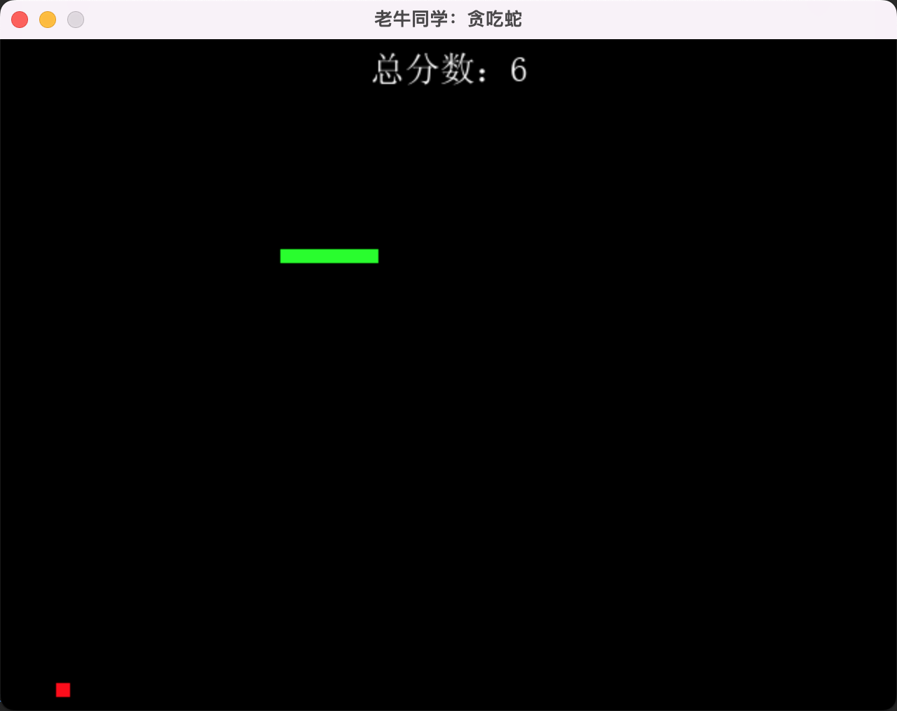
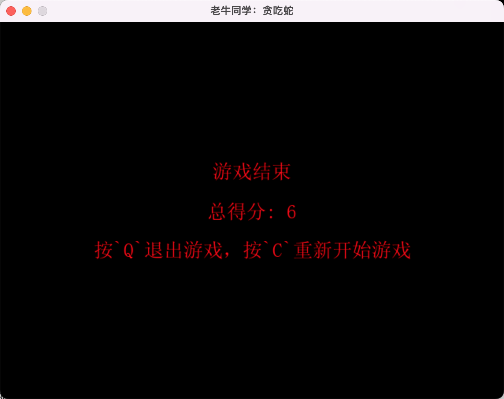

+++
slug = "2024052301"
date = "2024-05-23"
lastmod = "2024-05-23"
title = "Python游戏编程：一步步用Python打造经典贪吃蛇小游戏"
description = ""
image = "02.jpg"
tags = [ "AI工具", "Python", "游戏", "贪吃蛇" ]
categories = [ "人工智能" ]
+++

> 贪吃蛇作为一款极其经典且广受欢迎的小游戏，是早期 Windows 电脑和功能手机（特别是诺基亚手机）流行度极高的小游戏，是当时功能手机时代最具代表性的游戏之一。游戏的基本规则和目标十分简单，但却极具吸引力，让人欲罢不能。本博文我们用 Python 编写属于自己的贪吃蛇游戏，一起来体验一下编程的乐趣与成就……

本文 Python 贪吃蛇游戏源代码：[https://gitee.com/obullxl/PythonCS/tree/master/CS-CY2405](https://gitee.com/obullxl/PythonCS/tree/master/CS-CY2405)

## 贪吃蛇游戏分析

控制蛇的移动：通过上下左右键，控制一条蛇在游戏区域中移动，最初蛇很短，通常由 1 个方块组成。

吃到食物增长：游戏区域中会随机出现食物（例如一个方块），当蛇头触碰到食物时，代表蛇吃到了食物，蛇身体会增长一节，同时得 1 分。

避免越界或碰撞：游戏中需要避免蛇头撞到游戏区域的边界，或者蛇头碰到自己的身体。

策略性移动：随着游戏的进行蛇身增长，需要巧妙地操控蛇的路径，既要吃到食物，又要避免越界碰撞，这变得越来越具挑战性和趣味性。

游戏分数和结束：游戏过程中，需要记录当前得分（即：蛇吃到食物的数量），游戏结束，展示总得分和重新开始游戏或者退出。



## 准备：安装 pygame 工具包

贪吃蛇游戏依赖`pygame`这个强大的 Python 游戏工具包：

```python
pip install pygame
```

## 代码：设置基础参数

基础参数包括屏幕大小、中文字体、背景颜色、字体颜色、蛇的颜色、食物的颜色、蛇的大小和蛇游动速度等。中文**simsun.ttf**字体文件在源代码目录，请一起下载到本地：

```python
import random
import pygame

# 初始化
pygame.init()

# 设置窗口和初始化
SCREEN_WIDTH = 640
SCREEN_HEIGHT = 480
SCREEN = pygame.display.set_mode((SCREEN_WIDTH, SCREEN_HEIGHT))

# 设置窗口标题
pygame.display.set_caption('老牛同学：贪吃蛇')

# 游戏屏幕字体
SCORE_FONT = pygame.font.Font('./fonts/simsun.ttf', 25)
RESULT_FONT = pygame.font.Font('./fonts/simsun.ttf', 25)

# 颜色设置
BLACK = (0, 0, 0)  # 黑色（屏幕的颜色）
WHITE = (255, 255, 255)  # 白色（分数的颜色）
GREEN = (0, 255, 0)  # 绿色（蛇的颜色）
RED = (255, 0, 0)  # 红色（食物的颜色，游戏结束字体的颜色）

# 蛇区块大小（正方形）和游动速度
SNAKE_BLOCK = 10
SNAKE_SPEED = 8
```

## 代码：绘制游戏进行中的得分

游戏进行中，得分默认在窗口左上角展示：

```python
def draw_score(score):
    """绘制当前分数"""
    score_text = SCORE_FONT.render("总分数：" + str(score), True, WHITE)
    #SCREEN.blit(score_text, [20, 20])  # 左上角
```

也可以设置为顶部居中展示，如下代码：

```python
def draw_score(score):
    """绘制当前分数"""
    score_text = SCORE_FONT.render("总分数：" + str(score), True, WHITE)
    score_rect = score_text.get_rect(center=(SCREEN_WIDTH // 2, 20))
    SCREEN.blit(score_text, score_rect)
```

## 代码：绘制游戏进行中蛇的身体

游戏进行中，蛇的身体其实就是一些方块的位置，蛇的数据结构为一个 list 列表，列表的元素是 x 和 y 坐标 list 列表，即`[[x1,y1],[x2,y2],[x3,y3]...]`数据存储形式，蛇尾是第 1 个元素，蛇头是在最后 1 个元素。

```python
def draw_snake(snake_list):
    """绘制蛇的身体，由于都是方块，所以绘制过程无需区分蛇头和蛇身等"""
    for x in snake_list:
        pygame.draw.rect(SCREEN, GREEN, [x[0], x[1], SNAKE_BLOCK, SNAKE_BLOCK])
```

**问题**：蛇尾在第 1 个元素，而蛇头在最后 1 个元素，为什么要这么设计？

**答案**：从后面代码可以看出，蛇在游动的过程中，蛇新的坐标是用的`append`到列表，然后删除列表的第 1 个元素。当然完全可以通过`insert`的方式反过来设计。

## 代码：计算食物的随机坐标

我们使用`random`函数随机计算食物的坐标，同时需要注意，避免食物越界：

```python
def food_position():
    """随机计算食物坐标"""
    x_food = round(random.randrange(0, SCREEN_WIDTH - SNAKE_BLOCK, SNAKE_BLOCK))
    y_food = round(random.randrange(0, SCREEN_HEIGHT - SNAKE_BLOCK, SNAKE_BLOCK))
    return x_food, y_food
```

## 代码：绘制游戏结束分数和提示

我们在屏幕正中央分别展示 3 行提示文本：游戏结束、总得分和继续游戏提示。文本正中央展示和总得分类似：

```python
def draw_result(snake_length):
    """绘制游戏结果"""
    # 在屏幕中央显示文本
    game_over_text = RESULT_FONT.render('游戏结束', True, RED)
    game_over_rect = game_over_text.get_rect(center=(SCREEN_WIDTH // 2, SCREEN_HEIGHT // 2 - 50))
    SCREEN.blit(game_over_text, game_over_rect)

    # 显示最终得分文本
    final_score_text = RESULT_FONT.render(f'总得分: {snake_length - 1}', True, RED)
    final_score_rect = final_score_text.get_rect(center=(SCREEN_WIDTH // 2, SCREEN_HEIGHT // 2))
    SCREEN.blit(final_score_text, final_score_rect)

    # 显示重新开始游戏的提示文本
    restart_text = RESULT_FONT.render('按`Q`退出游戏，按`C`重新开始游戏', True, RED)
    restart_rect = restart_text.get_rect(center=(SCREEN_WIDTH // 2, SCREEN_HEIGHT // 2 + 50))
    SCREEN.blit(restart_text, restart_rect)
```

## 代码：游戏主循环设置

主循环游戏把以上功能函数缝合起来，同时包括控制代码：

1. `game_close`参数控制单局游戏是否结束，`game_over`参数控制整个游戏是否结束
2. 上下左右按键：上下按键控制蛇**Y**轴（上减少、下增加），左右按键控制蛇**X**轴（左减少、右增加）
3. 蛇触墙检测：蛇头坐标**x1,y1**是否在整个屏幕之内
4. 蛇触蛇身检测：蛇头坐标是否在蛇身体的任意坐标相同
5. 蛇吃到食物检测：蛇头坐标是否和食物坐标相同，如果相同则重新设置食物位置，同时蛇身长加 1 个方块

```python
def game_loop():
    """游戏主循环函数"""
    game_over = False  # 退出游戏
    game_close = False  # 单次游戏结束

    # 初始化蛇的坐标和坐标增量
    x1 = SCREEN_WIDTH / 2
    y1 = SCREEN_HEIGHT / 2
    x1_change = 0
    y1_change = 0

    # 蛇的身体列表，初始长度为1
    snake_list = []
    snake_length = 1

    # 随机生成食物的位置
    x_food, y_food = food_position()

    while not game_over:
        # 如果游戏结束但未选择退出或重玩，则进入此循环
        while game_close:
            # 清空屏幕，准备下一轮绘制
            SCREEN.fill(BLACK)
            draw_result(snake_length)
            pygame.display.update()  # 刷新屏幕

            # 等待按键
            for event in pygame.event.get():
                if event.type == pygame.KEYDOWN:
                    if event.key == pygame.K_q:
                        game_over = True  # 退出游戏
                        game_close = False
                    if event.key == pygame.K_c:
                        game_loop()  # 重新开始游戏

        # 处理键盘事件，改变蛇的移动方向
        for event in pygame.event.get():
            if event.type == pygame.QUIT:
                game_over = True  # 退出游戏
            if event.type == pygame.KEYDOWN:
                if event.key == pygame.K_LEFT:
                    # 左：X坐标减少1个区块，Y坐标不变
                    x1_change = -1
                    y1_change = 0
                elif event.key == pygame.K_RIGHT:
                    # 右：X坐标增加1个区块，Y坐标不变
                    x1_change = 1
                    y1_change = 0
                elif event.key == pygame.K_UP:
                    # 上：X坐标不变，Y坐标减少1个区块
                    x1_change = 0
                    y1_change = -1
                elif event.key == pygame.K_DOWN:
                    # 下：X坐标不变，Y坐标增加1个区块
                    x1_change = 0
                    y1_change = 1

        # 退出游戏
        if game_over:
            break

        # 检测蛇是否触墙
        if x1 >= SCREEN_WIDTH or x1 < 0 or y1 >= SCREEN_HEIGHT or y1 < 0:
            game_close = True

        # 更新蛇的位置
        x1 += x1_change * SNAKE_BLOCK
        y1 += y1_change * SNAKE_BLOCK

        # 清空屏幕，准备下一轮绘制
        SCREEN.fill(BLACK)

        # 画食物
        pygame.draw.rect(SCREEN, RED, [x_food, y_food, SNAKE_BLOCK, SNAKE_BLOCK])

        # 新的蛇头位置，同时删除最后蛇尾区块，以保持蛇的总长度不变
        snake_head = [x1, y1]
        snake_list.append(snake_head)

        if len(snake_list) > snake_length:
            del snake_list[0]  # 删除蛇尾

        # 检查蛇头是否碰到蛇的身体
        for x in snake_list[:-1]:
            if x == snake_head:
                game_close = True

        # 绘制蛇
        draw_snake(snake_list)

        # 绘制得分
        draw_score(snake_length - 1)

        # 刷新屏幕
        pygame.display.update()

        # 检查蛇头是否碰到食物，若碰到则增加长度并重新生成食物
        if x1 == x_food and y1 == y_food:
            x_food, y_food = food_position()
            snake_length += 1

        # 控制游戏帧率
        clock = pygame.time.Clock()
        clock.tick(SNAKE_SPEED)

    # 游戏结束时清理pygame环境
    pygame.quit()
    quit()
```

## 最后：启动游戏主循环

启动游戏，进入主循环，通过上下左右按键控制蛇身游动：

```python
# 开始游戏
if __name__ == '__main__':
    game_loop()
```

最后，我们游戏界面大概像这样：


单局游戏结束的界面：



**禅定：** 我们可以继续进一步优化这个程序：

1. 每次吃到食物、单局游戏结束增加音效
2. 增加难度：长按**上下左右**按键，加速蛇游动的速度
3. 记住每轮游戏分数，进行分数排名（本地记录，或者联网）

关注本公众号，我们一起探寻编程的乐趣！

---

我的本博客原地址：[https://ntopic.cn/p/2024052301](https://ntopic.cn/p/2024052301/)

---


