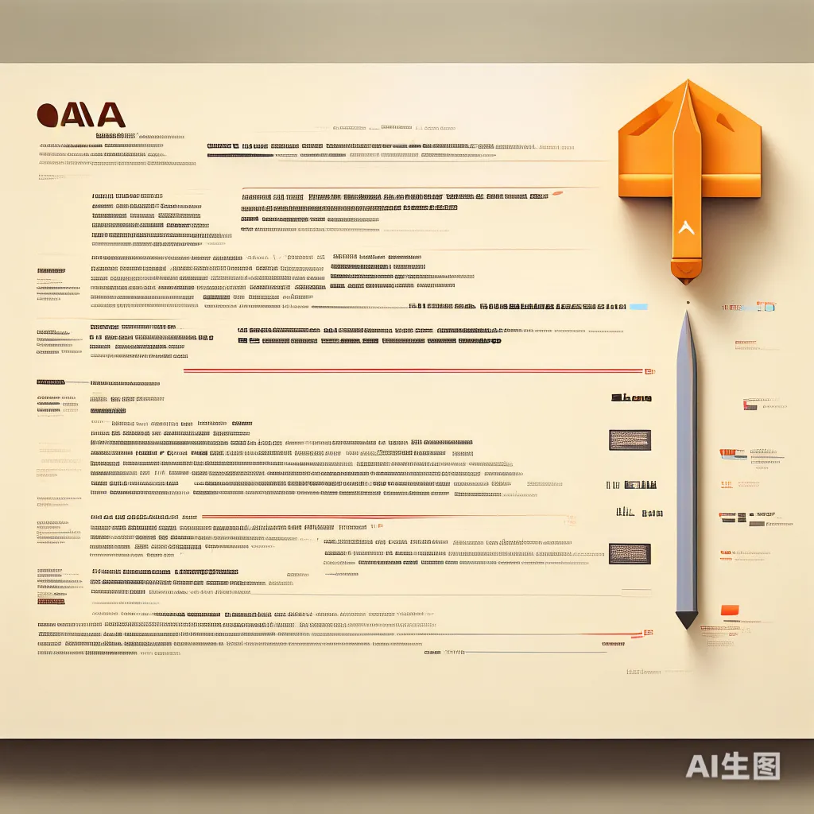

+++
slug = "2024052801"
date = "2024-05-28"
lastmod = "2024-05-28"
title = "高效编写大模型 Prompt 提示词，解锁 AI 无限创意潜能"
description = "随着 ChatGPT 的出现，AI 成为新的焦点，有人说过“未来 50%的工作将是提示词工作”，目前很多公司也在开始招聘 Prompt 提示词工程师。Prompt（提示词）成为了连接创意与技术的桥梁，它不仅是简单的指令，更是激发 AI 潜能的关键。从文章编写到艺术创作，从文本摘要到语言润色，Prompt 的恰当使用能够极大地提升输出的质量与效率。本文将探讨如何编写高效、精准的 Prompt 提示词，最后通过应用场景来具体分析……"
image = "02.jpg"
tags = [ "AI工具", "Prompt提示词" ]
categories = [ "人工智能" ]
+++

> 随着 ChatGPT 的出现，AI 成为新的焦点，有人说过“未来 50%的工作将是提示词工作”，目前很多公司也在开始招聘 Prompt 提示词工程师。Prompt（提示词）成为了连接创意与技术的桥梁，它不仅是简单的指令，更是激发 AI 潜能的关键。从文章编写到艺术创作，从文本摘要到语言润色，Prompt 的恰当使用能够极大地提升输出的质量与效率。本文将探讨如何编写高效、精准的 Prompt 提示词，最后通过应用场景来具体分析……

## Prompt 提示词需要一定技巧


在**51job**招聘网站搜索**Prompt 工程师**可以看到，不少公司都有招聘职位，里面还有包括如**字节跳动**等大型公司，由此可见 Prompt 提示词对用好大模型起到关键作用。

目前像市面上有不少免费的大模型（包括前文我们自己笔记本电脑上也部署了 Llama 3 大模型），在使用这些大模型过程中经常遇到一下问题：

1. 大模型的输出并不能准确输出期望内容
2. 大模型不能很好地理解我的提示词，甚至答非所问
3. 大模型基于我的提示词不能给出准确的输出
4. 不断优化了我的提示词，但是效果仍不理想
5. ……

## Prompt 提示词原则和技巧

Prompt 提示词**基本原则**包括：清晰具体、重点明确、充分详尽、避免歧义等。

这些原则其实比较容易理解：我们把大模型想象成一位无所不能无所不知且不知疲惫的大师，我们希望这位大师尽可能的满足我们的需求，我们首先要做到是不是把我们的需求**清晰具体**、**充分明确**、**准确无歧义**地告诉这位大师呢？更何况这位大师还是一个程序呢！

编写 Prompt 提示也有一些常见的技巧，这些技巧包括：结构化、加分隔符、加示例、加要求等。如果我们在使用大模型时遇到上面提到问题，不妨按照这些技巧优化一下 Prompt 提示词，如果能熟练掌握并灵活运用这些技巧，驾驭大模型的能力能够有很大提升。

**Prompt 技巧一：结构化**

要做到完全结构化其实很难也很累，一般来说，越是复杂的任务提示词需要越详细，越是简单的任务可以越简单（想象一下，你希望大师满足你的需求，需求越复杂是不是得给大师足够的信息才行）。

其实 Prompt 提示词的内容就是通过文字将模型要做的事情交代清楚，“结构化”表达相信大家都学过或者看过，想要模型更好地理解我们的意图，就需要将提示词“结构化”，总结下来包括以下四部分：

1. 概述：在什么背景下，要做一件什么事；可以指明用户或 AI 的角色是什么。
2. 过程：承担什么样的智能，满足什么样的规则，按照什么样的流程。
3. 依赖：使用什么样的工具，用到哪些知识，处理哪些素材？
4. 控制：对模型的处理过程有哪些要求，包括正向和负向的要求。

**Prompt 技巧二：加分割符**

严格意义上来说，**加分隔符**也是**结构化**的一种表述方式，在提示词中合理添加分隔符，可以准确区分指令和待处理的内容，避免模型解读提示词时出现困扰。

常见的分隔符包括： `:` `。` ```、--- 、=== 等

**Prompt 技巧三：加示例**

有时候，为了让模型更好地理解你的意图避免歧义，可以更精确地控制模型的输出，需要在提示词中给出一些示例：

```plaintext
用Java语言写一个正则表达式，匹配的规则如下：数字或下划线@some.com，并且不能以数字和下划线开头。
正确示例：a123@some.com、b_123@some.com
错误示例：_123#some.com、12ab#some.com
```

**Prompt 技巧四：加要求**

为了更好的帮助大模型理解我们的意图，引导模型按照我们想要的结果输出，我们需要在提示词中加入一些要求。比如文案创作类限定

很多人使用大语言模型进行创作，效果不理想，主要原因都是没有通过要求对输出的内容加以限定。比如：想抽取文章摘要，那么可以限定摘要长度；想编写一个儿童故事，那么可以限定年龄大小、故事输出字数等。

## 场景：文章编写

**推荐 Prompt 示例：**“撰写一篇关于未来城市可持续发展的深度分析文章，强调绿色建筑与智能交通系统的作用，目标受众为政策制定者，要求数据丰富、论点明确，1200 个汉字以内。”

该 Prompt 明确了文章的主题、核心观点、目标受众、文章长度以及内容要求等，将有助于 AI 生成具有针对性和深度的内容。

**一般 Prompt 示例：**“写一篇关于未来的文章。”

过于宽泛的 Prompt 会导致输出内容空洞无物，缺乏焦点，无法满足特定的需求。


## 场景：画画

**推荐 Prompt 示例：**“绘制一幅印象派风格的日出景象，画面中有一艘小船在宁静的湖面上缓缓前行，背景是淡紫色的山峦和橙黄色的天空，注意捕捉光线在水面上的反射效果。”

该 Prompt 具体描述了画作风格、主题、细节及色彩要求，引导 AI 创造出富有情感和艺术感的作品。

**一般 Prompt 示例：**“画个日出。”

简短的 Prompt 无法提供足够的视觉细节和艺术风格指导，使得最终作品可能缺乏创意和表现力。


## 场景：文本生成摘要

**推荐 Prompt 示例：**“基于这篇关于量子计算的长文，生成一个不超过 100 字的摘要，突出其对加密技术的潜在影响。”

清晰指定了摘要长度和需强调的信息点，有利于 AI 提取核心内容，生成精确摘要。

**一般 Prompt 示例：**“摘要这篇文章。”

未给出摘要长度限制和重点信息提示，可能导致摘要内容散乱，缺乏针对性。



## 场景：文本润色

**推荐 Prompt 示例：**“请润色这段产品描述，使其更加生动有趣，同时保持专业性，目标客户群为年轻科技爱好者。”

明确了润色方向、风格要求及目标受众，有助于 AI 调整语言风格，提升文本吸引力。

**一般 Prompt 示例：**“让这段话更好听。”

过于模糊，没有具体说明“更好听”的标准，难以指导 AI 做出有效改进。


## 总结

Prompt 提示词的设计是一门平衡艺术，它既要求精确明确，又需留有创意空间。掌握编写高效 Prompt 的技巧，对于提升 AI 辅助工作的质量至关重要。无论是文章编写、艺术创作，还是文本处理，精心构思的 Prompt 都能成为打开创意之门的钥匙，引领我们探索无限可能。

未来，随着科技不断发展，模型能力不断增强，不仅输出“多模态”，输入也应该多模态。提示信息中不仅包括文本，还应该包括图片、音频、视频，甚至包括生物数据等。或许“提示词”将会消失，真正的高效人机交互的时代将会到来。

---

关注本公众号，我们共同学习进步 👇🏻👇🏻👇🏻


---

我的本博客原地址：[https://ntopic.cn/p/2024052801](https://ntopic.cn/p/2024052801/)

---
