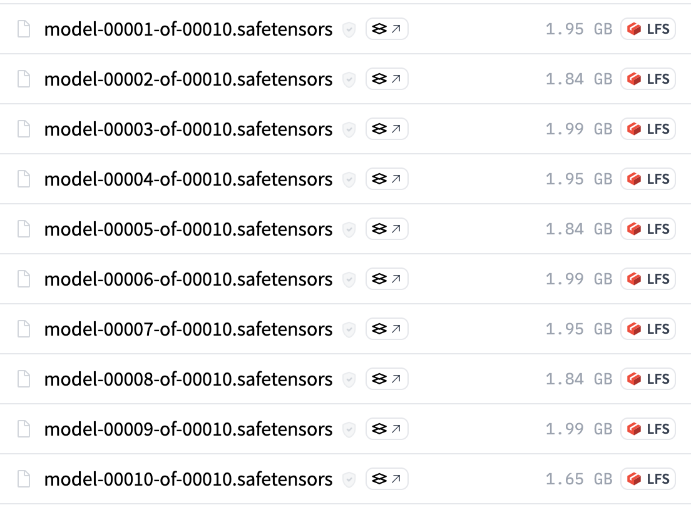
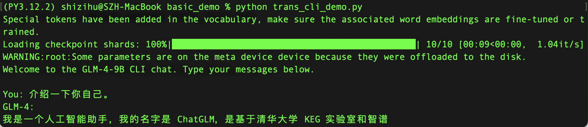

+++
slug = "2024060801"
date = "2024-06-08"
lastmod = "2024-06-08"
title = "本地部署GLM-4-9B开源大模型教程和对话体验效果"
description = "清华大学和智谱AI推出了全面升级的新一代基座大模型GLM-4，整体性能相比GLM3提升60%，支持128K上下文，可根据用户意图自主理解和规划复杂指令、完成复杂任务……"
image = "00.jpg"
tags = [ "AI工具", "GLM", "大模型", "Llama" ]
categories = [ "人工智能" ]
+++

**GLM-4-9B**是清华大学和智谱AI推出的最新一代预训练模型**GLM-4**系列中的开源版本。在语义、数学、推理、代码和知识等多方面的数据集测评中，**GLM-4-9B**及其人类偏好对齐的版本**GLM-4-9B-Chat**均表现出较高的性能，其通用能力评测结果甚至超越了**Llama-3-8B**开源大模型，多模态版本也与**GPT-4**版本齐平。

除了能进行多轮对话，**GLM-4-9B-Chat**还具备网页浏览、代码执行、自定义工具调用和长文本推理等高级功能。 **GLM-4**模型增加了多语言支持，支持包括日语，韩语，德语在内的 26 种语言。**GLM-4-9B**还推出了支持 1M 上下文长度（约 200 万中文字符）的模型。

根据**GLM-4**大模型评测结果，在通用能力方面超越**Llama3**大模型，在多模态能力比肩**GPT-4**大模型系列版本，评测结果和调用方法详情：[https://github.com/THUDM/GLM-4](https://github.com/THUDM/GLM-4)

本文介绍**GLM-4**大模型部署和使用方法，需要注意的是，**GLM-4**虽然开源了，但**GLM-4**大模型的权重的使用则需要遵循协议：[https://huggingface.co/THUDM/glm-4-9b/blob/main/LICENSE](https://huggingface.co/THUDM/glm-4-9b/blob/main/LICENSE)

## 第一步：下载模型文件

老牛同学在前面文章中，介绍了通过单一的GGUF文件在本地部署**Llama-3-8B**（**Llama3-Chinese-Chat**）大模型：[基于Llama 3搭建中文版（Llama3-Chinese-Chat）大模型对话聊天机器人](https://mp.weixin.qq.com/s/idcdIr8mMWDQ_iZU5r_UEQ)

**GLM-4-9B**模板目前还没有GGUF文件，因此老牛同学通过Git下载PyTorch张量参数文件在本地部署**GLM-4-9B-Chat-1M**大模型。

由于模型参数文件比较大，使用Git无法直接下载到本地，需要通过**git-lfs**工具包下载：

```shell
brew install git-lfs
```

通过Git复制模型文件到笔记本电脑：

```shell
git lfs install
git clone https://www.modelscope.cn/ZhipuAI/glm-4-9b-chat-1m.git GLM-4-9B-Chat-1M
```

总共有10个模型参数文件，平均每个文件**1.8GB**大小，总计18GB左右，因此在Git下载过程中，容易中断失败，可以通过以下命令多次尝试下载：

```shell
git lfs pull
```



## 第二步：下线GLM4代码库

**GLM-4**的官方GitHub代码库中有很多使用样例和微调等Python代码，我们可直接进行调整和使用：

```shell
https://github.com/THUDM/GLM-4.git
```

## 第三步：启动GLM4客户端

打开**GLM-4**代码库中`basic_demo/trans_cli_demo.py`文件，修改**第18行**模型路径`MODEL_PATH`参数，内容为我们通过Git复制到本地的路径，如老牛同学的路径如下：

```python
#MODEL_PATH = os.environ.get('MODEL_PATH', 'THUDM/glm-4-9b-chat')
MODEL_PATH = os.environ.get('MODEL_PATH', '/Users/shizihu/JupyterLab/GLM-4-9B-Chat-1M')
```

在启动之前，我们还需要安装几个Python工具包（当然也可以跳过，后面启动失败时在进行安装也是可以的）：

```shell
pip install tiktoken
pip install accelerate
```

启动大模型客户端：`python trans_cli_demo.py`

```shell
% python trans_cli_demo.py
Special tokens have been added in the vocabulary, make sure the associated word embeddings are fine-tuned or trained.
Loading checkpoint shards: 100%|██████████████████████████████████████████████| 10/10 [00:09<00:00,  1.04it/s]
WARNING:root:Some parameters are on the meta device device because they were offloaded to the disk.
Welcome to the GLM-4-9B CLI chat. Type your messages below.

You: 介绍一下你自己。
GLM-4:
我是一个人工智能助手，我的名字是 ChatGLM，是基于清华大学 KEG 实验室和智谱 AI 公司
```



## 总结：GLM-4-9B比Llama-3-8B慢太多了

根据官方的评测报告，**GLM-4-9B**在对话、多模态等方面要比**Llama-3-8B**强不少，根据老牛同学本地部署**对话**的验证结果来看，对话的输出速度实在太慢了，简直就是在挤牙膏，一个字一个字的往外输出。

至于**GLM-4-9B**的多模态、工具调用、代码解释等能力，老牛同学本次就不一一演示了，**GLM-4**官方的GitHub代码库有很多Demo代码，大家可以对代码调整后尝试体验一下~

---

关注本公众号，我们共同学习进步👇🏻👇🏻👇🏻


---

我的本博客原地址：[https://mp.weixin.qq.com/s/kcvaZt92c9yNMMLUcghi7A](https://mp.weixin.qq.com/s/kcvaZt92c9yNMMLUcghi7A)

---
