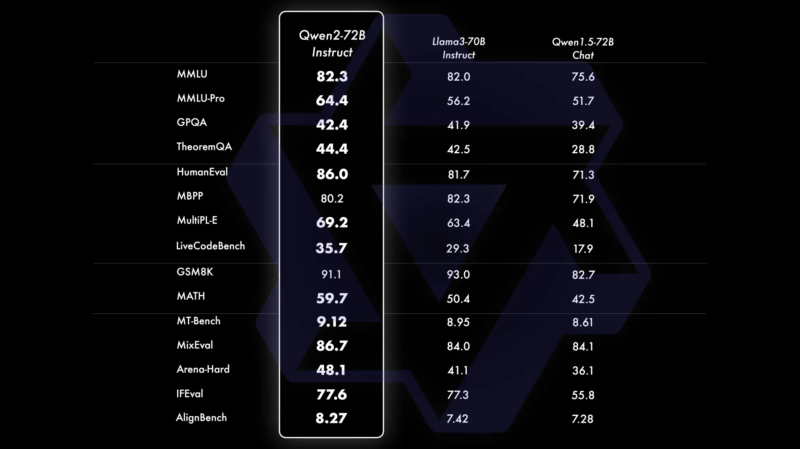
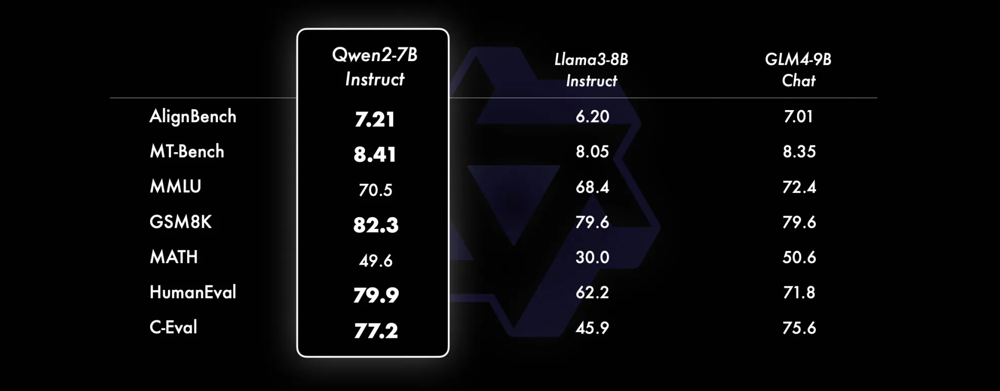
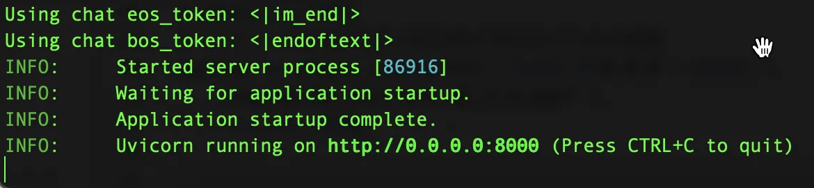
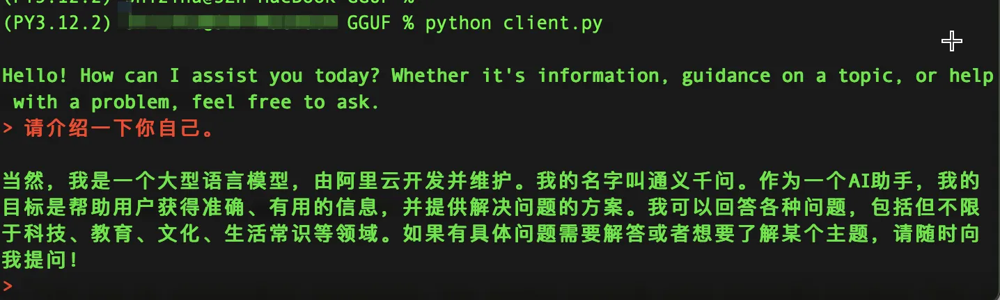
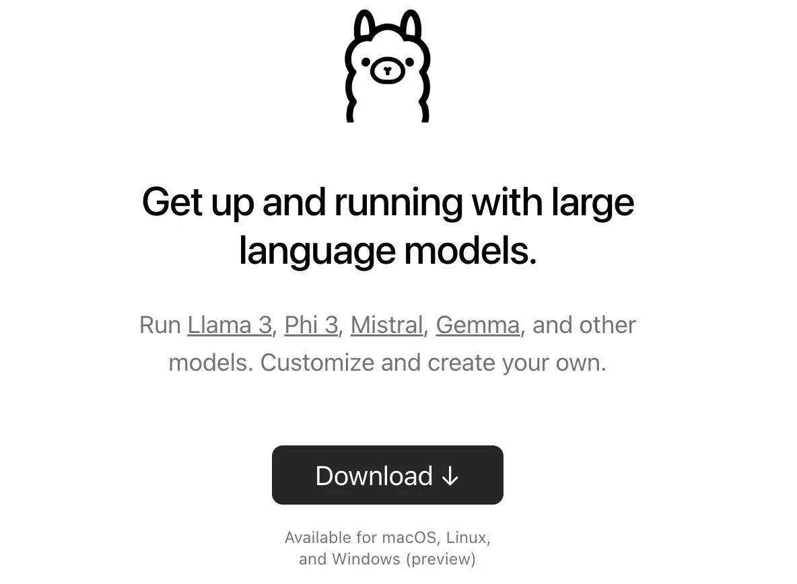
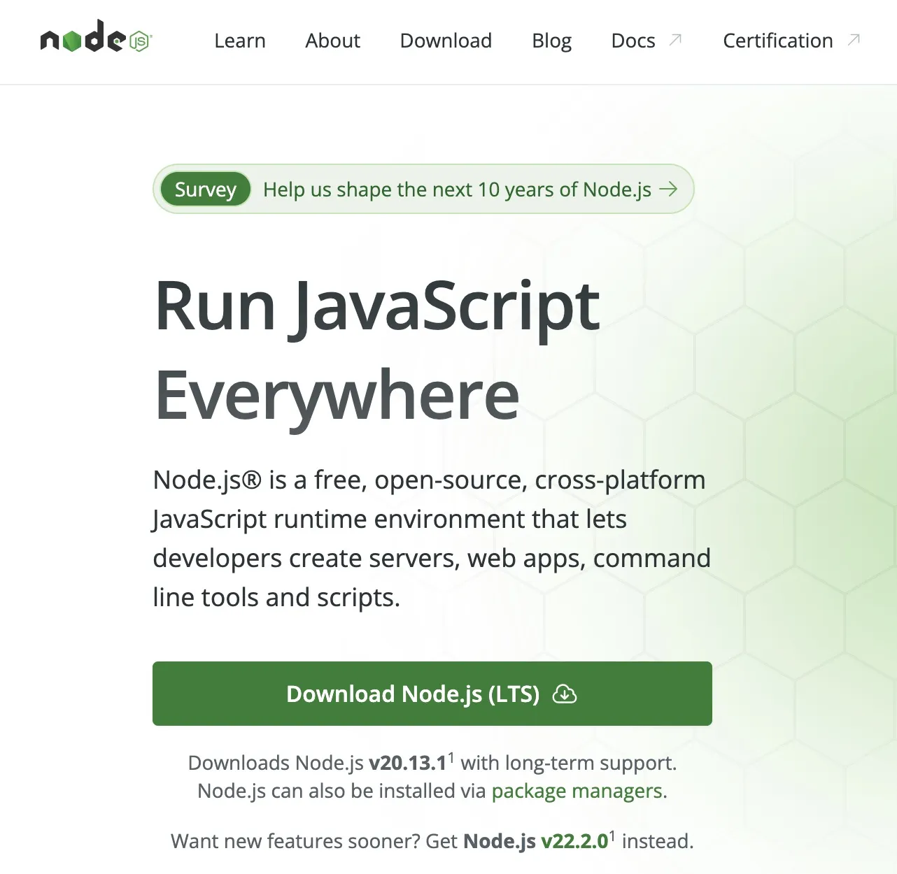
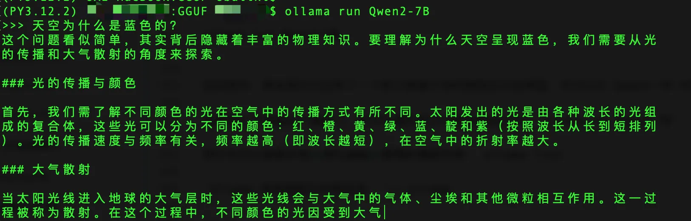
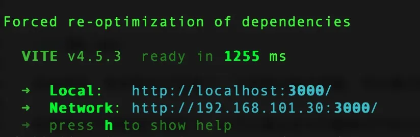
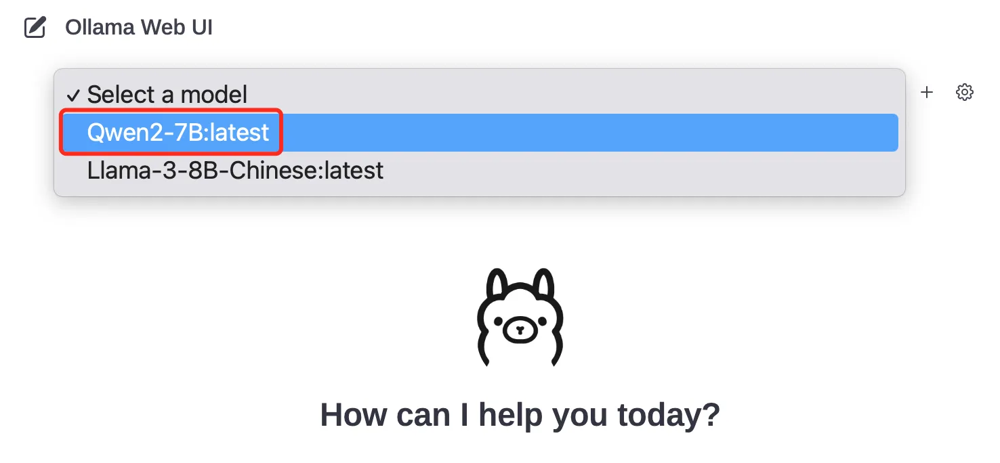

+++
slug = "2024061201"
date = "2024-06-12"
lastmod = "2024-06-12"
title = "Qwen2 阿里最强开源大模型（Qwen2-7B）本地部署、API调用和WebUI对话机器人"
description = "阿里云正式开源通义千问Qwen2系列模型，其中Qwen2-72B成为全球性能最强的开源模型，在全球权威测评中，性能超过美国最强开源模型Llama3-70B，也超过文心4.0、豆包pro、混元pro等众多中国闭源大模型。今天老牛同学部署和体验Qwen2-7B中等尺寸模型，包括本地部署、API嗲用和WebUI对话客户端……"
image = "01.jpg"
tags = [ "AI工具", "Qwen2", "大模型", "Llama" ]
categories = [ "人工智能" ]
+++

阿里巴巴通义千问团队发布了**Qwen2**系列开源模型，该系列模型包括5个尺寸的预训练和指令微调模型：**Qwen2-0.5B**、**Qwen2-1.5B**、**Qwen2-7B**、**Qwen2-57B-A14B**以及**Qwen2-72B**。对比当前最优的开源模型，**Qwen2-72B**在包括自然语言理解、知识、代码、数学及多语言等多项能力上均显著超越当前领先的**Llama3-70B**等大模型。



老牛同学今天部署和体验**Qwen2-7B-Instruct**指令微调的中等尺寸模型，相比近期推出同等规模的开源最好的**Llama3-8B**、**GLM4-9B**等模型，**Qwen2-7B-Instruct**依然能在多个评测上取得显著的优势，尤其是代码及中文理解上。



**特别注意：** 虽然**Qwen2**开源了，但仍然需要遵循其模型许可，除**Qwen2-72B**依旧使用此前的**Qianwen License**外，其余系列版本模型，包括**Qwen2-0.5B**、**Qwen2-1.5B**、**Qwen2-7B**以及**Qwen2-57B-A14B**等在内，均采用**Apache 2.0**许可协议。

## 下载Qwen2-7B-instruct模型文件

为了简化模型的部署过程，我们直接下载GGUF文件。关于GGUF文件介绍，请详见部署**Llama3-8B**大模型的文章：[玩转AI，笔记本电脑安装属于自己的Llama 3 8B大模型和对话客户端](https://mp.weixin.qq.com/s/MekCUJDhKzuUnoykkGoH2g)

打开**Qwen2-7B-Instruct-GGUF**模型文件列表（[https://modelscope.cn/models/qwen/Qwen2-7B-Instruct-GGUF/files](https://modelscope.cn/models/qwen/Qwen2-7B-Instruct-GGUF/files)），我们选择**qwen2-7b-instruct-q5_k_m.gguf**并下载：


我们可以根据自己需要，选择下载其它版本的模型文件！

## 启动Qwen2-7B-Instruct大模型

GGUF模型量化文件下载完成后，我们就可以来运行**Qwen2-7B**大模型了。

在启动**Qwen2-7B**大模型之前，我们首先需要安装Python依赖包列表：

```shell
pip install llama-cpp-python
pip install openai
pip install uvicorn
pip install starlette
pip install fastapi
pip install sse_starlette
pip install starlette_context
pip install pydantic_settings
```

然后打开一个Terminal终端窗口，切换到GGUF模型文件目录，启动**Qwen2-7B**大模型（`./qwen2-7b-instruct-q5_k_m.gguf`即为上一步下载的模型文件路径）：

```shell
# 启动Qwen2大模型

# n_ctx=20480代表单次回话最大20480个Token数量
python -m llama_cpp.server \
   --host 0.0.0.0 \
   --model ./qwen2-7b-instruct-q5_k_m.gguf \
   --n_ctx 20480
```



## Qwen2-7B-instruct 命令行对话客户端

CLI命令行的客户端，可以参考之前**LLama3-8B**大模型的文章：[https://mp.weixin.qq.com/s/MekCUJDhKzuUnoykkGoH2g](https://mp.weixin.qq.com/s/MekCUJDhKzuUnoykkGoH2g)

```python
# client.py

from openai import OpenAI

# 注意服务端端口，因为是本地，所以不需要api_key
client = OpenAI(base_url="http://127.0.0.1:8000/v1",
                api_key="not-needed")

# 对话历史：设定系统角色是一个只能助理，同时提交“自我介绍”问题
history = [
    {"role": "system", "content": "你是一个智能助理，你的回答总是容易理解的、正确的、有用的和内容非常精简."},
]

# 首次自我介绍完毕，接下来是等代码我们的提示
while True:
    completion = client.chat.completions.create(
        model="local-model",
        messages=history,
        temperature=0.7,
        stream=True,
    )

    new_message = {"role": "assistant", "content": ""}

    for chunk in completion:
        if chunk.choices[0].delta.content:
            print(chunk.choices[0].delta.content, end="", flush=True)
            new_message["content"] += chunk.choices[0].delta.content

    history.append(new_message)
    print("\033[91;1m")

    user_input = input("> ")
    if user_input.lower() in ["bye", "quit", "exit"]:  # 我们输入bye/quit/exit等均退出客户端
        print("\033[0mBYE BYE!")
        break

    history.append({"role": "user", "content": user_input})
    print("\033[92;1m")
```

启动CLI对话客户端：`python client.py`



至此，我们可以与**Qwen2-7B-Instruct**进行对话，体验Qwen2大模型的魅力了。

如果我们主要是通过API的方式使用**Qwen2**大模型，那么Qwen2部署就到此结束了。

接下来的章节，我们部署WebUI对话客户端，通过Web界面的方式使用**Qwen2**大模型，并且可以分享出去~

## Qwen2-7B-Instruct WebUI客户端

结合**Ollama**工具，搭建WebUI客户端，可参考之前**Llama3-8B**大模型的文章：[一文彻底整明白，基于Ollama工具的LLM大语言模型Web可视化对话机器人部署指南](https://mp.weixin.qq.com/s/2DVYO75h0o5EHN_K_GF4Eg)

**第一步：** 我们需要下载安装**Ollama**本地大模型管理工具：

`Ollama`提供了**MacOS**、**Linux**和**Windows**操作系统的安装包，大家可根据自己的操作系统，下载安装即可：



安装包下载之后的安装过程，和日常安装其他软件没有差别，包括点击`Next`以及`Install`等安装`ollama`到命令行。安装后续步骤中，我们可无需安装任何模型，因为我们在上文中我们已经安装了`Qwen2-7B`大模型，后面可以直接使用。

**第二步：** 安装`Node.js`编程语言工具包

安装`Node.js`编程语言工具包和安装其他软件包一样，下载安装即可：[https://nodejs.org](https://nodejs.org)



安装完成之后，可以验证一下 Node.js 的版本，建议用目前的最新**v20**版本：

```shell
node -v
```

老牛同学安装的版本：**v20.13.1**（最新版本）

**第三步：** 基于GGUF模型文件创建`Ollama`模型

在我们存放`Qwen2-7B`的 GGUF 模型文件目录中，创建一个文件名为`Modelfile`的文件，该文件的内容如下：

```shell
FROM ./qwen2-7b-instruct-q5_k_m.gguf
```

然后在Terminal终端，使用这个文件创建`Ollama`模型，这里我把`Ollama`的模型取名为**Qwen2-7B**：

```shell
$ ollama create Qwen2-7B -f ./Modelfile
transferring model data 
using existing layer sha256:258dd2fa1bdf98b85327774e1fd36e2268c2a4b68eb9021d71106449ee4ba9d5 
creating new layer sha256:14f4474ef69698bf4dbbc7409828341fbd85923319a801035e651d9fe6a9e9c9 
writing manifest 
success
```

最后，通过`Ollama`启动我们刚创建的大语言模型：

```shell
ollama run Qwen2-7B
```

启动完毕，其实我们已经有了一个和之前差不多的控制台对话界面，也可以与`Qwen2-7B`对话了。



如果我们不想要这个模型了，也可以通过命令行删除模型文件：`ollama rm Qwen2-7B`

我们也可以查看本地**Ollama**管理的模型列表：`ollama list`

`Ollama`存放模型文件根目录：`~/.ollama` 

**第四步：** 部署`Ollama`大模型Web对话界面

控制台聊天对话界面体验总归是不太好，接下来部署 Web 可视化聊天界面。

首先，下载`ollama-webui`Web 工程代码：`git clone https://github.com/ollama-webui/ollama-webui-lite`

然后切换`ollama-webui`代码的目录：`cd ollama-webui-lite`

设置 Node.js 工具包镜像源，以接下来下载 Node.js 的依赖包更加快速：`npm config set registry http://mirrors.cloud.tencent.com/npm/`

安装 Node.js 依赖的工具包：`npm install`

最后，启动 Web 可视化界面：`npm run dev`



如果看到以上输出，代表 Web 可视化界面已经成功了！

**第五步：** 通过WebUI愉快与**Qwen2-7B**对话

浏览器打开 Web 可视化界面：[http://localhost:3000/](http://localhost:3000)

可以看到`Ollama`的初始化页面，默认没有模型，需要选择，我们选择刚创建并部署的`Qwen2-7B`模型：



底部就是聊天输入框，至此可以愉快的与`Qwen2-7B`聊天对话了：

## 总结：Qwen2-7B比Llama3-8B快

老牛同学验证和对比，在文本推理上，**Qwen2-7B**确实比**Llama3-8B**要快很多。后续老牛同学中文文本推理相关的API接口，就主要采用更快**Qwen2-7B**大模型了~

## 其他：`Ollama`工具常用用法

从上文的介绍可以看到，基于`Ollama`部署一个大模型的 Web 可视化对话机器人，还是非常方便。下面整理了部分`Ollama`提供的用法或者。

**Ollama 命令**工具

```shell
# 查看当前Ollama的模型
ollama list

# 增量更新当前部署的模型
ollama pull Qwen2-7B

# 删除一个模型文件
ollama rm Qwen2-7B

# 复制一个模型
ollama cp Qwen2-7B Qwen2-newModel
```

**Ollama API**结果返回

```shell
curl http://localhost:11434/api/generate -d '{
  "model": "Qwen2-7B",
  "prompt":"为什么天空是蓝色的？"
}'
```

**Ollama API**聊天对话

```shell
curl http://localhost:11434/api/chat -d '{
  "model": "Qwen2-7B",
  "messages": [
    { "role": "user", "content": "为什么天空是蓝色的？" }
  ]
}'
```

---

关注本公众号，我们共同学习进步👇🏻👇🏻👇🏻


## 微信公众号：老牛同学

### Qwen2-7B 开源大模型

[Qwen2阿里最强开源大模型（Qwen2-7B）本地部署、API调用和WebUI对话机器人](https://mp.weixin.qq.com/s/u_Uw88dpQRgbtfI4_1OOwQ)

### Llama-3-8B 开源大模型

[玩转 AI，笔记本电脑安装属于自己的 Llama 3 8B 大模型和对话客户端](https://mp.weixin.qq.com/s/MekCUJDhKzuUnoykkGoH2g)

[一文彻底整明白，基于 Ollama 工具的 LLM 大语言模型 Web 可视化对话机器人部署指南](https://mp.weixin.qq.com/s/2DVYO75h0o5EHN_K_GF4Eg)

[基于Llama 3搭建中文版（Llama3-Chinese-Chat）大模型对话聊天机器人](https://mp.weixin.qq.com/s/idcdIr8mMWDQ_iZU5r_UEQ)

### GLM-4-9B 开源大模型

[本地部署GLM-4-9B清华智谱开源大模型方法和对话效果体验](https://mp.weixin.qq.com/s/g7lDfnRRGdrHqN7WGMSkAg)

### ChatTTS 文本转语音模型

[ChatTTS 开源文本转语音模型本地部署、API使用和搭建WebUI界面](https://mp.weixin.qq.com/s/rL3vyJ_xEj7GGoKaxUh8_A)

### 大模型应用

[借助AI大模型，三分钟原创一部儿童故事短视频（附完整操作步骤）](https://mp.weixin.qq.com/s/m_O2OSoXWLL0PJurLCdzng)

[高效编写大模型 Prompt 提示词，解锁 AI 无限创意潜能](https://mp.weixin.qq.com/s/gaLw3yP-oANvQyjRSkVjyw)

### Python 小游戏

[AI已来，我与AI一起用Python编写了一个消消乐小游戏](https://mp.weixin.qq.com/s/hv2tE-yot_H04HCezxQWXg)

[Python游戏编程：一步步用Python打造经典贪吃蛇小游戏](https://mp.weixin.qq.com/s/tkTlt4rbFKQ73zudluPO1A)

---
