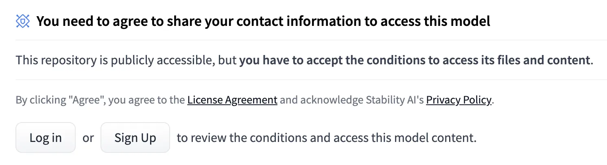
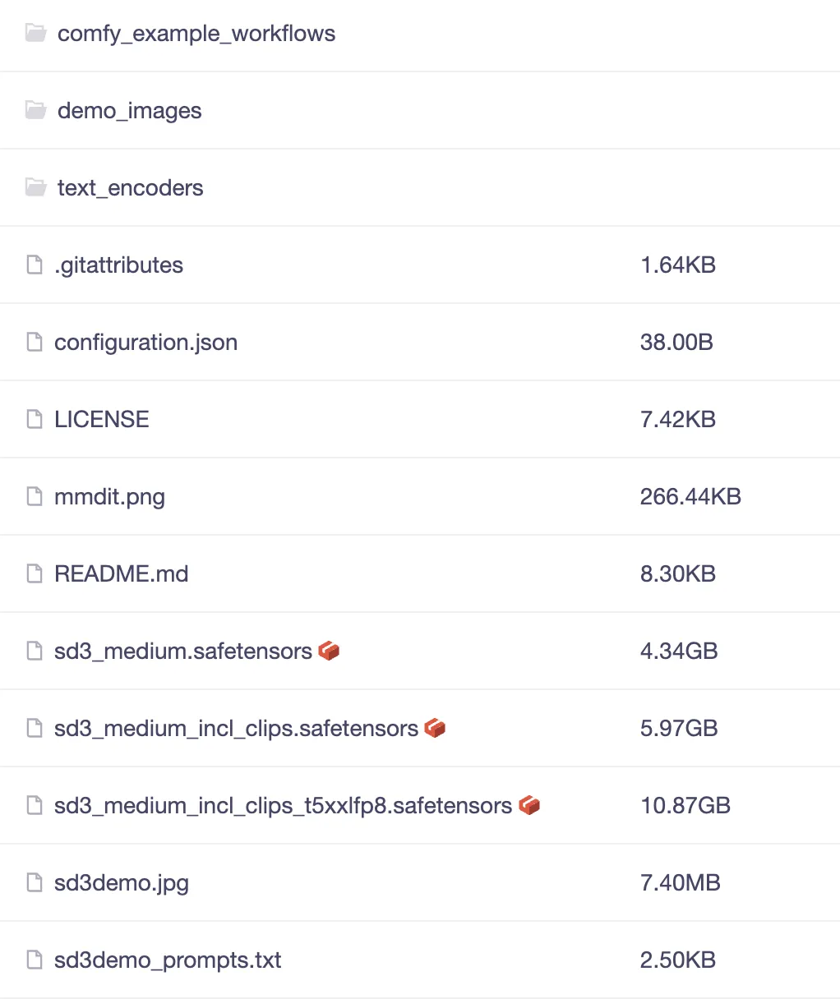
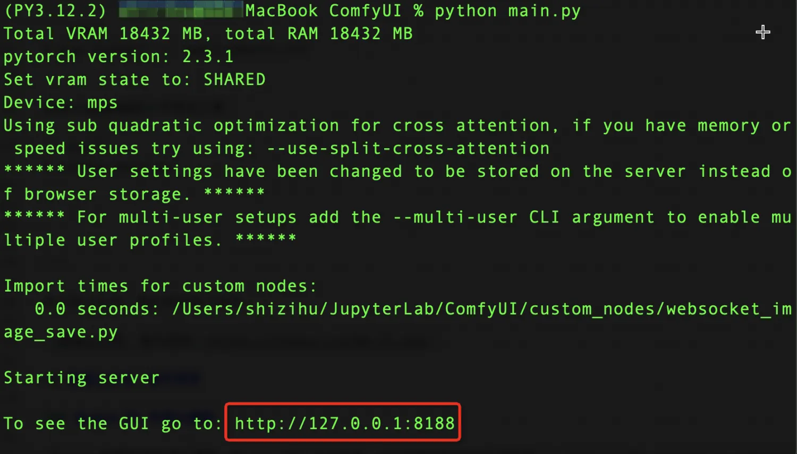
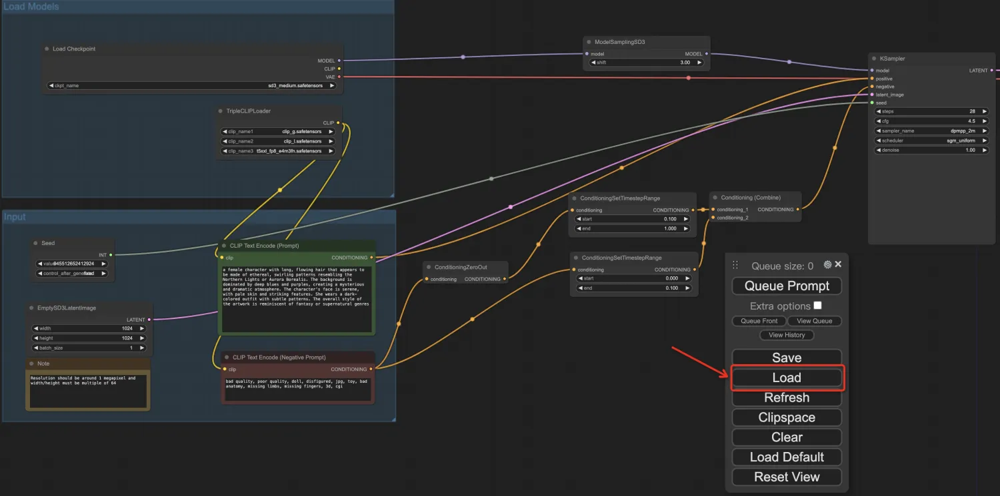
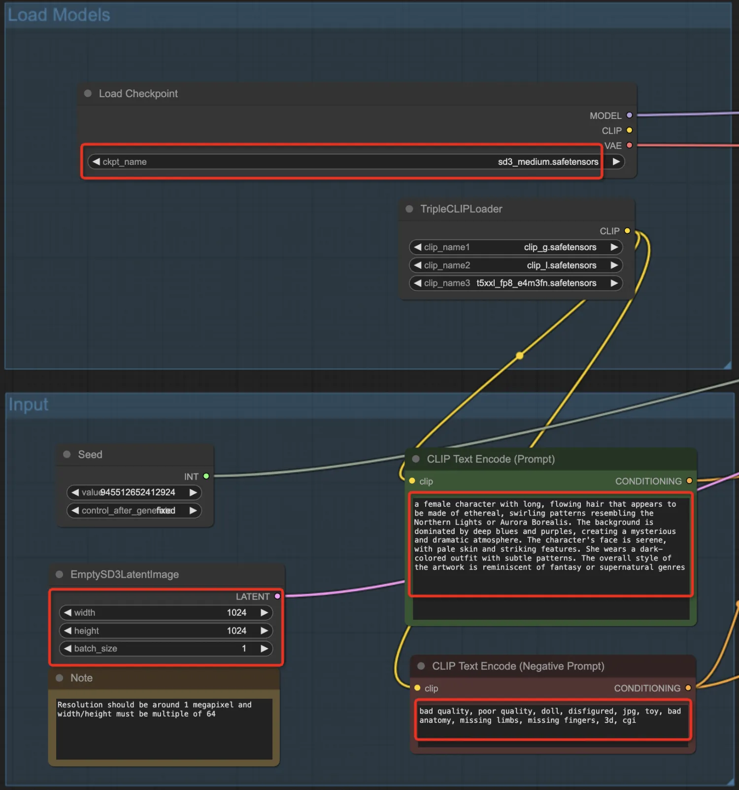
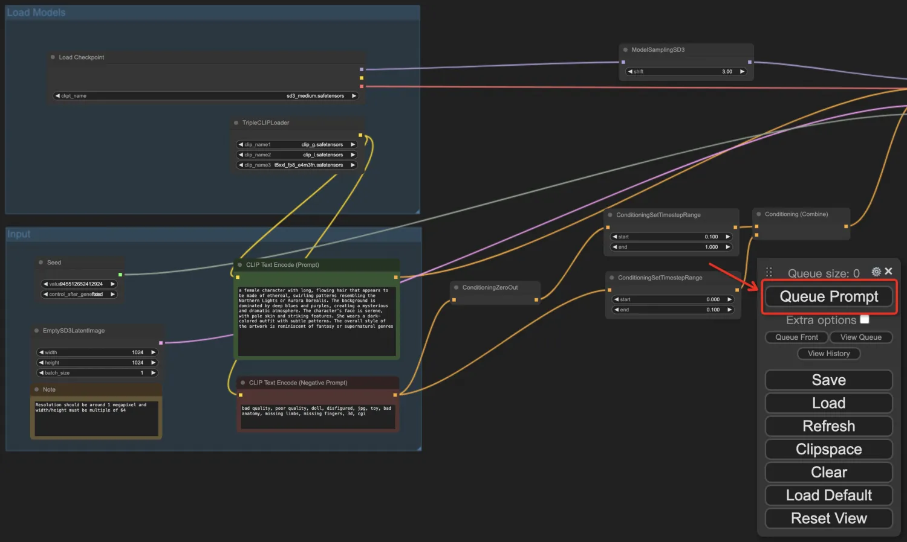
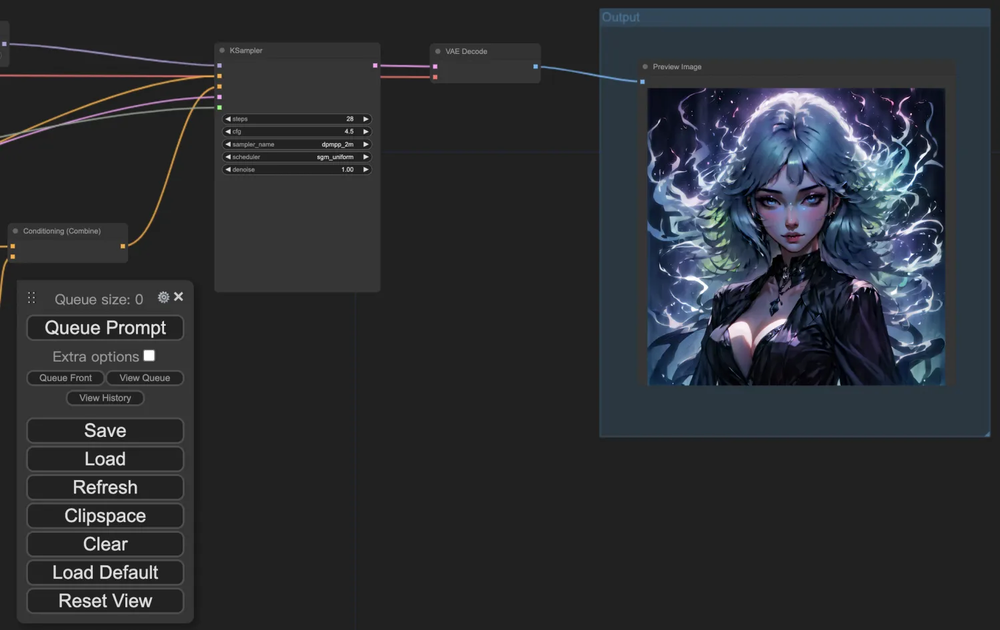

+++
slug = "2024061701"
date = "2024-06-17"
lastmod = "2024-06-18"
title = "Stable Diffusion 3 大模型文生图“开源英雄”笔记本部署和使用教程，轻松实现AI绘图自由"
description = "Stability AI正式开源了 Stable Diffusion 3 Medium 文生图大模型，它仅20亿参数，就能够生成更高质量和更细腻的图片。得益于较小的模型尺寸，Stable Diffusion 3 Medium尤其适合在个人PC、笔记本电脑和企业级GPU上运行。老牛同学同过本教程，手把手部署和体验Stable Diffusion 3 Medium大模型……"
image = "00.jpg"
tags = [ "AI工具", "Stable Diffusion", "大模型", "文生图", "ComfyUI" ]
categories = [ "人工智能" ]
+++

备受期待的**Stable Diffusion 3**（以下亦简称**SD3**）如期向公众开源了（**Stable Diffusion 3 Medium**），作为**Stability AI**迄今为止最先进的文本生成图像的开源大模型，**SD3**在图像质量、文本内容生成、复杂提示理解和资源效率方面有了显著提升，被誉为AI文生图领域的**开源英雄**。

**Stable Diffusion 3 Medium**特点包括：
+ 模型仅包含**20亿**参数，具有体积小、适合在个人PC和笔记本电脑上运行的优点，所以我们也可以将其部署到自己的电脑上使用。
+ 图像质量整体提升，能生成照片般细节逼真、色彩鲜艳、光照自然的图像；能灵活适应多种风格，无需微调，仅通过提示词就能生成动漫、厚涂等风格化图像；具有 16 通道的 VAE，可以更好地表现手部以及面部细节。
+ 能够理解复杂的自然语言提示，如空间推理、构图元素、姿势动作、风格描述等。对于「第一瓶是蓝色的，标签是“1.5”，第二瓶是红色的，标签是“SDXL”，第三瓶是绿色的，标签是“SD3”」这样复杂的内容，SD3 依旧能准确生成，而且文本效果比 Midjourney 还要准确。
+ 通过 Diffusion Transformer 架构，SD3 Medium 在英文文本拼写、字距等方面更加正确合理。Stability AI 在发布 SD3 官方公告时，头图就是直接用 SD3 生成的，效果非常惊艳。

**特别注意：** 开源的**Stable Diffusion 3 Medium**模型的授权范围是开放的非商业许可证，也就是说没有官方许可的情况下，模型不得用于商业用途（协议内容：[https://huggingface.co/stabilityai/stable-diffusion-3-medium/blob/main/LICENSE](https://huggingface.co/stabilityai/stable-diffusion-3-medium/blob/main/LICENSE)）


## 下载Stable Diffusion 3 Medium模型文件

**SD3**的模型文件已经上传到了HF上，但是在下载之前需要先注册并填写一份表格，保证自己不会将**SD3**用于商用用途。然而，注册和填写表格均需要有**通畅**的网络，这对我们个人不是很友好：



注册或者登录成功之后，我们需要填写表格：


老牛同学担心，仅这2个前置的需要**通畅网络**的操作步骤，就阻挡了一批**SD3**的爱好者们，这是老牛同学不希望看到的结果。

**幸运的是：** ModelScope提供了一个可直接下载模型文件的镜像仓库，可直接跳过前面步骤（当然这有点违背**Stability AI**的初衷，但考虑到我们仅用于学习和非商业用途，也算是殊途同归吧）：[https://modelscope.cn/models/AI-ModelScope/stable-diffusion-3-medium/files](https://modelscope.cn/models/AI-ModelScope/stable-diffusion-3-medium/files)

本仓库有3个基础是模型文件，它们有不同的用途，初次使用建议全部下载到本地：
+ sd3_medium：4.34G，独立主模型，不包含文本编码器（即后面2个文件名带有**clip**的模型）
+ sd3_medium_incl_clips.safetensors：5.97G，包含 clip_g 和 clip_l 编码器
+ sd3_medium_incl_clips_t5xxlfp8.safetensors：10.87G，包含 clip_g、clip_l 和 t5xxl_fp8 编码器

**特别说明：** 以上3个模型文件，最后需要放到**ComfyUI**的`./models/checkpoints`文件夹中（关于**ComfyUI**的使用下面章节介绍）

另外，本仓库还有2个重要的文件夹，同样建议全部下载到本地：
+ comfy_example_workflows：**ComfyUI**工作流样例配置文件（关于**ComfyUI**的使用下面章节介绍）
+ text_encoders：文本编码器模型文件夹，最后模型文件最后也需要放到**ComfyUI**的`./models/clip`文件夹中（关于**ComfyUI**的使用下面章节介绍）

因模型文件比较大，直接使用Git无法直接下载到本地，我们通过**git-lfs**工具包下载：

```shell
brew install git-lfs
```

通过Git复制模型文件到笔记本电脑（文件夹：`stable-diffusion-3-medium`）：

```shell
git lfs install
git clone https://www.modelscope.cn/AI-ModelScope/stable-diffusion-3-medium.git stable-diffusion-3-medium
```

如果因网络不佳等原因，下载可能会中断，我们可以通过以下命令在中断后多次执行继续下载，直到最终下载完成：

```shell
git lfs pull
```



## 下载ComfyUI工作流可视化工具

上一章节，我们多次提到了**ComfyUI**，它是**Stable Diffusion**的工作流可视化工具之一，也是Stability AI官方推荐使用的可视化工具。

我们下载最新的**ComfyUI**到笔记本电脑（本地目录：`ComfyUI`）：

```shell
git clone https://github.com/comfyanonymous/ComfyUI.git ComfyUI
```

本次部署教程中，**ComfyUI**中的`models`文件夹需要包括下载的模型文件：

```shell
% tree ./models 
./models
├── checkpoints
│   └── put_checkpoints_here
├── clip
│   └── put_clip_or_text_encoder_models_here
......其它省略......
```

**checkpoints**文件夹：是存放**SD3**模型文件根目录下的`sd3_medium.safetensors`、`sd3_medium_incl_clips.safetensors`和`sd3_medium_incl_clips_t5xxlfp8.safetensors`等模型文件的文件夹。

**clip**文件夹：是存放**SD3**模型文件`text_encoders`目录下的`clip_g.safetensors`、`clip_l.safetensors`、`t5xxl_fp8_e4m3fn.safetensors`和`t5xxl_fp16.safetensors`等模型文件的文件夹。

## 启动ComfyUI可视化界面

**第一步：** 复制模型文件到**ComfyUI**指定的`models`文件夹中，因为老牛同学使用的是Mac电脑，可以通过软链接方式实现复制的效果（如果是**Windows**电脑，请直接复制文件）：

```shell
% cd ~/JupyterLab/ComfyUI/models/checkpoints
% ln -s ~/JupyterLab/stable-diffusion-3-medium/sd3_medium.safetensors sd3_medium.safetensors
% ln -s ~/JupyterLab/stable-diffusion-3-medium/sd3_medium_incl_clips.safetensors sd3_medium_incl_clips.safetensors
% ln -s ~/JupyterLab/stable-diffusion-3-medium/sd3_medium_incl_clips_t5xxlfp8.safetensors sd3_medium_incl_clips_t5xxlfp8.safetensors
%
% cd ~/JupyterLab/ComfyUI/models/clip
% ln -s ~/JupyterLab/stable-diffusion-3-medium/text_encoders/clip_g.safetensors clip_g.safetensors
% ln -s ~/JupyterLab/stable-diffusion-3-medium/text_encoders/clip_l.safetensors clip_l.safetensors
% ln -s ~/JupyterLab/stable-diffusion-3-medium/text_encoders/t5xxl_fp8_e4m3fn.safetensors t5xxl_fp8_e4m3fn.safetensors
% ln -s ~/JupyterLab/stable-diffusion-3-medium/text_encoders/t5xxl_fp16.safetensors t5xxl_fp16.safetensors
```

软链接建好之后，我们可以检查一下是否**符合预期**：

```shell
% cd ~/JupyterLab/ComfyUI/models
% tree ./checkpoints 
./checkpoints
├── put_checkpoints_here
├── sd3_medium.safetensors -> /Users/shizihu/JupyterLab/stable-diffusion-3-medium/sd3_medium.safetensors
├── sd3_medium_incl_clips.safetensors -> /Users/shizihu/JupyterLab/stable-diffusion-3-medium/sd3_medium_incl_clips.safetensors
└── sd3_medium_incl_clips_t5xxlfp8.safetensors -> /Users/shizihu/JupyterLab/stable-diffusion-3-medium/sd3_medium_incl_clips_t5xxlfp8.safetensors
%
% tree ./clip
./clip
├── clip_g.safetensors -> /Users/shizihu/JupyterLab/stable-diffusion-3-medium/text_encoders/clip_g.safetensors
├── clip_l.safetensors -> /Users/shizihu/JupyterLab/stable-diffusion-3-medium/text_encoders/clip_l.safetensors
├── put_clip_or_text_encoder_models_here
├── t5xxl_fp16.safetensors -> /Users/shizihu/JupyterLab/stable-diffusion-3-medium/text_encoders/t5xxl_fp16.safetensors
└── t5xxl_fp8_e4m3fn.safetensors -> /Users/shizihu/JupyterLab/stable-diffusion-3-medium/text_encoders/t5xxl_fp8_e4m3fn.safetensors
```

**第二步：** 启动**ComfyUI**工作流可视化界面

进入**ComfyUI**根目录，安装Python依赖包列表：

```shell
% pip install -r requirements.txt
```

启动**ComfyUI**可视化工具：

```shell
% python main.py
```



从启动日志可以看出，**ComfyUI**启动成功了：[http://127.0.0.1:8188](http://127.0.0.1:8188)

## 使用ComfyUI通过文本生成图片

浏览器打开**ComfyUI**页面：`http://127.0.0.1:8188` 可以看到默认的**SD3**工作流，我们用自己的工作流完成绘画。

**第一步：** 修改模型文件`./stable-diffusion-3-medium/comfy_example_workflows/sd3_medium_example_workflow_basic.json`的第**416行**，去掉`sdv3/2b_1024/sd3_medium.safetensors`的相对目录为`sd3_medium.safetensors`（默认本模型文件，我们已经复制到了ComfyUI指定的目录中，因此无需相对目录）：

```json
......前面省略......
"widgets_values": [
  "sd3_medium.safetensors"
]
......后面省略......
```
**第二步：** 加载修改后的工作流配置文件：点击**ComfyUI**的**Load**按钮，选择修改后的`sd3_medium_example_workflow_basic.json`文件：



可以看到工作流有很多参数可供设置，包括：`选择模型`、`正面Prompt提示词`、`负面Prompt提示词`、`图片尺寸/数量`等输入参数：



**第三步：** 调整参数，生成图片：我们可以修改工作流中任意一个参数（最常修改的是Prompt提示词，包括正面和负面提示词），也可以点击右键增加工作流节点。最终参数调整确定之后，点击**Queue Prompt**按钮，开始排队生成图片：



我们可以看到，生成图片处理中，**ComfyUI**根据编排好的工作流，按照依赖关系逐个节点执行，最终在**Output**中展示了根据提示生成的精美图片：




最终生成的图片：


## Stable Diffusion使用总结

至此，**Stable Diffusion 3**的部署和使用教程接近尾声了，我们可以尽情使用不同的工作流和调整不同参数来生成我们的图片了。

同时也恭喜你，和老牛同学一起，我们的大模型库又增添了重要的一员：**文生图**大模型！

**SD3 参数调优：** 生成写实或人物面部照片，可以将**KSampler**节点的`cfg`参数调低至**2到3之间**（默认为**4.5**）；当包含文本时，使用**4.5到5**时效果会更好。大家可以多多尝试，探索一些其他参数产生的效果，欢迎留言。

同时**SD3**模型更适合自然语言提示词，而不是标签式的提示词（和MJ有一点点区别），我们可以详细描述图片的画面内容、构图、色彩、氛围，即使提示词很长，**SD3**模型也能处理的很好。

---

关注本公众号，我们共同学习进步👇🏻👇🏻👇🏻


## 微信公众号：老牛同学

### Qwen2-7B 开源大模型

[Qwen2阿里最强开源大模型（Qwen2-7B）本地部署、API调用和WebUI对话机器人](https://mp.weixin.qq.com/s/u_Uw88dpQRgbtfI4_1OOwQ)

### Llama-3-8B 开源大模型

[玩转 AI，笔记本电脑安装属于自己的 Llama 3 8B 大模型和对话客户端](https://mp.weixin.qq.com/s/MekCUJDhKzuUnoykkGoH2g)

[一文彻底整明白，基于 Ollama 工具的 LLM 大语言模型 Web 可视化对话机器人部署指南](https://mp.weixin.qq.com/s/2DVYO75h0o5EHN_K_GF4Eg)

[基于Llama 3搭建中文版（Llama3-Chinese-Chat）大模型对话聊天机器人](https://mp.weixin.qq.com/s/idcdIr8mMWDQ_iZU5r_UEQ)

### GLM-4-9B 开源大模型

[本地部署GLM-4-9B清华智谱开源大模型方法和对话效果体验](https://mp.weixin.qq.com/s/g7lDfnRRGdrHqN7WGMSkAg)

### ChatTTS 文本转语音模型

[ChatTTS 开源文本转语音模型本地部署、API使用和搭建WebUI界面](https://mp.weixin.qq.com/s/rL3vyJ_xEj7GGoKaxUh8_A)

### 大模型应用

[借助AI大模型，三分钟原创一部儿童故事短视频（附完整操作步骤）](https://mp.weixin.qq.com/s/m_O2OSoXWLL0PJurLCdzng)

[高效编写大模型 Prompt 提示词，解锁 AI 无限创意潜能](https://mp.weixin.qq.com/s/gaLw3yP-oANvQyjRSkVjyw)

### Python 小游戏

[AI已来，我与AI一起用Python编写了一个消消乐小游戏](https://mp.weixin.qq.com/s/hv2tE-yot_H04HCezxQWXg)

[Python游戏编程：一步步用Python打造经典贪吃蛇小游戏](https://mp.weixin.qq.com/s/tkTlt4rbFKQ73zudluPO1A)

---
