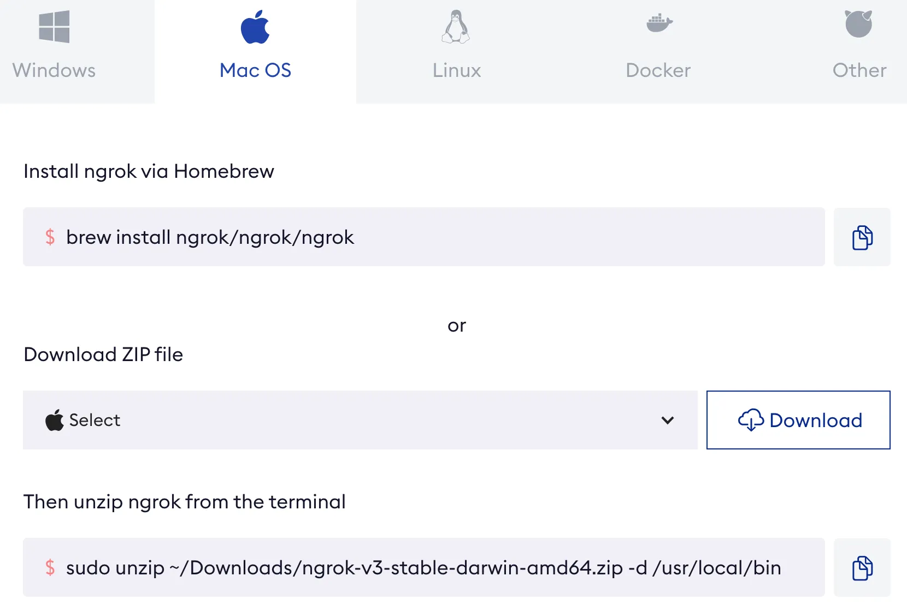
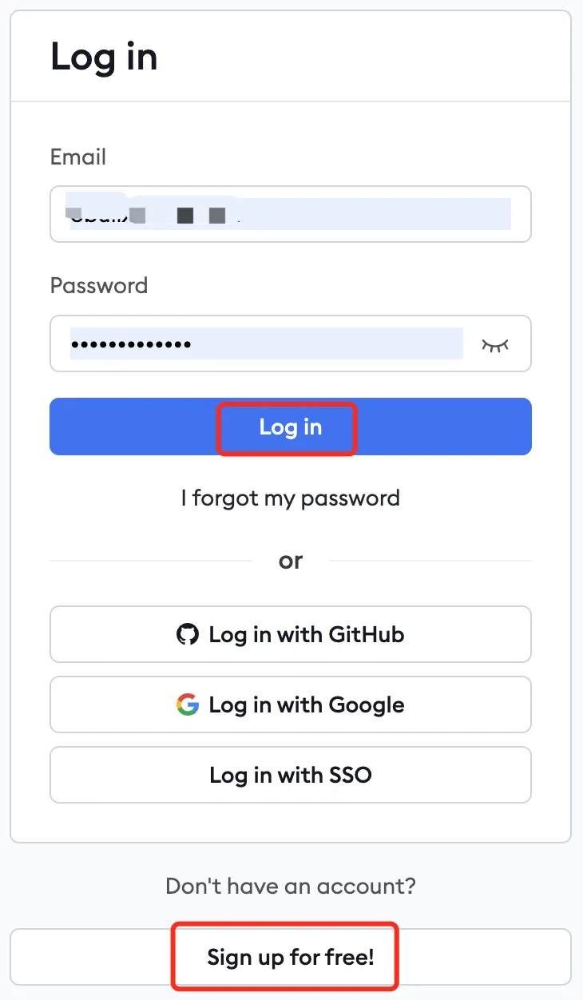
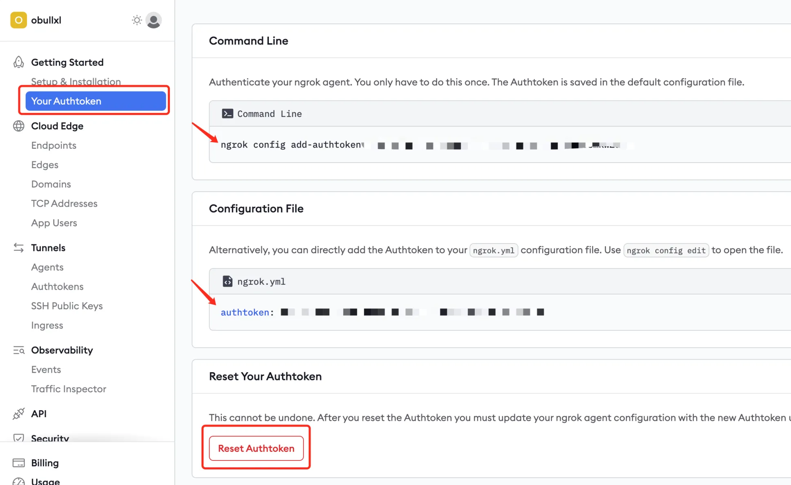
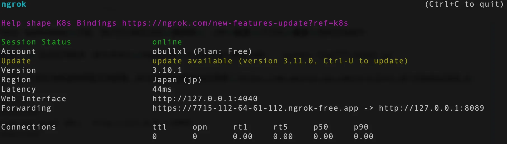
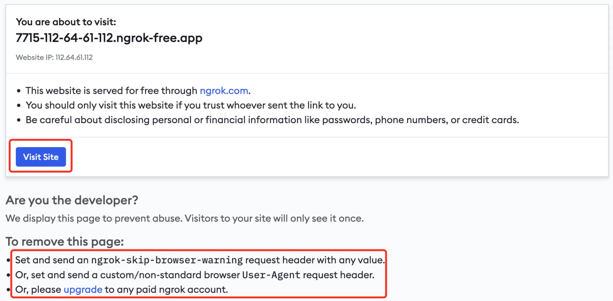
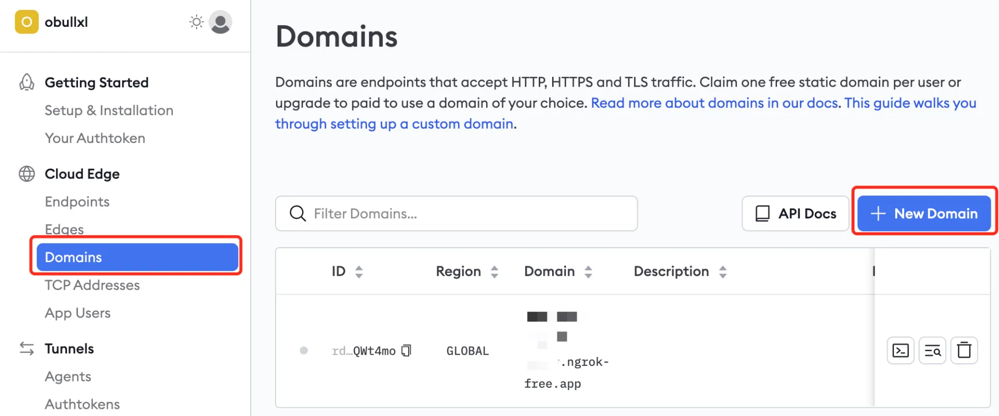

+++
slug = "2024062201"
date = "2024-06-22"
lastmod = "2024-06-22"
title = "ngrok内网穿透，实现外网访问ChatTTS/Qwen2等大模型应用"
description = "我们编写好的应用程序、或者本地部署的大模型，想临时分享给外网访问以进行功能演示，通过ngrok内网穿透软件，可以快速满足我们的需求……"
image = "00.jpg"
tags = [ "ngrok", "内网穿透" ]
categories = [ "专业技术" ]
+++

老牛同学在前面的几篇博文中，和大家一起在个人电脑本地部署和体验了**ChatTTS**、**Qwen2**、**GLM4**和**Llama3**等大模型，由于是个人电脑部署，只能在局域网内使用，无法分享到外网。今天我们通过**ngrok**软件，免费把我们的大模型应用分享出去。

## 什么是内网穿透

运营商（如：电信、联通等）拉了一根网线到家里路由器并接入互联网（比如IP是：10.25.12.6，它是**公网IP**），我们个人电脑通过路由器间接接入互联网（比如IP是：192.168.3.27，它是**局域网IP**），这个通过路由器建立的网络，也就局域网或者内网。外网通过**公网IP**是无法访问到局域网中的某台计算机，也就是我们个人电脑上部署的应用无法通过外网分享出去。

如果我们在局域网和外网之间，增加一个桥接器，它的作用是类似于链接局域网和外网的通道，外网可通过这通道直接访问到局域网的服务器，这个操作也就是**内网穿透**。

今天我们要介绍的**ngrok**正是这个桥接通道：我们首先在个人电脑通过**ngrok**客户端链接**ngrok**服务器，把我们端口（即应用程序）和**ngrok**某个域名建立链接；外网访问**ngrok**的域名，即访问**ngrok**服务器，服务器请求下发给客户端，即可以实现互相通信。

## 内网穿透的应用场景

一般情况下，我们想发布我们应用到外网，需要以下步骤：
1. 在外网有一台服务器（自己拉网线建机房、或者买服务器、或者租云服务器等）
2. 服务器上安装操作系统，搭建应用程序的运行环境
3. 在服务器上部署应用程序

这一通操作下来，费用和时间成本都比较高。如果我们只是想**短期**内把应用程序分享到外网的话，就需要**内网穿透**了：
1. 外网**临时**访问，无长期访问需求，如**ChatTTS**、**Qwen2**、**GLM4**和**Llama3**等我们大模型临时演示
2. 外面访问的**域名**无要求，域名只作为每次访问的入口即可
3. 访问**速度**要求不高、**并发**较小，因为注意是应用功能体验

## ngrok配置内网穿透（临时域名）

**第一步：** 登录**ngrok**官网（[https://ngrok.com/download](https://ngrok.com/download)），下载客户端：



老牛同学是Mac电脑，可通过**brew**直接安装包：`brew install ngrok/ngrok/ngrok`

安装完成之后，我们就可以用`ngrok`命令进行后续操作了。

**第二步：** 登录或者注册**ngrok**账号（[https://dashboard.ngrok.com/login](https://dashboard.ngrok.com/login)），获取授权码：



**第三步：** 登录**ngrok**后台（[https://dashboard.ngrok.com/get-started/your-authtoken](https://dashboard.ngrok.com/get-started/your-authtoken)），获取和配置**ngrok**授权码 `ngrok config add-authtoken 授权码`



在**Your Authtoken**页面，我们可以看到当前**授权码**、2种**配置**方式和**重置**授权码等操作！

**第四步：** 启动应用程序（老牛同学以**ChatTTS**文本转语音大模型为例）：`python ChatTTS-WebUI.py`

[ChatTTS 开源文本转语音模型本地部署、API使用和搭建WebUI界面](https://mp.weixin.qq.com/s/rL3vyJ_xEj7GGoKaxUh8_A)

```shell
# 前面输出省略
Running on local URL:  http://127.0.0.1:8089
# 后面输出省略
```

启动成功，可以看到应用程序的端口号：**8089**（端口号在接下来启动**ngrok**需要用到）

浏览器打开WebUI：[http://127.0.0.1:8089](http://127.0.0.1:8089)，确认**ChatTTS**正常启动


**第五步：** 启动**ngrok**客户端，对外分享**ChatTTS**大模型应用程序：

上面启动**ChatTTS**是Web应用（即`http`协议），且端口号是`8089`，我们打开Terminal终端，启动**ngrok**客户端：

```shell
ngrok http http://127.0.0.1:8089
```


可以看到，**ngrok**客户端，把我们内网的端口，映射到一个临时域名：`https://7715-112-64-61-112.ngrok-free.app`

到此，我们就可以在外网通过这个临时域名，来访问我们内网**ChatTTS**大模型！

每次打开这个域名，均会有如下确认页面，直接点击**Visit Site**即可，我们也可以通过底部的3种方式消除这个确认页面：



## ngrok固定域名内网穿透

通过上面的步骤，我们可以通过临时域名，实现了内网穿透。每次启动**ngrok**客户端，临时域名都会发生变化，我们也可以进一步通过**固定域名**实现内网穿透，提升外网访问体验。

**第一步：** 申请免费的固定域名（每个用户可申请一个免费固定域名），登录**ngrok**后台，选择**Domains**菜单；然后点击**+ New Domain**按钮，**ngrok**分配一个固定的域名，一般为：`xxxx.ngrok-free.app`格式：



**第二步：** 首先**终止**临时域名启动的客户端，然后通过**固定**域名启动**ngrok**客户端：`ngrok http --domain=xxxx.ngrok-free.app 8089`

最后，我们可以在外网通过固定域名访问内网应用程序了！

## ngrok内网穿透的用法

上面章节，我们通过**ngrok**把**ChatTTS**的WebUI分享到了外网，除了**http**协议之外，**ngrok**还可以支持`TLS`和`TCP`以下协议：

```shell
# TLS
ngrok tls 80 --terminate-at edge --domain your-name.ngrok.app

# TCP
ngrok tcp 22
```

欢迎大家尝试，后续若有对应的使用场景，老牛同学在进行分享！

---

关注本公众号，我们共同学习进步👇🏻👇🏻👇🏻


**Qwen2-7B 开源大模型**

[Qwen2 阿里最强开源大模型（Qwen2-7B）本地部署、API调用和WebUI对话机器人](https://mp.weixin.qq.com/s/u_Uw88dpQRgbtfI4_1OOwQ)

**Llama-3-8B 开源大模型**

[玩转 AI，笔记本电脑安装属于自己的 Llama 3 8B 大模型和对话客户端](https://mp.weixin.qq.com/s/MekCUJDhKzuUnoykkGoH2g)

[一文彻底整明白，基于 Ollama 工具的 LLM 大语言模型 Web 可视化对话机器人部署指南](https://mp.weixin.qq.com/s/2DVYO75h0o5EHN_K_GF4Eg)

[基于Llama 3搭建中文版（Llama3-Chinese-Chat）大模型对话聊天机器人](https://mp.weixin.qq.com/s/idcdIr8mMWDQ_iZU5r_UEQ)

**GLM-4-9B 开源大模型**

[本地部署GLM-4-9B清华智谱开源大模型方法和对话效果体验](https://mp.weixin.qq.com/s/g7lDfnRRGdrHqN7WGMSkAg)

**ChatTTS 文本转语音模型**

[ChatTTS 开源文本转语音模型本地部署、API使用和搭建WebUI界面](https://mp.weixin.qq.com/s/rL3vyJ_xEj7GGoKaxUh8_A)

**大模型应用案例**

[借助AI大模型，三分钟原创一部儿童故事短视频（附完整操作步骤）](https://mp.weixin.qq.com/s/m_O2OSoXWLL0PJurLCdzng)

[高效编写大模型 Prompt 提示词，解锁 AI 无限创意潜能](https://mp.weixin.qq.com/s/gaLw3yP-oANvQyjRSkVjyw)

**Python 小游戏**

[AI已来，我与AI一起用Python编写了一个消消乐小游戏](https://mp.weixin.qq.com/s/hv2tE-yot_H04HCezxQWXg)

[Python游戏编程：一步步用Python打造经典贪吃蛇小游戏](https://mp.weixin.qq.com/s/tkTlt4rbFKQ73zudluPO1A)

---
