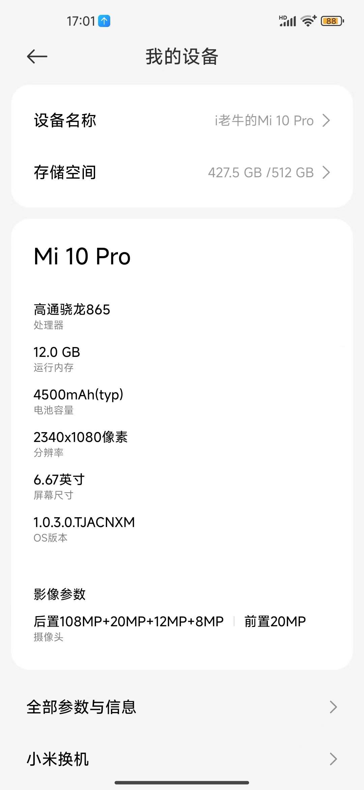
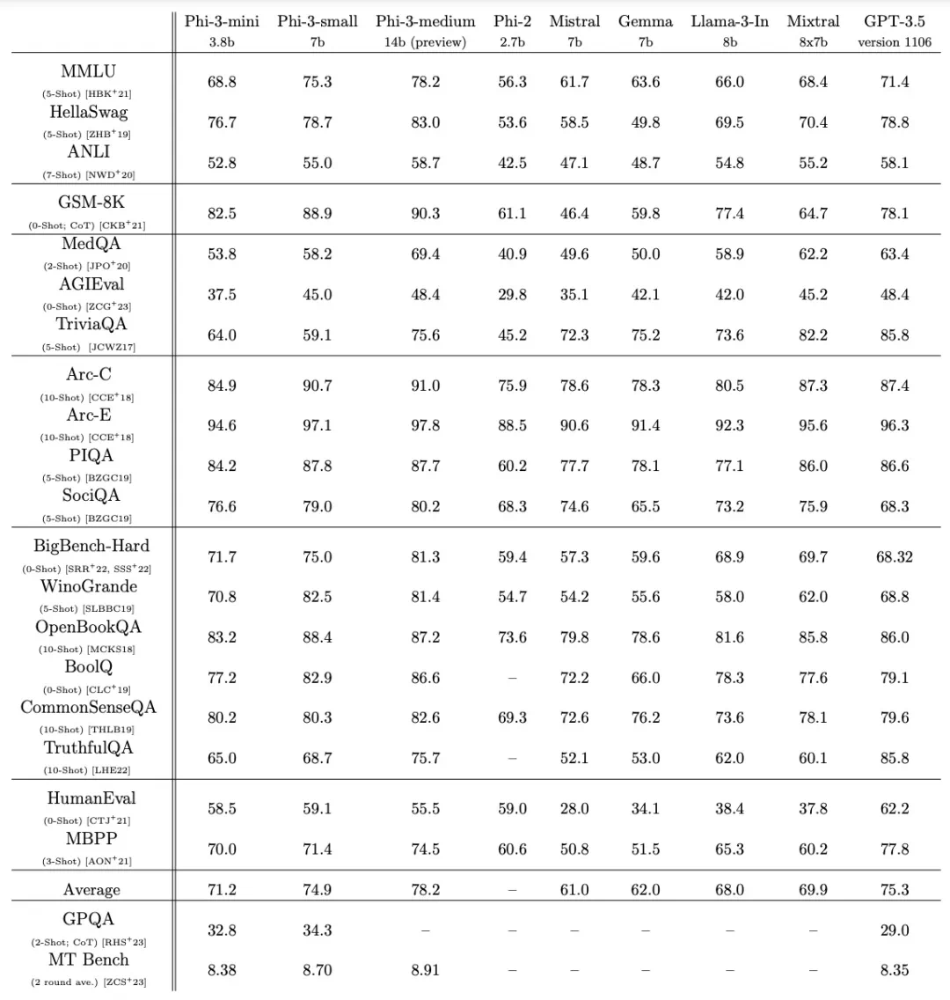
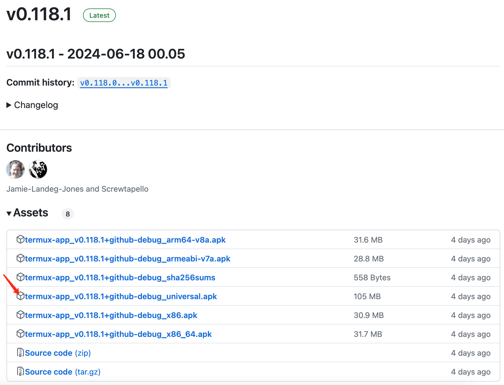
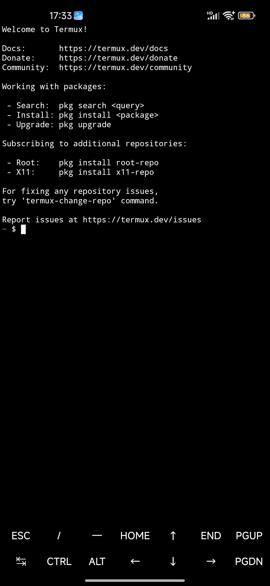
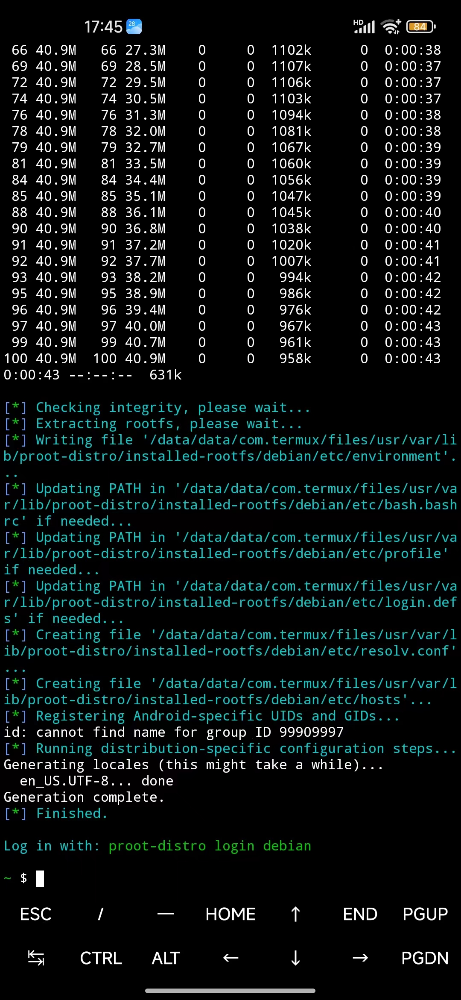
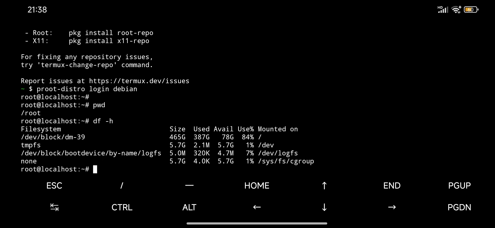
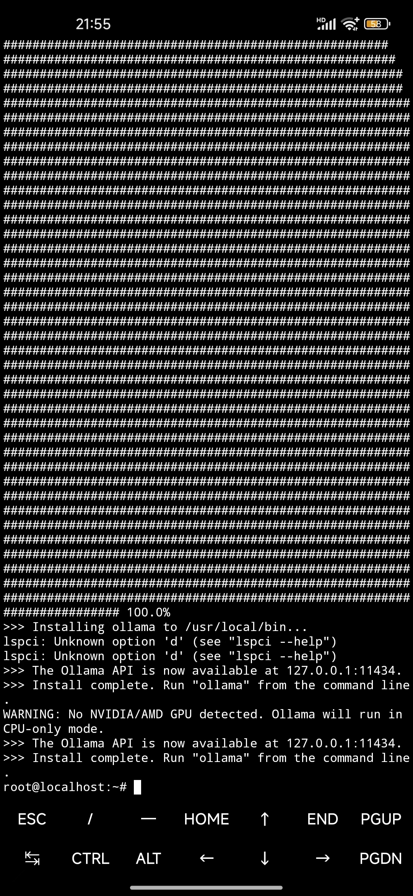
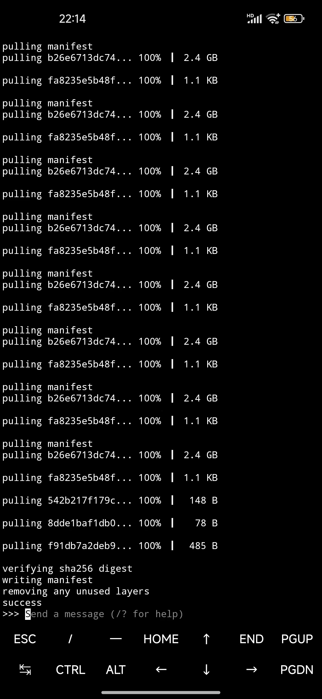
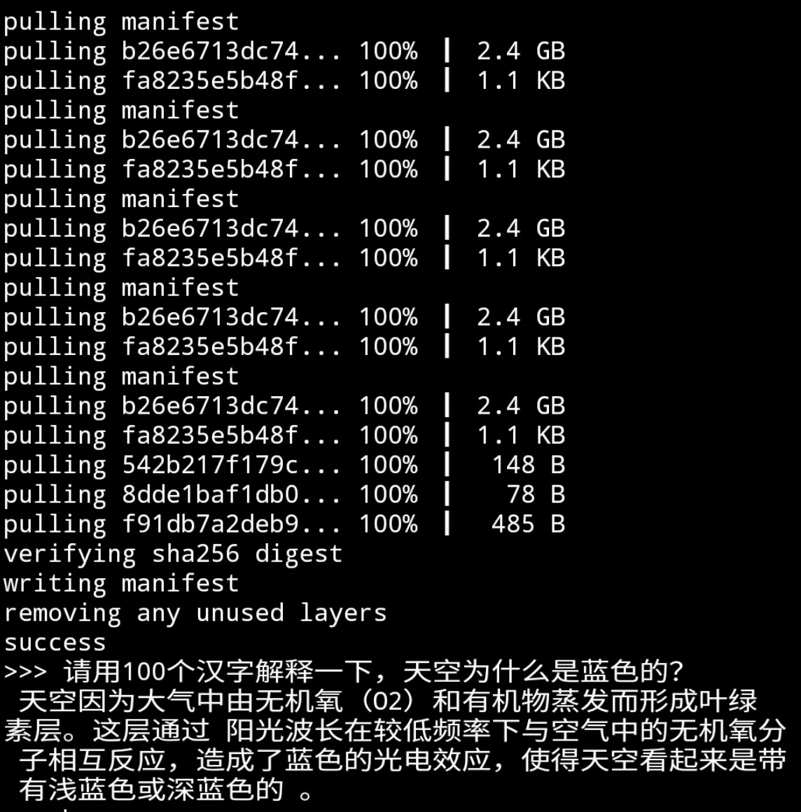

+++
slug = "2024062301"
date = "2024-06-23"
lastmod = "2024-06-23"
title = "Phi-3 模型手机部署教程（微软发布的可与GPT-3.5媲美的小模型）"
description = "Phi 是微软AI研究院新推出的开源小型语言模型，适用于商业使用，其优势在于体积小、资源需求少，被称为“一个能跑在手机上的大模型”，我们通过Termux和Ollama工具，在我们手机上部署和体验……"
image = "00.jpg"
tags = [ "AI工具", "Phi", "大模型", "Termux", "Ollama" ]
categories = [ "人工智能" ]
+++

前面几篇博文，老牛同学和大家一起在个人电脑部署了**Qwen2**、**GLM4**、**Llama3**、**ChatTTS**和**Stable Diffusion**等 LLM 大模型，也通过 API 和 WebUI 的方式完成了体验。

但是这些大模型因为部署在个人电脑本地，不能够随时携带。如果能在手机上部署大模型的话，老牛同学感觉很有意义，手机与我们的生活更为密切相关，并且手机上也有大量的个人数据，与大模型交互起来也更加方便。同时，在手机上跑个大模型，还是很酷！

老牛同学期望能通过本文，和大家一起完成这项很酷且有意义的事情。老牛同学用的是**小米 10 Pro**手机，其配置参数如下：



## 选择 Phi-3 微软开源模型

受限于手机 CPU 和内存等硬件配置，我们要选择小语言模型（SLM）。其中，阿里开源了**Qwen2-0.5B**和**Qwen2-1.5B**两款小尺寸模型，微软了开源**Phi-3 Mini**（**3.8B**）和**Phi-3 medium**（**14B**）两款尺寸模型。

由于之前我们在笔记本部署了**Qwen2-7B**大模型，本次我们就在手机部署**Phi-3 Mini**模型，顺便也体验一下不同科技公司的大模型产品，其效果可以媲美**GPT-3.5**大模型：



**Qwen2-7B**本地部署：[Qwen2 阿里最强开源大模型（Qwen2-7B）本地部署、API 调用和 WebUI 对话机器人](https://mp.weixin.qq.com/s/u_Uw88dpQRgbtfI4_1OOwQ)

## 手机配置 Linux 环境（Termux 应用）

小米等安卓手机的基于 Linux 内核的操作系统，但是我们无法像在 Linux 那样执行 Linux 命令，因此我首先得配置一下 Linux 环境。

**Termux**是一个 Android 的终端模拟器，可以在 Android 设备上运行 Linux 命令和工具。**Termux**的 Android APP 可通过官网下载并安装：[https://github.com/termux/termux-app/releases](https://github.com/termux/termux-app/releases)

当前官网的最新稳定版本：`v0.118.1 - 2024-06-18 00.05`



请根据手机情况，下载对应的 apk 文件。老牛同学下载的 apk 文件：**termux-app_v0.118.1+github-debug_universal.apk**

apk 安装成功后，打开**Termux**应用后，默认展示如下，就可以开始输入 Linux 命令了：



## 手机上安装 Linux 操作系统

首先，我们安装**proot-distro**系统管理工具，**proot-distro**可以非常方便在 Termux 中**安装**、**卸载**和**运行**Linux 的发行版本（包括：Ubuntu、Debian、Arch Linux 等）：

**友情提示：** 在手机中输入以下命令效率比较低，我们可以把命令发到微信，然后一条一条复制粘贴！

```shell
pkg install proot-distro
```

**proot-distro** 安装成功之后，我们安装**Debian**操作系统：

```shell
proot-distro install debian
```



最后，登录新安装的**Debian**操作系统：

```shell
proot-distro login debian
```

登录之后，自动启动了**Shell**命令行终端：`root@localhost:~#`

可以执行相关的 Linux 命令了：



## 通过 Termux 安装 Phi-3 模型

通过上面的操作，我们已经在手机上安装好了**Debian**操作系统，接下来在**Debian**操作系统中安装**Phi-3 Mini**模型。

**第一步：** 在**Debian**系统中安装**Ollama**软件，没错，就是之前在个人电脑部署**Llama3**、**Qwen2**等大模型时，用于管理本地大模型的**Ollama**软件。由于我们在手机上安装了**Debian**系统，那么和电脑一样，**Ollama**也可以管理**Debian**系统本地部署的大模型：

```shell
# 安装Ollama软件
curl -fsSL https://ollama.com/install.sh | sh
```

**Ollama**安装成功输出信息如下：



**第二步：** 通过**后台**启动**Ollama**服务：`nohup ollama serve &`

我们用**Ollama**命令，查看 Ollama 信息，如：

- 查看版本：`ollama -v`
- 查看本地模型列表：`ollama list`（目前还没有部署模型，因此结果列表为**空**）

**第三步：** 通过**Ollama**安装并启动**Phi-3 Mini**模型：`ollama run phi3:mini`

**Phi-3 Mini**模型文件总大小为**2.4GB**左右，因此下载需要一点时间：



到此，**Phi-3 Mini**模型部署成功，我们可以体验手机上的大模型，比如：**请用 100 个汉字解释一下，天空为什么是蓝色的？**



## 总结

相比电脑端，手机的算力弱太多，就算老牛同学用的是最小尺寸的模型（**Phi-3 Mini**），其推理的速度还是慢得多。其内容的输出速度，比我手机打字都要慢。盯着屏幕，看着模型一个字一个字的输出，感觉也挺有趣 😁

目前 AI 是大热门，各大公司推出的大模型参数一个比一个大，能力一个比一个厉害。但大模型训练和推理成本均比较高昂，在很大程度上限制了其发展，因此大模型 AI 应用相对较少，或者说对我们生活影响还很小，因此其还有很大的发展空间。

而反观针对特定业务场景定制的小模型（比如**Phi**定制等），其成本就低得多，就能更有效地应用于各种垂直场景。

老牛同学觉得这种“**小而美**”的 AI 模型将会越来越多，也会越来越受欢迎！

---

关注本公众号，我们共同学习进步 👇🏻👇🏻👇🏻


**Qwen2-7B 开源大模型**

[Qwen2 阿里最强开源大模型（Qwen2-7B）本地部署、API 调用和 WebUI 对话机器人](https://mp.weixin.qq.com/s/u_Uw88dpQRgbtfI4_1OOwQ)

**Llama-3-8B 开源大模型**

[玩转 AI，笔记本电脑安装属于自己的 Llama 3 8B 大模型和对话客户端](https://mp.weixin.qq.com/s/MekCUJDhKzuUnoykkGoH2g)

[一文彻底整明白，基于 Ollama 工具的 LLM 大语言模型 Web 可视化对话机器人部署指南](https://mp.weixin.qq.com/s/2DVYO75h0o5EHN_K_GF4Eg)

[基于 Llama 3 搭建中文版（Llama3-Chinese-Chat）大模型对话聊天机器人](https://mp.weixin.qq.com/s/idcdIr8mMWDQ_iZU5r_UEQ)

**GLM-4-9B 开源大模型**

[本地部署 GLM-4-9B 清华智谱开源大模型方法和对话效果体验](https://mp.weixin.qq.com/s/g7lDfnRRGdrHqN7WGMSkAg)

**ChatTTS 文本转语音模型**

[ChatTTS 开源文本转语音模型本地部署、API 使用和搭建 WebUI 界面](https://mp.weixin.qq.com/s/rL3vyJ_xEj7GGoKaxUh8_A)

**Stable Diffusion 3 文生图模型**

[Stable Diffusion 3 文生图“开源英雄”大模型本地部署和使用教程，轻松实现 AI 绘图自由](https://mp.weixin.qq.com/s/Sax4z2k8Dvn82h15jf51Hw)

**大模型应用案例**

[借助 AI 大模型，三分钟原创一部儿童故事短视频（附完整操作步骤）](https://mp.weixin.qq.com/s/m_O2OSoXWLL0PJurLCdzng)

[高效编写大模型 Prompt 提示词，解锁 AI 无限创意潜能](https://mp.weixin.qq.com/s/gaLw3yP-oANvQyjRSkVjyw)

**Python 小游戏**

[AI 已来，我与 AI 一起用 Python 编写了一个消消乐小游戏](https://mp.weixin.qq.com/s/hv2tE-yot_H04HCezxQWXg)

[Python 游戏编程：一步步用 Python 打造经典贪吃蛇小游戏](https://mp.weixin.qq.com/s/tkTlt4rbFKQ73zudluPO1A)

---
