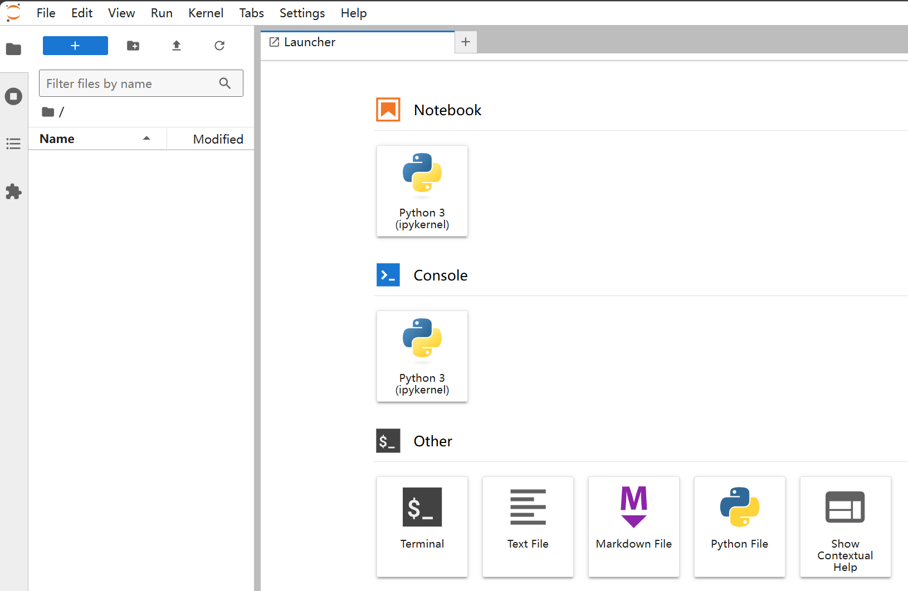
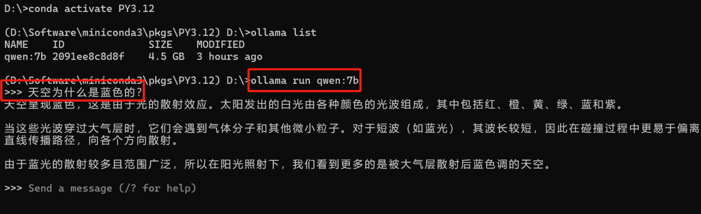

+++
slug = "2024062501"
date = "2024-06-25"
lastmod = "2024-06-25"
title = "大模型应用研发基础环境配置（Miniconda、Python、Jupyter Lab、Ollama等）"
description = "大模型应用研发的第一步，就是研发环境的配置，好的工具和环境是提升研发效率的关键，最基础的配置包括Miniconda包管理器、Python SDK、Jupyter Lab WebIDE、Node.js SDK、Ollama本地模型管理器、Ollama WebUI可视化对话界面等……"
image = "00.jpg"
tags = [ "AI", "Miniconda", "Python", "Jupyter Lab", "Ollama" ]
categories = [ "人工智能" ]
+++

老牛同学之前使用的**MacBook Pro**电脑配置有点旧（2015 年生产），跑大模型感觉有点吃力，操作起来有点卡顿，因此不得已捡起了尘封了快两年的**MateBook Pro**电脑（老牛同学其实不太喜欢用 Windows 电脑做研发工作）。此文注意是记录配置新电脑的内容，一来给老牛同学留个备忘，同时也特别希望能给其他朋友一些帮助。

配置一台方便用于大模型应用研发的新电脑，最基础的需要包括以下配置内容：

1. **Miniconda**包管理工具的安装和配置（兼容**pip**）
2. **Python**虚拟环境配置（指定 Python 版本且无需单独下载 Python 安装）
3. **Jupyter Lab** Python 研发 WebIDE 配置
4. **Ollama**本地大模型管理软件的配置和应用
5. **Ollama**大模型 Web 界面对话客户端配置和使用

## Miniconda 安装和配置

**Miniconda**和**pip**都是 Python 生态中的两个不同的包管理工具，它们都用于安装和管理 Python 包。但是在大模型相关的应用研发中，老牛同学推荐使用**Miniconda**的原因：

1. **包范围：** Miniconda 通过 Conda 可以管理 Python 以及非 Python 包，而 pip 只管理 Python 包。
2. **环境管理：** Miniconda 内置了环境管理功能，而 pip 需要与其他工具（如 virtualenv 或 venv）搭配使用以创建隔离的环境。
3. **包源：** pip 通常从 PyPI 下载包，而 Conda 从 Anaconda Repository 或其他自定义设置的通道下载。
4. **包格式：** Conda 使用自己的包格式(.conda 或.tar.bz2)，而 pip 使用 wheel 或源码形式。
5. **依赖解决：** Conda 在安装包时会考虑到系统级别的依赖和包之间的依赖关系，而 pip 主要解决 Python 级别的依赖。

在实际使用中，由于**Minionda**可以很好地处理复杂的依赖关系和环境管理，它通常是首选工具。但是，如果只需要安装纯 Python 包，使用**pip**可能会更加简单直接。

**第一步：** 下载地址：[https://docs.anaconda.com/miniconda/](https://docs.anaconda.com/miniconda)

根据操作系统，选择安装包，支持包括：Windows、MacOS 和 Linux 系统

**第二步：** 安装和配置：安装过程和普通软件没有两样，安装完成之后，我们配置 Python 环境：

老牛同学的安装目录是：`D:\Software\miniconda3`

因后面需要执行`conda`命令，因此提前把以下目录添加到**系统环境变量**中（变量名：`Path`）：

1. 安装目录：`D:\Software\miniconda3`
2. 脚本目录：`D:\Software\miniconda3\Scripts`
3. 依赖库目录：`D:\Software\miniconda3\Library\bin`

**第三步：** 设置 Conda 虚拟环境目录（**可选**）：默认情况下，虚拟环境内容在`C:\`盘，老牛同学 C 盘比较较小，就把它设置到`D:\`盘

打开 Termianl 终端，查看**Conda**基本信息：`conda info`

```shell
> conda info

     active environment : None
       user config file : C:\Users\obull\.condarc
 populated config files :
          conda version : 24.4.0
    conda-build version : not installed
         python version : 3.12.3.final.0
                 solver : libmamba (default)
       virtual packages : __archspec=1=x86_64_v3
                          __conda=24.4.0=0
                          __win=0=0
       base environment : D:\Software\miniconda3  (writable)
      conda av data dir : D:\Software\miniconda3\etc\conda
  conda av metadata url : None
           channel URLs : https://repo.anaconda.com/pkgs/main/win-64
                          https://repo.anaconda.com/pkgs/main/noarch
                          https://repo.anaconda.com/pkgs/r/win-64
                          https://repo.anaconda.com/pkgs/r/noarch
                          https://repo.anaconda.com/pkgs/msys2/win-64
                          https://repo.anaconda.com/pkgs/msys2/noarch
          package cache : D:\Software\miniconda3\pkgs
                          C:\Users\obull\.conda\pkgs
                          C:\Users\obull\AppData\Local\conda\conda\pkgs
       envs directories : D:\Software\miniconda3\envs
                          C:\Users\obull\.conda\envs
                          C:\Users\obull\AppData\Local\conda\conda\envs
               platform : win-64
             user-agent : conda/24.4.0 requests/2.31.0 CPython/3.12.3 Windows/11 Windows/10.0.22621 solver/libmamba conda-libmamba-solver/24.1.0 libmambapy/1.5.8 aau/0.4.4 c/. s/. e/.
          administrator : False
             netrc file : None
           offline mode : False
```

可以看到几个重要信息：

1. **Conda**配置文件：`C:\Users\obull\.condarc`
2. **Conda**包下载渠道：**channel URLs**列表几个地址
3. **Conda**包缓存目录：`D:\Software\miniconda3\pkgs`
4. **Conda**虚拟环境目录：`D:\Software\miniconda3\envs`

以上配置都是默认配置，其中包环境和虚拟环境目录比较占磁盘空间，可以设置为其他目录，同时下载渠道可以使用国内镜像以提升包的下载速度：

1. 打开配置文件：`C:\Users\obull\.condarc`
2. 若`.condarc`配置文件不存在，可以执行命令自动生成一个默认文件：`conda config --set show_channel_urls yes`
3. 打开`.condarc`配置，设置虚拟环境目录和：

```plaintext
envs_dirs:
  - D:/Software/miniconda3/pkgs
pkgs_dirs:
  - D:/Software/miniconda3/envs
show_channel_urls: true
channels:
  - https://mirrors.tuna.tsinghua.edu.cn/anaconda/cloud/pytorch/
  - https://mirrors.tuna.tsinghua.edu.cn/anaconda/cloud/msys2/
  - https://mirrors.tuna.tsinghua.edu.cn/anaconda/cloud/conda-forge/
  - https://mirrors.tuna.tsinghua.edu.cn/anaconda/pkgs/main/
  - https://mirrors.tuna.tsinghua.edu.cn/anaconda/pkgs/free/
  - defaults
custom_channels:
  conda-forge: https://mirrors.tuna.tsinghua.edu.cn/anaconda/cloud
  msys2: https://mirrors.tuna.tsinghua.edu.cn/anaconda/cloud
  bioconda: https://mirrors.tuna.tsinghua.edu.cn/anaconda/cloud
  menpo: https://mirrors.tuna.tsinghua.edu.cn/anaconda/cloud
  pytorch: https://mirrors.tuna.tsinghua.edu.cn/anaconda/cloud
  pytorch-lts: https://mirrors.tuna.tsinghua.edu.cn/anaconda/cloud
  simpleitk: https://mirrors.tuna.tsinghua.edu.cn/anaconda/cloud
```

保存配置文件之后，我们可以看到**Conda**信息的变化：`conda info`

**Conda**命令还有一些其他用法，比较常用的命令如下列表：

1. 查看**Conda**版本：`conda --version`
2. 更新**Conda**版本：`conda update conda`
3. 安装 Python 包（如安装`numpy`包）：`conda install numpy` 通过首选渠道下载包文件
4. 指定渠道安装 Python 包：`conda install conda-forge::numpy` 通过**conda-forge**渠道下载包文件
5. 安装 Python 包到指定的虚拟环境：`conda install --name PY2.7 matplotlib` 安装`matplotlib`包到指定的`PY2.7`虚拟环境

## Python 虚拟环境配置

**特别注意：** 有了**Miniconda**包管理工具，我们无需单独下载和安装 Python，可直接通过 Conda 安装对应的版本即可。

老牛同学创建一个名称为**PY3.12**的虚拟环境，使用 Python 版本为**3.12.3**：`conda create --name PY3.12 python=3.12.3`

新建虚拟环境需要初始化基础包（包括 Python SDK 等），基础包下载完成之后，可以通过命令查看虚拟环境列表：`conda info --envs`

```shell
> conda info --envs
base                     D:\Software\miniconda3
PY3.12                   D:\Software\miniconda3\pkgs\PY3.12
```

其中，`base`是**Conda**默认的虚拟环境，我们刚创建的`PY3.12`虚拟环境已经存在了！

## Python 虚拟环境使用

默认虚拟环境是`base`，我们可以激活和取消虚拟环境。若是首次使用，则需要执行`conda init`命令进行初始化：

1. 激活虚拟环境：`conda activate PY3.12`
2. 取消虚拟环境：`conda deactivate`（无需指定环境名）

```shell
C:\Users\obull>
C:\Users\obull>conda activate PY3.12

(D:\Software\miniconda3\pkgs\PY3.12) C:\Users\obull>
(D:\Software\miniconda3\pkgs\PY3.12) C:\Users\obull>conda deactivate

C:\Users\obull>
```

## Jupyter Lab 安装和配置（可选）

在 Python 研发 IDE 选择上，老牛同学推荐推荐使用**Jupyter Lab**，当然如果有**PyCharm**等 Python 开发工具，也是一个不错的选择：

1. **Jupyter Lab** 主要是为了数据科学、科学计算和教育而设计的。它支持交互式计算和数据可视化，非常适合探索性数据分析、机器学习、数值模拟等。
2. **Jupyter Lab** 提供了一个基于 Web 的用户界面，支持在浏览器中直接编写代码、运行分析，并查看结果。
3. **Jupyter Lab** 强调的是交互式编程和数据可视化。它允许用户逐段运行代码并即时查看输出，支持 Markdown 和富媒体，非常适合制作和展示研究结果。
4. **Jupyter Lab** 作为一个轻量级的 Web 应用，其启动速度快，但在处理大型数据集时，性能可能会受到浏览器和硬件资源的限制。
5. **Jupyter Lab** 特别适合做数据分析、数据科学教育、探索性研究和创建可分享的交互式报告。

**Jupyter Lab** IDE 可以通过**Conda**安装，其安装命令如下：

```shell
# 激活Python虚拟环境
conda activate PY3.12

# 安装Jupyter Lab（指定下载源）
conda install -c conda-forge jupyterlab
conda install -c conda-forge ipywidgets
```

**Jupyter Lab** IDE 成功安装之后，可以通过以下命令打开：

```shell
# 激活Python虚拟环境
conda activate PY3.12

# 切换到Jupyter目录（我们以后代码存放的目录）
cd ~/JupyterLab

# 启动Jupyter WebIDE
jupyter-lab .
```

浏览器自动打开了 Web IDE，或者自己打开：[http://localhost:8888/lab](http://localhost:8888/lab)



## Ollama 安装和使用

使用**Ollama**可以非常方便的管理本地大模型，目前主流大模型都支持**Ollama**，包括**Phi**、**Qwen**、**Llama**等，因此使用**Ollama**可以提升我们管理和使用大模型效率：

1. 下载并安装**Ollama**：[Ollama 官网](https://ollama.com/)（支持：Windows、Mac 和 Linux 系统）
2. 设置模型数据文件路径（可选）：默认情况下，模型文件存放在**C:盘**用户目录。我们可以通过**系统环境变量**设置成其他目录。**系统环境变量**名为：`OLLAMA_MODELS`，**系统环境变量**的值为新的目录（如老牛同学设置为：`D:\ModelSpace\Ollama`）
3. 下载并启动大模型，老牛同学以阿里的`Qwen2-7B`为例：`ollama run qwen:7B`

模型文件下载完成之后，自动就有了对话客户端：

```shell
D:\>conda activate PY3.12

(D:\Software\miniconda3\pkgs\PY3.12) D:\>ollama list
NAME    ID              SIZE    MODIFIED
qwen:7b 2091ee8c8d8f    4.5 GB  3 hours ago

(D:\Software\miniconda3\pkgs\PY3.12) D:\>ollama run qwen:7b
```



## Ollama Web 界面对话客户端

**Ollama**自带控制台聊天对话界面体验总归是不太好，接下来部署 Web 可视化聊天界面：

1. 下载并安装 Node.js 工具：[https://nodejs.org/zh-cn](https://nodejs.org/zh-cn)
2. 下载`ollama-webui`工程代码：`git clone https://github.com/ollama-webui/ollama-webui-lite ollama-webui`
3. 切换`ollama-webui`代码的目录：`cd ollama-webui`
4. 设置 Node.js 工具包镜像源（下载提速）：`npm config set registry http://mirrors.cloud.tencent.com/npm/`
5. 安装 Node.js 依赖的工具包：`npm install`
6. 最后，启动 Web 可视化界面：`npm run dev`


如果看到以上输出，代表 Web 可视化界面已经成功了！

浏览器打开 Web 可视化界面：[http://localhost:3000/](http://localhost:3000)

**Ollama**其他的命令工具：

```shell
# 查看当前Ollama的模型
ollama list

# 增量更新当前部署的模型
ollama pull qwen:7b

# 删除一个模型文件
ollama rm qwen:7b

# 复制一个模型
ollama cp qwen:7b Qwen-7B
```

**Ollama**API 结果返回

```shell
curl http://localhost:11434/api/generate -d '{
  "model": "qwen:7b",
  "prompt":"为什么天空是蓝色的？"
}'
```

**Ollama API**聊天对话

```shell
curl http://localhost:11434/api/chat -d '{
  "model": "qwen:7b",
  "messages": [
    { "role": "user", "content": "为什么天空是蓝色的？" }
  ]
}'
```

---

关注本公众号，我们共同学习进步 👇🏻👇🏻👇🏻


**Phi-3 开源大模型**

[Phi-3 模型手机部署教程（微软发布的可与 GPT-3.5 媲美的小模型）](https://mp.weixin.qq.com/s/bNxHM3B7HOLNvJtjwvt8iw)

**Qwen2-7B 开源大模型**

[Qwen2 阿里最强开源大模型（Qwen2-7B）本地部署、API 调用和 WebUI 对话机器人](https://mp.weixin.qq.com/s/u_Uw88dpQRgbtfI4_1OOwQ)

**Llama-3-8B 开源大模型**

[玩转 AI，笔记本电脑安装属于自己的 Llama 3 8B 大模型和对话客户端](https://mp.weixin.qq.com/s/MekCUJDhKzuUnoykkGoH2g)

[一文彻底整明白，基于 Ollama 工具的 LLM 大语言模型 Web 可视化对话机器人部署指南](https://mp.weixin.qq.com/s/2DVYO75h0o5EHN_K_GF4Eg)

[基于 Llama 3 搭建中文版（Llama3-Chinese-Chat）大模型对话聊天机器人](https://mp.weixin.qq.com/s/idcdIr8mMWDQ_iZU5r_UEQ)

**GLM-4-9B 开源大模型**

[本地部署 GLM-4-9B 清华智谱开源大模型方法和对话效果体验](https://mp.weixin.qq.com/s/g7lDfnRRGdrHqN7WGMSkAg)

**ChatTTS 文本转语音模型**

[ChatTTS 开源文本转语音模型本地部署、API 使用和搭建 WebUI 界面](https://mp.weixin.qq.com/s/rL3vyJ_xEj7GGoKaxUh8_A)

**Stable Diffusion 3 文生图模型**

[Stable Diffusion 3 文生图“开源英雄”大模型本地部署和使用教程，轻松实现 AI 绘图自由](https://mp.weixin.qq.com/s/Sax4z2k8Dvn82h15jf51Hw)

**大模型应用案例**

[借助 AI 大模型，三分钟原创一部儿童故事短视频（附完整操作步骤）](https://mp.weixin.qq.com/s/m_O2OSoXWLL0PJurLCdzng)

[高效编写大模型 Prompt 提示词，解锁 AI 无限创意潜能](https://mp.weixin.qq.com/s/gaLw3yP-oANvQyjRSkVjyw)

**Python 小游戏**

[AI 已来，我与 AI 一起用 Python 编写了一个消消乐小游戏](https://mp.weixin.qq.com/s/hv2tE-yot_H04HCezxQWXg)

[Python 游戏编程：一步步用 Python 打造经典贪吃蛇小游戏](https://mp.weixin.qq.com/s/tkTlt4rbFKQ73zudluPO1A)

---
