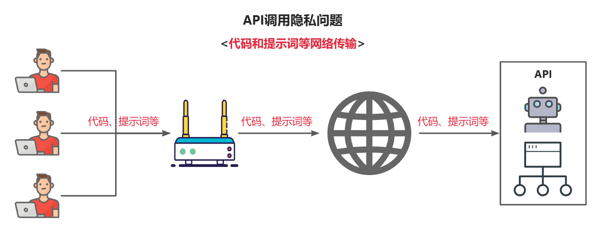
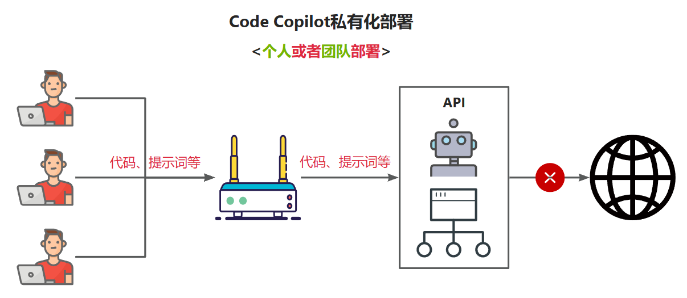
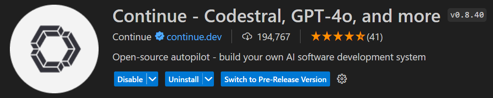
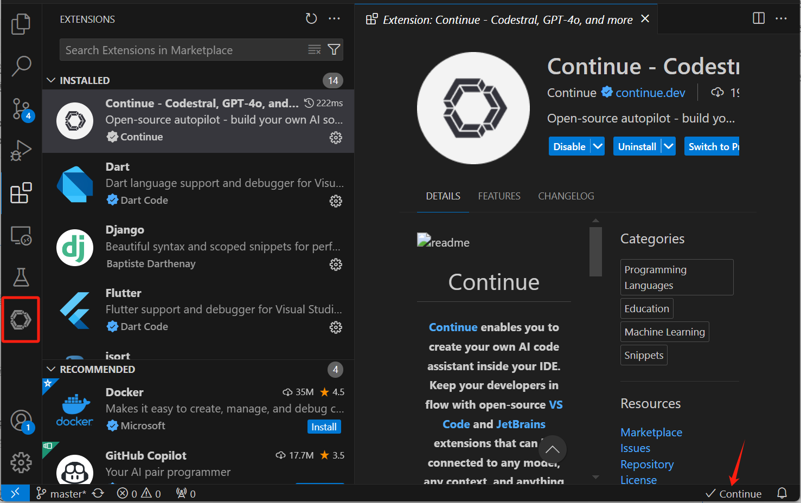
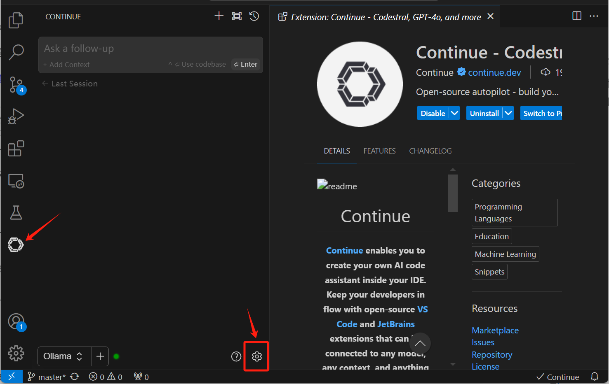
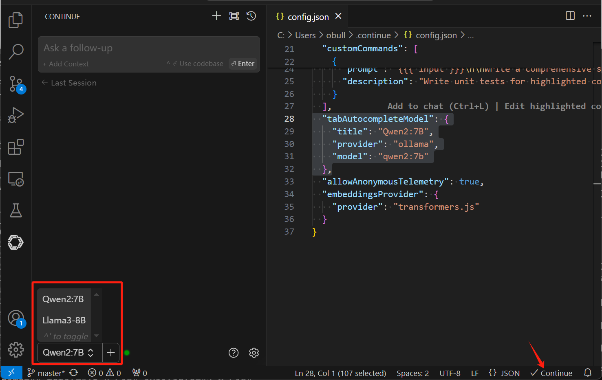
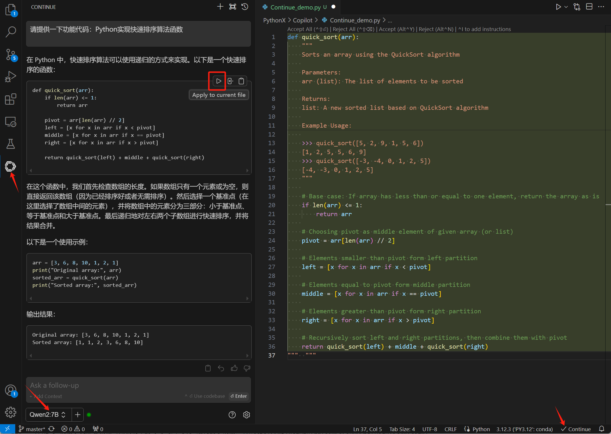
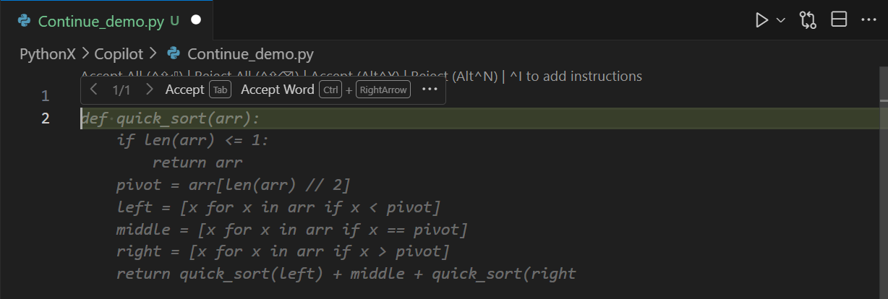
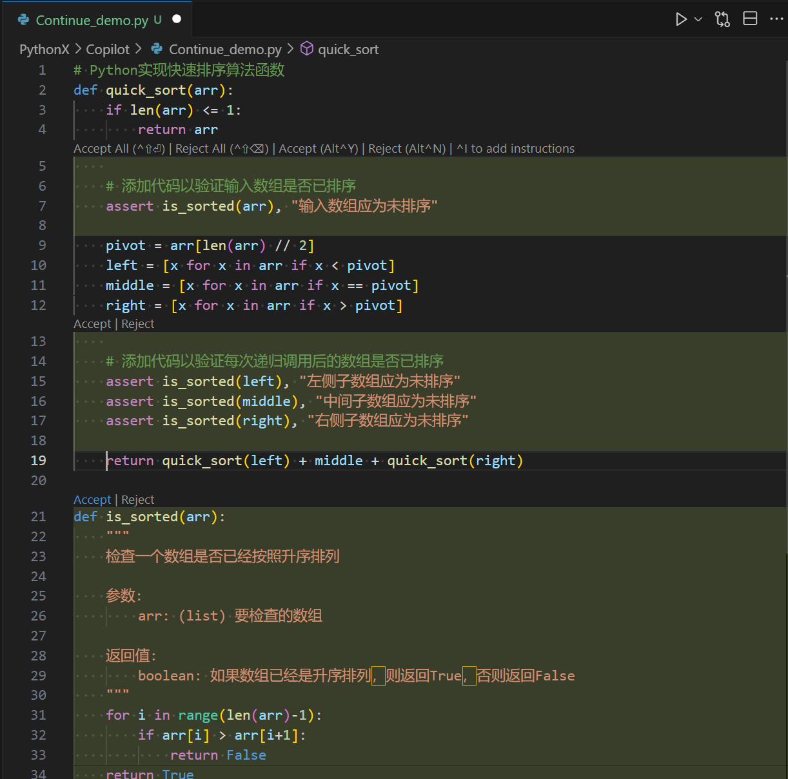

+++
slug = "2024062901"
date = "2024-06-29"
lastmod = "2024-06-29"
title = "使用Llama3/Qwen2等开源大模型，部署团队私有化Code Copilot和使用教程"
description = "代码辅助工具（Code Copilot）可以提高团队代码研发效率，能有效帮助产品快速上市抢占先发优势，但同时又需要保证代码和信息隐私，私有化Code Copilot是保护隐私的重要手段。老牛通过本文，详细介绍通过开源大模型，部署私有化Code Copilot和使用教程……"
image = "02.png"
tags = [ "AI", "Copilot", "Continue", "Qwen", "Ollama", "VS Code" ]
categories = [ "人工智能" ]
+++

目前市面上有不少基于大模型的 Code Copilot 产品，部分产品对于个人开发者来说可免费使用，比如阿里的**通义灵码**、百度的**文心快码**等。这些免费的产品均通过 API 的方式提供服务，因此调用时均必须**联网**、同时需要把**代码**、**提示词**等内容作为 API 的入参在网络中传输和 API 服务器中进行处理，这里就涉及到一个比较重要的问题：**隐私安全**



针对小团队私有保密项目、创新团队孵化新产品，隐私安全问题就显得格外重要。因此，团队内部部署私有的**Code Copilot**方案就应运而出了：



今天老牛同学和大家一起来使用**Qwen2-7**构建个人或者团队专属的私有化 **Code Copilot**，除了**代码生成**之外，还可以是支持 **AI 问答**、**代码解释**、**语言转换**、生成单元**测试用例**等功能。不但可以提高我们的研发效率，还可以保护我们的代码隐私。

## 第一步：部署私有的大模型（Qwen2-7B）

前面老牛同学介绍了本地部署大模型和使用教程，包括**Llama3-8B**、**Qwen2-7B**、**GLM4-9B**、和**Phi3**等。大家可以看一下之前的部署教程，老牛同学今天使用**Qwen2-7B**作为我们 Copilot 底层大模型，对于本文**Code Copilot**的部署和使用，其他大模型都是一样的，看大家的喜好，没有特殊要求。

老牛同学这里简单列一下部署教程：

**环境安装：** 主要是**Miniconda**包管理安装，参见教程，注意只需要安装**Miniconda**和**Python**即可，其他非必须：大模型应用研发基础环境配置（Miniconda、Python、Jupyter Lab、Ollama 等）：[https://mp.weixin.qq.com/s/P_ufvz4MWVSqv_VM-rJp9w](https://mp.weixin.qq.com/s/P_ufvz4MWVSqv_VM-rJp9w)

**Code Copilot**底层大模型的部署方式，老牛同学验证主要以下 2 种，任选一种即可：

**方式一** 基于 Ollama 部署：

1. 下载并安装**Ollama**本地模型管理软件（Windows/Mac/Linux 均支持）：[https://ollama.com/download](https://ollama.com/download)
2. 通过 Ollama 下载并启动大模型：`ollama run qwen2:7b`

通过以上 2 步，即完成了大模型的部署。特别注意的是：**GLM**系列大模型还不支持 Ollama 管理！因此如果你希望用 GLM 系列（如：**GLM4-9B**）大模型，那么请看方式二。

**方式二** 通过 Python 部署：通用方法，所有模型都支持，以下是老牛同学验证过的部署教程

1. **Phi3**：[Phi-3 模型手机部署教程（微软发布的可与 GPT-3.5 媲美的小模型）](https://mp.weixin.qq.com/s/bNxHM3B7HOLNvJtjwvt8iw)
2. **Qwen2-7B**：[Qwen2 阿里最强开源大模型（Qwen2-7B）本地部署、API 调用和 WebUI 对话机器人](https://mp.weixin.qq.com/s/u_Uw88dpQRgbtfI4_1OOwQ)
3. **Llama3-8B**：[玩转 AI，笔记本电脑安装属于自己的 Llama 3 8B 大模型和对话客户端](https://mp.weixin.qq.com/s/MekCUJDhKzuUnoykkGoH2g)
4. **GLM4-9B**：[本地部署 GLM-4-9B 清华智谱开源大模型方法和对话效果体验](https://mp.weixin.qq.com/s/g7lDfnRRGdrHqN7WGMSkAg)

## 第二步：IDE 安装和配置 Continue 插件

**Code Copilot Continue**是目前最受欢迎的插件之一，它插件的形式使用，目前支持**VS Code**和**JetBrains 全家桶**这 2 个主流 IDE 的扩展，可以在对应的插件市场中直接搜索**Continue**下载安装。**Continue**插件的一个最大优势在于它可以指定连接本地或者局域网内的大模型，所以对于信息安全高的项目，我们完全可以在本地或者局域网内部署大模型，然后用**Continue**插件连接使用，在提高开发生产效率同时保护了研发代码的隐私。目前**Continue**插件的社区活跃，GitHub 仓库已达**12K**星，插件版本更新频繁，越来越成熟。

因为老牛同学日常使用**VS Code**较多，因此下面的安装和配置，基于**VS Code**完成，**JetBrains**（如：PyCharm 等）的方式类同。

**安装 Continue 插件：** 插件管理器中，搜索**Continue**，点击安装，安装成功之后重启 IDE 即可。



**Continue 插件状态：** 安装成功并重启之后，可以看到**VS Code**的左侧多了一个**Continue**按钮。同时，右下角也多了一个**Continue**状态图标：**√ Continue**则代表**Continue**在 IDE 中生效了，**🚫Continue**则代表**Continue**在 IDE 未启用。



**配置 Continue 插件：** 点击左下角启用**Continue**插件，然后点击左侧的**Continue**按钮，可以看到一个对话界面，点击左下角**齿轮**形状的**配置**图标，则打开了一个 JSON 格式的配置文件，在这里可以配置**Continue**底层使用的大模型信息：



```json
{
  "models": [
    {
      "title": "Qwen2:7B",
      "provider": "ollama",
      "model": "qwen2:7b"
    },
    {
      "title": "Llama3-8B",
      "provider": "openai",
      "model": "Local-Model",
      "apiBase": "http://127.0.0.1:8000/v1",
      "apiKey": "EMPTY",
      "completionOptions": {
        "stop": [
          "<|eot_id|>"
        ]
      }
    }
  ],
  "customCommands": [
    {
      "name": "test",
      "prompt": "{{{ input }}}\n\nWrite a comprehensive set of unit tests for the selected code. It should setup, run tests that check for correctness including important edge cases, and teardown. Ensure that the tests are complete and sophisticated. Give the tests just as chat output, don't edit any file.",
      "description": "Write unit tests for highlighted code"
    }
  ],
  // "tabAutocompleteModel": {
  //   "title": "Qwen2:7B",
  //   "provider": "ollama",
  //   "model": "qwen2:7b"
  // },
  "tabAutocompleteModel": {
    "title": "Llama3-8B",
    "model": "Local-Model",
    "apiBase": "http://127.0.0.1:8000/v1",
    "provider": "openai",
    "apiKey": "EMPTY"
  },
  "allowAnonymousTelemetry": true,
  "embeddingsProvider": {
    "provider": "transformers.js"
  }
}
```

**Continue**插件的配置信息主要分为 3 块：

1. **models** 代表所有的模型列表：上面样例配置文件，老牛同学分别配置了基于**Ollama**部署的**Qwen2-7B**大模型和基于**OpenAI**客户端部署的**Llama3-7B**大模型（也就是涵盖了上面大模型的 2 种不同部署方式的不同配置方式）
2. **customCommands** 自定义给大模型的提示词格式，**input**代表输入内容（代码或者文本等），可以按照实际需求进行调整
3. **tabAutocompleteModel** 代码编写过程中，当按下代码生成快捷键时，**Continue**生成代码的大模型，从**models**列表里面指定一个即可，当然也可以设置一个其他的大模型（**注意：** 只能选择一个模型，上面样例配置注释掉了一个，在实际使用时需要删除掉，因为 JSON 不支持注释！）

## 第三步：使用 Code Copilot Continue 插件

首先，启动大模型（如：**Qwen2-7B**）；其次，点击 IDE 左下角图标，以启用**Continue**插件；然后，选择一个对话大模型（默认选中第 1 个大模型）：



**使用方式一：** 我们可以选择不同的大模型进行对话，相当于**Continue**插件提供了一个可视化对话客户端

**使用方式二：** 代码生成，也是本文的重点，下面老牛同学以**快速排序算法**为例，来如何利用**Continue**完成代码编写：

【**场景一：AI 对话代码同步**】

1. 使用大模型对话能力，写出快速排序算法代码，Prompt 提示词：**请提供一下功能代码：Python 实现快速排序算法函数**，大模型很好的实现了算法逻辑，并且给了很多的说明和解释
2. 选中快速排序算法函数的代码，然后按下`CTRL+Shift+L`快捷键，或者点击代码框右上角的**Apply to current file**按钮，Python 自动同步到了编辑器中了：



【**场景二：代码自动补全**】

1. 在编辑器中，只需要输入注释内容（不要按回车键）：`# Python实现快速排序算法函数`
2. 然后按下`CTRL+Shift+L`快捷键，然后在按下**回车键**，可以看到代码已经生成，可以按`Tab键`使用代码



【**场景三：增加单元测试代码**】

1. 在编辑器中，选中一段代码函数，然后按下`CTRL+I`快捷键
2. 然后，在弹出的**Ctrl+I**指令框中输入：`增加代码测试代码`，然后按下**回车键**，可以看到生成了测试用例代码




【**场景四：代码自动填充对话框**】

1. 在编辑器中，选中一段代码，然后按下`Ctrl+L`快捷键，代码**自动填充**到了左侧的对话框中
2. 可以在对话框中继续输入指令，如：`请解释一下这段代码`，然后按**回车键**提交大模型：


【**其他场景**】

1. 增加注释
2. 代码异常堆栈分析
3. …… 其他请大家补充

## 最后：

使用开源大模型作为团队的 Code Copilot 工具，可以提高团队的开发效率，同时也可以保护团队的代码隐私。虽然目前开源的 LLM 相比闭源商用的 LLM 还有一些差距，但是随着开源 LLM 的不断发展，相信两者的差距以后会越来越小。以上就是今天介绍的内容，希望对大家有所帮助。

---

关注本公众号，我们共同学习交流进步 👇🏻👇🏻👇🏻


**Phi-3 开源大模型**

[Phi-3 模型手机部署教程（微软发布的可与 GPT-3.5 媲美的小模型）](https://mp.weixin.qq.com/s/bNxHM3B7HOLNvJtjwvt8iw)

**Qwen2-7B 开源大模型**

[Qwen2 阿里最强开源大模型（Qwen2-7B）本地部署、API 调用和 WebUI 对话机器人](https://mp.weixin.qq.com/s/u_Uw88dpQRgbtfI4_1OOwQ)

**Llama-3-8B 开源大模型**

[玩转 AI，笔记本电脑安装属于自己的 Llama 3 8B 大模型和对话客户端](https://mp.weixin.qq.com/s/MekCUJDhKzuUnoykkGoH2g)

[一文彻底整明白，基于 Ollama 工具的 LLM 大语言模型 Web 可视化对话机器人部署指南](https://mp.weixin.qq.com/s/2DVYO75h0o5EHN_K_GF4Eg)

[基于 Llama 3 搭建中文版（Llama3-Chinese-Chat）大模型对话聊天机器人](https://mp.weixin.qq.com/s/idcdIr8mMWDQ_iZU5r_UEQ)

**GLM-4-9B 开源大模型**

[本地部署 GLM-4-9B 清华智谱开源大模型方法和对话效果体验](https://mp.weixin.qq.com/s/g7lDfnRRGdrHqN7WGMSkAg)

**ChatTTS 文本转语音模型**

[ChatTTS 开源文本转语音模型本地部署、API 使用和搭建 WebUI 界面](https://mp.weixin.qq.com/s/rL3vyJ_xEj7GGoKaxUh8_A)

**Stable Diffusion 3 文生图模型**

[Stable Diffusion 3 文生图“开源英雄”大模型本地部署和使用教程，轻松实现 AI 绘图自由](https://mp.weixin.qq.com/s/Sax4z2k8Dvn82h15jf51Hw)

**大模型应用案例**

[大模型应用研发基础环境配置（Miniconda、Python、Jupyter Lab、Ollama 等）](https://mp.weixin.qq.com/s/P_ufvz4MWVSqv_VM-rJp9w)

[借助 AI 大模型，三分钟原创一部儿童故事短视频（附完整操作步骤）](https://mp.weixin.qq.com/s/m_O2OSoXWLL0PJurLCdzng)

[高效编写大模型 Prompt 提示词，解锁 AI 无限创意潜能](https://mp.weixin.qq.com/s/gaLw3yP-oANvQyjRSkVjyw)

**Python 小游戏**

[AI 已来，我与 AI 一起用 Python 编写了一个消消乐小游戏](https://mp.weixin.qq.com/s/hv2tE-yot_H04HCezxQWXg)

[Python 游戏编程：一步步用 Python 打造经典贪吃蛇小游戏](https://mp.weixin.qq.com/s/tkTlt4rbFKQ73zudluPO1A)

---
