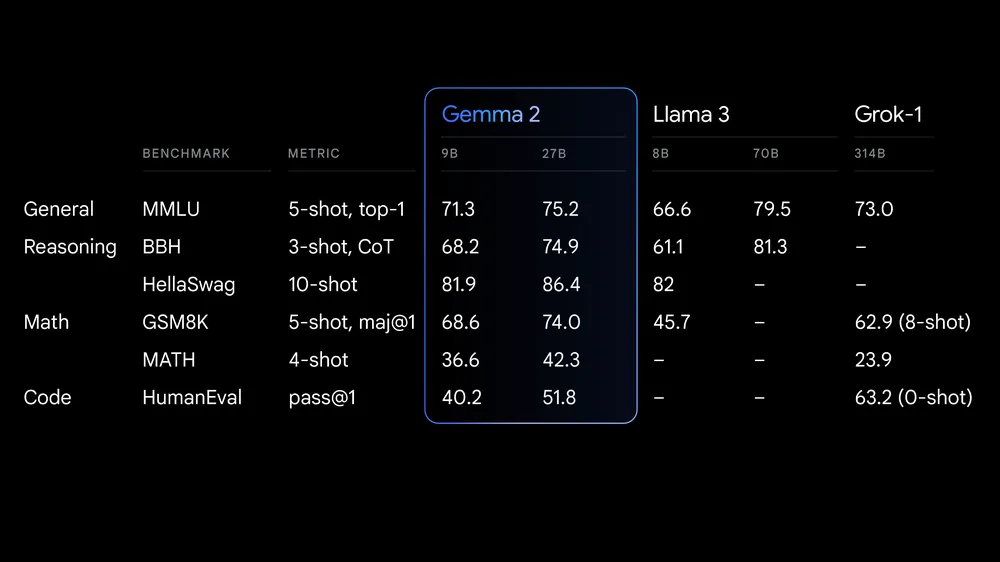
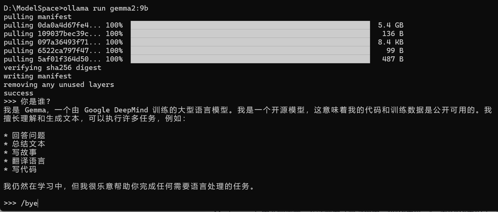
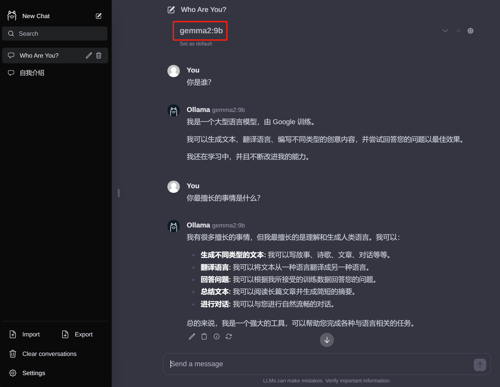
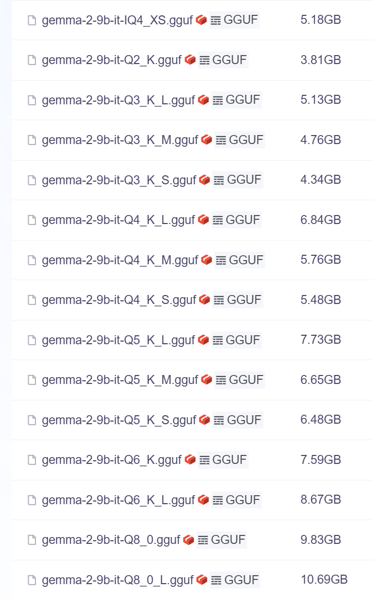
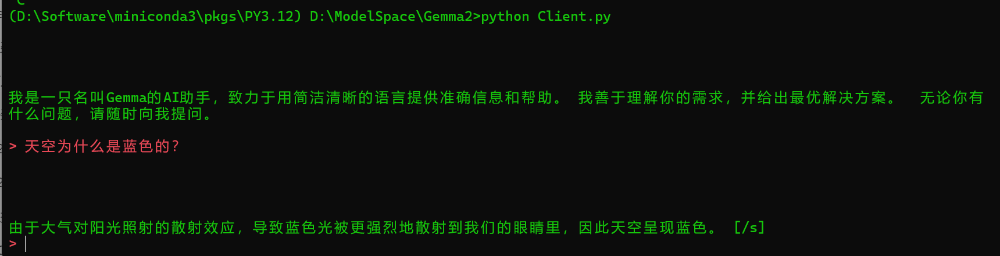

+++
slug = "2024070201"
date = "2024-07-02"
lastmod = "2024-07-02"
title = "Google 发布了最新的开源大模型 Gemma 2，本地快速部署和体验"
description = "Google 重磅发布了最新版大语言模型Gemma 2，其中 90亿 参数版本适合我们个人在笔记本本地部署，老牛同学通过本文和大家一起，通过2种方式快速部署和体验，当然这2种快速部署模型的方式，也同样适用于其他大模型……"
image = "00.png"
tags = [ "AI", "Gemma", "Ollama", "Google", "大模型" ]
categories = [ "人工智能" ]
+++

Gemma 2 是 Google 最新发布的开源大语言模型。它有两种规模：**90 亿**（9B）参数和 **270 亿**（27B）参数，分别具有**基础**（预训练）和**指令调优**版本，拥有 8K Tokens 的上下文长度：

- **Gemma-2-9b：** 90 亿参数基础模型版本
- **Gemma-2-9b-it：** 90 亿参数基础模型的指令调优版本
- **Gemma-2-27B：** 270 亿参数基础模型版本
- **Gemma-2-27B-it：** 270 亿参数基础模型的指令调优版本


Gemma 2 模型的训练数据量约为其第一代的两倍，总计 13 万亿 Tokens（270 亿模型）和 8 万亿 Tokens（90 亿模型）的网页数据（主要是英语）、代码和数学数据。同时，相比较第一代，Gemma 2 的推理性能更高、效率更高，并在安全性方面取得了重大进步。

**许可协议：** Gemma 2 与第一代使用相同的许可证，这是一个允许再分发、微调、商业用途和衍生作品的宽松许可证。

**性能优异：** Gemma 2 27B 版本在同规模级别中性能最佳，甚至比两倍于其尺寸的机型更具竞争力。9B 版本的性能在同类产品中也处于领先地位，超过了 Llama 3 8B 和其他同规模的开放模型。



其他关于 Gemma 2 的介绍信息，可以参见 Google 官方博客：[https://blog.google/technology/developers/google-gemma-2/](https://blog.google/technology/developers/google-gemma-2/)

Google 重磅发布产品，我们肯定需要体验以下。今天，老牛同学就和大家一起，分别通过 2 种方式在个人笔记本电脑本地部署和体验 **Gemma2-9B** 大模型。

## 方式一：通过 Ollama 部署大模型

关于 Ollama 是什么以及它的使用方式，老牛同学前面的博文中有介绍，本文不在赘述，感兴趣的朋友可以看一下之前的博文。

Ollama 管理和维护 Gemma 2 比较简单，主要流程如下：

1. 下载并安装 Ollama 软件（Windows/Linux/MacOS 均支持）：[https://ollama.com/download](https://ollama.com/download)
2. 通过 Ollama 下载并启动 Gemma 2 大模型：

```shell
ollama run gemma2:9b
```

模型文件大小为 **5.4GB** 左右，需要耐心等待模型下载完成。下载完成之后，Ollama 自动启动模型，就可以通过 Ollama 进行对话了：



如果觉得通过控制台的方式对话体验不好，可以部署 WebUI 的方式与模型对话。WebUI 的部署方式，可以参见老牛同学之前的博文：[https://mp.weixin.qq.com/s/P_ufvz4MWVSqv_VM-rJp9w](https://mp.weixin.qq.com/s/P_ufvz4MWVSqv_VM-rJp9w)，主要部署步骤：

1. 下载并安装 Node.js 工具：[https://nodejs.org/zh-cn](https://nodejs.org/zh-cn)
2. 下载`ollama-webui`工程代码：`git clone https://github.com/ollama-webui/ollama-webui-lite ollama-webui`
3. 切换`ollama-webui`代码的目录：`cd ollama-webui`
4. 设置 Node.js 工具包镜像源（下载提速）：`npm config set registry http://mirrors.cloud.tencent.com/npm/`
5. 安装 Node.js 依赖的工具包：`npm install`
6. 最后，启动 Web 可视化界面：`npm run dev`

然后，通过浏览器打开 WebUI 对话界面了：[http://localhost:3000/](http://localhost:3000/)



## 方式二：通过 GGUF 部署大模型

**GGUF**模型文件格式是为了快速推理和优化内存使用而设计的，支持更复杂的令牌化过程和特殊令牌处理，能更好地应对多样化的语言模型需求。**GGUF**就一个文件，也简化了模型交换和部署的过程，它对促进模型的普及和应用有着积极作用。

GGUF 模型文件列表：[https://modelscope.cn/models/LLM-Research/gemma-2-9b-it-GGUF/files](https://modelscope.cn/models/LLM-Research/gemma-2-9b-it-GGUF/files)



GGUF 模型文件名称格式，如`gemma-2-9b-it-Q5_K_M.gguf`等：

- **it**代表本模型是对基线模型进行了微调，用于更好地理解和生成遵循指令（instruction-following）的文本，以提供符合要求的响应

- **Q4/Q5 等**代表模型权重的量化位数（其中**Q**是**Quantization**的缩小，即量化），是一种模型压缩技术，用于减少模型大小，同时降低对计算资源的需求（特别是内存），但又尽量保持模型的性能；数字**4**或**5**则代表量化精度的位数（Q4 是 4 位，Q5 是 5 位等），精度越高模型体积和内存使用也会越大，但仍然远小于未量化的基线模型

- **K_M/K_S**代表了与注意力机制相关的特定配置，**K_M** 可能是指 Key 的 Mask，即用来屏蔽某些位置的键值对，防止它们在注意力计算中被考虑；而 **K_S** 可能是指 Key 的 Scale 或 Size，涉及到键向量缩放，这是在多头注意力机制中常见的操作，以稳定梯度

点击**下载**图标即可下载，由于文件较大，浏览器的下载容易过程容易终端，重试可继续下载（假设下载本地的文件名为：`Gemma-2-9B-it-Q5_K_M.gguf`）：

1. 打开一个终端窗口，切换到 GGUF 文件所在目录：`cd Gemma2`
2. 切换 Python 虚拟环境：`conda activate PY3.12`
3. 安装 Python 依赖包：

```shell
pip install llama-cpp-python
pip install openai
pip install uvicorn
pip install starlette
pip install fastapi
pip install sse_starlette
pip install starlette_context
pip install pydantic_settings
```

或者，我们也可以一把进行安装：`pip install -r requirements.txt`

```plaintext
# requirements.txt
llama-cpp-python
openai
uvicorn
starlette
fastapi
sse_starlette
starlette_context
pydantic_settings
```

最后，启动大模型：

```shell
# 启动Llama大模型
python -m llama_cpp.server --host 0.0.0.0 --model ./Gemma-2-9B-it-Q5_K_M.gguf --n_ctx 2048
```

模型启动命令中，`n_ctx 2048`代表单次回话最大 Token 数量。

启动成功，我们应该看到类似如下的信息：`INFO: Uvicorn running on http://0.0.0.0:8000 (Press CTRL+C to quit)`


**最后一步：** 我们使用 **openai** 库在个人电脑上快速搭建客户端。Python 客户端代码（`Client.py`）如下：

1. 我们使用**OpenAI**接口来与 Gemma 交互，上面启动模型的最后，我们看到服务端 IP 是本地，端口是**8000**
2. 接着，我们使用 2 条信息对历史记录进行初始化：第一个条是**系统信息**，第二个条是要求模型自我介绍的**用户提示**，为了避免长篇大论，我这里限制了回答的长度和字数
3. 接下来，通过`>`提示符等待用户（即我们）输入，输入`bye`、`quit`和`exit`任意一个即代表退出客户端

```python
# Client.py
from openai import OpenAI

# 注意服务端端口，因为是本地，所以不需要api_key
client = OpenAI(base_url="http://localhost:8000/v1", api_key="EMPTY")

# 对话历史：设定系统角色是一个只能助理，同时提交“自我介绍”问题
history = [
    {"role": "system", "content": "你是一个智能助理，你的回答总是正确的、有用的和内容非常精简."},
    {"role": "user", "content": "请用中文进行自我介绍，要求不能超过5句话，总字数不超过100个字。"},
]
print("\033[92;1m")

# 首次自我介绍完毕，接下来是等代码我们的提示
while True:
    completion = client.chat.completions.create(
        model="local-model",
        messages=history,
        temperature=0.7,
        stream=True,
    )

    new_message = {"role": "assistant", "content": ""}

    for chunk in completion:
        if chunk.choices[0].delta.content:
            print(chunk.choices[0].delta.content, end="", flush=True)
            new_message["content"] += chunk.choices[0].delta.content

    history.append(new_message)
    print("\033[91;1m")

    userinput = input("> ")
    if userinput.lower() in ["bye", "quit", "exit"]: # 我们输入bye/quit/exit等均退出客户端
        print("\033[0mBYE BYE!")
        break

    history.append({"role": "user", "content": userinput})
    print("\033[92;1m")
```

我们打开一个 Terminal 终端，运行客户端：`python Client.py`



恭喜你，第二种方式也部署成功了，我们可以愉快地与大模型进行对话了，包括把大模型作为我们 **Code Copilot** 的底层模型，部署我们团队私有化的 **Code Copilot** 的底层模型，部署我们团队私有化的了：[个人或团队私有化 Code Copilot 部署和使用教程](https://mp.weixin.qq.com/s/vt1EXVWtwm6ltZVYtB4-Tg)

## 总结

以上是老牛同学和大家一起采用 2 种方式快速部署 Gemma 2 大模型，这 2 种方式是同样的方式，同样适用于其他大模型。

相对来说，Ollama 部署配置比较简单，目前常见的大模型均支持 Ollama 推理协议（包括：Qwen/Lllama/Phi 等大模型），推荐使用；同时，GGUF 部署方式仅需要依赖一个模型文件，使用 Llama.cpp 框架进行推理，依赖也少部署也很方便，同样推荐使用。如何抉择，就看我们自己喜好了！

Gemma 2 在内最近发布的开源大模型，可以看出当前大模型研究的趋势，即探索用更轻量级、更实用的模型来实现更强的性能，并确保易部署，以更好地满足不同用户的需求。老牛同学觉得未来低成本、定制化的垂直场景小模型将会越来越多，也会越来越受欢迎！

---

关注本公众号，我们共同学习交流进步 👇🏻👇🏻👇🏻


**Phi-3 开源大模型**

[Phi-3 模型手机部署教程（微软发布的可与 GPT-3.5 媲美的小模型）](https://mp.weixin.qq.com/s/bNxHM3B7HOLNvJtjwvt8iw)

**Qwen2-7B 开源大模型**

[Qwen2 阿里最强开源大模型（Qwen2-7B）本地部署、API 调用和 WebUI 对话机器人](https://mp.weixin.qq.com/s/u_Uw88dpQRgbtfI4_1OOwQ)

**Llama-3-8B 开源大模型**

[玩转 AI，笔记本电脑安装属于自己的 Llama 3 8B 大模型和对话客户端](https://mp.weixin.qq.com/s/MekCUJDhKzuUnoykkGoH2g)

[一文彻底整明白，基于 Ollama 工具的 LLM 大语言模型 Web 可视化对话机器人部署指南](https://mp.weixin.qq.com/s/2DVYO75h0o5EHN_K_GF4Eg)

[基于 Llama 3 搭建中文版（Llama3-Chinese-Chat）大模型对话聊天机器人](https://mp.weixin.qq.com/s/idcdIr8mMWDQ_iZU5r_UEQ)

**GLM-4-9B 开源大模型**

[本地部署 GLM-4-9B 清华智谱开源大模型方法和对话效果体验](https://mp.weixin.qq.com/s/g7lDfnRRGdrHqN7WGMSkAg)

**ChatTTS 文本转语音模型**

[ChatTTS 开源文本转语音模型本地部署、API 使用和搭建 WebUI 界面](https://mp.weixin.qq.com/s/rL3vyJ_xEj7GGoKaxUh8_A)

**Stable Diffusion 3 文生图模型**

[Stable Diffusion 3 文生图“开源英雄”大模型本地部署和使用教程，轻松实现 AI 绘图自由](https://mp.weixin.qq.com/s/Sax4z2k8Dvn82h15jf51Hw)

**大模型应用实战**

[使用 Llama3/Qwen2 等开源大模型，部署团队私有化 Code Copilot 和使用教程](https://mp.weixin.qq.com/s/vt1EXVWtwm6ltZVYtB4-Tg)

[大模型应用研发基础环境配置（Miniconda、Python、Jupyter Lab、Ollama 等）](https://mp.weixin.qq.com/s/P_ufvz4MWVSqv_VM-rJp9w)

[借助 AI 大模型，三分钟原创一部儿童故事短视频（附完整操作步骤）](https://mp.weixin.qq.com/s/m_O2OSoXWLL0PJurLCdzng)

[高效编写大模型 Prompt 提示词，解锁 AI 无限创意潜能](https://mp.weixin.qq.com/s/gaLw3yP-oANvQyjRSkVjyw)

**Python 小游戏**

[AI 已来，我与 AI 一起用 Python 编写了一个消消乐小游戏](https://mp.weixin.qq.com/s/hv2tE-yot_H04HCezxQWXg)

[Python 游戏编程：一步步用 Python 打造经典贪吃蛇小游戏](https://mp.weixin.qq.com/s/tkTlt4rbFKQ73zudluPO1A)

---
