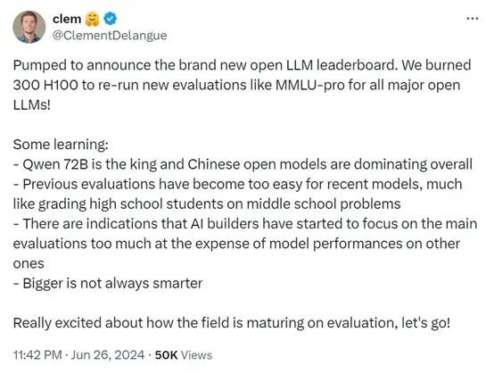
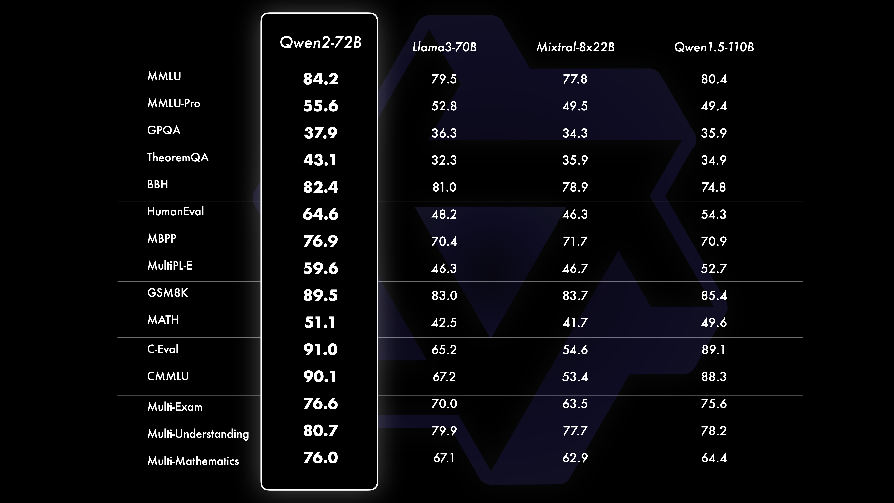
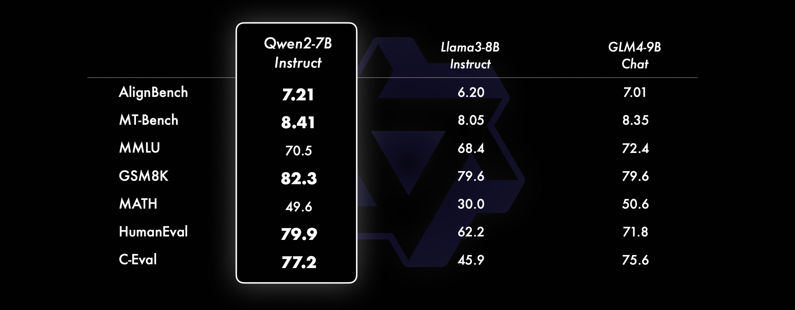

+++
slug = "2024070401"
date = "2024-07-04"
lastmod = "2024-07-04"
title = "阿里Qwen2-72B大模型已是开源榜的王者，为什么还要推出其他参数模型，被其他模型打榜？"
description = ""
image = "00.png"
tags = [ "AI", "Qwen", "大模型" ]
categories = [ "人工智能" ]
+++

6 月 27 日，全球知名的开源平台 Hugging Face 的联合创始人兼首席执行官 Clem 在社交平台激动宣布，阿里 **Qwen2-72B** 成为了开源模型排行榜的王者。

这是一件大好事，说明了我们在大模型领域从先前的追赶，逐渐走向了领导，未来完全有可能会引领着全球开源模型的发展潮流，这是我们的骄傲！

不过话说回来，**Qwen2** 序列有 5 个参数版本，分别是 **Qwen2-0.5B**、**Qwen2-1.5B**、**Qwen2-7B**、**Qwen2-57B-A14B** 和 **Qwen2-72B**。本次排行榜第一的是 **Qwen2-72B** 参数版本，那么其他参数版本的评测结果如何呢？老牛同学查看了 Qwen2 的官方文档，有一些比较评测：[https://qwenlm.github.io/zh/blog/qwen2/](https://qwenlm.github.io/zh/blog/qwen2/)

**Qwen2-72B** 如 Clem 宣布一样，包括自然语言理解、知识、代码、数学及多语言等多项能力上均显著超越当前领先的模型：

而 **Qwen2-7B** 模型在**自然语言理解** 和 **数学** 方面均有点落后了：

其他参数版本没有评测结果，老牛同学猜测是其他参与评测的大模型没有对等的参数版本，因此无法进行比较，或者评测结果不相上下，也就没有必要把结果放出来了。

## 老牛同学的疑问

那么老牛同学的问题来了：**阿里 Qwen2-72B 大模型已是开源榜的王者，为什么还要推出其他参数模型，被其他模型打榜？**

老牛同学带着这个问题咨询了几位同事，也问了**Qwen2-7B**大模型，他们的回答均有一定道理，但老牛同学猜测，Qwen 这么做的核心目的只有一个：**丰富 Qwen 大模型生态**

【**原因一：** 训练 Qwen 中小尺寸参数成本并不高】

以阿里人才储备、基础设施和高层 **All in AI** 的决心和投入，训练 Qwen 中小参数版本的模型应该不是什么难事，顺手即可做的事情，相对来说成本并不高

【**原因二：** 快速进行迭代和模型参数优化演进】

通过快速发布多个尺寸的模型，可以让内外部的技术究人员分析和探索模型的参数规模与性能之间的关系，以便能找到最佳的平衡点，最终不断推动优化和演进 Qwen 系列大模型

【**原因三：** 构建和丰富 Qwen 大模型全场景生态】

老牛同学认为这是最为**关键**的一点，开源不是目的、打榜争第一也应该不是目的，它们都只是**构建并丰富生态**的策略！老牛同学和大家一起来回顾 2 件事情：

**Windows XP 生态：** 我们还记得二零零几年的时候，满大街 **Windows XP** 的盗版操作系统吗？操作系统激活竟然也可以是路边打印小店的一大业务。那么，盗版这么多，微软为什么不管管？是他不知道吗，还是根本管不了？老牛同学觉得都不是，应该是微软故意放任不管：微软要赚的是企业的钱，包括 IT 公司、电脑厂商等，个人的钱不太好赚；同时，使用 Windows 操作系统的个人越多，会带动 Windows 生态发展（使用技巧和攻略、研发各种各样的软件等），进而能拉动更多使用的个人，同时对于企业来说意味着熟练的工人也越多，企业为降低成本，自然就愿意采购 Windows 正版授权，最终还是微软赚钱了！

**阿里云 OS 生态：** 老牛同学在二零一几年的时候看到过一张图片，图片展示的是当时的阿里 CTO 王坚博士在报告台上擦眼泪。传说是王坚博士在给一群高管做汇报，汇报内容是阿里云和手机操作系统（云 OS）。云计算在当时的中国没有任何一家企业有布局，但王坚博士坚信云计算和云 OS 的未来，他作为第一个吃螃蟹的人，在技术研发和基础设施等方面的投入成本都非常巨大，受到了一些高管和投资人的质疑，因此他边做着汇报边流着委屈的流泪。辛亏当时马老师力排众议，支持王坚博士的想法，如今阿里云在国内技术或市场上称第二，应该没有其他云能自信的称第一了。

反观 **云 OS** 我们几乎感知不到了，很大一个原因是 **没有生态**：云 OS 曾经和国内的一些手机厂商合作推出过一些手机品牌（如 **小辣椒**、**大黄蜂**等），和比较大的厂商 **宏基** 的合作新闻发布会，后者也因 Google Android 的压力不得不放弃合作。Google 对云 OS 抄袭 Android 的 API 代码的状告一直不断。老牛同时当时咨询过一位负责云 OS 短信模块的技术同学，为什么云 OS 的 API 需要和 Android 保持一致，是技术能力不够吗？技术同学告诉老牛同学，操作系统都能研发出来，API 并没有什么技术难度，但是如果 API 不能和 Android 保持一致，那么已有的 Android APP 将无法接入，所以必须要兼容保持一致，否则没有了 Android 的生态，操作系统要推广就难于登天了。

如今，**云 OS** 虽然没有成为手机操作系统，但它却在车载（斑马网络）、智能家居（电视、天猫精灵等）等 OS 中大放异彩。

而 Qwen 系列大模型的 **Qwen2-0.5B**和**Qwen2-1.5B**可在智能家居推理；**Qwen2-7B**可用于个人、小团队等部署推理，个人业务不断发展，就可能购买云服务器部署，小团队业务进一步发展，也完全有可能购买 Qwen 推理服务，最终形成完美的闭环（感觉和**Windows XP**有那么一点点类似）。

## 最后：纯属老牛同学个人观点，请慎喷

以上观点纯属老牛同学个人的猜测，若有不合理之处，欢迎留言讨论，若有冒犯之处，请联系老牛同学删除此文，非常感谢！

---

关注本公众号，我们共同学习交流进步 👇🏻👇🏻👇🏻

**开源大模型**

[本地部署 GLM-4-9B 清华智谱开源大模型方法和对话效果体验](https://mp.weixin.qq.com/s/g7lDfnRRGdrHqN7WGMSkAg)

[Phi-3 模型手机部署教程（微软发布的可与 GPT-3.5 媲美的小模型）](https://mp.weixin.qq.com/s/bNxHM3B7HOLNvJtjwvt8iw)

[Qwen2 阿里最强开源大模型（Qwen2-7B）本地部署、API 调用和 WebUI 对话机器人](https://mp.weixin.qq.com/s/u_Uw88dpQRgbtfI4_1OOwQ)

[玩转 AI，笔记本电脑安装属于自己的 Llama 3 8B 大模型和对话客户端](https://mp.weixin.qq.com/s/MekCUJDhKzuUnoykkGoH2g)

[一文彻底整明白，基于 Ollama 工具的 LLM 大语言模型 Web 可视化对话机器人部署指南](https://mp.weixin.qq.com/s/2DVYO75h0o5EHN_K_GF4Eg)

[基于 Llama 3 搭建中文版（Llama3-Chinese-Chat）大模型对话聊天机器人](https://mp.weixin.qq.com/s/idcdIr8mMWDQ_iZU5r_UEQ)

[Google 发布了最新的开源大模型 Gemma 2，本地快速部署和体验](https://mp.weixin.qq.com/s/6C_YqZ2SQh0C1_631keVeg)

**ChatTTS 文本转语音模型**

[ChatTTS 开源文本转语音模型本地部署、API 使用和搭建 WebUI 界面](https://mp.weixin.qq.com/s/rL3vyJ_xEj7GGoKaxUh8_A)

**Stable Diffusion 3 文生图模型**

[Stable Diffusion 3 文生图“开源英雄”大模型本地部署和使用教程，轻松实现 AI 绘图自由](https://mp.weixin.qq.com/s/Sax4z2k8Dvn82h15jf51Hw)

**大模型应用实战**

[使用 Llama3/Qwen2 等开源大模型，部署团队私有化 Code Copilot 和使用教程](https://mp.weixin.qq.com/s/vt1EXVWtwm6ltZVYtB4-Tg)

[大模型应用研发基础环境配置（Miniconda、Python、Jupyter Lab、Ollama 等）](https://mp.weixin.qq.com/s/P_ufvz4MWVSqv_VM-rJp9w)

[借助 AI 大模型，三分钟原创一部儿童故事短视频（附完整操作步骤）](https://mp.weixin.qq.com/s/m_O2OSoXWLL0PJurLCdzng)

[高效编写大模型 Prompt 提示词，解锁 AI 无限创意潜能](https://mp.weixin.qq.com/s/gaLw3yP-oANvQyjRSkVjyw)

**Python 小游戏**

[AI 已来，我与 AI 一起用 Python 编写了一个消消乐小游戏](https://mp.weixin.qq.com/s/hv2tE-yot_H04HCezxQWXg)

[Python 游戏编程：一步步用 Python 打造经典贪吃蛇小游戏](https://mp.weixin.qq.com/s/tkTlt4rbFKQ73zudluPO1A)

---
