+++
slug = "2024070601"
date = "2024-07-06"
lastmod = "2024-07-06"
title = "基于Qwen2/Lllama3等大模型，部署团队私有化RAG知识库系统的详细教程（Docker+AnythingLLM）"
description = "大语言模型在垂直细分领域存在知识局限、幻觉、数据安全等一些问题，可通过RAG（检索增强生成）方案来解决。本文基于AnythingLLM框架，搭建团队私有知识库系统，并进行使用和验证，RAG系统在保留输出的有效性同时，还保留了创造性……"
image = "00.png"
tags = [ "AI", "Qwen", "RAG", "AnythingLLM", "Docker" ]
categories = [ "人工智能" ]
+++

自 ChatGPT 发布以来，大型语言模型（Large Language Model，**LLM**，大模型）得到了飞速发展，它在处理复杂任务、增强自然语言理解和生成类人文本等方面的能力让人惊叹，几乎各行各业均可从中获益。

然而，在一些垂直领域，这些开源或闭源的通用基础大模型也暴露了一些问题，主要体现在以下 3 个方面：

1. **知识的局限性：** 大模型的知识源于训练数据，目前主流大模型（如：通义千问、文心一言等）的训练数据基本来源于网络公开的数据。因此，非公开的、离线的、实时的数据大模型是无法获取到（如：团队内部实时业务数据、私有的文档资料等），这些数据相关的知识也就无从具备。
2. **幻觉问题：** 大模型生成人类文本底层原理是基于概率（目前还无法证明大模型有意识），所以它有时候会**一本正经地胡说八道**，特别是在不具备某方面的知识情况下。当我们也因缺乏这方面知识而咨询大模型时，大模型的幻觉问题会各我们造成很多困扰，因为我们也无法区分其输出的正确性。
3. **数据的安全性：** 对于个人、创新团队、企业来说，**数据安全**至关重要，老牛同学相信没有谁会愿意承担数据泄露的风险，把自己内部私有数据上传到第三方平台进行模型训练。这是一个矛盾：我们既要借助通用大模型能力，又要保障数据的安全性！

为了解决以上通用大模型问题，**检索增强生成**（Retrieval-Augmented Generation，**RAG**）方案就应运而生了：

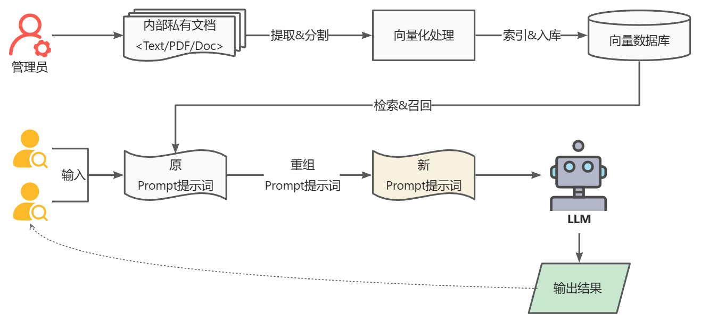

**RAG** 的主要流程主要包含以下 2 个阶段：

1. **数据准备阶段：** 管理员将内部私有数据向量化后入库的过程，**向量化**是一个将文本数据转化为向量矩阵的过程，该过程会直接影响到后续检索的效果；**入库**即将向量数据构建索引，并存储到向量数据库的过程。
2. **用户应用阶段：** 根据用户的 Prompt 提示词，通过检索召回与 Prompt 提示词相关联的知识，并融入到原 Prompt 提示词中，作为大模型的输入 Prompt 提示词，通用大模型因此生成相应的输出。

从上面 RAG 方案我们可以看出，通过与通用大模型相结合，我们可搭建团队私有的内部本地知识库，并能有效的解决通用大模型存在的**知识局限性**、**幻觉问题**和**隐私数据安全**等问题。

目前市面上已经有多个开源 RAG 框架，老牛同学将选择**AnythingLLM**框架（**16.8K ☆**，[https://github.com/Mintplex-Labs/anything-llm](https://github.com/Mintplex-Labs/anything-llm)）与大家一起来部署我们自己或者团队内部的本地知识库。整个部署过程将涉及以下几个方面：

1. **环境准备：** **AnythingLLM**框架推荐使用 Docker 部署，因此我们需要提前把 Docker 安装和配置好
2. **大模型准备：** 老牛同学继续使用**Qwen2-7B**大模型，大家可以根据自己实际情况选择，无特殊要求
3. **RAG 部署和使用：** 即 AnythingLLM 安装和配置，并最终使用我们大家的 RAG 系统

## 环境准备：Windows 打开虚拟化功能（Hyper-V 和 WSL）

**友情提示：** 老牛同学用的是 Windows 操作系统，因此下面是 Windows 的配置方式。

安装 Docker 需要用到虚拟化，因此需要 Windows 系统打开**Hyper-V**和**WSL 子系统**功能。如果是 **Windows 11 家庭版**，默认并没有安装**Hyper-V**功能，可以通过以下方式进行安装：

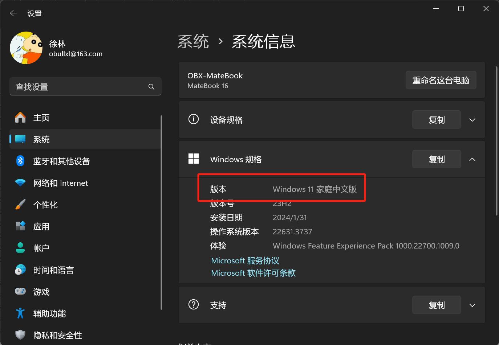

【第一步（**家庭版**）：安装 Hyper-V 依赖包】

1. 新建一个 txt 临时文本，并复制以下代码并保存，之后把该临时文件重命名为`Hyper-V.bat`
2. **右键**以管理员方式运行`Hyper-V.bat`，本代码自动安装相关包，完成之后输入`Y`重启电脑后即可

```shell
pushd "%~dp0"
dir /b %SystemRoot%\servicing\Packages\*Hyper-V*.mum >hyper-v.txt
for /f %%i in ('findstr /i . hyper-v.txt 2^>nul') do dism /online /norestart /add-package:"%SystemRoot%\servicing\Packages\%%i"
del hyper-v.txt
Dism /online /enable-feature /featurename:Microsoft-Hyper-V-All /LimitAccess /ALL
```

【第二步：开启虚拟化功能】

首先，打开 Windows 功能（即：控制面板）：

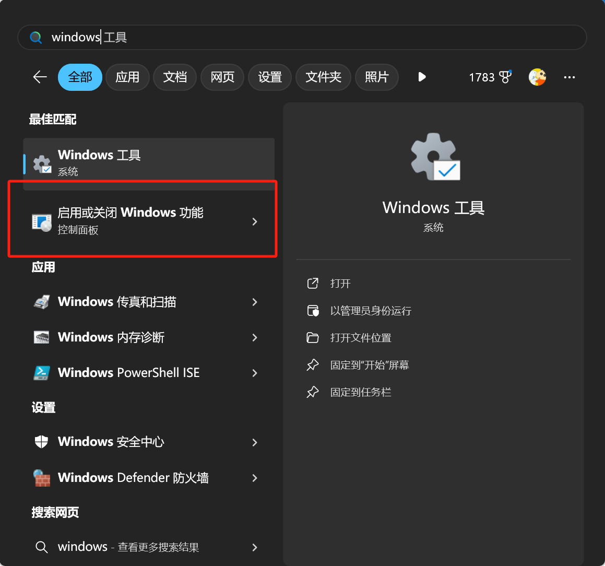

然后，勾选以下 3 个选项（**Hyper-V**、**适用于 Linux 的 Windows 子系统**和**虚拟机平台**），打开虚拟化功能：

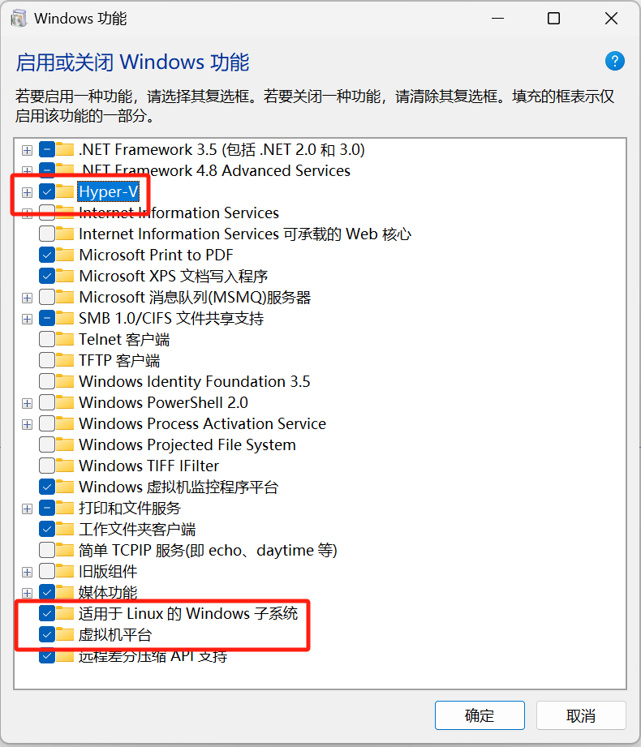

点击**确定**之后重启电脑即可！

## 环境准备：Docker 安装和配置

Docker 安装和配置主要包含以下 2 个步骤：

【第一步：下载 Docker 软件】

下载和安装 Docker 软件：[https://www.docker.com](https://www.docker.com)

如果大家和老牛同学一样，出现无法打开 Docker 官网的情况，则也可以通过以下方式下载最新的版本：

1. 打开 Docker 中文网站：[https://docker.github.net.cn/desktop/release-notes/](https://docker.github.net.cn/desktop/release-notes/)
2. 选择对应的安装软件，如果直接点击下载，可能还是无法下载。可以右键复制下载链接，然后通过**迅雷**进行下载（老牛同学亲测有效）

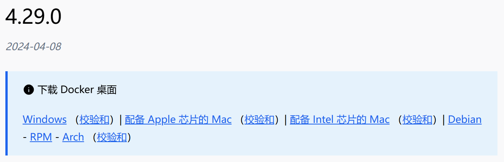

【第二步；Docker 安装和配置】

下载完成之后，安装过程与普通的软件没有区别，安装完成之后需要注销电脑：


登录操作系统之后，需要**Accept**同意 Docker 协议条款，然后注册登录或者**Continue without signing in**直接跳过，打开 Docker 软件。

**设置镜像源：** 点击右上角**齿轮**设置按钮，选择**Docker Engine**，打开设置页面，输入 Docker 镜像文件加速器地址：

```json
"registry-mirrors": [
    "https://docker.registry.cyou",
    "https://mirror.baidubce.com"
  ]
```

如果以上加速器地址不可用，可以使用阿里云个人私有的地址：[https://cr.console.aliyun.com/cn-hangzhou/instances/mirrors](https://cr.console.aliyun.com/cn-hangzhou/instances/mirrors)

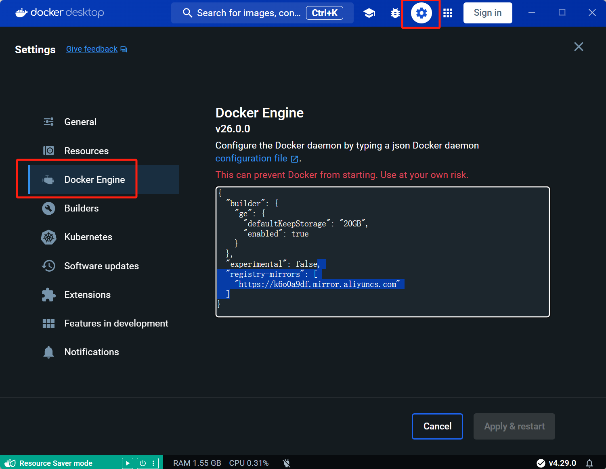

点击**Apply & Restart**按钮即可！

## AnythingLLM 安装和配置

接下来，我们开始安装和部署**AnythingLLM**框架，包含以下 3 步：

【**第一步：** 下载和启动 AnythingLLM 镜像】

```shell
docker pull mintplexlabs/anythingllm
```

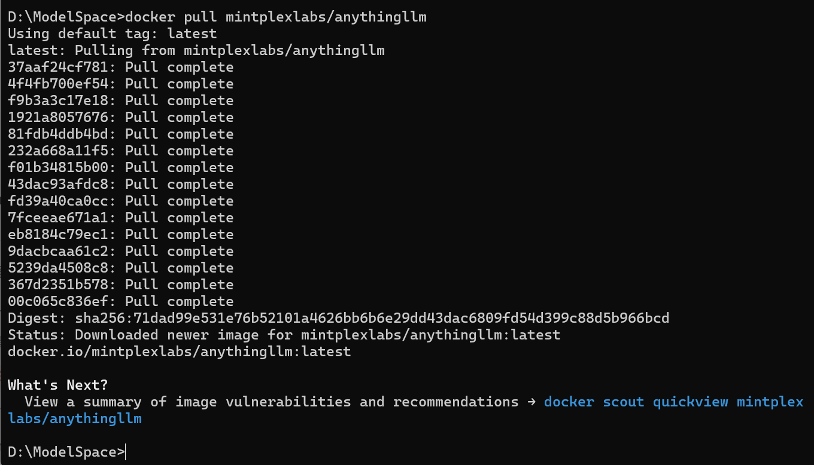

可以通过以下命令，查看当前 Docker 的镜像列表：

```shell
>docker images
REPOSITORY                 TAG       IMAGE ID       CREATED      SIZE
mintplexlabs/anythingllm   latest    d950fa3b8011   2 days ago   2.94GB
```

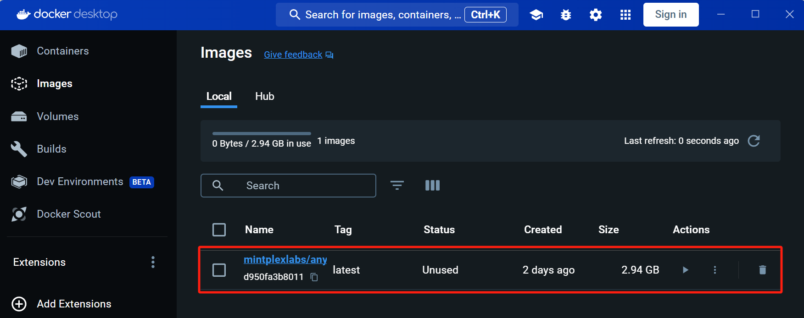


【**第二步：** 启动 AnythingLLM 框架】

**Windows 系统：** AnythingLLM 镜像挂载和启动命令（因为命令有多行，需要通过**PowerShell**执行）：

```shell
# Run this in powershell terminal
$env:STORAGE_LOCATION="$HOME\Documents\anythingllm"; `
If(!(Test-Path $env:STORAGE_LOCATION)) {New-Item $env:STORAGE_LOCATION -ItemType Directory}; `
If(!(Test-Path "$env:STORAGE_LOCATION\.env")) {New-Item "$env:STORAGE_LOCATION\.env" -ItemType File}; `
docker run -d -p 3001:3001 `
--cap-add SYS_ADMIN `
-v "$env:STORAGE_LOCATION`:/app/server/storage" `
-v "$env:STORAGE_LOCATION\.env:/app/server/.env" `
-e STORAGE_DIR="/app/server/storage" `
mintplexlabs/anythingllm;
```

或者，**Linux/MacOS 系统：** AnythingLLM 镜像挂载和启动命令：

```shell
export STORAGE_LOCATION=$HOME/anythingllm && \
mkdir -p $STORAGE_LOCATION && \
touch "$STORAGE_LOCATION/.env" && \
docker run -d -p 3001:3001 \
--cap-add SYS_ADMIN \
-v ${STORAGE_LOCATION}:/app/server/storage \
-v ${STORAGE_LOCATION}/.env:/app/server/.env \
-e STORAGE_DIR="/app/server/storage" \
mintplexlabs/anythingllm
```

启动完成，通过浏览器打开**AnythingLLM**界面：[http://localhost:3001](http://localhost:3001)

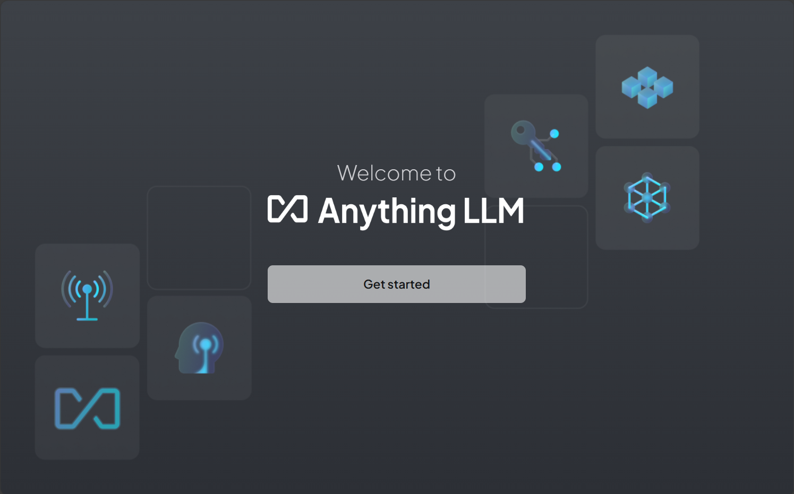

【**第三步：** 配置 AnythingLLM】

点击**Get started** 按钮，进入**LLM 选择**页面。老牛同学在前面文章中，分别介绍了大模型通过**Ollama**和**OpenAI**这 2 种主要的部署方式（包括：**Llama3**、**Qwen2**、**Gemma2**等）。

老牛同学在这里选择**Ollama**方式，如果大家重新设置了端口号，则需要看下 Ollama URL 端口号是否正确，默认值为：`http://host.docker.internal:11434`

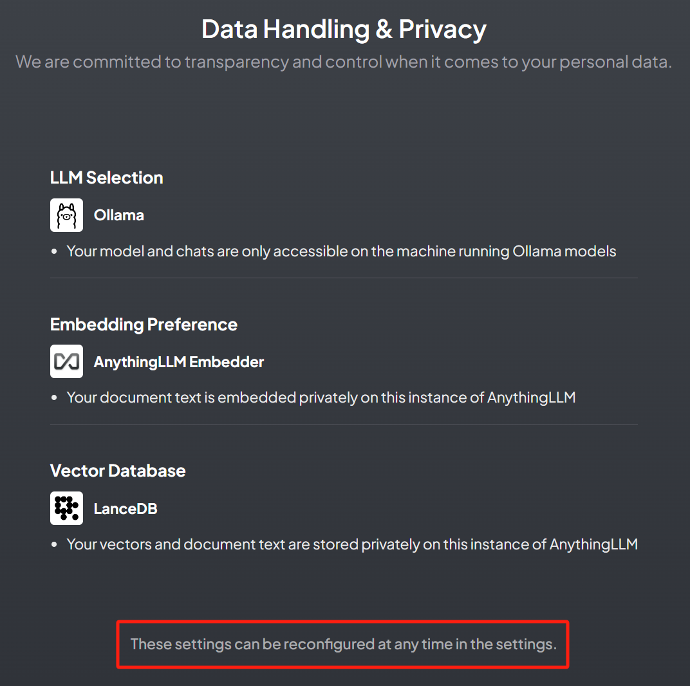

AnythingLLM 设置确认，包括：大模型提供方、词嵌入和向量数据库，这些配置后续还可以修改。

最后，创建一个工作区，老牛同学设置的名称为：`RAG-ClassmateWX`

## AnythingLLM 导入数据和使用

上一步配置完成之后，无需任何其他配置，就可以和大模型对话聊天了，和通过其他客户端与大模型对话没有区别。接下来，我们需要导入我们内部私有数据，并进行验证。

【第一步：导入内部数据】

我们在电脑本地新建一个 txt 文件，文件名为：`为什么个人、团队等均有必要部署私有化的RAG知识库系统.txt`，文件内容就是本文的开头内容：

```plaintext
自ChatGPT发布以来，大型语言模型（Large Language Model，LLM，大模型）得到了飞速发展，它在解决复杂任务、增强自然语言理解和生成类人文本等方面的能力让人惊叹，几乎各行各业均可从中获益。

然而，在一些垂直领域，这些开源或闭源的通用的基础大模型也暴露了一些问题，主要有以下3个方面：

1. **知识的局限性：** 大模型的知识源于训练数据，目前主流大模型（如：通义千问、文心一言等）的训练数据基本来源于网络公开的数据。因此，非公开的、离线的、实时的数据大模型是无法获取到（如：团队内部实时业务数据、私有的文档资料等），这些数据相关的知识也就无从具备。
2. **幻觉问题：** 大模型生成人类文本底层原理是基于概率（目前还无法证明大模型有意识），所以它有时候会**一本正经地胡说八道**，特别是在不具备某方面的知识情况下。当我们也因缺乏这方面知识而咨询大模型时，大模型的幻觉问题会各我们造成很多困扰，因为我们也无法区分其输出的正确性。
3. **数据的安全性：** 对于个人、创新团队、企业来说，**数据安全**至关重要，老牛同学相信没有谁会愿意承担数据泄露的风险，把自己内部私有数据上传到第三方平台进行模型训练。这是一个矛盾：我们既要借助通用大模型能力，又要保障数据的安全性！

为了解决以上3个大模型通用问题，**检索增强生成**（Retrieval-Augmented Generation，**RAG**）方案就应运而生了！
```

首先，点击**RAG-ClassmateWX**工作空间右边的**上传**图标，准备上传本 txt 文件：

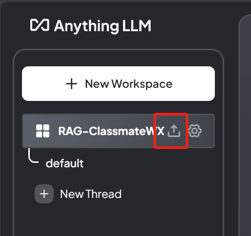

然后，点击 txt 文件并上传，并点击**Move to workspace**导入到工作空间：

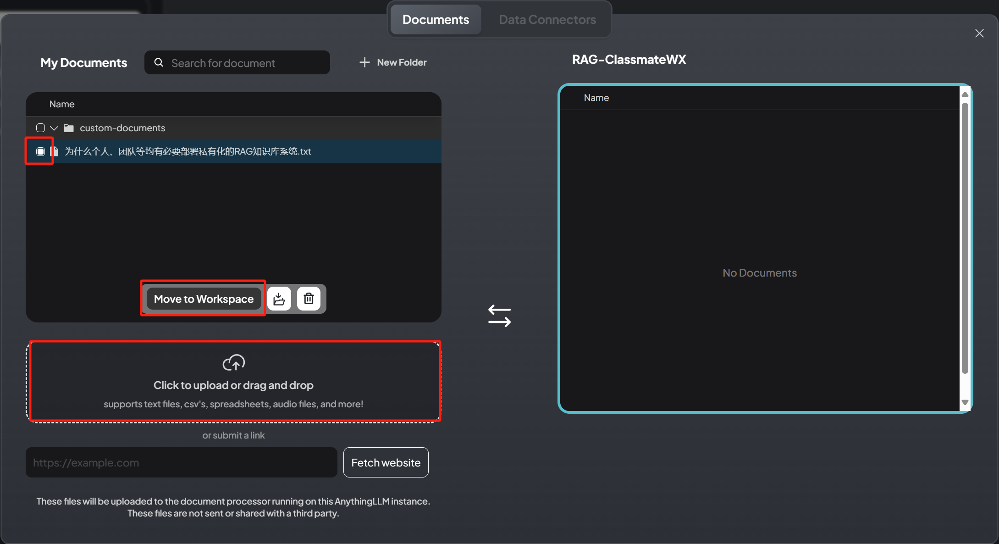

最后，点击**Save and Embed**完成 txt 文本文件数据准备步骤（导入、向量化和入库等）。

【第二步：内部数据使用和验证】

回到主界面，输入刚才 txt 内部文件名：**为什么个人、团队等均有必要部署私有化的 RAG 知识库系统**

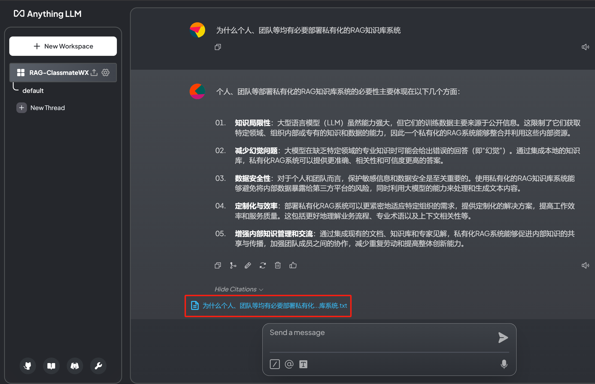

RAG 的回答感觉比我原文要好多了，大模型在引用了内部数据的同时，还展示自己的创造性！

同时，老牛同学用同样的问题，咨询 AnythingLLM 的底层模型，结果就比较普通通用了，大家可以对比看下：

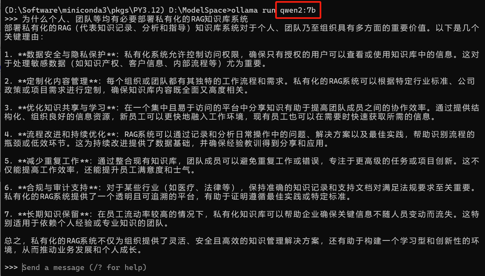

## 总结和问题

和我们之前的大模型部署和应用过程相比，基于 AnythingLLM 的 RAG 实现整个部署过程比较繁琐，包括环境准备、Docker 安装和配置、AnythingLLM 配置等。然而，AnythingLLM 的使用过程却相对比较简单，我们只需要上传我们内部数据文件，AnythingLLM 框架屏蔽了中间的数据提取分割、向量化处理、向量索引和入库、检索召回和重组 Prompt 提示词等过程。

同时，我们通过构建本地知识库，做了一个简单的测试验证，测试结果表明，在使用 RAG 的情况下，大模型的回答结果更加有效、更符合我们期望，同时具备了一定的创造性！

老牛同学最后提个问题：检索召唤的过程，能否使用搜索引擎（如：Elastic Search）代替？欢迎大家留言讨论，我们共同学习进步！

---

关注本公众号，我们共同学习交流进步 👇🏻👇🏻👇🏻


[使用 Llama3/Qwen2 等开源大模型，部署团队私有化 Code Copilot 和使用教程](https://mp.weixin.qq.com/s/vt1EXVWtwm6ltZVYtB4-Tg)

[本地部署 GLM-4-9B 清华智谱开源大模型方法和对话效果体验](https://mp.weixin.qq.com/s/g7lDfnRRGdrHqN7WGMSkAg)

[玩转 AI，笔记本电脑安装属于自己的 Llama 3 8B 大模型和对话客户端](https://mp.weixin.qq.com/s/MekCUJDhKzuUnoykkGoH2g)

[ChatTTS 开源文本转语音模型本地部署、API 使用和搭建 WebUI 界面](https://mp.weixin.qq.com/s/rL3vyJ_xEj7GGoKaxUh8_A)

---
