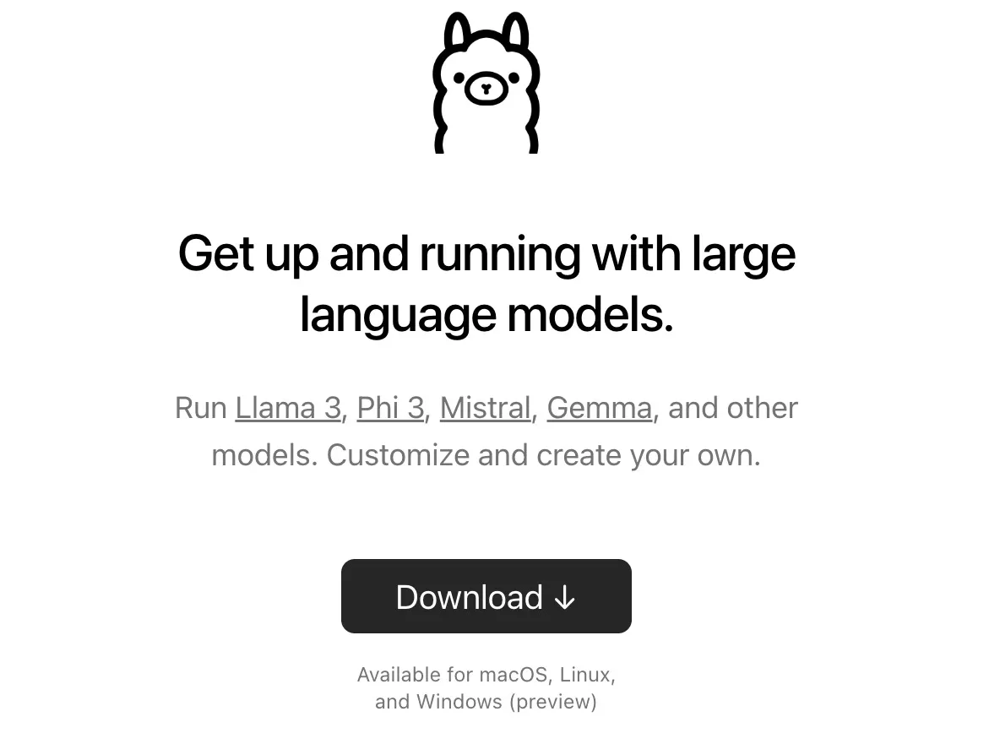
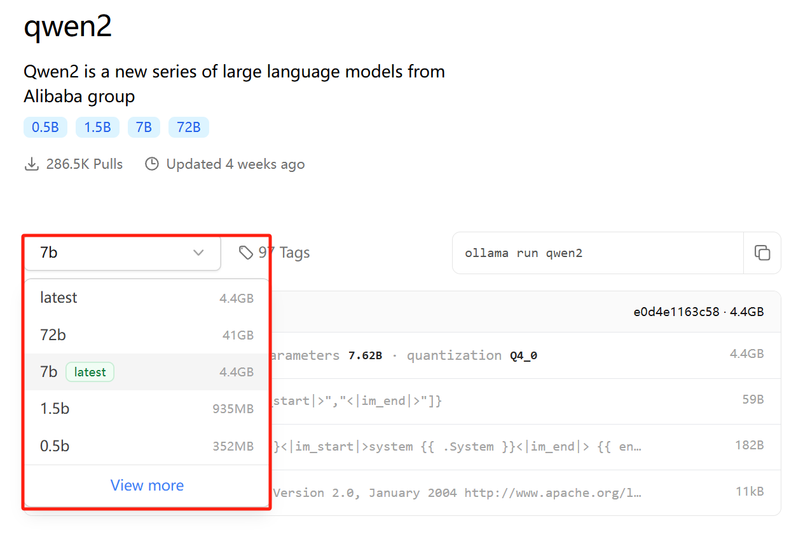
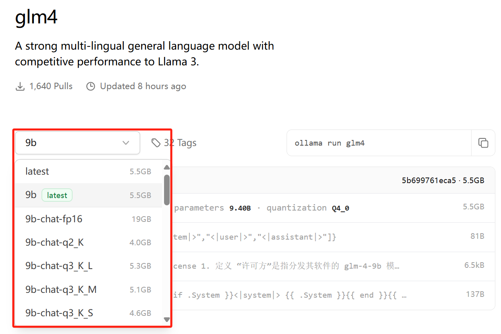
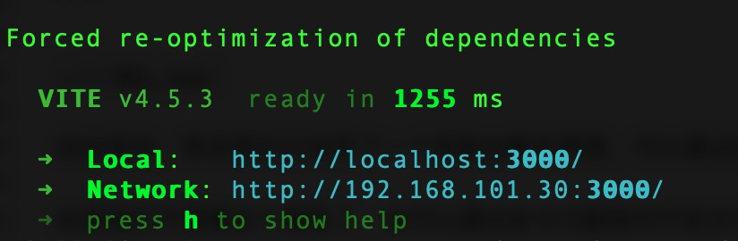
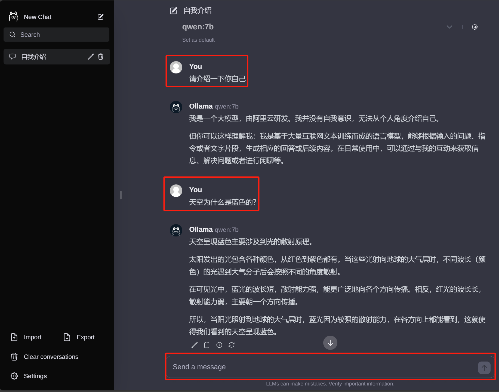

+++
slug = "2024071001"
date = "2024-07-10"
lastmod = "2024-07-10"
title = "Ollama完整教程：本地LLM管理、WebUI对话、Python/Java客户端API应用"
description = "Ollama可以非常方便的管理和部署我们本地大语言模型，老牛同学希望通过本文对Ollama进行一次详细介绍，包括本地大模型管理和使用、WebUI对话界面部署、通过Python和Java使用Ollama的API接口等……"
image = "00.png"
tags = [ "AI", "Ollama" ]
categories = [ "人工智能" ]
+++

老牛同学在前面有关大模型应用的文章中，多次使用了**Ollama**来管理和部署本地大模型（包括：**Qwen2**、**Llama3**、**Phi3**、**Gemma2**等），但对**Ollama**这个非常方便管理本地大模型的软件的介绍却很少。

目前，清华和智谱 AI 联合发布开源的**GLM4-9B**大模型也能支持**Ollama**进行本地部署了（[本地部署 GLM-4-9B 清华智谱开源大模型方法和对话效果体验](https://mp.weixin.qq.com/s/g7lDfnRRGdrHqN7WGMSkAg)），**Ollama**支持的大模型越多越普及，对于的应用也就越多。为了降低大家查阅资料等学习时间，老牛同学今天尝试着对 Ollama 进行一次详细完整介绍。毕竟老牛同学也在不断学习中，若有疏漏或者错误之处，还请各位朋友多多指正，谢谢大家。

本文将分为以下章节对 Ollama 进行介绍：

1. Ollama 基本介绍，它的作用是什么
2. Ollama 软件安装、一些常用的系统参数设置
3. Ollama 管理本地已有大模型（包括终端对话界面）
4. Ollama 导入模型到本地的三种方式：直接从 Ollama 远程仓库拉取、通过 GGUF 模型权重文件导入到本地、通过 safetensors 模型权限文件导入到本地
5. 基于 WebUI 部署 Ollama 可视化对话界面
6. Ollama 客户端 API 应用，包括 Python API 和 Java API 接口应用

## Ollama 是什么，它与 Llama 有什么关系？

**Ollama**官网：[https://ollama.com/](https://ollama.com)，官方网站的介绍就一句话：**Get up and running with large language models.** （开始使用大语言模型。）

**Ollama**是一个开源的 LLM（大型语言模型）服务工具，用于简化在本地运行大语言模型、降低使用大语言模型的门槛，使得大模型的开发者、研究人员和爱好者能够在本地环境快速实验、管理和部署最新大语言模型，包括如**Qwen2**、**Llama3**、**Phi3**、**Gemma2**等开源的大型语言模型。

**Ollama**支持的大语言模型列表，可通过搜索模型名称查看：[https://ollama.com/library](https://ollama.com/library)

**Ollama**官方 GitHub 源代码仓库：[https://github.com/ollama/ollama/](https://github.com/ollama/ollama)

**Llama**是 Meta 公司开源的备受欢迎的一个通用大语言模型，和其他大模型一样，**Llama**可以通过**Ollama**进行管理部署和推理等。

因此，`Ollama`与`Llama`的关系：`Llama`是大语言模型，而`Ollama`是大语言模型（不限于`Llama`模型）便捷的管理和运维工具，它们只是名字后面部分恰巧相同而已！



## Ollama 安装和常用系统参数设置

在官网首页，我们可以直接下载**Ollama**安装程序（支持 Windows/MacOS/Linux）：[https://ollama.com/](https://ollama.com)

**Ollama**的安装过程，与安装其他普通软件并没有什么两样，安装完成之后，有几个常用的系统**环境变量**参数建议进行设置：

1. **OLLAMA_MODELS**：模型文件存放目录，默认目录为当前用户目录（Windows 目录：`C:\Users%username%.ollama\models`，MacOS 目录：`~/.ollama/models`，Linux 目录：`/usr/share/ollama/.ollama/models`），如果是 Windows 系统**建议修改**（如：D:\OllamaModels），避免 C 盘空间吃紧
2. **OLLAMA_HOST**：Ollama 服务监听的网络地址，默认为**127.0.0.1**，如果允许其他电脑访问 Ollama（如：局域网中的其他电脑），**建议设置**成**0.0.0.0**，从而允许其他网络访问
3. **OLLAMA_PORT**：Ollama 服务监听的默认端口，默认为**11434**，如果端口有冲突，可以修改设置成其他端口（如：**8080**等）
4. **OLLAMA_ORIGINS**：HTTP 客户端请求来源，半角逗号分隔列表，若本地使用无严格要求，可以设置成星号，代表不受限制
5. **OLLAMA_KEEP_ALIVE**：大模型加载到内存中后的存活时间，默认为**5m**即 5 分钟（如：纯数字如 300 代表 300 秒，0 代表处理请求响应后立即卸载模型，任何负数则表示一直存活）；我们可设置成**24h**，即模型在内存中保持 24 小时，提高访问速度
6. **OLLAMA_NUM_PARALLEL**：请求处理并发数量，默认为**1**，即单并发串行处理请求，可根据实际情况进行调整
7. **OLLAMA_MAX_QUEUE**：请求队列长度，默认值为**512**，可以根据情况设置，超过队列长度请求被抛弃
8. **OLLAMA_DEBUG**：输出 Debug 日志标识，应用研发阶段可以设置成**1**，即输出详细日志信息，便于排查问题
9. **OLLAMA_MAX_LOADED_MODELS**：最多同时加载到内存中模型的数量，默认为**1**，即只能有 1 个模型在内存中

## Ollama 管理本地已有大模型

【展示本地大模型列表：`ollama list`】

```shell
>ollama list
NAME            ID              SIZE    MODIFIED
gemma2:9b       c19987e1e6e2    5.4 GB  7 days ago
qwen2:7b        e0d4e1163c58    4.4 GB  10 days ago
```

可以看到，老牛同学本地有 2 个大模型，它们的名称（**NAME**）分别为**gemma2:9b**和**qwen2:7b**。

【删除单个本地大模型：`ollama rm 本地模型名称`】

```shell
>ollama rm gemma2:9b
deleted 'gemma2:9b'

>ollama list
NAME            ID              SIZE    MODIFIED
qwen2:7b        e0d4e1163c58    4.4 GB  10 days ago
```

老牛同学通过`rm`命令删除了**gemma2:9b**大模型之后，再次通过`list`命令查看，本地只有**qwen2:7b**一个大模型了。

【启动本地模型：`ollama run 本地模型名`】

```shell
>ollama run qwen2:0.5b
>>>
```

启动成功之后，就可以通过终端对话界面进行对话了（本命令下面也会讲到，其他详细暂且忽略）

【查看本地运行中模型列表：`ollama ps`】

```shell
>ollama ps
NAME            ID              SIZE    PROCESSOR       UNTIL
qwen2:0.5b      6f48b936a09f    693 MB  100% CPU        4 minutes from now
```

通过`ps`命名可以看到，老牛同学本地**qwen2:0.5b**大模型正在运行中。

【复制本地大模型：`ollama cp 本地存在的模型名 新复制模型名`】

```shell
>ollama cp qwen2:0.5b Qwen2-0.5B
copied 'qwen2:0.5b' to 'Qwen2-0.5B'

>ollama list
NAME                    ID              SIZE    MODIFIED
Qwen2-0.5B:latest       6f48b936a09f    352 MB  4 seconds ago
qwen2:0.5b              6f48b936a09f    352 MB  29 minutes ago
qwen2:7b                e0d4e1163c58    4.4 GB  10 days ago
```

上面`cp`命令，老牛同学把本地**qwen2:0.5b**复制了一份，新模型名为**Qwen2-0.5B**

下面老牛同学介绍三种通过 Ollama 下载到本地大模型方式：

1. 方式一：直接通过 Ollama 远程仓库下载，这是最直接的方式，也是最推荐、最常用的方式
2. 方式二：如果已经有 GGUF 模型权重文件了，不想重新下载，也可以通过 Ollama 把该文件直接导入到本地（不推荐、不常用）
3. 方式三：如果已经有 safetensors 模型权重文件，也不想重新下载，也可以通过 Ollama 把该文件直接导入到本地（不推荐、不常用）

## 方式一：Ollama 从远程仓库下载大模型到本地

【下载或者更新本地大模型：`ollama pull 本地/远程仓库模型名称`】

本`pull`命令从 Ollama 远程仓库完整下载或增量更新模型文件，模型名称**格式**为：**模型名称:参数规格**；如`ollama pull qwen2:0.5b` 则代表从 Ollama 仓库下载**qwen2**大模型的**0.5b**参数规格大模型文件到本地磁盘：



如果参数规格标记为`latest`则代表为默认参数规格，下载时**可以**不用指定，如**Qwen2**的**7b**被标记为`latest`，则`ollama pull qwen2`和`ollama pull qwen2:7b`这 2 个命令的意义是一样的，都下载的为**7b**参数规格模型。为了保证后续维护方便、避免误操作等，老牛同学**建议**不管是否为默认参数规格，我们下载命令中均明确参数规格。

值得一提的是，今天开始**GLM4**支持 Ollama 部署和推理，老牛同学特意列出它的下载命令：`ollama pull glm4:9b`（和其他模型相比，其实并没有特殊支出）。需要注意的是：Ollama 最低版本为**0.2.0**才能支持**GLM4**大模型！



```shell
>ollama pull qwen2:0.5b
pulling manifest
pulling manifest
pulling manifest
pulling manifest
pulling manifest
pulling 8de95da68dc4... 100% ▕████████████████████████▏ 352 MB
pulling 62fbfd9ed093... 100% ▕████████████████████████▏  182 B
pulling c156170b718e... 100% ▕████████████████████████▏  11 KB
pulling f02dd72bb242... 100% ▕████████████████████████▏   59 B
pulling 2184ab82477b... 100% ▕████████████████████████▏  488 B
verifying sha256 digest
writing manifest
removing any unused layers
success

>ollama list
NAME            ID              SIZE    MODIFIED
qwen2:0.5b      6f48b936a09f    352 MB  9 minutes ago
qwen2:7b        e0d4e1163c58    4.4 GB  10 days ago
```

若本地不存在大模型，则**下载**完整模型文件到本地磁盘；若本地磁盘存在该大模型，则**增量**下载大模型更新文件到本地磁盘。

从上面最后的`list`命令结果可以看到，老牛同学本地存在了**qwen2:0.5b**这个名称的大模型。

【下载且运行本地大模型：`ollama run 本地/远程仓库模型名称`】

```shell
>ollama run qwen2:0.5b
>>>
```

若本地不存在大模型，则**下载**完整模型文件到本地磁盘（类似于`pull`命令），然后**启动**大模型；若本地存在大模型，则直接启动（不进行更新）。

启动成功后，默认为终端对客界面：


1. 若需要输入多行文本，需要用**三引号**包裹，如：`"""这里是多行文本"""`
2. `/clear`清除对话上下文信息
3. `/bye`则退出对话窗口
4. `/set parameter num_ctx 4096`可设置窗口大小为 4096 个 Token，也可以通过请求设置，如：`curl <http://localhost:11434/api/generate> -d '{ "model": "qwen2:7b", "prompt": "Why is the sky blue?", "options": { "num_ctx": 4096 }}'`
5. `/show info`可以查看当前模型详情：
   ，

```plaintext
>>> /show info
  Model
        arch                    qwen2
        parameters              494.03M
        quantization            Q4_0
        context length          32768
        embedding length        896

  Parameters
        stop    "<|im_start|>"
        stop    "<|im_end|>"

  License
        Apache License
        Version 2.0, January 2004
```

## 方式二：Ollama 导入 GGUF 模型文件到本地磁盘

若我们已经从 HF 或者 ModeScope 下载了 GGUF 文件（文件名为：**Meta-Llama-3-8B-Instruct.Q4_K_M.gguf**），在我们存放`Llama3-8B`的 GGUF 模型文件目录中，创建一个文件名为`Modelfile`的文件，该文件的内容如下：

```shell
FROM ./Meta-Llama-3-8B-Instruct.Q4_K_M.gguf
```

然后，打开终端，执行命令导入模型文件：`ollama create 模型名称 -f ./Modelfile`

```shell
>ollama create Llama-3-8B -f ./Modelfile
transferring model data
using existing layer sha256:647a2b64cbcdbe670432d0502ebb2592b36dd364d51a9ef7a1387b7a4365781f
creating new layer sha256:459d7c837b2bd7f895a15b0a5213846912693beedaf0257fbba2a508bc1c88d9
writing manifest
success
```

导入成功之后，我们就可以通过`list`命名，看到名为**Llama-3-8B**的本地模型了，后续可以和其他模型一样进行管理了。

## 方式三：Ollama 导入 safetensors 模型文件到到本地磁盘

官方操作文档：[https://ollama.fan/getting-started/import/#importing-pytorch-safetensors](https://ollama.fan/getting-started/import/#importing-pytorch-safetensors)

若我们已经从 HF 或者 ModeScope 下载了 safetensors 文件（文件目录为：**Mistral-7B**），

```shell
git lfs install

git clone https://www.modelscope.cn/rubraAI/Mistral-7B-Instruct-v0.3.git Mistral-7B
```

然后，我们转换模型（结果：`Mistral-7B-v0.3.bin`）：

```shell
python llm/llama.cpp/convert.py ./Mistral-7B --outtype f16 --outfile Mistral-7B-v0.3.bin
```

接下来，进行量化量化：

```shell
llm/llama.cpp/quantize Mistral-7B-v0.3.bin Mistral-7B-v0.3_Q4.bin q4_0
```

最后，通过 Ollama 导入到本地磁盘，创建`Modelfile`模型文件：

```shell
FROM Mistral-7B-v0.3_Q4.bin
```

执行导入命令，导入模型文件：`ollama create 模型名称 -f ./Modelfile`

```shell
>ollama create Mistral-7B-v0.3 -f ./Modelfile
transferring model data
using existing layer sha256:647a2b64cbcdbe670432d0502ebb2592b36dd364d51a9ef7a1387b7a4365781f
creating new layer sha256:459d7c837b2bd7f895a15b0a5213846912693beedaf0257fbba2a508bc1c88d9
writing manifest
success
```

导入成功之后，我们就可以通过`list`命名，看到名为**Mistral-7B-v0.3**的本地模型了，后续可以和其他模型一样进行管理了。

## 基于 WebUI 部署 Ollama 可视化对话界面

**Ollama**自带控制台对话界面体验总归是不太好，接下来部署 Web 可视化聊天界面：

1. 下载并安装 Node.js 工具：[https://nodejs.org/zh-cn](https://nodejs.org/zh-cn)
2. 下载`ollama-webui`工程代码：`git clone https://github.com/ollama-webui/ollama-webui-lite ollama-webui`
3. 切换`ollama-webui`代码的目录：`cd ollama-webui`
4. 设置 Node.js 工具包镜像源（下载提速）：`npm config set registry http://mirrors.cloud.tencent.com/npm/`
5. 安装 Node.js 依赖的工具包：`npm install`
6. 最后，启动 Web 可视化界面：`npm run dev`



如果看到以上输出，代表 Web 可视化界面已经成功了！

浏览器打开 Web 可视化界面：[http://localhost:3000/](http://localhost:3000)



## Ollama 客户端：HTTP 访问服务

Ollama 默认提供了`generate`和`chat`这 2 个原始的 API 接口，使用方式如下：

1. `generate`接口的使用样例：

```shell
curl http://localhost:11434/api/generate -d "{
  'model': 'qwen:0.5b',
  'prompt': '为什么天空是蓝色的？'
}"
```

2. `chat`接口的使用样例：

```shell
curl http://localhost:11434/api/chat -d '{
  "model": "qwen:7b",
  "messages": [
    { "role": "user", "content": "为什么天空是蓝色的？" }
  ]
}'
```

接下来的**Python**和**Java**客户端应用，都是对这 2 个接口的封装。

## Ollama 客户端：Python API 应用

我们把 Ollama 集成到 Python 应用中，只需要以下简单 2 步即可：

**第一步**，安装 Python 依赖包：

```shell
pip install ollama
```

**第二步**，使用 Ollama 接口，`stream=True`代表按照流式输出：

```python
import ollama

# 流式输出
def api_generate(text:str):
  print(f'提问：{text}')

  stream = ollama.generate(
    stream=True,
    model='qwen:7b',
    prompt=text,
    )

  print('-----------------------------------------')
  for chunk in stream:
    if not chunk['done']:
      print(chunk['response'], end='', flush=True)
    else:
      print('\n')
      print('-----------------------------------------')
      print(f'总耗时：{chunk['total_duration']}')
      print('-----------------------------------------')


if __name__ == '__main__':
  # 流式输出
  api_generate(text='天空为什么是蓝色的？')

  # 非流式输出
  content = ollama.generate(model='qwen:0.5b', prompt='天空为什么是蓝色的？')
  print(content)
```

## Ollama 客户端：Java API 应用（SpringBoot 应用）

我们也可以把 Ollama 集成到 SpringBoot 应用中，只需要以下简单 3 步即可：

**第一步**，在总`pom.xml`中新增 SpringBoot Starter 依赖：

```xml
<dependency>
  <groupId>io.springboot.ai</groupId>
  <artifactId>spring-ai-ollama-spring-boot-starter</artifactId>
  <version>1.0.0</version>
</dependency>
```

**第二步**，在 SpringBoot 配置文件`application.properties`中增加 Ollama 配置信息：

```properties
server.port=8088
spring.application.name=NTopicBootX
spring.ai.ollama.base-url=http://localhost:11434
spring.ai.ollama.chat.options.model=qwen:0.5b
```

配置文件指定了 Ollama API 地址和端口，同时指定了默认模型**qwen:0.5b**（注意：模型需要在本地已经存在）

**第三步**，使用`OllamaChatClient`进行文字生成或者对话：

```java
import org.springframework.ai.chat.ChatResponse;
import org.springframework.ai.chat.prompt.Prompt;
import org.springframework.ai.ollama.OllamaChatClient;
import org.springframework.ai.ollama.api.OllamaOptions;
import org.springframework.beans.factory.annotation.Autowired;
import org.springframework.beans.factory.annotation.Qualifier;
import org.springframework.web.bind.annotation.GetMapping;
import org.springframework.web.bind.annotation.RequestParam;
import org.springframework.web.bind.annotation.RestController;

@RestController
public class OllamaClientController {

    @Autowired
    @Qualifier("ollamaChatClient")
    private OllamaChatClient ollamaChatClient;

    /**
     * http://localhost:8088/ollama/chat/v1?msg=天空为什么是蓝色的？
     */
    @GetMapping("/ollama/chat/v1")
    public String ollamaChat(@RequestParam String msg) {
        return this.ollamaChatClient.call(msg);
    }

    /**
     * http://localhost:8088/ollama/chat/v2?msg=人为什么要不断的追求卓越？
     */
    @GetMapping("/ollama/chat/v2")
    public Object ollamaChatV2(@RequestParam String msg) {
        Prompt prompt = new Prompt(msg);
        ChatResponse chatResponse = ollamaChatClient.call(prompt);
        return chatResponse;
    }

    /**
     * http://localhost:8088/ollama/chat/v3?msg=你认为老牛同学的文章如何？
     */
    @GetMapping("/ollama/chat/v3")
    public Object ollamaChatV3(@RequestParam String msg) {
        Prompt prompt = new Prompt(
                msg,
                OllamaOptions.create()
                        .withModel("qwen:0.5b")
                        .withTemperature(0.4F));
        ChatResponse chatResponse = ollamaChatClient.call(prompt);
        return chatResponse.getResult().getOutput().getContent();
    }
}
```

以上是 Java 客户端的简单样例，我们可以通过`OllamaChatClient`访问 Ollama 接口，既可以使用默认大模型，也可以在参数指定模型名称！

---

[基于 Qwen2/Lllama3 等大模型，部署团队私有化 RAG 知识库系统的详细教程（Docker+AnythingLLM）](https://mp.weixin.qq.com/s/PpY3k3kReKfQdeOJyrB6aw)

[使用 Llama3/Qwen2 等开源大模型，部署团队私有化 Code Copilot 和使用教程](https://mp.weixin.qq.com/s/vt1EXVWtwm6ltZVYtB4-Tg)

[本地部署 GLM-4-9B 清华智谱开源大模型方法和对话效果体验](https://mp.weixin.qq.com/s/g7lDfnRRGdrHqN7WGMSkAg)

[玩转 AI，笔记本电脑安装属于自己的 Llama 3 8B 大模型和对话客户端](https://mp.weixin.qq.com/s/MekCUJDhKzuUnoykkGoH2g)

[ChatTTS 开源文本转语音模型本地部署、API 使用和搭建 WebUI 界面](https://mp.weixin.qq.com/s/rL3vyJ_xEj7GGoKaxUh8_A)


