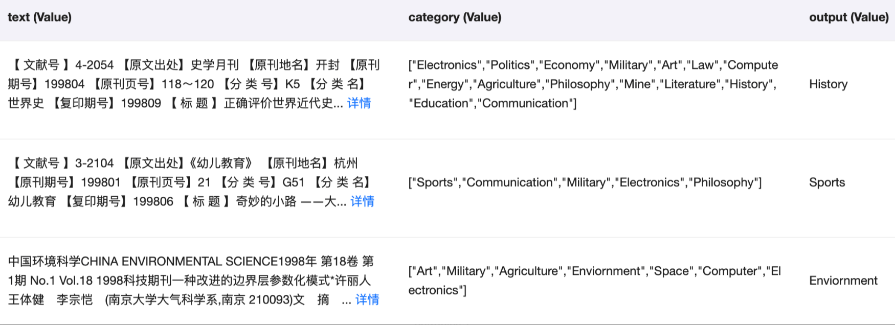
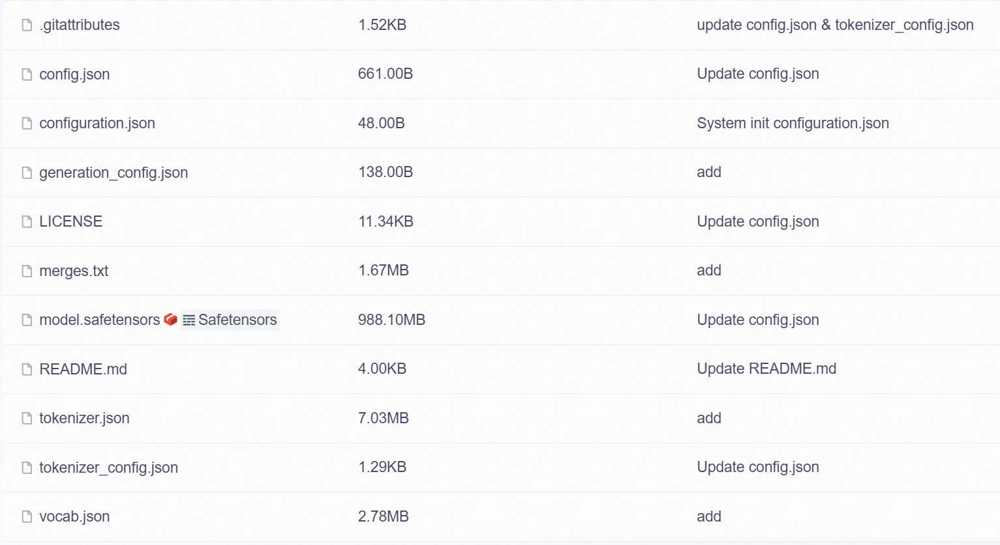
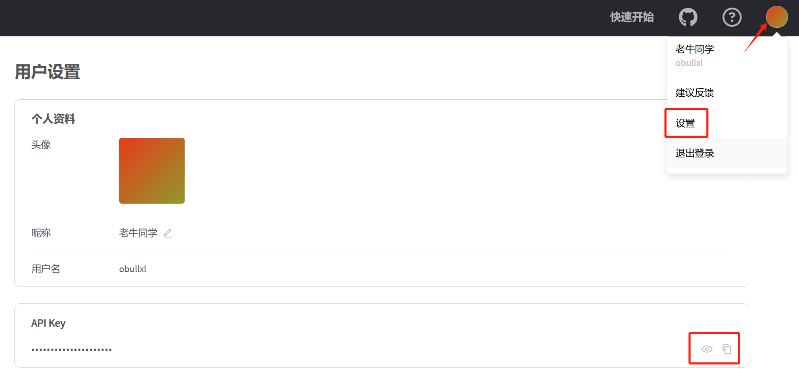
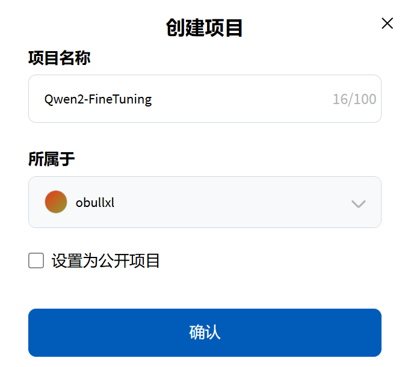
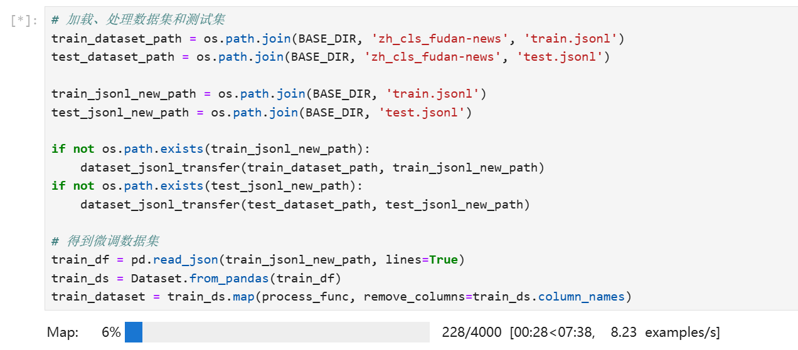
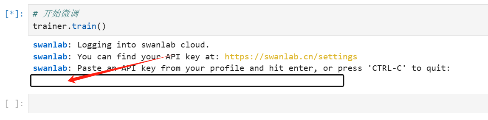
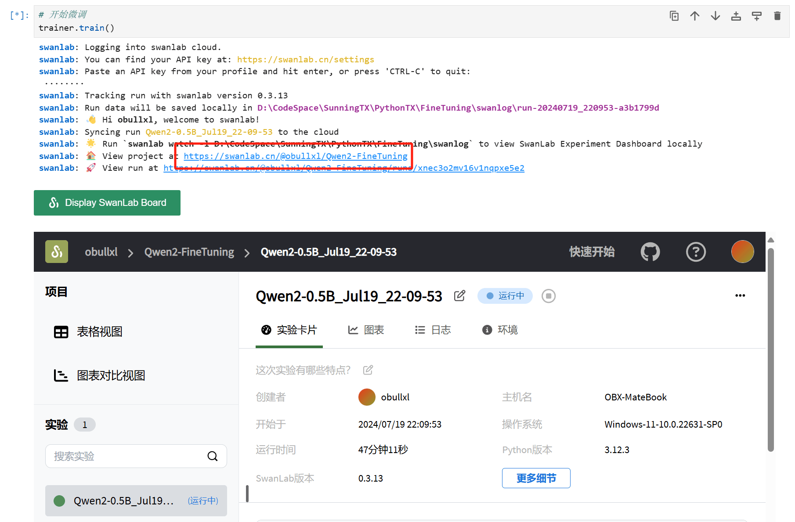
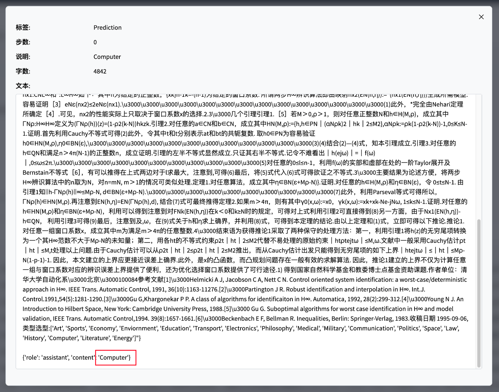

+++
slug = "2024071801"
date = "2024-07-18"
lastmod = "2024-07-18"
title = "基于 Qwen2 大模型微调技术详细教程（LoRA 参数高效微调和 SwanLab 可视化监控）"
description = "本教程详细介绍了 LoRA 参数高效微调技术，包括数据集准备和处理、模型加载、参数设置等，然后以 Qwen2-0.5B 预训练模型实践，进行了文本分类能力微调，微调过程通过 SwanLab 可视化界面查看，最终微调模型进行测试数据评估……"
image = "00.png"
tags = [ "AI", "LoRA", "SwanLab", "Fine-Tuning", "大模型" ]
categories = [ "人工智能" ]
+++

老牛同学在之前的介绍大模型 Prompt 提示词的文章中（[高效编写大模型 Prompt 提示词，解锁 AI 无限创意潜能](https://mp.weixin.qq.com/s/gaLw3yP-oANvQyjRSkVjyw)），曾把大模型比作成一位无所不能无所不知且不知疲惫的“大师”。我们在日常工作、学习中等一些通用知识方面的问题，通常情况下，我们均可通过 Prompt 提示词就能从“大师”那里得到期望的结果。

但是，在某些垂直场景的特定任务（包括：个性化服务、内部私有数据等）中，这位“大师”可能就不一定能胜任了：

1. **数据隐私安全：** 保密项目、创业团体和企业内部数据是需要保证**绝对安全**的，“大师”的知识来自预训练的公开数据，在推理时就缺乏这方面知识。
2. **Prompt 长度和截取：** 使用清晰详细的 Prompt 提示词，确实能帮助“大师”理解我们需求，从而更好的输出结果。但是大模型对输入序列的长度有限制，超长会被截断，同时超长的 Prompt 提示意味着推理成本更高、推理效率更低，可能达不到预期的效果。
3. **个性化需求：** 预训练的大模型，其对问题的理解和输出方式基本固定，无法满足个性化的需求。

这个时候，我们可以通过标记好的结构化数据，让“大师”进一步学习（即：微调），通过调整“大师”的知识（即：调整大模型参数），达到处理特定任务的能力。

根据我们需要调整的大模型的参数量，微调技术大致可以分为 2 种：

1. **全量微调** 即**FFT**(Full Fine-Tuning)，它使用特定领域的数据集对模型的**所有参数**进行调整，微调的参数量跟预训练时一样多，训练成本和资源会很高，同时可能因数据集等原因出现过拟合问题，导致发生**灾难性遗忘**(Catastrophic Forgetting)，即我们可能会让大模型在某个领域的能力变的更好，但也可能会让原来其它表现好领域的能力变差。
2. **参数高效微调** 即**PEFT**(Parameter-Efficient Fine-Tuning)，它仅更新模型中的小**部分参数**，保持大部分预训练权重不变，在保持模型性能的同时减少所需的计算资源和存储空间，可在有效避免过拟合问题的同时，还有助于保留模型在广泛任务上的通用知识（即：泛化能力）。

**LoRA**(Low-Rank Adaptation)是一种高效的大模型**PEFT**微调技术，它是通过在预训练模型的关键层（如全连接层和自注意力层）之间添加低秩矩阵来完成微调。这些低秩矩阵的引入使得模型能够适应新的任务，而无需改变原有的大量参数。由于低秩矩阵的参数数量远小于原有层的参数数量，这就大大减少了需要训练的参数总数。

**LoRA**的优势在于，即使在资源有限的情况下，也可以有效地对大型预训练模型进行微调，使其适应各种下游任务，如文本分类、命名实体识别等。此外，由于 LoRA 的微调通常只需要较少的数据，这也使得它成为小数据集场景下的一个有力工具。

老牛同学将通过本教程，基于**Qwen2-0.5B**开源的预训练大模型，和大家一起进行一次大模型**文本分类**能力的微调。在 AI 蓬勃发展的今天，老牛同学期望能通过本教程，与大家一起在我们的 AI 知识库里新增储备微调知识，逐步做到**肚里有货，从容不迫**。

完成一次完整的大模型微调，大致需要以下几个步骤：

1. **环境准备：** 主要是 Python 依赖库安装
2. **数据集准备：** 针对特定任务，准备相关的数据，数据内容包含**Prompt 提示词**和**输出**即可
3. **准备大模型：** 我们可以通过 HF、ModelScope 等下载预训练大模型权重
4. **大模型微调：** 包括加载大模型、数据集格式化处理、LoRA 参数准备等。最后，微调过程我们通过**swanlab**可视化界面查看

# 环境准备和安装依赖包

首先，我们需要通过**Miniconda**安装 Python 依赖库：

```shell
# 切换环境
conda activate PY3.12.2

# 安装依赖库
pip install transformers datasets peft accelerate modelscope swanlab
```

如果我们还没有安装好**Miniconda**包管理工具，请先移步此文完成大模型基础环境配置：[大模型应用研发基础环境配置（Miniconda、Python、Jupyter Lab、Ollama 等）](https://mp.weixin.qq.com/s/P_ufvz4MWVSqv_VM-rJp9w)

以上 6 个库的主要用途简单介绍：

1. **transformers** HuggingFace 出品的深度学习框架，是 NLP（自然语言处理）领域最流行的训练与推理框架。在本教程中主要用于加载模型、训练以及推理。
2. **datasets** HuggingFace 出品的数据集工具，在本教程中主要用于加载数据集。
3. **peft** HuggingFace 出品的微调工具，是一个流行的实现 LoRA 和其他微调技术的库。本教程中主要用于微调训练，与微调后模型推理。
4. **accelerate** HuggingFace 出品的帮助简化分布式训练和混合精度训练的库。本教程中主要用于支持混合精度训练。
5. **modelscope** ModelScope 库使开发人员能够通过丰富的 API 设计执行推理、训练和评估，从而促进跨不同 AI 领域的最先进模型的统一体验。代码中将主要用于在国内环境中下载 Qwen 大模型。
6. **swanlab** 西安电子科技大学出品，深度学习实验管理与训练的可视化工具，可记录整个实验的超参数、指标、训练环境、Python 版本等，并通过可视化图表展示，帮助我们分析训练的结果。本教程中主要用于记录指标和可视化界面。

# 数据集准备和处理

ModelScope 上有很多公开免费的数据集供我们使用：[datasets](https://modelscope.cn/datasets)

本教程我们使用的是一个开放性问题进行分类的数据集：[zh_cls_fudan-news](https://modelscope.cn/datasets/swift/zh_cls_fudan-news)

```shell
git lfs install
git clone https://www.modelscope.cn/datasets/swift/zh_cls_fudan-news.git
```

下载完成之后，我们会看到 2 个后缀为`.jsonl`的文件：

```plaintext
zh_cls_fudan-news
├── README.md
├── dataset_infos.json
├── test.jsonl
└── train.jsonl
```

`.jsonl`文件一般存储的是多行文本，每一行文本是一个 JSON 格式内容，即是多行 JSON 格式内容组合的文件。

`train.jsonl`是训练的输入文件，而`test.jsonl`则是训练的验证文件。他们每行 JSON 格式内容都包含`text`、`category`和`output`共 3 个属性，分代表模型输入、可选的分类列表和最终模型输出的分类。



我们对大模型微调的目标，就是希望微调后的大模型能够根据`text`和`category`组成的提示词，输出正确的`output`分类。

# 预训练大模型准备

本教程中，老牛同学使用的是**Qwen2-0.5B**模型，我们把大模型下载到本地（目录：`Qwen2-0.5B`）：

```shell
git lfs install
git clone https://www.modelscope.cn/qwen/Qwen2-0.5B.git
```

如果 Git 克隆失败中断，可以继续克隆下载：

```shell
cd Qwen2-0.5B
git lfs pull
```



# 大模型微调

大模型微调包括：包括加载大模型、数据集格式化处理、LoRA 参数准备等。最后，微调过程我们通过**SwanLab**可视化界面监控整个微调过程。

## 微调可视化配置

我们使用**SwanLab**来监控整个训练过程，并评估最终的模型效果。如果是第一次使用 SwanLab，则需要注册 SwanLab 账号：[https://swanlab.cn](https://swanlab.cn)，注册成功之后，在**用户设置**页面复制**API Key**，在训练开始时需要用到。



为了便于我们查看我们微调的数据，我们还需要创建一个**项目**（项目名称：`Qwen2-FineTuning`）：



## 大模型加载、设置和微调

由于微调涉及到好几步，老牛同学**强烈建议**大家使用**Jupyter Lab**工具进行代码调试和验证，它可以把整个代码分成多个区块，单个区块可以多次执行。若还没有配置**Jupyter Lab**工具，建议先移步此文完成大模型基础环境配置：[大模型应用研发基础环境配置（Miniconda、Python、Jupyter Lab、Ollama 等）](https://mp.weixin.qq.com/s/P_ufvz4MWVSqv_VM-rJp9w)

因为涉及到不同的代码片段，老牛同学直接粘贴完整代码，通过代码注释和代码后面进行说明（文件名：`Qwen2-0.5B-train.py`，完整的代码和数据，老牛同学在**评论区**提供仓库地址）：

```python
# Qwen2-0.5B-train.py
import json
import pandas as pd
import torch
from datasets import Dataset
from modelscope import AutoTokenizer
from swanlab.integration.huggingface import SwanLabCallback
from peft import LoraConfig, TaskType, get_peft_model
from transformers import AutoModelForCausalLM, TrainingArguments, Trainer, DataCollatorForSeq2Seq
import os
import swanlab

# 权重根目录
BASE_DIR = 'D:\ModelSpace\Qwen2'

# 设备名称
device = 'cuda' if torch.cuda.is_available() else 'cpu'
# device = torch.device('cuda' if torch.cuda.is_available() else 'cpu')

# 数据集处理函数，包括：训练数据集和测试数据集
def dataset_jsonl_transfer(origin_path, new_path):
    """
    将原始数据集转换为大模型微调所需数据格式的新数据集
    """
    messages = []

    # 读取原JSONL文件
    with open(origin_path, "r", encoding="utf-8") as file:
        for line in file:
            # 解析每一行原始数据（每一行均是一个JSON格式）
            data = json.loads(line)
            text = data["text"]
            catagory = data["category"]
            output = data["output"]
            message = {
                "input": f"文本:{text},分类选项列表:{catagory}",
                "output": output,
            }
            messages.append(message)

    # 保存处理后的JSONL文件，每行也是一个JSON格式
    with open(new_path, "w", encoding="utf-8") as file:
        for message in messages:
            file.write(json.dumps(message, ensure_ascii=False) + "\n")


# 在使用数据集训练大模型之前，对每行数据进行预处理
def process_func(example):
    """
    将数据集进行预处理
    """
    MAX_LENGTH = 384
    input_ids, attention_mask, labels = [], [], []
    instruction = tokenizer(f"<|im_start|>system\n你是一个文本分类领域的专家，你会接收到一段文本和几个潜在的分类选项列表，请输出文本内容的正确分类<|im_end|>\n<|im_start|>user\n{example['input']}<|im_end|>\n<|im_start|>assistant\n", add_special_tokens=False)  # add_special_tokens 不在开头加 special_tokens
    response = tokenizer(f"{example['output']}", add_special_tokens=False)
    input_ids = instruction["input_ids"] + response["input_ids"] + [tokenizer.pad_token_id]
    attention_mask = instruction["attention_mask"] + response["attention_mask"] + [1]  # 因为eos token咱们也是要关注的所以 补充为1
    labels = [-100] * len(instruction["input_ids"]) + response["input_ids"] + [tokenizer.pad_token_id]

    if len(input_ids) > MAX_LENGTH:  # 做一个截断
        input_ids = input_ids[:MAX_LENGTH]
        attention_mask = attention_mask[:MAX_LENGTH]
        labels = labels[:MAX_LENGTH]

    return {
        "input_ids": input_ids,
        "attention_mask": attention_mask,
        "labels": labels
    }


# 加载预训练模型和分词器
model_dir = os.path.join(BASE_DIR, 'Qwen2-0.5B')
tokenizer = AutoTokenizer.from_pretrained(model_dir, use_fast=False, trust_remote_code=True)
model = AutoModelForCausalLM.from_pretrained(model_dir, device_map=device, torch_dtype=torch.bfloat16)
model.enable_input_require_grads() # 开启梯度检查点时，要执行该方法

# 加载、处理数据集和测试集
train_dataset_path = os.path.join(BASE_DIR, 'zh_cls_fudan-news', 'train.jsonl')
test_dataset_path = os.path.join(BASE_DIR, 'zh_cls_fudan-news', 'test.jsonl')

train_jsonl_new_path = os.path.join(BASE_DIR, 'train.jsonl')
test_jsonl_new_path = os.path.join(BASE_DIR, 'test.jsonl')

if not os.path.exists(train_jsonl_new_path):
    dataset_jsonl_transfer(train_dataset_path, train_jsonl_new_path)
if not os.path.exists(test_jsonl_new_path):
    dataset_jsonl_transfer(test_dataset_path, test_jsonl_new_path)

# 得到微调数据集
train_df = pd.read_json(train_jsonl_new_path, lines=True)
train_ds = Dataset.from_pandas(train_df)
train_dataset = train_ds.map(process_func, remove_columns=train_ds.column_names)

# 创建LoRA配置
config = LoraConfig(
    task_type=TaskType.CAUSAL_LM,
    target_modules=["q_proj", "k_proj", "v_proj", "o_proj", "gate_proj", "up_proj", "down_proj"],
    inference_mode=False,  # 训练模式
    r=8,  # Lora 秩
    lora_alpha=32,  # Lora alaph，具体作用参见 Lora 原理
    lora_dropout=0.1,  # Dropout 比例
)

# 将LoRA应用于模型
model = get_peft_model(model, config)

# 创建微调参数
args = TrainingArguments(
    output_dir=os.path.join(BASE_DIR, 'output', 'Qwen2-0.5B'),
    per_device_train_batch_size=4,
    gradient_accumulation_steps=4,
    logging_steps=10,
    num_train_epochs=2,
    save_steps=100,
    learning_rate=1e-4,
    save_on_each_node=True,
    gradient_checkpointing=True,
    report_to="none",
)

# SwanLab微调过程回调数据
swanlab_callback = SwanLabCallback(project="Qwen2-FineTuning", experiment_name="Qwen2-0.5B")

trainer = Trainer(
    model=model,
    args=args,
    train_dataset=train_dataset,
    data_collator=DataCollatorForSeq2Seq(tokenizer=tokenizer, padding=True),
    callbacks=[swanlab_callback],
)

# 开始微调
trainer.train()

# 模型结果结果评估
def predict(messages, model, tokenizer):
    text = tokenizer.apply_chat_template(
        messages,
        tokenize=False,
        add_generation_prompt=True
    )
    model_inputs = tokenizer([text], return_tensors="pt").to(device)

    generated_ids = model.generate(
        model_inputs.input_ids,
        max_new_tokens=512
    )
    generated_ids = [
        output_ids[len(input_ids):] for input_ids, output_ids in zip(model_inputs.input_ids, generated_ids)
    ]

    return tokenizer.batch_decode(generated_ids, skip_special_tokens=True)[0]

# 模型评估：获取测试集的前10条测试数据
test_df = pd.read_json(test_jsonl_new_path, lines=True)[:10]

test_text_list = []
for index, row in test_df.iterrows():
    instruction = row['你是一个文本分类领域的专家，你会接收到一段文本和几个潜在的分类选项列表，请输出文本内容的正确分类']
    input_value = row['input']

    messages = [
        {"role": "system", "content": f"{instruction}"},
        {"role": "user", "content": f"{input_value}"}
    ]

    response = predict(messages, model, tokenizer)
    messages.append({"role": "assistant", "content": f"{response}"})

    result_text = f"{messages[0]}\n\n{messages[1]}\n\n{messages[2]}"
    test_text_list.append(swanlab.Text(result_text, caption=response))

swanlab.log({"Prediction": test_text_list})
swanlab.finish()
```

以上就是大模型微调的全部代码，微调的总体流程如下：

1. 首先，我们通过**PyTorch**库检查 CUDA 是否可用，优先使用 CUDA 设备，否则退回 CPU 设备
2. 然后，定义了 2 个函数：分别是数据集预处理函数、单行数据预处理函数（主要用于把原始数据集映射成大模型微调的数据内容）
3. 接着准备开始微调了，首先加载预训练模型和分词器，`trust_remote_code=True`代表从本地磁盘加载模型权重
4. 然后使用定义好的函数，处理原始数据集，并处理为微调数据集
5. 接着创建**LoRA**配置，并把**LoRA**配置应用于预训练模型
6. 接下来创建微调参数（`output_dir="./output/Qwen2-0.5B"`代表微调之后的权重文件目录），并设置**SwanLab**回调函数
7. 最后，启动微调：`trainer.train()`
8. 微调完成之后，我们通过 10 条测试数据，对模型进行了评估验证

从原始数据集映射成大模型数据集进度、速度和耗时（共 4000 条数据）：



我们启动模型微调后，SwanLab 需要我们输入**API Key**，输入即可。



## 查看微调进展

我们可以在**Jupyter Lab**中直接开启看板，非常方便的查看微调情况。



微调完成，可以看到在测试样例评估上，微调后**Qwen2**大模型能够给出**准确**的文本分类：



至此，我们已经完成了**Qwen2-0.5B**大模型的微调工作，接下来就可以使用微调后模型完成特定任务了（文本分类）！

本教程所有的源代码，老牛同学展示在评论区，大家可以获取源文件进行模型微调！

[LivePortrait 数字人：开源的图生视频模型，本地部署和专业视频制作详细教程](https://mp.weixin.qq.com/s/NYTQVBC4ug73o_VdQy-TeQ)

[基于 Qwen2/Lllama3 等大模型，部署团队私有化 RAG 知识库系统的详细教程（Docker+AnythingLLM）](https://mp.weixin.qq.com/s/PpY3k3kReKfQdeOJyrB6aw)

[使用 Llama3/Qwen2 等开源大模型，部署团队私有化 Code Copilot 和使用教程](https://mp.weixin.qq.com/s/vt1EXVWtwm6ltZVYtB4-Tg)

[本地部署 GLM-4-9B 清华智谱开源大模型方法和对话效果体验](https://mp.weixin.qq.com/s/g7lDfnRRGdrHqN7WGMSkAg)

[玩转 AI，笔记本电脑安装属于自己的 Llama 3 8B 大模型和对话客户端](https://mp.weixin.qq.com/s/MekCUJDhKzuUnoykkGoH2g)

[ChatTTS 开源文本转语音模型本地部署、API 使用和搭建 WebUI 界面](https://mp.weixin.qq.com/s/rL3vyJ_xEj7GGoKaxUh8_A)

[Ollama 完整教程：本地 LLM 管理、WebUI 对话、Python/Java 客户端 API 应用](https://mp.weixin.qq.com/s/majDONtuAUzN2SAaYWxH1Q)


