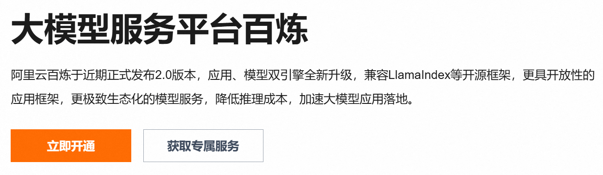
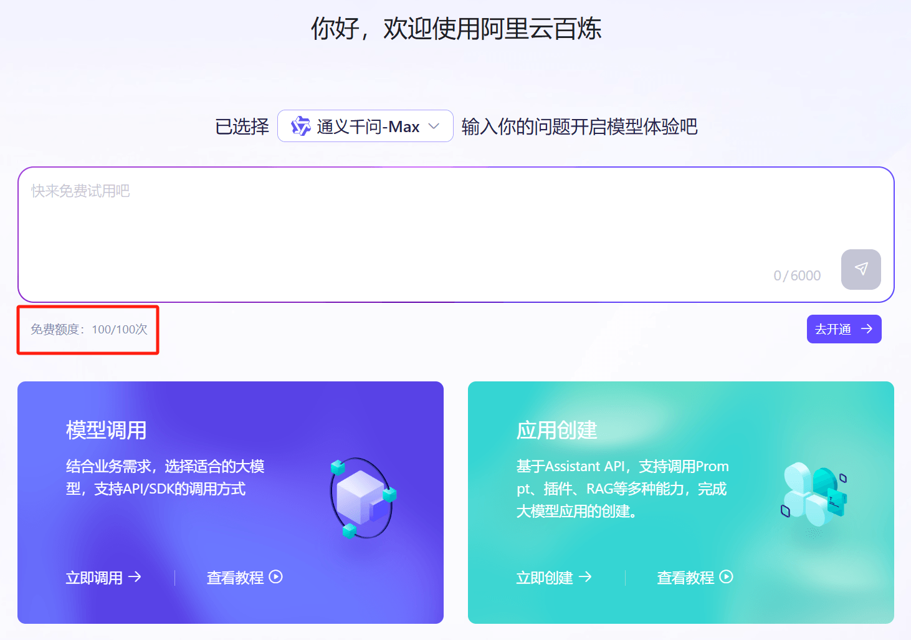
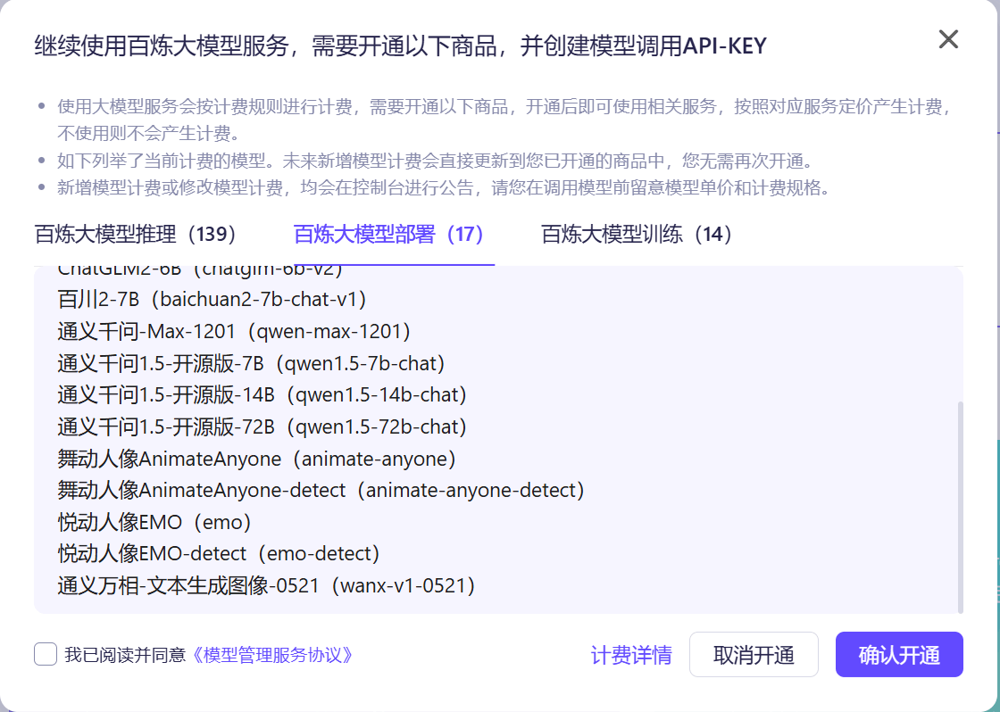
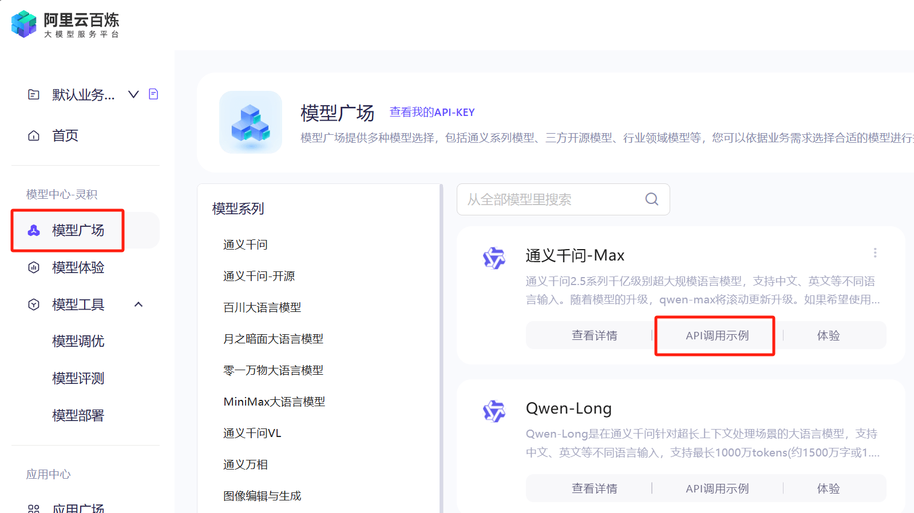
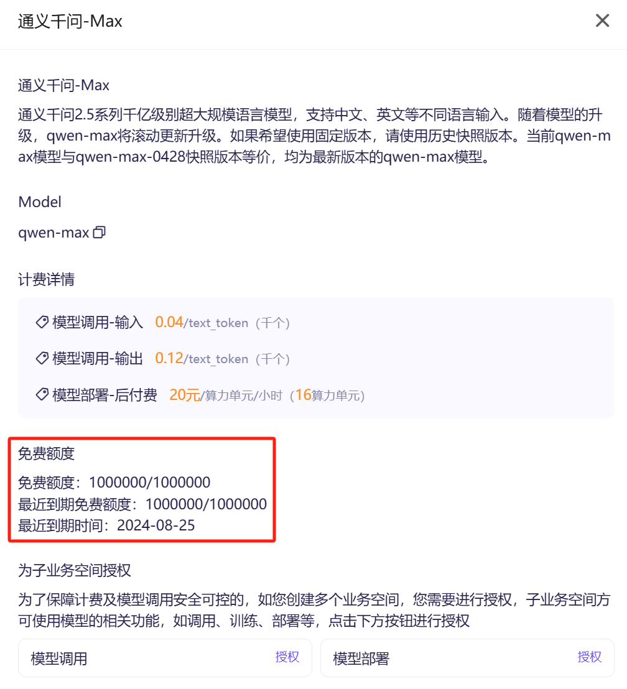
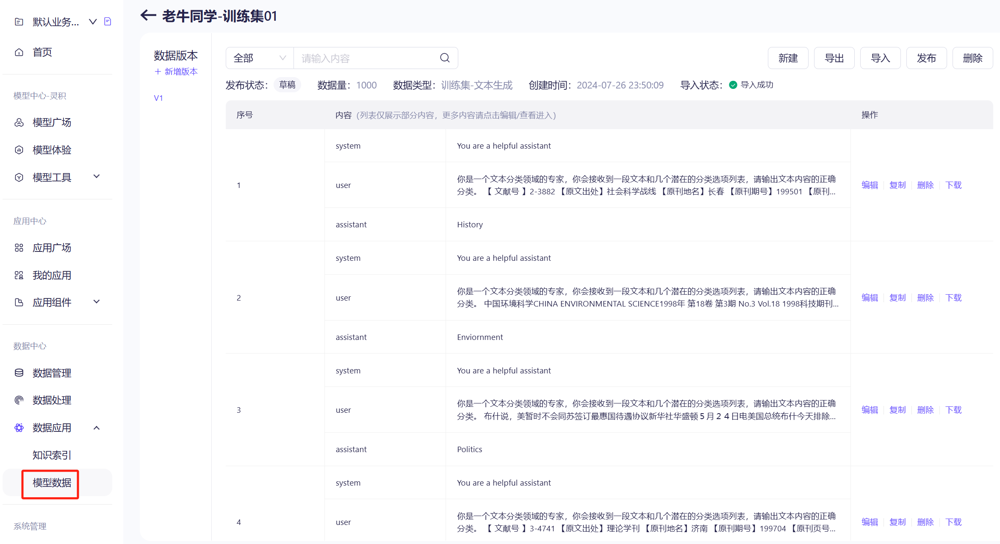
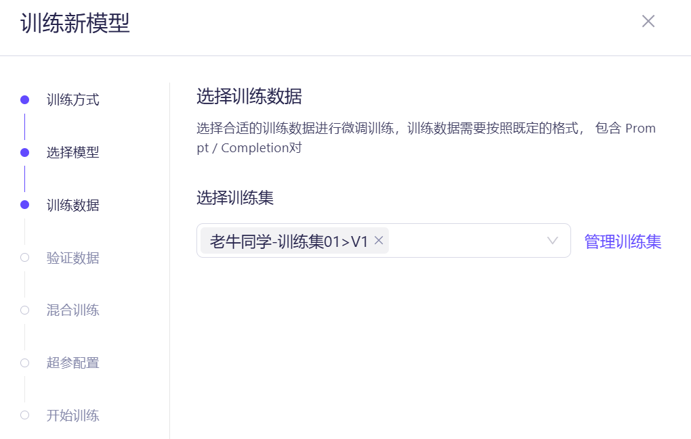
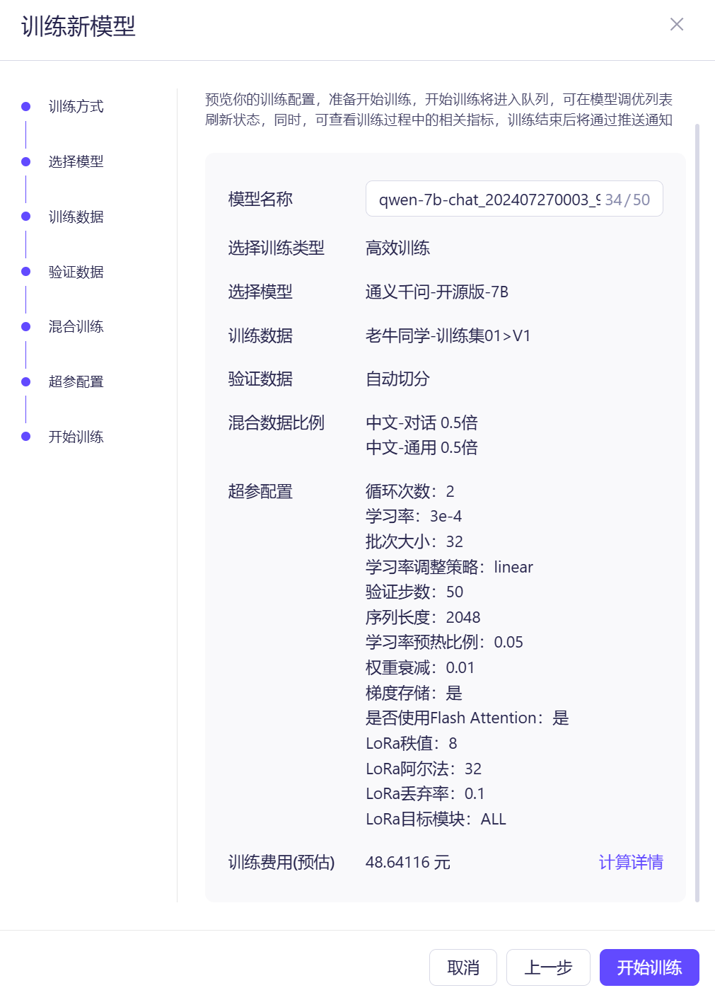
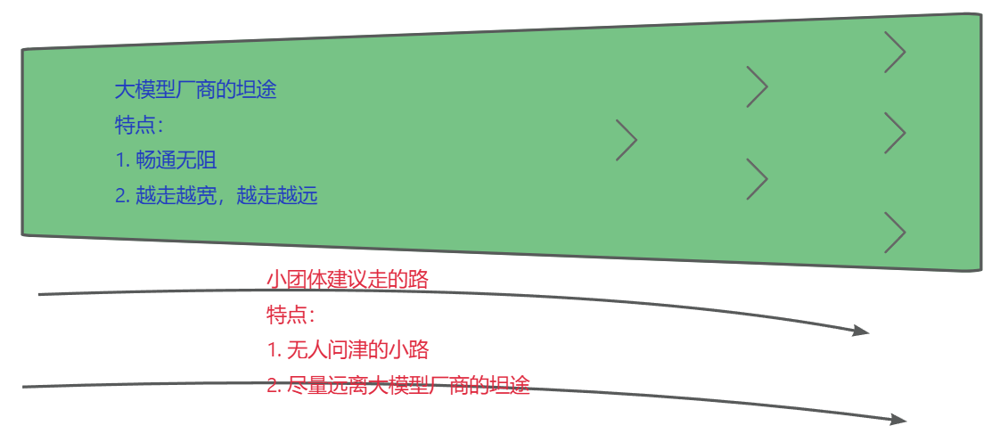

+++
slug = "2024072601"
date = "2024-07-26"
lastmod = "2024-07-26"
title = "太卷了，阿里云免费1个月大模型算力额度，玩转Llama3.1/Qwen2等训练推理"
description = "阿里云百炼平台发布推文，提供30天免费算力额度，助力玩转 Llama3.1 训练推理。老牛同学首当其冲，去体验一把，本文详细记录了整个过程，同时给出了老牛同学的一些想法，欢迎交流学习……"
image = "00.png"
tags = [ "AI", "阿里云", "大模型" ]
categories = [ "人工智能" ]
+++

早上收到朋友转发的阿里云公众号推文，阿里云为用户免费提供1个月的训练推理等算力额度（[上阿里云，免费玩转Llama 405B 「超大杯」！](https://mp.weixin.qq.com/s/BoWoRPsI3sOM3To0BHSQHw)）。想想上周老牛同学为了制作微调技术教程，演示训练**Qwen2-0.5B**小尺寸大模型就跑了一个晚上（[基于 Qwen2 大模型微调技术详细教程（LoRA 参数高效微调和 SwanLab 可视化监控）](https://mp.weixin.qq.com/s/eq6K8_s9uX459OeUcRPEug)），如今阿里云竟然免费提供1个月训练推理算力，而且还支持**Llama3.1-405B**超大尺寸模型，标题和内容确实把老牛同学给够吸住了。

虽然老牛同学非常相信阿里云在中国市场的地位，但还是有那么一点点担心是标题党，因此老牛同学决定验证一下，走一遍完整开通和使用流程，最后给出自己的感受给大家做个参考。

# 开通阿里云百炼服务

推文写得很清楚，免费额度是为阿里云百炼平台用户提供的，因此先开通注册：[https://www.aliyun.com/product/bailian](https://www.aliyun.com/product/bailian)

说实话，取名真的很重要，不仅要好听好记还要切实际功能。比如**千问**：作为你的人工智能助理，随你问，我都能答；**百炼**：千锤百炼，大模型训练微调，就是不断打磨和调整优化过程。

阿里云百炼：是基于通义大模型、行业大模型以及三方大模型的一站式大模型开发平台。面向企业客户和个人开发者，提供完整的模型服务工具和全链路应用开发套件，预置丰富的能力插件，提供API及SDK等便捷的集成方式，高效完成大模型应用构建。

产品定价：阿里云百炼大模型服务平台在调用API后将产生计量和计费。各个领域的模型采用不同的计量单元，不同模型单独制定各自的计费单价和免费额度等规则。（**特别注意**：不同模型是单独计价和单价免费额度规则，算力额度有可能针对不同模型不一样！）

点击“**立即开通**”橙色大按钮，按照提示，一步一步完成注册即可：



我们可以直接通过支付宝、淘宝等方式登录（老牛同学使用支付宝扫描登录）。登录成功，需要同意“**阿里云百炼服务协议**”，我们主要是用于学习和研究，肯定不会干那些超纲的事情，无脑点击“**同意**”按钮就行了。

然后，我们就进入了百炼平台控制台首页：



看到“**免费额度：100/100次**”小字样，老牛同学之前的担心加重了一点，回头想想还是继续往下看看，毕竟是阿里云，应该是不能随便开玩笑的。

点击“**去开通 →**”按钮，又来个弹框确认开通。不过支持的模型倒是挺多的，支持139个推理（包括Llama3.1-405B大模型）、17个部署和14个训练，应该来说我们对学习和研究类需求足够了：



勾选“我已阅读并同意《模型管理服务协议》”，然后点击“**确认开通**”按钮，整个开通流程就结束了！

# 使用API调用推理服务

首先体验一下大模型的**推理**服务，选择“**模型广场**”，选择任意一个模型（如：**通义千问-Max**），点击“API调用示例”：



可以看到，API调用示例提供了**Python**、**Java**和**Curl**共3种方式，对于我们来说也应该足够了（老牛同学就不演示了）。

最关键的是，点击“**模型详情**”，可以看到计费方式和**免费额度**信息：



可以看到，免费额度信息如下：

1. 免费的Token数量有限制（如：通义千问-Max是100万个）
2. 之前推文中提到的，免费1个月，是指这些免费额度仅1个月**有效期**，不是老牛同学想象的免费使用1个月！

到这里，老牛同学感觉有一点点失望了，但是老牛同学对推理要求不多，在看看模型训练如何免费的。

# 使用百炼平台进行模型训练

选择“**模型工具**”-“**模型调优**”，然后点击“**训练新模型**”按钮，然后在弹框选择“**高效训练**”（就是老牛同学上周文章中的微调）

点击“**下一步**”，选择“**预置模型**”，在下拉框中选择“**通义千问-开源版-7B**”模型（模型没有强制要求）

点击“**下一步**”，需要选择训练数据集，因之前没有训练过，还没有数据集，因此我们点击“**管理训练集**”增加数据集

数据集是`jsonl`文件，单个JSON的格式需要符合ChatML格式，样例如下：

```json
{"messages": [{"role": "system", "content": "You are a helpful assistant"}, {"role": "user", "content": "谁在文艺复兴时期绘制人体?"}, {"role": "assistant", "content": "文艺复兴时期是一个关于艺术、文化和学术的复兴运动，在这个时期，许多艺术家都绘制了人体。"}]}
```

因此，老牛同学上周微调用的文本分类的原始数据集需要格式化处理一下（评论区有最终文件链接），Python代码如下：

```python
import os
import json

# 训练数据集文件
BAS_DATA_DIR = 'D:\ModelSpace\Qwen2'
RAW_TRAIN_FILE_PATH = os.path.join(BAS_DATA_DIR, os.path.join('zh_cls_fudan-news', 'train.jsonl'))
NEW_TRAIN_FILE_PATH = os.path.join(BAS_DATA_DIR, 'train-ChatML.jsonl')

# 将原始数据集转换为ChatML格式的新数据集
message_list = []

# 读取原JSONL文件
with open(RAW_TRAIN_FILE_PATH, "r", encoding="utf-8") as file:
    for line in file:
        # 解析每一行原始数据（每一行均是一个JSON格式）
        data = json.loads(line)
        text = data["text"]
        catagory = data["category"]
        output = data["output"]

        message_part_1 = {"role": "system", "content": "You are a helpful assistant"}
        message_part_2 = {"role": "user", "content": f"你是一个文本分类领域的专家，你会接收到一段文本和几个潜在的分类选项列表，请输出文本内容的正确分类。\n{text}\n分类选项列表:{catagory}"}
        message_part_3 = {"role": "assistant", "content": output}
        message = {
            "messages": [message_part_1, message_part_2, message_part_3]
        }

        message_list.append(message)

# 保存处理后的JSONL文件，每行也是一个JSON格式
with open(NEW_TRAIN_FILE_PATH, "w", encoding="utf-8") as file:
    for message in message_list:
        file.write(json.dumps(message, ensure_ascii=False) + "\n")
```

如果大家不想对原始的文件进行处理了，可以到评论区直接下载老牛同学已经处理好的数据集文件。

在新打开页面，点击“**新增数据集**”，勾选“**训练集**”（文件最大支持20MB），然后处理好的文件上次即可（裁剪一下，留下1000行）。

导入成功之后，可以查看数据样例，还可以单行进行处理：



确认无误之后，点击“**发布**”数据集，后面就可以使用了。

然后我们继续回到刚才模型训练页面，选择我们创建的数据集，操作菜单：模型工具-模型调优，选择刚才发布的训练数据集：



点击“**下一步**”，验证数据，选择“**自动切分**”，我们就不单独创建数据集了。

在“**混合训练**”选择中，针对**中文-对话**和**中文-通用**均选择`0.5`倍（因为我们训练集都是中文，就简单点点设置了）

最后，可以看到本次模型训练的详情和预估费用：



点击“**开始训练**”就是开始训练了，预估费用不足**50元**还算不错，比老牛同学自己电脑训练所用的电费感觉贵不了多少！

# 最后：想谈点大模型产品的感想

最近和朋友聊天，聊到最近很火爆的大模型，目前市面上有那么多感觉非常惊艳的开源大模型，利用这些开源大模型来创业岂不美哉？！

朋友对自己的想法自信满满，滔滔不绝介绍自己的创意，其中之一就是：基于大语言模型研发一个老年人伴侣APP，专门解决老年人孤单无人陪伴的问题，背景是经调研机构研究和评测，中国老龄化逐渐严重，老年人服务市场巨大，等等……

老牛同学听了一会儿实在没有忍住，强制打断给出判断：**行不通**，极有可能被大模型厂商**碾压**，没有生存空间！

下面是老牛同学的一些不成熟的想法判断示意图：凡是大模型厂商正在做、未来可能会做的事情，小团体、创业团队等如果不想被他们**碾压**的话，趁早不要做！！！



想想看，如果存在一个巨大的大模型市场，那些大模型厂商会不涉猎吗？

+ 阿里云为了拉新用户使用百炼平台，推广百炼平台，提供免费的算力额度，这些额度难道不是钱吗？大模型厂商之间都已经卷成这样了，小团体还敢挡路？
+ 大模型厂商他们基本是要人有人、要技术有技术、要资源有资源、要卡有卡，而小团体呢，大多情况只是有一个创意想法而已！

那么，创业小团体的出路在哪儿呢：细分领域，那些大模型厂商看不上的领域、那些和大模型厂商前进方向不冲突的领域。

比如**准爸准妈**领域：有没有可能，根据准妈的产检信息，利用大模型预判孩子出生日期、时间、体重、性别等，以便准爸准妈提前做好准备？

比如**护肤品**领域：有没有可能，根据女性皮肤照片，利用大模型推荐最合适的护肤品？

等等，以上只是老牛同学的一些胡思乱想，若有不适宜之处，请帮忙指正，老牛同学第一时间修正或者删除本文，谢谢大家！

最后的最后，回应本文开头，对阿里云百炼推文做个总结：虽然有那么一点点标题党嫌疑，但总体还是**诚意满满**（单模型，100万Token，有效期30天），试问国内还有别家这么干吗？如果我们只是作为一个学习者、体验者或者临时使用者，Token数量和有效期我想也完全足够。

因此，如果你只是想体验一下大模型、或者产品上线之前的联调、或者临时小需求需要使用大模型服务，这个免费的羊毛就是为你准备的，抓紧大胆的去薅吧！

[基于 Qwen2 大模型微调技术详细教程（LoRA 参数高效微调和 SwanLab 可视化监控）](https://mp.weixin.qq.com/s/eq6K8_s9uX459OeUcRPEug)

[LivePortrait 数字人：开源的图生视频模型，本地部署和专业视频制作详细教程](https://mp.weixin.qq.com/s/NYTQVBC4ug73o_VdQy-TeQ)

[基于 Qwen2/Lllama3 等大模型，部署团队私有化 RAG 知识库系统的详细教程（Docker+AnythingLLM）](https://mp.weixin.qq.com/s/PpY3k3kReKfQdeOJyrB6aw)

[使用 Llama3/Qwen2 等开源大模型，部署团队私有化 Code Copilot 和使用教程](https://mp.weixin.qq.com/s/vt1EXVWtwm6ltZVYtB4-Tg)

[本地部署 GLM-4-9B 清华智谱开源大模型方法和对话效果体验](https://mp.weixin.qq.com/s/g7lDfnRRGdrHqN7WGMSkAg)

[玩转 AI，笔记本电脑安装属于自己的 Llama 3 8B 大模型和对话客户端](https://mp.weixin.qq.com/s/MekCUJDhKzuUnoykkGoH2g)

[ChatTTS 开源文本转语音模型本地部署、API 使用和搭建 WebUI 界面](https://mp.weixin.qq.com/s/rL3vyJ_xEj7GGoKaxUh8_A)

[Ollama 完整教程：本地 LLM 管理、WebUI 对话、Python/Java 客户端 API 应用](https://mp.weixin.qq.com/s/majDONtuAUzN2SAaYWxH1Q)


