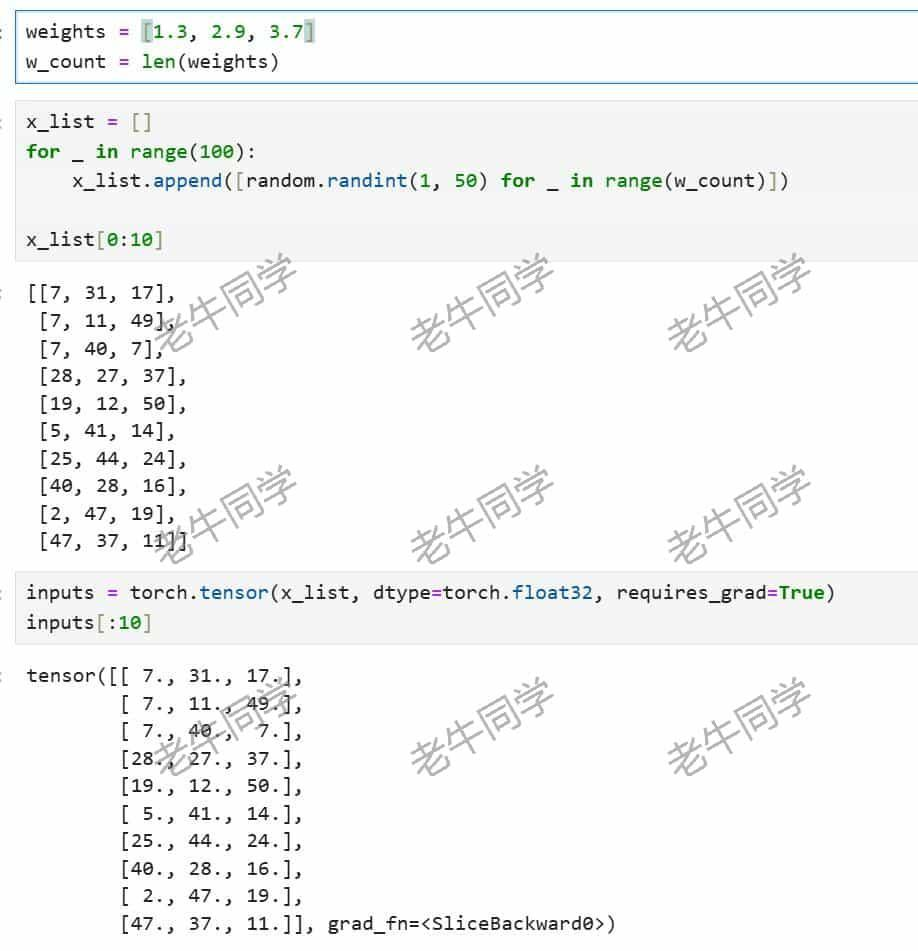
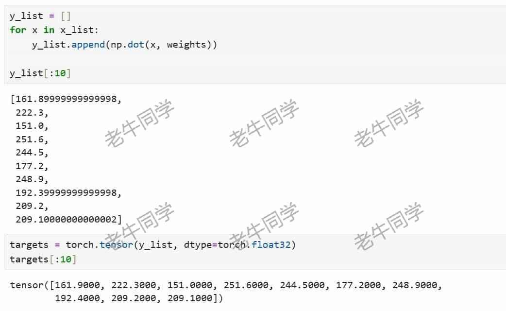
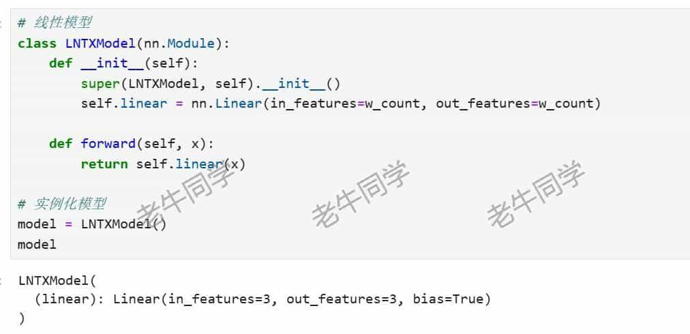
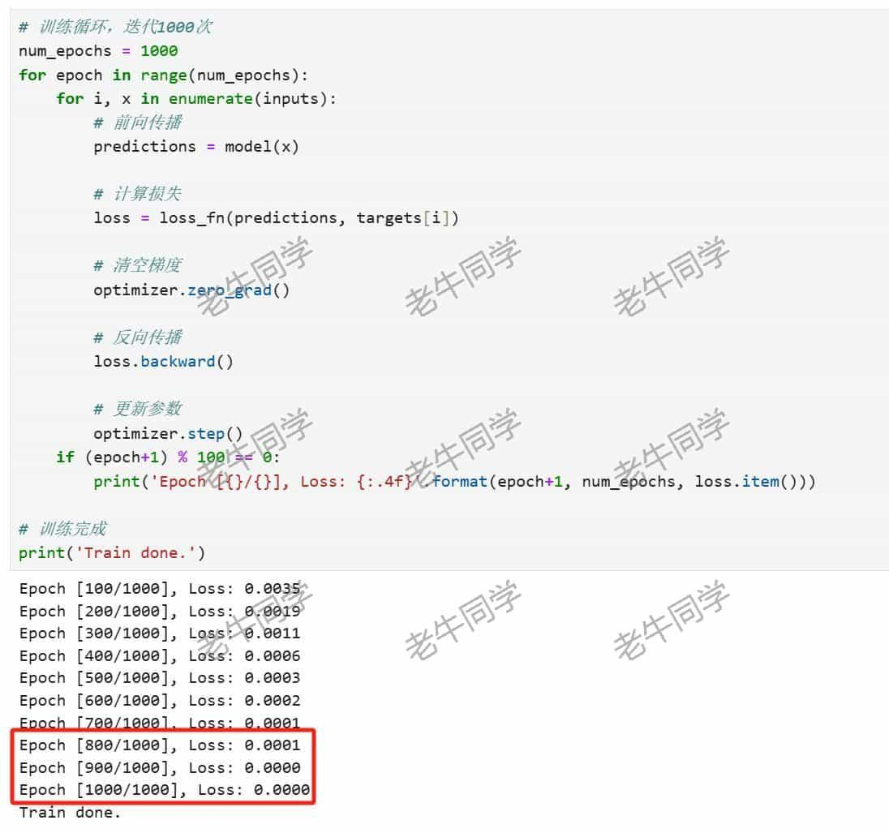
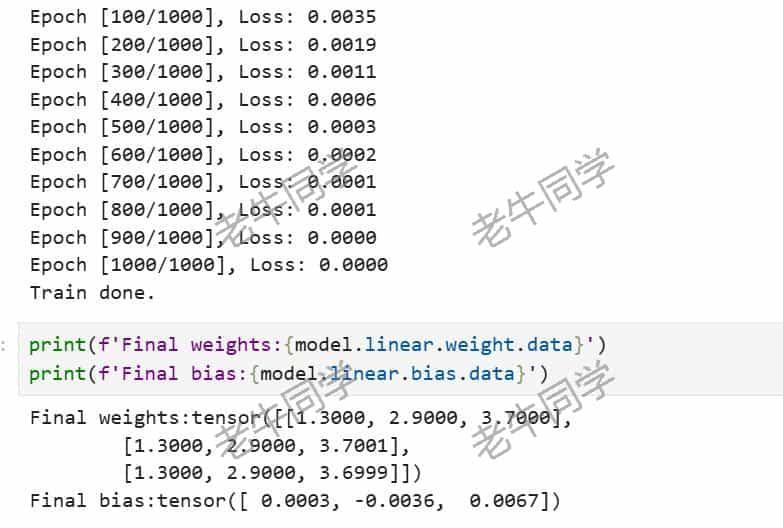

+++
slug = "2024080201"
date = "2024-08-02"
lastmod = "2024-08-02"
title = "PyTorch 训练一个自定义功能齐全的神经网络模型的详细教程"
description = "PyTorch 是一个开源的机器学习框架，可以方便地进行神经网络模型训练和推理。本文基于 PyTorch 演示了一个非常简单但是功能齐全的神经网络训练过程，无论模型权重有多大，使用 TyTorch 训练的过程是类似的，期望本文能启到抛砖引玉的作用……"
image = "01.jpg"
tags = [ "AI", "PyTorch" ]
categories = [ "人工智能" ]
+++

在前面的文章中，老牛同学介绍了不少大语言模型的部署、推理和微调，也通过大模型演示了我们的日常的工作需求场景。我们通过大语言模型，实实在在的感受到了它强大的功能，同时也从中受益颇多。

今天，老牛同学想和大家一起来训练一个自定义的、但是功能齐全的简单的神经网络模型。这个模型虽然在参数规模、训练数据集、应用场景等方面均无法与大语言模型相媲美，但是我们旨在通过这个模型的训练过程，一窥神经网络模型的训练全貌。正所谓“**麻雀虽小，五脏俱全**”，同时老牛同学也希望能通过本文，与大家一起学习加深对训练神经网络的理解，逐步做到“**肚里有货，从容不迫**”！

由于模型训练过程的代码可能会反复调试和修改，老牛同学强烈建议大家使用**Jupyter Lab**来编写和调试代码。如果还没有配置好**Jupyter Lab**环境，请先移步老牛同学之前的文章，首先完成大模型研发的基础环境配置：[大模型应用研发基础环境配置（Miniconda、Python、Jupyter Lab、Ollama 等）](https://mp.weixin.qq.com/s/P_ufvz4MWVSqv_VM-rJp9w)

# 定义神经网络模型

本文重在演示训练过程，因此为了方便我们训练，我们模型定义如下：

1. 它是一个简单的线性计算模型
2. 它只有**3 个**权重参数
3. 它输出一个**数值**结果

根据以上定义，我们的模型的线性运算公式定义为：`y = W1*x1 + W2*x2 + W3*x3 + b`

- `y` 为模型输出，在训练时，则代表模型的目标训练数据集
- `x` 为模型输入，在训练时，则代表模型的输入训练数据集
- `W` 为模型权重，是模型训练的最终结果
- `b` 为调整线性运算结果的偏置向量

我们将根据 `y` 和 `x` 训练数据集，逐步训练得出模型权重 `W` 和 `b` 值。

本文的源码地址，老牛同学放到评论区。如果大家不想一步一步地跟着老牛同学进行模型训练，也可以直接看源代码，一步到位看完整代码（源代码中还有 1 个权重的样例）。

# 准备训练数据集

首先，打开 **Jupyter Lab** 编辑器：

```
conda activate PY3.12
jupyter-lab .
```

为了后面创建数据集、创建模型、模型训练等操作，我们直接引入所有的依赖包：

```python
import torch
import torch.nn as nn
import random
import torch.optim as optim
import numpy as np
```

为了方便构建数据集，我们先假设`W`的内容（偏置向量`b`值初始化为**0**）：

```python
# 随便写几个数字
weights = [1.3, 2.9, 3.7]
w_count = len(weights)
```

大家可能会有疑问，既然我们都已经知道模型权重了，那我们还训练个啥呢？

别着急，老牛同学提前定义它，有 2 个目的，后面在实际训练时不会使用它：

1. 方便构造我们的训练数据集：因为我们已经确定了模型的线性运算公式，那么我们只需要随机一些`x`，就可以容易得到训练数据集`y`了
2. 模型训练结束之后，方便后面做个比对，看下我们训练结果我们预期值是否符合我们预期

我们先构建我们输入数据集，即线性运算公式`x`的内容，我们通过随机函数构建了 100 个随机数字，并转换模型训练时 PyTorch 张量类型：

```python
x_list = []
for _ in range(100):
    x_list.append([random.randint(1, 50) for _ in range(w_count)])

inputs = torch.tensor(x_list, dtype=torch.float32, requires_grad=True)
```



然后，我们根据的输入数据集 **x**，构建目标训练数据集，同样转换模型训练时 PyTorch 张量类型：

```python
y_list = []
for x in x_list:
    y_list.append(np.dot(x, weights))

targets = torch.tensor(y_list, dtype=torch.float32)
```

结果 **y** 就是输入 **x** 和 模型权重的点积运算：



至此，我们的训练数据集已经构建完成（我们可以忘掉权重了）。接下来，我们来构建神经网络模型。

# 构建神经网络模型

我们把即将构建的神经网络模型定义为`LNTXModel`（即：老牛同学线性模型）：

```python
# 线性模型
class LNTXModel(nn.Module):
    def __init__(self):
        super(LNTXModel, self).__init__()
        self.linear = nn.Linear(in_features=w_count, out_features=w_count)

    def forward(self, x):
        return self.linear(x)

# 实例化模型
model = LNTXModel()
model
```

在本模型定义中，我们直接使用了`nn.Linear`线性层，它有 2 个参数：

- **in_features**: 输入特征的数量（即输入向量的维度）
- **out_features**: 输出特征的数量（即输出向量的维度）
- **bias**：偏置向量参数默认为**True**



然后我们初始化了模型（大语言模型一般为加载模型）。接下来，我们就可以开始使用训练数据集来训练这个模型了。

# 训练神经网络模型

神经网络模型的训练过程，通常包括以下几步：

- 首先，进行前向传播以预测结果（即`forward`函数）
- 然后，将预测结果与目标结果进行比较，即计算损失值
- 接着，利用反向传播算法计算损失值的梯度
- 最后，根据梯度更新模型的参数

首先，我们定义损失函数和优化器：损失函数用于根据模型的预测结果和目标结果计算损失值，而优化器则用于根据计算出的梯度更新模型的权重，以最小化损失。

```python
# 定义损失函数
loss_fn = nn.MSELoss()

# 定义优化器
optimizer = optim.SGD(model.parameters(), lr=0.0005)
```

`nn.MSELoss()` 损失函数常用于回归任务中，用来衡量模型预测值与实际目标值之间的差距。函数返回一个标量张量，代表了所有输入的均方误差。

`torch.optim.SGD` 是随机梯度下降优化算法，一般用于最小化损失函数。与**标准的梯度下降**算法相比，随机梯度下降算法每一步更新只基于一个或一小批样本的梯度估计。这种方法能够更快地收敛，并且有助于跳出局部极小点。

其中，`lr` 学习率（Learning Rate）参数是优化算法中的一个重要超参数，它决定了模型参数在每次更新时的变化幅度。较高的学习率可以加快收敛的速度，但可能会导致优化过程震荡或者无法稳定在最小值附近；而较低的学习率有助于更精确地找到最小值，但可能会陷入局部最小值或者导致训练过程非常缓慢。确定最佳学习率通常需要基于模型、数据集和问题的特性进行反复试验。一般情况下，我们可以从一个较小的学习率开始（比如老牛同学本次设置为**0.0005**），然后根据模型的收敛情况逐渐增加或减少学习率。

现在，所有准备工作都已经完成，我们可以开始训练我们的模型了。

```python
# 训练循环，迭代1000次
num_epochs = 1000
for epoch in range(num_epochs):
    for i, x in enumerate(inputs):
        # 前向传播
        predictions = model(x)

        # 计算损失
        loss = loss_fn(predictions, targets[i])

        # 清空梯度
        optimizer.zero_grad()

        # 反向传播
        loss.backward()

        # 更新参数
        optimizer.step()
    if (epoch+1) % 100 == 0:
        print('Epoch [{}/{}], Loss: {:.4f}'.format(epoch+1, num_epochs, loss.item()))

# 训练完成
print('Train done.')
```

可以看到，经过**900 轮**的训练，预测损失接近为**0**：



我们可以打印出模型的训练结果，与我们预期结果进行比较：

```python
print(f'Final weights:{model.linear.weight.data}')
print(f'Final bias:{model.linear.bias.data}')
```



可以看出，模型权重与我们预期结果基本吻合，模型巡检结果基本符合预期！

# 使用神经网络模型

模型训练完成，我们就可以使用我们的模型了：`model(x)`

```python
model(torch.tensor([float(1), float(1), float(1)]))
```

# 总结：扩展模型大小

至此，我们整个训练过程已经完成了。在上面演示案例中，我们只是用了 3 个权重参数的简单模型，我们可以根据需求，进一步扩大模型参数。但是不论模型权重参数扩大到多少，他们的训练流程基本是一样的：

1. 初始化模型（大语言模型成为加载模型）
2. 根据`x`输入预测输出`y`值
3. 通过损失函数计算损失梯度值
4. 最后根据梯度更新模型参数值
5. 直到训练结束，模型权重符合预期

最后的最后，**8 月**开始了，大家**S1 绩效**基本都沟通确定了吧？公众号回复都是匿名的，最终绩效结果如何，大家若感觉兴趣，欢迎在评论区留言分享~

[基于 Qwen2 大模型微调技术详细教程（LoRA 参数高效微调和 SwanLab 可视化监控）](https://mp.weixin.qq.com/s/eq6K8_s9uX459OeUcRPEug)

[LivePortrait 数字人：开源的图生视频模型，本地部署和专业视频制作详细教程](https://mp.weixin.qq.com/s/NYTQVBC4ug73o_VdQy-TeQ)

[基于 Qwen2/Lllama3 等大模型，部署团队私有化 RAG 知识库系统的详细教程（Docker+AnythingLLM）](https://mp.weixin.qq.com/s/PpY3k3kReKfQdeOJyrB6aw)

[使用 Llama3/Qwen2 等开源大模型，部署团队私有化 Code Copilot 和使用教程](https://mp.weixin.qq.com/s/vt1EXVWtwm6ltZVYtB4-Tg)

[本地部署 GLM-4-9B 清华智谱开源大模型方法和对话效果体验](https://mp.weixin.qq.com/s/g7lDfnRRGdrHqN7WGMSkAg)

[玩转 AI，笔记本电脑安装属于自己的 Llama 3 8B 大模型和对话客户端](https://mp.weixin.qq.com/s/MekCUJDhKzuUnoykkGoH2g)

[ChatTTS 开源文本转语音模型本地部署、API 使用和搭建 WebUI 界面](https://mp.weixin.qq.com/s/rL3vyJ_xEj7GGoKaxUh8_A)

[Ollama 完整教程：本地 LLM 管理、WebUI 对话、Python/Java 客户端 API 应用](https://mp.weixin.qq.com/s/majDONtuAUzN2SAaYWxH1Q)


