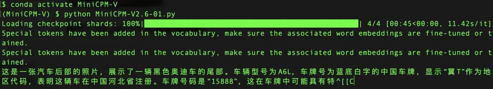
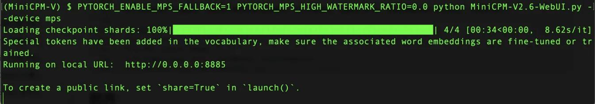
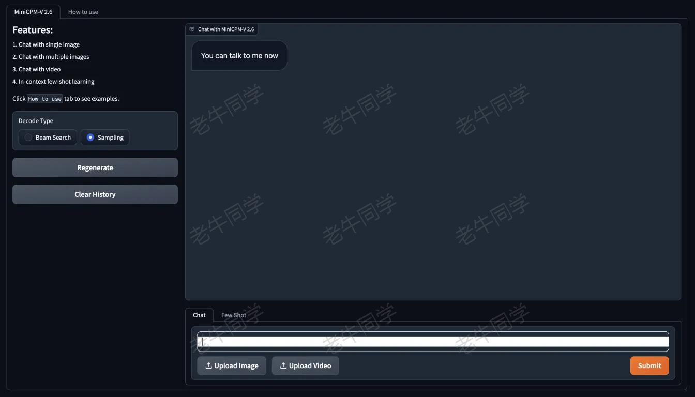

+++
slug = "2024081401"
date = "2024-08-14"
lastmod = "2024-08-14"
title = "MiniCPM-V 2.6 面壁“小钢炮”，多图、视频理解多模态模型，部署和推理实战教程"
description = "MiniCPM-V 最新发布了 2.6 版本，仅 8B 的参数量，但在图片、视频方面理解能力表现卓越，本教程在本地进行部署和推理实战……"
image = "MiniCPM-V.jpg"
tags = [ "AI", "MiniCPM-V", "Qwen2" ]
categories = [ "人工智能" ]
+++

**MiniCPM-V 2.6**是清华和面壁智能最新发布的多模态模型，亦称面壁“小钢炮”，它是 **MiniCPM-V** 系列中最新、性能最佳的模型。该模型基于 **SigLip-400M** 和 **Qwen2-7B** 构建，仅 **8B** 参数，但却取得 **20B** 以下单图、多图、视频理解 3 SOTA 成绩，一举将端侧 AI 多模态能力拉升至全面对标 GPT-4V 水平。

**MiniCPM-V 2.6** 的主要特点包括：

1. 仅 **8B** 参数，单图、多图、视频理解全面超越 GPT-4V ！
2. 小钢炮一口气将实时视频理解、多图联合理解、多图 ICL 等能力首次搬上端侧多模态模型。
3. 端侧友好：量化后端侧内存仅占 **6 GB**，个人笔记本电脑可部署和推理。

更多性能和功能介绍，参见 GitHub 官网：[https://github.com/OpenBMB/MiniCPM-V](https://github.com/OpenBMB/MiniCPM-V)

这么小的参数量，却能带来这么强悍的能力，老牛同学决定部署，和大家一起一探究竟：

1. 准备环境、下载源代码和模型权重文件
2. 模型部署，进行图片理解推理、WebUI 可视化部署和推理

# 环境准备和模型下载

环境准备分为 3 部分：**Miniconda**配置、下载 GitHub 源代码、下载**MiniCPM-V 2.6**模型权重文件。

## Miniconda 配置

**工欲善其事，必先利其器**，大模型研发环境先准备好，为后面部署和推理做好准备。详细教程，大家可以参考之前的文章：[大模型应用研发基础环境配置（Miniconda、Python、Jupyter Lab、Ollama 等）](https://mp.weixin.qq.com/s/P_ufvz4MWVSqv_VM-rJp9w)

```shell
conda create --name MiniCPM-V python=3.10 -y
```

我们创建 Python 虚拟环境：**MiniCPM-V**，同时 Python 的主版本：`3.10`

完成之后，我们激活虚拟环境：`conda activate MiniCPM-V`

## GitHub 源代码下载

GitHub 源代码地址：[https://github.com/OpenBMB/MiniCPM-V.git](https://github.com/OpenBMB/MiniCPM-V.git)

源代码下载的目录：`MiniCPM-V`

```shell
git clone https://github.com/OpenBMB/MiniCPM-V.git MiniCPM-V
```

源代码下载完成之后，我们就可以安装 Python 依赖包了，包依赖列表文件：`MiniCPM-V/requirements.txt`

```plaintext
packaging==23.2
addict==2.4.0
editdistance==0.6.2
einops==0.7.0
fairscale==0.4.0
jsonlines==4.0.0
markdown2==2.4.10
matplotlib==3.7.4
more_itertools==10.1.0
nltk==3.8.1
numpy==1.24.4
opencv_python_headless==4.5.5.64
openpyxl==3.1.2
Pillow==10.1.0
sacrebleu==2.3.2
seaborn==0.13.0
shortuuid==1.0.11
timm==0.9.10
torch==2.1.2
torchvision==0.16.2
tqdm==4.66.1
protobuf==4.25.0
transformers==4.40.0
typing_extensions==4.8.0
uvicorn==0.24.0.post1
sentencepiece==0.1.99
accelerate==0.30.1
socksio==1.0.0
gradio==4.41.0
gradio_client
http://thunlp.oss-cn-qingdao.aliyuncs.com/multi_modal/never_delete/modelscope_studio-0.4.0.9-py3-none-any.whl
eva-decord
```

**特别注意**：最后一个依赖包**decord**通过`pip install decord`安装可能会报如下错误，因此，老牛同学找到了替代的依赖包**eva-decord**，可正常安装。

```shell
(MiniCPM-V) $ pip install decord
ERROR: Could not find a version that satisfies the requirement decord (from versions: none)
ERROR: No matching distribution found for decord
```

## 模型权重文件下载

模型权重文件比较大，我们需要通过 Git 大文件系统下载：

权重文件下载的目录：`MiniCPM-V2.6`

```shell
git lfs install
git clone https://www.modelscope.cn/openbmb/minicpm-v-2_6.git MiniCPM-V2.6
```

下载过程中，如果因网络等原因中断，我们可以继续断点下载：

```shell
cd MiniCPM-V2.6
git lfs pull
```

# 小试牛刀：单图理解体验

老牛同学网上找了一张汽车图片，先试一下“小钢炮”的威力：


由于模型推理过程，需要用到权重模型中的 Python 模块，因此我们把推理的 Python 代码放到模型权重文件目录中：`MiniCPM-V2.6/MiniCPM-V2.6-01.py`

```python
# MiniCPM-V2.6-01.py
import torch
from PIL import Image
from transformers import AutoModel, AutoTokenizer

# 模型权重文件目录
model_dir = '.'

# 加载模型：local_files_only 加载本地模型，trust_remote_code 执行远程代码（必须）
model = AutoModel.from_pretrained(
    model_dir,
    local_files_only=True,
    trust_remote_code=True,
)

# 设置推理模式，如果有卡：model = model.eval().cuda()
model = model.eval()

# 加载分词器
tokenizer = AutoTokenizer.from_pretrained(
    model_dir,
    local_files_only=True,
    trust_remote_code=True,
)

# 测试的汽车尾部图片，可以指定其它目录
image = Image.open('Car-01.jpeg').convert('RGB')

# 图片理解：自然语言理解 + 图片理解
question = '请问这是一张什么图片？'
msgs = [{'role': 'user', 'content': [image, question]}]

res = model.chat(
    image=None,
    msgs=msgs,
    tokenizer=tokenizer,
    sampling=True,
    stream=True
)

# 理解结果
generated_text = ""
for new_text in res:
    generated_text += new_text
    print(new_text, flush=True, end='')
```

图片理解的输出结果如下：



可以看出，**MiniCPM-V 2.6**对图片的理解非常详尽：汽车、奥迪、A6L、尾部、黑色、中国、牌照区域、牌照内容等。

如果要给图片理解推理的结果打分的话，老牛同学打**99 分**，另外**1 分**的不足是给老牛同学自己的：推理速度实在太慢了，只能怪老牛同学的笔记本电脑配置太低了！

# WebUI 可视化，推理自由

我们本地完成图片理解推理之后，在来看看 WebUI 可视化推理界面，体验会更好。同样的，我们把 WebUI 代码放到模型权重文件目录中：`MiniCPM-V2.6/MiniCPM-V2.6-WebUI.py`

```python
# MiniCPM-V2.6-WebUI.py
#!/usr/bin/env python
# encoding: utf-8
import torch
import argparse
from transformers import AutoModel, AutoTokenizer
import gradio as gr
from PIL import Image
from decord import VideoReader, cpu
import io
import os
import copy
import requests
import base64
import json
import traceback
import re
import modelscope_studio as mgr

# 解析参数
parser = argparse.ArgumentParser(description='demo')
parser.add_argument('--device', type=str, default='cuda', help='cuda or mps')
parser.add_argument('--multi-gpus', action='store_true', default=False, help='use multi-gpus')
args = parser.parse_args()
device = args.device
assert device in ['cuda', 'mps']

# 模型权重文件目录
model_path = '.'

# 加载模型和分词器
if 'int4' in model_path:
    if device == 'mps':
        print('Error: running int4 model with bitsandbytes on Mac is not supported right now.')
        exit()
    model = AutoModel.from_pretrained(model_path, local_files_only=True, trust_remote_code=True)
else:
    if args.multi_gpus:
        from accelerate import load_checkpoint_and_dispatch, init_empty_weights, infer_auto_device_map
        with init_empty_weights():
            model = AutoModel.from_pretrained(model_path, local_files_only=True, trust_remote_code=True, attn_implementation='sdpa', torch_dtype=torch.bfloat16)
        device_map = infer_auto_device_map(model, max_memory={0: "10GB", 1: "10GB"},
            no_split_module_classes=['SiglipVisionTransformer', 'Qwen2DecoderLayer'])
        device_id = device_map["llm.model.embed_tokens"]
        device_map["llm.lm_head"] = device_id # firtt and last layer should be in same device
        device_map["vpm"] = device_id
        device_map["resampler"] = device_id
        device_id2 = device_map["llm.model.layers.26"]
        device_map["llm.model.layers.8"] = device_id2
        device_map["llm.model.layers.9"] = device_id2
        device_map["llm.model.layers.10"] = device_id2
        device_map["llm.model.layers.11"] = device_id2
        device_map["llm.model.layers.12"] = device_id2
        device_map["llm.model.layers.13"] = device_id2
        device_map["llm.model.layers.14"] = device_id2
        device_map["llm.model.layers.15"] = device_id2
        device_map["llm.model.layers.16"] = device_id2
        #print(device_map)

        model = load_checkpoint_and_dispatch(model, model_path, local_files_only=True, dtype=torch.bfloat16, device_map=device_map)
    else:
        model = AutoModel.from_pretrained(model_path, local_files_only=True, trust_remote_code=True)
        model = model.to(device=device)
tokenizer = AutoTokenizer.from_pretrained(model_path, local_files_only=True, trust_remote_code=True)

# 设置推理模式
model.eval()

ERROR_MSG = "Error, please retry"
model_name = 'MiniCPM-V 2.6'
MAX_NUM_FRAMES = 64
IMAGE_EXTENSIONS = {'.jpg', '.jpeg', '.png', '.bmp', '.tiff', '.webp'}
VIDEO_EXTENSIONS = {'.mp4', '.mkv', '.mov', '.avi', '.flv', '.wmv', '.webm', '.m4v'}

def get_file_extension(filename):
    return os.path.splitext(filename)[1].lower()

def is_image(filename):
    return get_file_extension(filename) in IMAGE_EXTENSIONS

def is_video(filename):
    return get_file_extension(filename) in VIDEO_EXTENSIONS


form_radio = {
    'choices': ['Beam Search', 'Sampling'],
    #'value': 'Beam Search',
    'value': 'Sampling',
    'interactive': True,
    'label': 'Decode Type'
}


def create_component(params, comp='Slider'):
    if comp == 'Slider':
        return gr.Slider(
            minimum=params['minimum'],
            maximum=params['maximum'],
            value=params['value'],
            step=params['step'],
            interactive=params['interactive'],
            label=params['label']
        )
    elif comp == 'Radio':
        return gr.Radio(
            choices=params['choices'],
            value=params['value'],
            interactive=params['interactive'],
            label=params['label']
        )
    elif comp == 'Button':
        return gr.Button(
            value=params['value'],
            interactive=True
        )


def create_multimodal_input(upload_image_disabled=False, upload_video_disabled=False):
    return mgr.MultimodalInput(upload_image_button_props={'label': 'Upload Image', 'disabled': upload_image_disabled, 'file_count': 'multiple'},
                                        upload_video_button_props={'label': 'Upload Video', 'disabled': upload_video_disabled, 'file_count': 'single'},
                                        submit_button_props={'label': 'Submit'})


def chat(img, msgs, ctx, params=None, vision_hidden_states=None):
    try:
        print('msgs:', msgs)
        answer = model.chat(
            image=None,
            msgs=msgs,
            tokenizer=tokenizer,
            **params
        )
        res = re.sub(r'(<box>.*</box>)', '', answer)
        res = res.replace('<ref>', '')
        res = res.replace('</ref>', '')
        res = res.replace('<box>', '')
        answer = res.replace('</box>', '')
        print('answer:', answer)
        return 0, answer, None, None
    except Exception as e:
        print(e)
        traceback.print_exc()
        return -1, ERROR_MSG, None, None


def encode_image(image):
    if not isinstance(image, Image.Image):
        if hasattr(image, 'path'):
            image = Image.open(image.path).convert("RGB")
        else:
            image = Image.open(image.file.path).convert("RGB")
    # resize to max_size
    max_size = 448*16
    if max(image.size) > max_size:
        w,h = image.size
        if w > h:
            new_w = max_size
            new_h = int(h * max_size / w)
        else:
            new_h = max_size
            new_w = int(w * max_size / h)
        image = image.resize((new_w, new_h), resample=Image.BICUBIC)
    return image
    ## save by BytesIO and convert to base64
    #buffered = io.BytesIO()
    #image.save(buffered, format="png")
    #im_b64 = base64.b64encode(buffered.getvalue()).decode()
    #return {"type": "image", "pairs": im_b64}


def encode_video(video):
    def uniform_sample(l, n):
        gap = len(l) / n
        idxs = [int(i * gap + gap / 2) for i in range(n)]
        return [l[i] for i in idxs]

    if hasattr(video, 'path'):
        vr = VideoReader(video.path, ctx=cpu(0))
    else:
        vr = VideoReader(video.file.path, ctx=cpu(0))
    sample_fps = round(vr.get_avg_fps() / 1)  # FPS
    frame_idx = [i for i in range(0, len(vr), sample_fps)]
    if len(frame_idx)>MAX_NUM_FRAMES:
        frame_idx = uniform_sample(frame_idx, MAX_NUM_FRAMES)
    video = vr.get_batch(frame_idx).asnumpy()
    video = [Image.fromarray(v.astype('uint8')) for v in video]
    video = [encode_image(v) for v in video]
    print('video frames:', len(video))
    return video


def check_mm_type(mm_file):
    if hasattr(mm_file, 'path'):
        path = mm_file.path
    else:
        path = mm_file.file.path
    if is_image(path):
        return "image"
    if is_video(path):
        return "video"
    return None


def encode_mm_file(mm_file):
    if check_mm_type(mm_file) == 'image':
        return [encode_image(mm_file)]
    if check_mm_type(mm_file) == 'video':
        return encode_video(mm_file)
    return None

def make_text(text):
    #return {"type": "text", "pairs": text} # # For remote call
    return text

def encode_message(_question):
    files = _question.files
    question = _question.text
    pattern = r"\[mm_media\]\d+\[/mm_media\]"
    matches = re.split(pattern, question)
    message = []
    if len(matches) != len(files) + 1:
        gr.Warning("Number of Images not match the placeholder in text, please refresh the page to restart!")
    assert len(matches) == len(files) + 1

    text = matches[0].strip()
    if text:
        message.append(make_text(text))
    for i in range(len(files)):
        message += encode_mm_file(files[i])
        text = matches[i + 1].strip()
        if text:
            message.append(make_text(text))
    return message


def check_has_videos(_question):
    images_cnt = 0
    videos_cnt = 0
    for file in _question.files:
        if check_mm_type(file) == "image":
            images_cnt += 1
        else:
            videos_cnt += 1
    return images_cnt, videos_cnt


def count_video_frames(_context):
    num_frames = 0
    for message in _context:
        for item in message["content"]:
            #if item["type"] == "image": # For remote call
            if isinstance(item, Image.Image):
                num_frames += 1
    return num_frames


def respond(_question, _chat_bot, _app_cfg, params_form):
    _context = _app_cfg['ctx'].copy()
    _context.append({'role': 'user', 'content': encode_message(_question)})

    images_cnt = _app_cfg['images_cnt']
    videos_cnt = _app_cfg['videos_cnt']
    files_cnts = check_has_videos(_question)
    if files_cnts[1] + videos_cnt > 1 or (files_cnts[1] + videos_cnt == 1 and files_cnts[0] + images_cnt > 0):
        gr.Warning("Only supports single video file input right now!")
        return _question, _chat_bot, _app_cfg

    if params_form == 'Beam Search':
        params = {
            'sampling': False,
            'num_beams': 3,
            'repetition_penalty': 1.2,
            "max_new_tokens": 2048
        }
    else:
        params = {
            'sampling': True,
            'top_p': 0.8,
            'top_k': 100,
            'temperature': 0.7,
            'repetition_penalty': 1.05,
            "max_new_tokens": 2048
        }

    if files_cnts[1] + videos_cnt > 0:
        params["max_inp_length"] = 4352 # 4096+256
        params["use_image_id"] = False
        params["max_slice_nums"] = 1 if count_video_frames(_context) > 16 else 2

    code, _answer, _, sts = chat("", _context, None, params)

    images_cnt += files_cnts[0]
    videos_cnt += files_cnts[1]
    _context.append({"role": "assistant", "content": [make_text(_answer)]})
    _chat_bot.append((_question, _answer))
    if code == 0:
        _app_cfg['ctx']=_context
        _app_cfg['sts']=sts
    _app_cfg['images_cnt'] = images_cnt
    _app_cfg['videos_cnt'] = videos_cnt

    upload_image_disabled = videos_cnt > 0
    upload_video_disabled = videos_cnt > 0 or images_cnt > 0
    return create_multimodal_input(upload_image_disabled, upload_video_disabled), _chat_bot, _app_cfg


def fewshot_add_demonstration(_image, _user_message, _assistant_message, _chat_bot, _app_cfg):
    ctx = _app_cfg["ctx"]
    message_item = []
    if _image is not None:
        image = Image.open(_image).convert("RGB")
        ctx.append({"role": "user", "content": [encode_image(image), make_text(_user_message)]})
        message_item.append({"text": "[mm_media]1[/mm_media]" + _user_message, "files": [_image]})
    else:
        if _user_message:
            ctx.append({"role": "user", "content": [make_text(_user_message)]})
            message_item.append({"text": _user_message, "files": []})
        else:
            message_item.append(None)
    if _assistant_message:
        ctx.append({"role": "assistant", "content": [make_text(_assistant_message)]})
        message_item.append({"text": _assistant_message, "files": []})
    else:
        message_item.append(None)

    _chat_bot.append(message_item)
    return None, "", "", _chat_bot, _app_cfg


def fewshot_respond(_image, _user_message, _chat_bot, _app_cfg, params_form):
    user_message_contents = []
    _context = _app_cfg["ctx"].copy()
    if _image:
        image = Image.open(_image).convert("RGB")
        user_message_contents += [encode_image(image)]
    if _user_message:
        user_message_contents += [make_text(_user_message)]
    if user_message_contents:
        _context.append({"role": "user", "content": user_message_contents})

    if params_form == 'Beam Search':
        params = {
            'sampling': False,
            'num_beams': 3,
            'repetition_penalty': 1.2,
            "max_new_tokens": 2048
        }
    else:
        params = {
            'sampling': True,
            'top_p': 0.8,
            'top_k': 100,
            'temperature': 0.7,
            'repetition_penalty': 1.05,
            "max_new_tokens": 2048
        }

    code, _answer, _, sts = chat("", _context, None, params)

    _context.append({"role": "assistant", "content": [make_text(_answer)]})

    if _image:
        _chat_bot.append([
            {"text": "[mm_media]1[/mm_media]" + _user_message, "files": [_image]},
            {"text": _answer, "files": []}
        ])
    else:
        _chat_bot.append([
            {"text": _user_message, "files": [_image]},
            {"text": _answer, "files": []}
        ])
    if code == 0:
        _app_cfg['ctx']=_context
        _app_cfg['sts']=sts
    return None, '', '', _chat_bot, _app_cfg


def regenerate_button_clicked(_question, _image, _user_message, _assistant_message, _chat_bot, _app_cfg, params_form):
    if len(_chat_bot) <= 1 or not _chat_bot[-1][1]:
        gr.Warning('No question for regeneration.')
        return '', _image, _user_message, _assistant_message, _chat_bot, _app_cfg
    if _app_cfg["chat_type"] == "Chat":
        images_cnt = _app_cfg['images_cnt']
        videos_cnt = _app_cfg['videos_cnt']
        _question = _chat_bot[-1][0]
        _chat_bot = _chat_bot[:-1]
        _app_cfg['ctx'] = _app_cfg['ctx'][:-2]
        files_cnts = check_has_videos(_question)
        images_cnt -= files_cnts[0]
        videos_cnt -= files_cnts[1]
        _app_cfg['images_cnt'] = images_cnt
        _app_cfg['videos_cnt'] = videos_cnt
        upload_image_disabled = videos_cnt > 0
        upload_video_disabled = videos_cnt > 0 or images_cnt > 0
        _question, _chat_bot, _app_cfg = respond(_question, _chat_bot, _app_cfg, params_form)
        return _question, _image, _user_message, _assistant_message, _chat_bot, _app_cfg
    else:
        last_message = _chat_bot[-1][0]
        last_image = None
        last_user_message = ''
        if last_message.text:
            last_user_message = last_message.text
        if last_message.files:
            last_image = last_message.files[0].file.path
        _chat_bot = _chat_bot[:-1]
        _app_cfg['ctx'] = _app_cfg['ctx'][:-2]
        _image, _user_message, _assistant_message, _chat_bot, _app_cfg = fewshot_respond(last_image, last_user_message, _chat_bot, _app_cfg, params_form)
        return _question, _image, _user_message, _assistant_message, _chat_bot, _app_cfg


def flushed():
    return gr.update(interactive=True)


def clear(txt_message, chat_bot, app_session):
    txt_message.files.clear()
    txt_message.text = ''
    chat_bot = copy.deepcopy(init_conversation)
    app_session['sts'] = None
    app_session['ctx'] = []
    app_session['images_cnt'] = 0
    app_session['videos_cnt'] = 0
    return create_multimodal_input(), chat_bot, app_session, None, '', ''


def select_chat_type(_tab, _app_cfg):
    _app_cfg["chat_type"] = _tab
    return _app_cfg


init_conversation = [
    [
        None,
        {
            # The first message of bot closes the typewriter.
            "text": "You can talk to me now",
            "flushing": False
        }
    ],
]


css = """
video { height: auto !important; }
.example label { font-size: 16px;}
"""

introduction = """

## Features:
1. Chat with single image
2. Chat with multiple images
3. Chat with video
4. In-context few-shot learning

Click `How to use` tab to see examples.
"""


with gr.Blocks(css=css) as demo:
    with gr.Tab(model_name):
        with gr.Row():
            with gr.Column(scale=1, min_width=300):
                gr.Markdown(value=introduction)
                params_form = create_component(form_radio, comp='Radio')
                regenerate = create_component({'value': 'Regenerate'}, comp='Button')
                clear_button = create_component({'value': 'Clear History'}, comp='Button')

            with gr.Column(scale=3, min_width=500):
                app_session = gr.State({'sts':None,'ctx':[], 'images_cnt': 0, 'videos_cnt': 0, 'chat_type': 'Chat'})
                chat_bot = mgr.Chatbot(label=f"Chat with {model_name}", value=copy.deepcopy(init_conversation), height=600, flushing=False, bubble_full_width=False)

                with gr.Tab("Chat") as chat_tab:
                    txt_message = create_multimodal_input()
                    chat_tab_label = gr.Textbox(value="Chat", interactive=False, visible=False)

                    txt_message.submit(
                        respond,
                        [txt_message, chat_bot, app_session, params_form],
                        [txt_message, chat_bot, app_session]
                    )

                with gr.Tab("Few Shot") as fewshot_tab:
                    fewshot_tab_label = gr.Textbox(value="Few Shot", interactive=False, visible=False)
                    with gr.Row():
                        with gr.Column(scale=1):
                            image_input = gr.Image(type="filepath", sources=["upload"])
                        with gr.Column(scale=3):
                            user_message = gr.Textbox(label="User")
                            assistant_message = gr.Textbox(label="Assistant")
                            with gr.Row():
                                add_demonstration_button = gr.Button("Add Example")
                                generate_button = gr.Button(value="Generate", variant="primary")
                    add_demonstration_button.click(
                        fewshot_add_demonstration,
                        [image_input, user_message, assistant_message, chat_bot, app_session],
                        [image_input, user_message, assistant_message, chat_bot, app_session]
                    )
                    generate_button.click(
                        fewshot_respond,
                        [image_input, user_message, chat_bot, app_session, params_form],
                        [image_input, user_message, assistant_message, chat_bot, app_session]
                    )

                chat_tab.select(
                    select_chat_type,
                    [chat_tab_label, app_session],
                    [app_session]
                )
                chat_tab.select( # do clear
                    clear,
                    [txt_message, chat_bot, app_session],
                    [txt_message, chat_bot, app_session, image_input, user_message, assistant_message]
                )
                fewshot_tab.select(
                    select_chat_type,
                    [fewshot_tab_label, app_session],
                    [app_session]
                )
                fewshot_tab.select( # do clear
                    clear,
                    [txt_message, chat_bot, app_session],
                    [txt_message, chat_bot, app_session, image_input, user_message, assistant_message]
                )
                chat_bot.flushed(
                    flushed,
                    outputs=[txt_message]
                )
                regenerate.click(
                    regenerate_button_clicked,
                    [txt_message, image_input, user_message, assistant_message, chat_bot, app_session, params_form],
                    [txt_message, image_input, user_message, assistant_message, chat_bot, app_session]
                )
                clear_button.click(
                    clear,
                    [txt_message, chat_bot, app_session],
                    [txt_message, chat_bot, app_session, image_input, user_message, assistant_message]
                )

    with gr.Tab("How to use"):
        with gr.Column():
            with gr.Row():
                image_example = gr.Image(value="http://thunlp.oss-cn-qingdao.aliyuncs.com/multi_modal/never_delete/m_bear2.gif", label='1. Chat with single or multiple images', interactive=False, width=400, elem_classes="example")
                example2 = gr.Image(value="http://thunlp.oss-cn-qingdao.aliyuncs.com/multi_modal/never_delete/video2.gif", label='2. Chat with video', interactive=False, width=400, elem_classes="example")
                example3 = gr.Image(value="http://thunlp.oss-cn-qingdao.aliyuncs.com/multi_modal/never_delete/fshot.gif", label='3. Few shot', interactive=False, width=400, elem_classes="example")


# 启动WebUI: http://127.0.0.1:8885
demo.launch(share=False, debug=True, show_api=False, server_port=8885, server_name="0.0.0.0")
```

WebUI 支持 GPU 和苹果 CPU 推理，启动方式分别为：

- GPU：`python web_demo_2.6.py --device cuda`
- 苹果 MPS：`PYTORCH_ENABLE_MPS_FALLBACK=1 PYTORCH_MPS_HIGH_WATERMARK_RATIO=0.0 python web_demo_2.6.py --device mps`



浏览器打开地址：**http://0.0.0.0:8885/** ，可以看到可视化界面：



WebUI 功能支持：**自然语言**对话、上传**图片**、上传**视频**等理解。

# 终极考验：视频理解体验

老牛同学受限于电脑配置，视频预计推理速度将会极慢，因此不做演示。根据官方代码，视频推理和图片推理类似，代码样例如下：

```python
import torch
from PIL import Image
from modelscope import AutoModel, AutoTokenizer
from decord import VideoReader, cpu

# 模型权重文件目录
model_dir = '.'

# 加载模型：local_files_only 加载本地模型，trust_remote_code 执行远程代码（必须）
model = AutoModel.from_pretrained(
    model_dir,
    local_files_only=True,
    trust_remote_code=True,
)

# 设置推理模式，如果有卡：model = model.eval().cuda()
model = model.eval()

# 加载分词器
tokenizer = AutoTokenizer.from_pretrained(
    model_dir,
    local_files_only=True,
    trust_remote_code=True,
)


MAX_NUM_FRAMES=64

def encode_video(video_path):
    def uniform_sample(l, n):
        gap = len(l) / n
        idxs = [int(i * gap + gap / 2) for i in range(n)]
        return [l[i] for i in idxs]

    vr = VideoReader(video_path, ctx=cpu(0))
    sample_fps = round(vr.get_avg_fps() / 1)  # FPS
    frame_idx = [i for i in range(0, len(vr), sample_fps)]
    if len(frame_idx) > MAX_NUM_FRAMES:
        frame_idx = uniform_sample(frame_idx, MAX_NUM_FRAMES)
    frames = vr.get_batch(frame_idx).asnumpy()
    frames = [Image.fromarray(v.astype('uint8')) for v in frames]
    print('num frames:', len(frames))
    return frames

# 视频文件路径
video_path="~/Car.mp4"

frames = encode_video(video_path)

question = "请问这是一个什么视频？"
msgs = [
    {'role': 'user', 'content': frames + [question]},
]

# Set decode params for video
params={}
params["use_image_id"] = False
params["max_slice_nums"] = 2 # 如果cuda OOM且视频分辨率大于448*448 可设为1

answer = model.chat(
    image=None,
    msgs=msgs,
    tokenizer=tokenizer,
    **params
)

print(answer)
```

老牛同学在这里，引用了官方的绘制兔子头像的一个视频理解：

|

[基于 Qwen2/Lllama3 等大模型，部署团队私有化 RAG 知识库系统的详细教程（Docker+AnythingLLM）](https://mp.weixin.qq.com/s/PpY3k3kReKfQdeOJyrB6aw)

[使用 Llama3/Qwen2 等开源大模型，部署团队私有化 Code Copilot 和使用教程](https://mp.weixin.qq.com/s/vt1EXVWtwm6ltZVYtB4-Tg)

[基于 Qwen2 大模型微调技术详细教程（LoRA 参数高效微调和 SwanLab 可视化监控）](https://mp.weixin.qq.com/s/eq6K8_s9uX459OeUcRPEug)

[LivePortrait 数字人：开源的图生视频模型，本地部署和专业视频制作详细教程](https://mp.weixin.qq.com/s/NYTQVBC4ug73o_VdQy-TeQ)

[本地部署 GLM-4-9B 清华智谱开源大模型方法和对话效果体验](https://mp.weixin.qq.com/s/g7lDfnRRGdrHqN7WGMSkAg)

[玩转 AI，笔记本电脑安装属于自己的 Llama 3 8B 大模型和对话客户端](https://mp.weixin.qq.com/s/MekCUJDhKzuUnoykkGoH2g)

[ChatTTS 开源文本转语音模型本地部署、API 使用和搭建 WebUI 界面](https://mp.weixin.qq.com/s/rL3vyJ_xEj7GGoKaxUh8_A)

[Ollama 完整教程：本地 LLM 管理、WebUI 对话、Python/Java 客户端 API 应用](https://mp.weixin.qq.com/s/majDONtuAUzN2SAaYWxH1Q)


