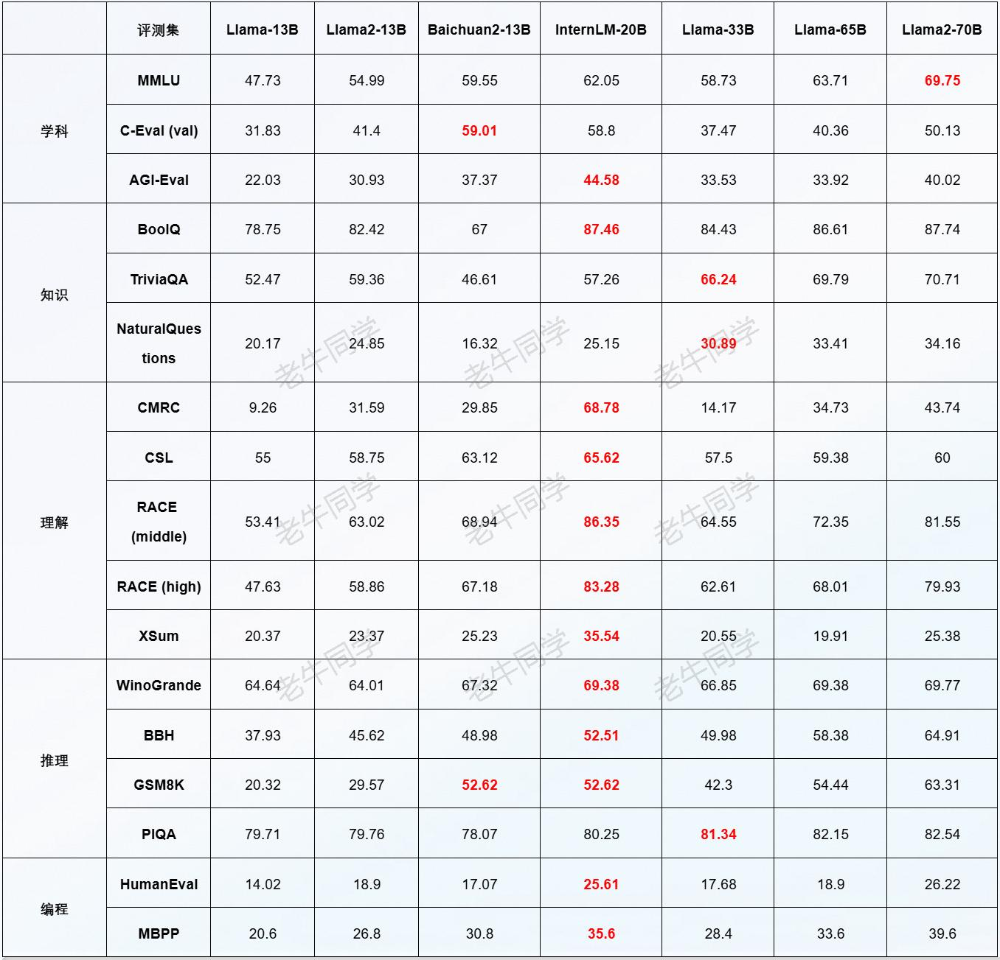
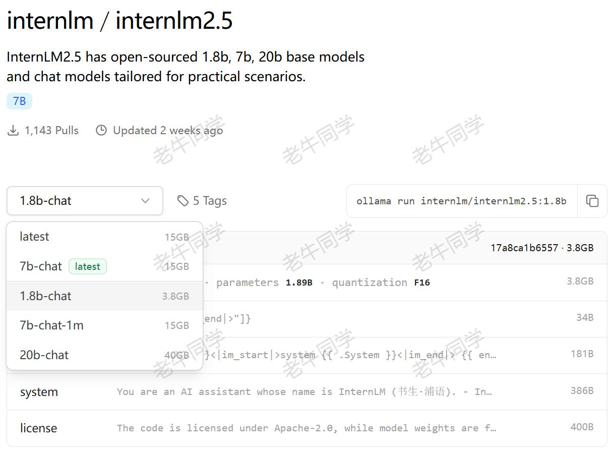
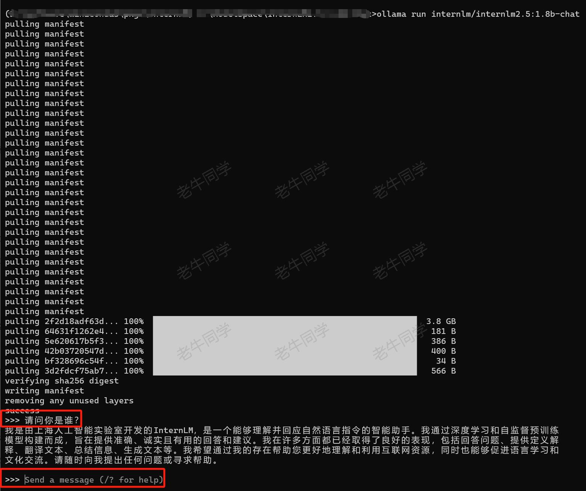
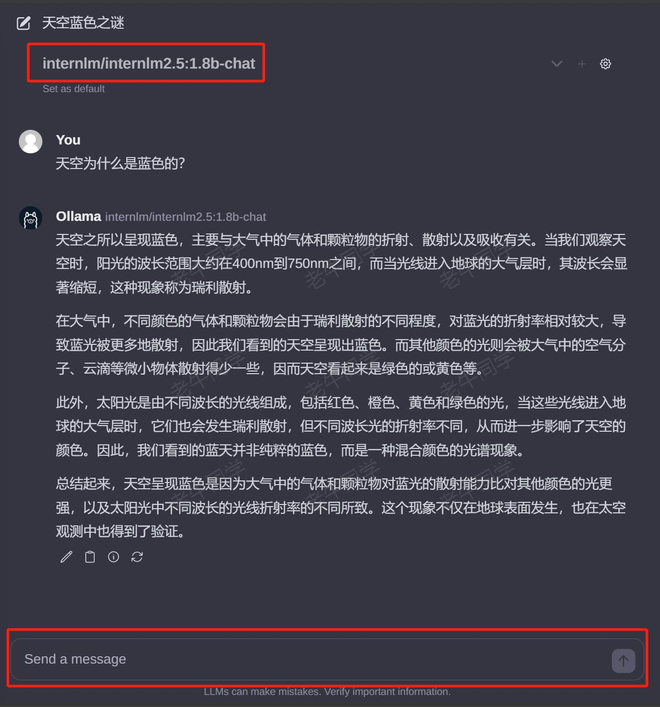

+++
slug = "2024082301"
date = "2024-08-23"
lastmod = "2024-08-23"
title = "InternLM 2.5 书生·浦语 开源大模型本地部署体验"
description = "上海人工智能实验室发布了书生·浦语（InternLM）新开源版本，增强了在复杂场景下的推理能力，本文介绍在本地进行部署和推理……"
image = "InternLM.jpg"
tags = [ "AI", "InternLM", "Ollama" ]
categories = [ "人工智能" ]
+++

老牛同学之前偶尔刷到过**InternLM**大模型相关的介绍文章，因为在老牛同学心中，**Qwen2**千问才是国内开源模型中最适合自己的大模型，原因是自己在本地部署和应用**Qwen2**都非常满意，所以没有在意**InternLM**大模型，也就没有动力去了解它。

今天老牛同学又刷到**InternLM**大模型发布**1.8B**新开源版本的文章，同时还知道了**书生·浦语**是它的中文名。因老牛同学在上海生活了十几年了，当看到**浦**字时有点敏感，猜测想是不是代表**上海浦东**的意思？所以特意去查了一下，官网介绍：书生·浦语（InternLM）大语言模型由上海人工智能实验室联合多家机构共同推出。官网并没有解释**浦**字的含义，因此老牛同学就算自己的猜测是对的了。

既然是自己生活的城市发布的大语音模型，那就没有理由不去了解一下了，顺便部署体验一翻：

- **InternLM** 大模型的简单介绍，顺便介绍一下官网的评测数据，方便大家阅读
- 通过 Ollama 本地部署 **InternLM** 大模型，同时通过不同方式进行推理调用，包括 API 调用、WebUI 等

# 书生·浦语（InternLM）介绍

**书生·浦语**系列大模型主页：[https://internlm.intern-ai.org.cn](https://internlm.intern-ai.org.cn)

**书生·浦语（InternLM）** 由上海人工智能实验室（上海 AI 实验室）联合推出，上海 AI 实验室是我国人工智能领域的新型科研机构，它的研究方向包括：人工智能基础理论、人工智能开放平台、人工智能基础软件和基础硬件系统、人工智能应用、人工智能核心技术和人工智能伦理与政策。感觉就是个政府机构，老牛同学生活了这么多年竟然都不知道！

**书生·浦语（InternLM）** 自 2023 年 6 月 7 日发布第 1 个大模型，到本月 8 月 4 号，开源发布**InternLM 2.5 1.8B**小尺寸模型，目前**InternLM 2.5**有 3 个不同尺寸：**1.8B**、**7B**和**20B**

同时，针对**20B**参数量版本，官网提供了一些评测数据：[https://github.com/InternLM/InternLM](https://github.com/InternLM/InternLM)。**InternLM-20B**显著领先主流的 13B 量级开源模型，在语言、知识学科综合评测上都超越 Llama2-70B，在推理能力评测上和 Llama2-70B 持平，而知识方面则仍有一定差距。



# 本地部署 InternLM 2.5 大模型

目前 Ollama 已经支持**InternLM 2.5**大模型了：[https://ollama.com/internlm/internlm2.5:1.8b-chat](https://ollama.com/internlm/internlm2.5:1.8b-chat)



关于 Ollama 详细介绍，老牛同学之前有专门的文章，本文不在累赘：[Ollama 完整教程：本地 LLM 管理、WebUI 对话、Python/Java 客户端 API 应用](https://mp.weixin.qq.com/s/majDONtuAUzN2SAaYWxH1Q)

我们可以根据自己的需要选择不同的参数版本，老牛同学选择的最新发布的**1.8B**参数量版本。

**下载模型权重文件**：`ollama run internlm/internlm2.5:1.8b-chat`

下载完成之后，其实我们已经有了个控制台的对话界面了：



接下来，我们就可以通过多种方式使用推理服务了，包括：HTTP、Python 客户端、Java 客户端、WebUI 等，老牛同学简单介绍以下 WebUI 方式：

Ollama 自带控制台对话界面体验总归是不太好，接下来部署 Web 可视化聊天界面：

1. 下载并安装 Node.js 工具：[https://nodejs.org/zh-cn](https://nodejs.org/zh-cn)
2. 下载`ollama-webui`工程代码：`git clone https://github.com/ollama-webui/ollama-webui-lite ollama-webui`
3. 切换`ollama-webui`代码的目录：`cd ollama-webui`
4. 设置 Node.js 工具包镜像源（下载提速）：`npm config set registry http://mirrors.cloud.tencent.com/npm/`
5. 安装 Node.js 依赖的工具包：`npm install`
6. 最后，启动 Web 可视化界面：`npm run dev`

```shell
>npm run dev

> ollama-webui-lite@0.0.1 dev
> vite dev --host --port 3000

  VITE v4.5.2  ready in 16023 ms

  ➜  Local:   http://localhost:3000/
  ➜  Network: http://192.168.101.35:3000/
  ➜  Network: http://172.27.112.1:3000/
  ➜  Network: http://172.25.64.1:3000/
  ➜  press h to show help
```

如果看到以上输出，代表 Web 可视化界面已经成功了！

浏览器打开 Web 可视化界面：[http://localhost:3000/](http://localhost:3000)



# 总结：InternLM 其他能力

以上是老牛同学介绍如何部署和推理**书生·浦语（InternLM）** 大模型，并进行最简单的对话推理，**InternLM**的其他能力相关介绍，我们在官网都可以查到，包括：复杂的多步推理、多轮对话意图理解、对输出格式的控制和操作和复杂指令的理解。大家可以在本地进行体验。

[vLLM CPU 和 GPU 模式署和推理 Qwen2 等大语言模型详细教程](https://mp.weixin.qq.com/s/KM-Z6FtVfaySewRTmvEc6w)

[MiniCPM-V 2.6 面壁“小钢炮”，多图、视频理解多模态模型，部署和推理实战教程](https://mp.weixin.qq.com/s/x2RKTvFeKgRvi982X5cymA)

[基于 Qwen2/Lllama3 等大模型，部署团队私有化 RAG 知识库系统的详细教程（Docker+AnythingLLM）](https://mp.weixin.qq.com/s/PpY3k3kReKfQdeOJyrB6aw)

[使用 Llama3/Qwen2 等开源大模型，部署团队私有化 Code Copilot 和使用教程](https://mp.weixin.qq.com/s/vt1EXVWtwm6ltZVYtB4-Tg)

[基于 Qwen2 大模型微调技术详细教程（LoRA 参数高效微调和 SwanLab 可视化监控）](https://mp.weixin.qq.com/s/eq6K8_s9uX459OeUcRPEug)


