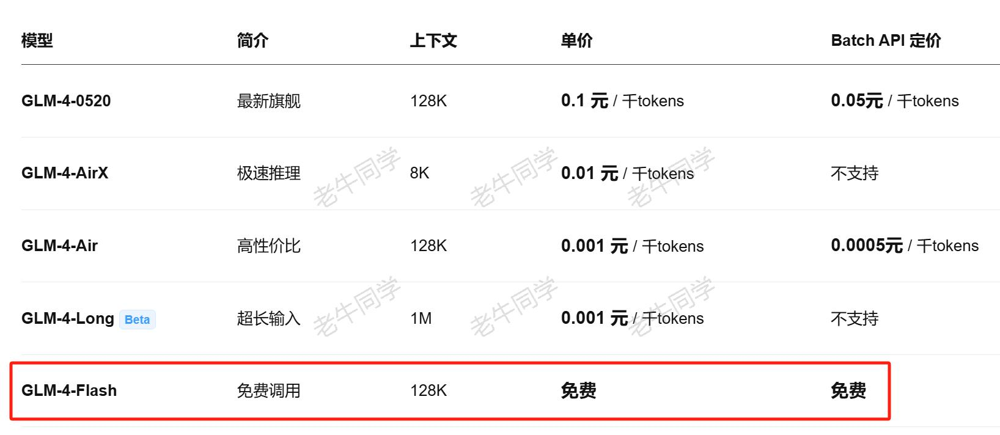
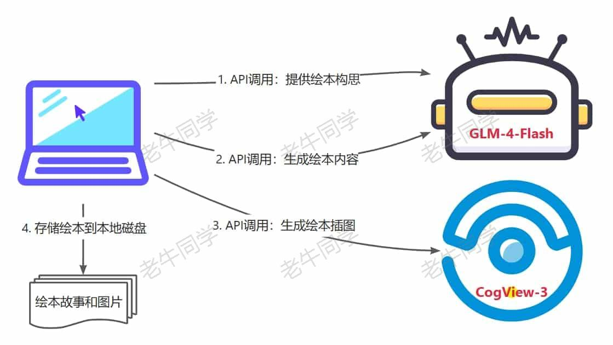
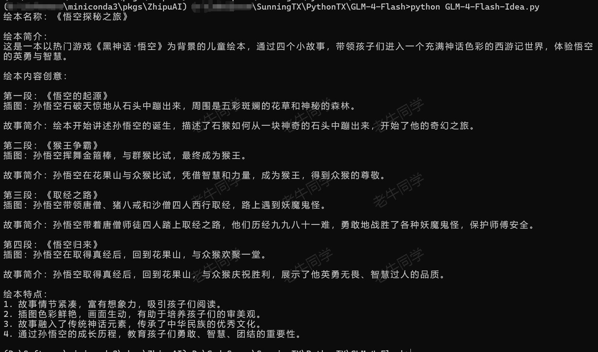
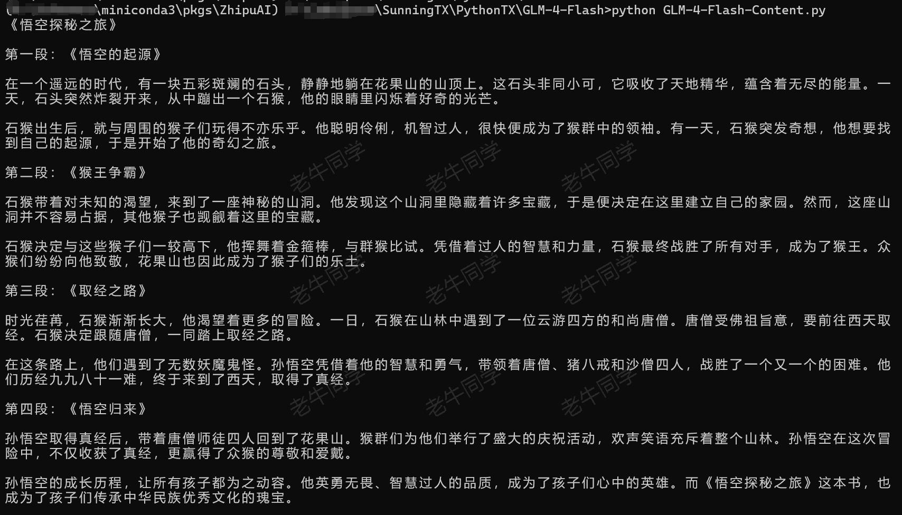
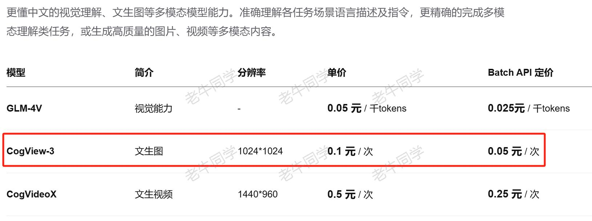
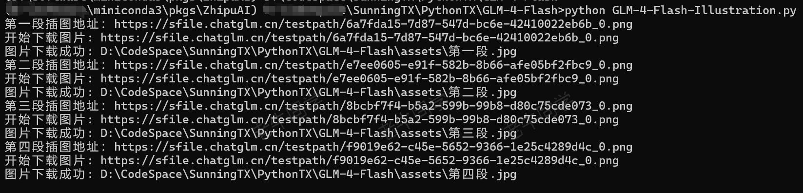
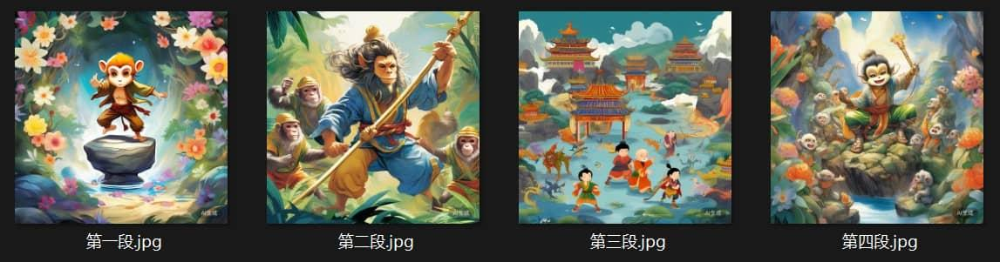

+++
slug = "2024082701"
date = "2024-08-26"
lastmod = "2024-08-26"
title = "GLM-4-Flash 大模型API免费了，手把手构建“儿童绘本”应用实战（附源码）"
description = "GLM-4-Flash 大模型API免费了，我们本文基于免费API构建一个“儿童绘本”应用，包括使用文生图产出绘本故事插图……"
image = "00.jpg"
tags = [ "AI", "GLM-4", "CogView", "AI应用" ]
categories = [ "人工智能" ]
+++

老牛同学刚刷到了一条劲爆的消息，**GLM-4-Flash**大模型推理 API 免费了：[https://bigmodel.cn/pricing](https://bigmodel.cn/pricing)



老牛同学一直觉得上次阿里云百炼平台为期 1 个月免费额度的“羊毛”已经够大了（[太卷了，阿里云免费 1 个月大模型算力额度，玩转 Llama3.1/Qwen2 等训练推理](https://mp.weixin.qq.com/s/xclHiuy7gFPUlWZW5oOBSg)），但经过老牛同学在智谱 AI 官网反复确认之后，竟然不是标题党，它是真的**免费**，感觉大模型厂商的“羊毛”简直是没有最大，只有更大（老牛同学这次要站智谱 AI 这边）！

老牛同学本地部署推理和体验的大模型有很多，且第一个就是**GLM-4-9B**（是的，比**Qwen2-7B**还要早一些），也一直关注着智谱 AI 推出的大模型：

- 第一次是 6 月 8 号：**GLM-4-9B**大模型开源，且推理能力亮点突出，老牛还写了一篇本地部署推理的文章（[本地部署 GLM-4-9B 清华智谱开源大模型方法和对话效果体验](https://mp.weixin.qq.com/s/g7lDfnRRGdrHqN7WGMSkAg)），由于当时**GLM-4**本地部署门槛还有点高，因此这篇文章还获得了不少网友的关注，老牛同学也收到不少网友的关于部署过程的私信和留言
- 第二次是 7 月 9 号（1 个月后）：**GLM-4-9B**支持通过 Ollama 部署（[https://ollama.com/library/glm4](https://ollama.com/library/glm4)），本地部署和推理的门槛降低不少，因此老牛同学顺势写了一篇普及 Ollama 使用的文章，文章中案例就是用**GLM-4-9B**（[Ollama 完整教程：本地 LLM 管理、WebUI 对话、Python/Java 客户端 API 应用](https://mp.weixin.qq.com/s/majDONtuAUzN2SAaYWxH1Q)）
- 第三次是 8 月 27 号也就是今天（差不多也是 1 个月后）：智谱 AI 大模型开放平台官网（[https://bigmodel.cn/](https://bigmodel.cn)）宣布**GLM-4-Flash**大模型 API 免费使用，这不又激起老牛同学的兴致，也因此有了本文

从老牛同学微观视角我们可以看到，智谱 AI 从开放开源大模型、到降低大模型使用门槛、在到面向大众免费，不段在诠释着**技术进步**和**普惠 AI**，就如智谱 AI 的愿景那样：实现“让机器像人一样思考”，让技术更好地服务社会，打造支持不同场景、不同方向的智能应用程序的底层人工智能架构，不断开拓努力实现人工智能的行业普惠。

**GLM-4-Flash**免费了，我们除了高兴和感慨之外，**羊毛**不常有，我们总得要“薅”一把。这次老牛同学就不做微调了，咱们来做一个我们生活场景：**儿童绘本**应用！

大家可能会问，为什么选择**儿童绘本**这个方向呢？其实原因一点都不复杂：老牛同学一时半会儿也没有想到好的创意（特别期待大家留言新创意，老牛同学愿意协助实现）；再者老牛同学家绘本要又更新了（存量的绘本小孩都读腻了）；并且这个应用不是很复杂，不至于一篇文章还写不完，还要有续集。如果我们能基于免费的大模型 API 能力，随时生成不同的儿童绘本，岂不是妙哉？

针对“儿童绘本”应用，老牛同学的构思如下：

1. 面向**7~10**小朋友，绘本构思由大模型产出，最好能与当前热点相关（如：最近火爆天的**黑神话·悟空**游戏）
2. 绘本故事内容也由大模型产出，需要积极向上，饱含正能量
3. 绘本情节结构分为 4 个段，每个段 300 个汉字左右，整个绘本不超过 1500 个汉字
4. 每一段绘本情节均需要配一张插图
5. 最后：绘本内容和图片存储到电脑本地磁盘

在**儿童绘本**应用中，我们需要用到 2 个大模型：

- **GLM-4-Flash**大语音模型，主要是提供绘本构思和产出绘本内容
- **CogView-3**文生图大模型，主要是生成绘本插图



确定了应用内容，我们就开始行动了~

# 注册&申请 API Key

想要使用大模型推理 API，我们首先得拿到 API Key，打开智谱 AI 开放平台官网：[https://bigmodel.cn/](https://bigmodel.cn/)

完成注册和实名认证后，我们打开**控制台**，即可复制 API Key 了：[https://bigmodel.cn/usercenter/apikeys](https://bigmodel.cn/usercenter/apikeys)


我们可以把复制的 API Key 放到环境变量中（老牛同学的环境变量名：`ZhipuAI-APIKey`），免费在代码里硬编码，下面老牛同学代码演示均从环境变量获取！

# API 调用前置准备和配置

这部分包括 Python 环境准备、SDK 依赖包安装和 API 验证：

【**Python 研发环境**】

**工欲善其事，必先利其器**，我们通过**Miniconda**管理 Python 虚拟环境，**Miniconda**的安装和使用可以参考老牛同学之前的文章：[大模型应用研发基础环境配置（Miniconda、Python、Jupyter Lab、Ollama 等）](https://mp.weixin.qq.com/s/P_ufvz4MWVSqv_VM-rJp9w)

第一步：设置 Python 虚拟环境：

```shell
# Python虚拟环境名：ZhipuAI，版本号：3.10
conda create --name ZhipuAI python=3.10 -y

# 激活虚拟环境
conda activate ZhipuAI
```

第二步：安装 Python SDK 依赖包

```shell
pip install zhipuai -U
```

以上简单的 2 步，我们即完成了前期环境准备工作了，接下来我们简单验证一下准备工作是否达标：

【**开放平台 API 验证**】

```python
# GLM-4-Flash-Test.py
from zhipuai import ZhipuAI
import os

# 环境变量中获取API Key内容
client = ZhipuAI(
  api_key=os.environ.get('ZhipuAI-APIKey')
)

# 使用GLM-4-Flash大模型进行验证
response = client.chat.completions.create(
  model='glm-4-flash',
  messages=[
    {'role': 'user', 'content': '你好，我是老牛同学，请问你是谁？'},
  ],
  stream=True,
)

# 流式输出
for chunk in response:
    print(chunk.choices[0].delta.content, end='')

print('')
```

执行验证代码，可以看到如果输出：`python GLM-4-Flash-Test.py`

```shell
>python GLM-4-Flash-Test.py
你好，老牛同学！我是人工智能助手智谱清言，很高兴为您服务，有什么可以帮助您的吗？

```

原来**智谱清言**就是**GLM-4-Flash**的中文名，又涨了一点姿势~

最后，我们可以查看 API 接口文档，准备我们的**儿童绘本**应用的研发了：

【**大模型接口文档**】

**GLM-4-Flash**接口文档：[https://bigmodel.cn/dev/api#glm-4](https://bigmodel.cn/dev/api#glm-4)

**CogView-3**接口文档：[https://bigmodel.cn/dev/api#cogview](https://bigmodel.cn/dev/api#cogview)

# “儿童绘本”实战 1：绘本构思

“儿童绘本”应用实战的第一步，就是我们给大模型提供一个主题（如：黑神话·悟空），让大模型产出绘本构思：`GLM-4-Flash-Idea.py`

```python
# GLM-4-Flash-Idea.py
# 构造客户端
def make_client():
  return ZhipuAI(
    api_key=os.environ.get('ZhipuAI-APIKey')
  )


#
# 第一步：使用GLM-4-Flash大模型产出创意
#
def make_idea():
  response = make_client().chat.completions.create(
    model='glm-4-flash',
    messages=[
      {'role': 'system', 'content': '你是一位儿童绘本的内容创意专家，你的任务是根据用户提供的主题，提供适合7岁到10岁小学生阅读的、专业的、有见地的绘本内容创意。'},
      {'role': 'user', 'content': '请以“黑神话·悟空”这款最近热门的游戏为主题，提供儿童绘本创意。要求：绘本分为4个小段，每个小段需要有插图。'},
    ],
    stream=True,
  )

  # 流式输出
  idea = ''
  for chunk in response:
      idea += chunk.choices[0].delta.content

  return idea

# 运行
if __name__ == '__main__':
  idea = make_idea()
  print(idea)
```

和大模型推理 API 验证的代码相比，就只是 Prompt 提示不一样。有关 Prompt 提示词编写小技巧，可以查看老牛同学之前的文章：[高效编写大模型 Prompt 提示词，解锁 AI 无限创意潜能](https://mp.weixin.qq.com/s/gaLw3yP-oANvQyjRSkVjyw)

运行以上绘本创意代码的结果如下：`python GLM-4-Flash-Idea.py`



从提供的创意结果来看，**GLM-4-Flash**还是有 2 把刷子，产出的创意非常完整，包括：绘本名称、绘本简介、绘本内容、故事内容和绘本特点。面面俱到，比老牛同学的设想要丰富多了：

```plaintext
绘本名称：《悟空探秘之旅》

绘本简介：
这是一本以热门游戏《黑神话·悟空》为背景的儿童绘本，通过四个小故事，带领孩子们进入一个充满神话色彩的西游记世界，体验悟空 的英勇与智慧。

绘本内容创意：

第一段：《悟空的起源》
插图：孙悟空石破天惊地从石头中蹦出来，周围是五彩斑斓的花草和神秘的森林。

故事简介：绘本开始讲述孙悟空的诞生，描述了石猴如何从一块神奇的石头中蹦出来，开始了他的奇幻之旅。

第二段：《猴王争霸》
插图：孙悟空挥舞金箍棒，与群猴比试，最终成为猴王。

故事简介：孙悟空在花果山与众猴比试，凭借智慧和力量，成为猴王，得到众猴的尊敬。

第三段：《取经之路》
插图：孙悟空带领唐僧、猪八戒和沙僧四人西行取经，路上遇到妖魔鬼怪。

故事简介：孙悟空带着唐僧师徒四人踏上取经之路，他们历经九九八十一难，勇敢地战胜了各种妖魔鬼怪，保护师傅安全。

第四段：《悟空归来》
插图：孙悟空在取得真经后，回到花果山，与众猴欢聚一堂。

故事简介：孙悟空取得真经后，回到花果山，与众猴庆祝胜利，展示了他英勇无畏、智慧过人的品质。

绘本特点：
1. 故事情节紧凑，富有想象力，吸引孩子们阅读。
2. 插图色彩鲜艳，画面生动，有助于培养孩子们的审美观。
3. 故事融入了传统神话元素，传承了中华民族的优秀文化。
4. 通过孙悟空的成长历程，教育孩子们勇敢、智慧、团结的重要性。
```

# “儿童绘本”实战 2：绘本内容

“儿童绘本”应用实战的第二步，就是根据第一步提供的创意，完善故事内容情节：`GLM-4-Flash-Content.py`

```python
# GLM-4-Flash-Content.py

# ..... 前面省略

#
# 第二步：使用GLM-4-Flash大模型生成故事内容
#
def make_content(idea:str):
  response = make_client().chat.completions.create(
    model='glm-4-flash',
    messages=[
      {'role': 'system', 'content': '你是一位儿童绘本的故事内容编写专家，你编写的故事幽默有趣，特别适合7岁到10岁的小学生阅读，你的任务是根据用户提供的儿童绘本创意，完成编写的整个故事内容。'},
      {'role': 'user', 'content': f'请根据儿童绘本创意，完成编写整个故事内容。\n\n故事内容要求：\n故事内容分为4个小段，每个小段500个汉字左右，故事总长度不得超过2000个汉字。\n\n儿童绘本创意：\n{idea}'},
    ],
    stream=True,
  )

  # 流式输出
  content = ''
  for chunk in response:
      content += chunk.choices[0].delta.content

  return content

# 运行
if __name__ == '__main__':
  idea = make_idea()
  content = make_content(content)
  print(content)
```

和第一步的代码类似，我们主要是调整了 Prompt 提示词。Prompt 提示中，创意的内容完全复制第一步的内容，一个字都不需要修改。

运行以上绘本故事内容代码的结果如下：`python GLM-4-Flash-Content.py`



还别说，故事内容还算有模有样：

```plaintext
# 《悟空探秘之旅》

这是一本以热门游戏《黑神话·悟空》为背景的儿童绘本，通过四个小故事，带领孩子们进入一个充满神话色彩的西游记世界，体验悟空 的英勇与智慧。

# 第一段：《悟空的起源》

在一个遥远的时代，有一块五彩斑斓的石头，静静地躺在花果山的山顶上。这石头非同小可，它吸收了天地精华，蕴含着无尽的能量。一天，石头突然炸裂开来，从中蹦出一个石猴，他的眼睛里闪烁着好奇的光芒。

石猴出生后，就与周围的猴子们玩得不亦乐乎。他聪明伶俐，机智过人，很快便成为了猴群中的领袖。有一天，石猴突发奇想，他想要找到自己的起源，于是开始了他的奇幻之旅。

# 第二段：《猴王争霸》

石猴带着对未知的渴望，来到了一座神秘的山洞。他发现这个山洞里隐藏着许多宝藏，于是便决定在这里建立自己的家园。然而，这座山洞并不容易占据，其他猴子也觊觎着这里的宝藏。

石猴决定与这些猴子们一较高下，他挥舞着金箍棒，与群猴比试。凭借着过人的智慧和力量，石猴最终战胜了所有对手，成为了猴王。众猴们纷纷向他致敬，花果山也因此成为了猴子们的乐土。

# 第三段：《取经之路》

时光荏苒，石猴渐渐长大，他渴望着更多的冒险。一日，石猴在山林中遇到了一位云游四方的和尚唐僧。唐僧受佛祖旨意，要前往西天取经。石猴决定跟随唐僧，一同踏上取经之路。

在这条路上，他们遇到了无数妖魔鬼怪。孙悟空凭借着他的智慧和勇气，带领着唐僧、猪八戒和沙僧四人，战胜了一个又一个的困难。他们历经九九八十一难，终于来到了西天，取得了真经。

# 第四段：《悟空归来》

孙悟空取得真经后，带着唐僧师徒四人回到了花果山。猴群们为他们举行了盛大的庆祝活动，欢声笑语充斥着整个山林。孙悟空在这次冒险中，不仅收获了真经，更赢得了众猴的尊敬和爱戴。

孙悟空的成长历程，让所有孩子都为之动容。他英勇无畏、智慧过人的品质，成为了孩子们心中的英雄。而《悟空探秘之旅》这本书，也成为了孩子们传承中华民族优秀文化的瑰宝。
```

# “儿童绘本”实战 3：绘本插图

绘本插图我们需要用到另外一个大模型：**CogView-3**，它可以根据文本生成图片。可惜的是，它并不免费，它的收费标准如下：



我们本次需要四张插图，因此预计收费**0.4 元**，为了能更好的演示如何构建绘本应用，老牛同学觉得收费是值得的。

在插图图片生成之后，我们需要保存到本地，因此我们需要安装一下 Python 依赖：

```shell
pip install requests -U
```

下面，我们通过调用**CogView-3**文生图大模型，生成故事每小段的插图：`GLM-4-Flash-Illustration.py`

```python
# GLM-4-Flash-Illustration.py
from zhipuai import ZhipuAI
import os
import requests

# ..... 前面省略

# 存储图片到本地
def download_image(url, save_path):
  print(f'开始下载图片: {url}')

    # 发送 HTTP 请求
  response = requests.get(url, stream=True)

    # 检查请求是否成功
  if response.status_code == 200:
    # 以二进制模式打开文件
    with open(save_path, 'wb') as file:
      # 将图片内容写入文件
      file.write(response.content)
    print(f'图片下载成功: {save_path}')
  else:
    print('图片下载失败.')

# 生成图片
def make_illustration(idea:str):
  item_list = ['第一段', '第二段', '第三段', '第四段']

  for item in item_list:
    response = make_client().images.generations(
        model='cogview-3',
        prompt=f'你是一位儿童绘本插图绘画专家，你画的插图紧贴绘本的创意，插图色彩鲜艳，画面生动，有助于培养7岁到10岁的小学生的审美观。\n\n下面是一个儿童绘本的创意，共有4个小段，请为“{item}”画一张插图：\n\n{idea}'
    )

    image_url = response.data[0].url

    print(f'{item}插图地址：{image_url}')

    # 图片目录
    image_dir = os.path.join(os.getcwd(), 'assets')
    os.makedirs(image_dir, exist_ok=True)

    # 图片路径
    save_path = os.path.join(image_dir, f'{item}.jpg')

    # 下载存储图片
    download_image(image_url, save_path)

# 运行
if __name__ == '__main__':
  idea = make_idea()
  make_illustration(idea)
```



最终，我们可以看到本地磁盘，有 4 张绘本插图：



# “儿童绘本”实战 4：绘本存储

最后，我们只要把绘本故事内容和插图组织起来，就是一本完整的绘本了。老牛同学使用 Markdown 格式，然后用网上 Markdown 渲染，可以看到最终绘本内容：

我们把以上代码实例编织起来，就是一个完整的基于大模型的儿童绘本应用程序了，整体结构如下：

```python
# GLM-4-Flash.py
from zhipuai import ZhipuAI
import os
import requests

# 构造客户端
def make_client():
  # ...略

#
# 第一步：使用GLM-4-Flash大模型产出创意
#
def make_idea():
  # ...略

#
# 第二步：使用GLM-4-Flash大模型生成故事内容
#
def make_content(idea:str):
  # ...略

#
# 第三步：使用CogView-3大模型生成故事插图
#

# 存储图片到本地
def download_image(url, save_path):
  # ...略

# 生成图片
def make_illustration(idea:str):
  # ...略

# 运行
if __name__ == '__main__':
  # 1. 绘本构思
  print('----------------------------- STRT：绘本构思 -----------------------------')
  idea = make_idea()
  print(idea)
  print('----------------------------- 绘本构思：END ------------------------------')

  # 2. 绘本内容
  print('----------------------------- STRT：绘本内容 -----------------------------')
  content = make_content(idea)
  print(content)
  print('----------------------------- 绘本内容：END ------------------------------')

  # 3. 绘本插图
  print('----------------------------- STRT：绘本插图 -----------------------------')
  make_illustration(idea)
  print('----------------------------- 绘本插图：END ------------------------------')
```

我们的儿童小绘本应用到此总体就完成了，老牛同学主要是介绍如何使用 AI 完成我们的构思，因此整体有点粗糙，请大家见谅，我们接下来可以进一步优化：

1. 能否自动生成 Markdown 文件，并且把 Markdown 自动转换为其他格式文件（如：PDF 文件）
2. 能否对接我们的智能家居设备，自动读我们生成的故事（如：天猫精灵、小爱同学等）
3. 更进一步，智能家居读故事的音色，能否模拟我们自己，让孩子们在听故事时，就感觉是自己的爸爸妈妈在读一样？
4. 在进一步，能否设计一款 APP，支持只需一个主题，自动完成绘本创作、并且能播放？

以上几点，老牛同学后续有机会，在发文介绍，大家如果感兴趣，也可以与老牛同学私信，我们可以探讨完成！

# 最后：智谱 AI 为什么要第一个吃“免费”螃蟹？

据老牛同学所知，**GLM-4-Flash**是第一个免费的大模型 API，从前面我们模型部署经验来看，大模型部署和推理对资源的要求较高，那么智谱 AI 为什么要这么做呢？老牛同学觉得有以下几点：

1. 智谱 AI 技术进步，让**GLM-4-Flash**大模型推理成本降到了一个足够低的水平，以至于收费也赚不到什么钱，还不如干脆大方一点全免费，在国内大模型发展的初期，抢占先发优势，给自己赚个好口碑的同时，吸引更多的大模型使用者、爱好者、研究者。
2. 智谱 AI 不忘初心，坚持自己的愿景，让 AI 普惠所有人。前期的开源、降门槛粒度还不够，免费有可能是终极手段。
3. 智谱 AI 自信于自己技术，通过自己的免费举措，逐步带动其他大模型厂商降低大模型的门槛，争做 AI 大模型的弄潮儿。

本文实例源代码：[https://gitee.com/obullxl/SunningTX/tree/master/PythonTX/GLM-4-Flash](https://gitee.com/obullxl/SunningTX/tree/master/PythonTX/GLM-4-Flash)

[vLLM CPU 和 GPU 模式署和推理 Qwen2 等大语言模型详细教程](https://mp.weixin.qq.com/s/KM-Z6FtVfaySewRTmvEc6w)

[MiniCPM-V 2.6 面壁“小钢炮”，多图、视频理解多模态模型，部署和推理实战教程](https://mp.weixin.qq.com/s/x2RKTvFeKgRvi982X5cymA)

[基于 Qwen2/Lllama3 等大模型，部署团队私有化 RAG 知识库系统的详细教程（Docker+AnythingLLM）](https://mp.weixin.qq.com/s/PpY3k3kReKfQdeOJyrB6aw)

[使用 Llama3/Qwen2 等开源大模型，部署团队私有化 Code Copilot 和使用教程](https://mp.weixin.qq.com/s/vt1EXVWtwm6ltZVYtB4-Tg)

[基于 Qwen2 大模型微调技术详细教程（LoRA 参数高效微调和 SwanLab 可视化监控）](https://mp.weixin.qq.com/s/eq6K8_s9uX459OeUcRPEug)


