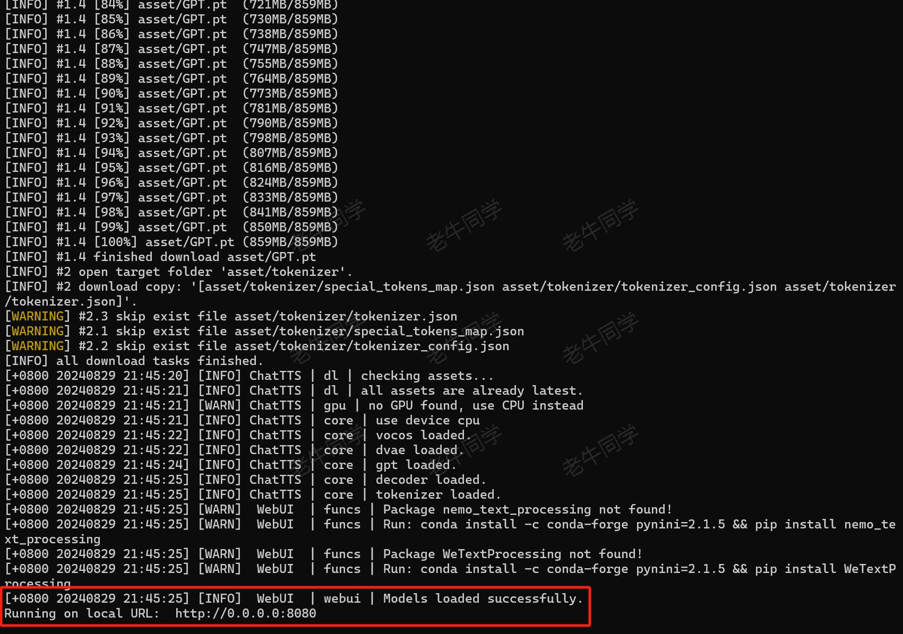
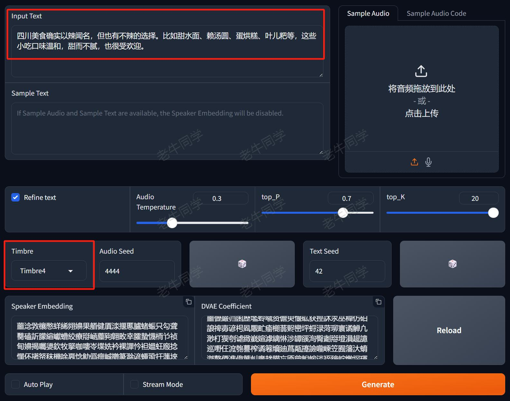
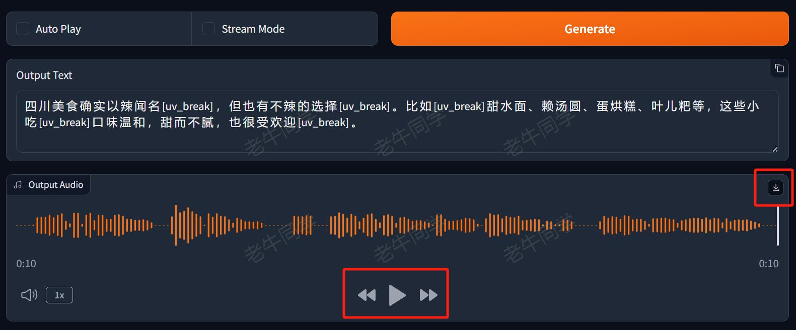
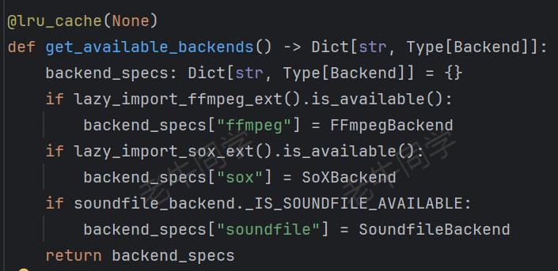
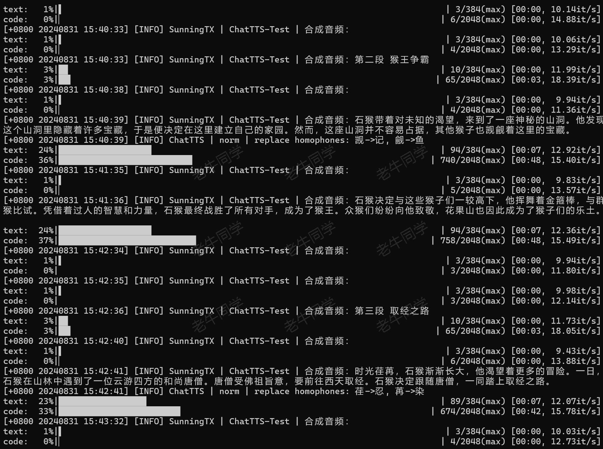
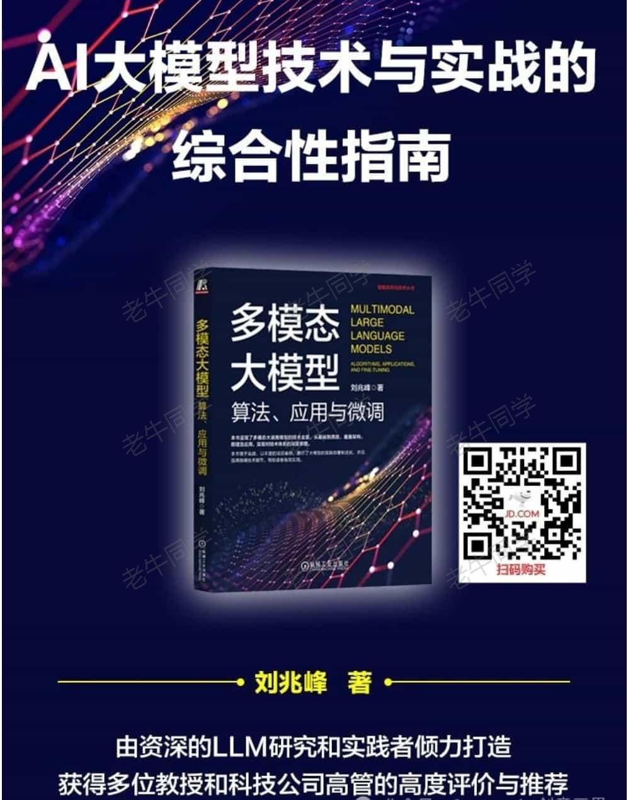

+++
slug = "2024083101"
date = "2024-08-31"
lastmod = "2024-08-31"
title = "ChatTTS 长音频合成和本地部署2种方式，让你的“儿童绘本”发声的实战教程（文末有福利）"
description = "本文介绍 ChatTTS 最新版本的 2 种本地部署方式，并通过短音频合成长音频的技术手段，解决 ChatTTS 合成音频最长 30 秒时长的限制，同时，我们让绘本故事文本转长音频……"
image = "00.jpg"
tags = [ "AI", "ChatTTS", "文生音频", "福利活动", "AI应用" ]
categories = [ "人工智能" ]
+++

接上文（[GLM-4-Flash 大模型 API 免费了，手把手构建“儿童绘本”应用实战（附源码）](https://mp.weixin.qq.com/s/K3wv1K8b-k0EsPu70fmAJg)），老牛同学通过 GLM-4-Flash 文生文和 CogView-3 文生图大模型，和大家一起编写了一个图文并茂的**儿童绘本**应用，并且以《黑神话·悟空》当前热门游戏为背景，做了一本名为《悟空探秘之旅》的儿童小绘本。

绘本我们是做好了，可是还得我们读给小朋友们听，老牛同学懒虫又犯了：能不能把绘本转换成音频，直接播放给小朋友们听（顺便我也跟着听听）？

这让老牛同学想到了之前写的关于**ChatTTS**详细介绍的文章：[ChatTTS 开源文本转语音模型本地部署、API 使用和搭建 WebUI 界面（建议收藏）](https://mp.weixin.qq.com/s/rL3vyJ_xEj7GGoKaxUh8_A)

老牛同学打开之前写的**ChatTTS**文章，发现有不少朋友的留言，包括：ChatTTS 的 API 更新了运行失败、模型文件下载不下跑不起来，希望老牛同学给打个包放到云盘等。这也不能怪 ChatTTS，都过去 2 个多月了，发布了新版也属正常，但是啥就不能兼容一下呢？

本着负责到底和解放自己的目的，老牛同学觉得完全有必要在重头部署一遍最新版的 ChatTTS，部署过程中发现有新坑，本文逐一破解：

1. ChatTTS 研发环境配置
2. ChatTTS 的 2 种方式部署和填坑，填坑过程老牛同学已经痛了一次，本文就不在赘述了，推荐使用**第 2 种**方式
3. ChatTTS 最长生成**30 秒**音频，如何生成《悟空探秘之旅》小绘本**3 分钟**左右的音频？

实在忍不住，必须要剧透一下：本文末有限量的福利活动，这个福利老牛同学都喜欢，大家可以顺便参与一下（其实就是一本最近上市的看起来还不错却还没有看完的大模型的书）！

# ChatTTS 配置 Python 研发环境

**工欲善其事，必先利其器**，我们通过**Miniconda**管理 Python 虚拟环境，**Miniconda**的安装和使用可以参考老牛同学之前的文章：[大模型应用研发基础环境配置（Miniconda、Python、Jupyter Lab、Ollama 等）](https://mp.weixin.qq.com/s/P_ufvz4MWVSqv_VM-rJp9w)

```shell
# Python虚拟环境名：ChatTTS，版本号：3.10
conda create --name ChatTTS python=3.10 -y

# 激活虚拟环境
conda activate ChatTTS
```

接下来，我们克隆 ChatTTS 源代码，安装 Python 依赖包（目录：`ChatTTS`）：

```shell
# 克隆源代码
git clone https://github.com/2noise/ChatTTS ChatTTS

# 切换到源代码目录
cd ChatTTS

# 安装Python依赖包
pip install -r requirements.txt

# 安装ChatTTS包：以下2种方式任一一种即可
pip install -e .
# pip install git+https://github.com/2noise/ChatTTS
```

最后，我们还需要安装 2 个依赖，主要是文本合成音频文件，和音频文件合并（这是一个**坑**，老牛同学翻源代码解决）：

```shell
pip install pysoundfile
pip install pydub
```

通过以上步骤，我们即完成了 ChatTTS 环境准备。接下来我们采用**2 种方式**在本地部署 ChatTTS 模型。

# 方式一：API 自动下载模型文件部署

自动下载模型文件的方式比较省事，唯一就是需要从 HF 下载文件，如果大家发现自己没有通畅的网络，那就直接跳过，采用**方式二**部署方式。

打开刚刚源代码目录`ChatTTS`，直接运行 WebUI 程序，就会自动下载模型文件：

```shell
# 切换到源代码目录
cd ChatTTS

# 启动WebUI，API自动下载模型文件
python examples/web/webui.py
```

我们可以看到，ChatTTS API 自动下载模型文件：



模型文件下载完成，自动启动了我们之前熟悉的 WebUI 界面：



ChatTTS WebUI 的输入部分核心包括 2 个内容：

1. 需要转换音频的文本内容，也就是我们“儿童绘本”故事内容
2. 选择音色`Timbre`，里面有男声、女声、翘舌等 10 种不同的音色



点击那个长长的 **Generate**橙色按钮，即可开始根据文本合并音频，我们可以点击**播放**按钮在线播放音频，还可以把音频文件**下载**到本地磁盘。

如果你想把绘本的内容全部放进，那是行不通的，因为：ChatTTS 最多只能合并**30 秒**时长的音频。我们得抛弃 WebUI 界面，通过 API 生产音频。

# 方式二：手动下载模型文件部署和 API 使用（推荐）

如果**方式一**大家能够成功下载模型文件，且只是体验一下玩玩，且能正常启动 WebUI，那么老年同学建议就直接使用**方式一**了，因为它确实简单粗暴。

如果我们想使用 API 自动化的做一下事情，那么就用**方式二**吧：

【**第一步：** 下载模型文件到本地】

我们通过 Git 大文件系统下载模型文件（下载目录：`ChatTTS-Model`）：

```shell
git lfs install
git clone https://www.modelscope.cn/ai-modelscope/chattts.git ChatTTS-Model
```

如果因网络不佳等原因，导致下载中断，我们可以通过以下命令在中断后继续下载：

```shell
cd ChatTTS-Model
git lfs pull
```

【**第二步：** 本地部署模型并合并音频】

又有一个**坑**：ChatTTS 包中，固定死了模型文件列表的摘要内容，如果与包中摘要不一致，则本地部署失败！它这么做其实是可以理解，因为不同版本对应不同的程序，但是模型文件中为啥也不说明一下，使用哪个版本呢？

第一步：初始化 ChatTTS 代码如下：

```shell
import ChatTTS
import torch
import torchaudio
from tools.logger import get_logger
from pydub import AudioSegment
import os

logger = get_logger("SunningTX")

#
# 第一步：ChatTTS初始化
#
# 1. 初始化ChatTTS实例
chat = ChatTTS.Chat(
    get_logger("ChatTTS"),
)
```

第二步：加载模型文件，坑就在这里出现了，老牛同学就直接填了

```shell
# 2. 坑：本地下载模型文件，需要魔改文件摘要，否则模型加载失败
chat.sha256_map = {
    "sha256_asset_Decoder_pt": "9964e36e840f0e3a748c5f716fe6de6490d2135a5f5155f4a642d51860e2ec38",
    "sha256_asset_DVAE_full_pt": "553eb75763511e23f3e5f86303e2163c5ca775489d637fb635d979c8ae58bbe5",
    "sha256_asset_GPT_pt": "d7d4ee6461ea097a2be23eb40d73fb94ad3b3d39cb64fbb50cb3357fd466cadb",
    "sha256_asset_Vocos_pt": "09a670eda1c08b740013679c7a90ebb7f1a97646ea7673069a6838e6b51d6c58",
    "sha256_asset_tokenizer_special_tokens_map_json": "30e1f3dfbaef18963d9298e9a70e5f4be9017b4f64ec67737d0bccc2dbeba8c9",
    "sha256_asset_tokenizer_tokenizer_config_json": "ac0eb91b587bd4c627c2b18ac1652bdf3686c7a6cd632d4b00feb9f34828dfdc",
    "sha256_asset_tokenizer_tokenizer_json": "dddc3d54016d6cb75ed66dde3be50287afe6dee679c751538373feb75f950020"
}

# 3. 加载模型文件：指定模型文件路径
chat.load(
    compile=True,
    source='custom',
    force_redownload=False,
    custom_path='D:\ModelSpace\ChatTTS-Model',
)
```

**特别注意：** `source`值为`custom`代表使用自定义模型文件，`custom_path`代表自定义模型文件目录，即我们下载的模型文件根目录！

经过以上 2 步，我们即加载完成 ChatTTS 模型，可以看到如下日志输出：

```plaintext
[+0800 20240831 15:37:35] [INFO] ChatTTS | core | try to load from local: D:\ModelSpace\ChatTTS-Model
[+0800 20240831 15:37:35] [INFO] ChatTTS | dl | checking assets...
[+0800 20240831 15:37:36] [INFO] ChatTTS | dl | all assets are already latest.
[+0800 20240831 15:37:36] [WARN] ChatTTS | gpu | no GPU found, use CPU instead
[+0800 20240831 15:37:36] [INFO] ChatTTS | core | use device cpu
[+0800 20240831 15:37:36] [INFO] ChatTTS | core | vocos loaded.
[+0800 20240831 15:37:36] [INFO] ChatTTS | core | dvae loaded.
[+0800 20240831 15:37:39] [INFO] ChatTTS | core | gpt loaded.
[+0800 20240831 15:37:39] [INFO] ChatTTS | core | decoder loaded.
[+0800 20240831 15:37:39] [INFO] ChatTTS | core | tokenizer loaded.
```

接下来，我们测试一下合成一个简单的音频文件：

```shell
# 需要转化为音频的文本内容
text = '大家好，我是老牛，微信公众号：老牛同学，微信号：imxulin（奔跑的蜗牛），很高兴与您相遇！'

# 文本转为音频
wavs = chat.infer(text)

# 保存音频文件到本地文件（采样率为24000Hz）
torchaudio.save("./output/output-01.wav", torch.from_numpy(wavs[0]), 24000)
```

运行程序，我们可以看到如下日志输出：

```plaintext
 20%|██████████████████████████▌                    | 76/384 [00:08<00:35,  8.62it/s]
 26%|██████████████████████████████████▌            | 536/2048 [00:48<02:17, 10.98it/s]
```

同时，在本地目录生成了`./output/output-01.wav`音频文件，打开该音频文件，就可以听到非常自然流畅的语音了！

# ChatTTS 应用：把《悟空探秘之旅》绘本故事转换为长音频文件

有了前面辛苦的准备，我们终于可以来实现我们的目标了：把《悟空探秘之旅》绘本故事合并音频文件！

现在摆在我们面前的**问题**是：ChatTTS 一次最多只能合成**30 秒**长的音频，如何让它合并整个绘本呢？

老牛同学的**办法**也简单粗暴：先按照故事每个小段落，分别合成较短时长的音频，最终把短音频合成长音频。（大家如果有更好的办法，恳请留言，谢谢大家）

【**第一步：** 我们先把故事内容分成文本行】

**需要注意**的是：有些符合 ChatTTS 无法识别，我们把它踢除或者替换成空格，否则不知 ChatTTS 会发出什么音！

```shell
#
# 第二步：按行准备故事文本内容，并转换为音频文件
#
# 1. 按行读取故事内容（·《》：符号无法识别，需要过滤掉）
lines = []
with open('./Story.txt', 'r', encoding='utf-8') as file:
    for line in file:
        # 去掉或者替换不支持的字符
        line = line.replace('·', ' ')
        line = line.replace('《', '').replace('》', '')
        line = line.replace('：', ' ')

        # 最后末尾增加一个空格，以暂停一下
        line = line.strip() + ' '

        if len(lines) > 2:
            pass

        if len(line) > 0:
            lines.append(line)
            logger.info(line)
```

【**第二步：** 按照故事段落，分别合成音频文件】

**需要注意**的是：以下代码`torchaudio.save()`的参数`backend`代表本地音频处理扩展，总共支持 3 种类型：



最简单的方式，就是使用**soundfile**，前面已经介绍：`pip install pysoundfile`

```shell
# 2. 音频转换，按照每行文本转换为一个音频文件
temp_dir = os.path.join(os.getcwd(), 'temp')
os.makedirs(temp_dir, exist_ok=True)


# 存在单个音频文件
def save_wav(idx: int, src: torch.Tensor):
    wav_path = f'./temp/{idx}.wav'
    try:
        torchaudio.save(
            wav_path,
            torch.from_numpy(src).unsqueeze(0),
            24000,
            format='wav',
            backend='soundfile'
        )
    except:
        torchaudio.save(
            wav_path,
            torch.from_numpy(src),
            24000,
            format='wav',
            backend='soundfile'
        )

    return wav_path


# 逐行合成音频文件
wav_list = []
for i in range(len(lines)):
    line = lines[i]
    logger.info(f'合成音频：{line}')

    res_gen = chat.infer(
        lines[i],
        skip_refine_text=False,
        refine_text_only=False,
        params_refine_text=ChatTTS.Chat.RefineTextParams(
            temperature=0.3,
            top_P=0.7,
            top_K=20,
            manual_seed=222,
        ),
    )
    wav_list.append(save_wav(i, res_gen))
```

重点说明一下，`chat.infer()`函数的几个参数，因为真的很重要：

- `skip_refine_text`和`refine_text_only`分别代表忽略文本处理和仅文本预处理标，**预处理**就是**方式一**种 WebUI 中，**Output Text**内容，主要去掉不支持字符、插入停顿、笑声等内容
- `temperature`大模型温度值，越越越严谨，越高则代表大模型会有更多创意，比如加入一些字符等，让音频更加口语化等
- `top_K`和`top_P`代表大模型采样策略，它们都是用于控制模型输出；**K**代表概率分布最高的 K 个词，然后从 K 个中随机取一个作为输出；**P**代表累计概率和超过 P 的词，然后随机取一个作为输出
- `manual_seed`代表音色，不同的男声和女声的不同音色，老牛同学随机定了一个值

【**第三步：** 最后，合并短音频文件为长音频文件】

```python
#
# 第三步：合并所有短音频为长音频文件
#
def merge_wav_files(input_files, output_file):
    combined_audio = AudioSegment.empty()

    for input_file in input_files:
        audio = AudioSegment.from_wav(input_file)
        combined_audio += audio

    combined_audio.export(output_file, format='wav')


# 合并音频文件
merge_wav_files(wav_list, './Story.wav')
```

合并以上步骤代码片段，我们执行程序：`python ChatTTS-Story.py`



至此，绘本故事所有的音频代码全部完成，完整的源代码老牛同学放到评论区。

【这里是《悟空探秘之旅》绘本故事的音频文件】

# 最后：来个有限的福利活动（送书）

非常感谢大家一直关注老牛同学的公众号，是大家的支持给了老牛同学很多学习大模型的动力，最近老牛同学联系到一位出版社朋友，共同办一个**送书**的小福利活动。



这本书老牛同学还没有看，但是网上看了评论和目录，里面涉及了大模型算法、应用实战，包括老牛同学之前介绍的 LoRA 参数高效微调、LangChain 大模型研发框架等，这本书**80 元**整体是很值。

本次福利小活动的要求：

1. 关注**老牛同学**微信公众号
2. 然后在公众号本文的评论区**留言**，留言的**点赞**数排名**前 3 名**的朋友，**免费**且**包邮**获得《多模态大模型》书籍（即：默认送 3 本书）
3. 若公众号本文的**阅读量**超过了**2000**（含**2000**），则留言的**点赞**数排名**前 6 名**的朋友均免费包邮送书（即：最多送 6 本书）
4. 活动时间：2024 年 8 月 31 日到 2024 年 8 月 15 号上午 12 点整（共 2 周，正好假期老牛同学可以统计和收集寄件地址）
5. 老牛同学不参与本次活动（因为老牛同学默认就有 1 本）

请原谅老牛同学这么久才搞个福利活动，竟然还搞得这么小，老牛同学真的尽力了：本来出版社朋友只送 2 本，老牛同学争取到了 3 本，然后继续磨嘴皮争取到 6 本。如果本次活动效果给力，老牛同学敢保证后续肯定还有很多机会。

大家可能会问，老牛同学你到底得到了什么福利？老牛同学会得到以下 3 个福利：

1. 不论本次阅读效果如何，出版社朋友都会送书**1 本**（可见的福利）
2. 本次是老牛同学第 1 次搞活动，可以积累活动经验，下次也行就更容易了（这是一条路子，老牛同学就可以去找更多的出版社朋友了）
3. 公众号可能会有新的关注着，本文和其他文章的阅读量可能会增加，出版社朋友可能会比较满意，那么下次老牛同学就可以争取多一些福利（如：默认送 10 本书等）

最后，凡是参与活动满足送书条件的朋友，麻烦添加一下老牛同学的个人微信（注明：送书活动），便于老牛同学收集邮寄地址：**imxulin**（奔跑的蜗牛）

最后的最后，为了方便大家购买，老牛同学把京东商品链接也贴上：

【书籍购买链接】

本文示例源代码：[https://gitee.com/obullxl/SunningTX/tree/master/PythonTX/ChatTTS](https://gitee.com/obullxl/SunningTX/tree/master/PythonTX/ChatTTS)

[vLLM CPU 和 GPU 模式署和推理 Qwen2 等大语言模型详细教程](https://mp.weixin.qq.com/s/KM-Z6FtVfaySewRTmvEc6w)

[MiniCPM-V 2.6 面壁“小钢炮”，多图、视频理解多模态模型，部署和推理实战教程](https://mp.weixin.qq.com/s/x2RKTvFeKgRvi982X5cymA)

[基于 Qwen2/Lllama3 等大模型，部署团队私有化 RAG 知识库系统的详细教程（Docker+AnythingLLM）](https://mp.weixin.qq.com/s/PpY3k3kReKfQdeOJyrB6aw)

[使用 Llama3/Qwen2 等开源大模型，部署团队私有化 Code Copilot 和使用教程](https://mp.weixin.qq.com/s/vt1EXVWtwm6ltZVYtB4-Tg)

[基于 Qwen2 大模型微调技术详细教程（LoRA 参数高效微调和 SwanLab 可视化监控）](https://mp.weixin.qq.com/s/eq6K8_s9uX459OeUcRPEug)


