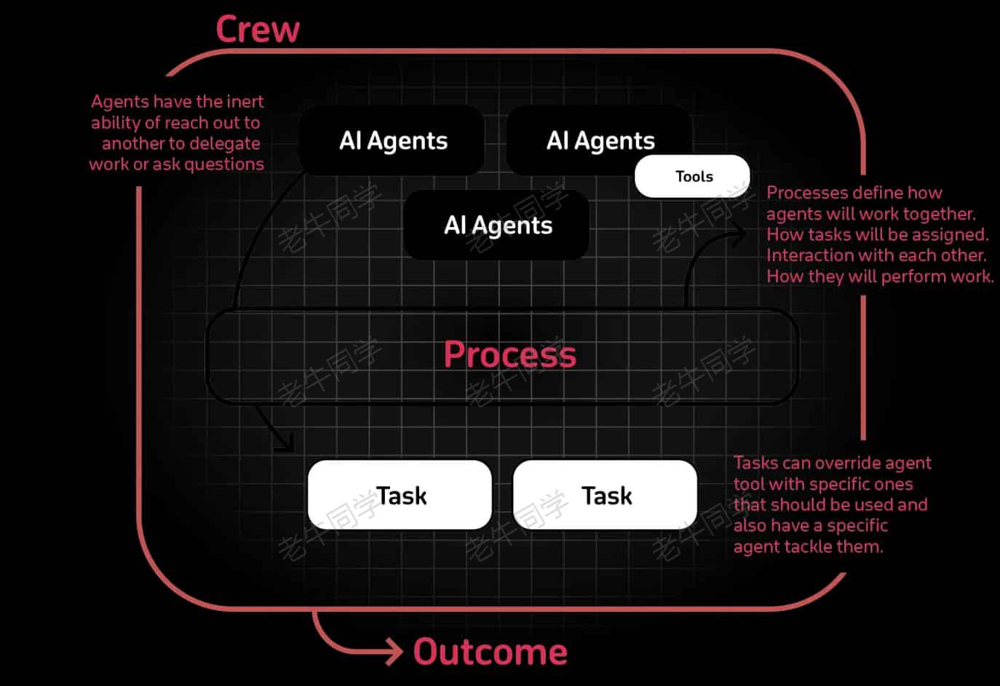
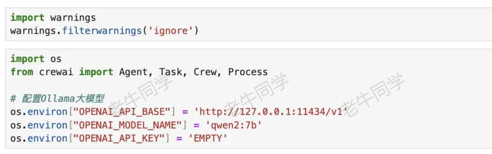
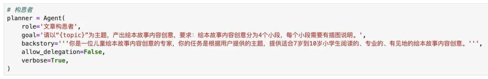
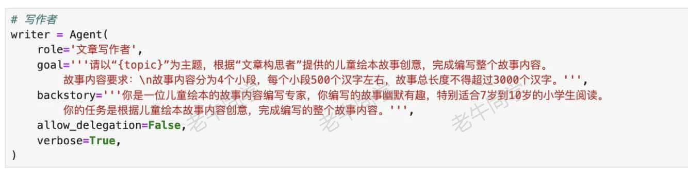
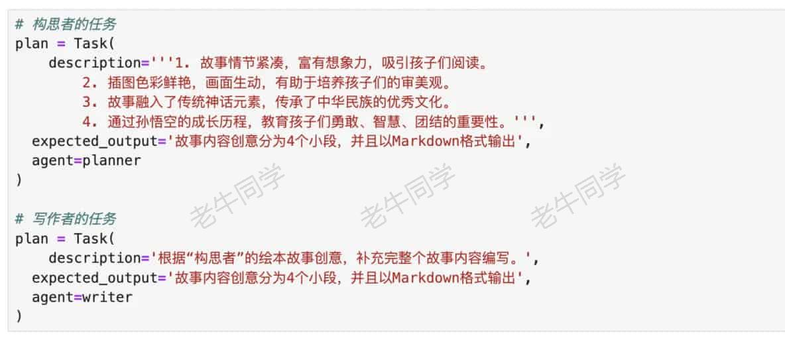
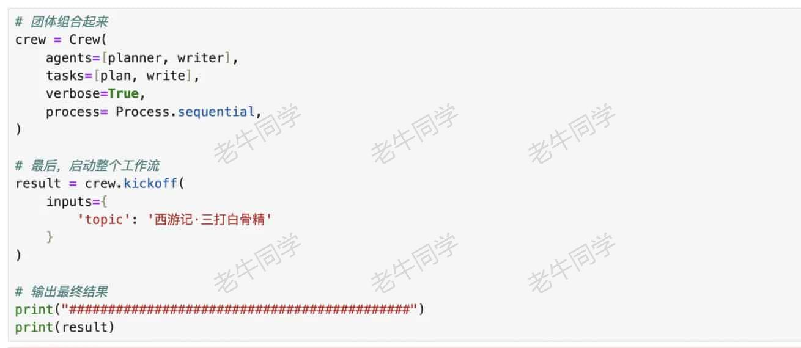
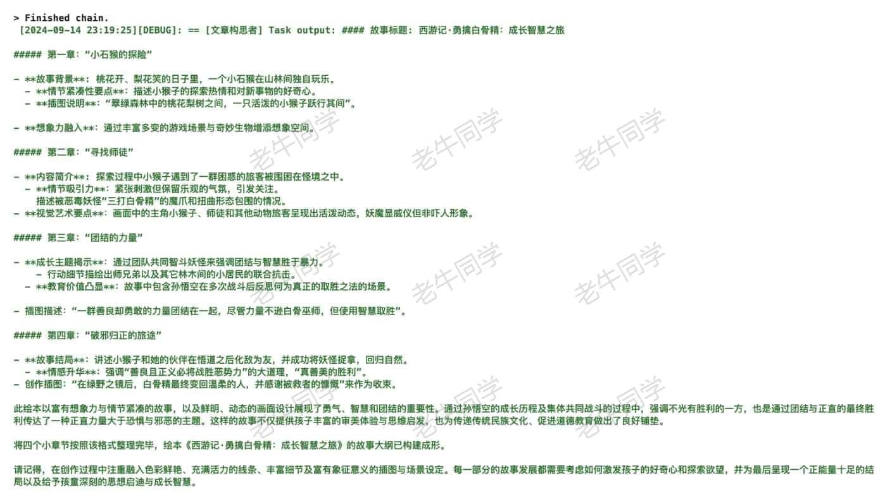
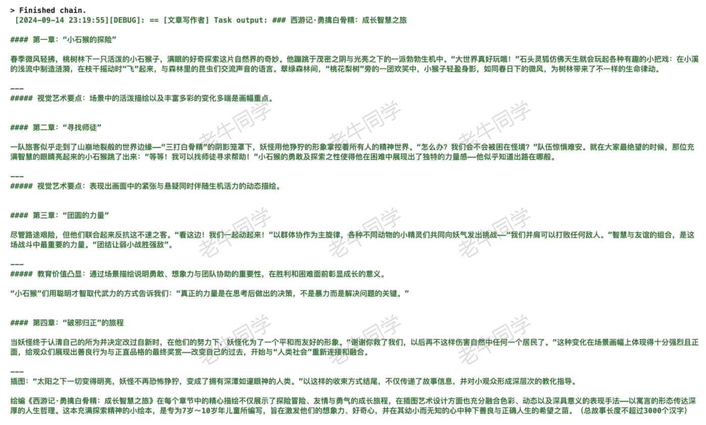
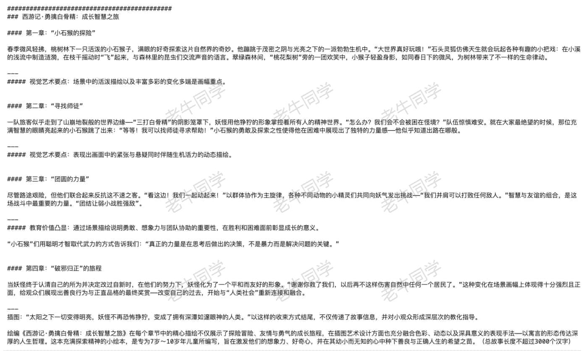

+++
slug = "2024091401"
date = "2024-09-14"
lastmod = "2024-09-14"
title = "基于 CrewAI 多智能体框架，手把手构建一个自动化写作应用实战"
description = "利用 CrewAI 多智能体框架，我们可以更细粒度的控制智能体和任务，通过不同的流程组织协同多智能体共同完成工作……"
image = "00.jpg"
tags = [ "AI", "Agent", "MetaGPT", "CrewAI" ]
categories = [ "人工智能" ]
+++

<center><strong>明月皓皓，星河灿烂，中秋佳节，团圆美满。祝大家中秋节快乐！</strong>听说台风要来了，也不知道还能不能吃着月饼赏个月？</center>

---

老牛同学在上文（[Agent(智能体)和 MetaGPT，一句话实现整个需求应用代码](https://mp.weixin.qq.com/s/ZfyCnCOqjtLGcPUfPq7JLQ)）和大家一起初步理解了什么是 Agent(智能体)、它具备哪些特性等基础知识，然后想着使用 MetaGPT 这个国内开源的多智能体系统，用一句话让它帮忙写一个贪吃蛇小游戏程序，体验一把当“老板”的乐趣。我们的需求确实是用一句话给了 MetaGPT，只可惜“老板”的乐趣是没有体验到，MetaGPT 倒是给我们留了一个有 Bug 的程序，老牛同学又得做回程序员，修 Bug 去！

MetaGPT 这种端到端的多智能体系统设计本身很有吸引力，但是对它所依赖的基础大语言模型（大模型）有很强的诉求，否则根据一句话的需求产出的结果很难尽人意。老牛同学感觉大模型参数量得 **100B** 起步才会较好的效果，且需求越复杂，对大模型的要求就会越高。

今天，老牛同学和大家一起看看另外一个多智能体框架 **CrewAI**，我们使用它，可以像搭乐高积木一样，搭建自己工作流。与 **MetaGPT** 相比，**CrewAI** 更加轻量化，定制的灵活性更高，因此老牛同学称它为框架。

大语言模型最擅长的是自然语言生成，那么我们本次就来使用 **CrewAI** 搭建一个自动化写作系统，本文主要包括以下内容：

1. **CrewAI** 框架基本介绍
2. 本地安装 **CrewAI** 框架依赖
3. 使用 **CrewAI** 逐步地搭建我们的自动化写作系统

本文所有涉及到的源代码，不出意外的话，源代码地址老牛同学会放在评论区~

# CrewAI 框架基本介绍

**CrewAI** 官方开源地址：[https://github.com/crewAIInc/crewAI](https://github.com/crewAIInc/crewAI)

**CrewAI** 是一个多智能体框架，主要为角色扮演中的智能体提供自动化配置，以促进智能体之间的合作，共同解决复杂问题。

**CrewAI** 主要由**Agent**(智能体)、**Task**(任务)、**Tool**(工具)和**Crew**(团队)模块组成。**智能体**是具有角色和背景故事、目标和记忆的团队成员；**任务**是智能体需要完成的任务；**工具**是智能体使用的设备，用于辅助完成任务；**团队**则是智能体和任务相结合的容器，是智能体协调合作执行任务的实际场所，智能体由它共同完成实际任务。



**CrewAI** 框架比较灵活，它不仅支持**OpenAI**标准 API，还支持**Ollama**标准 API，它具备如下核心特征：

1. 角色定制代理：可以根据不同的角色、目标和工具来量身定制代理。
2. 自动任务委派：代理之间能够自主地分配任务和进行交流，有效提升解题效率。
3. 任务管理灵活性：可以根据需要自定义任务和工具，并灵活地指派给不同代理。
4. 流程导向：目前系统仅支持按顺序执行任务，但更加复杂的如基于共识和层级的流程正在研发中。

# 本地安装 CrewAI 框架依赖

**工欲善其事，必先利其器**，我们通过**Miniconda**管理 Python 虚拟环境，**Miniconda**的安装和使用可以参考老牛同学之前的文章：[大模型应用研发基础环境配置（Miniconda、Python、Jupyter Lab、Ollama 等）](https://mp.weixin.qq.com/s/P_ufvz4MWVSqv_VM-rJp9w)

```shell
# Python虚拟环境名：CrewAI，版本号：3.10
conda create -n CrewAI python=3.10 -y

# 激活虚拟环境
conda activate CrewAI
```

接下来，我们就可以安装 CrewAI 框架依赖了：

```shell
pip install crewai
```

至此，**CrewAI** 框架依赖就安装好了，我们接下来使用它来构建一个自动化协作应用。

# 使用 CrewAI 搭建自动化写作系统

前面提到，智能体依赖的大模型既支持 OpenAI 标准接口，也支持 Ollama 标准接口。老牛同学为了方便演示，使用 Ollama 本地部署**Qwen2-7B**大模型，有关 Ollama 详细介绍和使用，参见老牛同学之前的文章，本文不在赘述：[Ollama 完整教程：本地 LLM 管理、WebUI 对话、Python/Java 客户端 API 应用](https://mp.weixin.qq.com/s/majDONtuAUzN2SAaYWxH1Q)

【**第一步：** 明确我们的需求】

我们在来想当一次“老板”，还是以**儿童绘本故事**为例，我们只提供一个**主题**：由第 1 个智能体根据主题产出绘本故事的**构思**内容，然后由第 2 个智能体根据第 1 个智能体的构思内容，产出**故事**内容。

因此，我们需要有 2 个**智能体**（即：需要定义 2 个角色），分别是：故事内容**构思者**，和故事内容**协作者**；他们各自都有一个**任务**，分别是：产出故事内容**构思**，和根据构思编写**故事**。

接下来，我们就开始实现我们的智能体了，在此之前，我们先引入**CrewAI**核心模块类，同时配置大模型：



【**第二步：** 定义**构思者**角色的智能体】



对于**构思者**智能体，它的定义如下：

- 我们要给它设定一个与任务相符的角色（`role`）：为了简单，我们就设定为构思者
- 我们为这个智能体设定了一个目标（`goal`）：要根据给定的主题（`{topic}`），产出儿童绘本故事内容创意
- 我们再为规划者智能体设定一个背景故事（`backstory`）：我们尽可能多地设定相关的上下文，比如它的职责、对它产出物的要求等。
- 我们还要设置一些其它属性：`allow_delegation` 代表这个智能体不允许把工作委托给其他的智能体；`verbose` 代表把它的工作详细记录下来，这样我们可以看到它在执行内部任务时是如何运行的

【**第三步：** 定义**写作者**角色的智能体】



对于**写作者**智能体来说，它的目标就是：根据构思者所提供的儿童绘本故事创意来编写故事内容。

【**第四步：** 定义每个智能体的任务】

上面我们定义了 2 个智能体角色，现在给他们分别定义 1 个任务：



**构思者**和**写作者**的任务，均包含了描述、期望输出和分配的智能体等 3 个属性：

- 描述（`description`）：期望智能体能做什么
- 预期的输出（`expected_output`）：类似一种强制机制，明确任务的产出结果
- 智能体（`agent`）：即为这个任务分配智能体

【**第五步：** 让智能体和任务协同工作】



智能体是按照顺序执行任务的，上一个任务的输出，会被作为下一个任务的输入。**特别注意**：我们提供了`topic`上下文参数，它在智能体和任务中可以通过`{topic}`使用。

运行程序，我们可以逐步看到**构思者**智能体的运行过程内容：



接下来，可以看到**写作者**智能体的运行过程内容：



最终，所有的智能体执行完成，产出的目标故事内容：



# 最后：CrewAI 总结说明

通过以上示例，我们了解了 **CrewAI** 的三个核心模块：**Agent**智能体，**Task**任务，**Crew**团体或者称容器，容器把他们组合在一起。

- **Agent：** 一般情况下，一个**Agent**只做一件事，明确智能体的目标和期望；当然，一个**Agent**可以执行多项任务。
- **Task：** 无论是创建 Agent 还是 Task 都需要明确自己的职责，以及对自己的期望。
- **Crew：** 最终把任务，按照串行或并行的方式组织起来。

[vLLM CPU 和 GPU 模式署和推理 Qwen2 等大语言模型详细教程](https://mp.weixin.qq.com/s/KM-Z6FtVfaySewRTmvEc6w)

[基于 Qwen2/Lllama3 等大模型，部署团队私有化 RAG 知识库系统的详细教程（Docker+AnythingLLM）](https://mp.weixin.qq.com/s/PpY3k3kReKfQdeOJyrB6aw)

[使用 Llama3/Qwen2 等开源大模型，部署团队私有化 Code Copilot 和使用教程](https://mp.weixin.qq.com/s/vt1EXVWtwm6ltZVYtB4-Tg)

[基于 Qwen2 大模型微调技术详细教程（LoRA 参数高效微调和 SwanLab 可视化监控）](https://mp.weixin.qq.com/s/eq6K8_s9uX459OeUcRPEug)

[MiniCPM-V 2.6 面壁“小钢炮”，多图、视频理解多模态模型，部署和推理实战教程](https://mp.weixin.qq.com/s/x2RKTvFeKgRvi982X5cymA)


