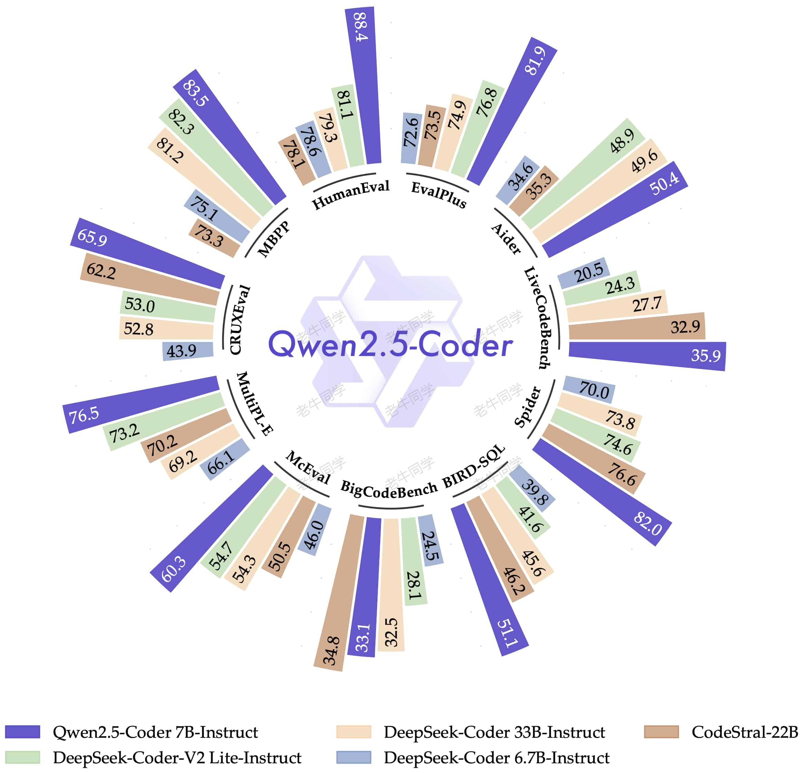
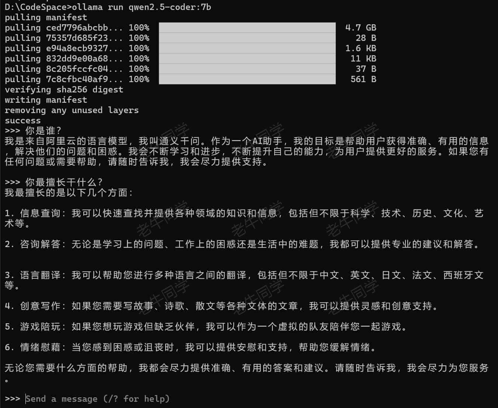
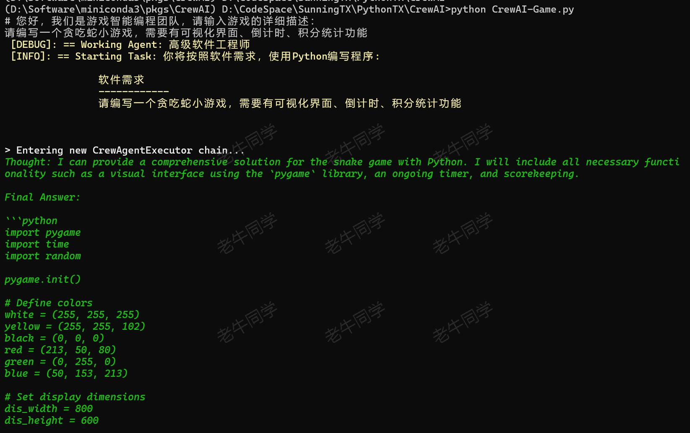
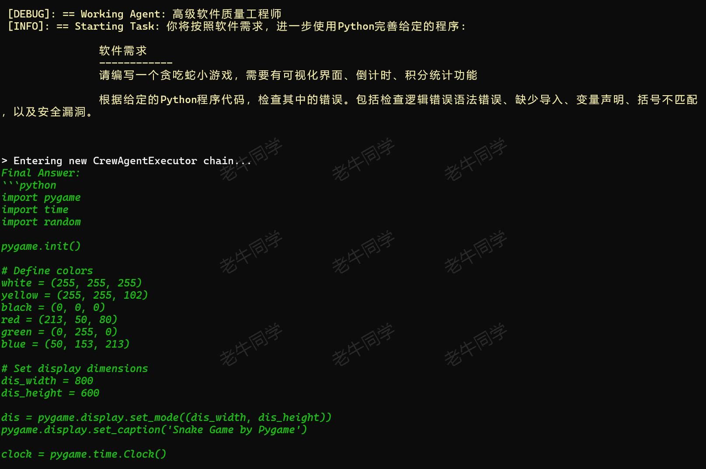
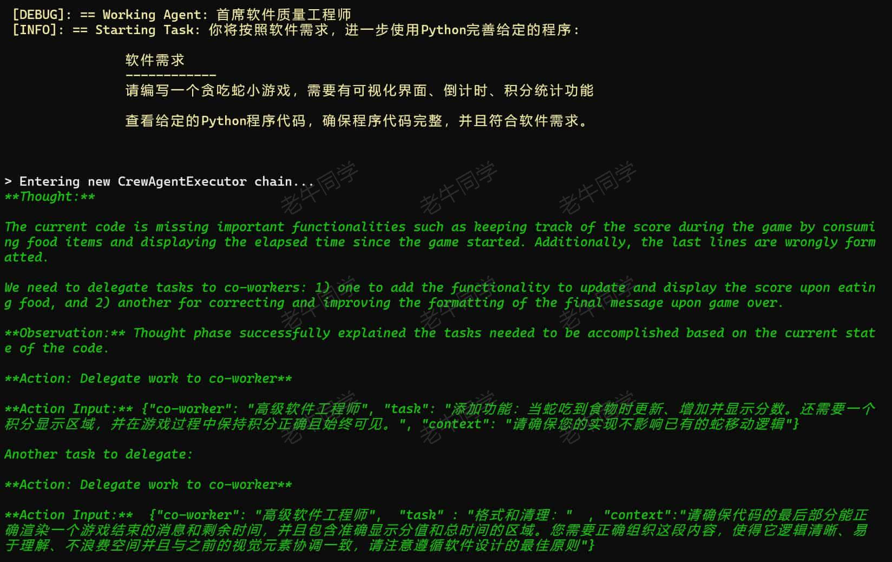
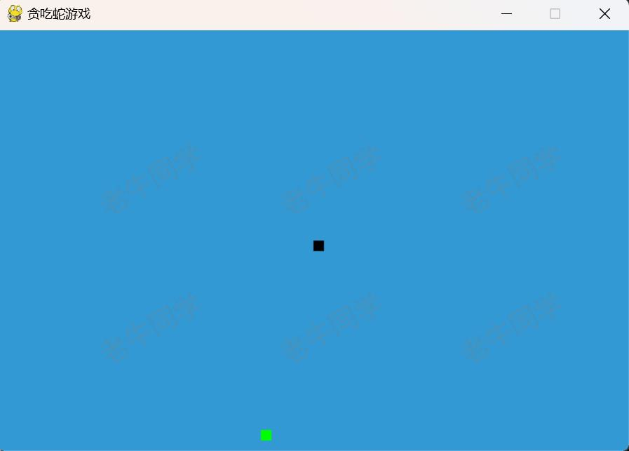

+++
slug = "2024092101"
date = "2024-09-21"
lastmod = "2024-09-21"
title = "基于 Qwen2.5-Coder 模型和 CrewAI 多智能体框架，实现智能编程系统的实战教程"
description = "Qwen2.5 开源的系列模型中，Qwen2.5-Coder 模型的推理能力技压群雄，本文集合 CrewAI 框架，让多智能体自己编写程序……"
image = "01.jpg"
tags = [ "AI", "Agent", "Qwen2.5", "CrewAI" ]
categories = [ "人工智能" ]
+++

9 月 19 日，阿里开源了 Qwen2.5 系列大模型全家桶：除常规的语言模型 Qwen2.5 之外，还发布了专门针对编程的**Qwen2.5-Coder**模型和数学的 Qwen2.5-Math 模型，并且针对每个模型都提供了不同规模参数版本，包括：

- Qwen2.5 语音模型: 0.5B, 1.5B, 3B, 7B, 14B, 32B 和 72B
- **Qwen2.5-Coder** 编程模型: 1.5B, 7B, 以及即将推出的 32B
- Qwen2.5-Math 数学模型: 1.5B, 7B 和 72B

Qwen2.5 系列模型性能和推理能力对比，老牛同学不在赘述，我们可以到 Qwen 官网博客查看详细介绍：[https://qwenlm.github.io/zh/blog/qwen2.5/](https://qwenlm.github.io/zh/blog/qwen2.5/)

在国内开源大模型中，老牛同学用**遥遥领先**做为 Qwen2.5 模型系列总结一点也不为过，国内开源大模型能真打的实在是太少了！

老牛同学对**Qwen2.5-Coder**比较感兴趣，可能是老牛同学专业的原因，非常期待能有一个智能编程的模型或应用，真所谓：**码无止境，学无止境！**



今天，老牛同学就基于**Qwen2.5-Coder**模型，结合**CrewAI**多智能体框架，实现一个能**根据软件需求编写程序代码**的系统，同时感受一下**Qwen2.5-Coder**的能力。因此本文大致分为以下三部分：

- **Qwen2.5-Coder**本地部署和简单验证
- **CrewAI**多智能体设计、和基于**Qwen2.5-Coder**的实现代码
- 最终，验证**CrewAI**智能体编写的程序

# Qwen2.5-Coder 本地部署

通过老牛同学前面的文章可以看到，我们至少有 3 种方式在本地部署和推理大模型，本文就是不在详细介绍其过程了（感兴趣的朋友可以翻看一下老牛同学之前文章）。

为了尽快实现我们的目标，我们将使用**Ollama**快速在本地部署**Qwen2.5-Coder**模型；关于 Ollama 的详细介绍和使用教程，可以参考老牛同学之前文章：[Ollama 完整教程：本地 LLM 管理、WebUI 对话、Python/Java 客户端 API 应用](https://mp.weixin.qq.com/s/majDONtuAUzN2SAaYWxH1Q)

我们安装好**Ollama**程序之后，通过以下一条命令，即可完成大模型的下载和部署：

```shell
ollama run qwen2.5-coder:7b
```

下载和部署成功之后，**Ollama**默认自带了一个终端对话窗口：



至此，**Qwen2.5-Coder**模型本地部署就成功了，接下来我们来实现多智能体代码逻辑~

# CrewAI 多智能体设计和实现

**CrewAI**是一个多智能体框架，关于它的详细介绍和使用教程，可以参考老牛同学之前文章：[基于 CrewAI 多智能体框架，手把手构建一个自动化写作应用实战](https://mp.weixin.qq.com/s/wqOqupVIDsKDW-Kmj3IRYw)


**工欲善其事，必先利其器**，我们先准备一下**CrewAI**的研发环境，我们通过**Miniconda**管理 Python 虚拟环境，**Miniconda**的安装和使用可以参考老牛同学之前的文章：[大模型应用研发基础环境配置（Miniconda、Python、Jupyter Lab、Ollama 等）](https://mp.weixin.qq.com/s/P_ufvz4MWVSqv_VM-rJp9w)

```shell
# Python虚拟环境名：CrewAI，版本号：3.10
conda create -n CrewAI python=3.10 -y

# 激活虚拟环境
conda activate CrewAI

# 安装 CrewAI 框架依赖
pip install crewai
```

我们的编程智能体为**游戏智能编程团队**（姑且就叫这个名吧），这个团队由**3 个角色**组成（即：3 个智能体），他们的工作职责设定如下：

- **软件工程师**：负责根据需求编写程序代码
- **质量工程师**：发现并修复软件工程师的代码 Bug 和错误
- **首席质量工程师**：检测程序完整性，并检测是否符合软件需求

我们通过以下步骤，完成**游戏智能编程团队**整体逻辑（Python 文件：`CrewAI-Game.py`），首先我们需要导入程序的均依赖类：

```python
import os
from textwrap import dedent
from crewai import Agent, Task, Crew
```

【第一步：配置**Qwen2.5-Coder**大模型】

```python
# 配置模型（qwen2.5-coder:7b）
os.environ["OPENAI_API_BASE"] = 'http://127.0.0.1:11434/v1'
os.environ["OPENAI_MODEL_NAME"] = 'qwen2.5-coder:7b',
os.environ["OPENAI_API_KEY"] = 'EMPTY'
```

【第二步：定义**3 个角色**（即：3 个智能体）】

3 个智能体分别是：高级软件工程师、高级质量工程师和首席质量工程师

```python
#
# 3个智能体逻辑
#

def senior_engineer_agent():
	"""高级软件工程师智能体"""
	return Agent(
		role='高级软件工程师',
		goal='根据需求完成软件编程',
		backstory=dedent('''你是一位国际领先的科技公司的高级软件工程师。
			你非常擅长Python编程，并尽自己的最大努力编写功能齐全、运行良好的完美代码。
			'''),
		allow_delegation=False,
		verbose=True
	)

def qa_engineer_agent():
	"""高级软件质量工程师智能体"""
	return Agent(
		role='高级软件质量工程师',
		goal='分析程序代码，找出其中的错误，并修复这些错误代码',
		backstory=dedent('''你是一位检测代码的高级工程师。
			你对代码细节很敏锐，非常擅长找出代码中的Bug，包括检查是否缺少导入、变量声明、不匹配括号和语法错误等。
			您还能检查出代码的安全漏洞和逻辑错误。
			'''),
		allow_delegation=False,
		verbose=True
	)

def chief_qa_engineer_agent():
	"""首席软件质量工程师智能体"""
	return Agent(
		role='首席软件质量工程师',
		goal='确保代码实现了需求',
		backstory='''你怀疑程序员没有按照需求编写软件，你特别专注于编写高质量的代码。''',
		allow_delegation=True,
		verbose=True
	)
```

【第三步：定义**3 个任务**（即：3 个智能体的任务）】

与 3 个智能体对应，每个智能体均对应有 1 个任务：

```python
#
# 3个任务逻辑
#

def code_task(agent, game):
	return Task(description=dedent(f'''你将按照软件需求，使用Python编写程序:

		软件需求
		------------
		{game}
		'''),
		expected_output='你的输出是完整的Python代码, 特别注意只需要输出Python代码，不要输出其他任何内容！',
		agent=agent
	)

def review_task(agent, game):
	return Task(description=dedent(f'''你将按照软件需求，进一步使用Python完善给定的程序:

		软件需求
		------------
		{game}

		根据给定的Python程序代码，检查其中的错误。包括检查逻辑错误语法错误、缺少导入、变量声明、括号不匹配，以及安全漏洞。
		'''),
		expected_output='你的输出是完整的Python代码, 特别注意只需要输出Python代码，不要输出其他任何内容！',
		agent=agent
	)

def evaluate_task(agent, game):
	return Task(description=dedent(f'''你将按照软件需求，进一步使用Python完善给定的程序:

		软件需求
		------------
		{game}

		查看给定的Python程序代码，确保程序代码完整，并且符合软件需求。
		'''),
		expected_output='你的输出是完整的Python代码, 特别注意只需要输出Python代码，不要输出其他任何内容！',
		agent=agent
	)
```

【第四步：定义**团队**，组织智能体协同执行任务】

**CrewAI**中，**Crew**代表团队，它有`agents`和`tasks`这 2 个核心属性，最终通过`kickoff()`方法触发执行整个流程：

```python
#
# 团队逻辑
#

print('')
game = input('# 您好，我们是游戏智能编程团队，请输入游戏的详细描述：\n\n')
print('')

# 智能体
senior_engineer_agent = senior_engineer_agent()
qa_engineer_agent = qa_engineer_agent()
chief_qa_engineer_agent = chief_qa_engineer_agent()

# 任务
code_game = code_task(senior_engineer_agent, game)
review_game = review_task(qa_engineer_agent, game)
approve_game = evaluate_task(chief_qa_engineer_agent, game)

# 团队
crew = Crew(
	agents=[
		senior_engineer_agent,
		qa_engineer_agent,
		chief_qa_engineer_agent
	],
	tasks=[
		code_game,
		review_game,
		approve_game
	],
	verbose=True
)

# 执行
game_code = crew.kickoff()
```

最后，我们拿到 Python 代码之后，希望能保存到本地文件（Python 文件：`Game.py`）：

```python
# 输出
print("\n\n########################")
print("## 游戏代码结果")
print("########################\n")
print(game_code)

# 存储代码
filename = 'Game.py'

print("\n\n########################\n")
with open(filename, 'w', encoding='utf-8') as file:
    file.write(game_code)

print(f"游戏代码已经存储到文件： {filename}")
print(f'你可以运行游戏：python {filename}')
```

以上步骤即完成了我们只能编程团队代码，接下就可以执行了：`python CrewAI-Game.py`

CrewAI 执行过程中，我们看到 3 个智能体执行详细信息：

- 软件工程师执行过程信息
  

- 质量工程师执行过程信息
  

- 首席工程师执行过程信息
  

最后，我们运行本地存储的小游戏程序：`python Game.py`

因为程序使用到了**Pygame**包，如果虚拟环境没有的话，需要安装一下：`pip install pygame`

最终我们运行起来了贪吃蛇游戏：



至此，本次我们需求基本完成了，我们通过定义的 3 个智能体和对应的任务，最终智能体与**Qwen2.5-Coder**交互完成软件需求程序的编写。

程序最终还能跑起来，这也进一步体现了**Qwen2.5-Coder**模型的语音和代码推理能力！

---

往期推荐文章：

<small>[vLLM CPU 和 GPU 模式署和推理 Qwen2 等大语言模型详细教程](https://mp.weixin.qq.com/s/KM-Z6FtVfaySewRTmvEc6w)</small>

<small>[基于 Qwen2/Lllama3 等大模型，部署团队私有化 RAG 知识库系统的详细教程（Docker+AnythingLLM）](https://mp.weixin.qq.com/s/PpY3k3kReKfQdeOJyrB6aw)</small>

<small>[使用 Llama3/Qwen2 等开源大模型，部署团队私有化 Code Copilot 和使用教程](https://mp.weixin.qq.com/s/vt1EXVWtwm6ltZVYtB4-Tg)</small>

<small>[基于 Qwen2 大模型微调技术详细教程（LoRA 参数高效微调和 SwanLab 可视化监控）](https://mp.weixin.qq.com/s/eq6K8_s9uX459OeUcRPEug)</small>

<small>[ChatTTS 长音频合成和本地部署 2 种方式，让你的“儿童绘本”发声的实战教程](https://mp.weixin.qq.com/s/9ldLuh3YLvx8oWvwnrSGUA)</small>

<small>[MiniCPM-V 2.6 面壁“小钢炮”，多图、视频理解多模态模型，部署和推理实战教程](https://mp.weixin.qq.com/s/x2RKTvFeKgRvi982X5cymA)</small>


