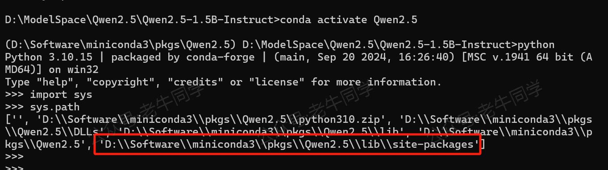
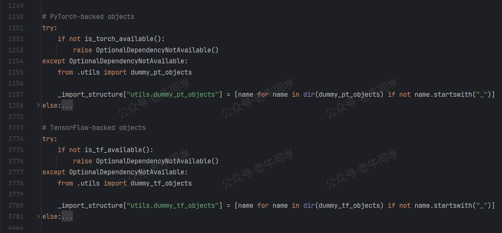
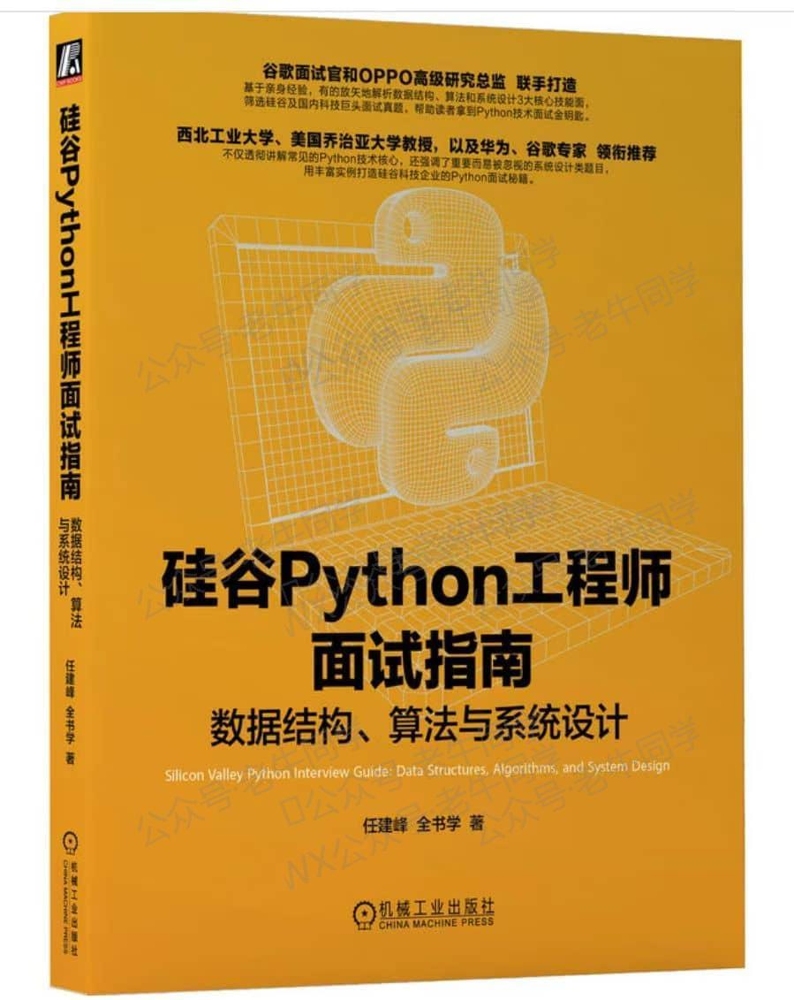

+++
slug = "2024101801"
date = "2024-10-18"
lastmod = "2024-10-18"
title = "transformers 推理 Qwen2.5 等大模型技术细节详解(一)transformers 初始化和对象加载（文末免费送书）"
description = "本文详细讲解 transformers 推理大语言模型的初始化过程，包括 Python 包搜索、LazyModule 延迟模块、模块搜索和 Python 包 API 设计美学……"
image = "00.jpg"
tags = [ "AI", "Qwen2.5", "transformers", "LazyModule" ]
categories = [ "人工智能" ]
+++

上周收到一位网友的私信，希望老牛同学写一篇有关**使用 transformers 框架推理大模型的技术细节**的文章。

老牛同学刚开始以为这类的文章网上应该会有很多，于是想着百度几篇质量稍高一点的回复这位网友。结果，老牛同学搜索后发现，类似文章确实不少，但是总觉得不太满意，要么细节深度不够，要么介绍不够全面，感觉达不到网友希望的**技术细节**要求。为了不辜负这位网友的期望，老牛同学决定自己动手，丰衣足食。

其实，我们使用 transformers 框架推理大模型的技术细节非常多，仅主链路就包括了模型加载、数据预处理、数据转换、模型推理、解码输出等。老牛同学本着宁缺毋滥尽善尽美的原则，期望能把这些技术细节完整全面介绍一遍，考虑到文章篇幅长度，计划共分为**3 篇**完成，希望能启动抛砖引玉之用：

1. 第 1 篇：也就是本文，核心介绍**transformers**包 API 设计美学、如何初始化、LazyModule 模块、按需导入指定对象等
2. 第 2 篇：基于 Qwen2.5 大模型，核心介绍**AutoModel**模型初始化`from_pretrained`过程细节（PyTorch/TensorFlow/Flax 深度学习框架的其他模型也类似）
3. 第 3 篇：同样基于 Qwen2.5 大模型，核心介绍**AutoTokenizer**初始化`from_pretrained`，和结合 Qwen2.5 大模型的完整推理过程技术细节

请原谅老牛同学水平有限，文中难免会出现遗漏和错误之处，恳请大家及时留言指出，以帮助老牛同学和其他阅读到本文的网友，让我们共同学习进步，在此万分感谢。

下面截图的寥寥几行代码，相信大家已经比较熟悉，因为它们经常出现在老牛同学的文章中。也就是这么几行代码，却涵盖了使用 transformers 框架进行大模型推理的核心代码框架。本系列的 3 篇文章，也将围绕这几行代码逐步展开：


要想详细介绍 Transformers 推理技术细节，我们就从 transformers 推理框架本身开始，老牛同学觉得这行代码就已足够：`from transformers import XXX`，代码中的**XXX**具体是哪个对象其实并不太重要，但为了后续介绍和演示方便，在本文中老牛同学就以**AutoModelForCausalLM**代替**XXX**。

是的，你没有看错，本文主要就只介绍这 1 行代码，这行在我们看来在简单熟悉不过的代码。想想看，对于 Transformers 这个大模型研究者和使用者们首选的框架来说，按理我们使用起来应该会很复杂，但从上面推理程序代码可以看到，我们使用这个框架时却似乎很简单，那么可能的解释是：**Transformers 框架设计得特别的精妙**！

老牛同学可以这么说：如果能把这行看似简单的代码真正读懂，在我们目前或将来设计像 transformers 这种超级 Python 包时，我们将会得心应手、游刃有余！

我们把本文分为以下几个主要章节部分，最终完成这行代码的介绍：

1. 前期环境准备，主要是下载 transformers 包代码，包括环境配置和包安装
2. **transformers 包**的初始化过程，即代码前半部分：`from transformers`，我们可以看到**transformers 包**的设计和我们日常研发很不一样
3. **transformers 包**导入类过程，即代码后半部分：`import AutoModelForCausalLM`，让我们看看 transformers 包在设计上的精妙之处
4. 在最后，老牛同学又来搞个小活动，免费包邮送几本新书给大家，期望大家踊跃参与

# 环境准备，下载 transformers 包代码

我们依然使用**Miniconda**来管理 Python 虚拟环境，**Miniconda**的安装和使用可以参考老牛同学之前的文章：[大模型应用研发基础环境配置（Miniconda、Python、Jupyter Lab、Ollama 等）](https://mp.weixin.qq.com/s/P_ufvz4MWVSqv_VM-rJp9w)

首先，我们配置虚拟环境：

```shell
# Python虚拟环境名：Qwen2.5，版本号：3.10
conda create -n Qwen2.5 python=3.10 -y

# 激活虚拟环境
conda activate Qwen2.5
```

然后，在虚拟环境中下载依赖包：

```shell
pip install torch
pip install "transformers>=4.37.0"
pip install "accelerate>=0.26.0"
```

环境准备好了，我们接下来就来看前半部分代码了~

# 代码行：from transformers 代码详解

这行代码意思是引入 transformers 模块，它是 Python 从一个模块导入指定模块或对象的标准语法。

那么，Python 怎么知道去哪里找到**transformers**这个模块呢？

1. 首先，Python 检查`sys.modules`模块字典中是否存在名**transformers**的模块，这个字典存放着内置模块和已经导入过的模块，如果存在则直接返回，否则
2. 进一步搜索模块，逐一遍历`sys.path`目录列表，最后在**site-packages**目录下找到**transformers**包（文件夹）

我们可以通过以下代码，查看 Python 解释器启动时，默认的搜索模块目录列表，和获取**site-packages**目录位置的方式：

```python
# 包或者模块搜索目录列表
import sys
print(sys.path)

# 查看 site-packages 目录的位置
import site
for directory in site.getsitepackages():
    print(directory)
```



**site-packages**目录作用：它存放我们安装的第三方包和模块，我们通过`pip install 模块名`命令安装包和模块，默认都存放在该目录中。

> Python 研发**小技巧**：
> 当我们希望动态改变模块搜索目录，用于加载自定义模块时，我们可以在`sys.path`列表中添加自定义的模块目录即可实现
> 如：把自定义模块目录添加模块搜索目录列表中：`sys.path.append('/a/b/c/my-modules')`

接下来，Python 会对**transformers**包进行初始化，即执行目录下面的`__init__.py`文件代码。对于 Python 来说，`__init__.py`代码文件主要有 2 个作用：

1. 告诉 Python 该目录不是一个普通目录，它是一个 Python 包
2. 该文件内容是这个包的初始化代码，第一次加载包时需要执行这些代码

接下来，我们来看看**transformers 包**的初始化`__init__.py`代码文件内容（开始进入主题了）：

1. 文件内容总共有**9 千多行**代码，前面是一些普通的变量定义和对象导入等代码，和我们日常研发无异，无需过多关注，直到`_import_structure`变量首次出现：


`_import_structure`变量是一个字典，它其实是在**收集**模块名和对象（类型、方法和变量）关系的字典。字典的键是模块名（包名和模块名），字典值是对象名。

2. 我们前面有提到，Transformer 支持 PyTorch/TensorFlow/Flax 这 3 个深度学习框架，对于每个框架它都有对应着收集不同的对象：



Transformer 根据当前环境支持的不同深度学习框架，**收集**不同的字典内容，三个框架是否支持的判断条件：`is_torch_available()`、`is_torch_available()`和`is_flax_available()`

同时，通过`try/except/else`的方式，如果当前环境支持某个深度学习框架，那么在**else**代码块里**收集**该框架对应的字典内容；否则抛出`OptionalDependencyNotAvailable`错误，然后通过**except**代码块捕获错误，并通过`utils.dummy_XX_objects`模块**收集**字典内容，保证最终字典内容包含了完整模块对象。

我们打开**dummy**模块（如：`dummy_pt_objects.py`）代码可以看到，它定义了**else**块中的对象，但是没有任何方法，简单理解它其实就是一个**占位符**！

**问题 1**：当我们使用 Transformer 框框推理某个预训练模型（如 Qwen2.5），它使用的深度学习框架只会属于某一个，我们只**收集**当前所支持的对象不可以吗，为什么还需要设置**dummy**模块，一定要保证完整的收集到所有对象呢，并且这些**dummy**对象也没有实际可用的方法？

**解读 1**：Transformers 框架是一个功能齐全的超级库，它除了数据集、模型、训练等常用功能之外，还有很多其他功能和模块，比如配置、分词器等。如果我们程序只需要其他模块（如：与框架无关的工具类），但是因不小心或者代码注解的需要，引入了与框架相关的类（即**else**块中或者**dummy**中的那些模型或对象），如果没有**dummy**中对象定义，就直接**ImportError**了，而有了**dummy**我们就可以正常使用。同时，而当我们实际使用了 dummy 对象时，我们也可以收到一个明确的错误提示，进而帮助我们进一步排查处理。

收集`_import_structure`字典的代码行非常多，模式都一样，基本都是`try/except/else`代码块。接下来，我们以**AutoModel**类为例，来看看 3 个深度学习框架它们对应的类名：

```python
# PyTorch框架
_import_structure["models.auto"].extend(
    [
        # ....
        "AutoModel",
        "AutoModelForCausalLM",
        # ...
    ]
)

# TensorFlow框架
_import_structure["models.auto"].extend(
    [
        # ....
        "TFAutoModel",
        "TFAutoModelForCausalLM",
        # ...
    ]
)

# Flax框架
_import_structure["models.auto"].extend(
    [
        # ....
        "FlaxAutoModel",
        "FlaxAutoModelForCausalLM",
        # ...
    ]
)
```

从上面代码可以看出，它们的模块名都是`models.auto`，但是它们的类名却不一样，TensorFlow 和 Flax 分别增加了**TF**和**Flax**前缀。其实这可以理解，否则就有 3 个或更多重名的类了，下一节我们还会看到，`_LazyModule`初始化时会反转键值对，因此必须**不能重名**。

**问题 2**：在`__init__.py`代码文件中，还有个重要常量`TYPE_CHECKING`，在`if TYPE_CHECKING:`代码块中，它显示的导入了和`_import_structure`收集的一样的所有对象，一个显示导入，一个只是字符串收集，这又是为什么呢？

**解读 2**：`TYPE_CHECKING`是在 Python 内置的`typing.py`模块中定义的常量（Python 一般约定：变量名大写则称该变量为常量），当 PyCharm/mypy 等工具进行类型检查时，该常量的值为`True`，而当程序执行时，它的值为`False`。Transformer 包非常大，功能非常多，如果我们默认导入全部的模块和对象，势必会大大增加程序的启动时间，而通过`if/else`条件判断，即保证了类型检查能正常运行，又可以节省程序运行的启动时间和提高执行效率。

我们继续`__init__.py`代码文件，`_import_structure`字典收集完模块和对象之后，又出现了一段有段有意思的代码：


**transformers 包**竟然在自己初始化的时候，自己把自己设置到`sys.modules`中缓存起来：`sys.modules[__name__] = _LazyModule(...)`

**问题 3**：我们一般在设计包的初始化`__init__.py`代码文件时，在完成模块导入或对象定义之后，代码正常结束即可，Python 自动把我们的模块放到`sys.modules`中缓存起来。为什么**transformers 包**需要自己设置呢？

**解读 3**：从上面的 9 千行代码看到，初始化过程只是在收集`_import_structure`字典内容，并没有导入实际对象。如果`__init__.py`就此结束，`from transformers import XXX`必然会报错。其实，Transformer 包设计的核心就在`_LazyModule(...)`里，下面我们就揭开它的就是细节。

# 代码行：import AutoModelForCausalLM 代码详解

**transformers**模块初始化`__init__.py`代码文件的结果，就是自定义模块类`_LazyModule`，其中`_import_structure`作为**非常重要**的初始化参数，它的定义如下：


1. \_LazyModuel 继承自**ModuleType**类，说明它是一个模块类型，这也是为什么它可以放入`sys.modules`的原因
2. \_LazyModuel 有 3 个非常关键的方法，下面会逐一介绍：`__init__`、`__getattr__`和`_get_module`

【`__init__`初始化方法：把`_import_structure`字典进行键值反转】


前面`_import_structure`字典收集的模块和对象，在\_LazyModuel 进行了反转`self._class_to_module`，在这个字典中，我们可以通过**对象名**获取到它所在模块名。

【`__getattr__`属性获取魔法方法：为动态加载模块提供了机会】


我们回到最开始的 Python 语句`from transformers import AutoModelForCausalLM`，在**transformers**模块初始化的结果是一个自定义的`_LazyModule`类型模块。我们需要从`_LazyModule`中查找**AutoModelForCausalLM**信息：

1. 首先，Python 在`_LazyModule`实例的字典`__dict__`中查找，很明显没有**AutoModelForCausalLM**属性
2. 然后，Python 在`_LazyModule`类本身中查找，很明显也没有
3. 最终，若对象实现了`__getattr__`魔法方法，Python 会调用这个魔法方法获取属性（如果还找不到则会抛出`AttributeError`异常）

在`__getattr__`魔方方法中，通过刚才键值反转的字典`_class_to_module`获取到模块路径，然后调用`self._get_module`私有方法动态加载**模块**。在这个私有方法中，通过`importlib.import_module`动态导入模块。

**问题 4**：动态导入模块，又是怎么实现的呢？

**解读 4**：我们打开**models.auto**包的`__init__.py`初始化文件，可以看到，它的处理方式，和**transformers 包**的初始化方式同出一辙，也是`_LazyModule`延迟模块，它们是通过**递归**的方式，最终获取到了实际的对象：


下面老牛同学抽取了三个不同框架，**AutoModel**类的配置：

```python
# PyTorch框架
_import_structure["modeling_auto"].extend(
    [
        # ....
        "AutoModel",
        "AutoModelForCausalLM",
        # ...
    ]
)

# TensorFlow框架
_import_structure["modeling_tf_auto"].extend(
    [
        # ....
        "TFAutoModel",
        "TFAutoModelForCausalLM",
        # ...
    ]
)

# Flax框架
_import_structure["modeling_flax_auto"].extend(
    [
        # ....
        "FlaxAutoModel",
        "FlaxAutoModelForCausalLM",
        # ...
    ]
)
```

也就是说：最终**AutoModel**在文件`./models/auto/modeling_auto.py`中定义：

```python
# ./models/auto/modeling_auto.py
# ...
class AutoModelForCausalLM(_BaseAutoModelClass):
    _model_mapping = MODEL_FOR_CAUSAL_LM_MAPPING


AutoModelForCausalLM = auto_class_update(AutoModelForCausalLM, head_doc="causal language modeling")
# ...
```

最后一步，也是**非常重要**的一步：`setattr(self, name, value)`把对象放入了`transformers`模块属性列表中，它把本不是`transformers`模块中的对象，与自己建立了关联！

**问题 5**：到这里，`transformers包`的初始化流程基本完成了，它为什么要搞这么复杂呢？直接使用`from transformers.models.auto.modeling_auto import AutoModelForCausalLM`不可以吗？

**解答 5**：老牛同学认为在使用上完全可以，但是 Transformers 作为一个有望一统天下的大模型推理框架，如果它把 API 设计得越简单、越**方便使用**，就越容易被使用者接受；同时，内部代码调整对已有的程序也没有任何的影响。是的，它就在提高我们使用的**便利性**和升级的影响最小化，它处处在为使用者着想，老牛同学觉得这也许就是超级框架的大格局！

最后，老牛同学试着用一张图，把上面流程总结一下（为了展示方便，把递归给拆开了）：


我们可以看到，虽然只是一行代码，但是却有着很多值得参考的设计技巧：

1. 设计**dummy**对象，让对象的导入能顺序进行，让报错延迟，尽可能让程序能执行
2. `_LazyModule`延迟动态模块，按需加载对象，在节省启动时间的同时，减少内存使用
3. API 设计简单化，把困难留给自己，把便利留给使用者，这样才能得到用户的认可，也只有这样才能走的更稳更远

# 最后：又来给大家免费包邮送几本新书

前面我们已经举办过 2 次面试包邮送书活动：

1. [ChatTTS 长音频合成和本地部署 2 种方式，让你的“儿童绘本”发声的实战教程（文末有福利）](https://mp.weixin.qq.com/s/9ldLuh3YLvx8oWvwnrSGUA)
2. [使用世界领先的 Qwen2.5-Math 开源模型当 AI 数学老师，让奥数解题辅导父慈子孝（文末有福利）](https://mp.weixin.qq.com/s/6yKkaCZU_XXec9mVBMmc1Q)

老牛同学继续和出版社朋友合作，举办第 3 次送书福利小活动，新书名为：《**硅谷 Python 工程师面试指南**》



大模型应用固然重要，但是 Python 基础知识不容忽视，这本书作者根据亲身经历，讲解了面试技巧、流程和策略等。同时，针对 Python 的数据结构、算法等基础知识，通过丰富的实例，帮忙我们逐步完成系统设计。

本期送书小活动的规则和之前类似，总体如下：

1. 关注**老牛同学**微信公众号，因为这是老牛同学公众号关注者的小福利
2. 在本文的评论区进行**留言**，留言的**点赞**数排名**前 3 名**的朋友，**免费**且**包邮**获得 1 本书（即：默认送 3 本书）
3. 若本文的**阅读量**和**老牛同学** CSDN 同文的阅读量之和达到了**2000**（含**2000**），则留言的**点赞**数排名**前 6 名**的朋友均免费包邮送书（即：最多送 6 本书）
4. 活动时间：2024 年 10 月 18 日到 2024 年 10 月 24 号上午 12 点整（正好 1 周，周末可寄送新书）
5. 老牛同学不参与本次活动（因为老牛同学默认就有 1 本）

为方便大家购买本书，老牛同学贴上京东商品链接（大家也可在购书网站搜索“硅谷 Python 工程师面试指南”直接购买）：

【书籍购买链接】

---

往期推荐文章：

<small>[基于 Qwen2.5-Coder 模型和 CrewAI 多智能体框架，实现智能编程系统的实战教程](https://mp.weixin.qq.com/s/8f3xna9TRmxMDaY_cQhy8Q)</small>

<small>[vLLM CPU 和 GPU 模式署和推理 Qwen2 等大语言模型详细教程](https://mp.weixin.qq.com/s/KM-Z6FtVfaySewRTmvEc6w)</small>

<small>[基于 Qwen2/Lllama3 等大模型，部署团队私有化 RAG 知识库系统的详细教程（Docker+AnythingLLM）](https://mp.weixin.qq.com/s/PpY3k3kReKfQdeOJyrB6aw)</small>

<small>[使用 Llama3/Qwen2 等开源大模型，部署团队私有化 Code Copilot 和使用教程](https://mp.weixin.qq.com/s/vt1EXVWtwm6ltZVYtB4-Tg)</small>

<small>[基于 Qwen2 大模型微调技术详细教程（LoRA 参数高效微调和 SwanLab 可视化监控）](https://mp.weixin.qq.com/s/eq6K8_s9uX459OeUcRPEug)</small>

<small>[ChatTTS 长音频合成和本地部署 2 种方式，让你的“儿童绘本”发声的实战教程](https://mp.weixin.qq.com/s/9ldLuh3YLvx8oWvwnrSGUA)</small>


