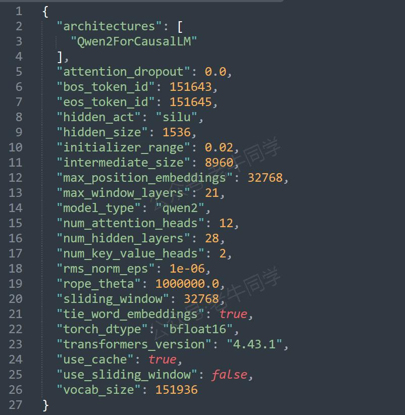
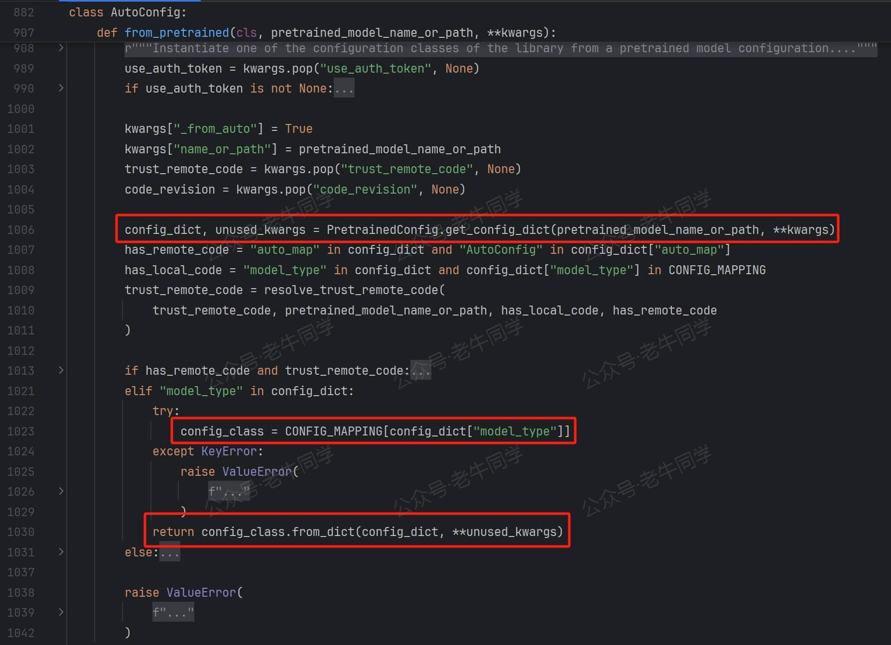
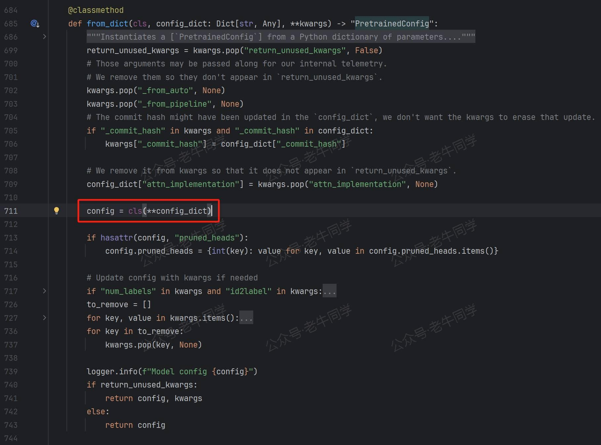
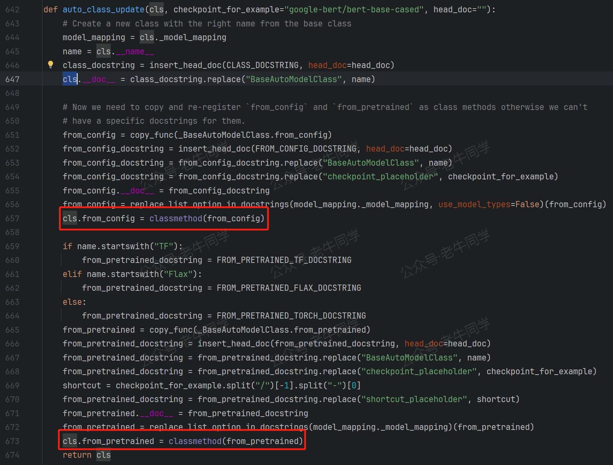
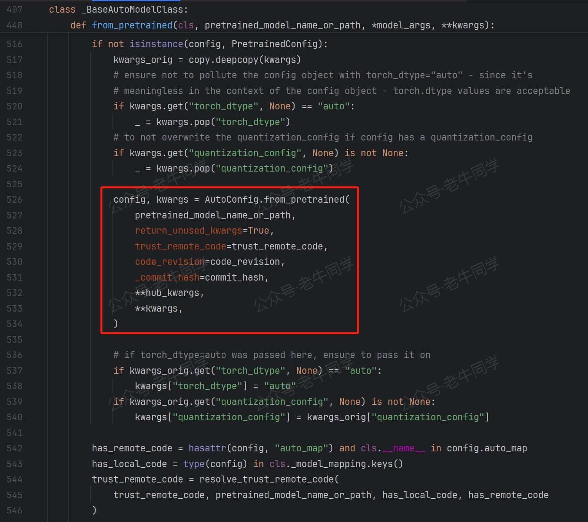
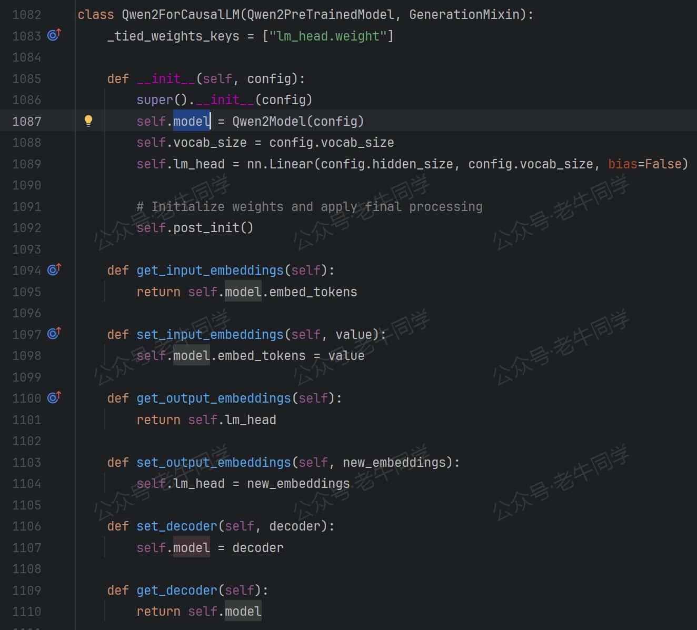

+++
slug = "2024102601"
date = "2024-10-26"
lastmod = "2024-10-26"
title = "transformers 推理 Qwen2.5 等大模型技术细节详解(二)AutoModel 初始化和模型加载（免费送新书）"
description = "本文紧接前篇文章，详细讲解 transformers 初始化和加载大语言模型过程，包括 AutoConfig/Qwen2Config/AutoModelForCausalLM/Qwen2ForCausalLM/Qwen2PreTrainedModel 和 PreTrainedModel 等核心类详解……"
image = "00.jpg"
tags = [ "AI", "Qwen2.5", "transformers" ]
categories = [ "人工智能" ]
+++

接上文：[transformers 推理 Qwen2.5 等大模型技术细节详解(一)transformers 包和对象加载](https://mp.weixin.qq.com/s/lAAIfl0YJRNrppp5-Vuusw)

老牛同学和大家通过 Transformers 框架的一行最常见代码`from transformers import AutoModelForCausalLM`，走读了**transformers 包**初始化代码的整个流程。从中体会到了**dummy**对象、**LazyModule**延迟模块和按需加载、API 简化使用等这些**transformers 包**的设计美学，为我们设计超大 Python 包提供了很好的借鉴思路。

本文是**使用 Transformers 推理 LLM 技术细节**的第 2 篇文章，我们将基于 Qwen2.5 大模型，通过模型配置和`from_pretrained`代码，了解**AutoModel**模型初始化的技术细节：

1. 环境准备：配置虚拟环境，下载 Qwen2.5 模型文件
2. Qwen2.5 模型配置文件**config.json**各个配置项说明，并介绍**AutoConfig**加载文件到**Qwen2Config**配置
3. 走读`AutoModelForCausalLM.from_pretrained`方法代码，详细介绍模型初始化流程
4. 在最后，老牛同学又来搞个小活动，免费包邮送几本新书给大家，期望大家踊跃参与


在以上 Transformers 框架推理 LLM 的核心框架代码中，我们本次将走读的代码是`from_pretrained`方法：

```python
from transformers import AutoModelForCausalLM
model = AutoModelForCausalLM.from_pretrained(
    model_dir,
    torch_dtype="auto",
    device_map="auto",
    local_files_only=True,
)
```

# 环境准备：配置虚拟环境和下载 Qwen2.5 模型文件

【配置虚拟环境】 在上一篇我们已经配置好了虚拟环境，老牛同学就只简单罗列一下配置脚本：

```shell
# Python虚拟环境名：Qwen2.5，版本号：3.10
conda create -n Qwen2.5 python=3.10 -y

# 激活虚拟环境
conda activate Qwen2.5

# 下载Python依赖包
pip install torch
pip install "transformers>=4.43.1"
pip install "accelerate>=0.26.0"
```

【下载 Qwen2.5 模型文件】 老牛同学存放模型文件目录：`Qwen2.5-1.5B-Instruct`

```shell
# Git大文件系统
git lfs install

# 下载模型文件
git clone https://www.modelscope.cn/qwen/Qwen2.5-1.5B-Instruct.git Qwen2.5-1.5B-Instruct
```

若下载过程中异常中断，可以通过`git lfs install`命令继续下载：

```shell
# 切换到Git目录
cd Qwen2.5-1.5B-Instruct

# 中断继续下载
git lfs install
git lfs pull
```

下载完成，可以看到如下文件结构：


针对本文大模型初始化来说，我们重点关注**config.json**模型配置文件和**model.safetensors**模型文件：

1. **model.safetensors**文件是模型文件（主要为权重参数数据），它存储了验证文件完整性的校验和、模型张量元数据和张量权重参数等。我们将在代码流程中详细说明这些数据。
2. **config.json**文件是模型的配置文件，包括了模型框架、训练设置、各种超参数等信息：



# **config.json**参数详解和 AutoConfig 初始化

老牛同学对**config.json**文件中的每个参数进行简单说明：

| 参数名                  | 配置值           | 参数说明                                                                                                                                                                     |
| ----------------------- | ---------------- | ---------------------------------------------------------------------------------------------------------------------------------------------------------------------------- |
| architectures           | Qwen2ForCausalLM | 模型的架构名称，**Qwen2ForCausalLM**是 Qwen 推理模型，在模型初始化方式将会实际使用                                                                                           |
| attention_dropout       | 0.0              | 注意力机制中的 Dropout 操作概率，**0.0**代表不对注意力权重进行随机置零操作，即保留所有的注意力权重                                                                           |
| bos_token_id            | 151643           | 文本序列开始 Token ID 标记（Begin of Sentence Token ID），代表文本片段开始位置                                                                                               |
| eos_token_id            | 151645           | 文本序列结束 Token ID 标记（End of Sentence Token ID），代表文本片段结束位置                                                                                                 |
| hidden_act              | silu             | 模型隐藏层使用**SiLU**激活函数（其他激活函数：ReLU，Tanh，Sigmoid 等）                                                                                                       |
| hidden_size             | 1536             | 隐藏层的维度（或每个隐藏层中神经元的数量），数值越大意味着模型能学习更复杂的特征和模式                                                                                       |
| initializer_range       | 0.02             | 模型训练时初始化权重的标准差，**0.02**代表权重从均值为 0、标准差为 0.02 的正态分布中随机初始化                                                                               |
| intermediate_size       | 8960             | 前馈神经网络中间层的维度，通常要比**hidden_size**大得多，用于增加模型学习能力                                                                                                |
| max_position_embeddings | 32768            | 模型可以处理的最大序列长度，**32768**代表模型可以处理最长为 32768 个 Token 的输入序列                                                                                        |
| max_window_layers       | 21               | 模型在处理长序列时，最多可以应用多少层的滑动窗口策略，即可以对长序列进行多少次分隔和处理                                                                                     |
| model_type              | qwen2            | Qwen2 模型类型标识，用于映射 Qwen2Config 和 Qwen2ForCausalLM 等实际类                                                                                                        |
| num_attention_heads     | 12               | 多头注意力机制中注意力头的数量，**12**代表每个隐藏层中使用 12 个注意力头                                                                                                     |
| num_hidden_layers       | 28               | 模型隐藏层的数量                                                                                                                                                             |
| num_key_value_heads     | 2                | 多头自注意力机制中键（Key）和值（Value）的注意力头数量，共**12**个注意头而键值只有**2**个头，则意味着查询（Query）头可以共享相同的键和值头                                   |
| rms_norm_eps            | 1e-06            | 使用 RMSNorm 归一化技术处理，分母增加一个极小值，避免除以零的情况，保证归一化的有效性                                                                                        |
| rope_theta              | 1000000.0        | RoPE 旋转位置编码的周期性因子，用于捕捉长距离依赖关系，提高模型的数值稳定性                                                                                                  |
| sliding_window          | 32768            | 模型在处理长序列时采用的滑动窗口序列长度，即通过滑动窗口的方式处理超过**max_position_embeddings**的长序列策略                                                                |
| tie_word_embeddings     | true             | 模型的输入和输出层之间共享词嵌入矩阵标识                                                                                                                                     |
| torch_dtype             | bfloat16         | 模型权重采用 bfloat16 浮点数格式（1 位符号位+8 位指数位+7 位尾数位），它区别于 float16 半精度浮点数格式（1 位符号位 5 位指数位+10 位尾数位），通过增加指数位数以提高数字精度 |
| transformers_version    | 4.43.1           | Transformers 推理模型的版本号，通常是指最低版本，`pip install "transformers>=4.43.1"`，我们依赖包版本为`4.45.1`                                                              |
| use_cache               | true             | 模型推理过程中使用缓存机制标识，用于缓存中间结果，避免重复计算                                                                                                               |
| use_sliding_window      | false            | 模型处理长序列时是否使用滑动窗口机制，**false**代表禁用滑动窗口机制，则意味着模型将尝试一次性处理整个长序列，可能会导致内存占用和计算复杂度增加                              |
| vocab_size              | 151936           | 模型词汇表的大小，**AutoTokenizer** 我们将会介绍                                                                                                                             |

**特别注意**：在上述配置参数中，**use_sliding_window = false**意味着模型禁用滑动窗口机制，即**sliding_window = 32768**参数设置不生效，也就是模型能够处理的最大序列长度为**max_position_embeddings = 32768**个 Token，超过这个长度的序列将无法正确处理；如果我们需要处理接近或超过**32768** 个 Token 的长序列，建议启用滑动窗口机制（**use_sliding_window = true**）！

模型配置参数，我们可以通过**AutoConfig**进行加载和打印出各个参数项：

```python
import os
from transformers import AutoConfig

# 加载配置文件
config_path = os.path.join('D:', os.path.sep, 'ModelSpace', 'Qwen2.5', 'Qwen2.5-1.5B-Instruct', 'config.json')
config = AutoConfig.from_pretrained(config_path)

# 查看词汇表大小，输出: 151936
print(config.vocab_size)

# 查看配置所有内容
print(config)
```

最终输出结果如下，**config**返回结果为**Qwen2Config**实例：


是不是感觉有点奇怪，我们并没有**Qwen2Config**相关配置，但最终结果就有了它？接下来，我们来一起看下代码`AutoConfig.from_pretrained`流程：

首先，根据我们**第 1 篇**文章的介绍，我们能快速定位到**AutoConfig**所在模块为**models.auto**：

```python
_import_structure = {
    # ....
    "models.auto": [
        # ....
        "AutoConfig",
        # ....
    ]
}
```

然后，我们打开 Transformers 包下 **./models/auto/\_\_init\_\_.py** 文件，可以定位到**AutoConfig**类型所在模块**configuration_auto.py**：

```python
_import_structure = {
    # ...
    "configuration_auto": ["CONFIG_MAPPING", "MODEL_NAMES_MAPPING", "AutoConfig"],
    # ...
}
```

`AutoConfig.from_pretrained`方法定义如下，红框代码比较关键：



下面对红框代码进行详细说明：

1. `config_dict, * = PretrainedConfig.get_config_dict(config_path, _)`代码行：这行代码逻辑稍微比较简单，就是解析**config.json**JSON 格式文件，返回字典对象
2. `config_class = CONFIG_MAPPING[config_dict["model_type"]]`代码行：前面的配置文件，`config_dict["model_type"]`的结果是**qwen2**，而`CONFIG_MAPPING`是一个字典常量，它的定义如下：

```python
CONFIG_MAPPING_NAMES = OrderedDict(
    [
        # ...
        ("qwen2", "Qwen2Config"),
        ("qwen2_audio", "Qwen2AudioConfig"),
        ("qwen2_audio_encoder", "Qwen2AudioEncoderConfig"),
        ("qwen2_moe", "Qwen2MoeConfig"),
        ("qwen2_vl", "Qwen2VLConfig"),
        # ...
    ]
)
```

因此，这行代码的最终结果**config_class**内容为`Qwen2Config`，因此它就是从这里来的。

根据我们**第 1 篇**文章的介绍，我们快速定位到**Qwen2Config**类所在模块为 **./models/qwen2/configuration_qwen2.py**，它的定义如下：


从**Qwen2Config**类的定义我们可以看到：它没有具体方法，因此它的方法均来自**PretrainedConfig**父类；同时，类构造函数，有**vocab_size**/**hidden_size**等命名参数，而这些命名参数，正是前面介绍的**config.json**配置文件参数项。

3. `return config = class.from_dict(config_dict, _)`代码行：最终返回**Qwen2Config.from_dict()**方法调用，我们打开**PretrainedConfig.from_dict()**方法：



核心代码行`config = cls(**config_dict)`即实例化**Qwen2Config**类，入参即**config.json**的配置项，最终完成了我们最开始的`print(config)`输出结果闭环。

到这里，我们基本完成了**config.json**配置项说明和用法，老牛同学整理了`AutoConfig.from_pretrained(config_path)`代码行的执行流程：


# **AutoModelForCausalLM.from_pretrained** 模型加载

我们还是根据**第 1 篇**文章方法，找到**AutoModelForCausalLM**所在模块为 **./models/auto/modeling_auto.py**，它的定义如下：

```python
class AutoModelForCausalLM(_BaseAutoModelClass):
    _model_mapping = MODEL_FOR_CAUSAL_LM_MAPPING


AutoModelForCausalLM = auto_class_update(AutoModelForCausalLM, head_doc="causal language modeling")
```

其中，**MODEL_FOR_CAUSAL_LM_MAPPING**是一个常量字典，存放的是模型类型和模型类的映射关系。根据配置我们可以知道，**Qwen2ForCausalLM**是实际的模型类：

```python
MODEL_FOR_CAUSAL_LM_MAPPING_NAMES = OrderedDict(
    [
        # ...
        ("qwen2", "Qwen2ForCausalLM"),
        ("qwen2_moe", "Qwen2MoeForCausalLM"),
        # ...
    ]
)
```

`auto_class_update(XXXLM, _)`方法是一个非常有趣的方法，这个方法把 **\_BaseAutoModelClass**类的**from_config**和**from_pretrained**方法复制给了**XXXLM**类。因此，当我们调用**XXXLM.from_config**或者**XXXLM.from_pretrained**方法时，方法的内部逻辑与 **\_BaseAutoModelClass.from_config**和 **\_BaseAutoModelClass.from_pretrained**实际方法一致！



接下来，我们来看看 **AutoModelForCausalLM.from_pretrained()** 的执行逻辑：

```python
model = AutoModelForCausalLM.from_pretrained(
    model_dir,
    torch_dtype="auto",
    device_map="auto",
    local_files_only=True,
)
```

**\_BaseAutoModelClass.from_pretrained** 方法有点长，老牛同学截图最关键的几行代码：




1. 模型配置加载：**AutoConfig.from_pretrained**，结果为**Qwen2Config**配置类
2. 通过同样的方式，根据配置文件**model_type**模型类型映射到实际类，最终执行**Qwen2ForCausalLM.from_pretrained**方法

**Qwen2ForCausalLM**类定义：继承**Qwen2PreTrainedModel**父类，包含了**Qwen2Config**配置，和**Qwen2Model**为实际的模型类



我们继续查看**Qwen2PreTrainedModel**类：它继承**PreTrainedModel**类，并没有定义方法。**PreTrainedModel**类是所有模型的基类，它继承**nn.Module**类，它定义了**from_pretrained()**方法：


这个方法代码行超级长，老牛同学把它大致分为以下**4 部分**：

1. 解析模型文件路径，即我们下载的权重文件：**./Qwen2.5-1.5B-Instruct/model.safetensors**

```python
elif use_safetensors is not False and os.path.isfile(
    os.path.join(pretrained_model_name_or_path, subfolder, _add_variant(SAFE_WEIGHTS_NAME, variant))
):
    # Load from a safetensors checkpoint
    archive_file = os.path.join(
        pretrained_model_name_or_path, subfolder, _add_variant(SAFE_WEIGHTS_NAME, variant)
    )

# ...省略...

if is_local:
    logger.info(f"loading weights file {archive_file}")
    resolved_archive_file = archive_file
```

其中，**SAFE_WEIGHTS_NAME**常量值为**model.safetensors**，**archive_file**变量即为权重文件完整路径，最终赋值给了**resolved_archive_file**变量。

2. 解析模型文件，获取模型元数据，模型格式为**pt**即为 PyTorch 深度学习框架，并加载模型权重：

```python
if (
    is_safetensors_available()
    and isinstance(resolved_archive_file, str)
    and resolved_archive_file.endswith(".safetensors")
):
    with safe_open(resolved_archive_file, framework="pt") as f:
        metadata = f.metadata()

    if metadata.get("format") == "pt":
        pass

# ...省略...

from_pt = not (from_tf | from_flax)

# load pt weights early so that we know which dtype to init the model under
if from_pt:
    if not is_sharded and state_dict is None:
        # Time to load the checkpoint
        state_dict = load_state_dict(resolved_archive_file)
```

3. 实例化**AutoModelForCausalLM**类，**model**变量即为对象实例：

```python
with ContextManagers(init_contexts):
    # Let's make sure we don't run the init function of buffer modules
    model = cls(config, *model_args, **model_kwargs)

# make sure we use the model's config since the __init__ call might have copied it
config = model.config
```

4. 加载模型，并设置模型为推理模式，同时设置模型配置，最后分发模型：

```python
elif from_pt:
    # restore default dtype
    if dtype_orig is not None:
        torch.set_default_dtype(dtype_orig)

    (
        model,
        missing_keys,
        unexpected_keys,
        mismatched_keys,
        offload_index,
        error_msgs,
    ) = cls._load_pretrained_model(
        model,
        state_dict,
        # ...省略...


# ...省略...

# Set model in evaluation mode to deactivate DropOut modules by default
model.eval()

# ...省略...

model.generation_config = GenerationConfig.from_pretrained(
    pretrained_model_name_or_path,
    cache_dir=cache_dir,
    force_download=force_download,
    resume_download=resume_download,
    proxies=proxies,
    local_files_only=local_files_only,
    token=token,
    revision=revision,
    subfolder=subfolder,
    _from_auto=from_auto_class,
    _from_pipeline=from_pipeline,
    **kwargs,
)

# ...省略...

if not is_fsdp_enabled() and not is_deepspeed_zero3_enabled():
    dispatch_model(model, **device_map_kwargs)
```

最终，当我们执行`model = AutoModelForCausalLM.from_pretrained()`代码的结果，即为**Qwen2ForCausalLM**类的实例，它就是 PyTorch 的**nn.Module**的实例。老牛同学把整个处理流程整理如下：


至此，使用 Transformers 初始化大模型部分就基本结束了，老牛同学在接下来的文章，将与大家一起看看文本**AutoTokenizer**技术，它也是大模型推理的关键部分~

# 最后：又来给大家免费包邮送几本新书

前面我们已经举办过 3 次免费包邮送书活动：

1. [ChatTTS 长音频合成和本地部署 2 种方式，让你的“儿童绘本”发声的实战教程（文末有福利）](https://mp.weixin.qq.com/s/9ldLuh3YLvx8oWvwnrSGUA)
2. [使用世界领先的 Qwen2.5-Math 开源模型当 AI 数学老师，让奥数解题辅导父慈子孝（文末有福利）](https://mp.weixin.qq.com/s/6yKkaCZU_XXec9mVBMmc1Q)
3. [transformers 推理 Qwen2.5 等大模型技术细节详解(一)transformers 包和对象加载（文末免费送书）](https://mp.weixin.qq.com/s/lAAIfl0YJRNrppp5-Vuusw)

本期，老牛同学继续和出版社朋友合作，举办第 4 次送书福利小活动，新书是：《**Python 金融大数据分析快速入门和案例详解**》


本期送书小活动的规则和之前类似，总体如下：

1. 关注**老牛同学**微信公众号，因为这是老牛同学公众号关注者的小福利
2. 在本文的评论区进行**留言**，留言的**点赞**数排名**前 3 名**的朋友，**免费**且**包邮**获得 1 本书（即：默认送 3 本书）
3. 若本文的**阅读量**和**老牛同学** CSDN 同文的阅读量之和达到了**2000**（含**2000**），则留言的**点赞**数排名**前 6 名**的朋友均免费包邮送书（即：最多送 6 本书）
4. 活动时间：2024 年 10 月 27 日到 2024 年 11 月 3 号上午 12 点整（正好 1 周，周末可寄送新书）
5. 老牛同学不参与本次活动（因为老牛同学默认就有 1 本）

为方便大家购买本书，老牛同学贴上京东商品链接：

【书籍购买链接】

---

往期推荐文章：

<small>[基于 Qwen2.5-Coder 模型和 CrewAI 多智能体框架，实现智能编程系统的实战教程](https://mp.weixin.qq.com/s/8f3xna9TRmxMDaY_cQhy8Q)</small>

<small>[vLLM CPU 和 GPU 模式署和推理 Qwen2 等大语言模型详细教程](https://mp.weixin.qq.com/s/KM-Z6FtVfaySewRTmvEc6w)</small>

<small>[基于 Qwen2/Lllama3 等大模型，部署团队私有化 RAG 知识库系统的详细教程（Docker+AnythingLLM）](https://mp.weixin.qq.com/s/PpY3k3kReKfQdeOJyrB6aw)</small>

<small>[使用 Llama3/Qwen2 等开源大模型，部署团队私有化 Code Copilot 和使用教程](https://mp.weixin.qq.com/s/vt1EXVWtwm6ltZVYtB4-Tg)</small>

<small>[基于 Qwen2 大模型微调技术详细教程（LoRA 参数高效微调和 SwanLab 可视化监控）](https://mp.weixin.qq.com/s/eq6K8_s9uX459OeUcRPEug)</small>

<small>[ChatTTS 长音频合成和本地部署 2 种方式，让你的“儿童绘本”发声的实战教程](https://mp.weixin.qq.com/s/9ldLuh3YLvx8oWvwnrSGUA)</small>

<small>[transformers 推理 Qwen2.5 等大模型技术细节详解(一)transformers 包和对象加载](https://mp.weixin.qq.com/s/lAAIfl0YJRNrppp5-Vuusw)</small>


