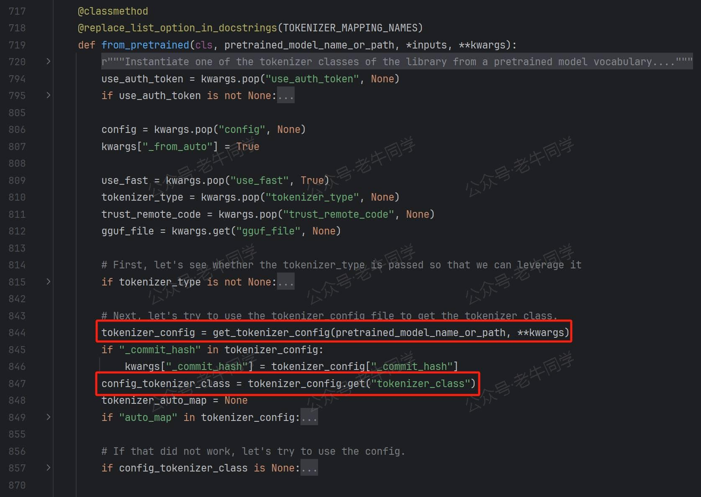
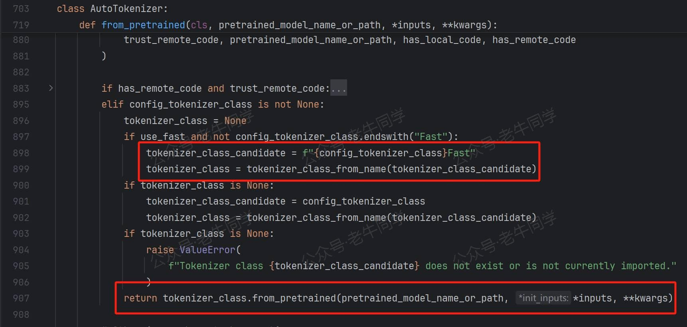
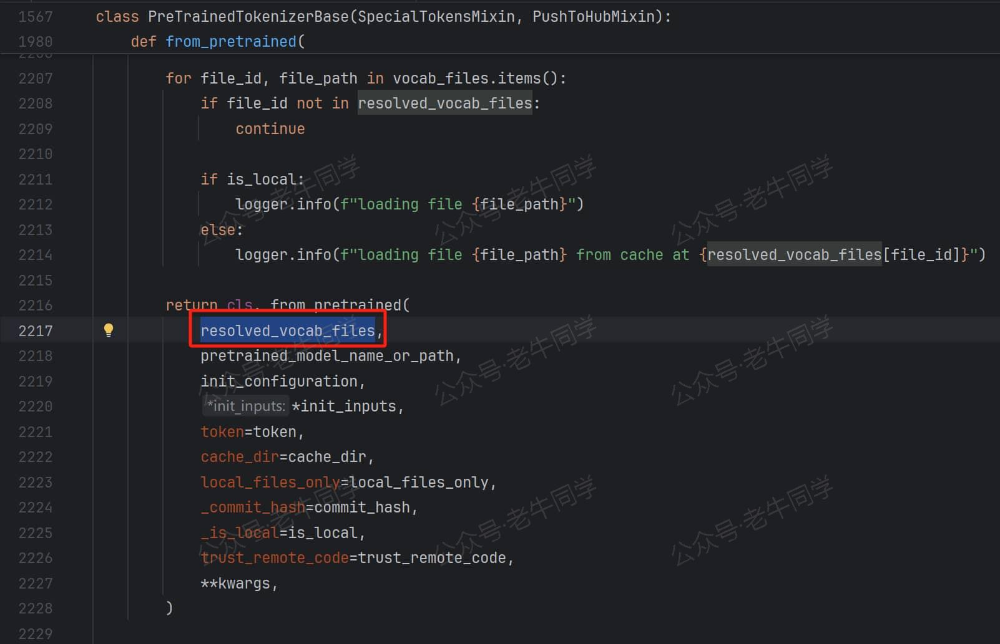
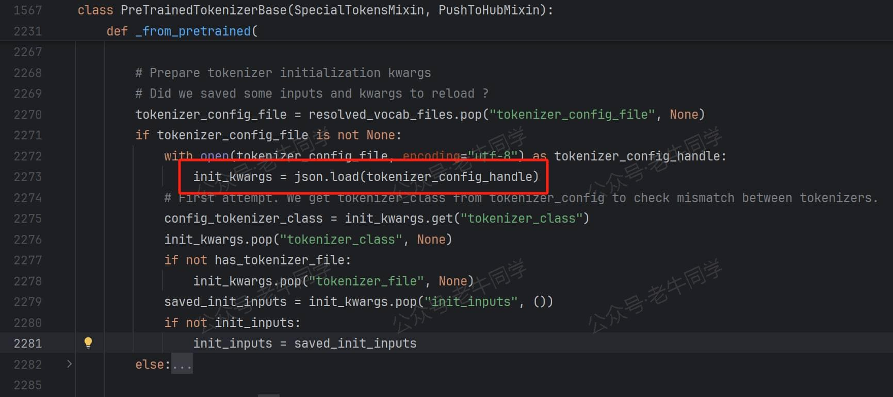
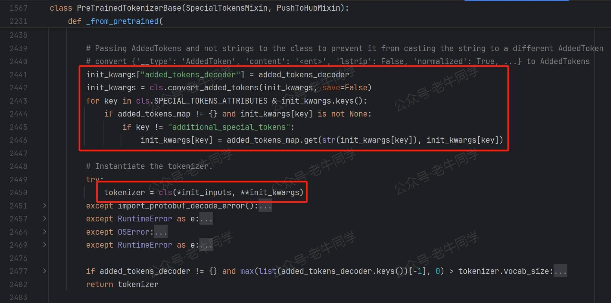
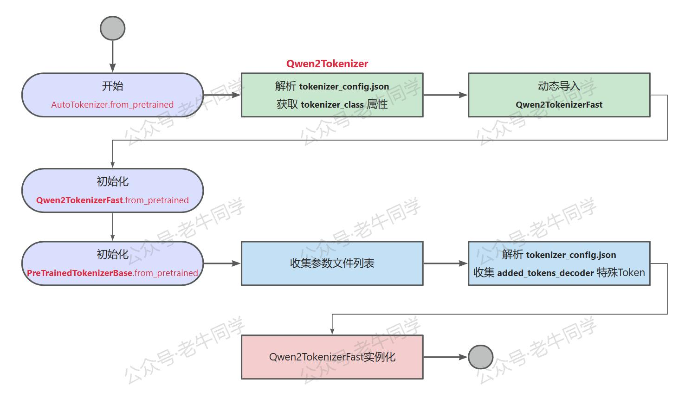

+++
slug = "2024103101"
date = "2024-10-31"
lastmod = "2024-10-31"
title = "深入解析 Transformers 框架（三）：Qwen2.5 大模型的 AutoTokenizer 技术细节"
description = "本文是 Transformers 推理大语言模型技术细节的第 3 篇，基于 Qwen2.5 大模型，通过源代码走读，详细介绍了 AutoTokenizer 的分词器初始化、存储流程和技术细节。文章涵盖分词器的配置解析、字节对编码（BPE）分词算法，以及分词、编码、解码和添加 Token 等常用操作……"
image = "00.jpg"
tags = [ "AI", "Qwen2.5", "transformers", "AutoTokenizer" ]
categories = [ "人工智能" ]
+++

前面 2 篇文章，我们通过查看 Transformers 包代码，学习了 Transformer 包模块 API 设计、模型初始化和加载流程：

- 第 1 篇：[transformers 推理 Qwen2.5 等大模型技术细节详解(一)transformers 包和对象加载](https://mp.weixin.qq.com/s/lAAIfl0YJRNrppp5-Vuusw)
- 第 2 篇：[transformers 推理 Qwen2.5 等大模型技术细节详解(二)AutoModel 初始化和模型加载](https://mp.weixin.qq.com/s/WIbbrkf1HjVC1CtBNcU8Ow)

本文是 Transformers 推理 LLM 大语言模型技术细节的第 3 篇，我们将基于 Qwen2.5 大模型，通过走读 Transformers 源代码的方式，来学习**AutoTokenizer**技术细节：

1. 环境准备：配置虚拟环境，下载 Qwen2.5 模型文件
2. **AutoTokenizer**分词器介绍、初始化和存储代码流程的技术细节
3. **Qwen2.5**使用的分词算法介绍，和一些常用的 Token 操作用法

# 环境准备：配置虚拟环境和下载模型文件

【配置虚拟环境】 我们可以继续使用在上一篇中我们已经配置好的虚拟环境：

```shell
# Python虚拟环境名：Qwen2.5，版本号：3.10
conda create -n Qwen2.5 python=3.10 -y

# 激活虚拟环境
conda activate Qwen2.5

# 安装必要的Python依赖包
pip install torch
pip install "transformers>=4.43.1"
pip install "accelerate>=0.26.0"
```

【下载 Qwen2.5 模型文件】 我们也可以继续使用在上一篇中下载好的模型文件：

```shell
# Git大文件系统
git lfs install

# 下载模型文件
git clone https://www.modelscope.cn/qwen/Qwen2.5-1.5B-Instruct.git Qwen2.5-1.5B-Instruct

# 若下载过程中异常中断，可以通过`git lfs install`命令继续下载：
# 切换到Git目录
cd Qwen2.5-1.5B-Instruct

# 中断继续下载
git lfs install
git lfs pull
```

# AutoTokenizer 初始化和存储流程

在大模型中，**分词**就是把模型的输入内容（如：文本序列）转换为**Token**（也称：词元）序列，Token 是最小的语义单元，且每个 Token 都有相对完整的语义。

如下代码示例，我们可以通过`AutoTokenizer.from_pretrained`方法初始化分词器：

```python
import os

from transformers import AutoTokenizer

# 初始化分词器，从本地文件加载模型
model_dir = os.path.join('D:', os.path.sep, 'ModelSpace', 'Qwen2.5', 'Qwen2.5-1.5B-Instruct')
tokenizer = AutoTokenizer.from_pretrained(
    model_dir,
    local_files_only=True,
)
```

根据**第 1 篇**Transformers 包模块设计，我们可以找到**AutoTokenizer**类定义在`./models/auto/tokenization_auto.py`模块中，我们可以走读**from_pretrained**方法执行流程：

**第 1 步**：`AutoTokenizer.from_pretrained`解析**tokenizer_config.json**配置文件，获取**tokenizer_class**配置项，Qwen2.5 的配置文件中的值为**Qwen2Tokenizer**：



**第 2 步**：默认情况下，Transformers 优先使用带有**Fast**结尾的、性能更好的分词器实现。因此会先把**Qwen2Tokenizer**类型转为**Qwen2TokenizerFast**类，并调用`tokenizer_class_from_name()`方法加载**Qwen2TokenizerFast**类：



最终，成功加载**Qwen2TokenizerFast**类后，调用`Qwen2TokenizerFast.from_pretrained`进一步完成初始化。

其中，`tokenizer_class_from_name()`是一个重要的方法，它的定义如下，我们可以看到它的实现和我们**第 1 篇**中动态模块加载非常类似：


执行逻辑是从**TOKENIZER_MAPPING_NAMES**常量中，循环匹配到**Qwen2TokenizerFast**类型，并且得到**qwen2**模块名称，为动态加载提供完整的模块路径：

```python
# ...省略...
(
    "qwen2",
    (
        "Qwen2Tokenizer",
        "Qwen2TokenizerFast" if is_tokenizers_available() else None,
    ),
),
# 说明：is_tokenizers_available() 方法定义在 transformers.utils.import_utils.py 模块中，其值为 True
# ...省略...
```

从动态加载代码可以看出，**Qwen2TokenizerFast**类定义在`transformers.models.qwen2.tokenization_qwen2_fast.py`模块中：

**第 3 步**：分词器执行`Qwen2TokenizerFast.from_pretrained`方法，由于`Qwen2TokenizerFast -> PreTrainedTokenizerFast -> PreTrainedTokenizerBase`类继承链，**from_pretrained**方法实际在**PreTrainedTokenizerBase**类定义。

在`PreTrainedTokenizerBase.from_pretrained`方法中，主要是在收集配置参数文件列表，最终执行`Qwen2TokenizerFast._from_pretrained`方法，实际还是`PreTrainedTokenizerBase._from_pretrained`方法：



最终收集到的配置文件不一定都存在，其中 vocab_file/merges_file/tokenizer_file/tokenizer_config_file 存在对应的文件，而 added_tokens_file/special_tokens_map_file 文件却并不存在。文件不存在其实不影响接下来的处理逻辑，因为收集文件的目的是为了解析且内，只要内容存在就可以了，接下来我们将会看到。

**第 4 步**：解析**tokenizer_config.json**配置文件，收集初始化参数（**init_kwargs**变量）：



其实在**第 1 步**的时候，为了获取**tokenizer_class**配置项，这个配置文件就解析过一次。然而在这里再次解析了一次，并且再次获取了一次该配置项！

**第 5 步**：继续收集参数，包括 3 个配置文件路径，和**tokenizer_config.json**配置文件中的**added_tokens_decoder**配置项字典元素内容：


收集的 3 个文件为 vocab_file/merges_file/tokenizer_file，而**added_tokens_decoder**配置项内容为特殊 Token ID 和映射。

**第 6 步**：规整化收集到的特殊 Token 参数，最后进行**Qwen2TokenizerFast**类实例化：



至此，`AutoTokenizer.from_pretrained`初始化完成，其实我们也可以看到，其实我们直接使用`Qwen2TokenizerFast.from_pretrained`方法结果一样，并且还可以直接跳过**第 1 步**和**第 2 步**解析**Qwen2TokenizerFast**的处理过程，因此代码执行效率会更高一些。

最后，老牛同学用一张图对上面步骤进行简单总结：



接下来，我们可以通过`XXXTokenizer.save_pretrained`方法存储分词器：

```python
# 存储分词器
save_dir = os.path.join('D:', os.path.sep, 'ModelSpace', 'Qwen2.5', 'Qwen2.5-1.5B-Instruct-COPY')
tokenizer.save_pretrained(save_dir)
```

执行完成，我们可以看到**Qwen2.5-1.5B-Instruct-COPY**目录中 6 个文件，而这 6 个文件，正是初始化过程中收集的那 6 个文件：


分词器存储的文件列表中，**vocab.json** 就是我们的词表文件，文件内容是一个大字典，字典键为 Token，字典值就是对应的 Token ID（从 0 开始）值。

# Qwen2.5 字节对编码（Byte Pair Encoding, BPE）分词算法

接着，我们尝试用编辑器打开**vocab.json**词表文件可以看到：第 1 个 Token 是`!`，接着是一些数字、字母、标点符号等 Token，这些还好理解；接下来是一些如`ort`、`ass`等英语短语，它们不是完整的单词，当然也能看到一些如`at`、`Check`、`inner`等完整单词；在接下来感觉就开始是乱码了，应该不是完整的汉字。最大的 Token ID 为**151642**代表了词表的大小。

根据上面看到的内容初步判断：Qwen2.5 并不是按照单词或者汉字粒度进行分词，我们也可以从**Qwen2TokenizerFast**类源代码注释也可以佐证（**Based on byte-level Byte-Pair-Encoding.**）。

首先有个疑惑：大模型为什么不能按照单个完整的单词或者汉字的粒度进行分词，这样分词的方法不是更加便于理解、同时分词结果也更加直观吗？

老牛同学认为有 2 个主要的考虑因素：

- 能有效控制 Token 总数量，不至于随着单词或者汉字等词汇的增长而膨胀，可以有效地节省内存和计算资源；同时，当有新造词出现时，无需更新模型的词表。
- 能有效处理预训练时未遇见或罕见词汇，因为分词算法将这些词汇分解为已知的 Token 单元。

字节对编码（Byte Pair Encoding, BPE）是一种流行的分词算法，它的主要思想是通过迭代合并最常见的字符对来生成词汇表。主要步骤：

1. 初始化词汇表：从字符级别开始，词汇表包含所有出现的字符。
2. 统计字符对频率：统计文本中所有字符对的出现频率。
3. 合并最常见的字符对：将出现频率最高的字符对合并为一个新的 Token，并更新词汇表。
4. 重复步骤 2 和 3：重复上述过程，直到达到预定的词汇表大小或满足预设的停止条件。

举一个简单例子：假设我们的语料库就一句话**Hello World.**，我们首先统计单词出现频率（“Hello”:1 次，“ ”:1 次，“World”:1 次， “.”:1 次）

- 第 1 步，初始化词汇表：{H，e，l，o，空格，W，r，d，句号}
- 第 2 步，统计字符对频率：{H:1 次，e:1 次，l:3 次，o:2 次，空格:1 次，W:1 次, r:1 次，d:1 次，句号:1 次}
- 第 3 步，合并最常见的字符对：l 和 o 频次最高，组合的 Token 为**llo**
- 继续第 2 步，此时词汇表：{H:1 次，e:1 次，l:1 次，llo:1 次，o:1 次，空格:1 次，W:1 次, r:1 次，d:1 次，句号:1 次}
- 继续第 3 步，假设合并 H 和 e 组成新 Token 为**He**
- 继续第 2 步，此时词汇表：{He:1 次，l:1 次，llo:1 次，o:1 次，空格:1 次，W:1 次, r:1 次，d:1 次，句号:1 次}

假设预设停止合并条件为：词汇表大小不超过 9 个词汇，则此时即完成了词汇表的生成过程。

以上是英文构建词汇表，对于中文来说类是，比如中文语料库：**台风又双叒叕来了！**

- 第 1 步，初始化词汇表：'台', '风', '又', '双', '叒', '叕', '来', '了', '！'
- 第 2 步，统计所有相邻字符对的频率：('台', '风'): 1，('风', '又'): 1，('又', '双'): 1，('双', '叒'): 1，('叒', '叕'): 1，('叕', '来'): 1，('来', '了'): 1，('了', '！'): 1
- 第 3 步，合并最常见的字符对：由于字符对的频率相同，因此可选择任意一个进行合并，比如合并('台', '风')为：'台风', '又', '双', '叒', '叕', '来', '了', '！'
- 继续第 2 步，统计频率；然后第 3 步合并字符对，直到达到终止条件

# Token 常用操作：分词、编码和解码、添加 Token 等

有了分词器和词表，我们就可以对输入的文件进行分词、映射 ID、根据 Token ID 解码成文本、往词表中添加 Token 等操作。

老牛同学下面展示的代码片段，多次使用 tokenizer 实例，建议使用 Jupyter Lab 编辑器：[大模型应用研发基础环境配置（Miniconda、Python、Jupyter Lab、Ollama 等）](https://mp.weixin.qq.com/s/P_ufvz4MWVSqv_VM-rJp9w)

```python
text = 'Transformers分词：台风又双叒叕来了！'
tokens = tokenizer.tokenize(text)

print(tokens)

# 输出：['Transform', 'ers', 'åĪĨ', 'è¯į', 'ï¼ļ', 'åı°é£İ', 'åıĪ', 'åıĮ', 'åı', 'Ĵ', 'åıķ', 'æĿ¥äºĨ', 'ï¼ģ']
```

从上述输出可以看出：**Transformers**单词被分成了**Transform**和**ers**两个 Token。我们可以把上面的 Token 映射其 Token ID：

```python
ids = tokenizer.convert_tokens_to_ids(tokens)

print(ids)

# 输出：[8963, 388, 17177, 99689, 5122, 108118, 99518, 99493, 5758, 240, 122378, 101161, 6313]
```

以上 2 步操作的结果，其实可以通过**编码**方法一步完成：

```python
# 编码
token_ids = tokenizer.encode(text)

print(token_ids)

# 输出：[8963, 388, 17177, 99689, 5122, 108118, 99518, 99493, 5758, 240, 122378, 101161, 6313]
```

可以看出：`tokenizer.encode`编码操作，其实是上面`tokenizer.tokenize`分词和`tokenizer.convert_tokens_to_ids`映射 2 个操作的组合。

Token ID 是计算机识别的，我们可以通过词表和分词器把 Token ID**解码**成文本内容：

```python
# 解码
token_text = tokenizer.decode(token_ids)

print(token_text)

# 输出：Transformers分词：台风又双叒叕来了！
```

接下来，我们来看看如何往词表中增加 Token：添加普通 Token 和添加特殊 Token。

```python
# 添加普通Token，词表中已存在的Token会被忽略
new_tokens = ["老牛同学", "imxulin"]
new_tokens = set(new_tokens) - set(tokenizer.vocab.keys())

num_add_tokens = tokenizer.add_tokens(list(new_tokens))

print(f'新增加 {num_add_tokens}个普通Token到词表。')

# 输出：新增加 2个普通Token到词表。
```

添加特殊 Token 的方法是：`add_special_tokens`，入参是字典，键只能从`bos_token`, `eos_token`, `unk_token`, `sep_token`, `pad_token`, `cls_token`, `mask_token`, `additional_special_tokens`中选择：

```python
# 添加特殊Token，词表存在则忽略
mew_special_tokens = {'cls_token': '[LNTX]'}

num_add_spec_tokens = tokenizer.add_special_tokens(mew_special_tokens)

print(f'新增加 {num_add_spec_tokens}个特殊Token到词表。')
print(f'特殊Token值：{tokenizer.cls_token}')

# 输出：
# 新增加 1个特殊Token到词表。
# 特殊Token值：[LNTX]
```

解下来，我们可以验证以下我们添加的 Token 了：

```python
text = '[LNTX]大家[LNTX]好，我是老牛同学，他是一位[LNTX]大模型[LNTX]爱好者！'
tokens = tokenizer.tokenize(text)

print(tokens)

# 输出：['大家', '[LNTX]', '好', 'ï¼Į', 'æĪijæĺ¯', '老牛同学', 'ï¼Į', 'ä»ĸ', 'æĺ¯ä¸Ģä½į', '大', '模åŀĭ', '[LNTX]', 'çĪ±å¥½èĢħ', 'ï¼ģ']
```

根据输出我们可以看到：新添加的`[LNTX]`特殊 Token，和**老牛同学**普通 Token，在分词结果中都直接作为了一个完整的 Token，没有被进一步的切分。

最后，当我们更新了词表后，为了能让大模型推理过程能正常进行，我们还需要调整模型的 embedding 矩阵大小：

```python
print(f'调整前：{model.model.embed_tokens.weight.size()}')

model.resize_token_embeddings(len(tokenizer))

print(f'调整后：{model.model.embed_tokens.weight.size()}')

# 输出：
# 调整前：torch.Size([151936, 1536])
# 调整后：torch.Size([151668, 1536])
```

分词器的其他用法，如编码和解码多段文本、Token ID 张量填充对齐、超长截断等，请大家阅读官网，有中文版：[https://hf-mirror.com/docs/transformers/v4.46.0/zh/index](https://hf-mirror.com/docs/transformers/v4.46.0/zh/index)

---

往期推荐文章：

<small>[基于 Qwen2.5-Coder 模型和 CrewAI 多智能体框架，实现智能编程系统的实战教程](https://mp.weixin.qq.com/s/8f3xna9TRmxMDaY_cQhy8Q)</small>

<small>[vLLM CPU 和 GPU 模式署和推理 Qwen2 等大语言模型详细教程](https://mp.weixin.qq.com/s/KM-Z6FtVfaySewRTmvEc6w)</small>

<small>[基于 Qwen2/Lllama3 等大模型，部署团队私有化 RAG 知识库系统的详细教程（Docker+AnythingLLM）](https://mp.weixin.qq.com/s/PpY3k3kReKfQdeOJyrB6aw)</small>

<small>[使用 Llama3/Qwen2 等开源大模型，部署团队私有化 Code Copilot 和使用教程](https://mp.weixin.qq.com/s/vt1EXVWtwm6ltZVYtB4-Tg)</small>

<small>[基于 Qwen2 大模型微调技术详细教程（LoRA 参数高效微调和 SwanLab 可视化监控）](https://mp.weixin.qq.com/s/eq6K8_s9uX459OeUcRPEug)</small>

<small>[ChatTTS 长音频合成和本地部署 2 种方式，让你的“儿童绘本”发声的实战教程](https://mp.weixin.qq.com/s/9ldLuh3YLvx8oWvwnrSGUA)</small>

<small>[transformers 推理 Qwen2.5 等大模型技术细节详解(一)transformers 包和对象加载](https://mp.weixin.qq.com/s/lAAIfl0YJRNrppp5-Vuusw)</small>

<small>[transformers 推理 Qwen2.5 等大模型技术细节详解(二)AutoModel 初始化和模型加载](https://mp.weixin.qq.com/s/WIbbrkf1HjVC1CtBNcU8Ow)</small>


