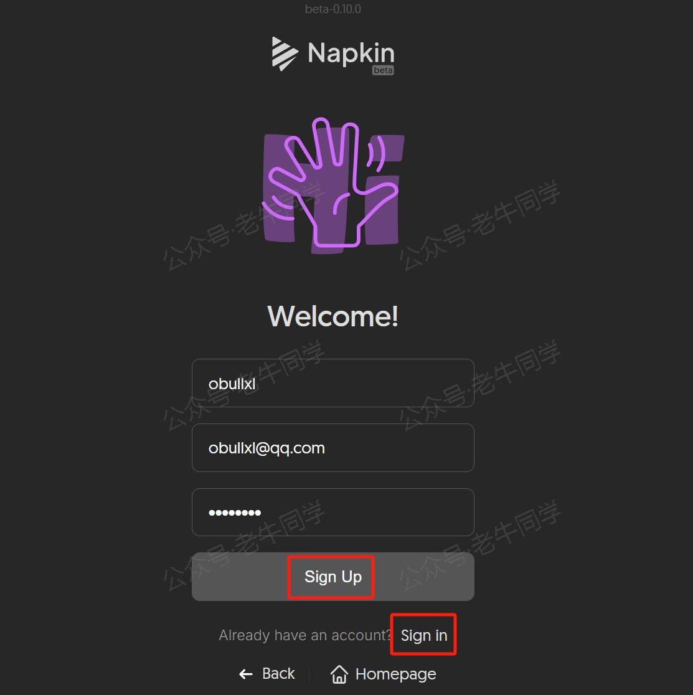
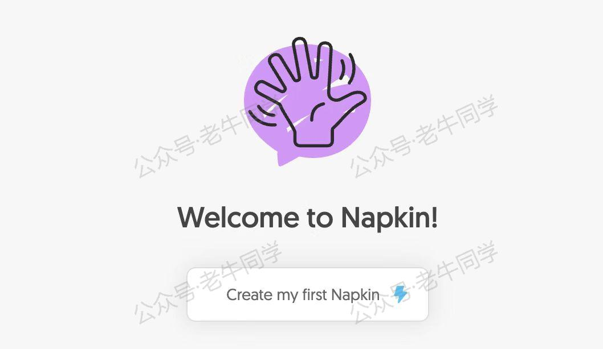
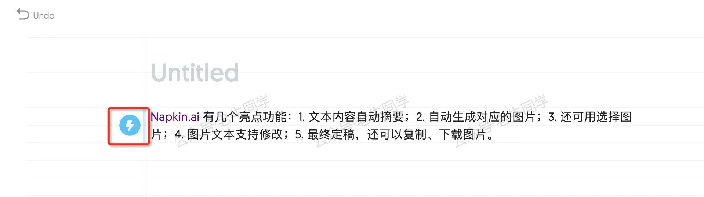
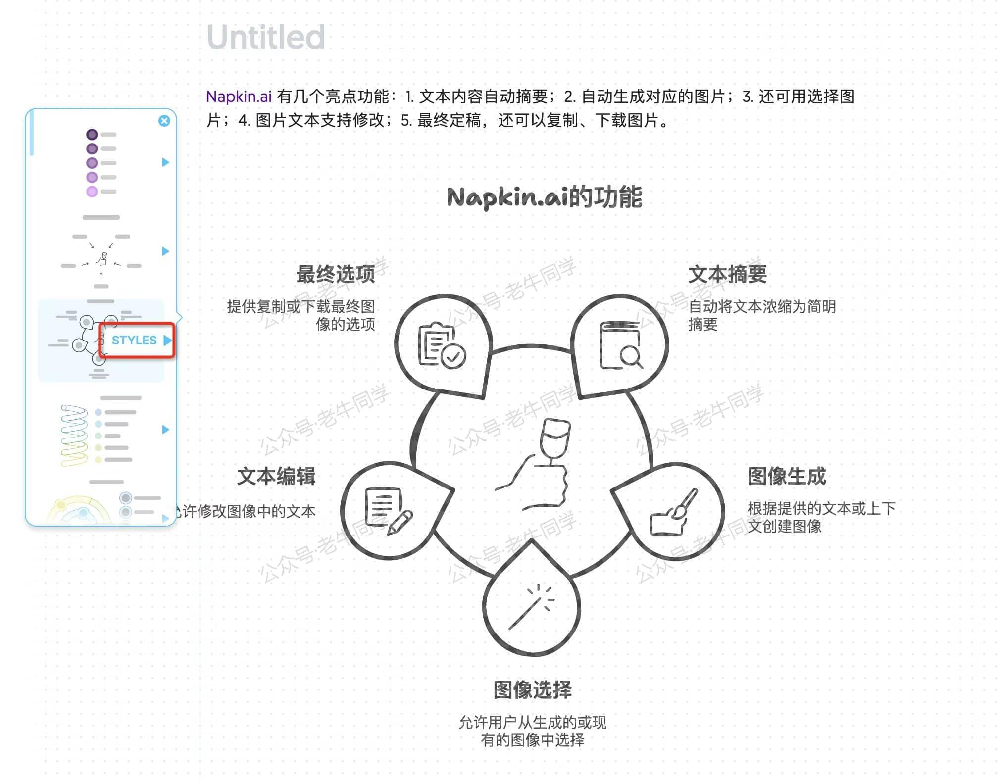
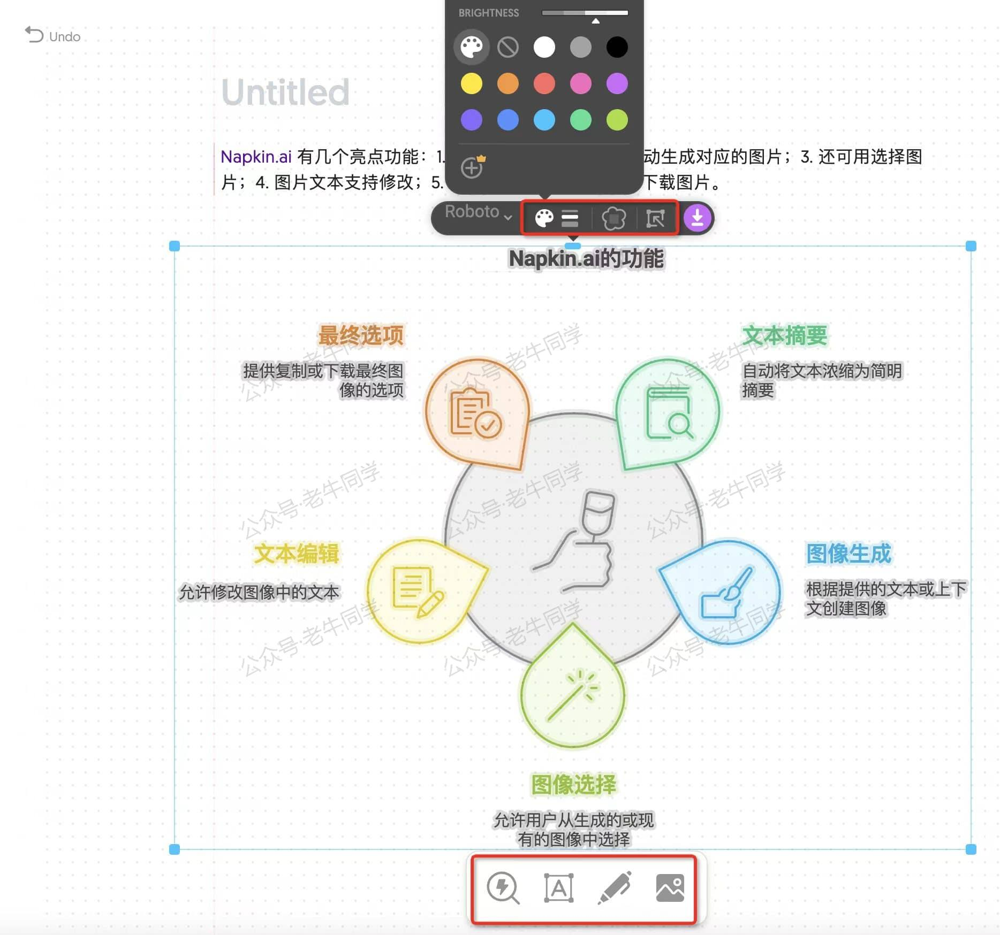
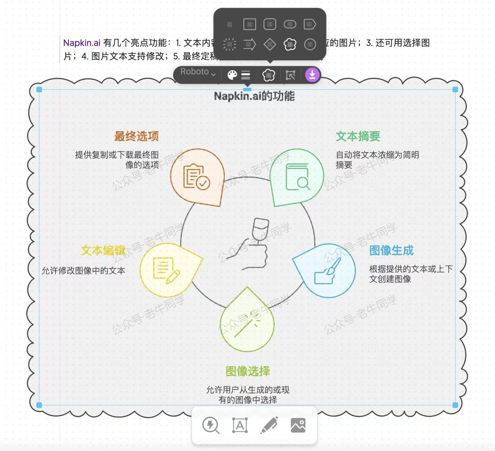
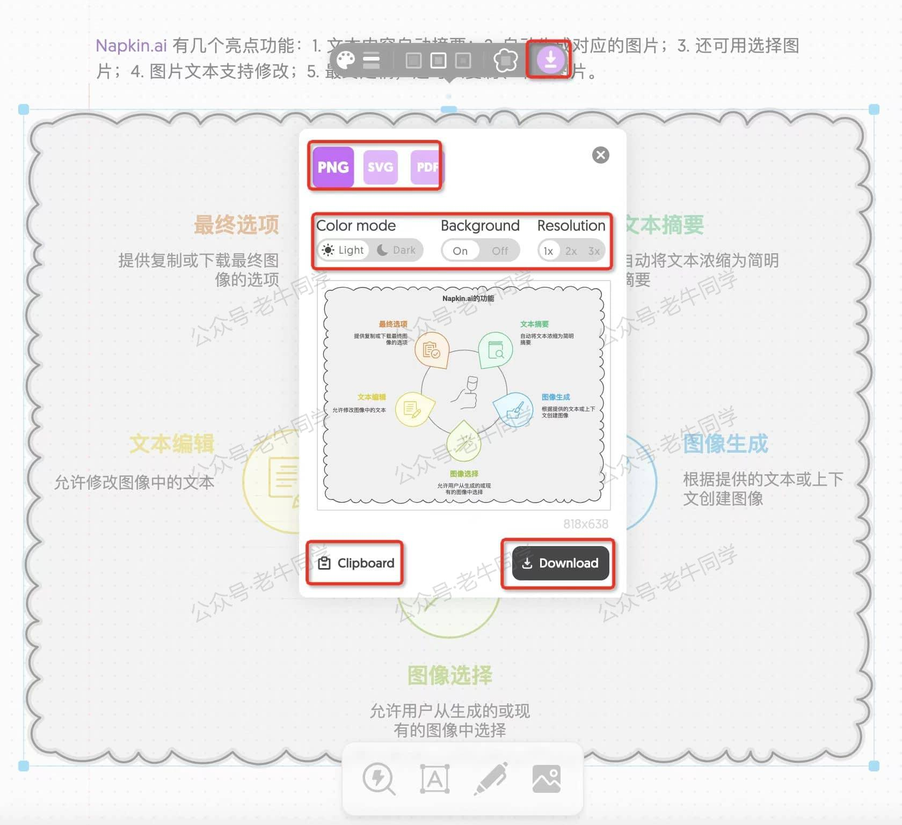
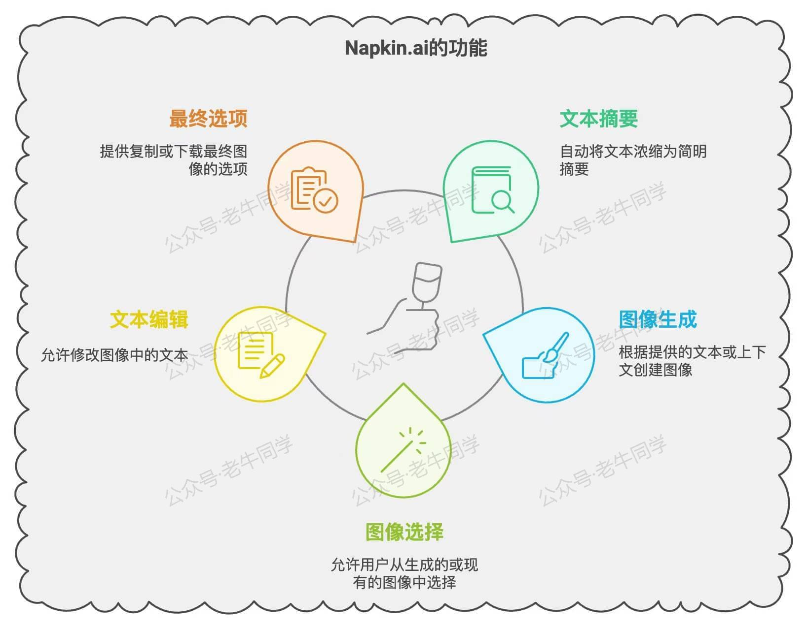
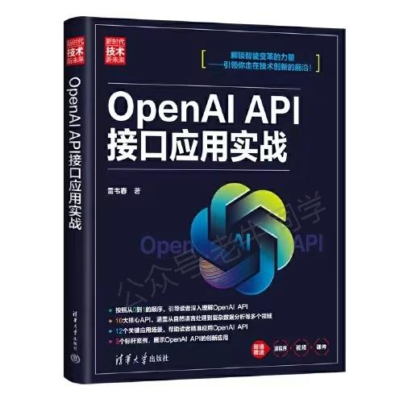

+++
slug = "2024110401"
date = "2024-11-04"
lastmod = "2024-11-04"
title = "告别 PPT 配图难题！Napkin.ai 轻松打造生动演示文档（文末免费送书）"
description = "还在为 PPT 配图发愁？Napkin.ai 来救场！它是强大的文本自动配图工具，能自动摘要文本、生成并自定义配图，下载方式多样。文中详细介绍其使用方法，包括注册、创建 Napkin、选择和设置配图等。此外，还有免费送书活动，关注、留言点赞就有机会获得《OpenAI API 接口应用实战》。快来参与……"
image = "00.jpg"
tags = [ "AI", "自动配图", "Napkin.ai" ]
categories = [ "人工智能" ]
+++

大家是不是和老牛同学一样，每到年初、年中或年终，都需要制作 PPT 或其他演示文档，用来总结过去的工作成果和规划未来的工作方向呢？

在准备这些总结和规划文档时，我们是不是经常面临着一个难题：想要粘贴大量的文字，以确保信息传达完整，但又希望能够做到图文并茂，避免页面显得过于单调乏味，从而纠结于选择什么样的配图最为合适？

在参加了多次会议和分享后，相信大家一定注意到，那些优秀的汇报和演示文档有一个共同的特点——它们总是能够巧妙地利用图表和图片来增强信息的可读性和吸引力。优秀的展示，往往离不开精心挑选的配图。

今天，老牛为大家推荐一款强大的文本自动配图工具——**Napkin.ai**。这款 AI 应用不仅能帮助我们快速找到合适的配图，还能轻松编辑和自定义配图样式，让我们的演示文档更加生动有趣。

**Napkin.ai** 的主要亮点包括：

- **文本自动摘要**：只需输入描述性文本，无需额外进行摘要处理。
- **自动生成对应配图**：根据输入的文本，Napkin.ai 提供多个风格各异的图片选项，供你选择最合适的那一张。
- **配图支持自定义**：你可以自由调整配图的样式、添加或修改图片上的文字，甚至对图片的局部细节进行编辑。
- **配图支持多种方式下载**：无论是直接复制到文档中，还是下载不同格式的图片文件，Napkin.ai 都能满足你的需求。

通过 **Napkin.ai**，你可以轻松解决配图难题，让每一次汇报和分享都更加出色！

# Napkin.ai 使用秘籍大公开

**Napkin.ai**是一款在线应用，无需下载安装，打开官网[https://www.napkin.ai](https://www.napkin.ai)就能用，是不是超方便？

### 注册和登陆：轻松开启 Napkin.ai 之旅

第一次使用的时候需要注册，只需要输入用户名、邮箱和密码就可以了，连手机号都不用哦。邮箱是用来接收注册码的，老牛同学用的是 QQ 邮箱，接收注册码毫无压力。注册和登录地址：[https://app.napkin.ai/signin](https://app.napkin.ai/signin)。

### 创建 Napkin：开启你的创意之旅

第一次注册或登陆成功之后，会有一个欢迎页面，屏幕中间有一个醒目的大按钮“**Create my first Napkin**”，点击它，我们就可以创建我们的第一个 Napkin。

### 选择配置：打造专属配图

老牛同学使用一段文本作为样例，看看如何创建一个插图：

> Napkin.ai 有几个亮点功能：1. 文本内容自动摘要；2. 自动生成对应的图片；3. 还可用选择图片；4. 图片文本支持修改；5. 最终定稿，还可以复制、下载图片。

点击文本段左边的“**闪电**”图标，Napkin 就开始为我们创建可选的配图样式。

Napkin 创建完配图之后，我们可以滑动来选择，而且还能实时预览，就像在逛一个装满精美图片的画廊。

当我们选择了满意的配图之后，可以点击“**STYLES**”进一步设置配图样式，然后点击选择最终的配图样式。

### 设置配置

选择了配图和样式之后，我们还可以进一步对配图修改和配置。当我们选中了配图之后，配图上下均会出现调整面部：

上方面板按钮分别为：轮廓颜色、风格、边框、局部选择调整和配图下载。下方面板按钮分别为：样式搜索、输入文字、画笔和上次图片。

老牛同学选择花边轮廓，效果如下：

我们确定配图之后，可以点击“**下载**”按钮使用配图了：

在下载配置页，我可以选择文件格式，包括：PNG 图片、SVG 矢量图和 PDF 文档。还可以选择白天和黑暗模式，是否需要背景和图片的尺寸。

我们还可以下载到本地或者复制到粘贴板，老牛同学选择复制，最终粘贴到出一张完整图片：

怎么样？是不是感觉操作非常简单，并且功能还特别强大呢？是不是有了这款神器，后续在做 PPT 感觉压力能变小好多呢？

# 小结：Napkin.ai——演示文档的得力助手

**Napkin.ai** 是一款强大的工具，能根据你的内容快速生成概念示意图初稿，让展示更加形象生动，同时减少时间和精力的投入。

**Napkin.ai** 提供多种图示选项，帮助你找到最佳表达方式，轻松修改和优化。你可以调整布局、添加文字、修改颜色和样式，快速制作出专业且个性化的图表。

有了 **Napkin.ai**，再也不用在 PPT 中堆砌大段文字。通过直观的图示，更有效地传达信息，让观众更容易理解和记住你的观点。赶快试试吧，让视觉化概念表达轻松愉快，充满乐趣！

**特别注意**：老牛同学在此提醒大家，需要特别注意数据安全，针对内部的私密数据，务必脱敏后再使用本工具！！！

# 最后：又来给大家免费包邮送几本新书

前面我们已经举办过 4 次免费包邮送书活动了，朋友们反馈还不错。老牛同学继续和出版社朋友合作，举办第 5 次送书福利小活动，新书是：《**OpenAI API 接口应用实战**》

本期送书小活动的规则和之前类似，总体如下：

1. 关注**老牛同学**微信公众号，因为这是老牛同学公众号关注者的小福利
2. 在本文的评论区进行**留言**，留言的**点赞**数排名**前 3 名**的朋友，**免费**且**包邮**获得 1 本书（即：默认送 3 本书）
3. 若本文的**阅读量**和**老牛同学** CSDN 同文的阅读量之和达到了**2000**（含**2000**），则留言的**点赞**数排名**前 6 名**的朋友均免费包邮送书（即：最多送 6 本书）
4. 活动时间：2024 年 11 月 4 日到 2024 年 11 月 10 号上午 12 点整（寄送新书好购物）
5. 老牛同学不参与本次活动（因为老牛同学默认就有 1 本）

为方便大家购买本书，老牛同学贴上京东商品链接：

【书籍购买链接】

---

往期推荐文章：

<small>[基于 Qwen2.5-Coder 模型和 CrewAI 多智能体框架，实现智能编程系统的实战教程](https://mp.weixin.qq.com/s/8f3xna9TRmxMDaY_cQhy8Q)</small>

<small>[vLLM CPU 和 GPU 模式署和推理 Qwen2 等大语言模型详细教程](https://mp.weixin.qq.com/s/KM-Z6FtVfaySewRTmvEc6w)</small>

<small>[基于 Qwen2/Lllama3 等大模型，部署团队私有化 RAG 知识库系统的详细教程（Docker+AnythingLLM）](https://mp.weixin.qq.com/s/PpY3k3kReKfQdeOJyrB6aw)</small>

<small>[使用 Llama3/Qwen2 等开源大模型，部署团队私有化 Code Copilot 和使用教程](https://mp.weixin.qq.com/s/vt1EXVWtwm6ltZVYtB4-Tg)</small>

<small>[基于 Qwen2 大模型微调技术详细教程（LoRA 参数高效微调和 SwanLab 可视化监控）](https://mp.weixin.qq.com/s/eq6K8_s9uX459OeUcRPEug)</small>

<small>[ChatTTS 长音频合成和本地部署 2 种方式，让你的“儿童绘本”发声的实战教程](https://mp.weixin.qq.com/s/9ldLuh3YLvx8oWvwnrSGUA)</small>

<small>[深入解析 Transformers 框架（一）：Transformers 包和对象加载](https://mp.weixin.qq.com/s/lAAIfl0YJRNrppp5-Vuusw)</small>

<small>[深入解析 Transformers 框架（二）：Qwen2.5 大模型的 AutoModel 技术细节](https://mp.weixin.qq.com/s/WIbbrkf1HjVC1CtBNcU8Ow)</small>

<small>[深入解析 Transformers 框架（三）：Qwen2.5 大模型的 AutoTokenizer 技术细节](https://mp.weixin.qq.com/s/Shg30uUFByM0tKTi0rETfg)</small>

