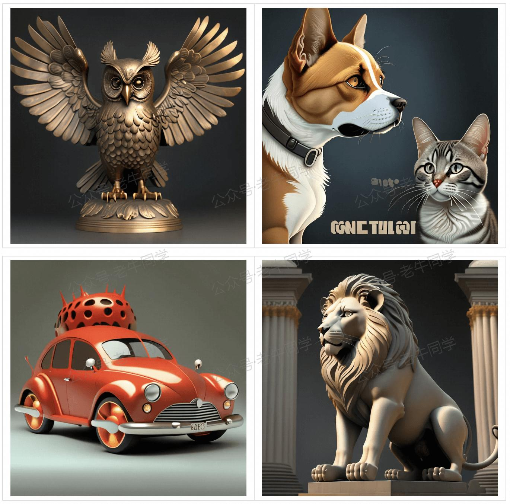
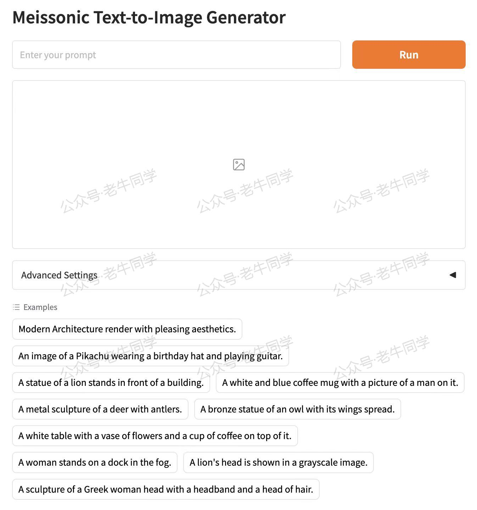
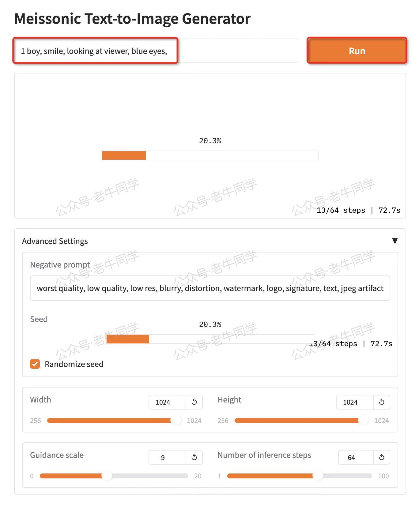
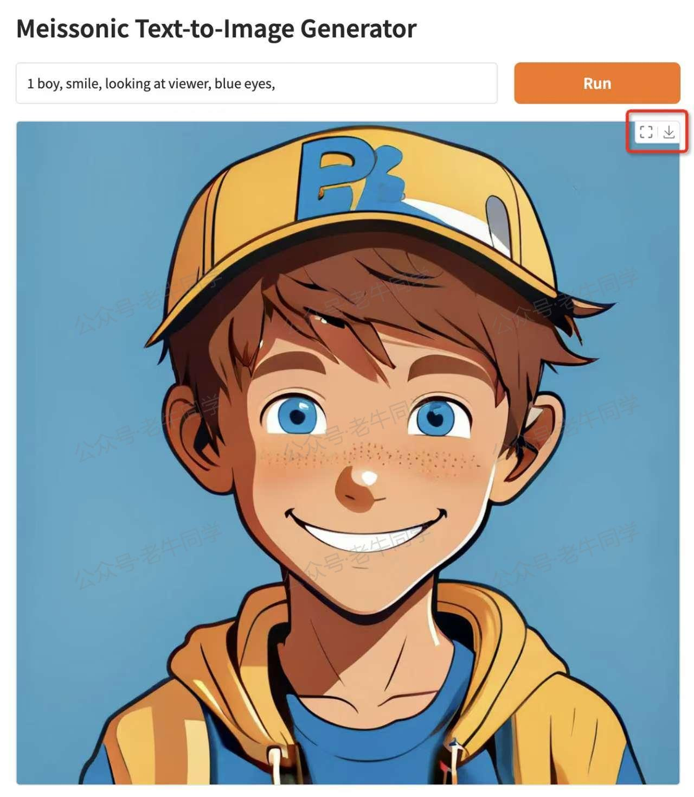
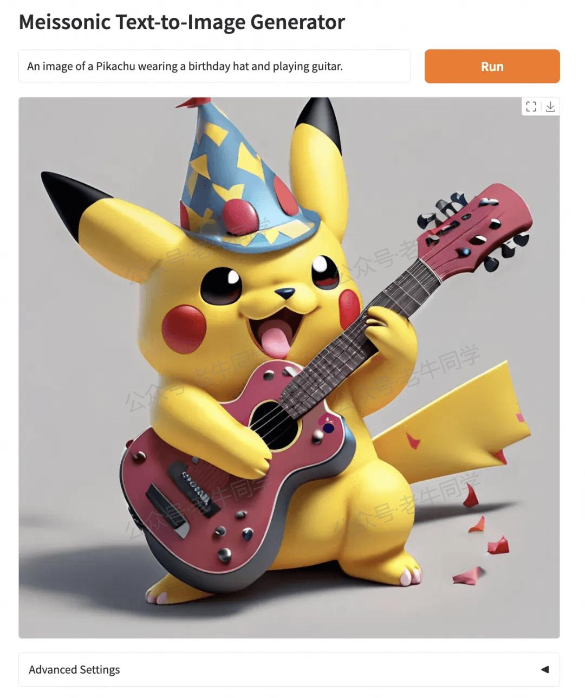
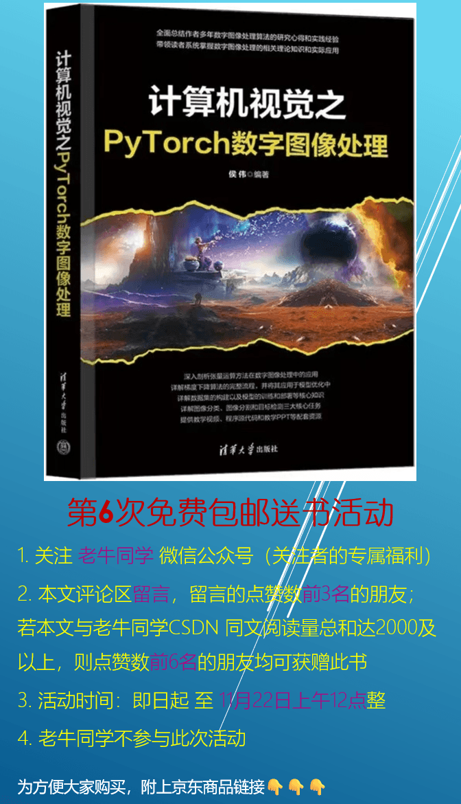

+++
slug = "2024111601"
date = "2024-11-16"
lastmod = "2024-11-16"
title = "Meissonic 文生图模型：小参数，超轻量，本地部署推理教程"
description = "阿里巴巴等联合推出的 Meissonic 文生图模型，仅 1B 参数，能在普通电脑及未来无线端运行推理。本文将详细展示其在笔记本上的本地部署教程，带你领略 Meissonic 的独特魅力与强大功能……"
image = "00.jpg"
tags = [ "AI", "Meissonic", "文生图" ]
categories = [ "人工智能" ]
+++

最近，阿里巴巴集团、Skywork AI 携手香港科技大学及其广州校区、浙江大学、加州大学伯克利分校，联合推出一款超厉害的文生图多模态模型 ——**Meissonic**！它仅有 1B 参数量，却能在普通电脑上轻松运行推理，生成高质量图像，未来甚至有望在无线端实现文本到图像的生成，简直是文生图领域的 “小钢炮”：

- **轻量高效**：仅 1B 参数量，打破大模型高参数量的常规，在资源有限的普通电脑甚至未来的无线端设备上都能运行，大大降低了对硬件的依赖，为个人创作者和小型企业提供了更经济实惠的文生图解决方案。

- **技术创新**：通过引入改进的 Transformer 架构、高级位置编码策略以及动态采样条件，对非自回归图像生成器（MIM）在文本到图像（T2I）合成任务中的性能和效率进行了大幅提升，能够更精准地理解文本语义并转化为高质量图像。

Meissonic 融合了先进技术与方法，为 MIM 技术带来了重大革新。



在大模型厂商纷纷追逐高参数量的当下，Meissonic 却独树一帜，将目标定位在小参数、可在无线端和普通电脑运行上。今天，老牛同学就带大家在笔记本电脑上本地部署 Meissonic 模型，并进行推理生成图片（本文的完整源代码地址放在评论区，同时参与本文评论赢新书《计算机视觉之 PyTorch 数字图像处理》）。

# 下载模型文件

首先，我们要把模型文件下载到本地（目录：`MeissonFlow/Meissonic`）：

```shell
cd MeissonFlow
git lfs install
git clone https://www.modelscope.cn/MeissonFlow/Meissonic.git
```

# Python 虚拟环境配置

我们使用 Miniconda 来管理 Python 虚拟环境，关于 Miniconda 的安装和使用，可以参考老牛同学之前的文章：[大模型应用研发基础环境配置（Miniconda、Python、Jupyter Lab、Ollama 等）](https://mp.weixin.qq.com/s/P_ufvz4MWVSqv_VM-rJp9w)

```shell
# Python虚拟环境名：Meissonic，Python版本号：3.10
conda create -n Meissonic python=3.10 -y

# 激活虚拟环境
conda activate Meissonic
```

# 安装 Python 依赖包

完整的 Python 依赖包列表如下，为了方便安装，我们可以存储为`requirements.txt`文件，然后执行命令批量进行安装：`pip install -r requirements.txt`

```plaintext
--extra-index-url https://download.pytorch.org/whl/cu124
accelerate
pytorch-lightning
torch
torchvision
tqdm
transformers
numpy
gradio
git+https://github.com/huggingface/diffusers.git
```

# Meissonic 模型生成图片

基础环境准备就绪，马上开启图片生成之旅！以下是老牛同学根据笔记本电脑修改后的 WebUI 界面代码（`app.py`）：

```python
# app.py
import os
import sys

sys.path.append("./")

import torch
from src.transformer import Transformer2DModel
from src.pipeline import Pipeline
from src.scheduler import Scheduler
from transformers import (
    CLIPTextModelWithProjection,
    CLIPTokenizer,
)
from diffusers import VQModel
import gradio as gr

# 运行环境
device = 'cuda' if torch.cuda.is_available() else 'cpu'

# 模型文件目录
model_path = os.path.join(os.path.expanduser('~'), 'ModelSpace', 'MeissonFlow', 'Meissonic')

# 模型初始化
model = Transformer2DModel.from_pretrained(model_path, local_files_only=True, subfolder="transformer")
vq_model = VQModel.from_pretrained(model_path, local_files_only=True, subfolder="vqvae")
text_encoder = CLIPTextModelWithProjection.from_pretrained(model_path, local_files_only=True, subfolder="text_encoder")
tokenizer = CLIPTokenizer.from_pretrained(model_path, local_files_only=True, subfolder="tokenizer")
scheduler = Scheduler.from_pretrained(model_path, local_files_only=True, subfolder="scheduler")

pipe = Pipeline(vq_model, tokenizer=tokenizer, text_encoder=text_encoder, transformer=model, scheduler=scheduler)
pipe.to(device)

MAX_SEED = 2 ** 32 - 1
MAX_IMAGE_SIZE = 1024


def generate_image(prompt, negative_prompt, seed, randomize_seed, width, height, guidance_scale, num_inference_steps,
                   progress=gr.Progress(track_tqdm=True)):
    if randomize_seed or seed == 0:
        seed = torch.randint(0, MAX_SEED, (1,)).item()
    torch.manual_seed(seed)

    image = pipe(
        prompt=prompt,
        negative_prompt=negative_prompt,
        height=height,
        width=width,
        guidance_scale=guidance_scale,
        num_inference_steps=num_inference_steps
    ).images[0]

    return image, seed


# Default negative prompt
default_negative_prompt = "worst quality, low quality, low res, blurry, distortion, watermark, logo, signature, text, jpeg artifacts, signature, sketch, duplicate, ugly, identifying mark"
css = """
#col-container {
    margin: 0 auto;
    max-width: 640px;
}
"""

examples = [
    "Modern Architecture render with pleasing aesthetics.",
    "An image of a Pikachu wearing a birthday hat and playing guitar.",
    "A statue of a lion stands in front of a building.",
    "A white and blue coffee mug with a picture of a man on it.",
    "A metal sculpture of a deer with antlers.",
    "A bronze statue of an owl with its wings spread.",
    "A white table with a vase of flowers and a cup of coffee on top of it.",
    "A woman stands on a dock in the fog.",
    "A lion's head is shown in a grayscale image.",
    "A sculpture of a Greek woman head with a headband and a head of hair."
]

with gr.Blocks(css=css) as demo:
    with gr.Column(elem_id="col-container"):
        gr.Markdown("# Meissonic Text-to-Image Generator")
        with gr.Row():
            prompt = gr.Text(
                label="Prompt",
                show_label=False,
                max_lines=1,
                placeholder="Enter your prompt",
                container=False,
            )
            run_button = gr.Button("Run", scale=0, variant="primary")
        result = gr.Image(label="Result", show_label=False)
        with gr.Accordion("Advanced Settings", open=False):
            negative_prompt = gr.Text(
                label="Negative prompt",
                max_lines=1,
                placeholder="Enter a negative prompt",
                value=default_negative_prompt,
            )
            seed = gr.Slider(
                label="Seed",
                minimum=0,
                maximum=MAX_SEED,
                step=1,
                value=0,
            )
            randomize_seed = gr.Checkbox(label="Randomize seed", value=True)
            with gr.Row():
                width = gr.Slider(
                    label="Width",
                    minimum=256,
                    maximum=MAX_IMAGE_SIZE,
                    step=32,
                    value=1024,
                )
                height = gr.Slider(
                    label="Height",
                    minimum=256,
                    maximum=MAX_IMAGE_SIZE,
                    step=32,
                    value=1024,
                )
            with gr.Row():
                guidance_scale = gr.Slider(
                    label="Guidance scale",
                    minimum=0.0,
                    maximum=20.0,
                    step=0.1,
                    value=9.0,
                )
                num_inference_steps = gr.Slider(
                    label="Number of inference steps",
                    minimum=1,
                    maximum=100,
                    step=1,
                    value=64,
                )
        gr.Examples(examples=examples, inputs=[prompt])
    gr.on(
        triggers=[run_button.click, prompt.submit],
        fn=generate_image,
        inputs=[
            prompt,
            negative_prompt,
            seed,
            randomize_seed,
            width,
            height,
            guidance_scale,
            num_inference_steps,
        ],
        outputs=[result, seed],
    )

# 启动WebUI界面
demo.launch()
```

接着，我们启动 WebUI 界面：`python app.py`

```shell
(Meissonic) $ python app.py
* Running on local URL:  http://127.0.0.1:7860

To create a public link, set `share=True` in `launch()`.
```

启动成功后，打开浏览器：[http://127.0.0.1:7860](http://127.0.0.1:7860)



WebUI 页面主要分为 4 部分：Prompt 提示词输入框、图片展示部分、参数设置和样例 Prompt 提示词。

我们先输入一个简单的提示词：`1 boy, smile, looking at viewer, blue eyes,`（一个男孩、微笑、看着镜头、蓝色眼睛）

点击大大的橙色的“**Run**”按钮，就开始图片生成：



老牛同学的电脑配置一般，经过大概 5 分钟左右，图片生成好了：



整体来看，图片效果还不错，Prompt 提示中的男孩、微笑、蓝眼睛、正脸等都表现得比较细致，不过鼻子、牙齿、衣服等部分就稍显逊色了。但在笔记本电脑资源有限的情况下能有这样的成果，老牛同学感觉已经很不错！

再看看这张比卡丘戴着生日帽弹吉他的图片，图片效果就感觉细致多了：



从上面的例子可以看出，对于 Prompt 提示词中明确的内容，Meissonic 表现相当出色。所以在实际应用时，提示词越具体，可能就越能得到我们想要的结果！欢迎大家尝试体验！



---

往期推荐文章：

<small>[基于 Qwen2.5-Coder 模型和 CrewAI 多智能体框架，实现智能编程系统的实战教程](https://mp.weixin.qq.com/s/8f3xna9TRmxMDaY_cQhy8Q)</small>

<small>[vLLM CPU 和 GPU 模式署和推理 Qwen2 等大语言模型详细教程](https://mp.weixin.qq.com/s/KM-Z6FtVfaySewRTmvEc6w)</small>

<small>[基于 Qwen2/Lllama3 等大模型，部署团队私有化 RAG 知识库系统的详细教程（Docker+AnythingLLM）](https://mp.weixin.qq.com/s/PpY3k3kReKfQdeOJyrB6aw)</small>

<small>[使用 Llama3/Qwen2 等开源大模型，部署团队私有化 Code Copilot 和使用教程](https://mp.weixin.qq.com/s/vt1EXVWtwm6ltZVYtB4-Tg)</small>

<small>[基于 Qwen2 大模型微调技术详细教程（LoRA 参数高效微调和 SwanLab 可视化监控）](https://mp.weixin.qq.com/s/eq6K8_s9uX459OeUcRPEug)</small>

<small>[ChatTTS 长音频合成和本地部署 2 种方式，让你的“儿童绘本”发声的实战教程](https://mp.weixin.qq.com/s/9ldLuh3YLvx8oWvwnrSGUA)</small>

<small>[深入解析 Transformers 框架（一）：包和对象加载中的设计巧思与实用技巧](https://mp.weixin.qq.com/s/lAAIfl0YJRNrppp5-Vuusw)</small>

<small>[深入解析 Transformers 框架（二）：AutoModel 初始化及 Qwen2.5 模型加载全流程](https://mp.weixin.qq.com/s/WIbbrkf1HjVC1CtBNcU8Ow)</small>

<small>[深入解析 Transformers 框架（三）：Qwen2.5 大模型的 AutoTokenizer 技术细节](https://mp.weixin.qq.com/s/Shg30uUFByM0tKTi0rETfg)</small>

<small>[深入解析 Transformers 框架（四）：Qwen2.5/GPT 分词流程与 BPE 分词算法技术细节详解](https://mp.weixin.qq.com/s/GnoHXsIYKYFU1Xo4u5sE1w)</small>


