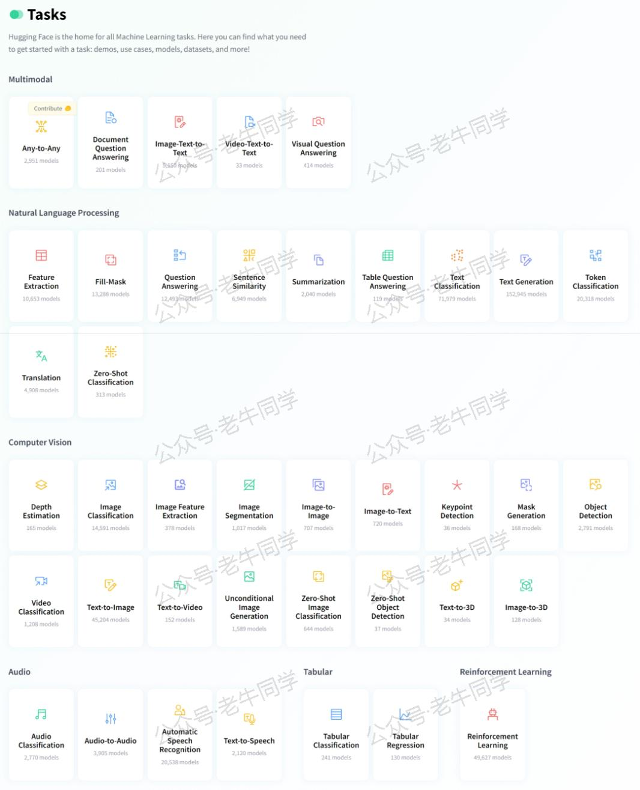
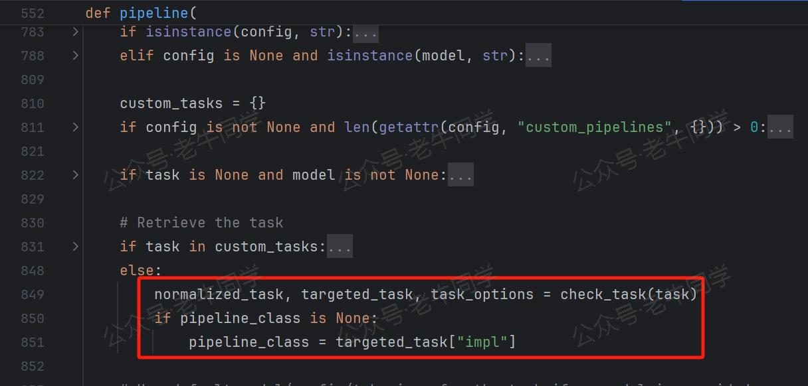
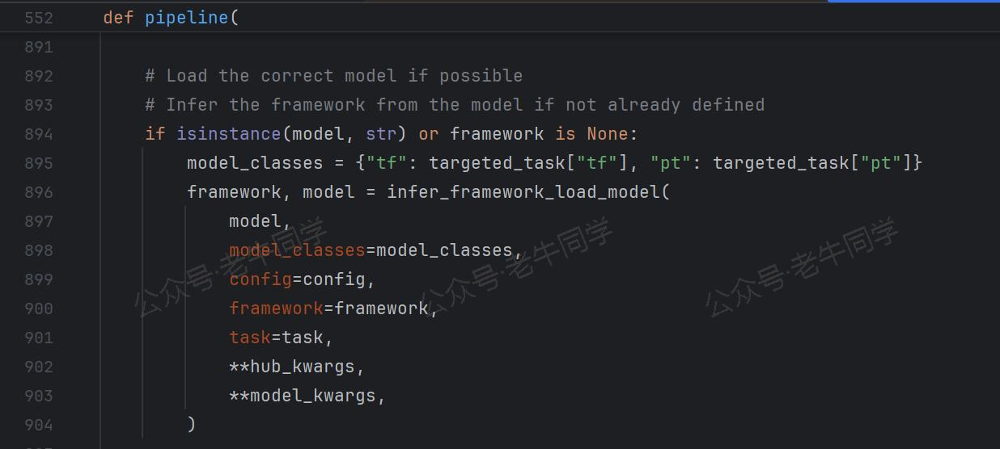
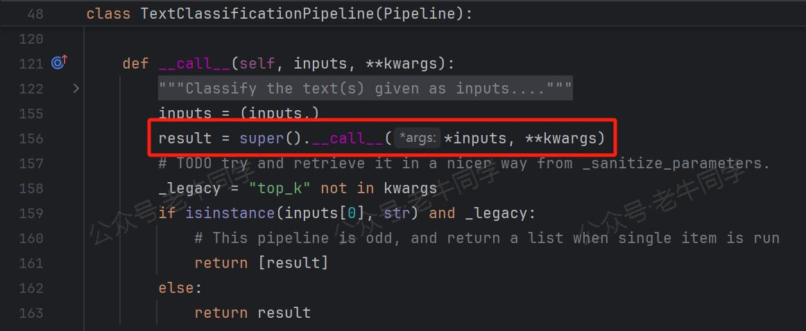
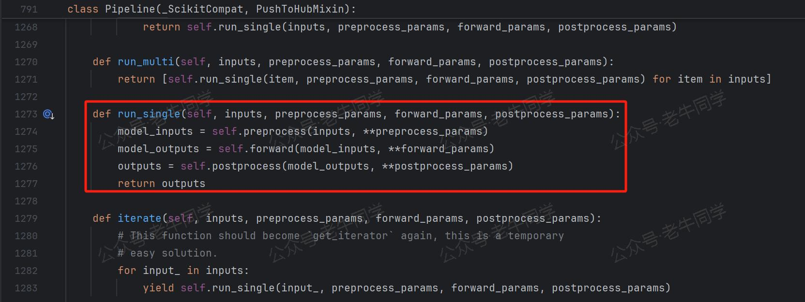

+++
slug = "2024111901"
date = "2024-11-19"
lastmod = "2024-11-19"
title = "Transformers框架任务概览：从零开始掌握Pipeline（管道）与Task（任务）"
description = "Transformers框架支持多种NLP任务，如何高效使用Pipeline？本文从零开始，逐步介绍Transformers框架中的Pipeline和任务配置。通过实际案例和源代码分析，帮助你快速掌握Transformers框架的核心功能……"
image = "00.jpg"
tags = [ "AI", "transformers", "Pipeline", "Task" ]
categories = [ "人工智能" ]
+++

在前面的四篇 Transformers 框架文章中，老牛同学基于 Qwen2.5 大模型，通过走读源代码，对 Transformers 框架进行了初步分析，主要涵盖了以下几个方面：

- **Transformers 模块的懒加载设计**
- **AutoConfig、AutoModel 和 AutoTokenizer 这三个基础组件**
- **BPE 分词算法**

这些基础组件是预训练大模型推理的基石。在此基础上，Transformers 框架提供了更高层次的组件——**Pipeline**（管道），它封装了模型加载、数据预处理、模型推理和结果后处理的完整流程。通过 Pipeline，用户可以极简地使用预训练模型来处理具体的自然语言处理（NLP）任务，而无需深入了解模型的内部细节。

在 Hugging Face 官网上，这些任务被归为六大类：多模态（Multimodal）、自然语言处理（Natural Language Processing，NLP）、计算机视觉（Computer Vision）、音频（Audio）、表格（Tabular）和强化学习（Reinforcement Learning）。



本文我们将初步了解一下 Pipeline 和 Task 的配置和技术，老牛同计划在后续文章进行详细分析介绍。

# 1. Task 配置源代码

我们打开 Transformers 包的源代码，就可以看到当前支持的 Task 列表和配置（模块：`./pipelines/__init__.py`，常量：`SUPPORTED_TASKS`字典）：

```python
# Transformers框架支持的Task列表和配置
SUPPORTED_TASKS = {
    "audio-classification": {
        "impl": AudioClassificationPipeline,
        "tf": (),
        "pt": (AutoModelForAudioClassification,) if is_torch_available() else (),
        "default": {"model": {"pt": ("superb/wav2vec2-base-superb-ks", "372e048")}},
        "type": "audio",
    },
    "automatic-speech-recognition": {
        "impl": AutomaticSpeechRecognitionPipeline,
        "tf": (),
        "pt": (AutoModelForCTC, AutoModelForSpeechSeq2Seq) if is_torch_available() else (),
        "default": {"model": {"pt": ("facebook/wav2vec2-base-960h", "22aad52")}},
        "type": "multimodal",
    },
    "text-to-audio": {
        "impl": TextToAudioPipeline,
        "tf": (),
        "pt": (AutoModelForTextToWaveform, AutoModelForTextToSpectrogram) if is_torch_available() else (),
        "default": {"model": {"pt": ("suno/bark-small", "1dbd7a1")}},
        "type": "text",
    },
    "text-classification": {
        "impl": TextClassificationPipeline,
        "tf": (TFAutoModelForSequenceClassification,) if is_tf_available() else (),
        "pt": (AutoModelForSequenceClassification,) if is_torch_available() else (),
        "default": {
            "model": {
                "pt": ("distilbert/distilbert-base-uncased-finetuned-sst-2-english", "714eb0f"),
                "tf": ("distilbert/distilbert-base-uncased-finetuned-sst-2-english", "714eb0f"),
            },
        },
        "type": "text",
    },

    # 其他任务省略
}
```

`SUPPORTED_TASKS`字典配置了 Transformers 框架支持的所有任务和 Pipeline 实现，每个字典的元素配置内容如下：

- **字典键**：代表任务名，应用时代表这个任务。
- **type**：代表任务分类，如`audio`表示这是一个处理音频数据的任务。
- **impl**：代表Pipeline实现类，它封装了任务的所有逻辑，包括数据预处理、模型推理和结果后处理。
- **tf**或**pt**：代表支持该任务的 TensorFlow 模型类或 PyTorch 模型类。
- **default**：代表任务的默认配置，包括默认使用的模型及其版本。

# 2. Pipeline 和 Task 使用示例

下面，我们通过一个常见的情感分类任务来演示如何使用 Pipeline 进行任务处理：

```python
import os
from transformers import pipeline, AutoTokenizer, AutoModelForSequenceClassification

# 本地模型文件目录
model_dir = os.path.join('D:', os.path.sep, 'ModelSpace', 'Qwen2.5', 'Qwen2.5-1.5B-Instruct')

# 加载分词器
tokenizer = AutoTokenizer.from_pretrained(
    model_dir,
    local_files_only=True,
)

# 加载本地模型
model = AutoModelForSequenceClassification.from_pretrained(
    model_dir,
    torch_dtype="auto",
    device_map="auto",
    local_files_only=True,
)

# 创建一个情感分析Pipeline
nlp = pipeline("text-classification", tokenizer=tokenizer, model=model)

# 对一段文本进行情感分析
result = nlp("我觉得使用Transformers库Pipeline处理NLP任务非常方便！")

# 输出：[{'label': 'LABEL_0', 'score': 0.9700134992599487}]
print(result)
```

上面的代码展示了使用 Pipeline 处理任务的标准框架：

- **tokenizer**：分词器，我们在前面的文章中详细介绍了其技术细节和 BPE 算法逻辑，这里不再赘述。
- **model**：与前面介绍的 AutoModel 使用方式完全一致，`AutoModelForSequenceClassification`是 Task 配置中 PyTorch 模型类。`AutoModelForSequenceClassification.from_pretrained()`的逻辑与我们前面介绍的 AutoModel 基本一致。对于 Qwen2 大模型，它最终返回`Qwen2ForSequenceClassification`实例（具体实现老牛同学将在接下来的系列文章中进行详细分析）。
- **nlp**：Pipeline 的实例化，可以指定任务名处理单个任务，也可以指定任务列表处理多个任务。
- **result**：任务结果，返回`label`标签和`score`置信度分数。

# 3. Pipeline 技术细节

接下来，我们通过阅读源代码，分析 Pipeline 执行的技术细节。

**第 1 行代码**：`nlp = pipeline("text-classification", tokenizer=tokenizer, model=model)` Pipeline 初始化时，根据任务名`text-classification`映射到任务配置信息，然后根据配置中的`impl`字段获取到 Pipeline 的实现类（如`TextClassificationPipeline`类）。



Pipeline 初始化完成后，加载对应的模型（如`AutoModelForSequenceClassification`，如果是 TensorFlow 模型则是`TFAutoModelForSequenceClassification`）。



最终，Pipeline 实例化：`pipeline_class(model=model, framework=framework, task=task, **kwargs)`

**第 2 行代码**：`result = nlp("我觉得使用Transformers库Pipeline处理NLP任务非常方便！")` 开始执行 Pipeline 任务。



Task 执行过程由三个模板方法完成：`preprocess()`前置处理、`forward()`执行和`postprocess()`后置处理。



从上面的 Pipeline 执行流程可以看出，与 AutoModel 非常相似：模型初始化、分词、模型推理、收集结果。

# 4. Transformers 任务列表

`SUPPORTED_TASKS`常量字典内容丰富，我们通过一段代码来统计任务列表：

```python
from transformers.pipelines import SUPPORTED_TASKS

# 收集分类
task_types = ['text', 'image', 'audio', 'video', 'multimodal']

# 打印表格
order = 0
print('| #   | 分类 | Task名 | Pipeline实现 |')
print('|:---:|:----:|:------|:------------|')
for task_type in task_types:
    for key, task in SUPPORTED_TASKS.items():
        if task['type'] == task_type:
            order += 1
            print(f'| {"{:02d}".format(order)} | {task["type"]} | {key} | {task["impl"].__name__} |')
```

|  #  |    分类    | Task 名                        | Pipeline 实现                       |
| :-: | :--------: | :----------------------------- | :---------------------------------- |
| 01  |    text    | text-to-audio                  | TextToAudioPipeline                 |
| 02  |    text    | text-classification            | TextClassificationPipeline          |
| 03  |    text    | token-classification           | TokenClassificationPipeline         |
| 04  |    text    | question-answering             | QuestionAnsweringPipeline           |
| 05  |    text    | table-question-answering       | TableQuestionAnsweringPipeline      |
| 06  |    text    | fill-mask                      | FillMaskPipeline                    |
| 07  |    text    | summarization                  | SummarizationPipeline               |
| 08  |    text    | translation                    | TranslationPipeline                 |
| 09  |    text    | text2text-generation           | Text2TextGenerationPipeline         |
| 10  |    text    | text-generation                | TextGenerationPipeline              |
| 11  |    text    | zero-shot-classification       | ZeroShotClassificationPipeline      |
| 12  |   image    | image-classification           | ImageClassificationPipeline         |
| 13  |   image    | image-feature-extraction       | ImageFeatureExtractionPipeline      |
| 14  |   image    | depth-estimation               | DepthEstimationPipeline             |
| 15  |   image    | image-to-image                 | ImageToImagePipeline                |
| 16  |   audio    | audio-classification           | AudioClassificationPipeline         |
| 17  |   video    | video-classification           | VideoClassificationPipeline         |
| 18  | multimodal | automatic-speech-recognition   | AutomaticSpeechRecognitionPipeline  |
| 19  | multimodal | feature-extraction             | FeatureExtractionPipeline           |
| 20  | multimodal | visual-question-answering      | VisualQuestionAnsweringPipeline     |
| 21  | multimodal | document-question-answering    | DocumentQuestionAnsweringPipeline   |
| 22  | multimodal | zero-shot-image-classification | ZeroShotImageClassificationPipeline |
| 23  | multimodal | zero-shot-audio-classification | ZeroShotAudioClassificationPipeline |
| 24  | multimodal | image-segmentation             | ImageSegmentationPipeline           |
| 25  | multimodal | image-to-text                  | ImageToTextPipeline                 |
| 26  | multimodal | object-detection               | ObjectDetectionPipeline             |
| 27  | multimodal | zero-shot-object-detection     | ZeroShotObjectDetectionPipeline     |
| 28  | multimodal | mask-generation                | MaskGenerationPipeline              |

在接下来的 Pipeline 系列文章中，老牛同学将针对以上任务（共 **28** 个任务），分别进行详细介绍。敬请期待！如果你有任何问题或建议，欢迎留言交流！

---

往期推荐文章：

<small>[深入解析 Transformers 框架（一）：包和对象加载中的设计巧思与实用技巧](https://mp.weixin.qq.com/s/lAAIfl0YJRNrppp5-Vuusw)</small>

<small>[深入解析 Transformers 框架（二）：AutoModel 初始化及 Qwen2.5 模型加载全流程](https://mp.weixin.qq.com/s/WIbbrkf1HjVC1CtBNcU8Ow)</small>

<small>[深入解析 Transformers 框架（三）：Qwen2.5 大模型的 AutoTokenizer 技术细节](https://mp.weixin.qq.com/s/Shg30uUFByM0tKTi0rETfg)</small>

<small>[深入解析 Transformers 框架（四）：Qwen2.5/GPT 分词流程与 BPE 分词算法技术细节详解](https://mp.weixin.qq.com/s/GnoHXsIYKYFU1Xo4u5sE1w)</small>

<small>[基于 Qwen2.5-Coder 模型和 CrewAI 多智能体框架，实现智能编程系统的实战教程](https://mp.weixin.qq.com/s/8f3xna9TRmxMDaY_cQhy8Q)</small>

<small>[vLLM CPU 和 GPU 模式署和推理 Qwen2 等大语言模型详细教程](https://mp.weixin.qq.com/s/KM-Z6FtVfaySewRTmvEc6w)</small>

<small>[基于 Qwen2/Lllama3 等大模型，部署团队私有化 RAG 知识库系统的详细教程（Docker+AnythingLLM）](https://mp.weixin.qq.com/s/PpY3k3kReKfQdeOJyrB6aw)</small>

<small>[使用 Llama3/Qwen2 等开源大模型，部署团队私有化 Code Copilot 和使用教程](https://mp.weixin.qq.com/s/vt1EXVWtwm6ltZVYtB4-Tg)</small>

<small>[基于 Qwen2 大模型微调技术详细教程（LoRA 参数高效微调和 SwanLab 可视化监控）](https://mp.weixin.qq.com/s/eq6K8_s9uX459OeUcRPEug)</small>

<small>[ChatTTS 长音频合成和本地部署 2 种方式，让你的“儿童绘本”发声的实战教程](https://mp.weixin.qq.com/s/9ldLuh3YLvx8oWvwnrSGUA)</small>


