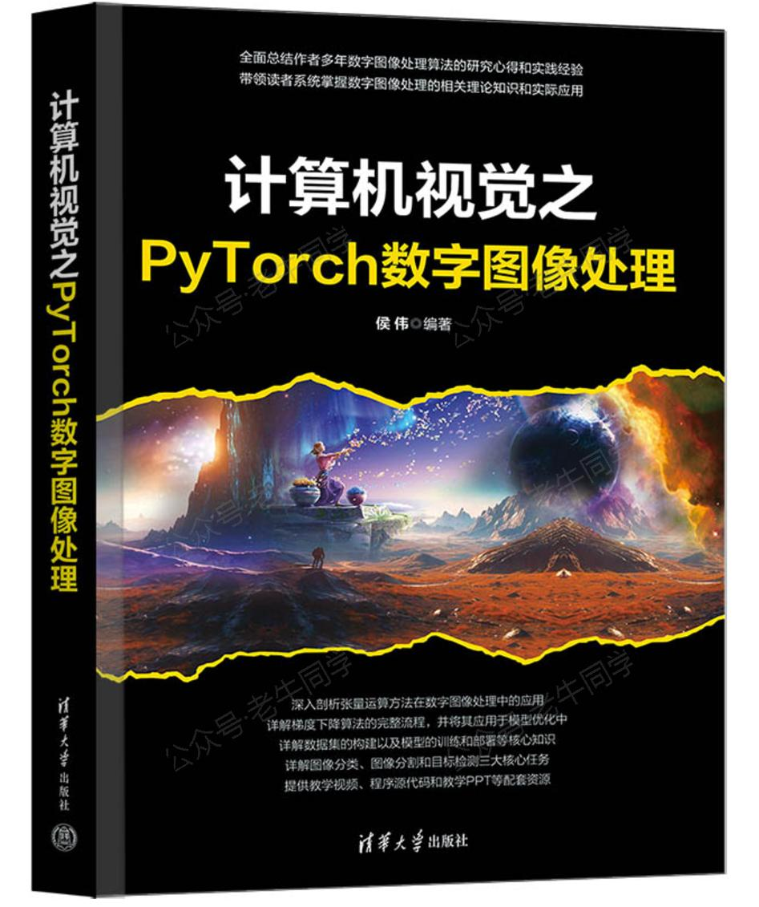
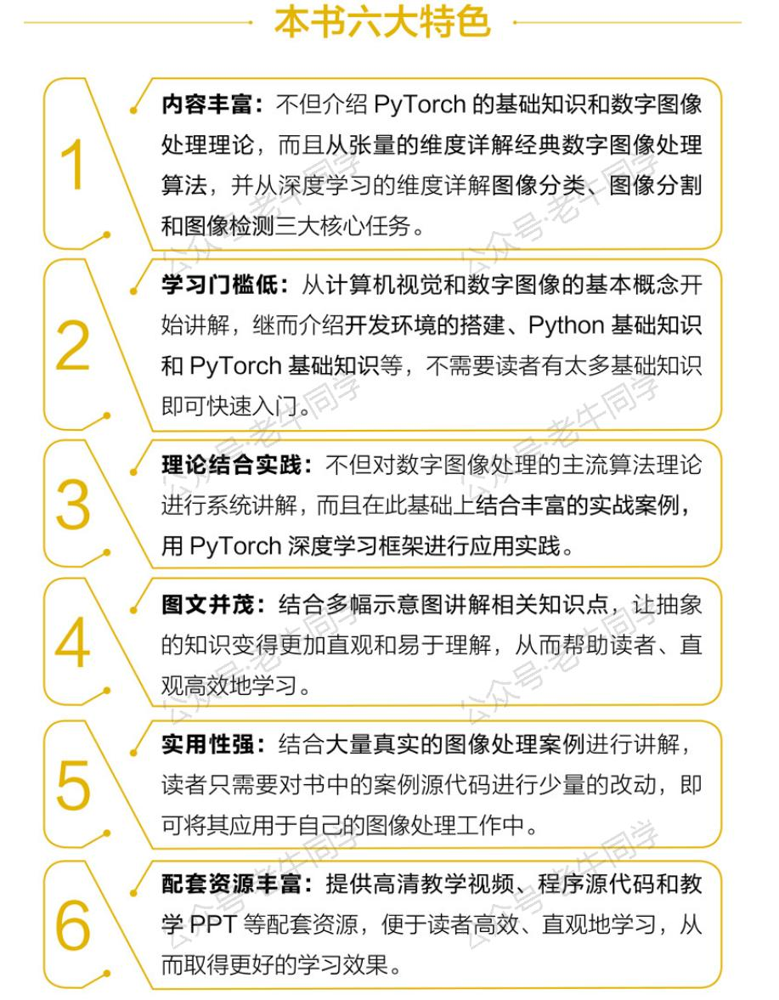

+++
slug = "2024120101"
date = "2024-12-01"
lastmod = "2024-12-01"
title = "Transformers 框架 Pipeline 任务详解：文本转音频（text-to-audio 或 text-to-speech）"
description = "本文详细介绍了Transformers框架中的text-to-audio任务，展示了如何使用Bark和ChatTTS模型将文本转化为自然流畅的语音。通过实际案例，探讨了该技术在有声读物、在线教育、虚拟助手等领域的应用，帮助开发者提升产品的用户体验，创造更多可能性……"
image = "00.jpg"
tags = [ "AI", "transformers", "Pipeline", "文本转音频" ]
categories = [ "人工智能" ]
+++

在上一篇文章（[Transformers 框架任务概览：从零开始掌握 Pipeline（管道）与 Task（任务）](https://mp.weixin.qq.com/s/FR4384AZV2FE2xtweSh9bA)），我们深入探讨了 Transformers 框架中的 Pipeline 和 Task 分类、配置及执行流程。今天，我们将聚焦于五大任务之一的`text-to-audio`或`text-to-speech`（TTS），探索如何利用 Transformers 将文本转换为自然流畅的语音。

# 1. 应用场景

文本转音频技术通过深度学习模型从海量语音数据中学习发音规律，能够生成逼真的声音。根据 Hugging Face 官网的数据，当前已有超过**2,148**个文本转音频模型供选择：


这项技术广泛应用于多个领域，以下是一些具有代表性的应用场景：

- **有声读物与电子书**：将电子书或文章的内容转化为音频格式，使用户能够在通勤、运动或其他无法专注阅读的时间段聆听，提供了一种更加便捷和灵活的知识获取方式。

- **在线教育与学习平台**：自动为课程内容生成配套的音频讲解，帮助学生练习外语发音，增强了学习的互动性和趣味性，丰富了教育资源的形式。

- **虚拟助手与智能家居**：智能音箱、智能手机和其他物联网设备可以使用文本转音频技术响应用户的命令或查询，提供天气预报、新闻更新等信息，提升了设备的易用性和用户体验。

- **客服系统与自动化服务**：企业可以集成文本转音频技术来自动生成语音应答，用于客户服务热线、电话会议记录转写以及自动化的消息通知，降低了人力成本并提高了服务效率。

- **广播与媒体制作**：广播电台、电视节目和网络视频可以快速生成旁白、广告词等需要语音播报的内容，加速了内容生产流程，减少了对专业配音演员的依赖，并可根据目标受众的特点定制不同的声音风格。

# 2. 任务配置

在 Transformers 框架中，`text-to-audio`（T2A）和`text-to-speech`（TTS）是同一任务的不同称呼。尽管两者在 Pipeline 配置中有别名关系，但在实际使用时没有区别，框架最终统一使用`text-to-audio`作为任务名称。

```python
TASK_ALIASES = {
    # 其他省略......

    "text-to-speech": "text-to-audio",
}

SUPPORTED_TASKS = {
    # 其他省略......

    "text-to-audio": {
        "impl": TextToAudioPipeline,
        "tf": (),
        "pt": (AutoModelForTextToWaveform, AutoModelForTextToSpectrogram) if is_torch_available() else (),
        "default": {"model": {"pt": ("suno/bark-small", "1dbd7a1")}},
        "type": "text",
    },

    # 其他省略......
}
```

# 3. 文本转音频实战

## 3.1 ChatTTS 模型

之前的文章中，我们介绍了如何使用**ChatTTS**将儿童绘本内容合成音频。**ChatTTS**支持中英文、停顿、笑声等多种元素的合并，生成的声音非常流畅。对于更详细的步骤，请参考老牛同学的教程：[ChatTTS 长音频合成和本地部署 2 种方式，让你的“儿童绘本”发声的实战教程](https://mp.weixin.qq.com/s/9ldLuh3YLvx8oWvwnrSGUA)。

【此处为音频文件】

需要注意的是，**ChatTTS**目前尚不支持 Transformers 框架的 Pipeline 任务，因此需要按照老牛同学提供的指南进行下载、配置和部署推理模型。

## 3.2 Bark 模型

Transformers 框架默认使用的是由 Suno AI 研发的**suno/bark-small**模型，该模型以其高质量、自然流畅且富有表现力的语音生成能力而闻名。除了英语外，它还支持包括简体中文、法语、德语、西班牙语在内的 13 种语言。

接下来，我们将介绍两种使用 Bark 模型的方法。

### 方法一：自动下载模型

首先，确保安装必要的依赖包：

```shell
pip install --upgrade transformers scipy
```

然后，我们可以直接从 Hugging Face 下载模型。如果您的网络环境允许，可以直接下载；否则，可以通过设置镜像来加速下载过程：

```python
import os
from transformers import pipeline
import scipy

# 设置代理和本地缓存目录
os.environ["HF_ENDPOINT"] = "https://hf-mirror.com"
cache_dir = os.path.join('D:', os.path.sep, 'ModelSpace', 'Cache')
os.environ['HF_HOME'] = cache_dir

# 创建Pipeline任务
nlp = pipeline("text-to-audio", model="suno/bark-small")

# 执行文本转音频任务
speech = nlp("Hello, my name is Suno. And, uh — and I like pizza. [laughs] But I also have other interests such as playing tic tac toe.", forward_params={"do_sample": True})

# 存储音频文件
scipy.io.wavfile.write("./output/01.bark.wav", rate=speech["sampling_rate"], data=speech["audio"].ravel())
```

运行上述代码后，您将在`output`目录下找到生成的音频文件：**01.bark.wav**。

【此处为音频文件】

### 方法二：自主下载模型

如果您希望通过本地模型文件进行推理，可以按照以下步骤操作：

```python
from transformers import AutoTokenizer, AutoModel, pipeline
import os

# 本地模型文件目录
model_dir = os.path.join('D:', os.path.sep, 'ModelSpace', 'Bark-small')

# 加载分词器和模型
tokenizer = AutoTokenizer.from_pretrained(model_dir, local_files_only=True)
model = AutoModel.from_pretrained(model_dir, torch_dtype="auto", device_map="auto", local_files_only=True)

# 创建Pipeline任务
nlp = pipeline("text-to-audio", tokenizer=tokenizer, model=model)
```

这样，您可以基于本地存储的模型文件进行推理，避免了网络下载的限制。

# 总结

本文详细介绍了 Transformers 框架中`text-to-audio`任务的应用场景、配置方法以及实战案例。无论是使用默认的**suno/bark-small**模型还是其他模型，Pipeline 都提供了简单而强大的接口来实现文本到音频的转换。未来，老牛同学将继续推出更多关于 Transformers 框架 Pipeline 任务的文章，敬请期待！

**好书推荐**

最后，老牛同学向大家推荐一本非常适合大模型学习者的基础书籍。这本书不仅内容详实，而且易于理解，是构建扎实理论基础的好帮手。虽然本次不再举办免费送书活动，但强烈建议有兴趣的朋友阅读：




---

Pipeline任务：

<small>[Transformers 框架任务概览：从零开始掌握 Pipeline（管道）与 Task（任务）](https://mp.weixin.qq.com/s/FR4384AZV2FE2xtweSh9bA)</small>

往期推荐文章：

<small>[深入解析 Transformers 框架（一）：包和对象加载中的设计巧思与实用技巧](https://mp.weixin.qq.com/s/lAAIfl0YJRNrppp5-Vuusw)</small>

<small>[深入解析 Transformers 框架（二）：AutoModel 初始化及 Qwen2.5 模型加载全流程](https://mp.weixin.qq.com/s/WIbbrkf1HjVC1CtBNcU8Ow)</small>

<small>[深入解析 Transformers 框架（三）：Qwen2.5 大模型的 AutoTokenizer 技术细节](https://mp.weixin.qq.com/s/Shg30uUFByM0tKTi0rETfg)</small>

<small>[深入解析 Transformers 框架（四）：Qwen2.5/GPT 分词流程与 BPE 分词算法技术细节详解](https://mp.weixin.qq.com/s/GnoHXsIYKYFU1Xo4u5sE1w)</small>

<small>[基于 Qwen2.5-Coder 模型和 CrewAI 多智能体框架，实现智能编程系统的实战教程](https://mp.weixin.qq.com/s/8f3xna9TRmxMDaY_cQhy8Q)</small>

<small>[vLLM CPU 和 GPU 模式署和推理 Qwen2 等大语言模型详细教程](https://mp.weixin.qq.com/s/KM-Z6FtVfaySewRTmvEc6w)</small>

<small>[基于 Qwen2/Lllama3 等大模型，部署团队私有化 RAG 知识库系统的详细教程（Docker+AnythingLLM）](https://mp.weixin.qq.com/s/PpY3k3kReKfQdeOJyrB6aw)</small>

<small>[使用 Llama3/Qwen2 等开源大模型，部署团队私有化 Code Copilot 和使用教程](https://mp.weixin.qq.com/s/vt1EXVWtwm6ltZVYtB4-Tg)</small>

<small>[基于 Qwen2 大模型微调技术详细教程（LoRA 参数高效微调和 SwanLab 可视化监控）](https://mp.weixin.qq.com/s/eq6K8_s9uX459OeUcRPEug)</small>

<small>[ChatTTS 长音频合成和本地部署 2 种方式，让你的“儿童绘本”发声的实战教程](https://mp.weixin.qq.com/s/9ldLuh3YLvx8oWvwnrSGUA)</small>


