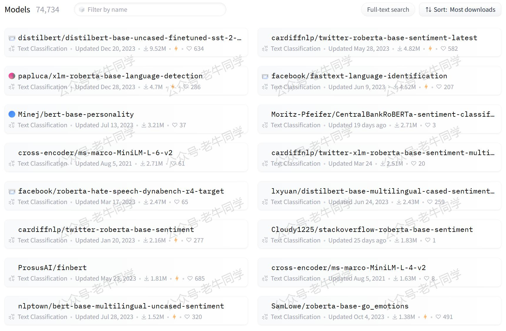
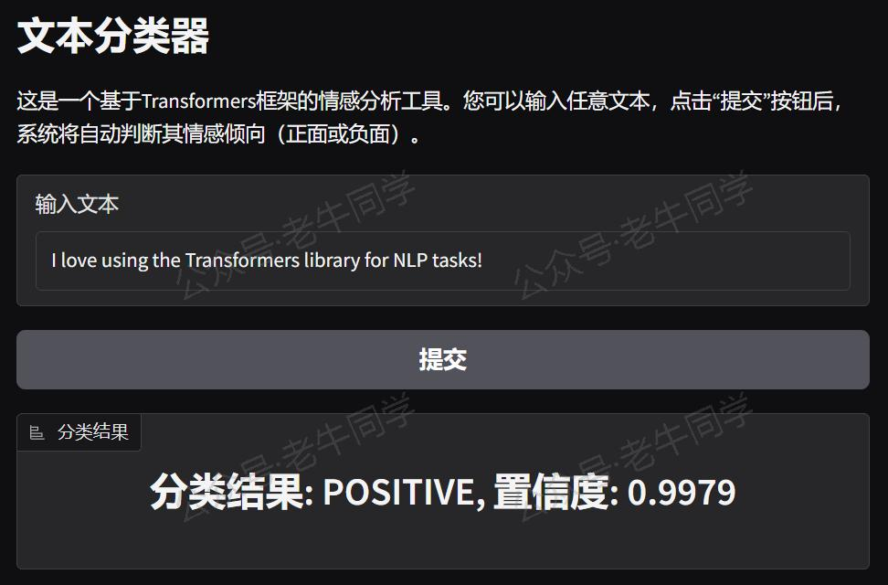
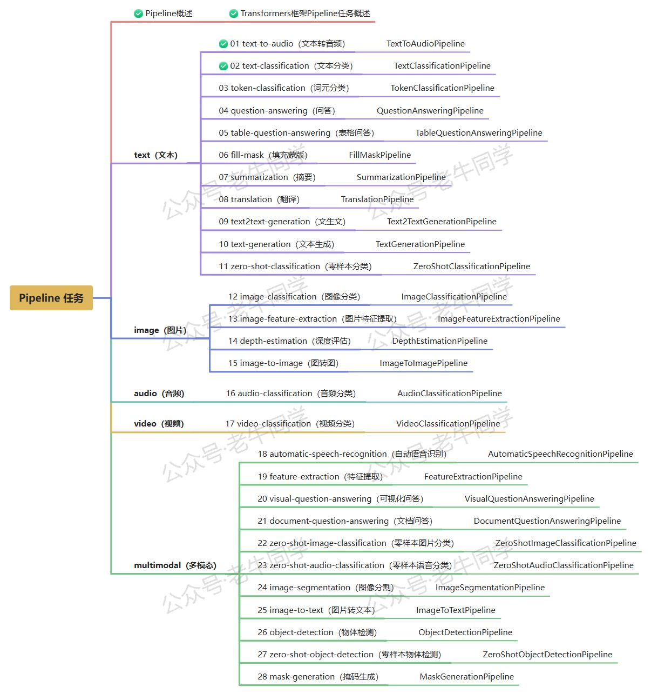

+++
slug = "2024120401"
date = "2024-12-04"
lastmod = "2024-12-04"
title = "Transformers 框架 Pipeline 任务详解：文本分类（text-classification 或 sentiment-analysis）"
description = "本文深入浅出地介绍了Transformers框架中的text-classification任务，并结合Gradio库搭建一个可视化的Web界面，帮助您快速掌握文本分类的最佳实践。通过Pipeline API，您可以轻松使用预训练模型进行情感分析、垃圾邮件检测等任务……"
image = "00.jpg"
tags = [ "AI", "transformers", "Pipeline", "文本分类" ]
categories = [ "人工智能" ]
+++

在自然语言处理（NLP）领域，Text-Classification（文本分类）是一项非常重要的任务，它涉及到将文本数据分配到预定义的类别中。借助 Transformers 框架的 Pipeline API，我们可以轻松地使用预训练模型进行文本分类，而无需深入了解复杂的模型结构和算法。老牛同学将通过本文详细介绍 Transformers 框架中的`text-classification`任务，涵盖任务描述、应用场景、示例代码以及具体的实战案例。

# 1. 任务简介

文本分类是指根据给定的文本内容，将其归类到一个或多个预定义的类别中的过程。例如：

- **情感分析**：判断一段文本的情感倾向，如正面、负面或中性。
- **垃圾邮件检测**：识别一封电子邮件是否为垃圾邮件。
- **主题分类**：确定一篇文章属于哪个主题，如科技、体育、娱乐等。

文本分类的核心思想是通过机器学习模型从大量标注好的文本数据中学习特征，并根据这些特征对新的文本进行分类。具体步骤如下：

1. **数据准备**：收集并标注大量的文本数据，每个文本都对应一个类别标签。
2. **特征提取**：将文本转换为模型可以理解的数值表示，通常是通过分词、向量化等方式。
3. **模型训练**：使用标注好的数据训练一个分类模型，模型会学习如何根据输入的文本特征预测正确的类别。
4. **模型推理**：对于新的未见过的文本，模型会根据学到的特征进行分类预测。

根据 Hugging Face 官网的数据，当前已有超过**74,737**个文本分类模型供选择，涵盖了多种语言和应用场景：



# 2. 应用场景

文本分类技术广泛应用于各个领域，以下是几个典型的应用场景：

- **情感分析**：情感分析可以帮助企业了解用户对产品或服务的态度。例如，电商平台可以通过分析用户评论来判断产品的受欢迎程度，社交媒体平台可以监控用户的舆论动态，甚至政府机构可以评估公众对政策的看法。

- **垃圾邮件检测**：垃圾邮件检测是文本分类的一个经典应用。通过训练模型识别垃圾邮件的特征，系统可以自动过滤掉不必要的邮件，保护用户的邮箱免受骚扰。

- **主题分类**：新闻网站或博客平台可以使用文本分类技术自动为文章打上标签，帮助用户更快找到感兴趣的内容。例如，一篇关于人工智能的文章可以被自动分类到“科技”类别，而一篇关于足球比赛的文章则会被分类到“体育”类别。

- **客服系统**：智能客服系统可以通过文本分类技术自动识别用户的意图，提供相应的帮助。例如，当用户询问某个产品的价格时，系统可以自动将问题分类为“销售咨询”，并提供相关的产品信息。

- **医疗诊断**：在医疗领域，文本分类可以用于分析病历记录，帮助医生快速定位患者的病情。例如，通过对病历中的症状描述进行分类，系统可以提示医生可能的疾病类型，辅助诊断过程。

# 3. 任务配置

在 Transformers 框架中，`text-classification`和`sentiment-analysis`都是**文本分类任务**的不同名称。尽管两者在 Pipeline 配置中有别名关系，但在实际使用时没有区别，框架最终统一使用`text-classification`作为任务名称。

我们可以在 Transformers 框架的源代码中看到以下配置（源代码文件：`./transformers/pipelines/__init__.py`）：

```python
TASK_ALIASES = {
    "sentiment-analysis": "text-classification",
    # 其他省略......
}

SUPPORTED_TASKS = {
    # 其他省略......

    "text-classification": {
        "impl": TextClassificationPipeline,
        "tf": (TFAutoModelForSequenceClassification,) if is_tf_available() else (),
        "pt": (AutoModelForSequenceClassification,) if is_torch_available() else (),
        "default": {
            "model": {
                "pt": ("distilbert-base-uncased-finetuned-sst-2-english", "714eb0f"),
                "tf": ("distilbert-base-uncased-finetuned-sst-2-english", "714eb0f"),
            },
        },
        "type": "text",
    },

    # 其他省略......
}
```

从上面的配置可以看出，Transformers 框架默认使用的是`distilbert-base-uncased-finetuned-sst-2-english`模型，这是一个在 Stanford Sentiment Treebank (SST-2) 数据集上微调过的 DistilBERT 模型，专门用于英文情感分类任务。该模型是 Hugging Face 上下载量最大的文本分类模型之一，具有较高的准确性和效率。

# 4. 文本分类实战

首先，确保安装了 Transformers 库和其他必要的依赖包：

```bash
pip install transformers torch
```

#### 方法一：自动下载模型

我们可以直接从 Hugging Face 下载模型。如果您的网络环境允许，可以直接下载；否则，可以通过设置镜像来加速下载过程：

```python
import os

# 设置代理
os.environ["HF_ENDPOINT"] = "https://hf-mirror.com"

# 设置本地缓存目录
cache_dir = os.path.join('D:', os.path.sep, 'ModelSpace', 'Cache')
os.environ['HF_HOME'] = cache_dir

from transformers import pipeline

# 创建Pipeline任务
nlp = pipeline("text-classification", model="distilbert/distilbert-base-uncased-finetuned-sst-2-english")

# 执行文本分类任务
result = nlp("I like Transformers.")
print(result)  # 输出：[{'label': 'POSITIVE', 'score': 0.9973547458648682}]

result = nlp("I don't like overtime.")
print(result)  # 输出：[{'label': 'NEGATIVE', 'score': 0.9958478212356567}]
```

Pipeline 任务的输出结果将类似于以下格式：

```python
[{'label': 'POSITIVE', 'score': 0.9876}]
```

其中，`label`表示分类结果，`score`表示模型对该分类的信心分数，范围在 0 到 1 之间，值越接近 1 表示模型越确信该分类是正确的。

运行上述代码后，我们可以得到比较准确的结果：喜欢属于**正面**（POSITIVE）情绪，不喜欢属于**负面**（NEGATIVE）情绪。

#### 方法二：自主下载模型

如果您希望通过本地模型文件进行推理，可以按照以下步骤操作。实际上，与自动下载相比，唯一的区别是指定分词器和模型即可。假设我们下载的模型目录是`/models/pipeline`，则用法如下：

```python
from transformers import AutoTokenizer, AutoModelForSequenceClassification, pipeline
import os

# 下载模型目录
model_dir = '/models/pipeline'

# 加载分词器和模型
tokenizer = AutoTokenizer.from_pretrained(model_dir, local_files_only=True)
model = AutoModelForSequenceClassification.from_pretrained(model_dir, torch_dtype="auto", device_map="auto", local_files_only=True, num_labels=2)

# 创建Pipeline任务
nlp = pipeline("text-classification", tokenizer=tokenizer, model=model)

# 后续用法与自动下载相同
```

我们可以看到，任务的输出结果，和自动下载是一样的。

# 4. WebUI 页面

通过 Gradio，我们可以轻松地为 Transformers 框架中的`text-classification`任务创建一个可视化的 WebUI 界面，用户可以通过浏览器输入文本并实时获得分类结果。

首先，我们需要安装依赖包：

```shell
pip install gradio
```

接下来，我们开始创建 Web 页面，我们可以复用 Pipeline 实例：

```python
import sys

# 直接复用Pipeline实例
sys.path.append("./")
pipeline = __import__("02-text-classification")

import gradio as gr


# 定义分类函数
def classify_text(text):
    # 使用Pipeline进行分类
    result = pipeline.nlp(text)

    # 提取分类标签和置信度
    label = result[0]['label']
    score = result[0]['score']

    # 返回格式化后的结果
    return f"分类结果: {label}, 置信度: {score:.4f}"


# 创建Gradio界面
with gr.Blocks() as demo:
    gr.Markdown("# 文本分类器")
    gr.Markdown(
        "这是一个基于Transformers框架的情感分析工具。您可以输入任意文本，点击“提交”按钮后，系统将自动判断其情感倾向（正面或负面）。")

    with gr.Row():
        input_text = gr.Textbox(placeholder="请输入要分类的文本...", label="输入文本")

    with gr.Row():
        submit_button = gr.Button("提交")

    with gr.Row():
        output_label = gr.Label(label="分类结果")

    # 设置按钮点击事件，触发分类函数
    submit_button.click(classify_text, inputs=input_text, outputs=output_label)

# 启动Gradio应用
if __name__ == "__main__":
    demo.launch()
```

运行上述代码，我们可以看到 URL 信息：

```shell
* Running on local URL:  http://127.0.0.1:7860

To create a public link, set `share=True` in `launch()`.
```

通过浏览器打开地址，就可以通过可视化的方式进行文本分类了：



# 5. 总结

本文详细介绍了 Transformers 框架中的`text-classification`任务，涵盖了任务描述、应用场景、示例代码以及具体的实战案例。通过使用 Transformers 的 Pipeline API，我们可以轻松地实现文本分类任务，而无需深入了解复杂的模型结构和算法。无论是情感分析、垃圾邮件检测还是主题分类，Transformers 框架都能提供强大的支持，帮助您快速构建高效的文字处理系统。

老牛同学将继续推出更多关于 Transformers 框架 Pipeline 任务的文章，敬请期待！大家若有任何问题或建议，欢迎在评论区留言交流！




---

Pipeline任务：

<small>[Transformers 框架任务概览：从零开始掌握 Pipeline（管道）与 Task（任务）](https://mp.weixin.qq.com/s/FR4384AZV2FE2xtweSh9bA)</small>

<small>[Transformers框架 Pipeline 任务详解：文本转音频（text-to-audio或text-to-speech）](https://mp.weixin.qq.com/s/uN2BFIOxDFEh4T-W7tsPbg)</small>

往期推荐文章：

<small>[深入解析 Transformers 框架（一）：包和对象加载中的设计巧思与实用技巧](https://mp.weixin.qq.com/s/lAAIfl0YJRNrppp5-Vuusw)</small>

<small>[深入解析 Transformers 框架（二）：AutoModel 初始化及 Qwen2.5 模型加载全流程](https://mp.weixin.qq.com/s/WIbbrkf1HjVC1CtBNcU8Ow)</small>

<small>[深入解析 Transformers 框架（三）：Qwen2.5 大模型的 AutoTokenizer 技术细节](https://mp.weixin.qq.com/s/Shg30uUFByM0tKTi0rETfg)</small>

<small>[深入解析 Transformers 框架（四）：Qwen2.5/GPT 分词流程与 BPE 分词算法技术细节详解](https://mp.weixin.qq.com/s/GnoHXsIYKYFU1Xo4u5sE1w)</small>

<small>[基于 Qwen2.5-Coder 模型和 CrewAI 多智能体框架，实现智能编程系统的实战教程](https://mp.weixin.qq.com/s/8f3xna9TRmxMDaY_cQhy8Q)</small>

<small>[vLLM CPU 和 GPU 模式署和推理 Qwen2 等大语言模型详细教程](https://mp.weixin.qq.com/s/KM-Z6FtVfaySewRTmvEc6w)</small>

<small>[基于 Qwen2/Lllama3 等大模型，部署团队私有化 RAG 知识库系统的详细教程（Docker+AnythingLLM）](https://mp.weixin.qq.com/s/PpY3k3kReKfQdeOJyrB6aw)</small>

<small>[使用 Llama3/Qwen2 等开源大模型，部署团队私有化 Code Copilot 和使用教程](https://mp.weixin.qq.com/s/vt1EXVWtwm6ltZVYtB4-Tg)</small>

<small>[基于 Qwen2 大模型微调技术详细教程（LoRA 参数高效微调和 SwanLab 可视化监控）](https://mp.weixin.qq.com/s/eq6K8_s9uX459OeUcRPEug)</small>

<small>[ChatTTS 长音频合成和本地部署 2 种方式，让你的“儿童绘本”发声的实战教程](https://mp.weixin.qq.com/s/9ldLuh3YLvx8oWvwnrSGUA)</small>


