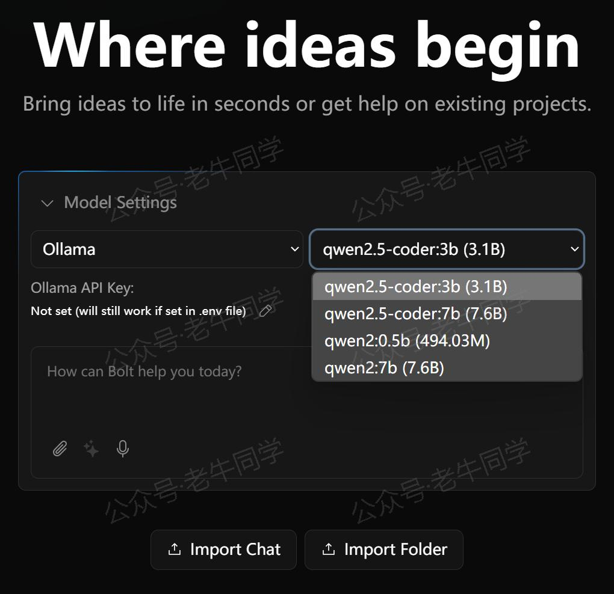
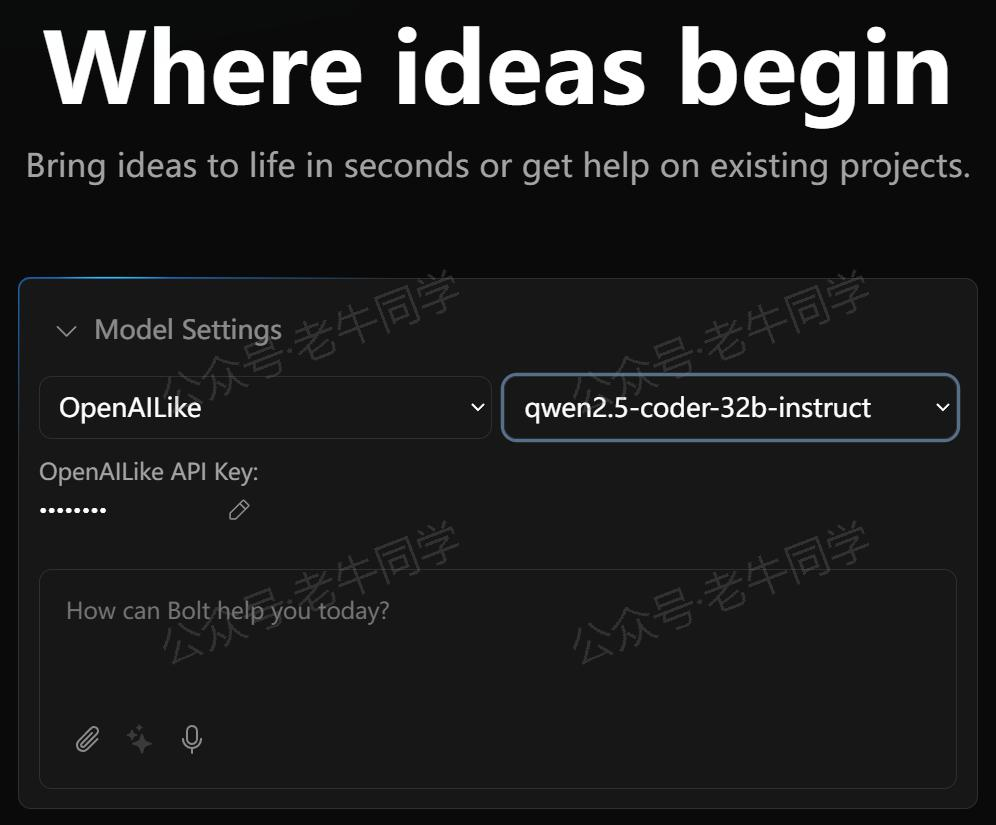
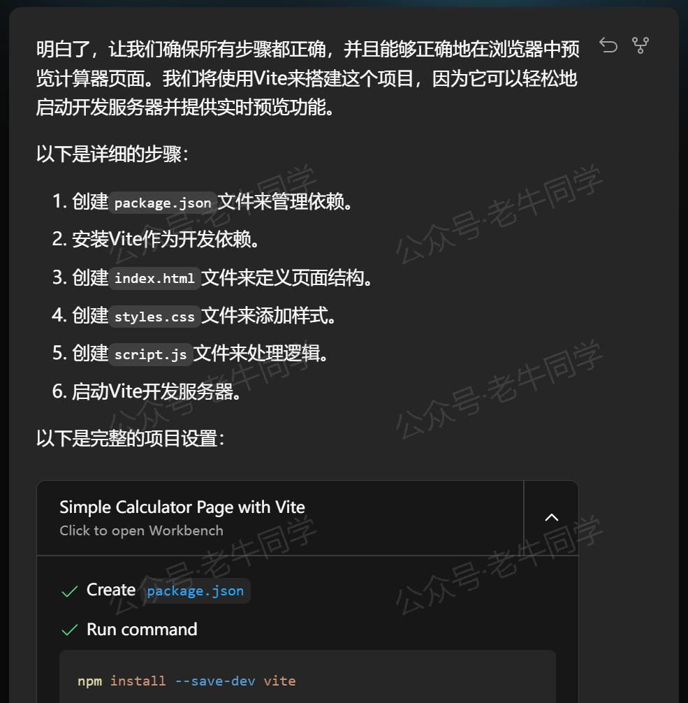
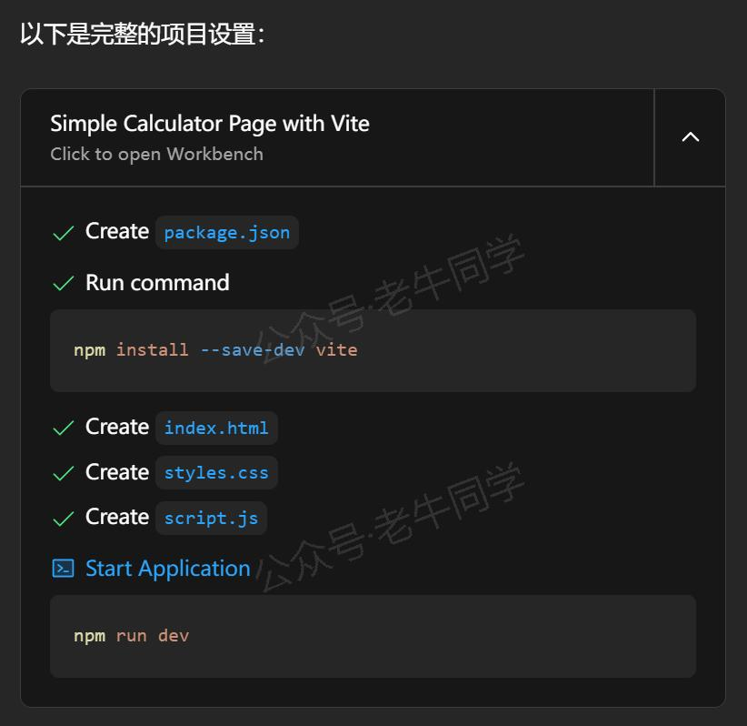
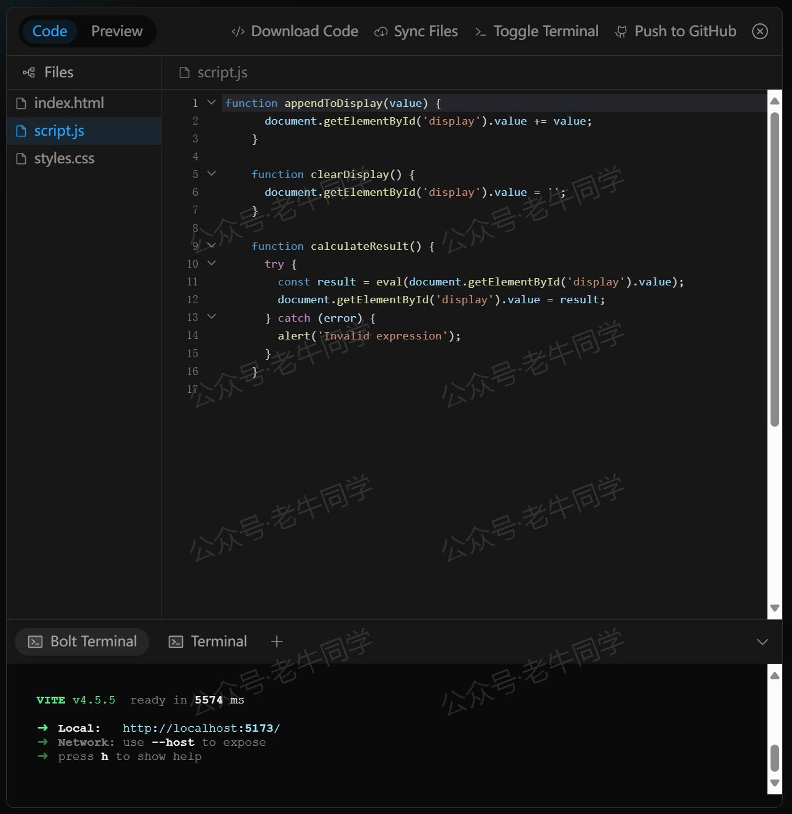

+++
slug = "2024120701"
date = "2024-12-07"
lastmod = "2024-12-07"
title = "Bolt.new 用一句话快速构建全栈应用：本地部署与应用实战（Ollama/Qwen2.5 等）"
description = "本文详细介绍如何本地 Ollama 和国内大模型资源，在本地环境中快速部署和使用 Bolt.new，结合 Ollama 和 Qwen2.5-Coder，轻松实现从代码编写到自动部署的全流程。适合所有希望提升开发效率的开发者……"
image = "00.jpg"
tags = [ "AI", "Bolt.new", "Ollama", "Qwen" ]
categories = [ "人工智能" ]
+++

随着 AI 编程工具的迅猛发展，从早期的 Code Copilot（代码辅助）到如今备受瞩目的 Cursor、v0、Windsurf 和 **Bolt.new** 等全栈开发平台。这些创新工具旨在加速项目开发、简化工作流程并提高研发效率。然而，访问这些工具通常依赖于“通畅的网络”和海外 LLM 模型，在某些情况下可能成为使用这些工具的障碍。

作为一位大模型的爱好者和学习者，老牛同学今天分享一条不同的路径——**如何利用本地 Ollama 和国内的大模型 API，在本地部署和使用 Bolt.new？**

以下是老牛同学录制的本地部署和使用 **Bolt.new** 的视频：通过一句话，即可自动完成整个小项目的代码编写和部署预览。

【微信公众号视频链接】

# 1. Bolt.new 概览

**Bolt.new**是由 StackBlitz 推出的一款革新性的 AI 驱动全栈开发平台，它以几个关键特性脱颖而出：

- **即时全栈环境**：借助 WebContainer 技术，Bolt.new 能够在浏览器中直接运行真实的 Node.js 环境，支持 npm 包安装、服务器配置及第三方 API 交互，为开发者提供了前所未有的便捷性。
- **智能 AI 助手**：内置的强大 AI 功能可以理解并执行复杂的指令，无论是创建文件、编辑代码还是解决问题，都能显著提高工作效率。特别是其一键修复错误的功能，能够自动处理编译或运行时出现的问题，极大地节省了时间。
- **简易部署流程**：集成的聊天界面让用户可以直接上传代码至云端，并选择合适的托管服务（如 Vercel）进行部署。生成的应用程序可以通过 URL 轻松分享，促进团队协作和成果展示。

尽管 Bolt.new 带来了诸多便利，但也存在一些局限：

- **缺乏版本控制**：代码调整可能导致原有版本被覆盖，增加了数据丢失的风险。
- **频繁重新生成和部署**：每次修改需求时，Bolt.new 会重新生成整个代码库并部署，需要较长时间。

对于快速原型设计和全栈功能开发，Bolt.new 凭借其完整的开发环境、智能化的辅助工具和简便的协作机制，是一个不错的选择。

# 2. 本地部署 Bolt.new

## 准备本地大模型

Bolt.new 底层依赖 LLM，我们先准备 2 个 LLM 选项：本地运行 Ollama，和 API 调用的远程 LLM 服务（非必须）

- **本地 Ollama**：关于 Ollama 详细使用教程，请参考之前文章（[Ollama 完整教程](https://mp.weixin.qq.com/s/majDONtuAUzN2SAaYWxH1Q)），建议下载和启动**Qwen2.5-Coder-7B**模型：

```shell
ollama run qwen2.5-coder:7b
```

- **LLM 服务 API**：Ollama 依赖电脑硬件配置，如果电脑硬件条件有限，我们还可以直接用户大模型服务 API，只需要兼容 OpenAPI 接口标准即可（老牛同学用的是百炼平台 Qwen2.5-Coder-32B 大模型）。

## 下载和配置 Bolt.new

官方提供的 Bolt.new 并不直接支持本地 LLM 或自定义 API 设置。幸运的是，社区牛人**coleam00**基于官方版本开发了一个增强版——[bolt.new-any-llm](https://github.com/stackblitz/bolt.new)，该版本不仅兼容多种 LLM，还能灵活配置 API 接口。

1. **克隆项目仓库**：

```shell
git clone https://github.com/coleam00/bolt.new-any-llm bolt.new-any-LLM
cd bolt.new-any-LLM
```

2. **配置环境变量**：复制`.env.example`为`.env`，然后根据实际情况编辑`.env`配置文件中的 API 地址和密钥。例如，Ollama 需要设置`OLLAMA_API_BASE_URL`参数，国内模型 API 服务，则需要设置`OPENAI_LIKE_API_BASE_URL`和`OPENAI_LIKE_API_KEY`这 2 个参数。

```shell
# 复制配置文件
cp .env.example .env
```

然后，打开`.env`配置文件，可以看到支持的模型列表，包括 GROQ、HuggingFace、Open AI 等，根据需要进行内容修改：

```plaintext
# Ollama配置
OLLAMA_API_BASE_URL=http://localhost:11434

# 【可选】 老牛同学使用的是百炼平台
OPENAI_LIKE_API_BASE_URL=https://dashscope.aliyuncs.com/compatible-mode/v1
OPENAI_LIKE_API_KEY=真实Key内容
```

**说明**：`OPENAI_LIKE_API_BASE_URL`和`OPENAI_LIKE_API_KEY`意思就是兼容 OpenAI 接口标准的大模型地址和 API Key，目前国内厂商基本都支持 OpenAPI 接口标准。

## Bolt.new 项目部署

为了加快 Node.js 包下载速度，我们可以设置一下镜像源（老牛同学使用的是淘宝镜像）：

```shell
npm config set registry https://registry.npmmirror.com
```

其他镜像源如下列表，请按需选择：

```plaintext
NPM官方: https://registry.npmjs.org
淘宝镜像: http://registry.npmmirror.com
阿里云镜像: https://npm.aliyun.com
腾讯云: https://mirrors.cloud.tencent.com/npm
华为云: https://mirrors.huaweicloud.com/repository/npm
网易: https://mirrors.163.com/npm
中科大: http://mirrors.ustc.edu.cn
清华: https://mirrors.tuna.tsinghua.edu.cn
```

然后，我们执行以下命令来安装依赖并启动 Bolt.new：

```shell
# 安装pnpm包管理工具
npm install -g pnpm

# 安装项目依赖包
pnpm install

# 启动Bolt.new
pnpm run dev
```

启动成功后，我们可以看到如下输出信息：

```shell
>pnpm run dev

> bolt@ dev D:\CodeSpace\bolt.new
> remix vite:dev

  ➜  Local:   http://localhost:5173/
  ➜  Network: use --host to expose
  ➜  press h + enter to show help
```

接下来，我们开始体验本地化的 Bolt.new！

# 3. 使用 Bolt.new 进行开发

通过浏览器打开 Bolt.new 本地地址：[http://localhost:5173](http://localhost:5173)

首先可以看到如下页面，与官方相比，多了一个**Model Settings**的选项，在这里我们可以选择自己的模型：



我们可以选择 Ollama 模型（如上图），也可以选择配置过**OPENAI_LIKE_API**尝试模型（如老牛同学百炼平台 API 模型）：



选择完模型，我可以输入我们的需求：`写一个计算器页面`

接下来的过程，就是老牛同学上面录制的视频所示了。

Bolt.new 可以根据我们的一句话内容，自动拆分成不同的小步骤：



然后，自动生成完整的项目结构和执行步骤，包括文件名等：



在右侧，显示源文件列表和动态展示每个文件生成过程：



最终，所有源代码研发完成，自动部署整个和提供预览：


接下来，如果我们觉得哪里需要修改、或者有什么报错，直接提问，Bolt.new 会自动进行修改并部署和预览！

# 4. 总结

**Bolt.new**只需通过自然语音，就能实现全栈研发和自动部署的能力，对于追求高效开发和快速交付的团队而言，这是一个值得尝试的工具。

**友情提示**：对于保密性较高、或数据安全要求较高的项目，通过调用外部大模型 API 服务使用 Bolt.new 工具时，请注意数据安全问题！

---

Pipeline 任务：

<small>[Transformers 框架任务概览：从零开始掌握 Pipeline（管道）与 Task（任务）](https://mp.weixin.qq.com/s/FR4384AZV2FE2xtweSh9bA)</small>

<small>[Transformers 框架 Pipeline 任务详解：文本转音频（text-to-audio 或 text-to-speech）](https://mp.weixin.qq.com/s/uN2BFIOxDFEh4T-W7tsPbg)</small>

<small>[Transformers 框架 Pipeline 任务详解：文本分类（text-classification）](https://mp.weixin.qq.com/s/9ccEDNfeGNf_Q9pO0Usg2w)</small>

往期推荐文章：

<small>[深入解析 Transformers 框架（一）：包和对象加载中的设计巧思与实用技巧](https://mp.weixin.qq.com/s/lAAIfl0YJRNrppp5-Vuusw)</small>

<small>[深入解析 Transformers 框架（二）：AutoModel 初始化及 Qwen2.5 模型加载全流程](https://mp.weixin.qq.com/s/WIbbrkf1HjVC1CtBNcU8Ow)</small>

<small>[深入解析 Transformers 框架（三）：Qwen2.5 大模型的 AutoTokenizer 技术细节](https://mp.weixin.qq.com/s/Shg30uUFByM0tKTi0rETfg)</small>

<small>[深入解析 Transformers 框架（四）：Qwen2.5/GPT 分词流程与 BPE 分词算法技术细节详解](https://mp.weixin.qq.com/s/GnoHXsIYKYFU1Xo4u5sE1w)</small>

<small>[基于 Qwen2.5-Coder 模型和 CrewAI 多智能体框架，实现智能编程系统的实战教程](https://mp.weixin.qq.com/s/8f3xna9TRmxMDaY_cQhy8Q)</small>

<small>[vLLM CPU 和 GPU 模式署和推理 Qwen2 等大语言模型详细教程](https://mp.weixin.qq.com/s/KM-Z6FtVfaySewRTmvEc6w)</small>

<small>[基于 Qwen2/Lllama3 等大模型，部署团队私有化 RAG 知识库系统的详细教程（Docker+AnythingLLM）](https://mp.weixin.qq.com/s/PpY3k3kReKfQdeOJyrB6aw)</small>

<small>[使用 Llama3/Qwen2 等开源大模型，部署团队私有化 Code Copilot 和使用教程](https://mp.weixin.qq.com/s/vt1EXVWtwm6ltZVYtB4-Tg)</small>

<small>[基于 Qwen2 大模型微调技术详细教程（LoRA 参数高效微调和 SwanLab 可视化监控）](https://mp.weixin.qq.com/s/eq6K8_s9uX459OeUcRPEug)</small>

<small>[ChatTTS 长音频合成和本地部署 2 种方式，让你的“儿童绘本”发声的实战教程](https://mp.weixin.qq.com/s/9ldLuh3YLvx8oWvwnrSGUA)</small>


