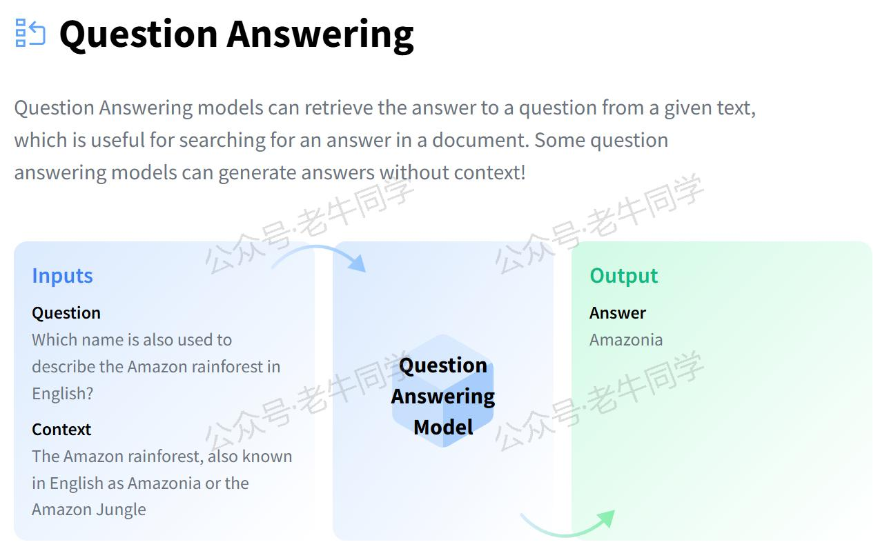
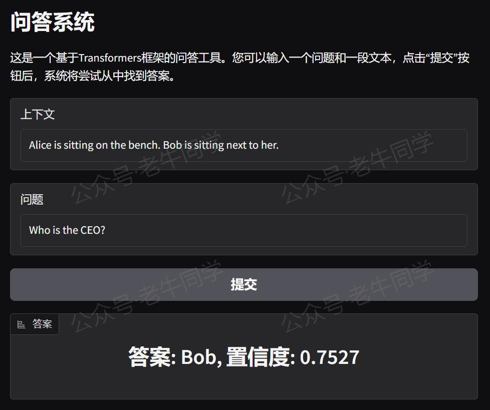

+++
slug = "2024121201"
date = "2024-12-20"
lastmod = "2024-12-20"
title = "Transformers 框架 Pipeline 任务详解（四）：问答（question-answering）系统"
description = "本文深入介绍了 Transformers 框架中的 question-answering 任务，涵盖任务简介、应用场景如智能助手和客户服务、任务配置与模型选择、实战代码示例，以及如何利用 Gradio 创建 WebUI 界面，使用户能通过浏览器实时获取问答结果。文章旨在帮助读者快速掌握使用 Transformers 构建高效问答系统的方法……"
image = "00.jpg"
tags = [ "AI", "transformers", "Pipeline", "问答" ]
categories = [ "人工智能" ]
+++

在自然语言处理领域，问答系统是一项关键的技术，它旨在根据给定的问题从文本中找到最准确的答案。借助 Hugging Face 的 Transformers 框架的 Pipeline API，我们可以快速地搭建一个强大的问答系统，而无需深入理解背后的复杂模型结构和算法细节。本文将详细探讨 Transformers 框架中的`question-answering`任务，包括任务描述、应用场景、配置指南以及实战案例。



# 1. 任务简介

`question-answering`任务的目标是，对于一个给定的问题，从上下文中抽取最合适的答案。例如：

- **信息检索**：用户询问“谁是《哈利·波特》的作者？”，系统应当能够从提供的文本或文档集合中找出答案“J.K.罗琳”。
- **知识查询**：当问到“太阳是由什么组成的？”时，系统应能回答出“氢和氦”。

为了完成这一任务，通常需要以下步骤：

1. **问题解析**：理解问题的意图和要求。
2. **上下文分析**：识别并理解包含潜在答案的文本段落。
3. **答案提取**：从上下文中定位并提取最符合问题的答案。

根据 Hugging Face 官网的数据，当前已有超过**12,624**个`question-answering`模型，这些模型已经在大量的文本数据上进行了微调，以更好地适应特定的任务需求：


# 2. 应用场景

问答系统广泛应用于多个行业和领域，以下是几个典型的应用实例：

- **智能助手**：像 Siri、Alexa 和 Google Assistant 这样的虚拟助手可以使用问答技术来响应用户的提问，提供即时的帮助和信息。
- **教育辅导**：在线学习平台可以集成问答功能，帮助学生解决学习过程中遇到的问题，或者为教师提供教学辅助。
- **客户服务**：企业可以通过聊天机器人自动回复客户咨询，提高服务效率，降低运营成本。
- **医疗健康**：通过问答系统，患者可以获得关于疾病预防、治疗方案等基本医疗信息，促进自我健康管理。
- **法律咨询**：律师或法律顾问可以利用问答工具快速查找相关的法律法规和案例，提升工作效率。

# 3. 任务配置

在 Transformers 框架中，`question-answering`任务的配置相对简单。下面是从源代码中摘录的相关配置示例（位于`./transformers/pipelines/__init__.py`文件）：

```python
SUPPORTED_TASKS = {
    # 其他省略......

    "question-answering": {
        "impl": QuestionAnsweringPipeline,
        "tf": (TFAutoModelForQuestionAnswering,) if is_tf_available() else (),
        "pt": (AutoModelForQuestionAnswering,) if is_torch_available() else (),
        "default": {
            "model": {
                "pt": ("distilbert/distilbert-base-cased-distilled-squad", "564e9b5"),
                "tf": ("distilbert/distilbert-base-cased-distilled-squad", "564e9b5"),
            },
        },
        "type": "text",
    },

    # 其他省略......
}
```

默认情况下，Transformers 框架会使用`distilbert-base-cased-distilled-squad`作为`question-answering`任务的预训练模型。这个模型是在 SQuAD 数据集上进行过微调的 DistilBERT 版本，特别适用于英文的问答任务。

# 4. 问答实战

确保您已经安装了 Transformers 库和其他必要的依赖包：

```shell
pip install transformers torch
```

## 方法一：自动下载模型

如果您的网络环境允许，可以直接从 Hugging Face 下载模型并创建 Pipeline 任务。如下老牛同学使用 Hugging Face 镜像网站自动下载模型：

```python
import os

# 设置代理
os.environ["HF_ENDPOINT"] = "https://hf-mirror.com"

# 设置本地缓存目录
cache_dir = os.path.join('D:', os.path.sep, 'ModelSpace', 'Cache')
os.environ['HF_HOME'] = cache_dir

from transformers import pipeline

# 创建Pipeline任务
nlp = pipeline("question-answering", model="distilbert/distilbert-base-cased-distilled-squad")

# 执行问答任务
if __name__ == "__main__":
    # 上下文
    context = r"""
    Extractive Question Answering is the task of extracting an answer from a text given a question.
    An example of a question answering dataset is the SQuAD dataset, which is entirely based on that task.
    If you would like to fine-tune a model on a SQuAD task,
    you may leverage the examples/pytorch/question-answering/run_squad.py script.
    """

    # 执行任务
    result = nlp(context=context, question="What is a good example of a question answering dataset?")

    print(result)
    # 输出：{'score': 0.5152314901351929, 'start': 155, 'end': 168, 'answer': 'SQuAD dataset'}
```

输出结果包含了四个关键部分：

1. **`score`**: 表示模型对于所找到答案的信心程度，范围从 0 到 1。数值越接近 1，意味着模型对这个答案的准确性越有信心。在这个例子中，`score: 0.5152314901351929`表明模型比较确信“SQuAD dataset”是正确答案。

2. **`start`**: 指定了答案在上下文字符串中的起始位置（以字符为单位）。例如，在提供的上下文中，“SQuAD dataset”的第一个字符位于索引 155 处。注意，这个索引是从 0 开始计数的，也就是说，文本的第一个字符的位置是 0。

3. **`end`**: 给出了答案在上下文字符串中的结束位置（同样以字符为单位），但需要注意的是，这个索引是指答案最后一个字符之后的位置。

4. **`answer`**: 给出了模型认为的答案文本。在这个例子中，答案是“SQuAD dataset”，即数据集样本。

## 方法二：自主下载模型

如果您希望使用本地模型文件，可以按照以下步骤操作：

```python
from transformers import AutoTokenizer, AutoModelForQuestionAnswering, pipeline
import os

# 下载模型目录
model_dir = '/models/question_answering'

# 加载分词器和模型
tokenizer = AutoTokenizer.from_pretrained(model_dir, local_files_only=True)
model = AutoModelForQuestionAnswering.from_pretrained(model_dir, torch_dtype="auto", device_map="auto", local_files_only=True)

# 创建Pipeline任务
nlp = pipeline("question-answering", tokenizer=tokenizer, model=model)

# 后续用法与自动下载相同
```

# 5. WebUI 界面

为了能使用`question-answering` Pipeline 任务的体验更好，或者进行模型演示，我们可以使用 Gradio 创建一个直观的 WebUI 界面。以下是创建界面的代码示例：

```python
import sys

# 直接复用Pipeline实例
sys.path.append("./")
pipeline = __import__("04-question-answering")

import gradio as gr


# 定义问答函数
def answer_question(question, context):
    result = pipeline.nlp(question=question, context=context)
    return f"答案: {result['answer']}, 置信度: {result['score']:.4f}"


# 创建Gradio界面
with gr.Blocks() as demo:
    gr.Markdown("# 问答系统")
    gr.Markdown(
        "这是一个基于Transformers框架的问答工具。您可以输入一个问题和一段文本，点击“提交”按钮后，系统将尝试从中找到答案。")

    with gr.Row():
        input_context = gr.Textbox(placeholder="请输入相关文本...", label="上下文")

    with gr.Row():
        input_question = gr.Textbox(placeholder="请输入您的问题...", label="问题")

    with gr.Row():
        submit_button = gr.Button("提交")

    with gr.Row():
        output_answer = gr.Label(label="答案")

    # 设置按钮点击事件，触发问答函数
    submit_button.click(answer_question, inputs=[input_question, input_context], outputs=output_answer)

# 启动Gradio应用
if __name__ == "__main__":
    demo.launch()
```

运行上述代码，我们可以看到 URL 信息：

```shell
* Running on local URL:  http://127.0.0.1:7860

To create a public link, set `share=True` in `launch()`.
```

通过浏览器打开地址，就可以通过可视化的方式进行词元分类了：



如果想要分享给更多人，可以在 `launch()` 函数中设置 `share=True` 参数，Gradio 将生成一个公开链接供他人访问。

# 6. 总结

本文全面介绍了 Transformers 框架中的`question-answering`任务，从基础概念到实际应用，再到如何构建和部署一个交互式的问答系统。无论是在智能助手、教育辅导还是客户服务等领域，Transformers 框架都能为我们提供强有力的支持，助力我们快速实现高效的问答解决方案。

老牛同学将持续为大家带来更多有关 Pipeline 任务的文章（共**28**篇）。如果您有任何疑问或建议，请随时在评论区留言交流！


---

Transformers 框架：

<small>[01.包和对象加载中的设计巧思与实用技巧](https://mp.weixin.qq.com/s/lAAIfl0YJRNrppp5-Vuusw)</small>

<small>[02.AutoModel 初始化及 Qwen2.5 模型加载全流程](https://mp.weixin.qq.com/s/WIbbrkf1HjVC1CtBNcU8Ow)</small>

<small>[03.Qwen2.5 大模型的 AutoTokenizer 技术细节](https://mp.weixin.qq.com/s/Shg30uUFByM0tKTi0rETfg)</small>

<small>[04.Qwen2.5/GPT 分词流程与 BPE 分词算法技术细节详解](https://mp.weixin.qq.com/s/GnoHXsIYKYFU1Xo4u5sE1w)</small>

Pipeline NLP 任务：

<small>[零·概述](https://mp.weixin.qq.com/s/FR4384AZV2FE2xtweSh9bA) 丨 [01.文本转音频](https://mp.weixin.qq.com/s/uN2BFIOxDFEh4T-W7tsPbg) 丨 [02.文本分类](https://mp.weixin.qq.com/s/9ccEDNfeGNf_Q9pO0Usg2w) 丨 [03.词元分类和命名实体识别](https://mp.weixin.qq.com/s/9ccEDNfeGNf_Q9pO0Usg2w)</small>

往期推荐文章：

<small>[Bolt.new 用一句话快速构建全栈应用：本地部署与应用实战（Ollama/Qwen2.5 等）](https://mp.weixin.qq.com/s/Mq8CvZKdpokbj3mK-h_SAQ)</small>

<small>[基于 Qwen2.5-Coder 模型和 CrewAI 多智能体框架，实现智能编程系统的实战教程](https://mp.weixin.qq.com/s/8f3xna9TRmxMDaY_cQhy8Q)</small>

<small>[vLLM CPU 和 GPU 模式署和推理 Qwen2 等大语言模型详细教程](https://mp.weixin.qq.com/s/KM-Z6FtVfaySewRTmvEc6w)</small>

<small>[基于 Qwen2/Lllama3 等大模型，部署团队私有化 RAG 知识库系统的详细教程（Docker+AnythingLLM）](https://mp.weixin.qq.com/s/PpY3k3kReKfQdeOJyrB6aw)</small>

<small>[使用 Llama3/Qwen2 等开源大模型，部署团队私有化 Code Copilot 和使用教程](https://mp.weixin.qq.com/s/vt1EXVWtwm6ltZVYtB4-Tg)</small>

<small>[基于 Qwen2 大模型微调技术详细教程（LoRA 参数高效微调和 SwanLab 可视化监控）](https://mp.weixin.qq.com/s/eq6K8_s9uX459OeUcRPEug)</small>

<small>[ChatTTS 长音频合成和本地部署 2 种方式，让你的“儿童绘本”发声的实战教程](https://mp.weixin.qq.com/s/9ldLuh3YLvx8oWvwnrSGUA)</small>


