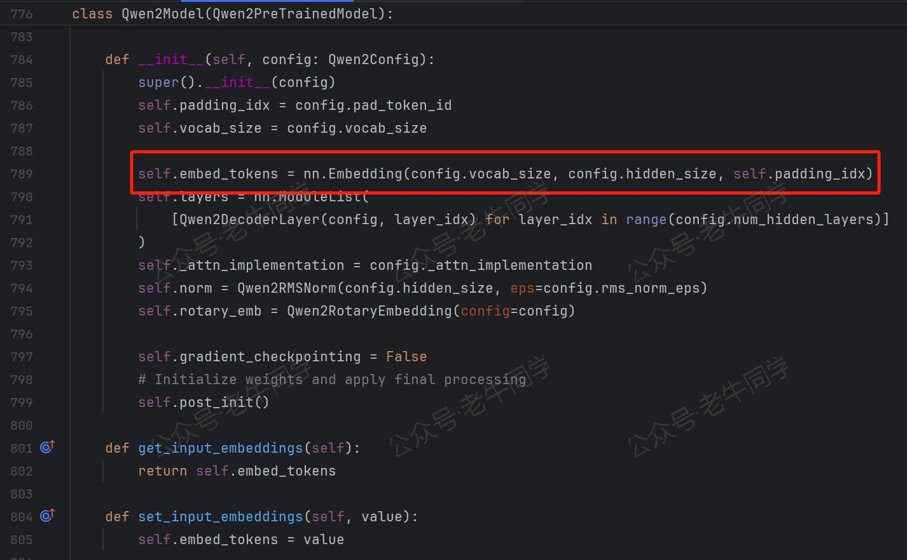

+++
slug = "2024121301"
date = "2024-12-13"
lastmod = "2024-12-13"
title = "深入解析 Transformers 框架（五）：嵌入（Embedding）机制和 Word2Vec 词嵌入模型实战"
description = "本文深入探讨了 Transformers 框架中词嵌入（Token Embeddings）的关键作用和实现细节，展示了将离散符号映射至连续向量空间的过程。通过具体代码示例，我们揭示了 Qwen2.5-1.5B 大模型中嵌入矩阵的工作原理，并演示了如何将文本序列转换为嵌入向量。此外，文章还介绍了经典的 Word2Vec 技术，使用 gensim 库训练模型并进行词汇相似性分析，以便更好地理解和应用自然语言处理中的嵌入技术……"
image = "00.jpg"
tags = [ "AI", "transformers", "Embedding", "Word2Vec" ]
categories = [ "人工智能" ]
+++

通过前面几篇关于 Transformers 框架的技术文章，我们探讨了大模型的配置、分词器和 BPE（Byte-Pair Encoding）分词算法。这些技术帮助我们将一段文本序列处理成一个 Token（词元）列表，并为每个 Token 分配一个唯一的 Token ID。然而，这仅仅是大模型输入层工作的第一步。接下来，我们将深入探讨**嵌入**（Embedding），这是将离散的符号映射到连续向量空间的关键步骤，尤其是**词嵌入**（Token Embeddings），它是整个流程中最基础也是最关键的环节。

# 1. 嵌入：从离散符号到连续向量

在人工智能领域，特别是在自然语言处理（NLP）和深度学习中，“**嵌入**”（Embedding）是一个至关重要的概念。它指的是**将离散的符号（如单词、字符或句子）映射到连续向量空间的过程**。这些向量通常被称为“**嵌入向量**”，使得计算机能够更有效地理解和处理人类语言。

嵌入的核心概念包括：

- **高维向量表示**：每个符号（例如单词）被表示为一个固定维度的实数向量。这个向量的空间通常具有较高的维度（如 100, 10000 甚至更高），以便能够充分表达复杂的语义信息。

- **语义相似性**：在嵌入空间中，语义上相似的词汇往往具有接近的向量表示。例如，“猫”和“狗”的嵌入向量可能会非常接近，因为它们都是宠物动物；而“苹果”作为一个水果，其嵌入向量会与上述两者有一定距离。

- **上下文依赖**：现代嵌入模型，不仅仅考虑单个词的静态意义，还会根据词语出现的具体上下文来动态调整其嵌入向量。这意味着同一个词在不同的句子中可能会有不同的表示，从而更好地捕捉其多义性和使用场景。例如，在“_这个苹果很甜。_”和“_我使用的是苹果手机。_”这两个句子中，“_苹果_”的含义并不相同。

**嵌入层**（Embedding Layer）是神经网络模型中的一种特殊层，它的作用就是实现嵌入（Embedding）。嵌入层的输入是 Token ID，输出则是对应的嵌入向量。在大语言模型中，嵌入层本质上是一个**嵌入矩阵**，矩阵的行代表词表中的 Token ID，矩阵的列则代表嵌入向量的维度。当给定一个 Token 时，嵌入层会根据 Token ID，直接从嵌入矩阵中取出相应的嵌入向量。

# 2. Transformers 框架中的嵌入机制

为了更好地理解嵌入机制，我们以**Qwen2.5-1.5B**大模型为例，看看它是如何实现嵌入的。

首先，我们根据大模型`config.json`配置文件中的**hidden_size**和**vocab_size**配置项，可以看出嵌入的维度是**1536**维，词表大小是**151936**个：

```json
{
    /**...其他省略...*/
    "hidden_size": 1536,
    "vocab_size": 151936
}
```

这意味着，**Qwen2.5-1.5B**的嵌入层形状是`(151936, 1536)`，即嵌入矩阵有 151936 行，1536 列。我们可以通过以下代码来验证这一点：

```python
import os
from transformers import AutoTokenizer, AutoModel

# 本地模型目录
model_dir = os.path.join('D:', os.path.sep, 'ModelSpace', 'Qwen2.5', 'Qwen2.5-1.5B-Instruct')

# 初始化分词器和模型
tokenizer = AutoTokenizer.from_pretrained(
    model_dir,
    local_files_only=True,
)

model = AutoModel.from_pretrained(
    model_dir,
    torch_dtype='auto',
    device_map='auto',
    local_files_only=True,
)

# 查看嵌入矩阵和大小
embeddings = model.get_input_embeddings()
print(f'嵌入矩阵大小: {embeddings.weight.size()}')
```

结果输出：

```plaintext
嵌入矩阵大小: torch.Size([151936, 1536])
```

我也可以通过 Transformers 框架的源代码，查看嵌入矩阵的构建代码：



有了嵌入矩阵后，我们可以进一步查看文本序列（如：`Hi, 你好~`）的嵌入向量内容：

```python
# 分词
word = 'Hi, 你好~'
tokens = tokenizer.tokenize(word)
print(f'{word} 分词: {tokens}')
# 输出：Hi, 你好~ 分词: ['Hi', ',', 'Ġ', 'ä½łå¥½', '~']

token_ids = tokenizer.convert_tokens_to_ids(tokens)
print(f'{word} Token IDs: {token_ids}')
# 输出：Hi, 你好~ Token IDs: [13048, 11, 220, 108386, 93]

# 获取该单词的嵌入向量
word_embedding = embeddings.weight[token_ids]
print(f'{word} 的嵌入形状：{word_embedding.shape}')
# 输出：Hi, 你好~ 的嵌入形状：torch.Size([5, 1536])

print(f'{word} 的嵌入内容: {word_embedding}')
# 输出：
# Hi, 你好~ 的嵌入内容: tensor([[ 0.0261,  0.0048, -0.0043,  ...,  0.0193, -0.0493, -0.0020],
#         [-0.0303, -0.0159, -0.0107,  ..., -0.0198, -0.0020, -0.0129],
#         [-0.0236, -0.0254,  0.0325,  ..., -0.0317, -0.0082,  0.0137],
#         [ 0.0270,  0.0042,  0.0014,  ...,  0.0425, -0.0195,  0.0011],
#         [-0.0205, -0.0408, -0.0013,  ...,  0.0272, -0.0060,  0.0032]],
#        dtype=torch.bfloat16, grad_fn=<IndexBackward0>)
```

从最终的输出可以看出，文本序列`Hi, 你好~`被分词成 5 个 Token，即对应 5 个 Token ID，最终它们的嵌入向量形状为`(5, 1536)`。

# 3. Word2Vec：经典的词嵌入技术

在预训练大语言模型中，词嵌入通常使用大规模语料库进行学习来生成。其中，**Word2Vec** 是一种非常流行的词嵌入技术，广泛应用于自然语言处理（NLP）领域。Word2Vec 的核心思想是“分布假设”（Distributional Hypothesis），即词汇的意义可以通过其出现的上下文来推断。具体来说，如果两个词汇经常出现在相似的上下文中，那么它们可能具有相似的意义。Word2Vec 通过训练神经网络模型来学习词汇的分布式表示，使得这些表示能够反映词汇间的语义关系。

Word2Vec 提供了两种主要的模型架构，分别是 CBOW (Continuous Bag-of-Words) 和 Skip-gram。这两种模型的目标都是预测词汇或其上下文，但它们的工作方式略有不同：

| 特征                 | CBOW                                             | Skip-gram                                                                |
| -------------------- | ------------------------------------------------ | ------------------------------------------------------------------------ |
| **目标**             | 给定上下文，预测目标词汇                         | 给定目标词汇，预测上下文词汇                                             |
| **训练速度**         | 较快                                             | 较慢                                                                     |
| **对罕见词汇的表现** | 较差                                             | 较好                                                                     |
| **上下文窗口**       | 固定，对称                                       | 固定或灵活                                                               |
| **适用场景**         | 常见词汇丰富的文本，快速原型开发，资源有限的环境 | 罕见词汇较多的文本，长尾分布的词汇，高质量词向量生成，多语言或多领域任务 |

接下来，我们将通过一个简单的实例，使用 `gensim` 库训练一个 Word2Vec 模型。

# 4. 使用 `gensim` 训练 Word2Vec 模型

## 4.1 安装依赖包

首先，确保你已经安装了 `gensim` 库。你可以通过以下命令安装：

```bash
pip install gensim
```

## 4.2 准备语料

假设我们有一个 `train-data.txt` 文件，每行代表一个句子。文件内容如下：

```plaintext
I love programming in Python.
Python is a versatile language.
Machine learning is fascinating.
Deep learning is a subset of machine learning.
Natural language processing is a field of AI.
```

## 4.3 加载和预处理数据

使用 `gensim.utils.simple_preprocess` 来加载和预处理数据，通常包括分词、去除标点符号、转换为小写、去掉下划线开头、去掉过短（长度小于 2 个）、去掉过程（长度大于 15 个）等。

```python
import gensim
from gensim.models import Word2Vec
from gensim.utils import simple_preprocess

# 读取语料库
with open('train-data.txt', 'r', encoding='utf-8') as file:
    sentences = [line.strip() for line in file]

# 预处理：分词并去除标点符号
processed_sentences = [simple_preprocess(sentence) for sentence in sentences]

# 打印预处理后的句子
for sentence in processed_sentences:
    print(sentence)
```

输出结果：

```plaintext
['love', 'programming', 'in', 'python']
['python', 'is', 'versatile', 'language']
['machine', 'learning', 'is', 'fascinating']
['deep', 'learning', 'is', 'subset', 'of', 'machine', 'learning']
['natural', 'language', 'processing', 'is', 'field', 'of', 'ai']
```

**特别说明**：本示例仅做演示，分词算法采用`simple_preprocess`方法进行简单处理，而实际大模型（如：Qwen2.5）采用的如BPE分词算法等更复杂逻辑。

## 4.4 训练 Word2Vec 模型

使用 `gensim.models.Word2Vec` 类来训练 Word2Vec 模型。你可以选择使用 CBOW 或 Skip-gram 模型，并设置一些超参数，如嵌入维度、窗口大小、最小词频等。

```python
# 训练 Word2Vec 模型（使用 Skip-gram）
model = Word2Vec(
    sentences=processed_sentences,  # 输入数据
    vector_size=100,                # 嵌入维度
    window=5,                       # 上下文窗口大小
    min_count=1,                    # 忽略出现频率低于此值的词汇
    workers=4,                      # 使用多线程加速训练
    sg=1                            # 使用 Skip-gram 模型 (sg=0 表示使用 CBOW)
)

# 保存模型
model.save("word2vec.model")
```

## 4.5 加载预训练模型

你可以使用 `load` 方法加载一个已经训练好的模型：

```python
# 加载预训练的 Word2Vec 模型
model = Word2Vec.load("word2vec.model")
```

## 4.6 使用 Word2Vec 模型

使用模型进行各种操作，如查找相似词汇、计算词汇之间的相似度、获取词汇的嵌入向量等。

### 查找相似词汇

```python
# 查找与 "python" 最相似的词汇
similar_words = model.wv.most_similar("python", topn=5)
print(similar_words)
```

输出结果：

```plaintext
[('subset', 0.2529045641422272),
 ('machine', 0.1701909899711609),
 ('deep', 0.15016482770442963),
 ('language', 0.13887961208820343),
 ('love', 0.10852647572755814)]
```

### 计算词汇之间的相似度

```python
# 计算 "python" 和 "language" 之间的相似度
similarity = model.wv.similarity("python", "language")
print(f"'python'和'language'相似度: {similarity:.4f}")
```

输出结果：

```plaintext
'python'和'language'相似度: 0.1389
```

### 获取词汇的嵌入向量

```python
# 获取 "python" 的嵌入向量
vector = model.wv["python"]
print(vector)
```

输出结果（共 100 个）：

```plaintext
[ -0.00713902  0.00124103 -0.00717672 ...  0.00481889  0.00078719  0.00301345]
```

# 5. 总结

本文详细介绍了 Transformers 框架中的嵌入机制，特别是词嵌入（Token Embeddings）的作用和实现方式。我们通过具体的代码示例，展示了如何使用 Qwen2.5-1.5B 大模型的嵌入矩阵来将文本序列转换为嵌入向量。此外，我们还介绍了经典的 Word2Vec 词嵌入技术，并通过`gensim`库演示了如何训练和使用 Word2Vec 模型。

**嵌入**是自然语言处理中不可或缺的一环，它将离散的符号映射到连续的向量空间，使得计算机能够更好地理解和处理人类语言。无论是传统的 Word2Vec，还是现代的 Transformer 模型，嵌入技术都在不断提升自然语言处理的效果。未来，随着更多先进技术的涌现，嵌入技术将继续演进，为自然语言处理带来更多的可能性。

---

Transformers 框架序列：

<small>[01.包和对象加载中的设计巧思与实用技巧](https://mp.weixin.qq.com/s/lAAIfl0YJRNrppp5-Vuusw)</small>

<small>[02.AutoModel 初始化及 Qwen2.5 模型加载全流程](https://mp.weixin.qq.com/s/WIbbrkf1HjVC1CtBNcU8Ow)</small>

<small>[03.Qwen2.5 大模型的 AutoTokenizer 技术细节](https://mp.weixin.qq.com/s/Shg30uUFByM0tKTi0rETfg)</small>

<small>[04.Qwen2.5/GPT 分词流程与 BPE 分词算法技术细节详解](https://mp.weixin.qq.com/s/GnoHXsIYKYFU1Xo4u5sE1w)</small>

Pipeline NLP 任务序列：

<small>[零·概述](https://mp.weixin.qq.com/s/FR4384AZV2FE2xtweSh9bA) 丨 [01.文本转音频](https://mp.weixin.qq.com/s/uN2BFIOxDFEh4T-W7tsPbg) 丨 [02.文本分类](https://mp.weixin.qq.com/s/9ccEDNfeGNf_Q9pO0Usg2w) 丨 [03.词元分类和命名实体识别](https://mp.weixin.qq.com/s/9ccEDNfeGNf_Q9pO0Usg2w)</small>

往期推荐文章：

<small>[Bolt.new 用一句话快速构建全栈应用：本地部署与应用实战（Ollama/Qwen2.5 等）](https://mp.weixin.qq.com/s/Mq8CvZKdpokbj3mK-h_SAQ)</small>

<small>[基于 Qwen2.5-Coder 模型和 CrewAI 多智能体框架，实现智能编程系统的实战教程](https://mp.weixin.qq.com/s/8f3xna9TRmxMDaY_cQhy8Q)</small>

<small>[vLLM CPU 和 GPU 模式署和推理 Qwen2 等大语言模型详细教程](https://mp.weixin.qq.com/s/KM-Z6FtVfaySewRTmvEc6w)</small>

<small>[基于 Qwen2/Lllama3 等大模型，部署团队私有化 RAG 知识库系统的详细教程（Docker+AnythingLLM）](https://mp.weixin.qq.com/s/PpY3k3kReKfQdeOJyrB6aw)</small>

<small>[使用 Llama3/Qwen2 等开源大模型，部署团队私有化 Code Copilot 和使用教程](https://mp.weixin.qq.com/s/vt1EXVWtwm6ltZVYtB4-Tg)</small>

<small>[基于 Qwen2 大模型微调技术详细教程（LoRA 参数高效微调和 SwanLab 可视化监控）](https://mp.weixin.qq.com/s/eq6K8_s9uX459OeUcRPEug)</small>

<small>[ChatTTS 长音频合成和本地部署 2 种方式，让你的“儿童绘本”发声的实战教程](https://mp.weixin.qq.com/s/9ldLuh3YLvx8oWvwnrSGUA)</small>


